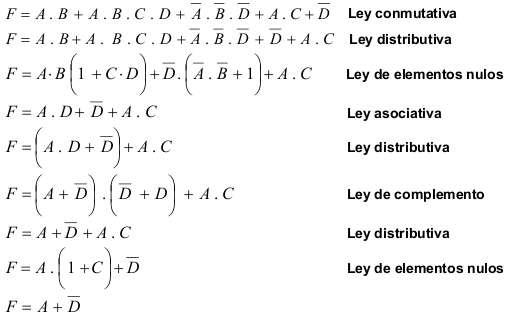
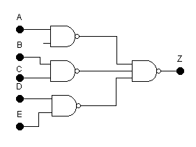
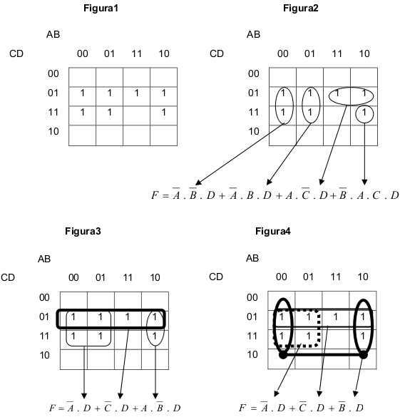
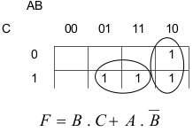
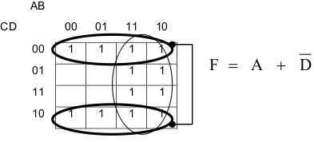
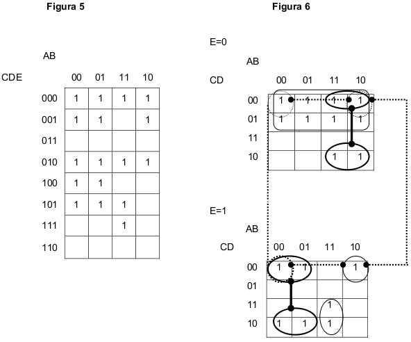
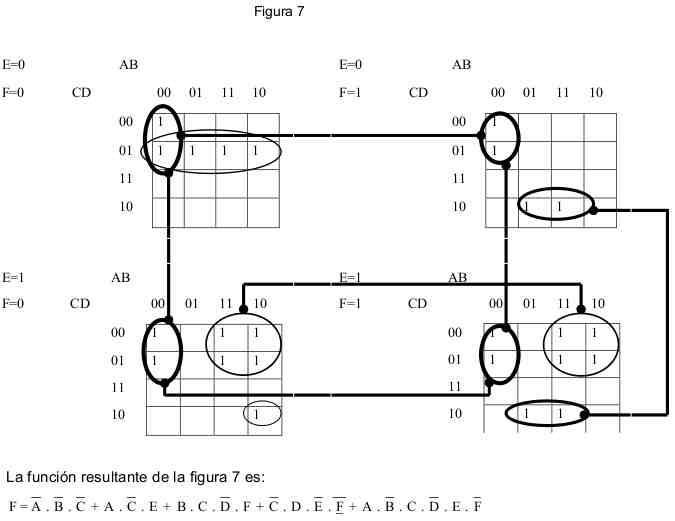
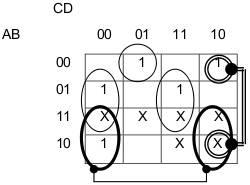
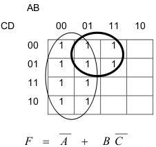

# Guía de Autoestudio — Codificación, Códigos Autocorrectores y Diagramas de Karnaugh

> Arquitectura de Computadoras — U.T.N. F.R.Re. — Ciclo lectivo 2018. Material de autoestudio que
> abarca conceptos de sistemas de información y procesamiento de datos, codificación de la
> información, códigos redundantes (paridad y Hamming) y circuitos combinacionales (álgebra de
> Boole, compuertas, formas normales y diagramas de Karnaugh).

Esta guía es transversal a la materia: la sección de **codificación** acompaña la
[Unidad Temática II](../practica/UT-2/) y la sección de **circuitos combinacionales** acompaña la
[Unidad Temática I](../practica/UT-1/).

## Contenido

- [Guía de Autoestudio — Codificación, Códigos Autocorrectores y Diagramas de Karnaugh](#guía-de-autoestudio--codificación-códigos-autocorrectores-y-diagramas-de-karnaugh)
  - [Contenido](#contenido)
  - [Concepto de sistema de información y procesamiento de datos](#concepto-de-sistema-de-información-y-procesamiento-de-datos)
  - [Procesamiento de datos](#procesamiento-de-datos)
  - [Organización general de una computadora](#organización-general-de-una-computadora)
  - [Hardware y software](#hardware-y-software)
  - [Codificación de la información](#codificación-de-la-información)
    - [Bits](#bits)
    - [Codificación de la información numérica](#codificación-de-la-información-numérica)
    - [Códigos ponderados](#códigos-ponderados)
    - [Códigos no ponderados](#códigos-no-ponderados)
    - [Codificación de la información no numérica](#codificación-de-la-información-no-numérica)
  - [Códigos redundantes](#códigos-redundantes)
    - [Control de paridad](#control-de-paridad)
    - [Control 2 en 3](#control-2-en-3)
    - [Código de Hamming](#código-de-hamming)
  - [Circuitos combinacionales](#circuitos-combinacionales)
    - [Compuertas lógicas](#compuertas-lógicas)
    - [Leyes del álgebra de Boole](#leyes-del-álgebra-de-boole)
    - [Circuitos equivalentes](#circuitos-equivalentes)
    - [Formas normales](#formas-normales)
    - [Diagramas de Karnaugh](#diagramas-de-karnaugh)
  - [Bibliografía](#bibliografía)

## Concepto de sistema de información y procesamiento de datos

**SISTEMA:** conjunto de componentes coordinados que trabajan juntos para lograr objetivos comunes.
Estos son la razón de su existencia y lo determinan en un ámbito dado.

> COMPONENTES + RELACIONES → SISTEMA (puede dividirse en SUBSISTEMAS)

**DATO:** representación simbólica de propiedades de entes o sucesos. Los datos se pueden
transmitir, almacenar (para su uso posterior) y transformar (operando sobre ellos para obtener
nuevos datos).

**INFORMACIÓN:** representación simbólica de entes, hechos, sucesos, cualidades, etc. que, por el
significado que les atribuye quien las percibe e interpreta, permiten disminuir la incertidumbre en
una decisión. La información permite, además de tomar la decisión, concretar la acción determinando
los pasos a realizar y la secuencia a seguir. En las máquinas, la información descriptiva se
encuentra en la memoria constituyendo programas que indican la secuencia de operaciones a seguir;
también existe información de control que permite verificar si las acciones planificadas se realizan
correctamente.

Tanto los datos como la información son representaciones simbólicas. La información no es material
ni tangible; puede ser transmitida, almacenada y procesada para obtener nuevas informaciones. Hay
que distinguir **transmitir** de **comunicar**: hay comunicación cuando el receptor asigna el mismo
significado que el que transmite.

## Procesamiento de datos

```
INPUTS                  OUTPUTS
DATOS  ─→  PROCESO DE DATOS  ─→  Información
(conjunto de símbolos)
```

**ESTRUCTURA DE DATOS:** conjunto de datos o símbolos organizado respondiendo a relaciones que no
existen antes de procesarlos.

**PROCESO:** conjunto finito de pasos que deben llevarse a cabo en un cierto orden para resolver un
problema.

- **Procesos secuenciales:** operaciones totalmente ordenadas en el tiempo que se realizan una por
  vez. Las máquinas con arquitectura Von Neumann realizan el procesamiento siguiendo este modelo: no
  comienzan una operación hasta haber terminado la anterior.
- **Procesos concurrentes:** hay operaciones que en su ejecución se superponen en el tiempo. Muchos
  procesadores actuales realizan procesos en forma simultánea, siempre y cuando no utilicen los
  mismos recursos (memoria, buses, etc.).

Las máquinas que procesan según el esquema de entrada → memoria → proceso → salida están basadas en
el modelo **Von Neumann**. La computadora dio origen a la **INFORMÁTICA**, definida como «todas las
tecnologías que colectivamente tratan la recolección, procesamiento y transmisión de información con
asistencia de un computador».

## Organización general de una computadora

- **Periféricos de entrada:** proporcionan al sistema los datos provenientes del exterior. Su
  función es sensar (detectar) la existencia de señales que representan símbolos (letras, números,
  etc.) y convertir esa señal eléctrica en señales eléctricas binarias internas.
- **Periféricos de salida:** envían al exterior los resultados almacenados en memoria, convirtiendo
  las señales binarias internas en señales adecuadas para el almacenamiento, visualización o
  transmisión.
- **Memoria principal o central:** almacena instrucciones y datos provenientes de los periféricos y
  guarda resultados intermedios y finales. En general un periférico no puede pasar información a
  otro sin que intervenga la M.C.
- **Procesador central:** lugar donde se ejecutan las instrucciones contenidas en la MC. Si está
  constituido por un único circuito integrado se denomina microprocesador (μP). Tiene tres secciones
  principales: Unidad de Control (U.C.), Unidad Aritmético-Lógica (U.A.L.) y registros auxiliares.
- **Canales** (Interfases de Adaptación y Control de Periféricos — IACP — y Unidades de Acceso
  Directo a Memoria — UADM): dispositivos intermedios entre los periféricos y la memoria; adaptan
  las diferencias de velocidad de funcionamiento entre la CPU y los periféricos mediante una memoria
  buffer de capacidad limitada. El acceso a memoria está en el orden de 10 a 100 ns (≈10⁷
  lecturas/escrituras por segundo), un disco necesita de 1 a 5 ms de posicionamiento y luego ≈500
  000 a 1 000 000 de transferencias/segundo, y una impresora rápida ≈6000 transferencias/segundo.

## Hardware y software

- **HARDWARE:** la porción material o «dura» que no cambia con cada proceso particular de datos. Es
  la totalidad física: circuitos electrónicos, plaquetas, cables, mecanismos, discos, cintas,
  gabinetes, pantallas, etc.
- **SOFTWARE:** sinónimo de programa; todos los programas que se pueden ejecutar en un equipo de
  computación.
- **FIRMWARE:** programas y datos incluidos en una parte de la memoria principal de almacenamiento
  permanente (no se borra al desconectar la fuente de alimentación). Esos circuitos integrados
  constituyen las memorias **ROM** (Read Only Memory); su contenido no puede cambiarse, solo leerse.
  Los programas en firmware son de uso muy frecuente: iniciadores de funcionamiento de máquina,
  verificación de hardware, traductores, etc.

## Codificación de la información

Para transmitir información existen dos problemas fundamentales: el HARDWARE y el LENGUAJE DE
COMUNICACIÓN. Así como el habla sería imposible sin lenguajes comunes, la comunicación entre
computadoras sería imposible sin coordinación de códigos de caracteres. Todas las computadoras
digitales actuales usan internamente un lenguaje binario; como muchos dispositivos están diseñados
para uso humano (teclados, monitores, impresoras), estos periféricos deben usar un código compatible
con la comunicación humana.

En sentido genérico **CÓDIGO** significa: sistema de signos y de reglas que permite formular y
comprender un mensaje. La **codificación** consiste en establecer una ley de correspondencia (el
código) entre las informaciones por representar y las posibles configuraciones binarias, de tal
manera que a cada información corresponda una —y generalmente solo una— configuración binaria.

- **Codificar:** transformar, mediante las reglas de un código, la formulación de un mensaje.
  Convertir un símbolo complejo en un grupo de símbolos más simples.
- **Decodificar:** aplicar inversamente las reglas del código a un mensaje codificado para obtener
  su forma primitiva.
- **Transcodificación:** aplicación de un cambio de código a una información ya codificada (ejemplo:
  EBCDIC a ASCII).

### Bits

La condición binaria posee una calidad BIVALUADA. Se denomina **BIT** (contracción de _binary
digit_) al dígito binario, independientemente del valor asignado (0 o 1). Ambos dígitos llevan la
misma cantidad de información, ya que la presencia de uno significa la ausencia del otro.

Con un bit se selecciona una información entre dos; con dos bits, una entre cuatro; con tres bits,
una entre ocho. Las posibilidades aumentan como potencias de dos. El número de bits _I_ necesarios
para codificar una cantidad de informaciones _N_ está determinado por:

```
I = log₂ N
```

Por ejemplo, para representar los 26 caracteres del alfabeto: `I = log₂ 26 = 4,7 → I = 5 bits`.

### Codificación de la información numérica

¿Cuántos bits se necesitan para representar los 10 símbolos del sistema decimal?
`I = log₂ 10 = 3,162… → 4`. Cualquier código que represente los números decimales precisará, como
mínimo, 4 bits. Cuando el código utilice más dígitos que los necesarios se denomina **CÓDIGO
REDUNDANTE**.

> **Nota I:** en cualquiera de los códigos numéricos (ponderados y no ponderados) cada dígito
> decimal se codifica por separado.
>
> **Nota II:** si bien los símbolos utilizados se corresponden con los del sistema binario, la
> representación codificada no tiene nada que ver con el SISTEMA BINARIO DE NUMERACIÓN.

Ejemplo: el número 345 se codifica dígito a dígito:

```
            3      4      5
en BCD    0011   0100   0101   →  345₍₁₀₎ = 001101000101₍BCD₎
en AIKEN  0011   0100   1011   →  345₍₁₀₎ = 001101001011₍AIKEN₎
```

### Códigos ponderados

Un **código ponderado** respeta, para la representación de cada dígito decimal, el «peso» que
corresponde a cada dígito binario según la posición que ocupa. Ejemplos: BCD (8421), AIKEN (2421), 8
4 −2 −1.

- **BCD (pesos 8 4 2 1):** respeta el peso del sistema binario de numeración para cada dígito.
- **AIKEN (2 4 2 1):** permite dos combinaciones para los dígitos 2 a 7; cualquiera es válida e
  incluso pueden mezclarse en un mismo número.
- **8 4 −2 −1** y **Exceso de tres:** en este último, cada dígito decimal se representa como en BCD
  pero excedido en 3 (la representación del 2 es la BCD del 5).

### Códigos no ponderados

En estos códigos la representación de cada dígito decimal es en principio arbitraria, o responde a
características que no son el «peso» de la posición. Ejemplo: **código de Gray**.

Construcción de la tabla del código de Gray (binario reflejado):

1. Se colocan los dos bits (0 y 1) y se traza una línea debajo (espejo); se copian los bits como si
   se reflejaran en dicho espejo.
2. Se completa la siguiente columna con 1 por debajo del espejo y 0 por encima.
3. Se repite la operación de reflejado con los números obtenidos.
4. Se completa la siguiente columna con 1 debajo del espejo y 0 por encima.
5. Se repite hasta completar los diez dígitos.

Tabla de los códigos numéricos más usuales:

| Dígito decimal | B.C.D. (8421) | Exceso de tres | AIKEN (2421) | 8 4 −2 −1 | Código de Gray |
| :------------: | :-----------: | :------------: | :----------: | :-------: | :------------: |
|       0        |     0000      |      0011      |     0000     |   0000    |      0000      |
|       1        |     0001      |      0100      |     0001     |   0111    |      0001      |
|       2        |     0010      |      0101      |     0010     |   0110    |      0011      |
|       3        |     0011      |      0110      |     0011     |   0101    |      0010      |
|       4        |     0100      |      0111      |     0100     |   0100    |      0110      |
|       5        |     0101      |      1000      |     1011     |   1011    |      0111      |
|       6        |     0110      |      1001      |     1100     |   1010    |      0101      |
|       7        |     0111      |      1010      |     1101     |   1001    |      0100      |
|       8        |     1000      |      1011      |     1110     |   1000    |      1100      |
|       9        |     1001      |      1100      |     1111     |   1111    |      1101      |

Comentarios sobre los códigos:

1. Los códigos Exceso de 3, 2421 y 8 4 −2 −1 son **autocomplementarios**: el complemento a 9 del
   número decimal se obtiene cambiando los ceros por unos y los unos por ceros.
2. El código de Gray (binario reflejado) tiene la particularidad de que de un dígito decimal al
   siguiente cambia siempre un solo dígito por vez.

> Los ejercicios de codificación de números decimales con cada código están desarrollados en la
> [Guía de Codificación de la UT-2](../practica/UT-2/guia-codificacion.md).

### Codificación de la información no numérica

**Condiciones para la codificación de caracteres:**

1. La representación debe englobar a las cifras en una de las formas descritas (BCD, 2421, etc.) y
   permitir distinguir rápidamente las cifras de los demás caracteres.
2. Debe permitir añadir nuevos caracteres específicos para una aplicación determinada.
3. En transmisiones, debe incluir un sistema de redundancia que permita la detección de errores.

**Carácter:** la cantidad de bits necesarios para representar los distintos símbolos del alfabeto
(letras, cifras, signos de puntuación, etc.). Cada carácter puede codificarse con un número variable
de bits según el código, pero dentro de un sistema todos los caracteres se representan con el mismo
número de bits. El ASCII se definió inicialmente con 6 bits (2⁶ = 64 caracteres); luego la ANSI lo
redefinió con 7 bits (128 caracteres). El EBCDIC, creado por IBM, utiliza 8 bits por carácter.

**Palabra:** conjunto de caracteres, fijo o variable, que la computadora trata como unidad; unidad
de información de rango superior al carácter y la unidad procesada por la máquina.

**Byte (octeto):** conjunto de 8 bits consecutivos tomados como unidad.

| Unidad              | Equivalencia |
| ------------------- | ------------ |
| 1 byte              | 8 bits       |
| 1 palabra           | 2 bytes      |
| 1 doble palabra     | 4 bytes      |
| 1 cuádruple palabra | 8 bytes      |
| 1 decabyte          | 10 bytes     |

> **Nota III:** el KILOBYTE (KB) representa 2¹⁰ unidades de información; una memoria de 1 KB
> almacena 1024 caracteres.

**Código EBCDIC** (_Expanded Binary Coded Decimal Interchange Code_): diseñado y utilizado por IBM,
sirvió de base para códigos posteriores. Usa 8 bits por carácter. Cada dígito decimal se representa
con 8 bits distribuidos en ZONA (4 bits de orden superior, secuencia fija `1111₍₂₎ = F₍₁₆₎`) y
DÍGITO (número decimal codificado en BCD). Los datos numéricos con zona no son aptos para procesarse
aritméticamente; para operar se elimina la zona de cada byte —operación llamada **empaque**—. Los
datos con zona se denominan información desempacada o **zoneada**; el resultado del empaque,
información **empaquetada** o decimal sin zona.

Ejemplo: representar 36 045 en EBCDIC:

```
F3 F6 F0 F4 F5            Decimal con zona (zoneado)
0 0 0 0 3 6 0 4 5 F       Decimal sin zona (empacado)   → medio byte de signo: F o C (+), B o D (−)
0 0 0 0 3 6 0 4 5 D       −36 045 (empacado)
```

En las representaciones internas, el punto decimal (coma) no se representa: queda implícito y nunca
forma parte física de la cifra; es el programador quien debe tenerlo en cuenta en la salida.

**Código ASCII** (_American Standard Code for Information Interchange_): usa 7 bits por carácter;
parte de las configuraciones codifican funciones de control. La mayoría de las máquinas agrega un
octavo bit para extender el código o usarlo como bit de paridad en transmisiones. Ventajas: las
letras y caracteres siguen una secuencia binaria continua (permite operaciones secuenciales sin
salir del lenguaje binario) y agrupa las funciones de control (analizando los dos primeros bits: dos
ceros → función de control; alguno distinto de cero → carácter). La zona numérica es siempre `011` y
el dígito corresponde a la representación BCD del número.

> Para la tabla completa de ambos códigos y los ejercicios de codificación alfanumérica, ver la
> [Guía de Codificación de la UT-2](../practica/UT-2/guia-codificacion.md).

## Códigos redundantes

Es difícil pensar en un equipo que funcione sin fallas durante un tiempo indefinido; para cada
máquina se define un **Tiempo Medio Entre Fallas (MTBF)**. La información puede alterarse durante la
transmisión o el almacenamiento; si el equipo puede detectar o, mejor aún, corregir esas
modificaciones, aumenta su confiabilidad.

- **Códigos autodetectores:** mediante bits de redundancia se puede detectar si la información
  recibida es correcta o no. El ejemplo más clásico es el control de paridad.
- **Códigos autocorrectores:** el receptor puede determinar si la información es correcta y, en caso
  de error, corregirlo.

### Control de paridad

Aunque no detecta errores dobles, es el más utilizado por su simplicidad y porque la probabilidad de
un error es muy pequeña (la de dos, mucho menor). Consiste en agregar a los bits de información un
bit más (generalmente el primero de la izquierda) que hace que la cantidad de unos transmitidos sea
PAR (paridad par) o IMPAR (paridad impar).

> Ejercicios de control de paridad en la
> [Guía de Codificación de la UT-2](../practica/UT-2/guia-codificacion.md).

### Control 2 en 3

Para transmitir «n» bits, se envían 3 veces esos «n» bits en forma sucesiva. Al analizarlos, el
receptor puede encontrar:

1. Las tres son idénticas → la información se toma como correcta.
2. Dos iguales y una distinta → el código actúa como **autocorrector**: selecciona una de las dos
   iguales como correcta.
3. Las tres distintas → el código actúa como **autodetector**: detecta error pero no puede
   determinar cuál es la información correcta.

### Código de Hamming

Permite detectar y corregir uno o más errores producidos durante la transmisión, para palabras de
cualquier número de bits. Analizamos el método para corregir un solo error.

Para un código de _i_ dígitos de información, se necesitan _p_ bits de control de paridad tales que,
considerando los casos de ningún error o un solo error, haya _i + p + 1_ condiciones identificables.
Como con _p_ bits se forman 2ᵖ combinaciones:

```
2ᵖ ≥ i + p + 1
```

| i (bits de información) | 1   | 2   | 3   | 4   | 5   | 6   | 7   | 8   | 9   | 10  | 11  | 12  |
| ----------------------- | --- | --- | --- | --- | --- | --- | --- | --- | --- | --- | --- | --- |
| p (bits de control)     | 2   | 3   | 3   | 3   | 4   | 4   | 4   | 4   | 4   | 4   | 4   | 5   |
| n (bits del mensaje)    | 3   | 5   | 6   | 7   | 9   | 10  | 11  | 12  | 13  | 14  | 15  | 17  |

Los bits de control se colocan en las posiciones correspondientes a las potencias de dos. Para un
mensaje de 4 bits de información (3 de control):

```
Posición:  7    6    5    4    3    2    1
           i3   i2   i1   p2   i0   p1   p0
```

Cada bit de paridad controla las posiciones que coinciden con un 1 en su columna de la tabla
binaria:

- `p0` controla las posiciones 1, 3, 5 y 7.
- `p1` controla las posiciones 2, 3, 6 y 7.
- `p2` controla las posiciones 4, 5, 6 y 7.

El bit de paridad debe hacer que la cantidad de unos controlados sea par.

> **Nota IV:** para un byte (8 bits) de información corresponde un mensaje de 12 bits.

**Control y corrección.** El receptor calcula (⊕ = OR exclusiva):

```
c0 = 1 ⊕ 3 ⊕ 5 ⊕ 7
c1 = 2 ⊕ 3 ⊕ 6 ⊕ 7
c2 = 4 ⊕ 5 ⊕ 6 ⊕ 7
```

Si un bit de control es 0 es correcto; si es 1, incorrecto. La posición del error se obtiene
ordenando los bits de control en forma decreciente (c2 c1 c0). Si todos son cero, no hay error.

Ejemplo — información a transmitir `1 1 0 1` (i3 i2 i1 i0), p = 3:

```
 7   6   5   4   3   2   1
 1   1   0   __  1   __  __
 i3  i2  i1  p2  i0  p1  p0

p0 : 1,3,5,7 → 0,1,0,1 → 0   (paridad par)
p1 : 2,3,6,7 → 1,1,1,1 → 1   (paridad par)
p2 : 4,5,6,7 → 0,0,1,1 → 0   (paridad par)

Mensaje transmitido:  1 1 0 0 1 1 0
```

Si al receptor llega `1 1 0 1 1 1 0`:

```
c0 = 0⊕1⊕0⊕1 = 0   correcto
c1 = 1⊕1⊕1⊕1 = 0   correcto
c2 = 1⊕0⊕1⊕1 = 1   incorrecto

c2 c1 c0 = 100₍₂₎ = 4 → error en la posición 4 (se invierte ese bit)
```

> Ejercicios de codificación y verificación con Hamming en la
> [Guía de Codificación de la UT-2](../practica/UT-2/guia-codificacion.md).

## Circuitos combinacionales

> Esta sección acompaña la [Unidad Temática I](../practica/UT-1/).

Un **sistema digital** es cualquier dispositivo destinado a la generación, transmisión,
procesamiento y almacenamiento de señales digitales (magnitudes físicas limitadas a valores
discretos). Los ordenadores digitales usan lógica binaria: las variables solo toman dos valores
(1/0, V/F, sí/no). Para el análisis y la simplificación se usa el **álgebra de Boole**, con tres
operaciones básicas:

- **AND:** también representada mediante `·`.
- **OR:** también representada mediante `+`.
- **NOT:** también representada mediante un apóstrofe `'` o una barra encima de la variable.

Tipos de sistemas digitales:

- **Combinacionales:** la salida depende solo de la entrada presente; no necesitan memoria.
- **Secuenciales:** la salida depende de la entrada actual y de las anteriores; necesitan elementos
  de memoria que recojan la «historia pasada» del sistema.

Definición formal: dado un conjunto _B_ y dos operadores `+` y `·`, es un álgebra de Boole si cumple
cierre respecto de ambos operadores, elementos identidad (0 para `+`, 1 para `·`), conmutatividad y
distributividad de cada operador respecto del otro, existencia de complemento (`x + x' = 1`,
`x · x' = 0`) y al menos dos elementos distintos.

**Principio de dualidad:** toda expresión booleana permanece válida si se intercambian los
operadores `+` y `·` y los elementos `0` y `1`.

> **Notas históricas.** George Boole (1815–1864) introdujo en 1854 un tratamiento sistemático de la
> lógica para un sistema algebraico. Claude E. Shannon (1916–2001) introdujo en 1938 un álgebra de
> Boole de dos valores (álgebra de conmutación) que representa las propiedades de los circuitos de
> conmutación eléctrica biestables.

### Compuertas lógicas

Una compuerta representa la realización de una función booleana: recibe una o más señales de entrada
y produce una señal de salida.

**OR** — suma lógica de las entradas:

|  X  |  Y  | Z = X + Y |
| :-: | :-: | :-------: |
|  0  |  0  |     0     |
|  0  |  1  |     1     |
|  1  |  0  |     1     |
|  1  |  1  |     1     |

**AND** — multiplicación lógica; salida 1 solo cuando todas las entradas son 1:

|  X  |  Y  | Z = X·Y |
| :-: | :-: | :-----: |
|  0  |  0  |    0    |
|  0  |  1  |    0    |
|  1  |  0  |    0    |
|  1  |  1  |    1    |

**NOT** — complemento o negación de la entrada:

|  X  |  X̄  |
| :-: | :-: |
|  0  |  1  |
|  1  |  0  |

También puede complementarse el resultado de una operación. El pequeño círculo a la salida de la
compuerta indica que internamente se realiza una inversión luego de la operación.

**NAND** (AND complementado):

|  X  |  Y  | X·Y | (X·Y)′ |
| :-: | :-: | :-: | :----: |
|  0  |  0  |  0  |   1    |
|  0  |  1  |  0  |   1    |
|  1  |  0  |  0  |   1    |
|  1  |  1  |  1  |   0    |

**NOR** (OR complementado):

|  X  |  Y  | X+Y | (X+Y)′ |
| :-: | :-: | :-: | :----: |
|  0  |  0  |  0  |   1    |
|  0  |  1  |  1  |   0    |
|  1  |  0  |  1  |   0    |
|  1  |  1  |  1  |   0    |

**OR exclusiva (XOR)** — salida 1 cuando alguna entrada es 1 pero no ambas:

|  X  |  Y  | Z = X⊕Y |
| :-: | :-: | :-----: |
|  0  |  0  |    0    |
|  0  |  1  |    1    |
|  1  |  0  |    1    |
|  1  |  1  |    0    |

**NOR exclusiva (XNOR)** — negación de la OR exclusiva:

|  X  |  Y  | Z = (X⊕Y)′ |
| :-: | :-: | :--------: |
|  0  |  0  |     1      |
|  0  |  1  |     0      |
|  1  |  0  |     0      |
|  1  |  1  |     1      |

### Leyes del álgebra de Boole

| Ley             | Expresiones                                                       |
| --------------- | ----------------------------------------------------------------- |
| Elementos nulos | A + 1 = 1 · A · 0 = 0                                             |
| Identidad       | A · 1 = A · A + 0 = A                                             |
| Complemento     | A + Ā = 1 · A · Ā = 0                                             |
| Idempotencia    | A + A = A · A · A = A                                             |
| Involutiva      | (Ā)̄ = A                                                           |
| Conmutativas    | A + B = B + A · A · B = B · A                                     |
| Asociativas     | A + (B + C) = (A + B) + C · A · (B · C) = (A · B) · C             |
| Distributivas   | A + (B · C) = (A + B) · (A + C) · A · (B + C) = (A · B) + (A · C) |
| Absorción       | A + (A · B) = A · A · (A + B) = A                                 |
| De Morgan       | (A + B)′ = Ā · B̄ · (A · B)′ = Ā + B̄                               |

**Ejemplo Nº 1.** Simplificar `F = Ā·B̄·C + Ā·B·C + A·B̄·C + A·B·C̄`:

1. Ley distributiva.
2. Ley de complemento.
3. Resultado: `F = B·C + A·B̄` (resuelto también con Karnaugh en el Ejemplo Nº 5).

**Ejemplo Nº 2.** Simplificar `F = A·B̄ + A·B̄·C·D + Ā·B̄·D + A·C + D`. La resolución completa, paso a
paso indicando la ley aplicada, es:



Resultado: `F = A + D̄`.

### Circuitos equivalentes

Dos o más circuitos construidos con compuertas de distinto tipo pueden presentar la misma tabla de
verdad o la misma forma normal, en cuyo caso son equivalentes. El teorema de De Morgan se usa con
frecuencia para transformarlos.

Por ejemplo, partiendo de `Z = A + B·C + D·E`, aplicando negación, De Morgan e involutiva:

```
Z = ((A)′ · (B·C)′ · (D·E)′)′
```

Esta expresión está constituida solo por compuertas NAND (salvo el término Ā, que se reemplaza por
una NAND actuando como inversor): así se transforma un circuito «AND-OR» en uno equivalente
«NAND-NAND»:



**Ejemplo Nº 3.** La misma expresión puede transformarse a «NOR-NOR» aplicando sucesivas negaciones
de ambos miembros y De Morgan, obteniendo una expresión equivalente formada por compuertas NOR.

### Formas normales

De las múltiples expresiones equivalentes de una función, se estudian las **formas normales** o
canónicas: la suma de productos (minitérminos) o, equivalentemente, el producto de sumas
(maxitérminos).

Cada producto formado por todas las variables en juego (o sus negaciones individuales) se denomina
**minitérmino**. Para hallar la **Forma Normal Disyuntiva (FND)** a partir de la tabla de verdad, en
las filas donde la función vale 1 se toma el producto de todas las variables (reemplazando los 0 por
las negadas y los 1 por las sin negar) y se suman los minitérminos.

Cada suma con todas las variables (o sus negaciones) se denomina **maxitérmino**. Para hallar la
**Forma Normal Conjuntiva (FNC)**, en las filas donde la función vale 0 se forman sumas de todas las
variables (reemplazando los 1 por las negadas y los 0 por las sin negar) y se multiplican los
maxitérminos.

Ejemplo (salida 1 cuando hay número par de unos o ninguna entrada en uno):

```
FND = Ā·B̄·C̄ + Ā·B·C + A·B̄·C + A·B·C̄
FNC = (A + B + C̄)·(A + B̄ + C)·(Ā + B + C)·(Ā + B̄ + C̄)
```

### Diagramas de Karnaugh

El diagrama de Karnaugh permite determinar, entre las expresiones suma de productos o producto de
sumas, las más simples (circuitos con el menor número de compuertas y/o entradas por compuerta).

**Método general de minimización:**

1. Representar la función a minimizar (suma de productos o producto de sumas).
2. Agrupar todas las celdas en grupos potencia de 2 (1, 2, 4 u 8) sin dejar ninguna libre, buscando
   el menor número de agrupamientos (máxima cantidad de elementos por grupo).
3. Eliminar variables para obtener sumandos con el menor número posible de variables.

**Ejemplo Nº 4.** Dada `F = B̄·D·C̄ + A·B̄·D + B·D + B̄·C·D + A·B·C̄·D`, obtener la tabla de verdad y
simplificar. Las figuras 1 a 4 muestran tres maneras de agrupar las celdas; las figuras 3 y 4
presentan el mínimo número de agrupamientos y, entre ellas, la figura 4 contiene un agrupamiento con
mayor número de celdas, resultando la función mínima `F = Ā·D + C̄·D + B·D`:



**Ejemplo Nº 5.** El Ejemplo Nº 1 (resuelto antes por leyes de Boole) se resuelve también por
Karnaugh, obteniendo la misma función `F = B·C + A·B̄`:



**Ejemplo Nº 6.** El Ejemplo Nº 2 resuelto por mapas de Karnaugh, obteniendo `F = A + D̄`:



**Karnaugh para 5 variables.** La minimización puede efectuarse considerando primero diagramas de
cuatro variables independientes, enlazando luego las celdas cuyos «unos» ocupan la misma posición en
dos diagramas adyacentes; por último se agrupan las celdas con «unos» ubicados igualmente en los
cuatro diagramas. La figura 5 define las coordenadas de las 32 combinaciones de una función de 5
variables.

**Ejemplo Nº 7.** Dada una función de 5 variables (17 minitérminos), como en una mitad del diagrama
E = 0 y en la otra E = 1, se lo divide en dos diagramas de 4 variables (figura 6). La función
obtenida es `F = C·Ē + Ā·B̄·C·E + A·D̄·E + A·D·Ē + B·C·D`:



**Karnaugh para 6 variables.** Las 64 combinaciones de una función de 6 variables pueden
determinarse en 4 diagramas de 4 variables (figura 7).

**Ejemplo Nº 8.** Función de 6 variables resuelta sobre la figura 7:



**Funciones no definidas totalmente.** Aunque las salidas de un circuito de «n» entradas responden a
las 2ⁿ combinaciones posibles, a veces solo se usan algunas. Las combinaciones no utilizadas pueden
valer indistintamente 1 o 0 y se indican con una «x». Las funciones con esta propiedad se conocen
como **funciones no totalmente definidas**.

Pasos para resolver un problema combinacional a partir de un enunciado en lenguaje corriente:

1. Descomponer el enunciado en el menor número posible de enunciados simples representables por
   variables lógicas (serán las entradas del circuito).
2. Confeccionar la tabla de funcionamiento (valor de salida para cada combinación de entradas).
3. Minimizar para obtener una expresión sencilla.
4. Construir el circuito a partir de la expresión minimizada.

**Ejemplo Nº 9.** Diez teclas numeradas del 0000 al 1001; el circuito debe verificar, según la tecla
oprimida, si presenta un número impar de «unos». Las combinaciones 1010 a 1111 son «x» (don't care).
Solo deben tomarse las «x» que sirvan para aumentar el tamaño de los grupos; no deben formarse
grupos que contengan solo «x» (para esos casos las «x» se consideran ceros). Resultado:
`F = B̄·C·D̄ + A·B̄·C̄·D̄ + B̄·C̄·D + A·D̄ + B·C̄·D`:



**Ejemplo Nº 10.** Diseñar un circuito combinacional que controle si un número de cuatro bits es
válido en el código de Gray. Resultado `F = Ā + B·C̄`:



## Bibliografía

- M. Morris Mano, _Ingeniería Computacional_. 1.ª Ed., 1991. Prentice Hall.
- Julio M. Pérez, _Técnicas Digitales y Microelectrónica_. 1.ª Ed., 1985. Arbó.
- John P. Hayes, _Computer Architecture and Organization_. 6.ª reimpresión, 1985. Mc Graw-Hill.
