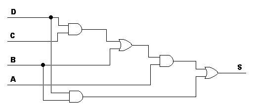
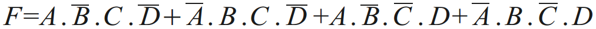
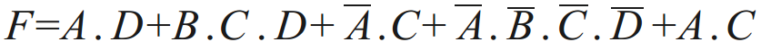
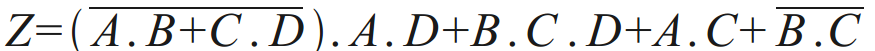
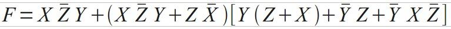
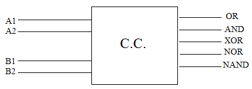
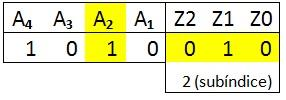
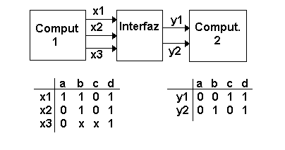
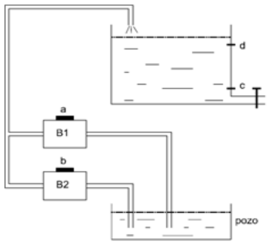
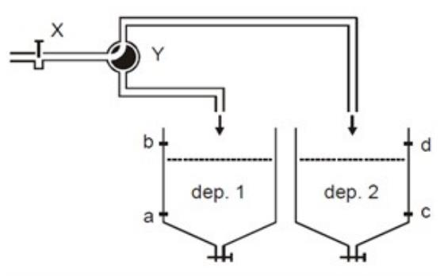

# Guía de Trabajos Prácticos — Circuitos Combinacionales

> Arquitectura de Computadoras — U.T.N. F.R.Re. — Ciclo lectivo 2018.
> Unidad Temática I. Incluye guía de trabajos prácticos de clase y ejercicios complementarios.

## Contenido

- [Trabajos Prácticos de Clase](#trabajos-prácticos-de-clase)
- [Ejercicios Complementarios](#ejercicios-complementarios)

## Trabajos Prácticos de Clase

**1.** Escriba la tabla de verdad de las funciones OR, NOR, AND, NAND, OR-EXCLUSIVA.

| A | B | OR | NOR | AND | NAND | OR-EX |
|---|---|----|-----|-----|------|-------|
| 0 | 0 |    |     |     |      |       |
| 0 | 1 |    |     |     |      |       |
| 1 | 0 |    |     |     |      |       |
| 1 | 1 |    |     |     |      |       |

**2.** Dada la siguiente tabla de verdad, con variables de entrada A, B, C y salidas X, Y, Z. Se solicita:
a. Obtener la función booleana como producto de sumas.
b. Obtener la función booleana como suma de productos.
c. Construir el diagrama de subconjuntos (diagramas de Karnaugh).
d. Construir el circuito simplificado.

| A | B | C | X | Y | Z |
|---|---|---|---|---|---|
| 0 | 0 | 0 | 0 | 1 | 1 |
| 0 | 0 | 1 | 1 | 1 | 0 |
| 0 | 1 | 0 | 0 | 1 | 0 |
| 0 | 1 | 1 | 1 | 0 | 1 |
| 1 | 0 | 0 | 0 | 0 | 1 |
| 1 | 0 | 1 | 1 | 1 | 1 |
| 1 | 1 | 0 | 0 | 1 | 0 |
| 1 | 1 | 1 | 1 | 1 | 1 |

**3.** Dada la siguiente tabla de verdad, con variables de entrada X, Y, Z y salidas C, S. Se solicita lo mismo que en el ejercicio 2.

| X | Y | Z | C | S |
|---|---|---|---|---|
| 0 | 0 | 0 | 0 | 0 |
| 0 | 0 | 1 | 0 | 1 |
| 0 | 1 | 0 | 0 | 1 |
| 0 | 1 | 1 | 1 | 0 |
| 1 | 0 | 0 | 0 | 1 |
| 1 | 0 | 1 | 1 | 0 |
| 1 | 1 | 0 | 1 | 0 |
| 1 | 1 | 1 | 1 | 1 |

| X | Y | C | S |
|---|---|---|---|
| 0 | 0 | 0 | 0 |
| 0 | 1 | 0 | 1 |
| 1 | 0 | 0 | 1 |
| 1 | 1 | 1 | 0 |

**4.** Obtener una salida S igual a la del siguiente circuito, pero utilizando únicamente compuertas NAND (el menor número posible).

**5.** Simplificar la siguiente expresión utilizando el método de las reglas del álgebra de Boole, explicando en cada paso la ley utilizada. Comprobar con el método de Karnaugh:

**6.** Simplificar la siguiente expresión utilizando los teoremas del álgebra de Boole. Comprobar con el método de Karnaugh. Luego transformarlo a un circuito NOT–NOR:

**7.** Simplificar las siguientes expresiones utilizando las leyes del álgebra de Boole y dibujar el circuito correspondiente. Indicar en cada paso la ley aplicada:

**8.** Un circuito combinacional tiene cuatro entradas y una salida; la salida es verdadera cuando:

- Todas las entradas son iguales a 1.
- Ninguna de las entradas es igual a 1.
- Un número impar de entradas son iguales a 1.

Se solicita:
a. Obtener la tabla de verdad.
b. Obtener la función booleana como producto de sumas.
c. Obtener la función booleana como suma de productos.
d. Construir el diagrama de subconjuntos (diagramas de Karnaugh).
e. Construir el circuito simplificado.

**9.** Diseñe un circuito combinacional que convierta un dígito decimal del código BCD en el código AIKEN.

**10.** Diseñe un circuito combinacional que genere los bits de paridad, según el método de Hamming para 4 bits de información.

**11.** Diseñe un circuito que compare dos números de 4 bits (A y B). El circuito deberá tener tres salidas que indiquen si A > B, si A < B o si A = B.

**12.** Construir un circuito combinacional cuya entrada es un número de 4 bits y cuya salida es el complemento a la base del número de entrada.

## Ejercicios Complementarios

**1.** Simplifique la función F tanto como sea posible utilizando el método de las reglas del álgebra de Boole, explique en cada paso la ley utilizada. Compruebe con el método de Karnaugh:

**2.** Demuestre que:
a. (A + B)(Ā + C)(B + C) = (A + B)(Ā + C)
b. (AB + C̄ + D)(C̄ + D)(C̄ + D + E) = AB·C̄ + D

**3.** Realice:
a. un inversor a partir de compuertas NOR
b. una OR a partir de compuertas NOR
c. una AND a partir de compuertas NOR
d. una AND a partir de compuertas NAND

**4.** Se necesita diseñar un inversor (NOT) pero solo dispone de compuertas XOR. ¿Puede realizar el diseño? Justifique su respuesta.

**5.** Diseñe un circuito combinacional que detecte un error en la representación de un dígito decimal representado en BCD. En otras palabras, obtenga un diagrama lógico cuya salida sea 1 cuando las entradas contienen una combinación no usada en el código BCD.

**6.** Diseñe un circuito combinacional que convierta un dígito decimal del código 8, 4, -2, -1 en el código BCD.

**7.** Diseñe un circuito combinacional que convierta un dígito decimal del código BCD en el código exceso en 3.

**8.** Diseñar un circuito de 4 entradas y 4 salidas tal que transforme una entrada binaria en una salida GRAY.

**9.** Diseñar un circuito de 4 entradas y 4 salidas tal que convierta un dígito decimal del código BCD en el código [2 4 2 1].

**10.** Es necesario multiplicar dos números binarios, cada uno de dos bits de largo, con objeto de formar su producto en binario. Los dos números se representan por las entradas A₁, A₀ y B₁, B₀, donde el subíndice 0 denota el bit menos significativo.

- Determine el número de líneas de salida requeridas.
- Encuentre las expresiones booleanas simplificadas para cada salida.

**11.** Se tienen dos números de dos bits cada uno, para lo cual se requiere un circuito combinacional que utilice esos números como entrada para realizar el cálculo de las siguientes operaciones lógicas: OR, AND, XOR, NOR, NAND.

**12.** En una organización los cuatro socios se distribuyen las acciones según A = 45 %, B = 30 %, C = 15 % y D = 10 %. Cada miembro tiene un porcentaje de voto igual a su número de acciones. Para aprobar una moción los votos afirmativos deben superar el 50 %. Si los votos superan el 30 % pero no alcanzan el 50 % requerido para su aprobación se la deja pendiente, y si es igual o inferior a 30 % se descarta la moción. Diseñar un circuito combinacional para resolver el problema.

**13.** Diseñe un circuito combinacional que tome un número de 5 bits (A₄, A₃, A₂, A₁, A₀) y produzca una salida Y que sea verdadera si la entrada representa un número primo.

**14.** Diseñe un circuito combinacional que tome un número de 5 bits (A₄, A₃, A₂, A₁, A₀) y produzca una salida Y que sea verdadera si la entrada es múltiplo de 3.

**15.** Diseñe un circuito combinacional para controlar el funcionamiento de dos motores M1 y M2. Para ello se posee tres interruptores A, B y C, y su funcionamiento es el siguiente:

1. Si A está cerrado y los otros dos no, se activa M1.
2. Si C está cerrado y los otros dos no, se activa M2.
3. Si los tres interruptores están cerrados se activan M1 y M2.

Para el resto de condiciones los motores estarán parados.

**16.** Un circuito combinacional posee cuatro entradas para su control: A, B, C y D. El circuito indica que está encendido cuando están cerrados 3 y sólo 3 de ellos. Construir el esquema lógico mediante compuertas NOR.

**17.** Diseñe un circuito combinacional con un total de 4 entradas (A₄, A₃, A₂, A₁) y 3 salidas (Z₂, Z₁, Z₀). La salida del circuito representa el equivalente binario al número del subíndice de la entrada activa (1 lógico). Puesto que simultáneamente puede haber varias entradas activas, se fijará prioridad a la entrada activa de menor subíndice. En el caso de que ninguna de las entradas se encuentre activa, a la salida se obtiene el equivalente binario del decimal "5". Realizar el circuito lógico mediante puertas NAND de 2 entradas. Ejemplo:

**18.** Se desea diseñar un circuito que sirva de interfaz entre dos computadoras, que permita transmitir desde la computadora 1 a la computadora 2 las primeras cuatro letras del alfabeto.

Como se observa en el diagrama, la computadora 1 utiliza un código de representación de 3 bits y la computadora 2 utiliza un código de representación de 2 bits. La interfaz a diseñar tendrá como función la de modificar el código de las letras.

**19.** A los lados de un río hay un hombre (H), un lobo (L), una oveja (V) y un repollo (R). El hombre no está hambriento, luego no tiene la menor intención de comer nada, pero además tampoco permite que ninguno de los demás coma. El lobo y la oveja sí están hambrientos, pero el lobo (exclusivamente carnívoro) no podrá comerse a la oveja si el hombre está en su misma orilla, y lo mismo le sucederá a la oveja (exclusivamente vegetariana) con el repollo. Se pide:

- Hallar la tabla de verdad de la función Fc(H, L, V, R) sabiendo que debe valer 1 si alguien ha comido a alguien o a algo, y 0 en caso contrario. Sugerencia: codificar las variables con 1 para la orilla izquierda y 0 para la derecha.
- Expresar la función en forma de producto de maxitérminos.
- Simplificar la función dejándola en forma de producto de sumas con variables simples, utilizando el método más conveniente.
- Materializar la función empleando únicamente puertas NOR (de dos o más entradas) e inversores.

**20.** Se desea controlar dos bombas B1 y B2 de acuerdo con el nivel de líquido existente en un depósito. Su funcionamiento ha de ser tal como se indica a continuación: cuando el nivel de líquido se encuentra comprendido entre los dos sensores "c" y "d", debe funcionar la bomba B1 (o B2 si la temperatura de su motor alcanza un cierto límite prefijado), y se detiene cuando se activa el sensor "d". Si el nivel de líquido se encuentra por debajo de "c" se deben activar ambas bombas. En caso de funcionamiento anormal de los sensores del depósito (se active "d" cuando no lo esté "c"), ambas bombas se pararán. Además, ambas bombas cuentan con sendos detectores de temperatura "a" y "b" para B1 y B2 respectivamente, de forma que si la temperatura de su motor supera un cierto límite, el detector se activará y la correspondiente bomba se debe parar de forma automática.

Se pide diseñar el circuito de control según el orden siguiente:

- Definir cuáles son las variables de entrada y de salida.
- Obtener la tabla de verdad que represente el funcionamiento del circuito.
- Expresar las funciones en forma de minitérminos y simplificarlas por Karnaugh.
- Implementar el circuito de control de la señal B1 con puertas NAND.
- Implementar el circuito de control de la señal B2 con puertas NOR.

**21.** El esquema de la figura representa el sistema de llenado de dos depósitos de combustible. Para el control de este sistema se dispone de una electroválvula de cierre y otra de selección de depósito gobernadas por las señales digitales X e Y respectivamente. Cuando la señal X está a "0" la electroválvula de entrada se abre y cuando está a "1" se cierra. La electroválvula de selección de depósito dirige todo el caudal de entrada al depósito 1 cuando la señal Y está a "0" y al depósito 2 en caso contrario. Para el control del nivel de los depósitos se han dispuesto cuatro detectores de nivel a, b, c y d. Estos detectores proporcionan una señal digital que toma valor "1" cuando el nivel de combustible sube por encima de la posición del sensor y permanece a "0" en otro caso. Los detectores a y c indican el nivel mínimo de los depósitos, mientras que b y d el nivel máximo.

El comportamiento deseado para el sistema de control debe cumplir las siguientes reglas:

- Si ambos depósitos están por debajo del mínimo, el caudal de entrada debe dirigirse al depósito 1.
- Si ambos depósitos están a medias (por encima del mínimo y por debajo del máximo), el caudal de entrada debe dirigirse también al depósito 1.
- Si se alcanza el nivel máximo en los dos depósitos, se debe cerrar la electroválvula de entrada.
- En caso de que el nivel detectado en un depósito sea superior al del otro, el caudal de entrada se dirigirá al depósito más vacío.
- En caso de detección anómala de nivel (nivel por encima del máximo y por debajo del mínimo simultáneamente en alguno de los depósitos), se cerrará la electroválvula de entrada por seguridad.
- Cuando la electroválvula de entrada está cerrada, el valor de la señal de selección de depósito es irrelevante.

Determinar la tabla de verdad del circuito necesario para el gobierno de las señales X e Y a partir de los niveles de a, b, c y d. Realizar el circuito de control.

**22.** Diseñe un circuito combinacional que responda al comportamiento de la siguiente tabla. La misma indica los tipos de monedas a ingresar (y la combinación de ellos indica su monto) y como salida el vuelto que la máquina expendedora de tickets tiene que dar a cambio. Basándose en la tabla, se solicita simplificación y circuito asociado.

| PAGO 0,10 (A) | PAGO 0,25 (B) | PAGO 0,50 (C) | PAGO 1,00 (D) | VUELTO 0,10 (W) | VUELTO 0,25 (X) | VUELTO 0,50 (Y) | VUELTO 1,00 (Z) |
|---|---|---|---|---|---|---|---|
| 0 | 0 | 0 | 0 | 0 | 0 | 0 | 0 |
| 0 | 0 | 0 | 1 | 0 | 1 | 0 | 0 |
| 0 | 0 | 1 | 0 | 0 | 0 | 1 | 0 |
| 0 | 0 | 1 | 1 | 0 | 1 | 1 | 0 |
| 0 | 1 | 0 | 0 | 0 | 1 | 0 | 0 |
| 0 | 1 | 0 | 1 | 0 | 0 | 1 | 0 |
| 0 | 1 | 1 | 0 | 0 | 0 | 0 | 0 |
| 0 | 1 | 1 | 1 | 0 | 0 | 0 | 1 |
| 1 | 0 | 0 | 0 | 1 | 0 | 0 | 0 |
| 1 | 0 | 0 | 1 | 1 | 1 | 0 | 0 |
| 1 | 0 | 1 | 0 | 1 | 0 | 1 | 0 |
| 1 | 0 | 1 | 1 | 1 | 1 | 1 | 0 |
| 1 | 1 | 0 | 0 | 1 | 1 | 0 | 0 |
| 1 | 1 | 0 | 1 | 1 | 0 | 1 | 0 |
| 1 | 1 | 1 | 0 | 1 | 0 | 0 | 0 |
| 1 | 1 | 1 | 1 | 1 | 0 | 0 | 1 |

**23.** En un proceso de evaluación de calidad de un software se utilizan cuatro parámetros para evaluar su calidad. Para eso se analiza cada módulo de programa con las siguientes consideraciones:

- **(A) Tiempo:** si el módulo fue desarrollado en menos de 8 horas (1) o en un tiempo superior (0).
- **(B) Errores:** si contiene errores de sintaxis (1) o está bien escrito (0).
- **(C) Respuesta a los requisitos:** si cumple exactamente con el objetivo del programa (1) o no (0).
- **(D) Reutilización de código:** si el código escrito puede ser reutilizado en otras aplicaciones (1) o no (0).

Se solicita la confección de un circuito combinacional que devuelva como resultado una evaluación del software, conociendo los siguientes resultados:

- **(Z1) Programa aceptado:** se realizó en menos de 8 hs, no tiene errores, cumple con el objetivo y se puede reutilizar.
- **(Z2) Programa rechazado:** contiene errores y no cumple con el objetivo para el cual fue desarrollado.
- **(Z3) Programa a revisión:** si el tiempo utilizado es inferior a 8 hs, pero no es reutilizable y contiene errores de programación.

Para esto se pide:
1. Tabla de comportamiento.
2. Ecuaciones de salidas simplificadas.
3. Circuito combinacional asociado.

**24.** Utilizando el álgebra de Boole, hallar la forma simplificada de las siguientes funciones.

> _Nota: las funciones de este ejercicio no figuran en el PDF original de la guía._
