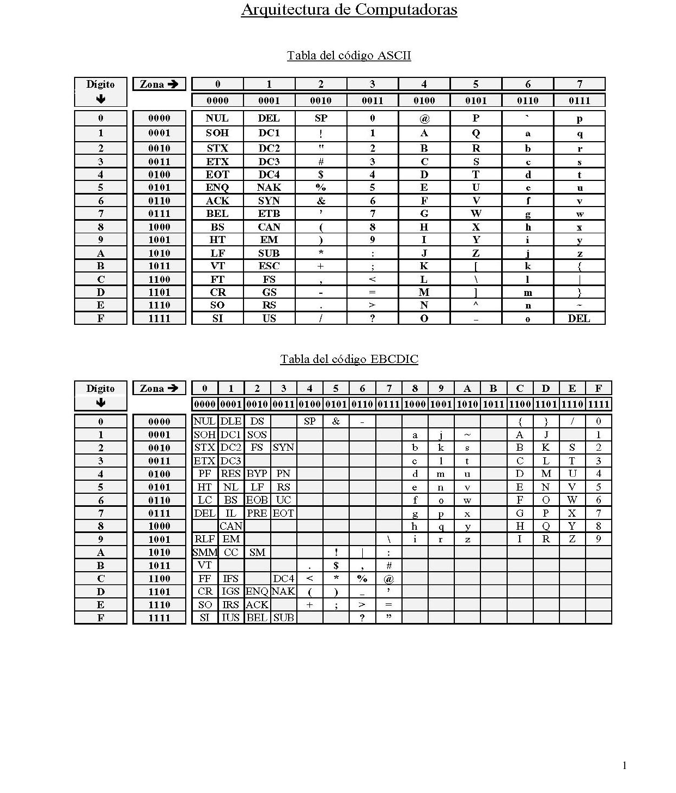

# Guía de Trabajos Prácticos — Codificación

> Arquitectura de Computadoras — U.T.N. F.R.Re. — Ciclo lectivo 2018. Unidad Temática II. Sistemas de
> numeración, codificación de la información numérica, códigos autocorrectores y codificación de la
> información alfanumérica.

## Contenido

- [Sistemas de Numeración](#sistemas-de-numeración)
- [Códigos numéricos para dígitos decimales](#códigos-numéricos-para-dígitos-decimales)
- [Guía de ejercicios de códigos numéricos](#guía-de-ejercicios-de-códigos-numéricos)
  - [1. Código BCD (8 4 2 1)](#1-código-bcd-8-4-2-1)
  - [2. Código 2 4 2 1](#2-código-2-4-2-1)
  - [3. AIKEN (2 4 2 1)](#3-aiken-2-4-2-1)
  - [4. Código 8 4 −2 −1](#4-código-8-4--2--1)
  - [5. Exceso de tres](#5-exceso-de-tres)
  - [6. Gray](#6-gray)
- [Código detector de paridad](#código-detector-de-paridad)
- [Código autocorrector de Hamming](#código-autocorrector-de-hamming)
- [Codificación alfanumérica](#codificación-alfanumérica)

## Sistemas de Numeración

1. Convierta a su forma binaria.
   - a) 43027₍₈₎
   - b) A3CBEFD₍₁₆₎
   - c) 356₍₁₀₎
   - d) 526₍₇₎
2. Convierta a la forma octal.
   - a) 1001101,01100001₍₂₎
   - b) 1F4₍₁₆₎
3. Convierta a forma hexadecimal.
   - a) 15321₍₁₀₎
   - b) 100101100₍₂₎
4. Convierta a forma decimal.
   - a) 3D4Bf₍₁₆₎
   - b) 3E8,ABF₍₁₆₎
5. Convierta a la forma binaria aplicando pasaje directo.
   - a) 3D59₍₁₆₎
   - b) 7BA3,BC₍₁₆₎
   - c) 3D59₍₁₆₎
   - d) 5274₍₈₎
   - e) 3614₍₈₎
6. Convertir:
   - a) el número decimal 7820 a octal, binario, Hex, BCD y a su equivalente en base 5.
   - b) el binario 0,01001111 a decimal.
   - c) a decimal y hexadecimal el número octal 1024,75.
   - d) a octal y binario los números Hex.: 3AE y 7F,CB.
7. Dados los símbolos "3" y "9", decir cuánto valen si se leen dichos símbolos en Hex, en decimal y
   en octal.
8. Sean los símbolos 1011, leer dicha información en binario, en octal y en base 5, diciendo en cada
   caso cuál es el equivalente decimal.
9. Dado un número del tipo 10₍ₓ₎ [uno cero en base x] indicar qué número es en base 10.

## Códigos numéricos para dígitos decimales

| Dígito decimal | B.C.D. (8421) | Exceso de tres | AIKEN (2421) | 8 4 −2 −1 | Código de Gray |
| :------------: | :-----------: | :------------: | :----------: | :-------: | :------------: |
|       0        |     0000      |      0011      |     0000     |   0000    |      0000      |
|       1        |     0001      |      0100      |     0001     |   0111    |      0001      |
|       2        |     0010      |      0101      |     0010     |   0110    |      0011      |
|       3        |     0011      |      0110      |     0011     |   0101    |      0010      |
|       4        |     0100      |      0111      |     0100     |   0100    |      0110      |
|       5        |     0101      |      1000      |     1011     |   1011    |      0111      |
|       6        |     0110      |      1001      |     1100     |   1010    |      0101      |
|       7        |     0111      |      1010      |     1101     |   1001    |      0100      |
|       8        |     1000      |      1011      |     1110     |   1000    |      1100      |
|       9        |     1001      |      1100      |     1111     |   1111    |      1101      |

## Guía de ejercicios de códigos numéricos

Completar las tablas codificando cada dígito decimal según el código indicado. Se muestra como
ejemplo la primera fila resuelta.

### 1. Código BCD (8 4 2 1)

|     Decimal     |  8421   |  8421   |  8421   |  8421   |  8421   |
| :-------------: | :-----: | :-----: | :-----: | :-----: | :-----: |
| 70922₍₁₀₎ | 0111 | 0000 | 1001 | 0010 | 0010 |
| 12345₍₁₀₎ |  |  |  |  |  |
| 68284₍₁₀₎ |  |  |  |  |  |
| 95135₍₁₀₎ |  |  |  |  |  |
| 35746₍₁₀₎ |  |  |  |  |  |
| 87453₍₁₀₎ |  |  |  |  |  |
| 25846₍₁₀₎ |  |  |  |  |  |

### 2. Código 2 4 2 1

|     Decimal     |  2421   |  2421   |  2421   |  2421   |  2421   |
| :-------------: | :-----: | :-----: | :-----: | :-----: | :-----: |
| 70922₍₁₀₎ | 0111 | 0000 | 1111 | 0010 | 1000 |
| 12345₍₁₀₎ |  | 0010 |  |  |  |
| 68284₍₁₀₎ |  |  | 1000 |  |  |
| 95135₍₁₀₎ |  |  |  |  |  |
| 35746₍₁₀₎ |  |  |  |  |  |
| 87453₍₁₀₎ |  |  |  |  |  |
| 25846₍₁₀₎ | 0010 |  |  |  |  |

> Aclaración: el código 2 4 2 1 permite dos combinaciones de los dígitos 2, 3, 4, 5, 6 y 7.
> Cualquiera es válida; más aún, en un mismo número con varios dígitos iguales pueden usarse
> codificaciones distintas.

### 3. AIKEN (2 4 2 1)

|     Decimal     |  2421   |  2421   |  2421   |  2421   |  2421   |
| :-------------: | :-----: | :-----: | :-----: | :-----: | :-----: |
| 70922₍₁₀₎ | 0111 | 0000 | 1111 | 0010 | 0010 |
| 12345₍₁₀₎ |  | 0010 |  |  |  |
| 68284₍₁₀₎ |  |  | 0010 |  |  |
| 95135₍₁₀₎ |  |  |  |  |  |
| 35746₍₁₀₎ |  |  |  |  |  |
| 87453₍₁₀₎ |  |  |  |  |  |
| 25846₍₁₀₎ | 0010 |  |  |  |  |

### 4. Código 8 4 −2 −1

|     Decimal     | 8 4 −2 −1 | 8 4 −2 −1 | 8 4 −2 −1 | 8 4 −2 −1 | 8 4 −2 −1 |
| :-------------: | :-------: | :-------: | :-------: | :-------: | :-------: |
| 70922₍₁₀₎ | 1001 | 0000 | 1111 | 0110 | 0110 |
| 12345₍₁₀₎ |  |  |  |  |  |
| 68284₍₁₀₎ |  |  |  |  |  |
| 95135₍₁₀₎ |  |  |  |  |  |
| 35746₍₁₀₎ |  |  |  |  |  |
| 87453₍₁₀₎ |  |  |  |  |  |
| 25846₍₁₀₎ |  |  |  |  |  |

### 5. Exceso de tres

|     Decimal     |         |         |         |         |         |
| :-------------: | :-----: | :-----: | :-----: | :-----: | :-----: |
| 70922₍₁₀₎ | 1010 | 0011 | 1100 | 0101 | 0101 |
| 12345₍₁₀₎ |  |  |  |  |  |
| 68284₍₁₀₎ |  |  |  |  |  |
| 95135₍₁₀₎ |  |  |  |  |  |
| 35746₍₁₀₎ |  |  |  |  |  |
| 87453₍₁₀₎ |  |  |  |  |  |
| 25846₍₁₀₎ |  |  |  |  |  |

### 6. Gray

|     Decimal     |         |         |         |         |         |
| :-------------: | :-----: | :-----: | :-----: | :-----: | :-----: |
| 70922₍₁₀₎ | 0100 | 0000 | 1101 | 0011 | 0011 |
| 12345₍₁₀₎ |  |  |  |  |  |
| 68284₍₁₀₎ |  |  |  |  |  |
| 95135₍₁₀₎ |  |  |  |  |  |
| 35746₍₁₀₎ |  |  |  |  |  |
| 87453₍₁₀₎ |  |  |  |  |  |
| 25846₍₁₀₎ |  |  |  |  |  |

## Código detector de paridad

1. Los siguientes mensajes se verifican mediante un bit de paridad par (de unos) que corresponde al
   primer bit de la izquierda. Indique si la información es correcta o no en cada caso:

   - 100010100100
   - 011110001000
   - 000001000100
   - 100000001010
   - 111110010111
   - 000000000000
   - 101010101010
   - 111111111111
   - 000111000111

2. Agregue el bit de paridad impar (de ceros) en los siguientes mensajes. La ubicación del bit de
   paridad es al final de la cadena de bits.

   - 100010100100\_
   - 011110001000\_
   - 000001000100\_
   - 100000001010\_
   - 111110010111\_
   - 000000000000\_
   - 101010101010\_
   - 111111111111\_
   - 000111000111\_

## Código autocorrector de Hamming

1. Codifique utilizando el código de HAMMING, según el formato:

   ```
   i8 i7 i6 i5 i4 p3 i3 i2 i1 p2 i0 p1 p0
   ```

   - 011010001
   - 101010101
   - 100000010
   - 111100010
   - 111000111

2. Verifique si los siguientes mensajes codificados según el método de HAMMING son correctos. En
   caso de que exista error, corríjalo (indique error en posición y mensaje corregido):

   - 100010010001011
   - 011001101100110
   - 000001111000000
   - 110011001100110
   - 001111110001111

3. Codifique las siguientes cadenas de información utilizando el método Hamming:

   - a) 10110110
   - b) 01011101
   - c) 10101101
   - d) 11011010
   - e) 00110100
   - f) 10101010
   - g) 1001010111
   - h) 0111010111
   - i) 1101101110
   - j) 0101110110

4. Determine si los siguientes mensajes codificados en Hamming son correctos; en caso de no serlo,
   indique y corrija el error. Especifique cuál es el número de dos dígitos codificado en los códigos
   expresados en cada punto:

   - a) 101010000101 — Códigos: Gray y Aiken
   - b) 001100110000 — Códigos: Exceso en 3 y BCD
   - c) 111100100010 — Códigos: Aiken y 8 4 −2 −1
   - d) 011000110101 — Códigos: BCD y Gray
   - e) 110001011110 — Códigos: Exceso en 3 y Aiken
   - f) 010100011011 — Códigos: BCD y Gray
   - g) 001100000100 — Códigos: BCD y Aiken
   - h) 011110110011 — Códigos: Exceso en 3 y Gray
   - i) 101111001111 — Códigos: Exceso en 3 y 8 4 −2 −1
   - j) 010010000011 — Códigos: 8 4 −2 −1 y Gray

## Codificación alfanumérica

> Tabla de referencia de los códigos ASCII y EBCDIC para resolver los ejercicios de esta sección:
>
> 

1. Completar el siguiente cuadro utilizando las tablas de ASCII y EBCDIC. Tenga en cuenta que la
   información codificada se refiere a formatos internos de memoria.

   |   Caracteres   | EBCDIC zoneado | EBCDIC emp. c/signo | ASCII hexadecimal | ASCII octal |
   | :------------: | :------------: | :-----------------: | :---------------: | :---------: |
   | U.T.N. F.R.Re. |                |                     |                   |             |
   |  Arquitectura  |                |                     |                   |             |
   |  Computadoras  |                |                     |                   |             |
   |   17/08/2002   |                |                     |                   |             |
   |      user      |                |                     |                   |             |
   |     −1298      |                |                     |                   |             |
   |    +100,001    |                |                     |                   |             |
   |                |  4D40D5F1405D  |       007423C       |   492E532E492E    | 062063065060 |
   |                |    F3F2F7D3    |      0063346D       |    3430313236     | 124145162155151156145 |

   > Nota: en la columna Caracteres, la coma (del número +100,001) no se representa si se la trata
   > como número.

2. Decodificar el siguiente texto en ASCII: `59 6F 75 20 68 61 76 65 20 73 75 63 63 65 65 64 65 64
   2E`.

3. Descifrar el mensaje en EBCDIC:

   ```
   11100011 11001000 11000101
   11000101 11010101 11000100
   ```

4. Qué representa en código EBCDIC los siguientes mensajes:

   ```
   D5E4D5C3C1404CC9C7C1E240D5E4D5C3C1
   F2F0F0F2
   ```

5. Qué representa el siguiente mensaje, si cada byte es un carácter de ASCII:

   ```
   4553544F5920454E54454E4449454E444E204553544F
   32303032
   ```

6. Escriba la representación en hexadecimal en los códigos ASCII y EBCDIC de la siguiente oración:
   _Este es el práctico del curso de Arquitectura de Computadoras_.

7. Completar las siguientes tablas:

   | (EBCDIC) | Zoneado | Empaquetado |
   | :------: | :-----: | :---------: |
   |  −9.17   |         |             |
   |  1024GB  |         |             |
   | UTN.EDU  |         |             |

   |  (ASCII)  | ASCII | ASCII octal |
   | :-------: | :---: | :---------: |
   |   4.19    |       |             |
   |  256MHZ   |       |             |
   |  UTN.EDU  |       |             |
