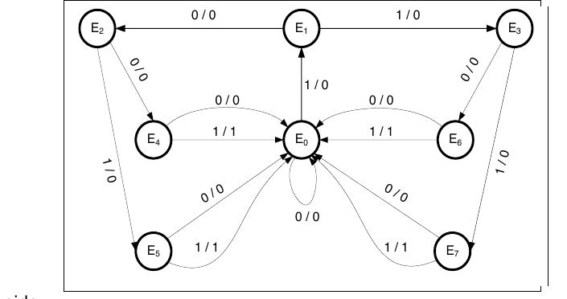
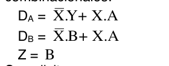
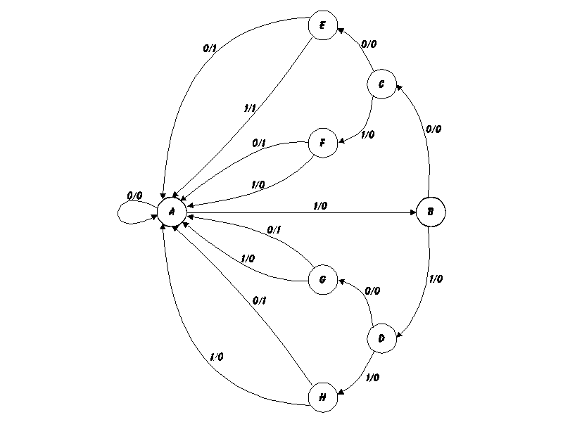
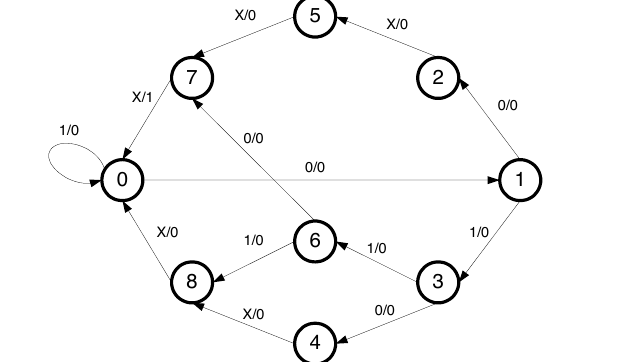
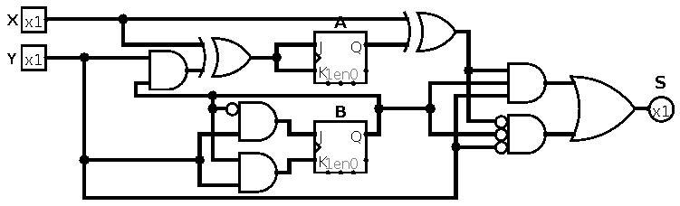
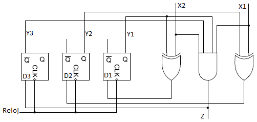
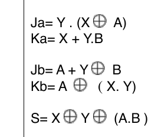
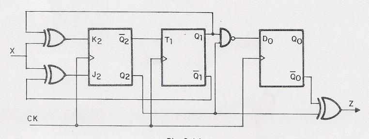
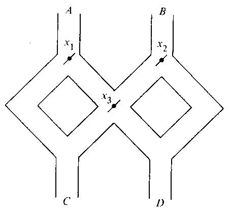
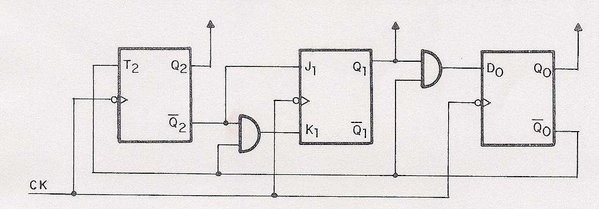

# Guía de Trabajos Prácticos — Circuitos Secuenciales

> Arquitectura de Computadoras — U.T.N. F.R.Re. — Ciclo lectivo 2019. Unidad Temática III. Incluye
> guía de trabajos prácticos de clase y ejercicios complementarios.

## Contenido

- [Trabajos Prácticos de Clase](#trabajos-prácticos-de-clase)
  - [Ejercicio 1](#ejercicio-1)
  - [Ejercicio 2](#ejercicio-2)
  - [Ejercicio 3](#ejercicio-3)
  - [Ejercicio 4](#ejercicio-4)
  - [Ejercicio 5](#ejercicio-5)
  - [Ejercicio 6](#ejercicio-6)
  - [Ejercicio 7](#ejercicio-7)
  - [Ejercicio 8](#ejercicio-8)
  - [Ejercicio 9](#ejercicio-9)
  - [Ejercicio 10](#ejercicio-10)
  - [Ejercicio 11](#ejercicio-11)
  - [Ejercicio 12](#ejercicio-12)
- [Ejercicios Complementarios](#ejercicios-complementarios)
  - [Ejercicio 1](#ejercicio-1-1)
  - [Ejercicio 2](#ejercicio-2-1)
  - [Ejercicio 3](#ejercicio-3-1)
  - [Ejercicio 4](#ejercicio-4-1)
  - [Ejercicio 5](#ejercicio-5-1)
  - [Ejercicio 6](#ejercicio-6-1)
  - [Ejercicio 7](#ejercicio-7-1)
  - [Ejercicio 8](#ejercicio-8-1)
  - [Ejercicio 9](#ejercicio-9-1)
  - [Ejercicio 10](#ejercicio-10-1)
  - [Ejercicio 11](#ejercicio-11-1)
  - [Ejercicio 12](#ejercicio-12-1)
  - [Ejercicio 13](#ejercicio-13)
  - [Ejercicio 14](#ejercicio-14)
  - [Ejercicio 15](#ejercicio-15)
  - [Ejercicio 16](#ejercicio-16)
  - [Ejercicio 17](#ejercicio-17)
  - [Ejercicio 18](#ejercicio-18)
  - [Ejercicio 19](#ejercicio-19)
  - [Ejercicio 20](#ejercicio-20)
  - [Ejercicio 21](#ejercicio-21)

## Trabajos Prácticos de Clase

### Ejercicio 1

Diseñe el circuito secuencial que corresponde al siguiente diagrama de transición de estados.
Utilice biestables RS (A, B, C). Construya el circuito con compuertas NAND. Represente la entrada
del circuito con la letra X y la salida con la letra Y.

Codificación de estados: E0: 000, E1: 001, E2: 010, E3: 011, E4: 100, E5: 101, E6: 110, E7: 111.

Se pide:

- Tabla de estados.
- Ecuaciones simplificadas.
- Ecuaciones transformadas NAND.
- Circuito simplificado NAND.

### Ejercicio 2

Trace el diagrama de lógica de un circuito secuencial con dos flip-flops JK y una entrada X. El
circuito está especificado por las ecuaciones de entrada asociadas con las entradas de los
flip-flops de la siguiente tabla:

| Estado actual A | Estado actual B | Entrada X | Estado siguiente A' | Estado siguiente B' | JA  | KA  | JB  | KB  |
| --------------- | --------------- | --------- | ------------------- | ------------------- | --- | --- | --- | --- |
| 0               | 0               | 0         | 0                   | 1                   | 0   | 0   | 1   | 0   |
| 0               | 0               | 1         | 0                   | 0                   | 0   | 0   | 0   | 1   |
| 0               | 1               | 0         | 1                   | 1                   | 1   | 1   | 1   | 0   |
| 0               | 1               | 1         | 1                   | 0                   | 1   | 0   | 0   | 1   |
| 1               | 0               | 0         | 1                   | 1                   | 0   | 0   | 1   | 1   |
| 1               | 0               | 1         | 1                   | 0                   | 0   | 0   | 0   | 0   |
| 1               | 1               | 0         | 0                   | 0                   | 1   | 1   | 1   | 1   |
| 1               | 1               | 1         | 1                   | 1                   | 1   | 0   | 0   | 0   |

### Ejercicio 3

El funcionamiento de un sistema secuencial, el cual cuenta con dos flip-flops (A y B) de tipo D,
dos entradas (X e Y) y una salida (Z), está definido mediante las siguientes ecuaciones
combinacionales:

Se solicita:

- Trace el diagrama de lógica del circuito.
- Obtenga la tabla de estados.
- Dibuje el diagrama de estados.

### Ejercicio 4

Diseñe un circuito secuencial con F-F JK, A y B y dos entradas E y X. Si E = 0, el circuito se
mantiene en el mismo estado independientemente del valor de X. Cuando E = 1 y X = 1, el circuito
pasa por los estados 00 a 01 a 10 a 11 y de nuevo a 00 y repite. Cuando E = 1 y X = 0 el circuito
pasa por los estados 00 a 11 a 10 a 01 y de regreso a 00 y repite.

### Ejercicio 5

Diseñe una etapa de contador que siga la siguiente secuencia: 3, 2, 9, 7, 1, 0, 8, 6 y repite.

Se solicita:

- Tabla de estados y excitación del circuito (utilice FF-JK).
- Diagrama de transición de estados.
- Circuito correspondiente.
- Diagrama en bloque de tres etapas.

### Ejercicio 6

Utilizando un proceso de diseño de circuito secuencial, convierta un F-F de tipo D en un T.
Demuestre que lo que se necesita es una compuerta XOR.

### Ejercicio 7

Aplicando el proceso de diseño de circuitos secuenciales realice las siguientes conversiones de
biestables:

- Biestables JK, T y D a partir de biestables RS.
- Biestables JK y T a partir de biestables D.

### Ejercicio 8

Un flip-flop JN tiene dos entradas, J y N. La entrada J se comporta como la entrada J de un
flip-flop JK y la entrada N lo hace como el complemento de la entrada K del JK (o sea N = K̄).

Se solicita:

- Obtenga la tabla característica del flip-flop.
- Demuestre que conectando las dos entradas se obtiene un flip-flop de tipo D.

### Ejercicio 9

Dado el siguiente Diagrama de Transición de Estados, construya el correspondiente circuito
secuencial utilizando FF T. Además, describa brevemente el funcionamiento del circuito y para qué
se lo utiliza. (Considere para el análisis que el primer estado del circuito es el estado A y que la
primera transición rotulada con un uno indica que lo que sigue es información a analizar por el
autómata de estados finitos).

Se solicita:

- Tabla.
- Simplificación.
- Circuito.
- Descripción del funcionamiento.
- Función del circuito.

### Ejercicio 10

Diseñe un circuito secuencial que verifique si una cadena de 3 bits, introducida en forma serial
(entrada E), tiene mayor cantidad de unos que ceros. El circuito debe contar, además de la entrada
serial, con una entrada de habilitación (H). Utilice biestables RS.

Se solicita: diagrama de transición de estados; tabla de estados; simplificación; circuito.

### Ejercicio 11

Diseñe un circuito secuencial del esquema siguiente que analice una cadena de 4 bits según el
diagrama de transición que se muestra al lado. Considere que los cuatro bits se comienzan a
analizar después de la llegada de un cero. Utilice biestables T.

Esquema: la ENTRADA (E) `...b3, b2, b1, b0, 0...` ingresa al CIRCUITO SECUENCIAL, que produce la
SALIDA (S): S = 1 si b0, b1, b2, b3 es: ??

Se pide:

- Tabla de estados.
- Circuito simplificado.
- Función del circuito.

### Ejercicio 12

Dado el siguiente circuito:

Se solicita:

- a. Construya la tabla de estados correspondiente al circuito secuencial con entradas X e Y, y
  salida S.
- b. Redefina las entradas a los biestables utilizando la tabla de excitación correspondiente.
- c. Simplifique las entradas de los biestables redefinidos.
- d. Dibuje el circuito resultante.
- e. Dibuje el diagrama de transición de estados del circuito.

## Ejercicios Complementarios

### Ejercicio 1

Elabore la tabla de estados mínima de una máquina secuencial síncrona con una entrada X y una
salida Z que opera de la siguiente forma: cuando se detecta la llegada de 110 (primero 1, después
1, después 0), Z se pone a 1, manteniendo este valor hasta detectar la secuencia 010, en cuyo caso
Z pasa a tomar valor 0 manteniendo este valor hasta que llegue una nueva secuencia 110.

### Ejercicio 2

Analice el siguiente circuito y determine:

- Tabla de estados asociada al circuito.
- Diagrama de transición de estados.

### Ejercicio 3

Un circuito secuencial tiene dos entradas y dos salidas. Las entradas (X1, X2) representan un
número en binario de dos bits, N. Si el valor actual de N es mayor que el valor inmediatamente
anterior, entonces Z1 = 1. Si dicho valor es menor, entonces la salida Z2 = 1. En cualquier otro
caso, Z1 = Z2 = 0. Se pide:

- Escribir el diagrama de transiciones y la tabla de estados correspondientes.
- Diseñe el circuito con biestables JK.

### Ejercicio 4

Un detector de temperatura produce una salida codificada con dos bits, cuyo valor indica el nivel
de calor existente en el ambiente (varía de 0 a 3). Se desea realizar una alarma contra incendio
que funcione del siguiente modo:

- Si la alarma está desactivada, se activará cuando transcurran dos o más impulsos consecutivos de
  reloj con nivel 2 de temperatura, o uno o más con nivel 3.
- Si la alarma está activada, se desactivará cuando transcurran dos o más impulsos consecutivos de
  nivel 1 de temperatura, o uno o más con nivel 0.

Se pide:

- Defina, claramente, el conjunto de entradas, salidas y estados que describe el comportamiento del
  sistema de alarma enunciado.
- Realice el diagrama y la tabla de estados.
- Diseñe el circuito con biestables tipo D.

### Ejercicio 5

Dadas las siguientes ecuaciones:

Se solicita:

- a. Construya la tabla de estados correspondiente al circuito secuencial con entradas X e Y y
  salida S.
- b. Redefina las entradas a los biestables utilizando la tabla de excitación correspondiente.
- c. Simplifique las entradas de los biestables redefinidos.
- d. Dibuje el circuito resultante.
- e. Dibuje el diagrama de transición de estados del circuito.

### Ejercicio 6

Dado el siguiente circuito:

Se solicita:

- a. Construya la tabla de estados correspondiente al circuito secuencial con entradas X y salida Z.
- b. Redefina las entradas a los biestables utilizando la tabla de excitación correspondiente.
- c. Simplifique las entradas de los biestables redefinidos.
- d. Dibuje el circuito resultante.
- e. Dibuje el diagrama de transición de estados del circuito.

### Ejercicio 7

Construya las tablas de estado y excitación de un biestable XZ, en el que la entrada X es igual a
R de un RS y Z es igual a la entrada negada S de un RS.

### Ejercicio 8

Construya las tablas de estado y excitación de un biestable XT, en el que la entrada T es igual a
la entrada K de un JK y X es igual a J negada de un JK.

### Ejercicio 9

Dibuje un FF RS sincrónico, utilizando únicamente compuertas NAND. Describa el funcionamiento y la
tabla correspondiente.

### Ejercicio 10

Un circuito secuencial tiene una entrada W y dos salidas Z1 y Z2. La salida Z1 valdrá uno si cada
tres bits recibido, se da la secuencia de entrada 101 y la salida Z2 valdrá uno si se da la
secuencia 010. En todos los demás casos las salidas valdrán cero.

### Ejercicio 11

Un circuito secuencial tiene dos entradas X1, X2 y una salida Z. Se desea detectar la secuencia de
entrada 01-10-11-01-10-11 a partir de un estado inicial 00. Cuando se presenta esa secuencia, la
salida Z valdrá uno. En cualquier otro caso la salida valdrá cero.

### Ejercicio 12

Realizar un circuito secuencial de una entrada y una salida, tal que la salida sea un uno en cada
pulso de sincronismo para las secuencias de cuatro bits, tales que la cantidad de bits con valor
cero sea igual a la cantidad de bits con valor uno. Para las demás secuencias la salida será cero.

### Ejercicio 13

Realizar un circuito secuencial que detecte números binarios capicúa de tres bits de longitud. El
sistema tendrá una entrada y una salida. La salida valdrá uno, sólo cuando detecte un capicúa y
valdrá cero en los demás casos.

### Ejercicio 14

Construir un circuito secuencial compuesto por una línea de entrada y una de salida, donde la
salida vale cero, salvo si llegan tres ceros o tres unos consecutivos (serie), en cuyo caso la
salida valdrá 1, cada paquete de bits a analizar es de 4 bits.

### Ejercicio 15

Construir un circuito secuencial compuesto por una línea de entrada y una de salida, donde la
salida vale cero, salvo si llegan tres ceros o tres unos consecutivos (serie), en cuyo caso la
salida valdrá 1, cada paquete de bits a analizar es de 3 bits.

### Ejercicio 16

Los números decimales entre cero y siete expresados en forma binaria se transmiten en serie sobre
una línea X. Diseñe un circuito que dé salida Z = 1, en el tiempo de reloj del tercer bit, si se
presentan los binarios cero o siete. En cualquier otro caso Z = 0.

### Ejercicio 17

Considere el juguete que se muestra en la siguiente figura. Se deja caer una bolita por A o B (nunca
simultáneamente). Los niveladores X1, X2 y X3 hacen que la bolita caiga hacia la derecha o
izquierda. Cuando una bolita choca un nivelador hace que éste cambie de estado, de tal modo que la
siguiente bolita que choque tomará la dirección opuesta. Represente a una bolita en A con una
entrada 0 y una en B con una entrada 1.

- Defina, claramente, el conjunto de entradas, salidas y estados que describe el comportamiento del
  sistema.
- Realice el diagrama y la tabla de estados.
- Diseñe el circuito con biestables tipo D.

### Ejercicio 18

Un ascensor se mueve entre 3 pisos. En cada piso existe un botón para solicitar el ascensor, y en
el interior hay 3 botones, uno para cada piso, con los cuales se indica el piso al que se desea ir.
El ascensor tiene capacidad para una sola persona. Se trata de que el sistema que gobierne el
comportamiento del ascensor sea lo más eficaz posible. Como es lógico el ascensor puede estar
vacío, lleno, parado o en movimiento.

Diseñe un circuito secuencial que simule el funcionamiento del ascensor descripto, indicando
entradas, salidas, estados, y funciones de comportamiento y salida en forma de tablas y diagramas.

### Ejercicio 19

Dado el siguiente circuito:

Se solicita:

- a. Construya la tabla de estados correspondiente al circuito secuencial.
- b. Redefina las entradas a los biestables utilizando la tabla de excitación correspondiente.

### Ejercicio 20

Diseñar un circuito secuencial en serie que realice la suma binaria de dos bits y de un acarreo.
Utilizar biestables T.

### Ejercicio 21

Diseñe un circuito secuencial que visualice consecutivamente en un display de 7 segmentos los
números primos comprendidos entre el 1 y el 10. Utilice biestables J-K.
