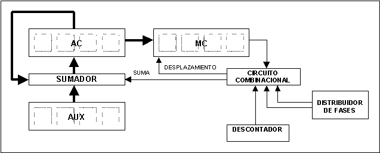
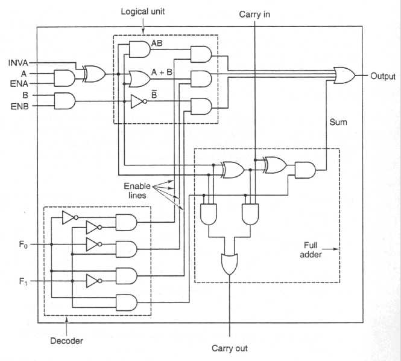
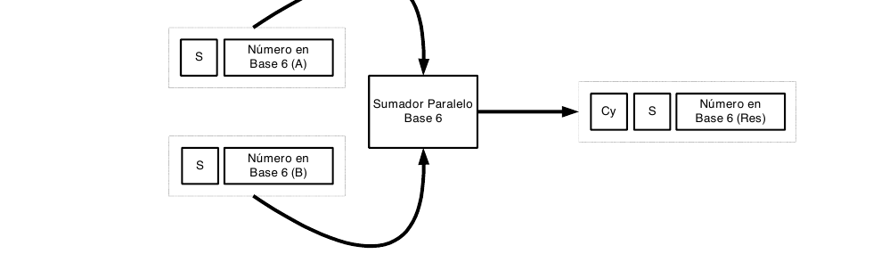
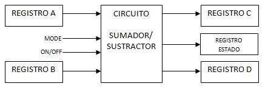

# Guía de Trabajos Prácticos — Unidad Aritmético Lógica (ALU)

> Arquitectura de Computadoras — U.T.N. F.R.Re. — Ciclo lectivo 2019. Unidad Temática IV. Incluye
> guía de trabajos prácticos de clase y ejercicios complementarios.

## Contenido

- [Trabajos Prácticos de Clase](#trabajos-prácticos-de-clase)
  - [Ejercicio 1](#ejercicio-1)
  - [Ejercicio 2](#ejercicio-2)
  - [Ejercicio 3](#ejercicio-3)
  - [Ejercicio 4](#ejercicio-4)
  - [Ejercicio 5](#ejercicio-5)
  - [Ejercicio 6](#ejercicio-6)
  - [Ejercicio 7](#ejercicio-7)
  - [Ejercicio 8](#ejercicio-8)
  - [Ejercicio 9](#ejercicio-9)
  - [Ejercicio 10](#ejercicio-10)
  - [Ejercicio 11](#ejercicio-11)
  - [Ejercicio 12](#ejercicio-12)
- [Ejercicios Complementarios](#ejercicios-complementarios)
  - [Ejercicio 1](#ejercicio-1-1)
  - [Ejercicio 2](#ejercicio-2-1)
  - [Ejercicio 3](#ejercicio-3-1)
  - [Ejercicio 4](#ejercicio-4-1)
  - [Ejercicio 5](#ejercicio-5-1)
  - [Preguntas de repaso de la unidad](#preguntas-de-repaso-de-la-unidad)

## Trabajos Prácticos de Clase

### Ejercicio 1

Diseñe un sustractor completo de 4 bits.

### Ejercicio 2

Diseñe un sumador completo de 4 bits.

### Ejercicio 3

Diseñe un sumador BCD.

### Ejercicio 4

Diseñe un sumador de 2 dígitos quinario (base 5). Agregue una breve descripción en cada paso del
diseño.

### Ejercicio 5

Dibuje dos registros, A y B, de 4 bits que posean la lógica combinacional necesaria para poder
realizar:

- Entrada y salida en paralelo en A y B, desde y hacia un BUS M.
- Desplazamiento cíclico a izquierda del contenido de A.
- Desplazamiento cíclico a derecha del contenido de B.
- Complemento a la base del contenido de B.
- AND (bit a bit) de los contenidos de A y B, cuyo resultado pueda ser enviado al BUS M.
- OR (bit a bit) de los contenidos de A y B, cuyo resultado pueda ser enviado al BUS M.
- XOR (bit a bit) de los contenidos de A y B, cuyo resultado pueda ser enviado al BUS M.
- Detección del contenido igual a cero en A.

### Ejercicio 6

Considerando el funcionamiento del algoritmo de la multiplicación en una ALU y utilizando el
siguiente esquema simplificado, diseñar los módulos de:

- Distribuidor de fases.
- Descontador.
- Circuito combinacional.
- Realizar el diagrama en detalle indicando las conexiones de cada módulo.
- Explicar el funcionamiento de dicha ALU simplificada.
- Considerar, si fuese necesario, las líneas de control para el descontador y el distribuidor de
  fases.

### Ejercicio 7

Una computadora usa la representación en complemento a 2 para manejar números enteros con signo y
emplea 16 bits en total para la representación. Para esta máquina conteste lo siguiente:

- ¿Cuál es el número mayor que puede representarse?
- ¿Cuál es el número menor que puede representarse?
- Represente los siguientes números enteros en el formato de la máquina:
  (i) 1345 (ii) -1718 (iii) 415 (iv) -123 (v) 5000

### Ejercicio 8

Efectúe las siguientes operaciones utilizando la representación de complemento a la base para los
números negativos.

- 345₁₀ − 201₁₀
- 280₁₀ − 512₁₀
- 1000010₂ + 0010100₂
- 1000011₂ + (−1011011₂)
- 1010010₂ + (−1010001₂)
- 0110010₂ + (1101110₂)

### Ejercicio 9

Realice el diagrama de flujo de la resta de números sin signo. Considere números de 8 bits.

### Ejercicio 10

Realice el diagrama de flujo del algoritmo de la suma aritmética en la que se utiliza la
representación de complemento a la base para números negativos. Considere números de 8 bits.

### Ejercicio 11

Realice el circuito completo del algoritmo del punto 10.

### Ejercicio 12

El siguiente circuito es el desarrollo de una ALU de un bit. Las operaciones que puede realizar son
las indicadas en el dibujo. Utilice este diseño para implementar una ALU de 8 bits e incluya la
lógica combinacional para conectar los bits de estado (S, V, Z, C) teniendo en cuenta que la
representación para los números es de complemento a dos. Una vez implementada la ALU de 8 bits
explique las operaciones que puede realizar.

## Ejercicios Complementarios

### Ejercicio 1

En las operaciones de suma y resta en las representaciones en punto flotante existe un proceso de
normalización, el cual consiste en igualar los exponentes. Teniendo en cuenta que los exponentes se
cargan en registros separados, construya un circuito que realice la mencionada igualación de dos
exponentes de cuatro bits más uno de signo, con representación de los negativos en forma
complementada, igualando siempre al menor de los exponentes por cuestiones de simplicidad. Incluya
también la lógica para la carga de ambos registros.

### Ejercicio 2

Dados dos números en base 6 con signo, se pide diseñe un sumador paralelo, según muestra el esquema
siguiente. Considere que 0 como signo representa un número positivo y un 1 representa un número
negativo.

### Ejercicio 3

Dada una computadora que representa los números reales en base al formato de precisión simple del
estándar IEEE 754, y que además a los valores negativos se representan utilizando complemento a 2:

- ¿Cuál es el número mayor que puede representarse?
- ¿Cuál es el número negativo menor que puede representarse?
- ¿Cuántas cifras significativas en decimal proporciona este formato?
- Represente los siguientes números en este formato:
  (i) 1317.75 (ii) -178.25 (iii) -0.09375
- Obtenga el número decimal que representa el siguiente número real:
  - (i) 01010011110100000000000000000000₂
  - (ii) 10011010010100000000000000000000₂
  - (iii) FB701000₁₆
  - (iv) 32CAFE00₁₆

Dados los valores del punto anterior, realizar las siguientes operaciones, indicando en cada caso
si hay desbordamiento:

1. d.(i) + d.(iii)
2. d.(ii) + d.(iii)
3. e.(i) − e.(ii)
4. e.(i) + e.(iii)

### Ejercicio 4

Realice el diagrama de flujo y el circuito en bloques de un módulo de la ALU que recibe 2 números
(A y B) en formato IEEE 754 con soporte para sumar A+B y restar A−B.

### Ejercicio 5

Considere el siguiente diagrama en bloque: los registros A, B, C y D tienen una longitud de 4 bits.
La señal MODE indica si el circuito suma, o si resta. La señal ON/OFF indica si el circuito está en
funcionamiento o no.

Diseñe el circuito SUMADOR/SUSTRACTOR de tal modo que el resultado de la operación A+B quede
almacenado en el registro C, y el resultado de la operación A−B quede almacenado en el registro D.
Así también se debe indicar el contenido de los bits del registro de estado de acuerdo al resultado
de la operación. Los FF utilizados son J-K.

Realizar:

- Circuito Sumador/Sustractor.
- Circuito asociado al registro de Estado.
- Detalle de cada registro.

### Preguntas de repaso de la unidad

1. ¿Cómo se puede construir un sumador serie de dos números de 4 bits?
2. ¿El algoritmo de la multiplicación trabaja con números con signo?
3. ¿Cómo funciona el algoritmo desarrollado por BOOTH?
4. ¿Cómo se maneja el signo del número en la representación de punto flotante?
5. Enumere las operaciones aritmético y lógicas que son posibles de implementar en una ALU.
6. ¿Cómo puede detectar si el contenido de un registro es igual a 1?
7. ¿Cuál es el resultado mayor que se puede obtener con un sumador para dos núm. de 5 bits en repres.
   complemento a 2?
8. ¿Cuál es el resultado mayor que se puede obtener con un multiplicador para dos núm. de 5 bits en
   repres. complemento a 2?
9. En una división entera, ¿en qué registro queda el resto de la división? ¿Y el cociente?
10. En el algoritmo de la división de "n" bits, ¿cuántos desplaz. se realizan al registro Mult. Coc.
    al inicio de la operación?
11. En el algoritmo de la suma de "n" bits, ¿cuántos desplazamientos se realizan al registro Mult.
    Coc. al inicio de la operación?
12. ¿Cómo se puede detectar si un número es par?
13. ¿Cómo se puede detectar si un número es potencia de 2?
14. ¿Cómo se puede implementar el flag de overflow?
15. ¿Cómo se puede implementar el flag de carry?
