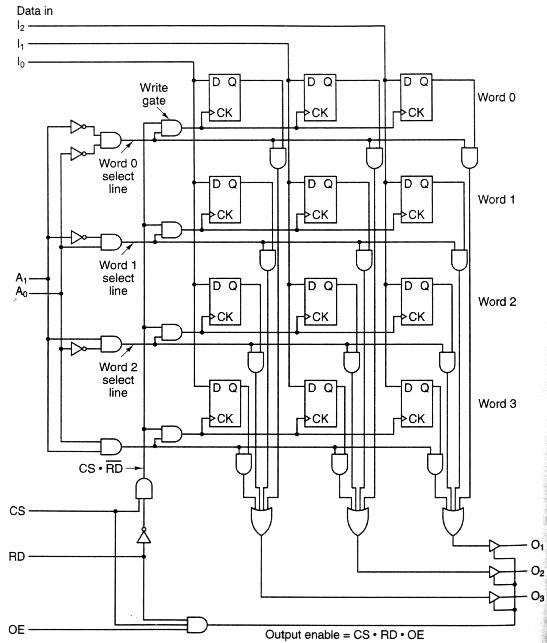
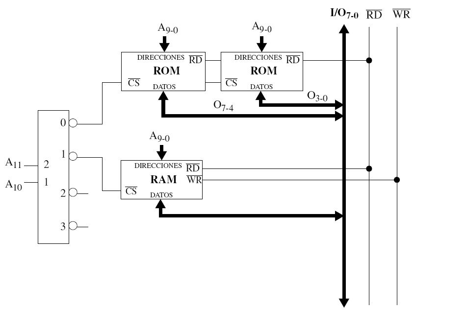
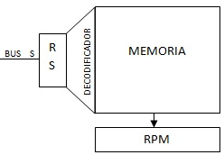

# Guía de Trabajos Prácticos — Memoria Central

> Arquitectura de Computadoras — U.T.N. F.R.Re. — Ciclo lectivo 2019. Unidad Temática IV. Incluye
> guía de trabajos prácticos de clase y ejercicios complementarios.

## Contenido

- [Trabajos Prácticos de Clase](#trabajos-prácticos-de-clase)
  - [Ejercicio 1](#ejercicio-1)
  - [Ejercicio 2](#ejercicio-2)
  - [Ejercicio 3](#ejercicio-3)
  - [Ejercicio 4](#ejercicio-4)
  - [Ejercicio 5](#ejercicio-5)
  - [Ejercicio 6](#ejercicio-6)
  - [Ejercicio 7](#ejercicio-7)
  - [Ejercicio 8](#ejercicio-8)
  - [Ejercicio 9](#ejercicio-9)
- [Ejercicios Complementarios](#ejercicios-complementarios)
  - [Ejercicio 1](#ejercicio-1-1)
  - [Ejercicio 2](#ejercicio-2-1)
  - [Ejercicio 3](#ejercicio-3-1)
  - [Ejercicio 4](#ejercicio-4-1)
  - [Ejercicio 5](#ejercicio-5-1)
  - [Ejercicio 6](#ejercicio-6-1)
  - [Ejercicio 7](#ejercicio-7-1)
  - [Ejercicio 8](#ejercicio-8-1)

## Trabajos Prácticos de Clase

### Ejercicio 1

Una unidad de memoria tiene una capacidad de 8192 palabras de 16 bits. Determine:

- ¿Cuántos flip-flops se necesitan para el registro de dirección de memoria y el registro de palabra
  de memoria?
- ¿Cuántas palabras podrían direccionarse en memoria si el registro de dirección de memoria tiene 14
  bits?

### Ejercicio 2

Determine la cantidad de compuertas AND del decodificador de una memoria con 4096 palabras de 4 bits
cada una. ¿Y si la memoria tuviera 8192 palabras? En ambos casos se trata de memorias de selección
lineal. Demuestre cómo obtiene las cantidades. Determine si es posible economizar la cantidad de
compuertas y cómo lo haría.

### Ejercicio 3

Cuando el número de palabras en una memoria es grande es conveniente usar celdas de almacenamiento
binario con dos entradas de selección: una entrada de selección X (horizontal) y una entrada de
selección Y (vertical).

- Dibuje una celda de almacenamiento binario con biestable D que tenga entradas de selección X e Y.
- Esquematice una memoria de 64 palabras de 1 bit que utilice celdas 2D y organización 3D (Memoria
  2 ½ D).

### Ejercicio 4

Para una memoria de 8192 palabras de 16 bits comparar la cantidad de compuertas AND y entradas a
cada una de ellas, analizando puntos de memoria y decodificadores, utilizando organización 2D, 3D y
2 ½ D.

### Ejercicio 5

Para una memoria de 4096 palabras de 1 byte cada una, compare el Nro. de compuertas AND y las
entradas en cada una para un decodificador de una organización 2D y 3D. Al comparar tenga en cuenta
las características del punto de memoria. Plantee conclusiones teniendo en cuenta cuál es más
económica.

### Ejercicio 6

Completar en las siguientes tablas las celdas faltantes en función de los datos conocidos.

| —          | Decod. AND | Decod. Entradas | P. memoria AND | P. memoria Entradas | Lectura AND | Lectura Entradas | Escritura AND | Escritura Entradas | Totales AND | Totales Entradas |
| ---------- | ---------- | --------------- | -------------- | ------------------- | ----------- | ---------------- | ------------- | ------------------ | ----------- | ---------------- |
| Mem. 2 D   |            |                 |                | 33554432            |             |                  |               |                    |             |                  |
| Mem. 2 ½ D | 768        |                 |                |                     |             | 8224             |               |                    |             |                  |

| —          | Decod. AND | Decod. Entradas | P. memoria AND | P. memoria Entradas | Lectura AND | Lectura Entradas | Escritura AND | Escritura Entradas | Totales AND | Totales Entradas |
| ---------- | ---------- | --------------- | -------------- | ------------------- | ----------- | ---------------- | ------------- | ------------------ | ----------- | ---------------- |
| Mem. 3 D   | 768        |                 |                | 46137344            |             |                  |               |                    |             |                  |
| Mem. 2 ½ D |            |                 |                |                     |             | 8224             |               |                    |             |                  |

| —          | Decod. AND | Decod. Entradas | P. memoria AND | P. memoria Entradas | Lectura AND | Lectura Entradas | Escritura AND | Escritura Entradas | Totales AND | Totales Entradas |
| ---------- | ---------- | --------------- | -------------- | ------------------- | ----------- | ---------------- | ------------- | ------------------ | ----------- | ---------------- |
| Mem. 2 D   |            |                 |                |                     |             |                  | −             | −                  |             |                  |
| Mem. 2 ½ D | 128        |                 |                | 262144              | 1040        |                  | 128           |                    |             |                  |
| Mem. 3 D   |            |                 |                |                     |             |                  | −             | −                  |             |                  |

### Ejercicio 7

Utilizando como referencia el esquema que se muestra a continuación (con entradas I1, I2, I3),
calcule la cantidad de compuertas AND, OR, NOT (y la cantidad total de entradas a cada uno de los
tipos de compuertas mencionadas) para una memoria de 64 K Bytes. Organice los cálculos según
correspondan al decodificador, lectura y escritura. No considere las compuertas que constituyen los
biestables.

### Ejercicio 8

¿Cómo debería modificar la memoria del ejercicio anterior para que funcione como una memoria 3D?

### Ejercicio 9

Analizar el siguiente mapa de memoria. El análisis deberá indicar las siguientes características:

- Anchura del bus de datos.
- Anchura del bus de direcciones.
- Capacidad total del mapa de memoria.
- Espacio de memoria destinado para los programas de inicialización.
- Espacio de memoria destinado para datos y aplicaciones.
- Espacio de memoria destinado para ampliaciones.
- Tamaño de los diferentes módulos utilizados.

Referencias:

- CS: Chip Select (selección del chip de memoria).
- RD: Read / WR: Write.
- OE: Output Enable (salida disponible).

## Ejercicios Complementarios

### Ejercicio 1

Esquematice una memoria 2 ½ D de 16 palabras de 3 bits (conexiones para la lectura, escritura y
punto de memoria).

### Ejercicio 2

Esquematice una memoria 2D de 16 palabras de 8 bits. Dibuje en detalle las conexiones y las señales
de control con el RPM.

### Ejercicio 3

Para una memoria de 16KB compare el número de compuertas AND, OR y entradas en cada una para un
decodificador de una organización 3D y 2 ½ D. Compare los resultados obtenidos teniendo en cuenta
el punto de memoria. Como conclusión, determine cuál es la más económica.

### Ejercicio 4

Considerando el bus S con una longitud de 4 bits, diseñar la conexión entre el bus S, el registro
RS, el decodificador y la Memoria. Considerar para ello una memoria de selección lineal de 4 bits de
longitud. Además, realizar la conexión entre las salidas y el registro RPM.

### Ejercicio 5

Dados los siguientes datos de la unidad de control:

- Cantidad de Operaciones: 32.
- Modos de Direccionamiento posibles: Directo, Indirecto, Inmediato.
- Cantidad de Registros Índices: 7 registros Ix.
- Tamaño de la zona D del RI: 16 bits.

Se solicita el cálculo de cantidad de compuertas AND y OR de:

- Puntos de Memoria.
- Lectura.
- Escritura.

Considere que se trata de una organización 2 ½ D y la cantidad de palabras se corresponde con el
máximo que se puede direccionar de forma directa.

### Ejercicio 6

Dos Ingenieros debaten sobre los beneficios económicos que obtienen construyendo Memorias para un
ordenador. Un Ingeniero opina que debe construir una memoria 3D de 64K, mientras que el otro
prefiere una memoria 2D de 64K. Determine cuál es el número de componentes que se ahorran al
construir esas memorias, teniendo en cuenta el decodificador y el punto de memoria.

### Ejercicio 7

Realice los cálculos de compuertas AND y entradas a dichas compuertas para una memoria de 2¹⁶
palabras de 3 bytes. Construya una tabla que compare las organizaciones 2D, 3D y 2 ½ D, teniendo en
cuenta decodificadores, punto de memoria (construidos con biestables RS), lectura y escritura (nota:
no considere para el cálculo las compuertas de los biestables).

### Ejercicio 8

Completar la siguiente tabla, en función de los datos conocidos. ¿Cuál es el tamaño de la memoria?
¿Cuál es el tamaño de una palabra de memoria?

| —          | Decod. AND | Decod. Entradas | P. memoria AND | P. memoria Entradas | Lectura AND | Lectura Entradas | Escritura AND | Escritura Entradas | Totales AND | Totales Entradas |
| ---------- | ---------- | --------------- | -------------- | ------------------- | ----------- | ---------------- | ------------- | ------------------ | ----------- | ---------------- |
| Mem. 2 D   |            |                 |                |                     |             |                  | −             | −                  |             |                  |
| Mem. 2 ½ D | 192        |                 |                | 524288              | 520         | 1040             |               |                    |             |                  |
| Mem. 3 D   |            |                 |                |                     | 8           |                  | −             | −                  |             |                  |
