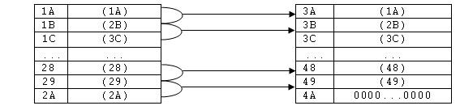

# Guía de Trabajos Prácticos — Lenguaje de Máquina

> Arquitectura de Computadoras — U.T.N. F.R.Re. — Ciclo lectivo 2019. Unidad Temática V. Incluye guía
> de trabajos prácticos de clase y ejercicios complementarios.

## Contenido

- [Trabajos Prácticos de Clase](#trabajos-prácticos-de-clase)
  - [Ejercicio 1](#ejercicio-1)
  - [Ejercicio 2](#ejercicio-2)
  - [Ejercicio 3](#ejercicio-3)
  - [Ejercicio 4](#ejercicio-4)
  - [Ejercicio 5](#ejercicio-5)
  - [Ejercicio 6](#ejercicio-6)
  - [Ejercicio 7](#ejercicio-7)
  - [Ejercicio 8](#ejercicio-8)
- [Ejercicios Complementarios](#ejercicios-complementarios)
  - [Ejercicio 1](#ejercicio-1-1)
  - [Ejercicio 2](#ejercicio-2-1)
  - [Ejercicio 3](#ejercicio-3-1)
  - [Ejercicio 4](#ejercicio-4-1)
  - [Ejercicio 5](#ejercicio-5-1)
  - [Ejercicio 6](#ejercicio-6-1)
  - [Ejercicio 7](#ejercicio-7-1)
  - [Ejercicio 8](#ejercicio-8-1)
  - [Ejercicio 9](#ejercicio-9-1)
  - [Ejercicio 10](#ejercicio-10)
  - [Ejercicio 11](#ejercicio-11)

## Trabajos Prácticos de Clase

### Ejercicio 1

En memoria están almacenados dos números en las posiciones 5₁₆ y 6₁₆. Realice un programa en
lenguaje de máquina (definiendo el set de instrucciones) que pase el contenido de 5₁₆ a la dirección
6₁₆ y viceversa.

Formato del registro de instrucción:

| Campo | C.O. | D    |
| ----- | ---- | ---- |
| Bits  | 0–3  | 4–12 |

### Ejercicio 2

En memoria están almacenados dos números en las posiciones 5₁₆ y 6₁₆. Realice un programa en
lenguaje de máquina (definiendo el set de instrucciones) que pase el contenido de 5₁₆ a la dirección
6₁₆ y viceversa. Considere que ahora dispone un registro Accesorio.

Formato del registro de instrucción:

| Campo | C.O. | Ac  | D    |
| ----- | ---- | --- | ---- |
| Bits  | 0–3  | 4   | 5–13 |

### Ejercicio 3

Realizar un programa en lenguaje de máquina que realice la operación de multiplicación. C = A * B.
Las direcciones de los operandos son: A = 0x08, B = 0x1A y C = 0x11.

### Ejercicio 4

Realizar un programa en lenguaje de máquina que realice la operación C = A / B. Tener en cuenta la
posibilidad de que B = 0. Las direcciones de los operandos son:

- A = 011101110111₂
- B = 000001000010₂
- C = 111111111000₂

Se pide:

- Definición del R.I.
- Definición del set de instrucciones.
- Programa en lenguaje de máquina.
- Esquema general de la arquitectura empleada.

### Ejercicio 5

Realice un programa de lenguaje de máquina que mueva los contenidos desde las posiciones
[3F₁₆ ; A2₁₆] (inclusive los extremos del intervalo) hasta las posiciones [B1₁₆ ; 114₁₆]. Formato
del registro de instrucción:

| Campo | C.O. | C.D. | Ix  | D    |
| ----- | ---- | ---- | --- | ---- |
| Bits  | 0–3  | 4    | 5–6 | 7–16 |

- C.D.: 0 = Inmediato; 1 = Directo.
- Ix: 00 = No direcciona reg. índice; 01 = Ix1; 10 = Ix2; 11 = Ix3.

El set de instrucciones es el siguiente:

| C.O. | Significado                |
| ---- | -------------------------- |
| 0000 | Fin.                       |
| 0001 | Cargar AC.                 |
| 0010 | Cargar Ix.                 |
| 0011 | Almacenar (AC).            |
| 0100 | Salto condicional si (Ix)=0. |
| 0101 | Salto incondicional.       |
| 0110 | Decrementar (Ix).          |

### Ejercicio 6

Realizar un programa en lenguaje de máquina que realice la operación C = (A + B) − 10. Las
direcciones de los operandos son:

- A = 011101110111₂
- B = 000001000010₂
- C = 111111111000₂

Se pide:

- Definición del R.I.
- Definición del set de instrucciones.
- Programa en lenguaje de máquina.
- Esquema general de la arquitectura empleada.

### Ejercicio 7

Realice un programa en lenguaje de máquina que recorra tres intervalos de memoria [70h, 90h];
[A0h, C0h] y [E0h, 100h] y determine la cantidad de números negativos contenidos en cada uno de
ellos. Dichas cantidades deberán ser almacenadas en 07h para el primer intervalo, en 0Ah para el
segundo y en 0Eh para el tercero.

Se pide:

- Diagrama de Flujo o Algoritmo correspondiente.
- Definición del RI.
- Definición del set de instrucciones.
- Programa en lenguaje de máquina.
- Esquema de la máquina.

### Ejercicio 8

Realice un programa en lenguaje de máquina que recorra el intervalo de memoria [0x000; 0x00F] y
copie al intervalo de memoria [0x7FF; 0x80E] los contenidos que sean múltiplos de 4; caso contrario,
poner a cero el contenido de la dirección del segundo intervalo. Las características de la máquina son
las siguientes.

Registro de Instrucción:

| Campo | C.O. | C.D. | Acc | Ix  | B   | D    |
| ----- | ---- | ---- | --- | --- | --- | ---- |
| Bits  | 0–3  | 4    | 5   | 6   | 7   | 8–17 |

- C.D.: 0 = Inmediato; 1 = Directo.
- Ix: 0 = No utiliza índice; 1 = Ix1.
- B: 0 = No utiliza base; 1 = Base 1.
- Acc: 0 = No direcciona Acc; 1 = Acc1.

Set de instrucciones:

| C.O. | Significado                 |
| ---- | --------------------------- |
| 0000 | Fin.                        |
| 0001 | Cargar AC.                  |
| 0010 | Almacenar (AC).             |
| 0011 | Cargar Ix.                  |
| 0100 | Cargar B.                   |
| 0101 | Salto incondicional.        |
| 0110 | Salto condicional si (Ix)=0. |
| 0111 | Salto condicional si (AC)=0. |
| 1000 | Salto condicional si (AC)<0. |
| 1001 | XOR con (AC).               |
| 1010 | Restar al (AC).             |
| 1011 | Incrementar (Ix).           |
| 1100 | Decrementar (Ix).           |

## Ejercicios Complementarios

### Ejercicio 1

Dadas las siguientes características de una arquitectura Von Neumann, realice un programa en lenguaje
de máquina que recorra el intervalo [0x20; 0x35] y ponga a cero los contenidos cuyos tres primeros
bits (los de menor peso) sean iguales a cero.

Se pide:

- Diagrama de Flujo.
- Programa en Lenguaje de máquina (indicando direcciones en hexadecimal y comentarios por cada
  instrucción de programa).

Campos del registro de instrucción: CO, MD, Ix, D.

- MD: 00 = Inmediato; 01 = Directo; 10 = Indirecto.
- Ix: 00 = No usa índice; 01 = Utiliza índice 1; 10 = Utiliza índice 2; 11 = Utiliza índice 3.

Set de instrucciones de la máquina:

| CO   | Significado                 |
| ---- | --------------------------- |
| 0000 | Fin.                        |
| 0001 | Cargar AC.                  |
| 0010 | Cargar registro Ix.         |
| 0011 | Almacenar (AC).             |
| 0100 | Salto Condicional si (Ix)=0. |
| 0101 | Salto Incondicional.        |
| 0110 | Sumar al (AC).              |
| 0111 | Resta al (AC).              |
| 1000 | Decrementar (Ix).           |
| 1001 | Salto Condicional si (AC)<0. |
| 1010 | Salto Condicional si (AC)=0. |
| 1011 | AND con (AC).               |
| 1100 | XOR con (AC).               |
| 1101 | Incrementar (Ix).           |

### Ejercicio 2

Realice un programa en Lenguaje de Máquina que recorra el intervalo de memoria [0x0C; 0x50] y mueva
los contenidos que son distintos a 11001110 al intervalo que comienza en la dirección 0x51. Incluya
el diagrama de flujo o algoritmo correspondiente, escribiendo todas las direcciones en hexadecimal.
Las características de la máquina son las siguientes.

Registro de Instrucción:

| Campo | C.O. | C.D. | Ix  | D    |
| ----- | ---- | ---- | --- | ---- |
| Bits  | 0–3  | 4    | 5–6 | 7–16 |

- C.D.: 0 = Inmediato; 1 = Directo.
- Ix: 00 = No direcciona reg. índice; 01 = Ix1; 10 = Ix2; 11 = Ix3.

Set de instrucciones:

| C.O. | Significado                 |
| ---- | --------------------------- |
| 0000 | Fin.                        |
| 0001 | Cargar AC.                  |
| 0010 | Cargar Ix.                  |
| 0011 | Almacenar (AC).             |
| 0100 | Salto condicional si (Ix)=0. |
| 0101 | Salto incondicional.        |
| 0110 | Decrementar (Ix).           |
| 0111 | Salto condicional si (AC)=0. |
| 1000 | AND con (AC).               |
| 1001 | XOR con (AC).               |
| 1010 | Restar al (AC).             |

### Ejercicio 3

Dados los siguientes intervalos [0x1A, 0x2A] y [0x3A, 0x4A] se solicita un programa en lenguaje de
máquina que realice la siguiente función entre posiciones de memoria contiguas del primer intervalo y
guarde el resultado en el segundo intervalo:

```
[(1A) AND (1B)] OR (1A) → 3A
```



Formato del Registro Instrucción:

| Campo | CO  | MD  | Ix  | Ax  | D     |
| ----- | --- | --- | --- | --- | ----- |
| Bits  | 0–3 | 4–5 | 6–7 | 8–9 | 10–25 |

Direccionamiento:

| MD  | Significado | Ix  | Índices       | Ax  | Auxiliares |
| --- | ----------- | --- | ------------- | --- | ---------- |
| 00  | Directo     | 00  | No Direcciona | 00  | AC         |
| 01  | Indirecto   | 01  | Ix1           | 01  | Ax1        |
| 10  | Inmediato   | 10  | Ix2           | 10  | Ax2        |
|     |             | 11  | Ix3           | 11  | Ax3        |

Set de Instrucciones:

| CO   | Comentarios               |
| ---- | ------------------------- |
| 0000 | FIN.                      |
| 0001 | Cargar (AC).              |
| 0010 | Almacenar (AC).           |
| 0011 | Sumar (AC) con (DIR).     |
| 0100 | Restar (AC) con (DIR).    |
| 0101 | (AC) OR (DIR).            |
| 0110 | (AC) AND (DIR).           |
| 0111 | (AC) XOR (DIR).           |
| 1000 | Salto Condicional si AC>0. |
| 1001 | Salto Condicional si AC<0. |
| 1010 | Salto Condicional si Ix=0. |
| 1011 | Salto Condicional si Ix>0. |
| 1100 | Salto Incondicional.      |
| 1101 | Cargar Ix.                |
| 1110 | Incrementar Ix.           |
| 1111 | Decrementar Ix.           |

Se pide desarrollar: Diagrama de Flujo del algoritmo y programa en lenguaje de Máquina.

### Ejercicio 4

Dado el siguiente intervalo [00, 2F] cuyos contenidos son números positivos enteros, se solicita un
programa en lenguaje de máquina que cuente cuántos números pares existen en las direcciones impares
de dicho intervalo. Almacenar el resultado en la dirección 0x3F.

Definir:

- Formato del Registro Instrucción.
- Tipos de Direccionamientos necesarios.
- Utilización de registros índices y auxiliares (en caso de ser necesario).
- Definición del Set de Instrucciones.
- Diagrama de Flujo.
- Programa en lenguaje de máquina.

### Ejercicio 5

Se cuenta con tres intervalos de memoria:

- Intervalo 1: [0x00, 0x1F]
- Intervalo 2: [0x20, 0x3F]
- Intervalo 3: [0x40, 0x5F]

Se solicita un programa en lenguaje de máquina que mueva los contenidos pares del intervalo 1 al
intervalo 2, y los contenidos impares del intervalo 1 al intervalo 3.

> Nota: Considerar la arquitectura descripta en el ejercicio 1 de esta guía.

### Ejercicio 6

Un múltiplo de un número es un número tal que lo contiene un número entero de veces; en otras
palabras, un múltiplo de n es un número tal que, dividido por n, da por resultado un número entero.
Se cuenta con el intervalo [0x00, 0x1F] que contiene números enteros positivos. Se solicita un
programa en lenguaje de máquina que cuente la cantidad de contenidos múltiplos de 2, de 3 y de 5.
Dichas cantidades serán almacenadas en las siguientes posiciones:

- Múltiplos de 2 → Dirección 0x20
- Múltiplos de 3 → Dirección 0x30
- Múltiplos de 5 → Dirección 0x50

Se pide:

- Diagrama de Flujo.
- Programa en lenguaje de Máquina.

> Nota: Considerar la arquitectura descripta en el ejercicio 1 de esta guía.

### Ejercicio 7

En las posiciones [3B₁₆ ; 9A₁₆] de memoria se almacenan valores (≥ 0) que representan mediciones de
un experimento X. Realice un programa en lenguaje de máquina que calcule la mayor variación (en valor
absoluto) entre dos mediciones ubicadas en posiciones contiguas de memoria y almacene dicha variación
en la posición A5₁₆. Si el valor de dos mediciones contiguas es igual, debe guardar dicho valor de la
medición en A6₁₆. Si existiera más de un par de mediciones iguales contiguas se deberá almacenar en
A6₁₆ la mayor de ellas.

Se solicita:

- Diagrama de Flujo.
- Formato del R. I.
- Set de Instrucciones.
- Programa.
- Esquematice la Máquina.

### Ejercicio 8

Realice un programa en lenguaje de máquina que recorra el intervalo de memoria [0x0C; 0x20] y mueva
los contenidos que sean múltiplos de 4 a la zona de memoria que comience en la dirección 30h y los
que no lo sean a la zona de memoria que comience en 80h.

| Múltiplo de 4 (desde 30h) | Contenido | No múltiplo de 4 (desde 80h) |
| ------------------------- | --------- | ---------------------------- |
| 30h                       | (0Ch)     | 80h                          |
| 31h                       | (0Dh)     | 81h                          |
| 32h                       | (0Eh)     | 82h                          |
| …                         | … (1Eh, 1Fh, 20h) | …                    |

Las características de la máquina son las siguientes.

Registro de Instrucción:

| Campo | C.O. | C.D. | Acc | Ix  | D    |
| ----- | ---- | ---- | --- | --- | ---- |
| Bits  | 0–3  | 4    | 5   | 6–8 | 9–18 |

- C.D.: 0 = Inmediato; 1 = Directo.
- Ix: 000 = No direcciona reg. índice; 001 = Ix1; 010 = Ix2; 011 = Ix3; 100 = Ix4.
- Acc: 0 = No direcciona Acc; 1 = Acc1.

Set de instrucciones:

| C.O. | Significado                 |
| ---- | --------------------------- |
| 0000 | Fin.                        |
| 0001 | Cargar AC.                  |
| 0010 | Cargar Ix.                  |
| 0011 | Almacenar (AC).             |
| 0100 | Salto condicional si (Ix)=0. |
| 0101 | Salto incondicional.        |
| 0110 | Decrementar (Ix).           |
| 0111 | Salto condicional si (AC)=0. |
| 1000 | Salto condicional si (AC)<0. |
| 1001 | XOR con (AC).               |
| 1010 | Restar al (AC).             |
| 1011 | Incrementar (Ix).           |

### Ejercicio 9

Realice un programa en Lenguaje de Máquina que recorra el intervalo de memoria [0x08; 0x30] y
complemente a la base los contenidos que son distintos a 10001000 (incluya el diagrama de flujo o
algoritmo correspondiente). Escriba todas las direcciones en hexadecimal. Las características de la
máquina son las siguientes.

Registro de Instrucción:

| Campo | C.O. | C.D. | Ix  | D    |
| ----- | ---- | ---- | --- | ---- |
| Bits  | 0–3  | 4    | 5–6 | 7–14 |

- C.D.: 0 = Inmediato; 1 = Directo.
- Ix: 00 = No direcciona reg. índice; 01 = Ix1; 10 = Ix2; 11 = Ix3.

Set de instrucciones:

| C.O. | Significado                 |
| ---- | --------------------------- |
| 0000 | Fin.                        |
| 0001 | Cargar AC.                  |
| 0010 | Cargar Ix.                  |
| 0011 | Almacenar (AC).             |
| 0100 | Salto condicional si (Ix)=0. |
| 0101 | Salto incondicional.        |
| 0110 | Decrementar (Ix).           |
| 0111 | Salto condicional si (AC)=0. |
| 1000 | AND con (AC).               |
| 1001 | XOR con (AC).               |
| 1010 | Restar al (AC).             |
| 1011 | Sumar al (AC).              |

### Ejercicio 10

Dadas las características de la arquitectura Von Neumann descripta en el ejercicio 3, escriba un
programa en lenguaje de máquina que recorra el intervalo [0xAB ; 0xCA] y calcule el módulo entre el
contenido de cada posición y el contenido de la posición 0xCB. El valor del módulo debe quedar en el
mismo registro. Se solicita diagrama de Flujo y Programa en Lenguaje de máquina. Escriba el programa
indicando las direcciones en hexadecimal, el resto de los campos en binario.

### Ejercicio 11

Dado el intervalo definido por [0x1A ; 0x2A] el cual contiene números enteros positivos, se solicita
ordenar dicho intervalo en orden ascendente.

Se solicita:

- Diagrama de Flujo.
- Programa en lenguaje de máquina según el set de instrucciones y arquitectura disponible en el
  ejercicio 3.
