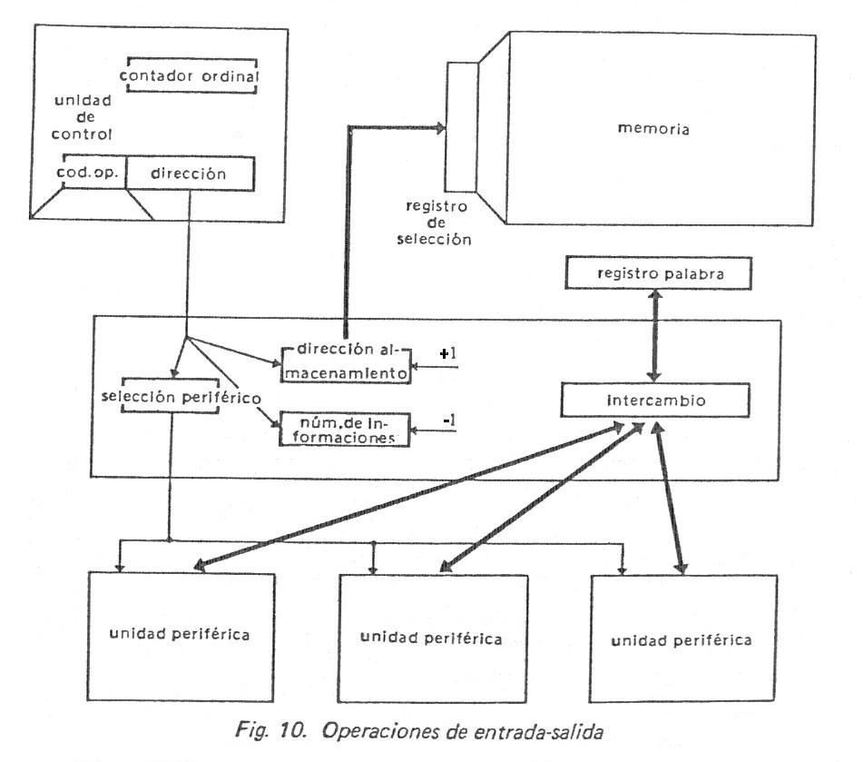
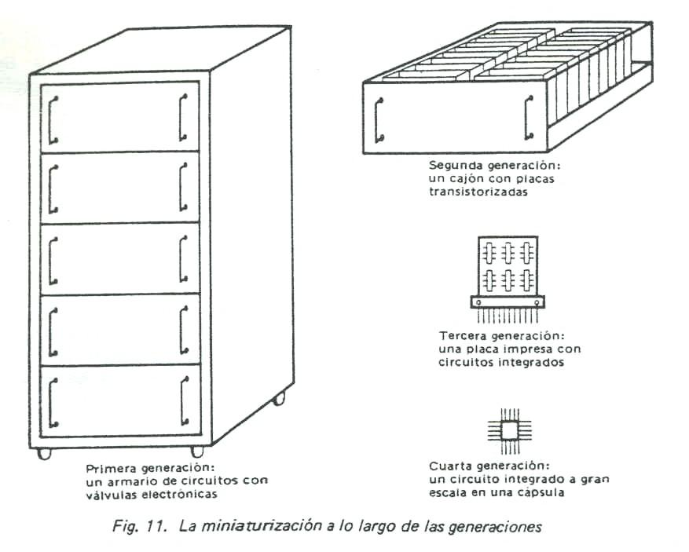

# Introducción

## Contenido

- [INFORMACIÓN REPRESENTACION SIMBOLICA](#información-representacion-simbolica)
- [PROCESAMIENTO DE DATOS](#procesamiento-de-datos)
- [INPUTS](#inputs)
- [PROCESAMIENTO AUTOMÁTICO DE DATOS](#procesamiento-automático-de-datos)
- [SISTEMAS DE INFORMACIÓN](#sistemas-de-información)
- [ORGANIZACIÓN GENERAL DE UNA COMPUTADORA](#organización-general-de-una-computadora)
- [ORGANIZACIÓN GENERAL DE UNA COMPUT ADORA](#organización-general-de-una-comput-adora)
- [HARDWARE Y SOFTWARE](#hardware-y-software)
- [NOCIONES SOBRE EL HARDWARE](#nociones-sobre-el-hardware)
- [PRIMERA VISIÓN DE UNA ARQUITECTURA TIPO VON NEUMANN](#primera-visión-de-una-arquitectura-tipo-von-neumann)
- [MEMORIA CENTRAL O PRINCIPAL](#memoria-central-o-principal)
- [UNIDAD DE CONTROL](#unidad-de-control)
- [LAS UNIDADES PERIFERICAS](#las-unidades-perifericas)
- [EL CANAL](#el-canal)
- [PROGRAMA](#programa)
- [DESARROLLO DE UNA INSTRUCCIÓN DE PROCESAMIENTO](#desarrollo-de-una-instrucción-de-procesamiento)
- [INSTRUCCIÓN DE RUPTURA DE SECUENCIA](#instrucción-de-ruptura-de-secuencia)
- [INSTRUCCIÓN DE INTERCAMBIO CON EL EXTERIOR](#instrucción-de-intercambio-con-el-exterior)
- [LAS INTERRUPCIONES](#las-interrupciones)
- [CONFIGURACION DE UN SISTEMA INFORMATICO](#configuracion-de-un-sistema-informatico)
- [COMPUTADORES DIGITALES Y SISTEMAS DIGITALES](#computadores-digitales-y-sistemas-digitales)
- [LAS GENERACIONES DE COMPUTADORAS](#las-generaciones-de-computadoras)
- [Evolución de la tecnología](#evolución-de-la-tecnología)
- [Evolución de la explotación de los ordenadores](#evolución-de-la-explotación-de-los-ordenadores)

Concepto de Sistema de Información y Procesamiento de Datos

**SISTEMA:** Conjunto de componentes coordinados que trabajan juntos para lograr objetivo comunes. Es un conjunto de elementos dinámicamente relacionados entre sí, operando sobre entradas (datos, energía, información), proveyendo salidas (datos, energía, información). Estos son la razón de su existencia y lo determinan en un ámbito dado.

Componentes + Relaciones **SISTEMA** (puede dividirse en SUBSISTEMAS)

**DATO:** Representación simbólica de propiedades de entes o sucesos. Son realidades cuantitativas o cualitativas determinadas en una situación.

Los datos tienen la propiedad de que se pueden:

Transmitir

Almacenar (para su uso posterior)

Transformar (operando sobre ellos para obtener nuevos datos)

Ejemplo: edad, fecha, estatura, temperatura, velocidad, etc.

**INFORMACIÓN:** Representación simbólica de entes, hechos, sucesos, cualidades, etc. que, por el significado que les atribuye quien las percibe e interpreta, permiten disminuir la incertidumbre en una decisión, lo que **no** ocurre con los datos. La información sirve para la toma de decisiones, que se obtiene procesando ciertos datos. La decisión que se toma a partir de la información que se obtiene es individual.

Además permite concretar la acción determinando los pasos a realizar y la secuencia a seguir. Esta información descriptiva es la que permite la acción.

En las máquinas la información descriptiva se encuentra en la memoria constituyendo **programas** que indican la secuencia de operaciones a seguir para lograr el resultado deseado. También existe información de control que permite verificar si las acciones planificadas se realizan correctamente. Al igual que los datos se puede almacenar, procesar, puede convertirse en la entrada (dato) de otro proceso (retroalimentación).

DATOS & INFORMACION Ambos son representaciones simbólicas

Conjunto de datos que quien los necesita e interpreta puede decidir una acción entre varias.

Puede ocurrir que un mismo mensaje provea información distinta para dos o más decisiones a tomar.

## INFORMACIÓN REPRESENTACION SIMBOLICA

La información puede ser transmitida y almacenada (también puede ser procesada para obtener Nuevas Informaciones)

TRANSMITIR ≠ COMUNICAR

Hay **comunicación** cuando el receptor asigna el *mismo significado* que el que transmite.

## PROCESAMIENTO DE DATOS

## INPUTS

**DATOS** (Conjunto de símbolos)

**OUTPUTS:** INFORMACIÓN

ESTRUCTURA DE DATOS: Es un conjunto de datos o símbolos pero organizado respondiendo a relaciones que no existen antes de procesarlos.

PROCESO: Conjunto finito de pasos u operaciones que deben llevarse a cabo en un cierto orden, relacionando los datos para obtener la información necesaria para resolver un problema. Ejemplo de información va a llover.

PROCESOS SECUENCIALES: Operaciones, totalmente ordenadas en el tiempo que se realizan una por vez.

**I O**

**T****1** **T****2**  **T****3** **T****4**

Las máquinas con arquitectura Von Neumann realizan el procesamiento siguiendo este modelo, no comienzan una operación hasta haber terminado la anterior, es decir, lee la instrucción, realiza la operación, etc.

PROCESOS CONCURRENTES: Hay operaciones que en su ejecución se superponen en el tiempo.

**I O****1**

**O****2**

**T****1** **T****2**  **T****3** **T****4**  **T****5** **T****6**

Muchos procesadores actuales realizan procesos en forma simultánea, siempre y cuando que no utilicen los mismos recursos (memoria, buses, etc.).

MICROCONTROLADOR: puede realizar procesos paralelos, ya que posee dos tipos de memorias

## PROCESAMIENTO AUTOMÁTICO DE DATOS

Las máquinas (computadoras, ordenadores) que procesan según este esquema están basadas en modelo VON NEUMANN.

La computadora dio origen a la INFORMÁTICA que podemos definir como: “todas las tecnologías que colectivamente tratan la recolección, procesamiento y transmisión de información con asistencia de un computador”.

## SISTEMAS DE INFORMACIÓN

Una computadora puede considerarse un sistema que a su vez puede dividirse en subsistemas (memoria, procesador, periféricos, etc.); pero también puede ser un subsistema otro sistema mayor como por ejemplo en un sistema de procesamiento distribuido geográficamente y que esta interconectado mediante un sistema de comunicación.

El sistema de información es un subsistema de la organización: elabora datos útiles (información) para la toma de decisiones.

En una organización las áreas de información, decisión y control están distribuidos en todo el sistema. La información presta servicios a cada subsistema componente ya la organización en conjunto, para lograr el control, coordinación y cooperación de dichos subsistemas, al ser transmitida de unos a otros.

## ORGANIZACIÓN GENERAL DE UNA COMPUTADORA

## ORGANIZACIÓN GENERAL DE UNA COMPUT ADORA

**PERIFERICOS:** es todo aquello que rodea al procesador central.

Entrada

Salida

E/S o I/O

Entrada Salida

 **E/S**

**PERIF. DE ENTRADA:** Proporcionarán al sistema los datos provenientes del exterior.

La función es sensar (detectar) la existencia de señales que representan símbolos (letras, números, etc.) y convertir esa señal eléctrica detectada en señales eléctricas binarias internas. Tiene un conversor externo / interno.

**PERIF. DE SALIDA:** Envían al exterior los resultados almacenados en memoria.

Las señales eléctricas binarias internas que codifican los datos provenientes de la memoria deben convertirse en el periférico en señales adecuadas para el almacenamiento, visualización o transmisión. Tiene un conversor interno / externo.

**MEMORIA PRINCIPAL O CENTRAL:** almacena instrucciones y datos provenientes desde los periféricos y guarda resultados intermedios y finales.

En general un periférico no puede pasar información a otro sin que intervenga la MC.

**PROCESADOR CENTRAL:** Lugar donde se ejecutan las instrucciones contenidas en MC. Si el procesador central está constituido por un único **circuito integrado** se denomina microprocesador (mP).

El procesador tiene 3 secciones principales:

\*UC: Unidad de control

\*UAL: Unidad Aritmético Lógica.

\*Registros auxiliares

**CANALES** (Interfases de Adaptación y Control de Periféricos y Unidades de Acceso Directo a Memoria: IACP y UADM)

Elemento que actúa como interfaz. Son dispositivos intermedios entre los periféricos y la memoria. Su función es adaptar las diferencias de velocidad de funcionamiento existente entre la CPU y los periféricos.

Analicemos las diferencias de velocidad:

El tiempo de acceso a memoria para leer o escribir una información está en el orden de 10 a 100 ns. (1 ns = 10-9 s) por lo tanto en 1 s se podrían realizar 107 escrituras o lecturas.

En un disco, teniendo en cuenta que posee elementos mecánicos, necesita de 1 a 5 ms. Para que la cabeza de lectura se posicione sobre la pista y sector correspondiente y luego la información puede transmitirse a aproximadamente 500.000 a un millón de transferencias /segundo.

En una impresora rápida se pueden lograr 6000 transferencias/segundo.

Los canales (IACP) deben adaptar estas disímiles velocidades y para ello poseen una memoria buffer de capacidad limitada.

**MEMORIA BUFFER:** Utilizan algunos periféricos para adaptarse a la velocidad de la CPU e igualmente los canales, dados a que algunos periféricos y canales no trabajan a la misma velocidad que el procesador necesitan de la memoria buffer.

## HARDWARE Y SOFTWARE

**HARDWARE:** Constituye la porción material o “dura” que no cambia, que permanece con cada proceso particular de datos. Es todo aquello que soporta al software.

Es la totalidad física, conformada por todos los componentes de su equipamiento: circuitos electrónicos, plaquetas que los soportan, cables, mecanismos, discos, cintas gabinetes, tomillos, pantallas. etc.

**SOFTWARE:** Se utiliza como sinónimo de programa. Se refiere a todos los programas que pueden ejecutar en un equipo de computación. Todo aquello que es fácilmente modificable o que puede modificarse en algún proceso particular de datos.

**FIRMWARE:** Es posible incluir programas y datos en una parte de la memoria principal que tenga almacenamiento permanente (no se borra al desconectar los circuitos de la fuente de alimentación).

Esos, **circuitos integrados** constituyen las denominadas memorias ROM (Read Only Memory). Los programas y tablas de datos contenidos no pueden cambiarse. Solo pueden leerse.

Los programas incluidos en firmware son de uso muy frecuente, tales como programas iniciadores de funcionamiento de máquina, de verificación de funcionamiento del hardware, programas traductores, etc., estos son grabados electrónicamente.

## NOCIONES SOBRE EL HARDWARE

Podemos admitir que el hardware se nutre de dos disciplinas: la TECNOLOGIA (fundamentalmente electrónica) y la LÓGICA. La tecnología aporta los avances en los componentes (transistores, resistencias, elementos de memoria, dispositivos ópticos, etc.) y la lógica aporta el estudio de cómo ensamblar esos componentes para construir registros, sumadores, circuitos de selección o unidades de mayor complejidad como ser memorias, la unidad aritmético – lógica, etc.

La ARQUITECTURA es otra disciplina, de importancia cada vez mayor, que apoya la construcción de sistemas informáticos de complejidad cada vez mayor.

## PRIMERA VISIÓN DE UNA ARQUITECTURA TIPO VON NEUMANN

Von Neumann, en 1945, propone los conceptos fundamentales en que se basan las computadoras tal como las conocemos actualmente.

1.  **Programa almacenado:** En la memoria de la máquina se encuentran tanto los datos a procesar como los programas con la secuencia de instrucciones para el procesamiento.
2.  **Ruptura de secuencia:** Von Neumann concibió la idea de hacer automáticas las operaciones de decisión lógica, dotando a las máquinas de la instrucción de **salto condicional**, teniendo en cuenta el resultado de una operación realizada con anterioridad seguiría una parte u otra del programa.

En una visión muy general un computador se compone de:

1.  **Memoria Central:** Almacena los programas y datos
2.  **Unidad Central de Proceso:** Ejecuta el programa
3.  **Unidades de Entrada/Salida:** Permite el intercambio con el exterior

A veces se llama sistema informático al conjunto ordenador + elementos a él conectados.

# Principio de funcionamiento del computador

## MEMORIA CENTRAL O PRINCIPAL

El programa a ser ejecutado debe encontrarse en memoria central, en el momento que se va a ejecutar. Almacena fundamentalmente dos tipos de información:

1.  Instrucciones del programa (o informaciones descriptoras del tratamiento) que la maquina deberá ejecutar.
2.  Datos (dicho a veces operandos o informaciones a tratar), con los que trabajará la máquina, de acuerdo a lo indicado en el programa.

Estos dos tipos de información tienen su correspondencia física en dos unidades peculiares de la máquina: **la unidad de control**, también llamada **unidad de instrucciones** o **unidad de gobierno**, para las instrucciones, y la ALU o **unidad de proceso**, para los datos.

ALU

Manejada por la unidad de control (CU), ejecuta las operaciones con los datos *almacenados* en la memoria principal.

Para pedir al ordenador una operación aritmética, por ejemplo una suma, la instrucción debe facilitarle las siguientes informaciones:

1.  La clase de operación a realizar, en este caso una suma, es el papel del **código de operación**.
2.  La dirección de la célula de memoria que contiene el primer dato, o **primer operando**.
3.  La dirección de la célula de memoria que tiene el **segundo operando**.
4.  La dirección de la célula de memoria donde quiere almacenarse el resultado.
5.  La dirección de la célula de memoria de la siguiente instrucción.

De acuerdo a como se resuelvan las cuestiones anteriormente enunciadas, tendremos 4 formatos de instrucción:

1.  Instrucciones de 4 direcciones

|  |  |  |  |  |
|----|----|----|----|----|
| Código de Operación | Dirección 1er Operando | Dirección 2do Operando | Dirección Resultado | Dirección Siguiente Instrucción |

2.  Instrucciones de 3 direcciones

|  |  |  |  |
|----|----|----|----|
| Código de Operación | Dirección 1er Operando | Dirección 2do Operando | Dirección Resultado |

Cuando se utiliza este formato de instrucción se supone que la siguiente instrucción se encuentra almacenada en la dirección de memoria siguiente a la que se está ejecutando.

La figura a representa una ALU capaz de ejecutar la operación anterior (de tres direcciones), la cual esta rodeada de 3 registros donde se memorizan los dos operandos y el resultado. La instrucción de suma necesita cuatro accesos a la memoria central, que permiten sucesivamente buscar la instrucción, después el 1er operando, después el 2do operando y por ultimo, almacenar el resultado. A las máquinas que utilizan este tipo de instrucción se les llama maquinas de tres direcciones.

3.  Instrucciones de 2 direcciones

|  |  |  |
|----|----|----|
| Código de Operación | Dirección 1er Operando | Dirección 2do Operando |

En las máquinas que utilizan este formato de instrucción el resultado generalmente se guarda en la dirección del primer operando. Es importante que el programador tenga en cuenta esto ya que ese operando se perderá.

4.  Instrucciones de 1 dirección

|                     |                        |
|---------------------|------------------------|
| Código de Operación | Dirección del Operando |

Abacus es una máquina de una dirección. Su ALU posee un registro particular denominado **Acumulador**, que contiene tanto el 1er operando como el resultado. Esta característica permite instrucciones de una sola dirección: la del segundo operando.

En estas máquinas la operación de SUMA necesita 3 instrucciones para:

1.  Cargar el primer operando en el Acumulador.
2.  Sumar el segundo operando con el contenido del Acumulador.
3.  Almacenar en memoria central el contenido del Acumulador.

Cada una de estas 3 instrucciones comportara un código de operación y una dirección:

|       |                     |                            |
|-------|---------------------|----------------------------|
|       | Código de Operación | Dirección                  |
|       |                     |                            |
| \(1\) | Carga               | Dirección del 1er operando |
| \(2\) | Adición             | Dirección del 2do operando |
| \(3\) | Almacenamiento      | Dirección del resultado    |

La ALU esquematizada en la figura b, donde el acumulador sustituye a los registros R1 y R3 de la figura a. El segundo operando puede almacenarse durante la operación en el registro de palabra asociado a la memoria. Este es el caso del Abacus.

1.  Instrucciones sin dirección

Este caso se presenta fundamentalmente en las máquinas con MICROPROCESADOR en las cuales la longitud de la palabra es generalmente de 1 byte y se ocupa íntegramente para el código de operación, la dirección del operando se encuentra en la dirección o direcciones siguientes al de la instrucción.

## UNIDAD DE CONTROL

Esta unidad se encarga de extraer y analizar las instrucciones de la memoria central, luego establece las conexiones eléctricas correspondientes dentro de la ALU y extrae los datos de la MC implicados por la instrucción. Por último ordena a la ALU el tratamiento de los datos extraídos. Eventualmente, suele almacenar el resultado en la memoria central. Básicamente consta de dos registros:

1.  **Contador de Instrucciones** o contador de programa o contador ordinal: contiene la dirección de la próxima instrucción por ejecutar.
2.  **Registro de Instrucción:** contiene la instrucción extraída de la memoria. El registro de instrucción de Abacus tiene 2 partes: una para el código de operación, que define el tipo de instrucción a ejecutar (suma, multiplicación, salto, etc.) y otra parte, que contiene la dirección del operando.

Otro elemento fundamental de la unidad de control es un órgano llamado **generador de secuencias** o **secuenciador**, que es el encargado de analizar el código de operación de la instrucción, y en base a ello distribuir las microórdenes al conjunto de las unidades del ordenador (memoria, ALU, etc.) para hacer ejecutar las distintas Fases de la instrucción.

La unidad de control y unidad aritmética forma un todo en la mayoría de los ordenadores, que se suele denominar **unidad central** o **unidad central de proceso** o **procesador central**.

## LAS UNIDADES PERIFERICAS

Son los elementos que permiten a la máquina el intercambio con el mundo exterior. Podemos citar: unidades de cinta, unidades de disco (rígido, flexible, óptico), teclados, monitores, impresoras, conversores analógico/digitales o dígito/analógicos, módem, etc.

**Las memorias auxiliares:** que sirven como soporte de almacenamiento de gran capacidad y medio de comunicación en el interior del sistema. Están representadas fundamentalmente por cintas magnéticas, discos magnéticos y ópticos.

La mayoría de estas unidades constan de dos partes:

1.  Una parte electrónica, llamada **controlador** o *unidad de control del periférico*.
2.  Una unidad electromecánica que, gobernada por la primera, lee o escribe informaciones.

Las unidades periféricas se conectan, bien a la unidad central, bien directamente a la memoria a través de unidades especializadas en la gestión de las transferencias de información. Estas unidades de intercambio se llaman canales.

Como se menciono anteriormente la unidad de control gobierna la ejecución de las operaciones pedidas por el programa. Si la operación es un cálculo, es la ALU quién lo realiza, si es una transferencia de informaciones con el exterior (instrucción de entrada/salida), se cede el control a un canal.

## EL CANAL

Cuando se efectúan intercambios entre el exterior y la máquina o viceversa, actúa la unidad denominada CANAL; dispositivo especializado para gestionar las operaciones de entrada – salida (I/O).

En las máquinas actuales, las transferencias de información entre el procesador central (CPU) y los periféricos pueden realizarse en forma “simultánea” con el desarrollo de un programa de cálculo. Esta simultaneidad es posible a causa de la gran diferencia de velocidad que existe entre los periféricos y el interior de la máquina (CPU y MC). Por consiguiente los canales o INTERFACES DE ADAPTACIÓN Y CONTROL DE PERIFERICOS (IACP), deben adaptar esas disímiles velocidades, para lo cual cuentan con registros especializados para este fin.

Las informaciones producidas, como resultado del procesamiento, son almacenadas en memoria central en forma secuencial. Para inicializar tal transferencia, especiales instrucciones de entrada – salida deben suministrar al canal, por una parte, la dirección de la unidad periférica implicada y, por otra, la dirección para el almacenamiento de la primera información y el número de informaciones por transferir. En lo sucesivo, el canal se ocupara totalmente de la gestión de la transferencia; por cada información transferida, añadirá 1 a la dirección de almacenamiento y restara 1 al numero de informaciones por transferir. El canal advertirá a la unidad de control en el momento en que todas las informaciones hayan sido transferidas.

## PROGRAMA

Se trata de un conjunto de instrucciones, que deben encontrarse en la memoria central, almacenadas secuencialmente o no; esto nos indica que las instrucciones pueden estar o no en direcciones sucesivas de memoria. En este primer análisis supondremos que las instrucciones se encuentran almacenadas en forma sucesiva en memoria.

Esquemáticamente dividiremos a las instrucciones en tres clases:

1.  **Instrucciones de procesamiento:** sobre operandos contenidos en memoria. Operaciones aritméticas, lógicas o de almacenamiento – escritura en memoria.
2.  Instrucciones de ruptura de secuencia.
3.  **Instrucciones de intercambio** entre el medio exterior y el ordenador.

## DESARROLLO DE UNA INSTRUCCIÓN DE PROCESAMIENTO

El desarrollo de una instrucción de procesamiento en un computador de una dirección, como Abacus, puede descomponerse en tres fases:

1.  Fase de búsqueda y análisis de la instrucción
2.  Fase de búsqueda y procesamiento del operando
3.  Fase de almacenamiento del resultado.
4.  Fase de preparación para la próxima instrucción.

- **Búsqueda de la Instrucción:** La Unidad de Control ordena la transferencia del contenido del contador ordinal (es decir, la dirección de la instrucción por ejecutar) al registro de selección de memoria, y envía a la memoria una orden de lectura. Una vez terminada la operación de lectura, la instrucción queda disponible en el registro de palabra. Entonces la unidad de control ordena la transferencia del contenido de este registro al de instrucción. Los circuitos especializados de la unidad de control pueden ya analizar el código de operación de la instrucción. Esta primera fase es común a todos los tipos de instrucción.

- **Búsqueda y Procesamiento del Operando:** Una vez analizado el código de operación de la instrucción, la unidad de control sabe que se trata de una instrucción de procesamiento, con búsqueda previa del operando. La dirección del operando se encuentra en la zona de dirección del registro de instrucción. La unidad de control ordena su transferencia al registro de selección de memoria y acto seguido ordena una operación de lectura en la memoria. Al finalizar dicha operación, el operando buscado queda disponible en el registro de palabra. La unidad de control posiciona los circuitos de la ALU para realizar el procesamiento solicitado por el código de operación y ordena la transferencia del operando a la ALU. El resultado del procesamiento queda almacenado en el acumulador. Obsérvese que un posible procesamiento pudiera ser simplemente una transferencia del operando al acumulador.

- **Almacenamiento del Resultado:** La dirección de almacenamiento del operando se encuentra en la zona de dirección del registro de instrucción: la unidad de control ordena su transferencia al registro de selección de la memoria. El operando por almacenar esta en el acumulador: la unidad de control ordena su transferencia al registro de palabra de memoria. Luego de esto el secuenciador emite la orden de escritura y el resultado queda almacenado en memoria central.

- **Preparación para la Próxima Instrucción:** Consiste en aumentar en una unidad el contenido del Contador Ordinal de la unidad de control, de manera que contenga la dirección de la próxima instrucción. Esta operación se realiza luego del análisis del código de operación de la instrucción, ya que el incremento se producirá automáticamente para todas las instrucciones que no sean de ruptura de secuencia.

## INSTRUCCIÓN DE RUPTURA DE SECUENCIA

Este tipo de instrucciones, también llamado instrucción de bifurcación o de salto, permite modificar el desarrollo secuencial del programa. La ruptura de secuencia puede ser **condicional** o **incondicional**.

El salto puede ser **incondicional**, la dirección de la siguiente instrucción está contenida en la propia instrucción de salto y es transferida al contador ordinal.

En el caso de salto **condicional** esta no tendrá efecto más que si se satisface una determinada condición, normalmente relacionada con el contenido del acumulador; si la condición no se satisface, el programa continuará en secuencia. El código de operación de la instrucción establece la condición y en la zona de dirección de la instrucción indica el emplazamiento de la próxima instrucción por ejecutar en el caso de satisfacerse la condición. Si la respuesta de la ALU es que la condición se ve satisfecha, la unidad de control ordena la transferencia de la dirección, contenida en la instrucción, al contador ordinal e inhibe la suma de una unidad al contador ordinal, en caso contrario, se ordena incrementar en 1 el contador.

## INSTRUCCIÓN DE INTERCAMBIO CON EL EXTERIOR

Para que el canal pueda encargarse, en forma autónoma, de las transferencias desde y hacia el exterior, es necesario que la CU le suministre la dirección del periférico implicado, la dirección de la primer información y la cantidad de informaciones por transferir. Luego el canal se ocupará totalmente de la gestión, como se indicó cuando se describió el canal.

## LAS INTERRUPCIONES

Las **interrupciones** son órdenes que dimanan del medio exterior y que piden al ordenador ejecutar un programa asociado a la orden. El programa en curso se ve interrumpido para permitir la ejecución del programa solicitado por la interrupción, considerado ahora como prioritario. Acabado este último, se reanuda la ejecución del programa interrumpido. Es gracias a las interrupciones, por poner un ejemplo, como los canales avisan a la unidad de control que una operación de entrada – salida ha llegado a su fin.

## CONFIGURACION DE UN SISTEMA INFORMATICO

Se llama configuración de un sistema de procesamiento de la información a la lista, posiblemente acompañada de sus características, de las unidades que lo componen, y la forma en que se deben interconectar.

## COMPUTADORES DIGITALES Y SISTEMAS DIGITALES

Los computadores se usan para cálculos científicos, procesamientos de datos comerciales y de negocios, control de tráfico aéreo, dirección espacial, campo educacional y en muchas otras áreas, también cabe aclarar que los computadores digitales han hecho posible muchos avances en distintas áreas y que no se hubiesen podido lograr por otros medios. La propiedad más impactante de un computador es su generalidad. Puede seguir una serie de instrucciones, llamadas **programa,** que operan con datos dados. El usuario puede determinar y cambiar los programas y datos de acuerdo a una necesidad específica. Como resultado de esta f1exibilidad, los computadores digitales de uso general pueden realizar una serie de tareas de procesamiento de información de amplia variedad.

El computador digital de uso general es el ejemplo más conocido de **sistema digital**. Otros ejemplos incluyen conmutadores telefónicos, voltímetros digitales, contadores de frecuencia, máquinas calculadoras, y máquinas teletipos. Es característico de un sistema digital la manipulación de **elementos discretos** de información. Tales elementos discretos pueden ser impulsos eléctricos, los dígitos decimales, las letras de un alfabeto, las operaciones aritméticas, los símbolos de puntuación o cualquier otro conjunto de símbolos significativos. La yuxtaposición de elementos discretos de información representan una cantidad de información. Por ejemplo, las letras d, o y g forman la palabra dog. Los dígitos 237 forman un número.

De la misma manera una secuencia de elementos discretos forman un lenguaje, es decir una disciplina que con lleva información. Los primeros computadores fueron usados principalmente para cálculos numéricos, en este caso los elementos discretos usados son los dígitos. De esta aplicación ha surgido el término computador digital. Un nombre mas adecuado para un computador digital podría ser “sistema de procesamiento de información discreta”.

Los elementos discretos de información se representan en un sistema digital por cantidades físicas llamadas **señales.** Las señales eléctricas tales como voltajes y corrientes son las más comunes. Las señales en los sistemas digitales electrónicos de la actualidad tienen solamente dos valores discretos y se les llama **binarios.** El diseñador de sistemas digitales está restringido al uso de señales binarias debido a la baja confiabilidad de los circuitos electrónicos de muchos valores. Debido a la restricción física de los componentes y a que la lógica humana tiende a ser binaria, los sistemas digitales que estén restringidos a usar valores discretos, lo estarán para usar valores binarios.

Las cantidades discretas de información podrían desprenderse de la naturaleza del proceso o podrían ser cuantificadas a propósito de un proceso continuo. Por ejemplo, un programa de pago es un proceso que contiene nombres de empleados, números de seguro social, salarios semanales, impuestos de renta, etc. El cheque de pago de un empleado, se procesa usando valores discretos, tales como las letras de un alfabeto (nombres), dígitos (salarios) y símbolos especiales tales como \$. Por otra parte, un científico investigador podría observar un proceso continuo pero anotar solamente cantidades específicas en forma tabular. El científico estará cuantificando sus datos continuos. Cada número en su tabla constituye un elemento discreto de información.

Un **computador análogo** realiza una **simulación** directa de un sistema físico. Cada sección del computador es similar al de alguna parte específica del proceso sometido a estudio. Las variables en el computador análogo están representadas por señales continuas que varían con el tiempo y que por lo general son voltajes eléctricos. Las señales variables son consideradas similares con aquellas del proceso y se comportan de la misma manera.

Una calculadora electrónica es un sistema digital similar al computador digital que tiene como elemento de entrada el teclado y como elemento de salida una pantalla numérica. Inclusive Algunas calculadoras tienen forma de imprimir y además facilidad de programación. Sin embargo un aparato más poderoso que una calculadora; puede usar muchos otros dispositivos de entrada y salida, puede realizar no solamente cálculos aritméticos y operaciones lógicas sino que puede ser programado para tomar decisiones basadas en condiciones internas y externas.

Un computador digital es una interconexión de módulos digitales. Un procesador combinado con la unidad de control forma un componente llamado unidad central de proceso o CPU. Un CPU encapsulado en una pastilla de circuito integrado se denomina **microprocesador.** La unidad de memoria, de la misma forma que la parte que controla la interconexión entre el microprocesador y los elementos de entrada y salida, puede ser encapsulada dentro de la pastilla del microprocesador o puede encontrarse en pastillas pequeñas de circuitos integrados. Un CPU combinado con una memoria y un control de interconexión formará un computador de tamaño pequeño denominado **microcomputador.**

Los elementos de entrada y salida son sistemas digitales especiales manejables por partes electromecánicas y controladas por circuitos electrónicos digitales.

En síntesis un computador digital manipula elementos discretos de información y que estos elementos se presentan en forma binaria. Los operandos, usados en los cálculos pueden ser expresados en el sistema de números binarios. Otros elementos discretos, incluidos los dígitos decimales, se representan con códigos binarios. El procesamiento de datos se lleva acabo por medio de los elementos lógicos binarios, usando señales binarias. Las cantidades se acumulan en los elementos de almacenamiento binario.

## LAS GENERACIONES DE COMPUTADORAS

## Evolución de la tecnología

En primera aproximación puede hacerse corresponder sucesivamente las válvulas electrónicas a la primera generación, los transistores a la segunda, los circuitos integrados a la tercera y con mucha probabilidad, los circuitos integrados a media o a gran escala a la cuarta.

De una a otra generación se han conseguido progresos, algunas veces considerables, en las características de los circuitos: miniaturización, fiabilidad, complejidad y velocidad.

**La miniaturización** se ilustra en la figura 11, donde se representa cómo la misma función lógica necesitaba un armario en la generación de las válvulas, un cajón o parte de uno en la generación de los transistores, una placa impresa en la de los circuitos integrados a pequeña escala, una cápsula de circuito en la generación de los circuitos integrados a gran escala.

**La fiabilidad** introduce la noción de calidad de funcionamiento de un componente o de un conjunto. Se mide por el factor M.T.B.F. (Mean Time Between Failure) que expresa el promedio de tiempos entre averías o, si se quiere conservar las siglas, la Media de los Tiempos de Buen Funcionamiento. Media que ha pasado de varias decenas de minutos para una unidad central de la primera generación a varios miles de horas para una unidad central equivalente de la tercera.

Tal progreso en el terreno de la fiabilidad se debe a dos causas: el progreso en la fiabilidad del componente y la reducción, gracias a la integración, del número de interconexiones.

**La complejidad** la posibilidad de concebir conjuntos electrónicos cada vez más complejos es un corolario directo de la ganancia en fiabilidad. Así es como, a igual fiabilidad, pueden hoy realizarse conjuntos electrónicos 1.000 a 10.000 veces más complejos que en la tecnología de válvulas.

**La velocidad** los tiempos de conmutación de los circuitos lógicos han pasado de los varios microsegundos de la primera generación a varios nanosegundos en la tercera. Esto ha permitido pasar de máquinas de un millar de instrucciones por segundo a máquinas, de complejidad equivalente, que ejecutan un millón de instrucciones por segundo.

## Evolución de la explotación de los ordenadores

Las sucesivas generaciones se nutren de tecnologías diferentes y se diferencian sobre todo en las técnicas de organización y explotación.

El ordenador de la **primera generación** (**válvulas electrónicas**) ejecutaba sus trabajos de manera puramente secuencial, cada uno en tres tiempos:

1.  1)  el programa perforado en tarjetas o en cinta de papel era leído y registrado en memoria gracias a un programa cargador;
    2)  el programa era ejecutado;
    3)  se imprimían los resultados.

Era posible incluir en el programa lecturas de nuevos datos o impresiones de resultados parciales, pero las operaciones de procesamiento, de entrada o de salida tenían que encadenarse en el tiempo, con lo que la duración de todo el proceso era la suma de todas y cada una de las operaciones.

El ordenador de la **segunda generación** (**transistores**) ofrecía posibilidades de simultaneidad del cálculo con las operaciones de entrada y salida. Sin embargo, el encadenamiento de los trabajos seguía siendo secuencial como en las máquinas de la primera generación, de tal suerte que las posibilidades de simultaneidad no eran tales sino dentro de un mismo programa y, en consecuencia, eran generalmente poco utilizadas. En particular, la unidad central permanecía inactiva cuando se cargaban nuevos programas en memoria.

La desproporción entre la velocidad de cálculo y las velocidades de lectura de tarjetas o de impresión ocasionaba que la unidad central no fuera utilizada realmente más que durante un pequeño porcentaje del tiempo. Se restringió, entonces, a las cintas magnéticas, mucho más rápidas que las lectoras de tarjetas y que las impresoras, el soportar las operaciones de entradas y salidas. Las grandes instalaciones estaban dotadas de un ordenador auxiliar, que realizaba las conversiones de soporte tarjeta a soporte cinta magnética y de cinta magnética a impresora y del computador principal, el cual no conocía ni operaba más que con las cintas magnéticas.

Este procedimiento de explotación se conoce a veces con el nombre de procesamiento por lotes, para indicar que es preciso esperar a que el lote de trabajos cargados en cinta magnética haya sido totalmente procesado, antes de poder obtener los resultados de cualquiera de ellos o poder cargar uno nuevo.

En el curso de esta segunda generación nació un nuevo tipo de aplicación: el control de procesos, en el que el computador va directamente conectado al proceso controlado y en sincronismo con él. La sincronización se obtiene gracias a las interrupciones de programa, que permiten al proceso avisar al ordenador de todo acontecimiento exterior y, en consecuencia, gobernar la ejecución prioritaria de los programas preparados para estos acontecimientos.

El ordenador de la **tercera generación** (**circuitos integrados**) permite explotar eficazmente las simultaneidades latentes ya en la segunda. Varios programas pueden residir simultáneamente en la memoria; en un instante dado sólo uno de ellos utiliza la unidad central, pero los otros pueden simultáneamente efectuar operaciones de entrada – salida.

Cuando el programa que utiliza la unidad central se detiene en espera de una operación de entrada o de salida, otro programa toma su lugar y esto evita los tiempos muertos en la unidad central. Este método de explotación se llama multiprogramación. Permite mejorar el empleo del conjunto de recursos de un sistema informático.

La explotación normal de una computadora de la tercera generación consiste en particionar, o sea, en dividir la memoria en dos zonas, una reservada al paquete de trabajos de 1os usuarios, la otra a los programas de conversión de soporte y al sistema de explotación.

En visión simplista, estas dos particiones corresponden respectivamente a los computadores auxiliar y principal de la precedente generación. Sin embargo hay una diferencia importante: la carga por lotes ha sido sustituida por la carga continua de los trabajos a medida que se presentan. Los trabajos son puestos en cola de espera en el disco magnético, después cargados en memoria para ser ejecutados bajo el control del sistema operativo, quien toma en cuenta su grado de prioridad.

Los resultados son transferidos al disco, de donde serán extraídos más tarde a través de la impresora según sus niveles de prioridad. El utilizador prioritario no se ve forzado a esperar el fin del procesamiento de todo un lote de programas para obtener los resultados del suyo.

La evolución del procesamiento por lotes a la carga continua supone un primer paso en la búsqueda del “confort” en el acceso a un ordenador. Con la tercera generación se han franqueado otras dos etapas hacia ese confort: la posibilidad de trabajar a distancia, o teleprocesamiento, y la posibilidad de trabajar en forma conversacional.

El **teleprocesamiento** no es otra cosa que una extensión del sistema de carga continua, con la ventaja de que pueden someterse los trabajos al ordenador desde unos terminales remotos y recibirse los resultados a través de estos mismos terminales. Estos trabajos quedan incluidos en la cola de espera de trabajos a ejecutar, exactamente igual que aquellos cargados localmente y sometidos a un régimen específico de prioridades.

Los **sistemas conversacionales** permiten a los usuarios seguir el desarrollo de las diferentes etapas de sus programas, así como intervenir sobre este desarrollo, por medio de terminales adaptados al diálogo (teclado, unidad de visualización, máquina de escribir conectada, etc.). A fin de servir simultáneamente a un gran número de usuarios puede el computador operar en tiempo compartido, lo que quiere decir que dedica a cada usuario una parte de su tiempo, con una periodicidad determinada.
