# Unidad Temática I — Circuitos Combinacionales

## Contenido

- [Unidad Temática I — Circuitos Combinacionales](#unidad-temática-i--circuitos-combinacionales)
  - [Contenido](#contenido)
  - [ALGEBRA DE BOOLE](#algebra-de-boole)
  - [ELEMENTOS DEL ÁLGEBRA DE BOOLE](#elementos-del-álgebra-de-boole)
  - [TABLA DE VERDAD](#tabla-de-verdad)
  - [OPERADORES LOGICOS](#operadores-logicos)
  - [FORMA NORMAL O CANONICAS DE UNA FUNCION](#forma-normal-o-canonicas-de-una-funcion)
  - [Simplificación de Funciones de Boole](#simplificación-de-funciones-de-boole)
  - [Diagrama de VEITH – Mapas de KARNAUGH](#diagrama-de-veith--mapas-de-karnaugh)
  - [ALGO DE MINIMIZACION](#algo-de-minimizacion)
  - [CIRCUITOS COMBINACIONALES](#circuitos-combinacionales)
  - [SUMADORES](#sumadores)
  - [SUSTRACTORES](#sustractores)
  - [Convertidores de Código](#convertidores-de-código)
  - [OTROS CIRCUITOS IMPORTANTES](#otros-circuitos-importantes)

## ALGEBRA DE BOOLE

El Álgebra de Boole constituye una formalización apropiada para representar información digital y
proporciona un modelo matemático para determinar la respuesta de los circuitos lógicos,
independientemente del tipo de dispositivos que constituyen dichos circuitos (transistores, reales,
etc.).

Algunas de las aplicaciones del álgebra booleana en conmutación son las siguientes:

1. Expresión algebraica de los requerimientos que debe cumplir un circuito lógico.
2. Análisis y síntesis de circuitos combinacionales.
3. Comparación de distintas realizaciones circuitales.
4. Minimización del número de cables y dispositivos en los circuitos.
5. Codificación de información digital.
6. Herramienta auxiliar para analizar y sintetizar circuitos secuenciales.

Llamaremos **CIRCUITOS LOGICOS O CIRCUITOS DE CONMUTACION** a un circuito que trate señales lógicas

Decimos que un circuito es **COMBINACIONAL**: cuando las señales de salida no dependan más que de
las señales de entrada. Y será **SECUENCIAL** si las señales de salida dependen de las de señales de
entrada y del tiempo. Los circuitos secuenciales poseen elementos de memoria.

El estudio de los circuitos combinacionales se basa en el **álgebra de boole** y el de los circuitos
secuenciales en la **teoría de autómatas finitos**: tiene una cantidad de estados determinado que no
es infinito.

## ELEMENTOS DEL ÁLGEBRA DE BOOLE

**Variables Lógicas:** variables binarias que solo pueden tener un valor entre dos distintos, por
convención las llamaremos 0 (cero, o falso) y 1 (uno, o verdadero); A, B, C… ε {0, 1}.

**Funciones Lógicas o booleanas:** Son funciones de n variables lógicas que toman valores en el
conjunto 0, 1; F (A1, A2, A3,…, An) ε {0, 1}

1. **Función inversa o complementación:** Función que permite invertir cualquier secuencia de ceros
   y unos. F(A) = A’

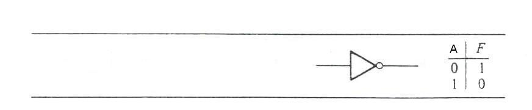

1. **Función intersección o producto lógico:** Operación que se materializa mediante la compuerta
   AND y cumple la siguiente tabla de verdad.

F (A, B) = A**.** B o A ^ B

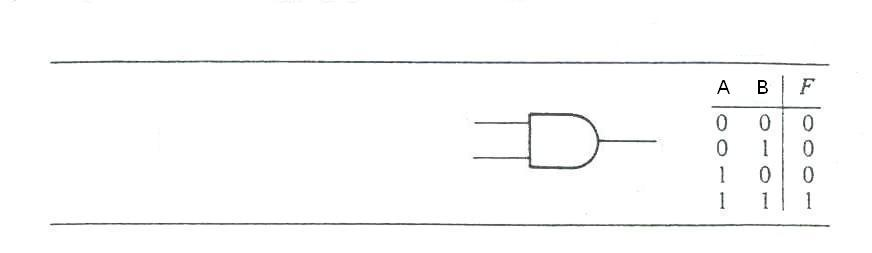

1. **Función reunión o suma lógica:** Operación que se materializa mediante la compuerta OR y que
   debe cumplir la siguiente tabla de verdad.

F (A, B) = A + B o A v B

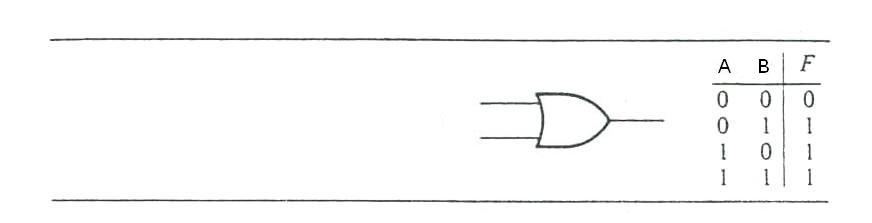

Para realizar las operaciones lógicas se opera con cada par de bits de A y B y se procesan,
continuando con el siguiente para y así sucesivamente.

Ejemplo:

A = 1010101 y B = 0000011

A + B = 1010111

A**.** B = 0000001

## TABLA DE VERDAD

Es una tabla, con todas las combinaciones posibles de las variables, que muestra la relación entre
los valores que las variables pueden tomar y el resultado de la operación para un circuito digital
determinado. Cualquier función de Boole puede ser representada por una tabla de verdad. En número de
filas en la tabla es de 2n donde n es el número de variables binarias de la función. Las
combinaciones de unos y ceros se pueden obtener fácilmente para cada fila de los números binarios
contando desde 0 a 2n-1. Para cada fila de la tabla hay un valor para la función igual a
1 ó 0.

## OPERADORES LOGICOS

**Compuerta AND:** Designamos la salida de una compuerta AND como el producto lógico de las
entradas; en este caso la salida será 1 si y solo si todas las entradas son 1, caso contrario es
igual a 0. La compuerta AND puede tener más de 2 entradas.

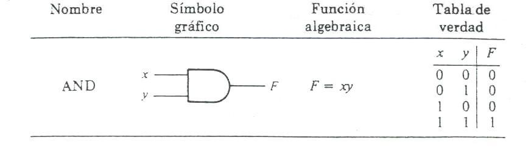

**Compuerta OR:** De acuerdo a la tabla la compuerta OR realizará la suma lógica de los valores de
las entradas; la salida será 0 si y solo si todas las entradas son 0, caso contrario la salida es
igual a 1. También la compuerta OR puede tener más de 2 entradas.

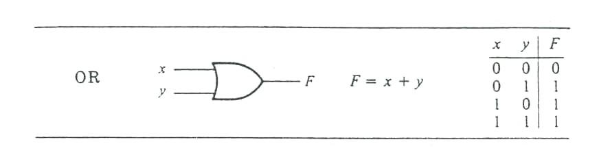

**Compuerta NOT – INVERSOR:** La compuerta NOT entrega a la salida el complemento de la señal de
entrada. Es el único operador con una sola entrada.

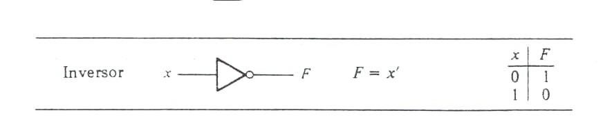

**Compuerta BUFFER o SEPARADOR:** El símbolo triángulo designa para sí solo un circuito separador
(buffer). Un circuito separador produce la función de transferencia pero no produce ninguna
operación lógica particular ya que el valor binario de la salida es igual al valor binario de la
entrada. Este circuito se usa solamente para amplificación de señal de potencia y es equivalente a
dos inversores conectados en cascada.

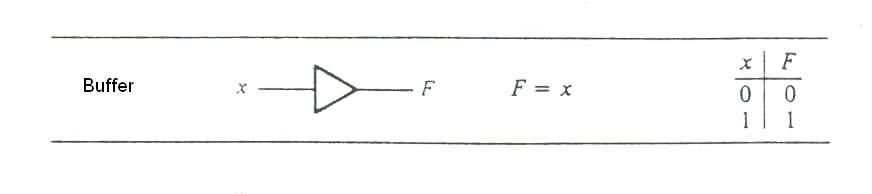

**Compuerta NAND:** La compuerta NAND surge de invertir la salida de una compuerta AND, por lo
tanto, cada resultado de la compuerta NAND será el complemento de su correspondiente de la compuerta
AND.

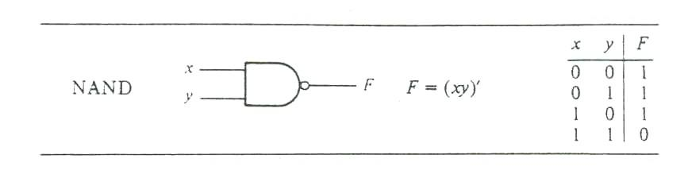

**Compuerta NOR:** La compuerta NOR es una compuerta OR con un inversor en su salida, como
consecuencia complementa cada resultado que ésta genera, de modo de realizar una suma lógica negada.

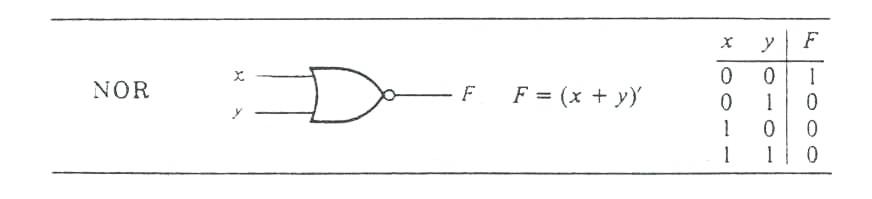

**Compuerta XOR (OR EXCLUSIVO):** Esta compuerta es similar a la compuerta OR, pero excluye la
combinación de ambos, X y Y igual a 1, de acuerdo a esto, la salida de la compuerta XOR es igual a 1
si al menos una y a lo sumo una de las dos entradas es igual a uno, pero no ambas.

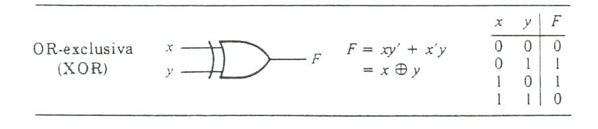

**Compuerta XOR NEGADO (NOR EXCLUSIVO):** La salida de la compuerta XOR NEGADO es igual a 1 cuando
las dos variables son iguales, es decir, cuando ambas son 1 o ambas son 0. También se llama
**equivalencia**, y se puede ver que esta compuerta es el complemento de la OR EXCLUSIVO.

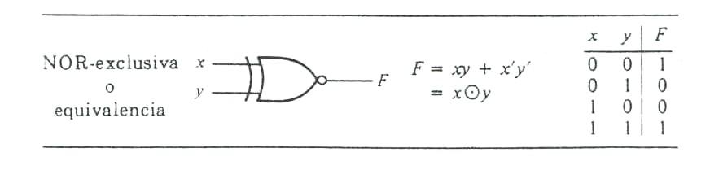

Para un circuito digital cualquiera podemos establecer una expresión booleana y la tabla de verdad
correspondiente.

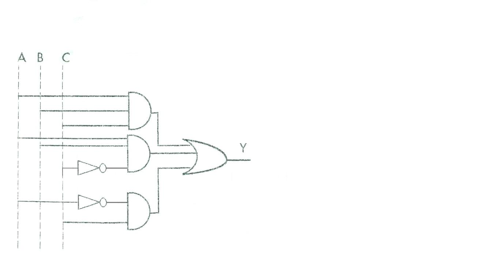

Expresión Booleana

**Y = ABC + ABC’ + A’ C**

Tabla de Verdad

|     |     |     |     |     |      |     |     |                      |
| --- | --- | --- | --- | --- | ---- | --- | --- | -------------------- |
| A   | B   | C   | ABC | C’  | ABC’ | A’  | A’C | (ABC) + (ABC’) + A’C |
| 0   | 0   | 0   | 0   | 1   | 0    | 1   | 0   | 0                    |
| 0   | 0   | 1   | 0   | 0   | 0    | 1   | 1   | 1                    |
| 0   | 1   | 0   | 0   | 1   | 0    | 1   | 0   | 0                    |
| 0   | 1   | 1   | 0   | 0   | 0    | 1   | 1   | 1                    |
| 1   | 0   | 0   | 0   | 1   | 0    | 0   | 0   | 0                    |
| 1   | 0   | 1   | 0   | 0   | 0    | 0   | 0   | 0                    |
| 1   | 1   | 0   | 0   | 1   | 1    | 0   | 0   | 1                    |
| 1   | 1   | 1   | 1   | 0   | 0    | 0   | 0   | 1                    |

## FORMA NORMAL O CANONICAS DE UNA FUNCION

Se llama forma normal o canónica a aquella expresión donde cada término de la función contiene todas
las variables en su forma normal o negada.

Entre las aplicaciones de las formas normales, puede citarse: La expresión algebraica de una tabla
de verdad, la determinación de la equivalencia entre funciones y la realización de circuitos
combinacionales mediante las denominadas memorias ROM.

Minitérminos y Maxitérminos

Una variable binaria puede aparecer ya sea en su forma ( X ) o en su forma complementada ( X**’** ).
Si consideramos dos variables binarias X e Y con su operador AND, ya que cada variable puede
aparecer en cualquier forma, hay cuatro combinaciones posibles: X’Y’, X’Y, XY’ y XY. Cada uno de
esos cuatro términos AND se denomina un **Minitérmino** de un Producto normalizado. En forma
semejante pueden combinarse **n** variables para formar **2** **n** \*\*\*\*minitérminos
o términos mínimos.

De manera similar, las **n** variables formando un término OR, con cada variable tildada o no
tildada, darán **2** **n** \***\*combinaciones posibles, denominadas**Maxitérminos\*\* de
las sumas normalizadas. Cada maxitérmino es el complemento de su correspondiente minitérmino y
viceversa.

A las funciones de Boole expresadas como Suma de Minitérminos o Producto de Maxitérminos se dice que
esta en **forma canónica**.

<table>
<tbody>
<tr>
<td></td>
<td></td>
<td></td>
<td colspan="2">Minitérminos</td>
<td colspan="2">Maxitérminos</td>
</tr>
<tr>
<td>x</td>
<td>Y</td>
<td>z</td>
<td>Termino</td>
<td>Designación</td>
<td>Termino</td>
<td>Designación</td>
</tr>
<tr>
<td>0</td>
<td>0</td>
<td>0</td>
<td>x’ y’ z’</td>
<td>m0</td>
<td>x + y + z</td>
<td>M0</td>
</tr>
<tr>
<td>0</td>
<td>0</td>
<td>1</td>
<td>x’ y’ z</td>
<td>m1</td>
<td>x + y + z’</td>
<td>M1</td>
</tr>
<tr>
<td>0</td>
<td>1</td>
<td>0</td>
<td>x’y z’</td>
<td>m2</td>
<td>x + y’ + z</td>
<td>M2</td>
</tr>
<tr>
<td>0</td>
<td>1</td>
<td>1</td>
<td>x’ y z</td>
<td>m3</td>
<td>x + y’ + z’</td>
<td>M3</td>
</tr>
<tr>
<td>1</td>
<td>0</td>
<td>0</td>
<td>x y’ z’</td>
<td>m4</td>
<td>x’ + y + z</td>
<td>M4</td>
</tr>
<tr>
<td>1</td>
<td>0</td>
<td>1</td>
<td>x y’ z</td>
<td>m5</td>
<td>x’ + y + z’</td>
<td>M5</td>
</tr>
<tr>
<td>1</td>
<td>1</td>
<td>0</td>
<td>x y z’</td>
<td>m6</td>
<td>x’ + y’ + z</td>
<td>M6</td>
</tr>
<tr>
<td>1</td>
<td>1</td>
<td>1</td>
<td>x y z</td>
<td>m7</td>
<td>x’ + y’ + z’</td>
<td>M7</td>
</tr>
</tbody>
</table>

Una propiedad importante del álgebra booleana es que cualquier función booleana puede expresarse
como una suma de minitérminos (por “suma” se entiende la aplicación del operador OR en los términos)
y como un producto de maxitérminos (por “producto” se entiende que se aplica el operador AND a los
términos).

**Suma de Minitérminos:**

Son los minitérminos cuya suma define la función de boole, es decir, que son aquellos que dan los 1
de la función en una tabla de verdad. Como la función puede ser 1 ó 0 para cada minitérmino, y ya
que hay 2n minitérminos, se pueden calcular las funciones posibles que pueden formarse
con n variables como 22n.

**Producto de Maxitérminos:**

Cada una de las 22n funciones de n variables binarias pueden expresarse como un producto
de maxitérminos, o sea, son aquellos que dan los 0 de la función en una tabla de verdad.

## Simplificación de Funciones de Boole

Un **literal** es una variable tildada o no tildada. Cuando una función de Boole se ejecuta con
compuertas lógicas, cada literal, o letra da la función designa una entrada a cada compuerta y cada
término se realiza con una compuerta. La minimización del número de literales y el número de
términos dará como resultado un circuito con menos componentes. El número de literales en una
función de Boole puede ser minimizado por medio de manipulaciones algebraicas o mapas de Karnaugh.

1. **Método Algebraico** consiste en utilizar los postulados, los teoremas básicos del álgebra de
   Boole y cualquier otro método de manipulación que sean familiares con el uso.

Ejemplo, dada la siguiente expresión:

F = A’ B’ C + A’ B C’ + A B’ C’ + A B’ C + A B C’

Se simplifica de la siguiente manera:

F = A’ (B’ C + B C’ ) + A ( B’ C + B C’) + A B’ C’

F = (B’ C + B C’ ) (A’ + A ) + A B’ C’

F = (B’ C + B C’ ) + A B’ C’

El problema de este método es que el procedimiento de minimización es un tanto raro ya que carece de
reglas específicas para predecir cada paso sucesivo en el proceso de manipulación.

1. **Métodos gráficos** que facilitan las simplificaciones.

## Diagrama de VEITH – Mapas de KARNAUGH

El diagrama de VEITH-KARNAUGH constituye otra forma de representar una función, siendo en esencia
una tabla de verdad en dos dimensiones. Por consiguiente, una función expresada por su tabla de
verdad puede representarse directamente en un diagrama de Veitch o mapas de Karnaugh.

Por la disposición de las variables en el diagrama, es posible hallar rápidamente una expresión
sencilla de la función representada, mediante un adecuado agrupamiento de los “unos” o bien de los
“ceros” contenidos en el mismo.

Esta simplificación o minimización permite determinar entre las expresiones del tipo suma de
productos o producto de sumas, las más simples, correspondiéndoles circuitos con dos niveles que
presentan el menor número de compuertas y de entradas por compuertas. Por lo tanto, el método del
mapa de Karnaugh presenta un procedimiento más simple, directo y menos engorroso, que el método
algebraico, para minimizar las funciones de Boole.

El uso de los diagramas de Veitch – Karnaugh se limita a funciones de hasta 5 variables como máximo,
debido a que se torna difícil la minimización de funciones más complejas.

Procedimiento de simplificación

El mapa permite llegar al mismo resultado que el procedimiento de minimización algebraico, siguiendo
los siguientes pasos generales:

1. Si partimos de una expresión algebraica, el primer paso consiste en expresar la función como una
   suma de productos. Luego se confecciona la tabla de verdad, y se determina los valores que toma
   la función.

2. Para cada combinación de variables que producen un 1 en la función, se coloca un 1 en la celda
   correspondiente del mapa.

3. Agrupamos todas las celdillas adyacentes en grupos de 1, 2, 4 u 8 celdillas. Sin dejar ninguna
   libre, buscando el menor número posible de agrupamiento, a fin de generar el número de sumandos
   en la expresión final. La condiciones de no importa (X) se pueden utilizar para obtener una mayor
   simplificación.

4. Se eliminan las variables, cuyo valor no influirá en el valor de los sumandos, de modo de obtener
   sumandos que entregan el menor número posible de variable.

En general, enlazando 2 celdas adyacentes en un diagrama, se elimina una variable en el producto
correspondiente a ese lazo, enlazando a 4 celdas adyacentes se eliminan 2 variables y enlazando 8
celdas adyacentes se eliminan 3 variables. Enlazando 1 celda aislada no se elimina ninguna variable
en el producto correspondiente a ese lazo.

Utilizar el menor número posibles de lazos, siendo que cada lazo abarque la mayor cantidad de celdas
adyacentes que sea permitido agrupar. Por lo tanto, cuanto más grande es el lazo, más variables
desaparecerán del producto a formar.

Estructura del diagrama

Diagrama de Veitch o de Subconjuntos para 2 variables:

|        |     |        |
| ------ | --- | ------ |
|        | A   | **A’** |
| B      | AB  | A’B    |
| **B’** | AB’ | A’B’   |

Diagrama de Karnaugh para 2 variables:

|     |     |     |
| --- | --- | --- |
| A   |     |     |
| B   | 0   | 1   |
| 0   |     |     |
| 1   |     |     |

Para 3 variables: 23 cuadriculas o subconjuntos.

<table>
<tbody>
<tr>
<td></td>
<td colspan="2">A</td>
<td colspan="2"><strong>A’</strong></td>
</tr>
<tr>
<td>B’</td>
<td>AB’C’</td>
<td>AB’C</td>
<td>A’B’C</td>
<td>A’B’C’</td>
</tr>
<tr>
<td>B</td>
<td>ABC’</td>
<td>ABC</td>
<td>A’BC</td>
<td>A’BC’</td>
</tr>
<tr>
<td></td>
<td>C’</td>
<td colspan="2">C</td>
<td>C’</td>
</tr>
</tbody>
</table>

<table>
<tbody>
<tr>
<td colspan="2">AC</td>
<td colspan="2"></td>
<td></td>
</tr>
<tr>
<td colspan="2">B</td>
<td colspan="2">00</td>
<td>01</td>
</tr>
<tr>
<td colspan="2">0</td>
<td colspan="2"></td>
<td></td>
</tr>
<tr>
<td colspan="2">1</td>
<td colspan="2"></td>
<td></td>
</tr>
<tr>
<td></td>
<td colspan="3"></td>
<td></td>
</tr>
<tr>
<td colspan="3"></td>
<td colspan="2"></td>
</tr>
<tr>
<td colspan="3"></td>
<td colspan="2"></td>
</tr>
<tr>
<td colspan="3"></td>
<td colspan="2"></td>
</tr>
<tr>
<td colspan="3"></td>
<td colspan="2"></td>
</tr>
<tr>
<td colspan="3"></td>
<td colspan="2"></td>
</tr>
</tbody>
</table>

Para 4 variables: 16 cuadriculas o subconjuntos.

<table>
<tbody>
<tr>
<td></td>
<td colspan="2"><strong>A’</strong></td>
<td colspan="2">A</td>
<td></td>
</tr>
<tr>
<td rowspan="2">B’</td>
<td></td>
<td></td>
<td></td>
<td></td>
<td>D’</td>
</tr>
<tr>
<td></td>
<td></td>
<td></td>
<td></td>
<td rowspan="2">D</td>
</tr>
<tr>
<td rowspan="2">B</td>
<td></td>
<td></td>
<td></td>
<td></td>
</tr>
<tr>
<td></td>
<td></td>
<td></td>
<td></td>
<td>D’</td>
</tr>
<tr>
<td></td>
<td>C’</td>
<td colspan="2">C</td>
<td>C’</td>
<td></td>
</tr>
</tbody>
</table>

|     |     |     |     |     |
| --- | --- | --- | --- | --- |
| AB  |     |     |     |     |
| CD  | 00  | 01  | 11  | 10  |
| 00  |     |     |     |     |
| 01  |     |     |     |     |
| 11  |     |     |     |     |
| 10  |     |     |     |     |

Para 5 variables: 25 cuadriculas o subconjuntos.

|     |     |     |     |     |
| --- | --- | --- | --- | --- |
| AB  |     |     |     |     |
| CDE | 00  | 01  | 11  | 10  |
| 000 |     |     |     |     |
| 001 |     |     |     |     |
| 011 |     |     |     |     |
| 010 |     |     |     |     |
| 100 |     |     |     |     |
| 101 |     |     |     |     |
| 111 |     |     |     |     |
| 110 |     |     |     |     |

Para 6 variables: 26 cuadriculas o subconjuntos

|     |     |     |     |     |     |     |     |     |
| --- | --- | --- | --- | --- | --- | --- | --- | --- |
| ABC |     |     |     |     |     |     |     |     |
| DEF | 000 | 001 | 011 | 010 | 100 | 101 | 111 | 110 |
| 000 |     |     |     |     |     |     |     |     |
| 001 |     |     |     |     |     |     |     |     |
| 011 |     |     |     |     |     |     |     |     |
| 010 |     |     |     |     |     |     |     |     |
| 100 |     |     |     |     |     |     |     |     |
| 101 |     |     |     |     |     |     |     |     |
| 111 |     |     |     |     |     |     |     |     |
| 110 |     |     |     |     |     |     |     |     |

## ALGO DE MINIMIZACION

Para encontrar circuitos más sencillos, se debe conocer como manipular las funciones de Boole para
obtener funciones iguales pero simplificadas. En general, dos funciones de n variables binarias son
iguales si ellas tienen el mismo valor para todas las 2n combinaciones posibles de las n
variables. La búsqueda de circuitos más simples se corresponde algebraicamente con la de expresiones
mínimas, que contengan el menor número de operaciones lógicas y de literales (letras).

El propósito de la simplificación de las funciones de Boole es obtener una expresión algebraica que
cuando se configure resulte en un circuito de bajo costo. El procedimiento clásico asume que, dados
dos circuitos que realizan la misma función, aquel que utilice menos compuertas es preferible debido
a que cuesta menos.

Una suma de minitérminos será mínima si no existe otra suma de minitérminos con menor número de
sumandos, ni otra de igual número de sumandos, pero con menor cantidad de literales (letras). Puede
haber dos o más suma de productos igualmente mínimas.

Análogamente, un producto de maxitérminos será mínimo si no existe otro producto de maxitérminos con
menor número de productos, ni otro de igual número de productos, pero con menor cantidad de
literales, pudiendo existir más de un producto de maxitérminos mínimo.

**Guía de restricciones, limitaciones y criterios para seleccionar una expresión algebraica
particular**

Un método práctico de diseño tendrá que considerar tales condiciones obligatorias como:

1. Número mínimo de compuertas.
2. Número mínimo de entradas a una compuerta.
3. Tiempo de propagación mínima de una señal a través del circuito.
4. Número mínimo de interconexiones.
5. Limitaciones de la capacidad de accionamiento de cada compuerta

Lo anterior no es necesariamente cierto cuando se usa circuitos integrados. Con los circuitos
integrados, no es la cantidad de compuertas lo que determina el costo, sino el número y el tipo de
CI usado y el número de interconexiones externas necesarias para ejecutar una función dada. Además
antes de diseñar un circuito combinacional debemos averiguar si tal función esta disponible en una
pastilla de CI.

## CIRCUITOS COMBINACIONALES

Los circuitos lógicos para sistemas digitales pueden ser combinacionales o secuenciales. Un circuito
combinacional consta de compuertas lógicas cuyas salidas se determinan en cualquier momento de la
combinación presente de las entradas sin tomar en cuenta las entradas previas. Un circuito
combinacional realiza una operación de procesamiento de información específica completamente lógica
por medio de un conjunto de funciones boole.

Un circuito combinacional consiste en variables de entrada, compuertas lógicas y variables de
salida. Las compuertas lógicas aceptan señales en las entradas y generan señales en las salidas.
Este proceso transforma la información binaria de los datos de entrada dados a datos de salida
requeridos. Los datos de salida y de entrada se representan por medio de señales binarias (1, 0).

Las n variables binarias de entrada vienen de una fuente externa, las m variables de salida van a un
destino externo. En muchas aplicaciones la fuente y el destino son registros acumuladores,
localizados en algún componente externo. Por definición un registro externo no debe influenciar el
comportamiento de un circuito combinacional ya que si lo hace el sistema total se convierte en un
circuito secuencial.

Para n variables de entrada, hay 2n combinaciones posibles de valores de entrada binaria.
Para cada combinación de entrada posible, hay una y solo una combinación de salida posible. Un
circuito combinacional puede describirse por m funciones booleanas, una para cada variable de
salida. Cada función de salida se expresa en términos de las n variables entrada. Cada variable de
entrada a un circuito combinacional puede tener una o dos conexiones.

Los circuitos combinacionales se emplean para generar decisiones de control binarias y para
proporcionar los componentes digitales requeridos para el procesamiento de datos. Los circuitos
combinacionales pueden describirse mediante una tabla de verdad.

S1 es una función de las entradas de A, B, C y S2 es una función de las
entradas pero distinto de S1.

## SUMADORES

**El Semisumador (o Sumador Medio)**

Es un circuito que realiza la suma de dos dígitos binarios (bits). El resultado de la suma consta
normalmente de dos dígitos binarios, uno de menor peso S y otro de mayor peso o arrastre R. El bit
de arrastre es 0 a no ser que ambas entradas sean 1. La salida S representa el bit menos
significativo de la suma, en cambio el arrastre (acarreo) es el bit más significativo de la suma.

Suma: S = A B

Arrastre: R = A **.** B

<table>
<tbody>
<tr>
<td colspan="2">Entradas</td>
<td colspan="2">Suma</td>
</tr>
<tr>
<td>A</td>
<td>B</td>
<td>R</td>
<td>S</td>
</tr>
<tr>
<td>0</td>
<td>0</td>
<td>0</td>
<td>0</td>
</tr>
<tr>
<td>0</td>
<td>1</td>
<td>0</td>
<td>1</td>
</tr>
<tr>
<td>1</td>
<td>0</td>
<td>0</td>
<td>1</td>
</tr>
<tr>
<td>1</td>
<td>1</td>
<td>1</td>
<td>0</td>
</tr>
</tbody>
</table>

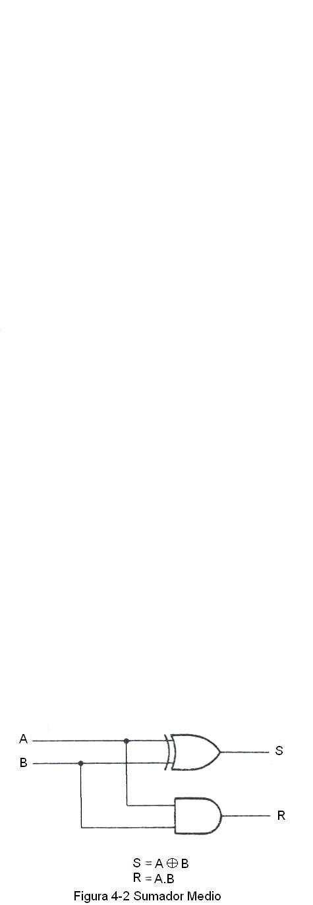

Sumador Completo

El semisumador correspondía a la adición de dos dígitos aisladamente considerados. Para realizar la
suma de dos números binarios es preciso tener en cuenta, en cada posición n, los dos dígitos de
dicha posición y el arrastre de la posición n–1. Al operador que realiza la adición de 2 dígitos
binarios y del arrastre eventual (es decir, una suma de 3 bits) se le llama **etapa de sumador**. El
sumador completo es un circuito combinacional que consiste en 3 entradas y 2 salidas. A las 3
entradas las designamos A, B, R’ y a las 2 salidas S y R.

La salida S vale 0, si todos los bits de entrada son ceros, en cambio, S es igual a 1 solamente si
una entrada es igual a 1 o cuando las 3 entradas son 1. Por otra parte la salida R tiene un bit de
arrastre de 1 si dos de las tres entradas son iguales a 1.

<table>
<tbody>
<tr>
<td colspan="3">Entradas</td>
<td colspan="2">Salidas</td>
</tr>
<tr>
<td>A</td>
<td>B</td>
<td>R’</td>
<td>R</td>
<td>S</td>
</tr>
<tr>
<td>0</td>
<td>0</td>
<td>0</td>
<td>0</td>
<td>0</td>
</tr>
<tr>
<td>0</td>
<td>0</td>
<td>1</td>
<td>0</td>
<td>1</td>
</tr>
<tr>
<td>0</td>
<td>1</td>
<td>0</td>
<td>0</td>
<td>1</td>
</tr>
<tr>
<td>0</td>
<td>1</td>
<td>1</td>
<td>1</td>
<td>0</td>
</tr>
<tr>
<td>1</td>
<td>0</td>
<td>0</td>
<td>0</td>
<td>1</td>
</tr>
<tr>
<td>1</td>
<td>0</td>
<td>1</td>
<td>1</td>
<td>0</td>
</tr>
<tr>
<td>1</td>
<td>1</td>
<td>0</td>
<td>1</td>
<td>0</td>
</tr>
<tr>
<td>1</td>
<td>1</td>
<td>1</td>
<td>1</td>
<td>1</td>
</tr>
</tbody>
</table>

Construyamos una etapa de sumador a partir de 2 semisumadores: sumemos A y B en un primer
semisumador; luego sumemos al resultado S1 el arrastre R’ proveniente de la etapa
anterior; obtenemos el resultado S de la suma y dos arrastres: R1 generado en la etapa,
R2 propagado por la misma; los reunimos mediante un OR lógico y obtenemos el arrastre de
la suma.

Suma: S = (A B) R’

Arrastre: R = (A B) R’ + AB

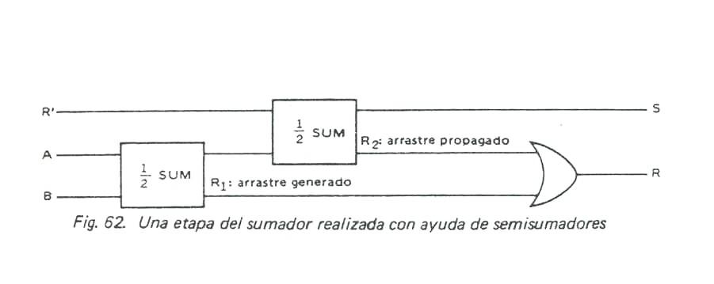

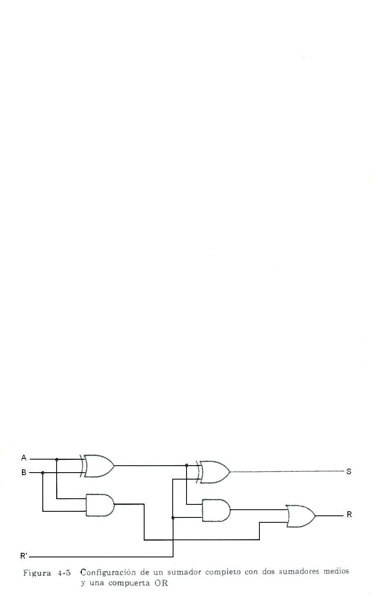

Sumador en Serie

Las operaciones en los computadores digitales se hacen principalmente en paralelo ya que éste es un
modo más rápido de operación. Las operaciones en serie son más lentas y requieren menos equipo.

Los dos números binarios al ser agregados en serie se almacenan en dos registros de desplazamiento.
Los bits se agregan un par al tiempo, secuencialmente por medio de un circuito sumador completo (FA)
como se muestra en la figura. El bit de arrastre del sumador completo se transfiere al flip – flop
D. La salida de este flip – flop se usa como arrastre de entrada para el siguiente par de bits
significativos. El contenido de los dos registros de desplazamiento se desplaza a la derecha por un
período de tiempo palabra. Los bits de suma de la salida S del sumador completo pueden ser
transferidos a un tercer registro de desplazamiento. En este caso lo transferimos al registro A, por
lo tanto, utilizamos el registro A para almacenar el sumando y los bits de suma.

Los bits de suma de salida S ingresan por la entrada serial (SI) del registro A, siempre que la
señal de desplazamiento este habilitada, produciéndose así el desplazamiento hacia el exterior de
los bits del registro A, por la salida (serial SO) de dicho registro.

De la misma manera la entrada serial (SI) del registro B es capaz de recibir un número binario nuevo
mientras que los bits de este registro se desplazan hacia fuera durante la suma.

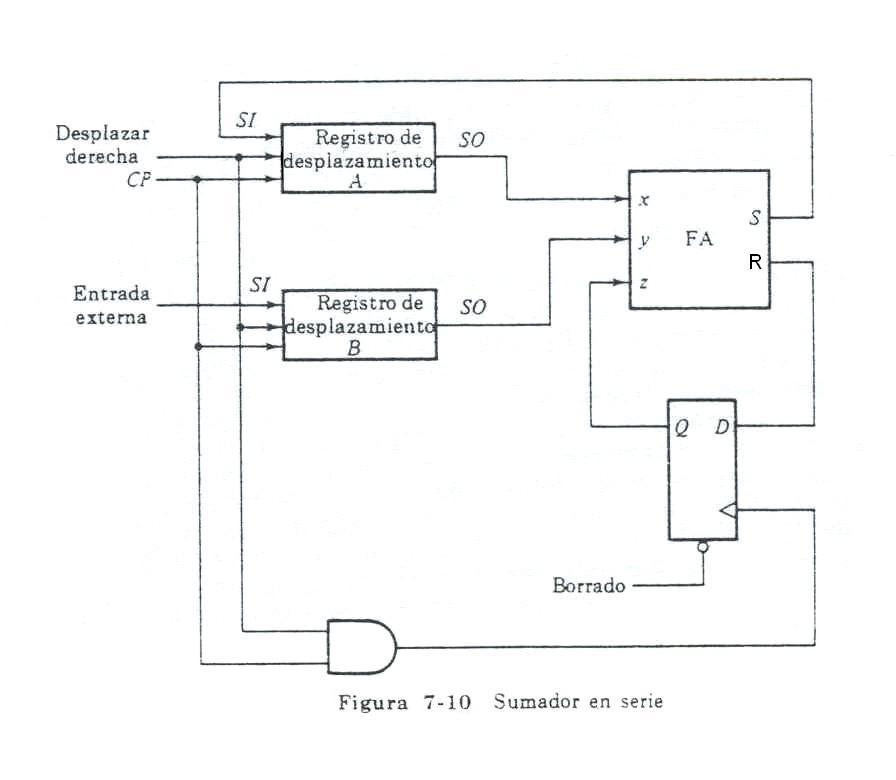

La operación del sumador en serie es: inicialmente, los registros A almacenan el sumando, el
registro B almacena el otro sumando y el flip – flop D se pone a 0. Las salidas seriales (SO) de A y
B suministran un par de bits significativos para el sumador completo en X y Y. La salida Q del flip
– flop da el arrastre de entrada Z. El control de desplazamiento a la derecha habilita ambos
registros y al flip – flop del bit del bit de arrastre; de esta manera, en el siguiente pulso de
reloj ambos registros se desplazan a la derecha, el bit suma de S entra en el flip – flop de la
extrema izquierda del registro A, y el arrastre de salida se transfiere al flip – flip D.

El control de desplazamiento a la derecha habilita los registros por un número de pulsos de reloj
iguales al número de bits en los registros. Par cada pulso de reloj sucesivo, se transfiere un bit
suma nuevo a A, un nuevo bit de arrastre a Q y ambos registros se desplazan una vez a la derecha.
Este proceso continúa hasta que el control de desplazamiento a la derecha se inhabilita. Así, se
lleva a cabo la suma pasando cada para bits conjuntamente con el arrastre previo a través de un
circuito sumador completo sencillo y transfiriendo la suma, un bit a la vez, al registro A. Si se
quiere realizar otra suma con el contenido del registro A, primero se debe transferir en serie el
número deseado al registro B.

Sumador en Paralelo

La suma de dos números binarios de n bits, A y B pueden generarse de dos maneras: en serie o en
paralelo. El método de la suma en serie como se explico anteriormente usa solamente un circuito
sumador completo y un elemento acumulador para conservar el arrastre de salida generado. El método
en paralelo usa n circuitos sumadores completos y todos los bits de A y B se aplican
simultáneamente.

Un sumador paralelo binario es una función digital que produce una suma aritmética de dos números
binarios en paralelo. Este consiste en sumadores completos conectados en cascada con la salida de
arrastre de un sumador completo conectado al arrastre de entrada del siguiente sumador completo
ubicado a la izquierda. Un sumador completo de n bits requiere n sumadores completos conectados en
cascada. La figura muestra la interconexión de cuatro circuitos sumadores completos (FA) para dar un
sumador paralelo binario de cuatro bits.

Comparando el sumador en serie con el sumador en paralelo, se notan las siguientes diferencias: el
sumador en paralelo debe usar registros con capacidad de carga en paralelo, mientras que el sumador
serial usa registros de desplazamiento. El número de circuitos del sumador completo en el sumador en
paralelo es igual al número de bits en los números binarios, mientras que el sumador en serie
requiere solamente un circuito sumador completo y un flip – flop para el arrastre.

Excluyendo los registros, el sumador en paralelo es un circuito combinacional, mientras que el
sumador en serie es un circuito secuencial. El circuito secuencial en el sumador serial consiste en
un circuito sumador completo y un flip – flop que acumula el arrastre de salida. Esta es una
operación en serie típica porque el resultado de una operación de un tiempo de bit puede depender no
solamente de las entradas presentes sino de las entradas previas (arrastre).

Sumador BCD

Considérese la suma aritmética de dos dígitos decimales en BDC, con un arrastre posible de un estado
anterior. Como cada dígito de entrada no excede a la suma de salida no puede ser mayor que 9 + 9 + 1
= 19, siendo el 1 en la suma, el arrastre de salida. Suponiendo que se aplican dos dígitos BDC a un
sumador binario de 4 bits, el sumador formara la suma en binario y producirá un resultado que puede
variar entre 0 y 19.

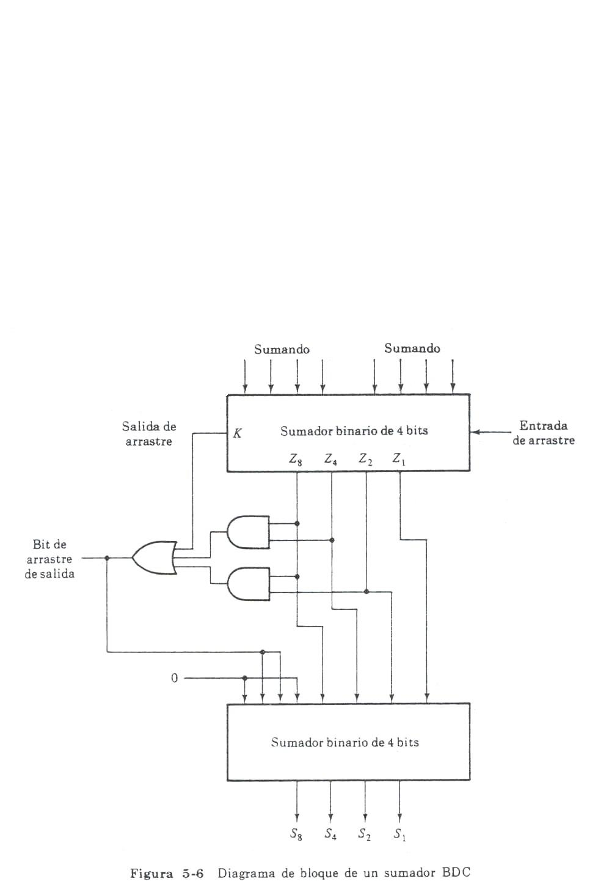

Al examinar el contenido de la tabla, es obvio que cuando la suma binaria sea igual o menor que
1001, el correspondiente número BDC es idéntico y por lo tanto no se necesita conversión. Por
ejemplo la suma del binario 6 (0110) a la suma binaria lo convierte a la representación BDC correcta
y también produce el arrastre de salida requerido.

Cuando el número binario es mayor que 1001 se obtiene una representación BDC no válida. Es evidente
que se necesita una corrección cuando la suma binaria tiene un arrastre de salida K = 1. Las otras
seis combinaciones desde 1010 a 1111 que necesitan una corrección tienen un 1 en la posición
Z8. Para distinguirlos del número binario 1000 y 1001 que también tienen un 1 en la
posición Z8, se especificará que Z4 ó Z2 deben tener un 1. La
condición para que una corrección y un arrastre de salida pueda ser expresada por medio de una
función de Boole:

C = K + Z 8 Z4 + Z8 Z2

Cuando C = 1, es necesario agregar 0110 a la suma binaria y suministrar un arrastre de salida a la
siguiente etapa.

Un sumador BDC es un circuito que agrega dos dígitos BDC en paralelo y produce un dígito suma en
BDC. Un sumador BDC debe incluir la corrección lógica en su construcción interna. Para agregar 0110
en la suma binaria, se usa un segundo sumador binario de 4 bits como se muestra en la figura. Los
dos dígitos decimales, conjuntamente con un arrastre de entrada, se agregan primero en el sumador
binario de 4 bits superior para producir la suma binaria.

Cuando el arrastre de salida es igual a cero, no se agrega nada a la suma binaria, pero cuando es
igual a 1 se agrega el binario 0110 a la suma binaria por medio del sumador de 4 bits inferior. El
arrastre de salida generado a partir del sumador binario superior puede ignorarse porque da la
información ya disponible en el terminal de arrastre de salida.

Un sumador paralelo decimal que suma n dígitos decimales necesita n etapas de sumadores BDC. El
arrastre de salida de una etapa debe conectarse al arrastre de entrada de la siguiente etapa de
mayor orden.

## SUSTRACTORES

Semisustractor

Por lo mismo que hemos definido el semisumador podemos definir el semisustractor que resta el digito
X del digito Y. El semisustractor es un circuito combinacional que resta dos bits, tiene 2 salidas,
una genera el resultado de la diferencia D, y la otra indica si se ha prestado un 1 B (borrow). Se
designa el bit minuendo con X y el bit sustraendo con Y. La salida prestada B es 0 siempre y cuando
X ≥ Y, y será 1 para X = 0 e Y = 1. La salida D es exactamente la misma que la salida S del
semisumador.

Diferencia: D = X Y

Prestado: B = X’ Y

|     |     |     |     |
| --- | --- | --- | --- |
| X   | Y   | B   | D   |
| 0   | 0   | 0   | 0   |
| 0   | 1   | 1   | 1   |
| 1   | 0   | 0   | 1   |
| 1   | 1   | 0   | 0   |

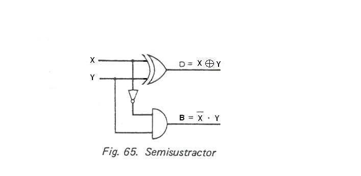

Sustractor Completo

El sustractor es un circuito combinacional que realiza una resta entre dos bits, tomando en
consideración que se ha prestado un 1 de un estado menos significativo. Este circuito tiene 3
entradas X, Y, Z denotan el minuendo, el sustraendo y el bit de arrastre o bit prestado
respectivamente. Las dos salidas D y B, representan la diferencia y la salida del bit prestado
respectivamente. Los unos y ceros para las variables de salida se determinan por la resta X – Y – Z.

De nuevo aquí se nota que la función lógica para la salida D en un sustractor completo es
exactamente la misma que la salida S en el sumador completo. Sin embargo, la salida B se parece a la
función R en el sumador completo, excepto que la variable de entrada X se complementa. Debido a
estas similitudes, es posible convertir un sumador completo a un sustractor completo simplemente
complementando la entrada X antes de su aplicación a las compuertas que forman el bit de arrastre de
salida.

El sustractor puede obtenerse de dos maneras diferentes:

1. Se restan sucesivamente Y de X y, después, Z de la diferencia D1 obtenida (figura 66).
2. Se suman Y e Z y el resultado se resta de X (figura 67).

Diferencia: D = (X Y) Z

Prestado: B = (X Y) Z + X**’** Y

|     |     |     |     |     |
| --- | --- | --- | --- | --- |
| X   | Y   | Z   | B   | D   |
| 0   | 0   | 0   | 0   | 0   |
| 0   | 0   | 1   | 1   | 1   |
| 0   | 1   | 0   | 1   | 1   |
| 0   | 1   | 1   | 1   | 0   |
| 1   | 0   | 0   | 0   | 1   |
| 1   | 0   | 1   | 0   | 0   |
| 1   | 1   | 0   | 0   | 0   |
| 1   | 1   | 1   | 1   | 1   |

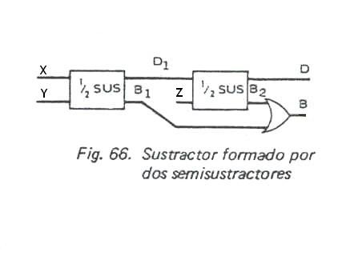

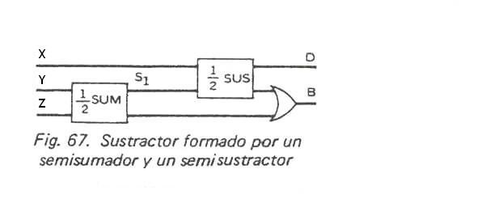

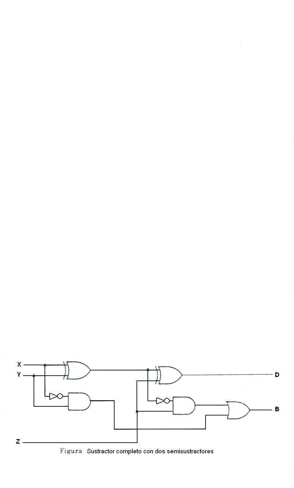

## Convertidores de Código

Es necesario algunas veces usar la salida de un sistema como entrada de otro, por lo tanto un
circuito de conversión debe colocarse entre los dos sistemas, si cada uno usa diferentes códigos
para la misma información. Un circuito convertidor de código es un circuito que hace compatibles dos
sistemas aun cuando cada uno use un código binario diferente.

Para convertir un código binario A en el código binario B, las líneas de entrada deben suministrar
una combinación de bits de los elementos, tal como se especifica por el código A y las líneas de
salida deben generar la correspondiente combinación de bits del código B. Un circuito combinacional
lleva a cabo esta transformación mediante compuertas lógicas.

El procedimiento de diseño se ilustrara mediante un ejemplo específico de conversión de BDC a código
de exceso de 3. Como cada dígito usa 4 bits para representar un dígito decimal, debe haber 4
variables de entrada, a las que designaremos A, B, C y D, y 4 variables de salida, que designaremos
con W, X, Y, Z. Se nota que cuatro variables binarias pueden tener 16 combinaciones de bits de las
cuales se listan 10 en la tabla. Las 6 combinaciones de bits no listadas para las variables de
entrada son las combinaciones de no importa que se marcarán con X en el mapa. Cada uno de los 4
mapas representa una de las cuatro salidas de este circuito como función de las cuatro variables de
entrada.

<table>
<tbody>
<tr>
<td colspan="4">Entrada</td>
<td colspan="4">Salida</td>
<td rowspan="3">Decimal</td>
</tr>
<tr>
<td colspan="4">BDC</td>
<td colspan="4">Código Exceso 3</td>
</tr>
<tr>
<td>A</td>
<td>B</td>
<td>C</td>
<td>D</td>
<td>W</td>
<td>X</td>
<td>Y</td>
<td>Z</td>
</tr>
<tr>
<td>0</td>
<td>0</td>
<td>0</td>
<td>0</td>
<td>0</td>
<td>0</td>
<td>1</td>
<td>1</td>
<td>0</td>
</tr>
<tr>
<td>0</td>
<td>0</td>
<td>0</td>
<td>1</td>
<td>0</td>
<td>1</td>
<td>0</td>
<td>0</td>
<td>1</td>
</tr>
<tr>
<td>0</td>
<td>0</td>
<td>1</td>
<td>0</td>
<td>0</td>
<td>1</td>
<td>0</td>
<td>1</td>
<td>2</td>
</tr>
<tr>
<td>0</td>
<td>0</td>
<td>1</td>
<td>1</td>
<td>0</td>
<td>1</td>
<td>1</td>
<td>0</td>
<td>3</td>
</tr>
<tr>
<td>0</td>
<td>1</td>
<td>0</td>
<td>0</td>
<td>0</td>
<td>1</td>
<td>1</td>
<td>1</td>
<td>4</td>
</tr>
<tr>
<td>0</td>
<td>1</td>
<td>0</td>
<td>1</td>
<td>1</td>
<td>0</td>
<td>0</td>
<td>0</td>
<td>5</td>
</tr>
<tr>
<td>0</td>
<td>1</td>
<td>1</td>
<td>0</td>
<td>1</td>
<td>0</td>
<td>0</td>
<td>1</td>
<td>6</td>
</tr>
<tr>
<td>0</td>
<td>1</td>
<td>1</td>
<td>1</td>
<td>1</td>
<td>0</td>
<td>1</td>
<td>0</td>
<td>7</td>
</tr>
<tr>
<td>1</td>
<td>0</td>
<td>0</td>
<td>0</td>
<td>1</td>
<td>0</td>
<td>1</td>
<td>1</td>
<td>8</td>
</tr>
<tr>
<td>1</td>
<td>0</td>
<td>0</td>
<td>1</td>
<td>1</td>
<td>1</td>
<td>0</td>
<td>0</td>
<td>9</td>
</tr>
</tbody>
</table>

**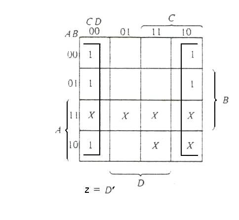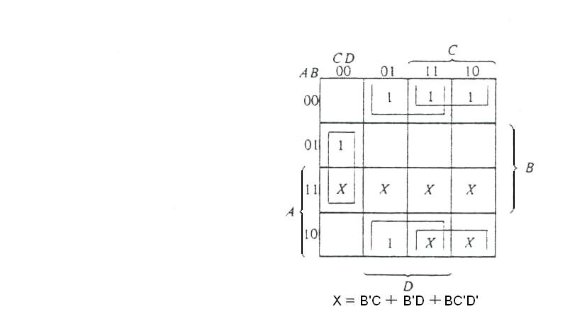**

**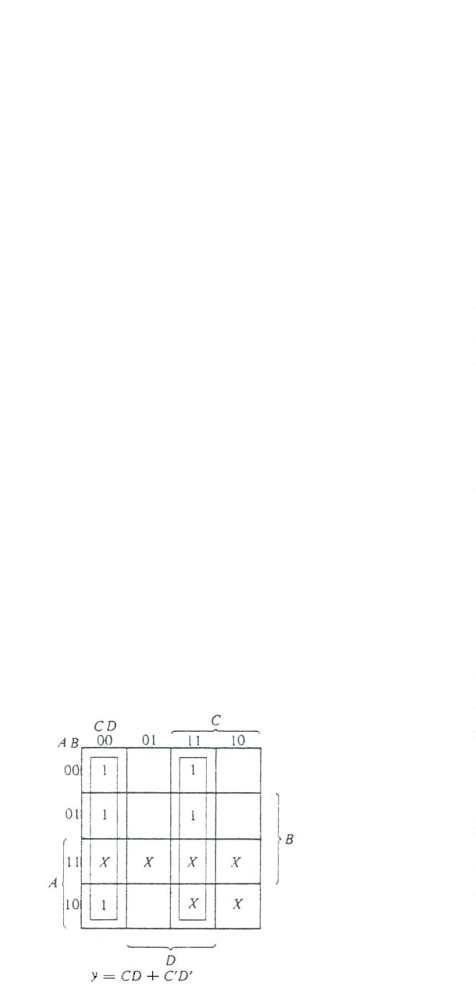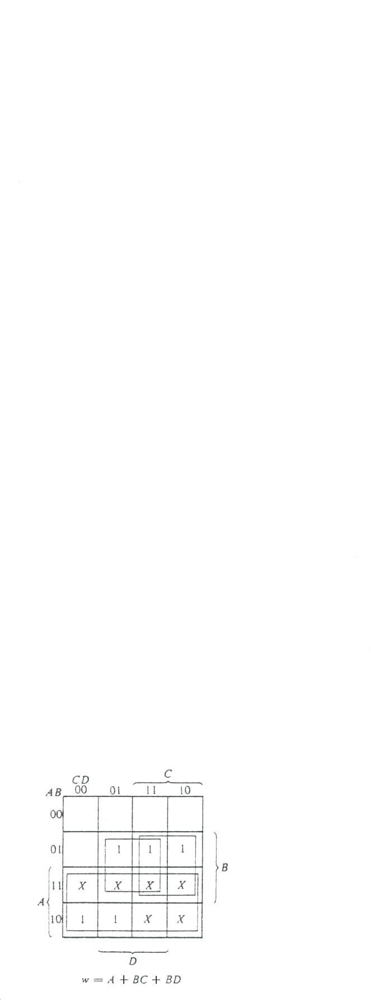**

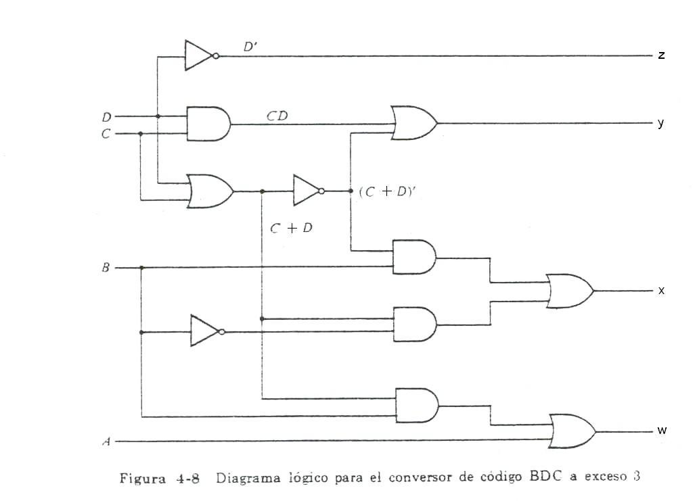

## OTROS CIRCUITOS IMPORTANTES

Multiplexores

Multiplexar significa transmitir una gran cantidad de unidades de información por un número pequeño
de canales o líneas. Un multiplexor digital es un circuito combinacional que selecciona información
binaria de una de muchas líneas de entrada para dirigirla a una sola línea de salida. La selección
de una línea de entrada en particular es controlada por un conjunto de líneas de selección.
Normalmente hay 2n líneas de entrada y n líneas de selección cuyas combinaciones de bits
determinan cual entrada se selecciona. Un multiplexor se llama también **selector de datos** ya que
selecciona una de muchas entradas y guía la información binaria a la línea de salida.

Cada una de las 4 líneas de entradas I0 a I3, se aplican a una entrada de una
compuerta AND. Las líneas de selección s1 y s0 se decodifican para seleccionar
una compuerta AND. Ejemplo si s1 s0 = 10, la compuerta AND asociada con la
entrada I2 tiene 2 de sus entradas iguales a 1 y una tercera entrada conectada a
I2. Las otras tres compuertas AND tienen al menos una entrada igual a 0 lo cual hace su
salida igual a 0. La salida de la compuerta OR es ahora igual al valor de I2.

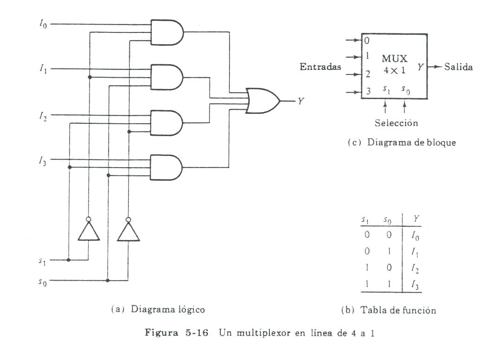

Las compuertas AND y los inversores en un multiplexor se asemejan a un circuito decodificador y sin
embargo ellos decodifican las líneas de selección de entrada. En general, un multiplexor de
2n a 1 línea se construye con un decodificador de n a 2n agregándole
2n líneas de entrada, cada una para cada compuerta AND. Las salidas de las compuertas AND
se aplican a una sola compuerta OR para generar una salida de 1 línea. El tamaño del multiplexor se
especifica por el número 2n de sus líneas de entradas y de la sola línea de salida,
implicando así que contiene n líneas de selección.

Los multiplexores pueden tener una entrada de activación, que puede servir para habilitar o
deshabilitar las salidas del multiplexor, o bien puede ser usada para expandir dos o más CI
multiplexores a un multiplexor digital con un gran número de entradas, ya que en algunos casos se
encapsulan dos o más multiplexores dentro de un CI. Cabe aclarar que las entradas de selección y
activación en los CI de múltiple unidad pueden ser comunes a todos los multiplexores.

La figura muestra un multiplexor cuádruple de 2 líneas a 1 línea. Este tiene 4 multiplexores cada
uno de los cuales puede seleccionar una de dos líneas de entrada. Así la salida Y1 puede
ser seleccionada para ser igual a A1 o B1, lo mismo ocurre con las demás
salidas. Una línea de salida S es suficiente para seleccionar una de dos líneas en todos los 4
multiplexores. La entrada de control E habilita los multiplexores en el estado 0 y los inhabilita en
el estado 1, sin tener en cuenta el valor de S. Cuando E = 0 y S = 0 las cuatro entradas A tienen
una vía hacia las salidas. En cambio si E = 0 y S = 1 se seleccionan las otras cuatro entradas B.

Los multiplexores suelen ser muy útil para construir un sistema de bus común. No hay que olvidarse
de que un multiplexor es simplemente un decodificador con una compuerta OR.

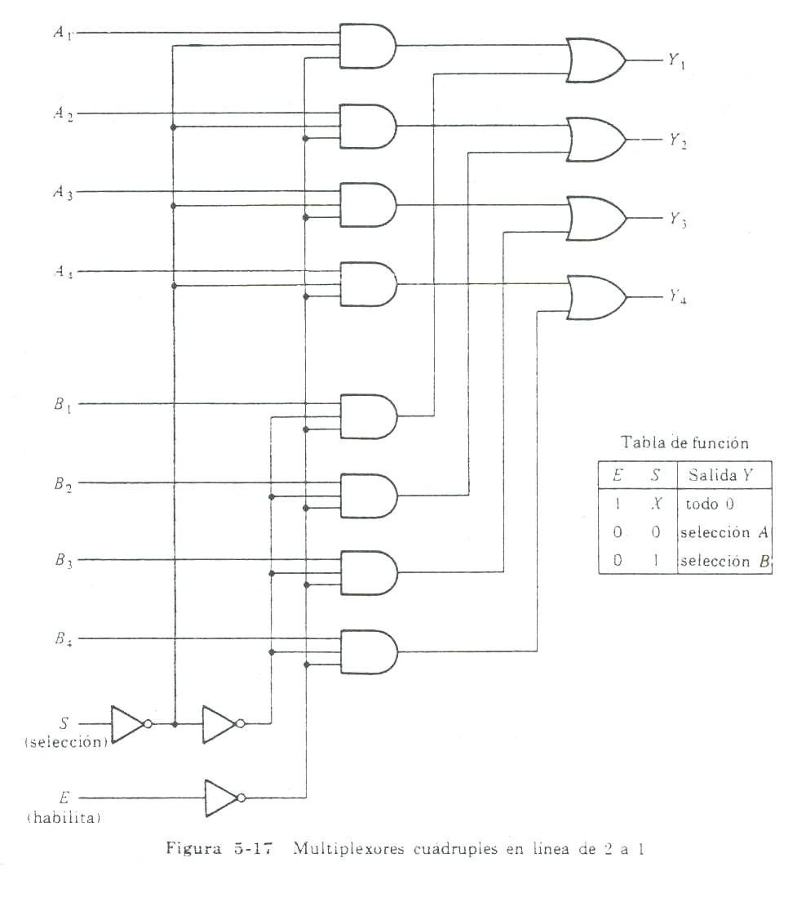

Comparador de Magnitudes

La comparación de dos números es una operación que determina si un número es mayor que, menor que o
igual a otro numero. Un **comparador de magnitud** es un circuito combinacional que compara dos
números, A y B y determina sus magnitudes relativas. El resultado de la comparación se especifica
por medio de 3 variables binarias que indican cuando A \> B, A \< B, o A = B. Se sabe que un
circuito comparador tiene cierta cantidad de regularidad.

Las funciones digitales que poseen una regularidad bien definida pueden diseñarse por medio de un
procedimiento algorítmico si se encuentra su existencia. Considérese los números A y B con 4 dígitos
donde cada suscrito de letra representa uno de los dígitos del número.

A = A3 A2 A1 A0

B = B3 B2 B1 B0

Los dos números son iguales si todos los pares de números significativos son iguales, A3
= B3, A2 = B2, A1 = B1, A0 =
B0. Cuando los números son binarios los dígitos son 0 y 1 y la relación de igualdad para
cada par de bits puede expresarse lógicamente con una función de equivalencia:

xi = Ai Bi + A’i B’i i = 0, 1, 2, 3

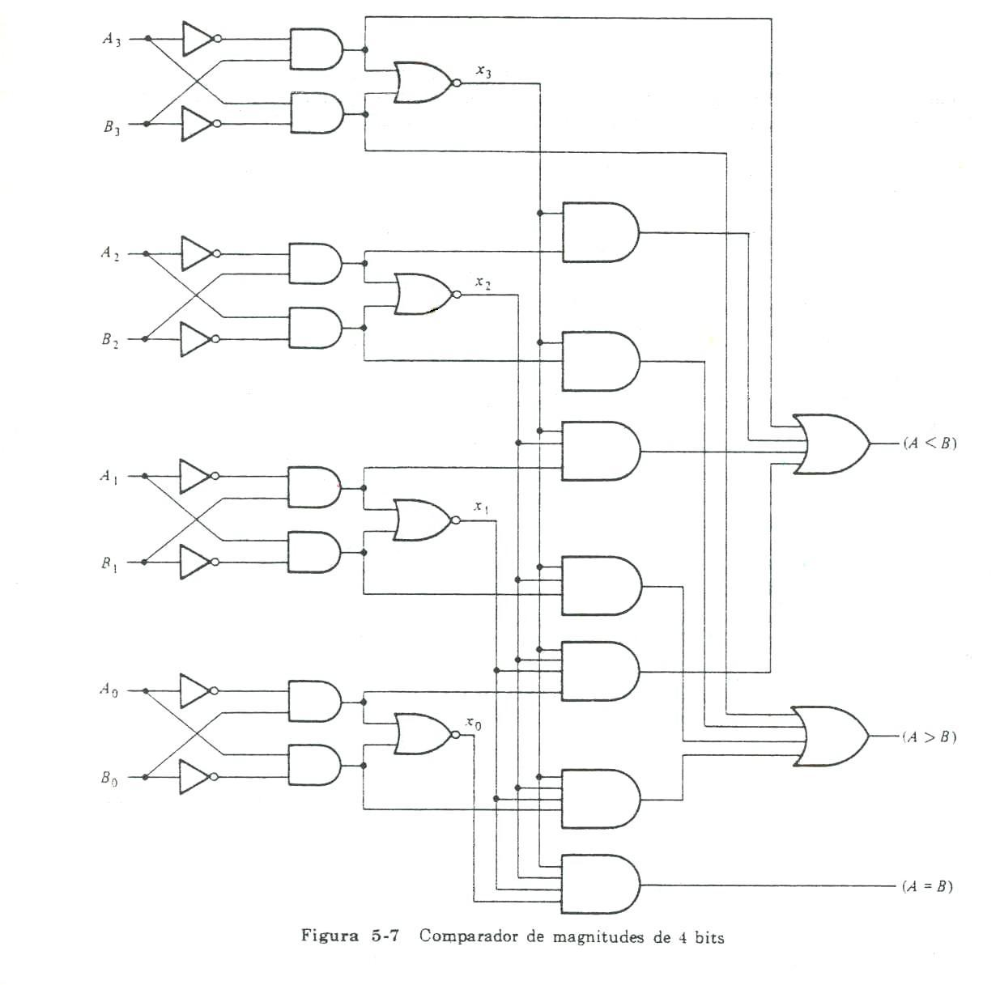

Donde xi = 1 solamente si el par de bits en la posición i son iguales, es decir, si ambos
son unos o ceros. Por lo tanto la salida del circuito será 1 si los números de entradas A y B son
iguales, de lo contrario será igual a 0. Para que exista esta condición de igualdad, todas las
variables xi deben ser iguales a 1. Esto produce una operación AND de todas las
variables:

(A = B) = x3 x2 x1 x0

La variable binaria (A = B) es igual a 1 solamente si todos los pares de dígitos de los dos números
son iguales.

Para determinar si A es mayor que B se inspeccionan las magnitudes relativas de los pares de dígitos
significativos comenzando desde la posición significativa más alta. Si los dos dígitos son iguales,
se compara el siguiente par de dígitos siguientes menos significativos. Esta comparación continúa
hasta que se encuentre un par de dígitos desiguales, por ejemplo si el correspondiente dígito de A
es 1 y el de B es 0, se concluye que A \> B. La comparación puede expresarse lógicamente por las dos
siguientes funciones de Boole:

(A \> B) = A3 B’3 + x3 A2 B’2 + x3
x2 A1 B’1 + x3 x2 x1
A0 B’0

(A \< B) = A’3 B3 + x3 A’2 B2 + x3
x2 A’1 B1 + x3 x2 x1
A’0 B0

Los símbolos (A \> B) y (A\< B) son variables de salida binarias que son iguales a 1 cuando A \> B o
A \< B respectivamente. Las 4 salidas x se aplican a una compuerta AND para la función (A = B). Este
método se puede utilizar para comparar números de más de 4 bits, y también se puede aplicar para
comparar las magnitudes relativas de 2 dígitos BDC.
