# Unidades de Entrada/Salida y Periféricos

## Contenido

- [INTRODUCCIÓN](#introducción)
- [CONCEPTOS Y TÉCNICAS DE BASE](#conceptos-y-técnicas-de-base)
- [LA INTERFACE EXTERNA](#la-interface-externa)
- [Noción de Multiplaje](#noción-de-multiplaje)
- [Líneas Ómnibus](#líneas-ómnibus)
- [LOS TIPOS DE CANALES](#los-tipos-de-canales)
- [Canal Multiplado por Bloques](#canal-multiplado-por-bloques)
- [CONTROLADORES PERIFERICOS](#controladores-perifericos)
- [SUBRUTINA – PILA](#subrutina-pila)
- [INTERRUPCIONES](#interrupciones)
- [Acuse de una interrupción](#acuse-de-una-interrupción)
- [Instrucciones de gobierno del sistema de interrupción](#instrucciones-de-gobierno-del-sistema-de-interrupción)
- [Canales y Potencias de Ordenador](#canales-y-potencias-de-ordenador)
- [INTERCAMBIOS DE INFORMACIÓN CON EL EXTERIOR](#intercambios-de-información-con-el-exterior)
- [Entrada/Salida](#entradasalida)
- [DISPOSITIVOS EXTERNOS](#dispositivos-externos)
- [MÓDULOS DE E/S](#módulos-de-es)
- [TÉCNICAS DE E/S](#técnicas-de-es)
- [E/S Programada](#es-programada)
- [E/S Mediante Interrupciones](#es-mediante-interrupciones)
- [Acceso Directo a Memoria](#acceso-directo-a-memoria)
- [INTERRUPCIONES](#interrupciones-1)
- [Desarrollo de una Interrupción](#desarrollo-de-una-interrupción)
- [Interrupciones Múltiples y Prioritarias](#interrupciones-múltiples-y-prioritarias)
- [ESTRUCTURA LÓGICA DE UN DISPOSITIVO DE ALMACENAMIENTO](#estructura-lógica-de-un-dispositivo-de-almacenamiento)
- [Ventajas](#ventajas)
- [Inconvenientes](#inconvenientes)
- [Introducción](#introducción-1)
- [El controlador](#el-controlador)

## INTRODUCCIÓN

Los intercambios de información con el exterior exigen dos tipos de unidades entre el ordenador o su memoria, por una parte, y los órganos periféricos por otra.

1.  Las **unidades de intercambio o canales** capacitan para las transferencias de información entre el calculador y cualquier unidad externa.

2.  Las **unidades de control**, o **unidades de enlace** o también **controladores de periféricos**, que se encargan de gobernar uno o varios órganos periféricos de una determinada clase, obedeciendo órdenes recibidas del calculador.

A estos dos tipos de unidades se añadirá el **sistema de interrupciones** del calculador, que permite al medio exterior avisar al calculador sobre acontecimientos exteriores, como puede ser el final de una operación de entrada – salida.

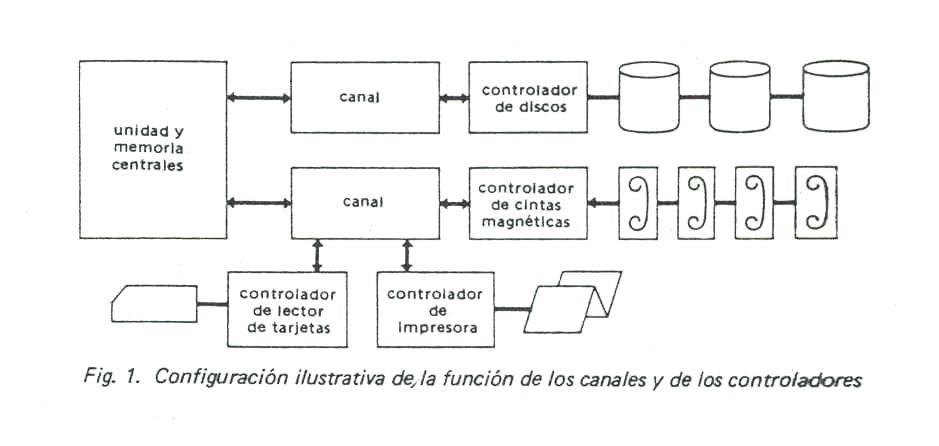

**INTRODUCCION HISTORICA AL CONCEPTO DE SIMULTANEIDAD ENTRE PROCESAMIENTO Y ENTRADAS – SALIDAS**

El problema radica en la diferencia de velocidad entre la ejecución de las instrucciones del programa en el computador y los ritmos de transferencia mucho más lentos impuestos por los periféricos. Este problema ha impulsado a buscar procedimientos para ejecutar simultáneamente un programa y una operación de entrada – salida, después un programa y varias operaciones de entrada – salida. Para resolver los problemas anteriores se citan los siguientes procedimientos:

1.  **Modo bloqueado:** el calculador ejecuta el programa de entrada – salida esperando, a cada nueva instrucción de transferencia, que el elemento periférico esté disponible. De esta forma, el calculador se encuentra bloqueado durante el desarrollo completo de la entrada – salida, con la consecuencia de que el porcentaje del tiempo activo de la unidad central puede llegar a ser muy pequeño (del 0,1% con las unidades periféricas más lentas).
2.  **Modo por Prueba de Estado:** se incluye en el programa, con una periodicidad adecuada, puntos de prueba para conocer si la unidad periférica estaba presta a realizar la operación. Esta técnica, muy enojosa para el programador, no puede hacer frente más que a necesidades muy particulares.

3.  **Modo por Interrupción de Programa:** en este procedimiento, al calculador se le descarga de la vigilancia periódica de los periféricos y son estos los que lo interrumpen para avisarle que están disponibles. La interrupción permite detener momentáneamente el programa en curso para permitir que el programa de transferencia sea ejecutado con prioridad. El modo por interrupción permite cierta simultaneidad entre cálculos y entradas – salidas, retrasando al programa de cálculo una cantidad de tiempo igual a la suma de los tiempos de ejecución del programa de interrupción.

4.  **Modo Automático por Suspensión de Programa o Modo Canal:** en el modo anterior la transferencia de una palabra implicaba el desarrollo de una programa de interrupción que dura de 10 a 20 ciclos de memoria, de los que solo uno es empleado realmente para la transferencia. En este procedimiento se crean unidades automáticas de intercambio o canales, capaces de tomar completamente a su cargo la transferencia de todo un bloque de informaciones.

Cuando el canal necesita intercambiar una información con la memoria, no produce ya una interrupción de programa, sino simplemente una solicitud de servicio para que le sea concedido un ciclo de memoria, con objeto de realizar dicho intercambio. Por consiguiente, la simultaneidad entre programa y entrada-salida es casi total (ver figura). La realización de una operación de entrada-salida se desarrolla de la forma siguiente:

1)  Es el programa quien inicializa la operación: las instrucciones proveen al canal de todas las informaciones necesarias a la operación: número y emplazamiento de los datos por transferir, dirección de la unidad de entrada – salida, condiciones bajo las cuales debe terminarse la transferencia, etc.; una instrucción especial lanza la transferencia y el programa puede continuar independientemente.

2)  La transferencia se efectúa al ritmo del equipo periférico bajo control del canal, que **roba ciclos** al calculador.

3)  El canal avisa que la transferencia ha acabado generalmente mediante una interrupción. El programa de interrupción podrá preguntar entonces al canal en que condiciones se ha efectuado aquella.

En general, el programa que ha lanzado la operación de entrada – salida puede ejecutar a cada instante una instrucción de prueba de entrada – salida, que le permite conocer en que punto se encuentra la operación.

Se distinguen dos tipos de canales automáticos: **los canales simples o selectores** que no pueden gestionar más de una transferencia a la vez, y los **canales multiplados en el tiempo**, capaces de gestionar varias transferencias simultáneamente.

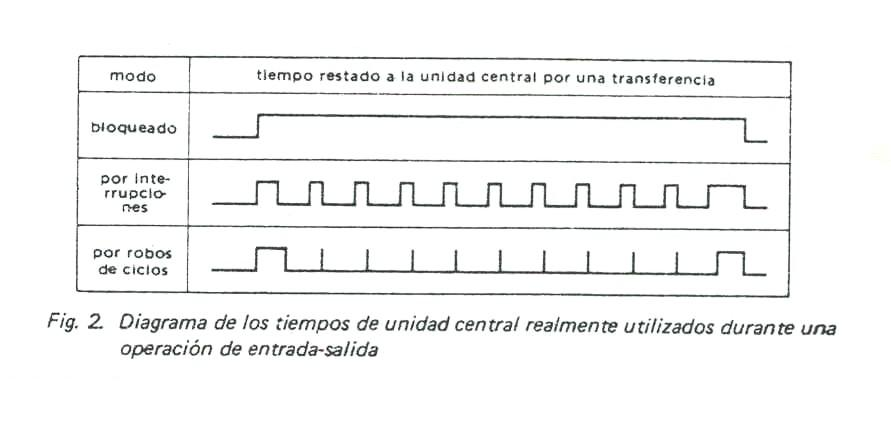

1.  **Encadenamiento Automático de las Transferencias:** En el modo precedente, el ordenador está obligado a inicializar cada transferencia cargando las informaciones necesarias en los registros del canal. A fin de aliviar al ordenador de esta tarea, se concibe el canal como una unidad poseedora de su propio programa. La unidad central generará en memoria central un **programa de control de entrada – salida** o **programa de canal** definiendo las diferentes transferencias sucesivas a realizar por el canal. Para lanzar este programa de canal, la unidad central proporcionará su dirección al canal que se encargará de su ejecución completa.

El programa de control de entrada – salida permite encadenar varias transferencias sin intervención de la unidad central. Se distinguen dos clases de encadenamiento: el **encadenamiento de datos**, que después de transferir datos desde (o hacia) una tabla en memoria, permite pasar automáticamente a otra tabla; el **encadenamiento de funciones**, que permite hacer ejecutar sucesivamente varias transferencias sobre varios registros diferentes en un mismo órgano periférico.

## CONCEPTOS Y TÉCNICAS DE BASE

Noción de Interface

Se denomina **Interface** a las especificaciones de conexión entre un canal y cualquier tipo de unidad periférica. Es la caja negra que permite adaptar las señales del periférico a las especificaciones de la interface ordenador. La interface, está formada físicamente por un cierto número de conectores, salidos del canal, en los cuales pueden ir a enchufarse. Es necesario precisar además las especificaciones de formato y de tiempo de las señales dadas o esperadas por el canal.

Básicamente, la interface se compone de dos tipos de hilos:

1.  **Hilos de información**, que llevan en paralelo la información por transmitir, en forma de niveles;

2.  **Hilos de gobierno y sincronización**, que capacitan para el diálogo de las dos unidades interconectadas.

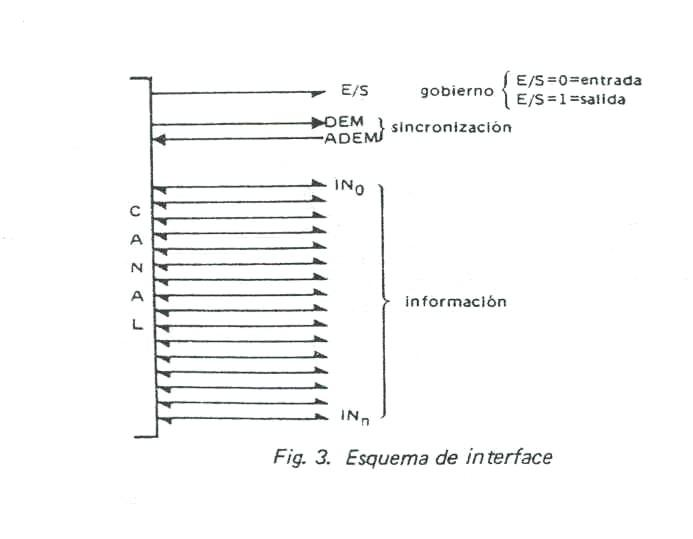

**Descripción de una Salida de Información:** La unidad de intercambio posicionará la señal de nivel E/S para indicar que se trata de una salida de información, posicionará la información por salir bajo la forma de niveles en las líneas de información IN0 a INn y, por último, enviará un impulso DEM de demande de servicio. Después permanecerá en espera.

El equipo exterior reconocerá la demanda DEM, probará el hilo de gobierno E/S para saber si la operación consiste en una entrada o en una salida de información. Como E/S vale 1, el equipo exterior muestreará los hilos de información IN0 a INn (apertura, mediante un impulso, de las puertas de entrada a un registro tampón). Dicho impulso podrá ser también enviado al canal como señal de acuerdo, que indica que la demanda de salida ha sido reconocida y muestreada la información (ADEM). (Ver figura)

**Descripción de una Entrada de información:** El canal pondrá E/S a 0 y enviará el impulso DEM. La solicitud de entrada será reconocida por el equipo periférico, que deberá efectuar los niveles de información IN0 a INn, y, después, enviará la señal de acuerdo ADEM. La lectura será realizada por el canal tras recepción de ADEM.

## LA INTERFACE EXTERNA

Tipos de Interface

La interfaz entre el periférico y el módulo de E/S debe ajustarse a la naturaleza y la forma de operar del periférico. Una de las principales características de la interfaz es si es serie o paralela. En una **interfaz paralela**, hay varias líneas conectando el módulo de E/S y el periférico, y se transfieren varios bits simultáneamente a través del bus de datos.

En una interfaz serie, hay sólo una línea para transmitir los datos, y los bits deben transmitirse uno a uno. Las interfaces paralelas se utilizan usualmente para las impresoras y unidades de cinta magnéticas. La interfaz serie son más propias del módem y el mouse. En cualquier caso, el módulo de E/S debe establecer un diálogo con el periférico. En términos generales, el diálogo para una operación de escritura es como sigue:

1.  El módulo de E/S envía una señal de control solicitando permiso para enviar datos.

2.  El periférico reconoce la solicitud.

3.  El módulo de E/S transfiere los datos (una palabra o un bloque según el periférico).

4.  El periférico reconoce la recepción de los datos.

Una operación de lectura se realiza en forma similar. Para el funcionamiento del módulo de E/S es clave disponer de un registro de acoplo (buffer) interno que pueda almacenar los datos a transferir entre el periférico y el resto del sistema. Este buffer permite que el módulo de E/S pueda compensar las diferencias de velocidad entre el bus del sistema y sus líneas externas. Hay que tener en cuenta que la velocidad de transmisión en serie es más lenta que la paralela ya que los bits se transmiten uno a uno. El módulo de E/S de la figura 6.15 (b) debe tener un registro que convierte en paralelo los datos, cuando viene del periférico, y un registro que convierte en serie los datos, cuando provienen de la parte central. Por ello, es que la interface en serie es más compleja que la paralela.

Configuraciones Punto a Punto y Multipunto

La conexión entre un módulo de E/S del computador y los dispositivos externos pueden ser punto a punto o multipunto. Una interfaz punto a punto proporciona una línea específica entre el módulo de E/S y el dispositivo externo. En los sistemas pequeños (PCs, Estaciones de Trabajo), existen usualmente enlaces punto a punto para el teclado, la impresora, y el módem externo.

Las interfaces externas multipunto, utilizadas para soportar dispositivos de almacenamiento masivo (discos y cintas) y dispositivos multimedia (CD-ROMs, equipos de video y audio), tienen bastante importancia. Estas interfaces multipunto de hecho son buses externos, y poseen el mismo tipo de lógica que por ejemplo la interface SCSI, usualmente es considerada como un bus, y es utilizada para conectar dispositivos periféricos externos.

## Noción de Multiplaje

El multiplaje consiste en desviar la información transportada por un bus hacia otro escogido entre varios o en concentrar en un solo bus las informaciones procedentes de varios buses diferentes. **Es parecido a los multiplexores ver apunte de memoria**

El multiplaje permite concentrar varias vías de entrada en una sola o distribuir una vía de salida en varias vías. Los sistemas de multiplaje permiten conectar varias unidades externas a un mismo canal.

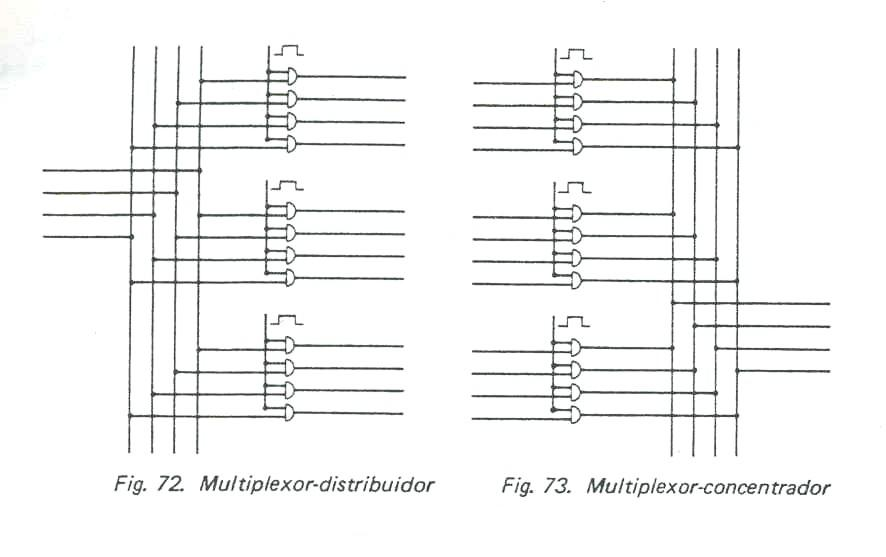

A veces se utilizará este método en los canales simples, es decir, en aquellas unidades de intercambio capaces solo de controlar una transferencia simultáneamente. Entonces el direccionamiento de las unidades externas se efectuará en estrella, un hilo por unidad, después de decodificar la dirección en el canal.

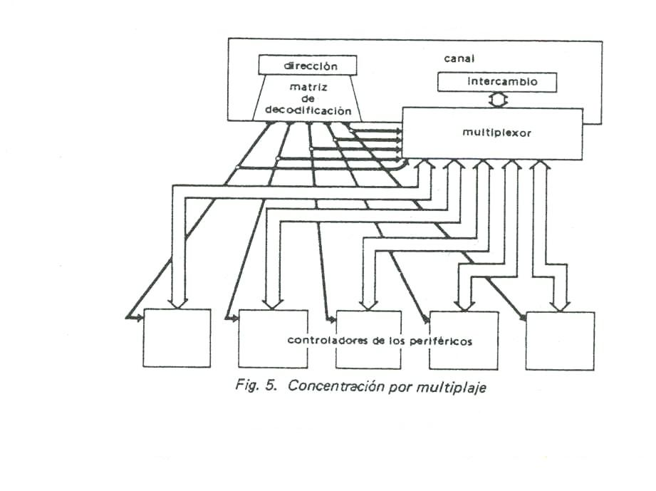

## Líneas Ómnibus

Para conectar varias unidades externas en un canal, puede también emplearse una línea ómnibus que las una.

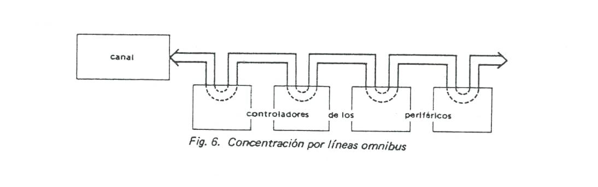

Si la unidad externa no resultase seleccionada, se comportará transparentemente en lo que se refiere a la información, lo que quiere decir que la transmite sin alterarla. El direccionamiento puede realizarse siguiendo la técnica en estrella descrita anteriormente. Es posible también, emplear la línea ómnibus para el direccionamiento: un hilo especial indica, entonces, que la información emitida por el canal es una dirección. La unidad externa atravesada comprueba este hilo a cada transferencia. Para el caso en que aquella detecte que se trata de una dirección, compara la dirección transmitida con la suya propia. Si hubiera identidad entre ambas, la unidad externa se pone en estado de diálogo con el canal; si no sucediera así, transmite la dirección a la unidad contigua. Esta técnica de direccionamiento y de transferencias por bus la emplean, sobre todo, los canales multiplados en el tiempo.

Concentración y Fraccionamiento de las Informaciones

Los periféricos trabajan normalmente a nivel de carácter (6 u 8 bits), mientras que los ordenadores lo hacen, en general, a nivel de la palabra (varios caracteres). Ello obliga, bien en el canal, bien en la unidad de control de un determinado periférico, a realizar las concentraciones y fraccionamientos pertinentes. Generalmente, esta operación se llevará a cabo en el canal, puesto que este es común a varios periféricos.

Las operaciones de fraccionamiento y concentración se conseguirán a menudo por sucesivos desplazamientos sobre dos registros supuestos uno seguido del otro: un registro de palabra de comunicación con la memoria y un registro de carácter de comunicación con el exterior.

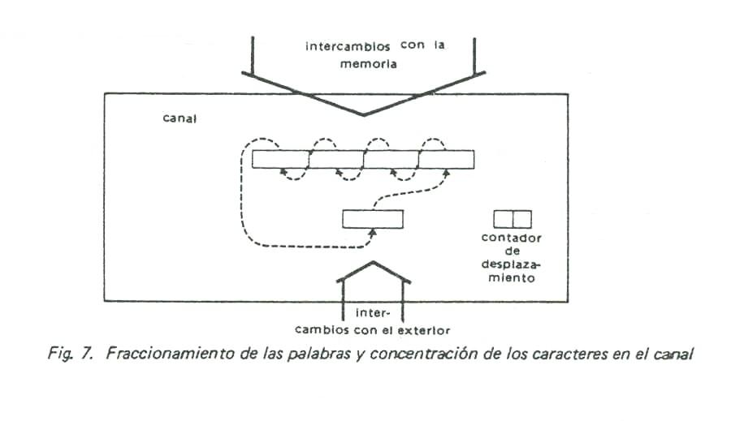

En la figura, con motivo de una operación de salida, los 4 caracteres de la palabra de memoria serán enviados sucesivamente hacia el exterior, siendo transferido primero el carácter de mayor peso.

Diferentes Técnicas de Ejecución de una Transferencia Elemental

Llamaremos **transferencia elemental** a la transferencia de una información (carácter o palabra) desde una posición de memoria central a una unidad externa (o viceversa, según se trate de una entrada o una salida). La ejecución de una transferencia elemental supone que se conozcan las informaciones siguientes:

- Información pidiendo el lanzamiento de la transferencia: DEM;

- Indicación del sentido de la transferencia (entrada o salida): SEN;

- Dirección de almacenamiento en memoria de la información transferida: DIR;

Las diferentes técnicas de ejecución de una transferencia elemental dependen de la manera como sean suministradas al computador estas tres informaciones.

Distinguiremos los siguientes modos:

**Transferencia Programada:** Se ejecuta cuando el programa llega a una instrucción de transferencia. Es el ordenador quien inicializa la demanda de transferencia (DEM). Las informaciones complementarias son suministradas por la instrucción, que puede adoptar dos formas:

ENT DIR Entrar información y almacenarla en la dirección DIR.

SAL DIR Leer información almacenada en la dirección DIR y hacerla salir.

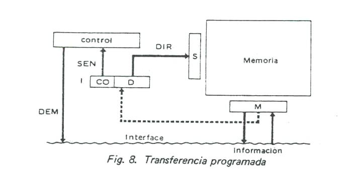

**Transferencia por Instrucción Forzada:** La transferencia por instrucción forzada es inicializada por la unidad externa, que genera la instrucción de entrada – salida y fuerza su ejecución prioritaria en cuanto a la unidad central ha concluido la instrucción en curso. El programa queda suspendido durante el tiempo de ejecución de esta instrucción.

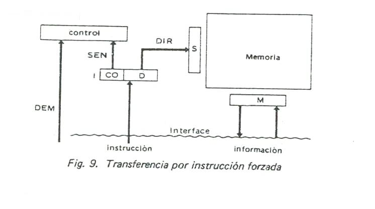

**Transferencia por Robo de Ciclo:** La transferencia por robo de ciclo se inicializa a petición de la unidad exterior. La unidad central termina el ciclo de memoria en curso y concede el próximo ciclo a la unidad exterior. Esta indica si se trata de una lectura o de una escritura y proporciona la dirección de almacenamiento. El programa en curso queda en suspenso durante un ciclo de memoria.

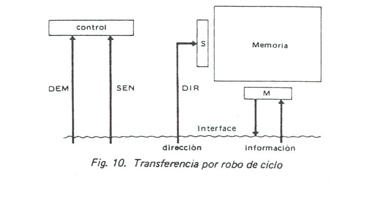

**Transferencia por Acceso Directo a Memoria:** Se supone que la memoria posee dos vías de acceso (que podrían llamarse muelles de acceso). Una de las vías está reservada al ordenador, la otra a la unidad exterior. Las peticiones de ciclo de memoria son dirigidas a la unidad de control de acceso a memoria, tanto si proceden de la unidad central como si de la unidad exterior. Esta unidad de control gestiona las prioridades de acceso de la unidad central y de la unidad externa.

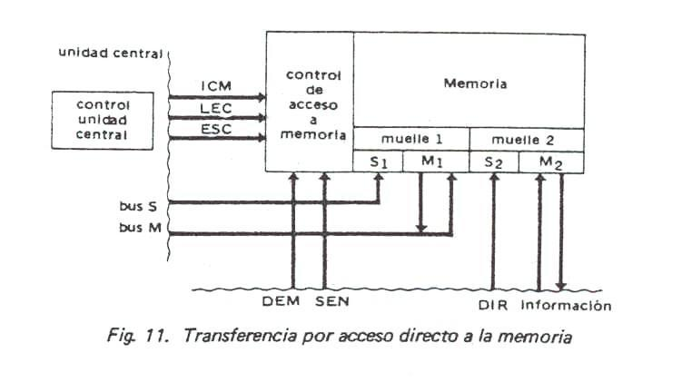

Contemplando desde esta última, el proceso es el mismo que en el caso del robo del ciclo, con la única diferencia que la solicitud es dirigida al controlador de acceso a memoria y no a la unidad central.

El programa en curso no resulta suspendido durante el ciclo de memoria solicitado, excepto cuando la unidad central hubiera pedido simultáneamente un ciclo de memoria. Generalmente los sistemas de acceso directo a la memoria son interesantes si se dispone de varios bloques independientes de memoria. En la medida que el programa, de una parte, y las entradas – salidas, de otro, conciernan a bloques diferentes, se acercaría el proceso a la simultaneidad total.

El siguiente cuadro permite comparar las cuatro técnicas de ejecución de una transferencia elemental, en función de dos parámetros: el máximo tiempo de espera de la unidad exterior desde que se lanza una demanda de transferencia y el tiempo que el programa en curso resulta detenido.

<table>
<tbody>
<tr>
<td>TECNICA EMPLEADA</td>
<td>TIEMPO MAXIMO DE ESPERA DE LA UNIDAD EXTERIOR</td>
<td>TIEMPO RESTADO AL PROGRAMA EN CURSO</td>
</tr>
<tr>
<td>Programada</td>
<td>Hasta el final de la instrucción en curso, más inicio del programa solicitado de interrupción.</td>
<td>Procesamiento de un programa de interrupción.</td>
</tr>
<tr>
<td>Por instrucción forzada</td>
<td>Duración de la instrucción más larga del repertorio.</td>
<td>Una instrucción generalmente ejecutada en uno o dos ciclos de memoria.</td>
</tr>
<tr>
<td>
Por robo de ciclo

Por acceso directo
</td>
<td>
Un ciclo de memoria.

Un ciclo de memoria.
</td>
<td>
Un ciclo de memoria.

Nada, o un ciclo de memoria.
</td>
</tr>
</tbody>
</table>

## LOS TIPOS DE CANALES

Enlace Programado

No es propiamente un canal, sino un medio de acceso controlado por el programa. En efecto, cada transferencia elemental está gobernada por una instrucción del programa en curso. Por el hecho de estar controlados por el programa, tales enlaces pueden utilizarse tanto en modo bloqueado como, mucho más a menudo, en modo por interrupción. Casi siempre aparecen integrados en la unidad central. Son necesarias 4 instrucciones de entrada – salida para realizar entradas – salidas en modo programado:

<table>
<tbody>
<tr>
<td rowspan="2">Instrucciones de gobierno de transferencias de información</td>
<td>SAL M</td>
<td>Para extraer el contenido de la dirección M hacia las líneas de salida de información de la interfase.</td>
</tr>
<tr>
<td>ENT M</td>
<td>Para almacenar en la dirección M una información presente en las líneas de entrada de información a la interfase. </td>
</tr>
<tr>
<td rowspan="2">Instrucciones de control general de las operaciones de entrada – salida</td>
<td>GCP</td>
<td>Permite direccionar una unidad de control de periférico y especificarle la operación por ejecutar.</td>
</tr>
<tr>
<td>PRE</td>
<td>Permite adquirir una información descriptiva del estado del periférico anteriormente direccionado.</td>
</tr>
</tbody>
</table>

Las señales de interfase SI, NI, y SC, NC corresponden respectivamente a estos cuatro tipos de operación:

- SI: niveles lógicos posicionados sobre las líneas de salida de información.
- NI: peticiones de entrada de información.
- SC: niveles lógicos posicionados sobre las líneas de salida de control.
- NC: peticiones de entrada de estados.

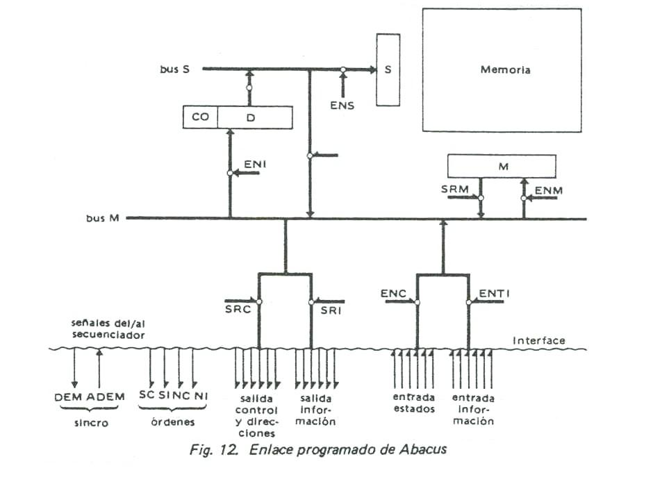

En Abacus, una operación de salida SAL, la información permanece memorizada en el registro M hasta ser tomada en cuneta por el órgano exterior, las puertas SRM y SRI permanecen abiertas para mantener activos los niveles lógicos de las líneas de salida de información y la señal SI (salida de niveles de información) permanece activa.

El controlador envía entonces al controlador del periférico previamente escogido, una señal impulsional DEM. Al recibirla éste, muestrea la información y transmite al computador una señal de acuerdo ADEM para liberarle.

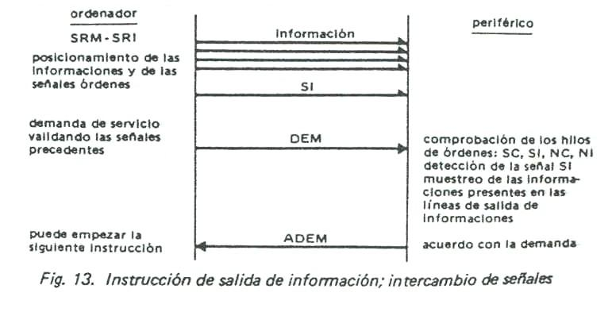

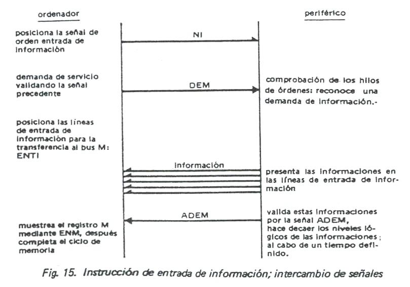

Canal Automático: Modo Canal.

Los canales automáticos son capaces de gestionar el conjunto de una operación de entrada – salida sin intervención de la unidad central, excepto para inicializar y concluir dicha operación. Las transferencias elementales pueden ser efectuadas, bien por instrucción forzada, bien por robo de ciclo, bien por acceso directo a la memoria. Se les llama canales simples cuando no gestionan más que una operación de entrada – salida a la vez. Describiremos una unidad de este tipo en que las transferencias se consiguen por robo de ciclo, interesándonos exclusivamente en los problemas de intercambio de informaciones.

Desde este estricto punto de vista, la operación de entrada – salida queda enteramente definida por: el sentido de la transferencia por realizar (entrada o salida) y la zona de almacenamiento en memoria de las informaciones por transferir. Esta zona puede delimitarse mediante la dirección de su primera palabra (DIR) y su número de palabras (CDP).

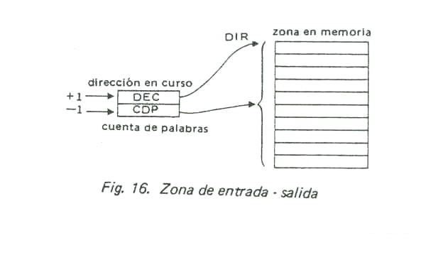

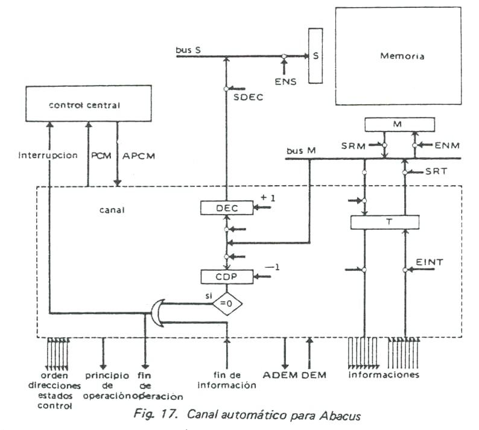

La unidad central es quien inicializa la operación por programa. Selecciona el periférico (indicando eventualmente el sentido de la transferencia por efectuar) y carga las informaciones que definen a la zona de almacenamiento en memoria en dos registros del canal, a los que llamaremos DEC (dirección en curso) para la dirección de la zona y CDP (cuenta de palabras), para el número de palabras. (Esta carga puede realizarse partiendo de instrucciones del tipo de salida directa en enlace programado).

Una vez efectuada la inicialización, la operación de entrada – salida se desarrolla ya al ritmo de la unidad periférica. Es a petición de ésta que el canal ejecuta una transferencia elemental, utilizando el contenido del registro DEC como dirección de almacenamiento en memoria, y después actualiza la dirección en curso, sumando 1 al registro DEC, y la cuenta de palabras, restando 1 al registro CDP.

La transferencia termina cuando el canal detecta que el registro contador de palabras llega a cero o cuando el controlador de periférico envía una señal de fin de información. En este momento genera el canal una interrupción para indicar a la unidad central que ha concluido la operación de entrada–salida.

Tal modo de funcionamiento, soportado por dos registros, uno para la dirección en curso y otro para la cuenta de palabras, es designado generalmente como modo canal. A la correspondiente unidad de intercambio se le llama canal, por excelencia.

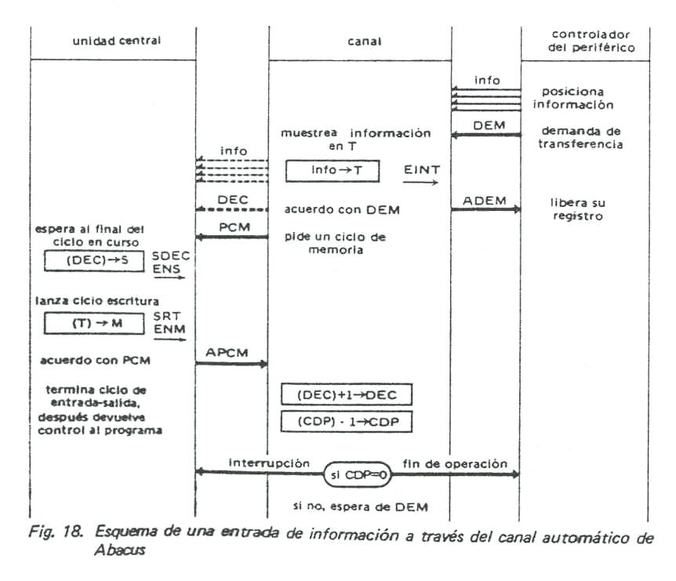

Encadenamiento de Datos.

En el canal automático, para pasar de una zona de memoria a otra, la unidad central debía desarrollar, después de la interrupción de fin de transferencia correspondiente a la primera zona, un programa cuyo objetivo sería recargar los registros DEC y CDP con las características de la segunda zona y relanzar la operación de entrada o de salida. El encadenamiento de datos consiste en efectuar esta operación de carga de dichos registros bajo control del canal, de tal suerte que se pase automáticamente de una zona a otra dentro de una operación de entrada – salida, sin implicar a la unidad central. Para conseguirlo se agregan al final de la zona en curso, las nuevas palabras de control y direcciones características de la zona siguiente, en el caso de que hubiera encadenamiento, y suponiendo, además que las informaciones de control caben en dos palabras de máquina.

|     |     |     |                   |
|-----|-----|-----|-------------------|
| IT: | =   | 0   | No interrupción   |
|     | =   | 1   | Interrupción      |
| ED: | =   | 0   | No encadenamiento |
|     | =   | 1   | Encadenamiento    |

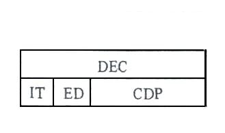

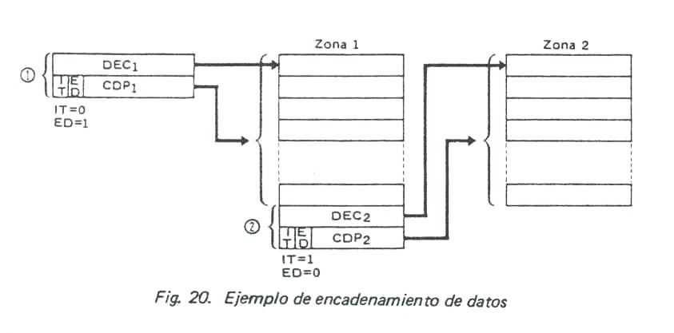

La operación de entrada – salida definida por las zonas de la figura se descompone según el siguiente esquema:

Al nivel de la unidad central:

- Cargar la doble palabra de control 1 en los registros de canal;
- Iniciar la transferencia;

Al nivel del canal:

- Transferir la primera zona;
- Cargar las palabras de control 2, puesto que el encadenamiento está pedido en 1;
- Transferir la segunda zona;
- Generar una interrupción pedida en 2.

Programa de Canal

El canal de los calculadores evolucionados es una unidad programable, capaz de leer, decodificar y ejecutar un **programa de gobierno de entrada – salida** o **programa de canal**, registrado en memoria central, con los mismos derechos que la unidad central lee, decodifica y ejecuta un programa de procesamiento. El programa de canal permite a la vez el encadenamiento de datos y el de instrucciones de canal. Descripción de una operación de entrada – salda (figura 21).

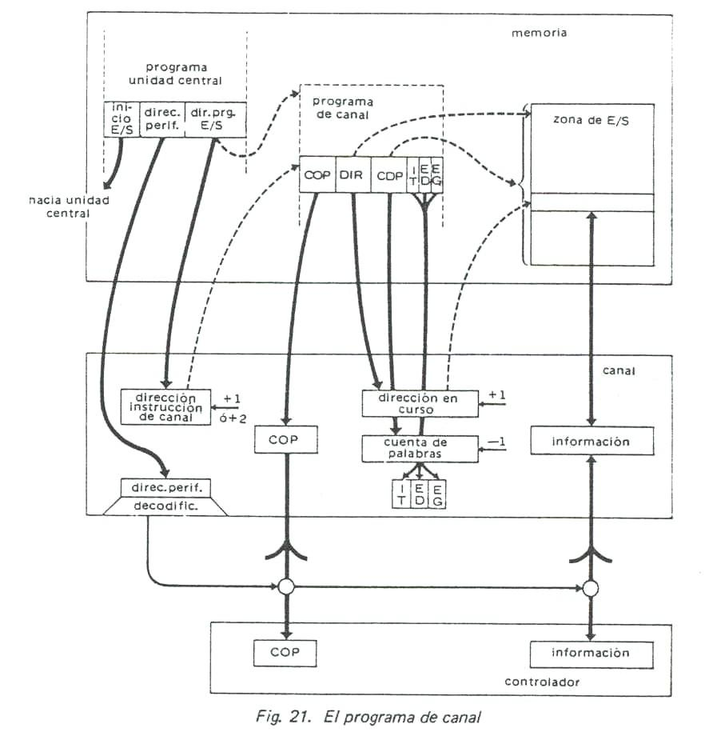

1.  En el curso del programa de unidad central, se genera en memoria una lista de instrucciones de canal. Es el **programa de gobierno de entrada – salida**, también llamado **programa canal**.
2.  La unidad central ejecuta una instrucción de entrada – salida que proporciona al canal la dirección del órgano periférico interesado y la de la primera instrucción del programa canal. (Estas direcciones están comprendidas en la instrucción o en registros direccionados por la instrucción). Si el órgano periférico designado está libre, se le pone en actividad, si no, la unidad central es avisada de que el programa de canal no debe arrancar. Supongamos que se cumple la primera hipótesis. La dirección de la primera instrucción de canal es enviada y almacenada en el contador de instrucciones del canal. A partir de este instante, el programa de canal se desarrollará sin intervención de la unidad central.

3.  El canal va a buscar en memoria la primera instrucción de canal, que consta de los siguientes elementos:

|                  |                      |                    |             |
|------------------|----------------------|--------------------|-------------|
| C. O. Periférica | Dirección 1ª palabra | Cuenta de palabras | Indicadores |

El canal transmite al controlador del periférico el código de operación que le es destinado. En este momento, la operación de entrada – salida queda inicializada y un proceso idéntico se desarrolla cada vez que el canal pide una nueva instrucción de canal.

4.  Las demandas de transferencia elemental de información, una vez inicializada la operación de entrada – salida, emanan del controlador de periférico, que trabaja a su propio ritmo. Al recibir una de estas demandas, el canal efectúa la transferencia pedida utilizando y actualizando las informaciones dirección en curso (que sustituye a dirección de la primera palabra) y cuenta de palabras.

5.  Una transferencia se terminará, bien cuando sea nulo el contenido del contador de palabras, bien al recibirse una señal de fin de transferencia procedente del controlador de periférico. El canal comprobará entonces los indicadores, en número de tres, para saber lo que ha de hacer:

6.  - **Encadenamiento de datos:** si este indicador está puesto, el canal pasará a la siguiente instrucción de canal, ignorando el nuevo código de operación periférica.
    - **Encadenamiento de gobierno:** si el indicador está puesto, el canal pasará a la siguiente instrucción de canal, utilizando el nuevo COP.
    - **Interrupción:** se generará una interrupción al final de la transferencia, si el correspondiente indicador está activado.

El programa de canal está controlado por un cierto número de instrucciones de entrada – salida, entre las cuales he aquí las más importantes:

- Inicio de entrada – salida, detención de entrada – salida, prueba de entrada – salida: las dos primeras instrucciones permiten inicializar o detener una operación de entrada – salida, señalando el periférico y la dirección de la primera instrucción de canal. La tercera se emplea para obtener informaciones acerca del estado actual de una operación de entrada – salida, sin alterar el funcionamiento de ésta.

Las informaciones de estado, devueltas por el canal direccionado, comprenderán la dirección de la instrucción de canal en curso y el contenido del contador de palabras (excepto para la instrucción inicio de entrada – salida), así como ciertos indicadores, en particular: interrupción solicitada y no acordada; estado del órgano periférico direccionado (dispuesto, no operativo, ocupado); estado del controlador de periférico (dispuesto, no operativo, ocupado); órgano periférico en espera de una nueva operación (almacén de tarjetas vacío, detección de fin de papel en la impresora); error de paridad producido en el intercambio con la memoria; error de paridad en la transferencia de datos al exterior.

- Prueba de órgano periférico: permite obtener informaciones, más precisas que con la instrucción de prueba de entrada – salida, acerca del estado de un órgano periférico; tales informaciones son suministradas por el controlador del periférico.

- Identificación de una interrupción: esta instrucción permite, tras recibirse una interrupción emitida por el canal, identificar al órgano provocador de la interrupción y conocer la causa de ella. La información de estado devuelta por el canal comprende, por una parte, la dirección del periférico causante de la interrupción, por otra parte, indicadores concernientes a la operación que ha dado lugar a la interrupción, en particular:

- - Desbordamiento de datos (en el curso de una operación de entrada).
  - Longitud incorrecta, si no existe concordancia entre cuenta de palabras nula detectada por el canal y final de transferencia enviada por el periférico.
  - Contador de palabras nulo.
  - Final de transferencia.
  - Error de paridad en el curso de la transferencia, etc.

Canal Multiplado en el Tiempo

El canal multiplado en el tiempo es capaz de gestionar simultáneamente varias transferencias entre memoria y órganos periféricos. Cada una de estas transferencias es controlada por un programa de canal.

Por consiguiente existirá, asociado a cada controlador de periférico conectado al canal, un **subcanal**, para conservar las informaciones que debe utilizar el canal en el curso de la ejecución y de la finalización de una instrucción de canal. Entre estas informaciones, se encuentran: la dirección de la instrucción de canal en la memoria; la dirección en curso y la cuenta de palabras de la zona de entrada – salida; los indicadores de encadenamientos e interrupciones.

Al transferir una información entre la memoria central y uno de los controladores de periféricos, son transmitidas las informaciones de control al canal por el subcanal asociado, y devueltas después de utilizadas (dirección en curso incrementada, contador de palabras decrementado).

Las transferencias de informaciones están superpuestas en el tiempo, de manera que un controlador no se liga al canal más que el tiempo necesario a la transferencia de una información (dirección, orden, dato o estado). El diálogo entre el canal y los controladores de periféricos se realiza a través de un bus y de un hilo de prioridad.

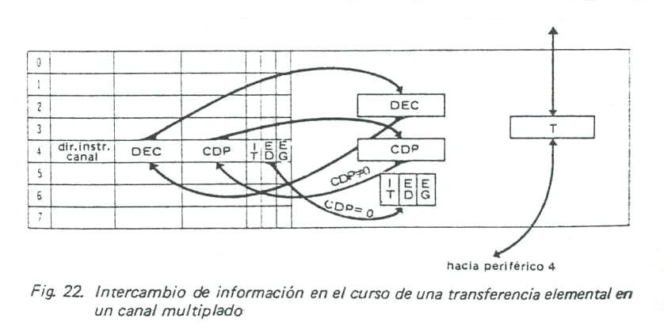

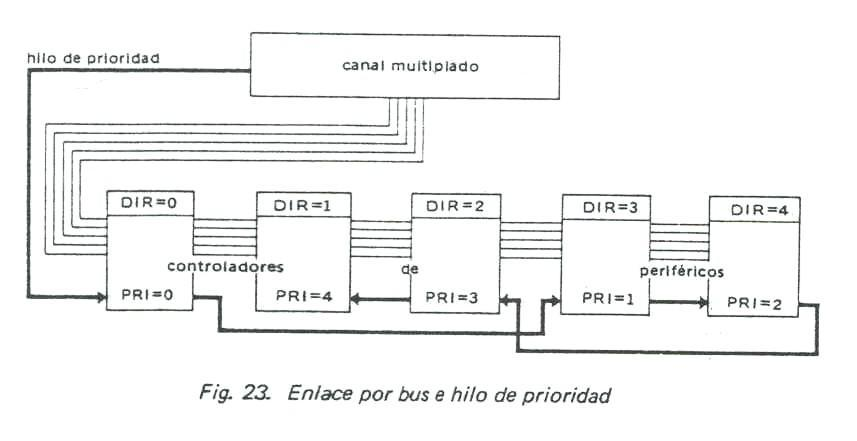

Se distinguen 2 clases de diálogos entre canal y controladores de periféricos:

1.  Los inicializados por el canal para lanzar una operación de entrada – salida, o para comprobar el estado de una unidad periférica.

2.  Los inicializados por un controlador de periférico. Generalmente se trata de solicitud de ejecución de una transferencia elemental de entrada o de salida, cuando la unidad periférica está dispuesta. Como pueden producirse varias solicitudes simultaneas, una prioridad cableada establecerá la selección de la solicitud a satisfacer.

**Diálogo inicializado por el canal:** El canal pone en los hilos de información del bus la dirección del periférico y valida esta dirección por una señal de selección SEL.

Los controladores de periférico detectan la señal SEL, comparan la información del bus con su propia dirección y se muestran transparentes si ambas no coinciden.

Cuando sí coinciden, el controlador se reconoce y no transmite la información, sino que se conecta. Generalmente pone en los hilos de información su “estado” y lo acompaña por una señal de validación ESTD.

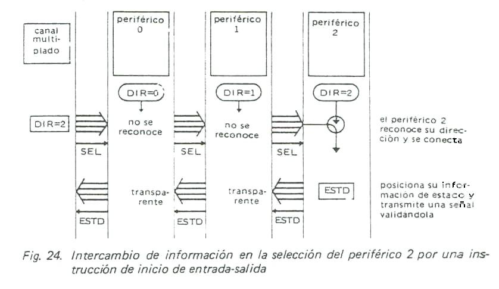

**Diálogo inicializado por un controlador de periférico:** Uno o varios controladores emiten sobre la línea ómnibus una señal de demanda de servicio DES. La selección del controlador de mayor prioridad, entre los que han generado una demanda, se hace por intermedio de la línea de prioridad que, saliendo del canal, se comunica con los distintos controladores según su orden de prioridad. En respuesta a la DES, el canal envía una señal PRI por medio de la línea de prioridad. Los controladores se comportarán transparentemente a la señal PRI, excepto si han emitido una DES. El primer controlador atravesado que haya emitido una DES, no transmitirá la señal PRI, pondrá su dirección sobre los hilos de información del bus y la acompañara por una señal de validez DIR. El canal aprobará la dirección por una señal ADIR y el periférico será conectado. El canal cargará en sus registros las informaciones de intercambio específicas de dicho periférico (DEC y CDP).

El controlador del mismo enviará una demanda de transferencia DT, acompañada por una señal indicando si se trata de una entrada o de una salida. En el primer caso, pondrá simultáneamente la información sobre el bus; en el segundo, esperará a la información procedente del canal. En general, es posible efectuar sucesivamente varias transferencias elementales del mismo sentido si el controlador repone cada vez la señal DT. El servicio del canal concluye cuando el controlador activa la señal FDES (fin de demanda de servicio). El canal reactualiza, a partir de sus registros, las informaciones en el subcanal del órgano periférico direccionado. Si aún el canal detecta la señal DES, esto quiere decir que otro controlador tiene presentada igualmente una demanda de servicio, se realiza nuevamente todo lo descrito anteriormente.

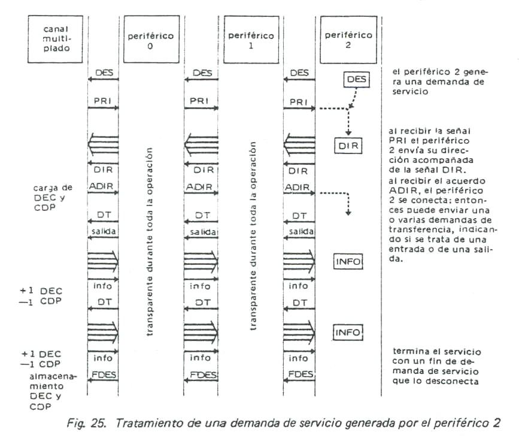

## Canal Multiplado por Bloques

Permite optimizar el caudal global entre discos y memoria central. Sigue siendo un canal simple, esto es, limitado a una sola transferencia a la vez, pero autoriza una cierta “multiprogramación” entre las diferentes solicitudes de transferencia.

Una vez inicializada una orden de transferencia debe esperarse a que el sector direccionado pase bajo la cabeza de lectura – escritura y que este tiempo de espera es estadísticamente igual a la mitad de la duración de giro del disco. El canal multiplado por bloques intenta emplear el tiempo de espera para efectuar otra transferencia. Para conseguirlo, se instrumentan los dos medios siguientes:

- **En el canal:** un conjunto de registros para almacenar las direcciones de los primeros sectores a los que afecten las diferentes instrucciones de canal del o de los programas de entrada – salida.
- **En el controlador:** la posibilidad de identificar el número del sector que va a pasar enseguida bajo la cabeza de lectura – escritura y de transmitirlo al canal.

Un dispositivo de comparación del número del sector que va a activarse, con los números de los sectores direccionados, capacita al canal para atender prioritariamente a las operaciones que presentan el menor tiempo de espera. Esto evita la acumulación de los tiempos de espera que se produce en el canal selector ordinario, y por tanto aumenta el caudal global del sistema.

Unidad de Intercambio Flotante (o Canal Flotante)

Los órganos periféricos más rápidos (discos, tambores, etc.) bloquearía por si solos a un canal multiplado: por esta razón se les conecta a un canal selector. Cuando un sistema informático posee un cierto número de estos órganos conviene, por economía, agruparlos sobre un número reducido de canales selectores, pudiendo servir cada uno de estos a varios órganos periféricos. Es evidente que los órganos conectados a un mismo canal no pueden funcionar simultáneamente.

Puede suceder, que en el curso de explotación, determinadas operaciones de entrada – salida se vean obligadas a esperar a que el canal correspondiente se libere, mientras que otros canales se muestran inactivos. Para evitar tal situación, Borroughs ha introducido el concepto de **canal flotante** o **unidad de intercambio flotante**: un conjunto de canales selectores y controladores de periféricos son interconectados entre sí, de tal forma que cualquier canal pueda direccionar a cualquier controlador y mantenerlo conectado mientras dure la operación de entrada – salida.

Esta organización supone la existencia de dos niveles de selección:

1.  Un primer nivel, situado entre la unidad central y los canales, permite a aquella seleccionar el primer canal libre de la lista de los canales, a la inicialización de una operación de entrada – salida.

2.  Un segundo nivel, llamado **intercambiador de entrada – salida**, permite al canal así seleccionado conectarse a la unidad periférica direccionada por la instrucción de inicio de entrada – salida.

Canales Especializados

La evolución de las unidades de intercambio hacia una autonomía cada vez más acentuada respecto de la unidad central conduce a convertirlas en verdaderos pequeños ordenadores, que ejecutan su programa de forma similar a la unidad central.

Tanto es así, que se corre el riesgo de caer en dos tentaciones:

- Sustituir los canales por ordenadores de programa registrado (las entradas – salidas son gestionadas, no por los canales, sino por una decena de pequeños calculadores).

- Hacerle hacer algo más que la simple gestión de las entradas – salidas.

Esto resulta particularmente útil en dos campos aplicación:

1.  **La teleinformática:** el canal desempeña el papel de concentrado – difusor, encargado de agrupar los mensajes provenientes de diferentes terminales o de difundir las respuestas. En este caso, el canal desempeña el papel de tampón respecto del calculador central y le descarga de todos los mecanismos de transmisión, detección de errores, retransmisión, etc.

2.  **El control industrial:** la vigilancia de una instalación industrial requiere la recolección periódica, con ciclos de algunos segundos, de varios miles de magnitudes analógicas o lógicas. En tal caso, el papel del canal podría ser:

En lo que se refiere a magnitudes analógicas, que representan temperaturas o presiones, compararlas con ciertos niveles. Según el resultado de esta comparación el canal podría: ignorar, guardarla en memoria para un posterior análisis, o bien alertar mediante interrupción al calculador central para que este reaccione sobre el proceso.

En cuanto a las magnitudes lógicas (variables binarias) comparar el nuevo estado con el precedente y no interrumpir a la unidad central más que para advertirla de los cambios producidos.

## CONTROLADORES PERIFERICOS

Cualquier clase de órgano periférico exige un controlador específico. A veces se considera al controlador como parte del equipo periférico; sin embargo, cuando actúa en común para varios órganos periféricos idénticos (por ejemplo, unidades de cinta magnética), se le considera unidad lógica independiente.

La parte de control del periférico es evidentemente específica del periférico asociado. No obstante, esta parte recibe y decodifica el código de operación periférica (primera información de una instrucción de canal) y, en respuesta a determinadas instrucciones de prueba o, también, al final de una operación de entrada – salida, emite informaciones de estado hacia el canal. Tanto el COP como el estado contienen informaciones específicas de cada periférico. A modo de ejemplo se pueden citar algunos tipos de COP y estados concernientes a un bobinador de cinta magnética:

- **Código de operación periférica:** lectura, lectura hacia atrás, escritura, búsqueda de indicativo de bloque, espacio adelante, rebobinar, etc.

- **Estados:** ocupado, no operativo, dispuesto, rebobinando, etc.

La complejidad de los controladores es muy variable: es absolutamente diferente controlar una máquina de escribir en funciones exclusivas de salida, una unidad de discos rápidos dotada de evolucionados medios para detección o corrección de errores y una unidad osciloscópica gráfica dotada de generadores de vectores y de caracteres así como de la posibilidad de modular el contraste y el color.

En el primer caso, bastará con un circuito de control puramente cableado; en el segundo caso, se podrá recurrir a un sistema parcialmente microprogramado. Por último, en el tercer caso, quizá no se dude en utilizar un pequeño ordenador.

Algunas veces, en los pequeños ordenares, los controladores de periféricos van integrados en la unidad central, solución que resulta particularmente económico si la máquina está microprogramada.

## SUBRUTINA – PILA

Una subrutina es una secuencia que contiene en sí instrucciones para ejecutar una tarea dada, y se incorpora en un programa más grande. En cualquier punto del programa se puede invocar o llamar a la subrutina. Es decir, en ese punto, se ordena al computador que pase a ejecutar la subrutina completa y retornar después al punto en que tuvo lugar la llamada.

Las subrutinas permiten la reutilización de código, con esto se ahorra esfuerzo de programación, y además permiten que los programas se puedan subdividir en unidades más pequeñas.

El uso de subrutinas requiere de dos instrucciones básicas: una instrucción de llamada “CALL”, que produce una bifurcación desde la posición actual a la subrutina; y una instrucción de retorno de la subrutina “RETURN” al lugar desde el que se llamó. Ambas son formas alternativas de instrucciones de bifurcación. Cuando se encuentra una instrucción de llamada a una subrutina, la CPU **interrumpe** la ejecución del programa principal e inicia la ejecución de la subrutina. La sentencia RETURN hace que la CPU vuelva al programa de llamada y continúe con la ejecución de la instrucción que sigue a la correspondiente CALL.

La ejecución de la instrucción de llamado a la subrutina en el programa principal se lleva a cabo de la siguiente manera:

- La dirección asociada a la primera instrucción de la subrutina se transfiere al CP.
- La dirección de regreso al programa principal se inserta en la cima pila.
- El computador ejecuta las instrucciones del programa de subrutina.
- Cuando la última instrucción de la subrutina es alcanzada, el computador ejecuta una instrucción de regreso sacando la dirección colocada en la cima de la pila y colocándolo en el CP.
- Continúa la ejecución del programa principal, ya que el CP contiene la dirección de la próxima instrucción del programa principal.

Hay que resaltar los siguientes puntos:

- Una subrutina puede llamarse desde distintas posiciones.
- Una subrutina puede contener llamadas a otras subrutinas.
- Cada llamada a subrutina está emparejada con un retorno en el programa llamado.

Las pilas no sólo soportan varias llamadas de subrutinas al mismo tiempo, sino que también soportan los parámetros que deben transferirse al procedimiento llamado. El procedimiento invocado puede acceder a los parámetros en la pila.

Al volver, los parámetros de retorno pueden colocarse también en la pila, debajo de la dirección de retorno. El conjunto de parámetros completo que se almacena en la llamada a un procedimiento, incluyendo la dirección de retorno, se denomina **marco de pila**.

\

## INTERRUPCIONES

Prácticamente todos los computadores disponen de un mecanismo mediante el cual los módulos de E/S pueden interrumpir el procesamiento normal de la CPU. Una interrupción es precisamente una suspensión temporaria de la ejecución de un programa, para pasar a ejecutar una subrutina de servicio de interrupción.

Con el uso de interrupciones, el procesador puede dedicarse a ejecutar otras instrucciones mientras una operación de E/S está en curso. Por lo tanto, una operación de E/S se pude realizar concurrentemente con la ejecución de otra instrucción. Como consecuencia de lo declarado anteriormente, las interrupciones proporcionan una forma de mejorar la eficiencia del procesador.

Hay que mencionar que el programa que se esté ejecutando no tiene que incluir ningún código para posibilitar las interrupciones; el sistema operativo y la BIOS (Basic Input Output System) son los responsables de detener el programa que se esté ejecutando y después permitir que prosiga en el mismo punto.

A continuación se enumeran las clases de interrupciones más comunes:

- **Interrupción por errores o por averías de máquina:** fallo de alimentación eléctrica; error de paridad en memoria.

- **Interrupción por causa del programa** (o desvío)**:** instrucción o dirección incorrecta; operaciones imposibles: desbordamiento de capacidad, división por cero, etc., intentos de ejecución de instrucciones o de escritura en memoria no permitidos por el estado de la máquina.

- **Interrupción por entrada – salida:** generada por el canal para avisar el fin de una operación de entrada – salida o de una anomalía acaecida en el transcurso de una entrada – salida.

- **Interrupción externa:** utilizada para avisar a la máquina acerca de cualquier modificación interesante del medio exterior, especialmente en control de procesos industriales.

- **Interrupción de recuento:** para contar impulsos procedentes de un reloj, por ejemplo.

Determinados computadores presentan una sola posibilidad de interrupción, en cuyo caso se pasarán todas las causas de interrupción a través de un OR lógico y el programa de interrupción deberá comenzar por comprobar un conjunto de indicadores, para detectar cual pueda ser la causa de la misma

Otros poseen varios niveles de interrupción. A cada nivel de interrupción le corresponde un hilo proveniente de la causa o causas de interrupción y también un programa asociado. Dichos niveles pueden estar jerarquizados, lo que significa que están clasificados por orden de las prioridades respectivas y que un programa de interrupción puede ser, a su vez, interrumpido por una demanda de interrupción clasificada en un nivel superior de prioridad. El programa interrumpido pasa entonces al estado de espera.

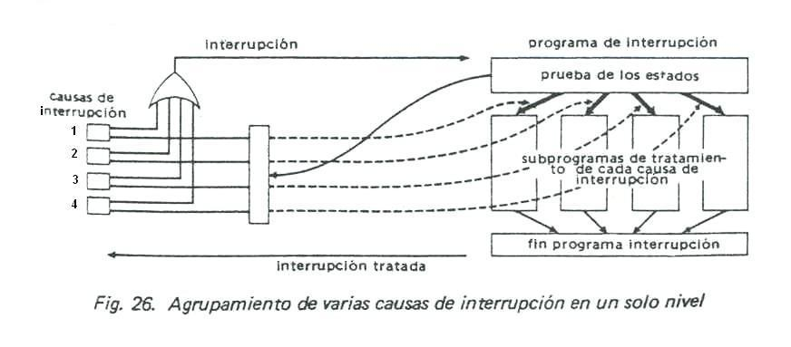

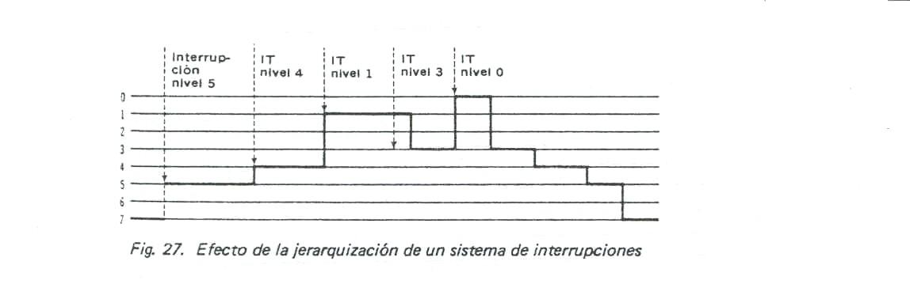

El esquema de la figura representa la actividad de los programas, en el transcurso del tiempo, para un sistema jerarquizado de interrupción de 8 niveles. El nivel 0 es de mayor prioridad que el 1, éste más que el 2, etc. El nivel 7 corresponde al programa de retaguardia que, en el caso de la figura, se ve interrumpido por una interrupción de nivel 5, cuyo programa comienza a ser ejecutado cuando es interrumpido por un nivel 4 más prioritario, etc. .Al acabar de ejecutarse un programa cualquiera de interrupción, el control se transfiere al programa en espera de nivel más elevado.

Los pequeños ordenadores especializados en la guía de procesos poseen frecuentemente sistemas de interrupción bastante elaborados. En general, presentan varias de las características del tipo siguiente de organización modular:

- Las interrupciones están agrupadas en un cierto número de niveles jerárquicos, esto es, cada uno de ellos posee una prioridad diferente: un programa de un determinado nivel de prioridad puede verse interrumpido por un programa solicitado por una interrupción de nivel superior;

- Un nivel agrupa varios subniveles, cada cual con su hilo de interrupción y su prioridad dentro del nivel; los programas asociados a los subniveles de un mismo nivel no pueden interrumpirse unos a otros, siendo únicamente efectiva su prioridad en caso de elección entre varios de ellos, si se encontrasen simultáneamente en estado de espera;

- Un subnivel agrupa, a su vez, varias demandas de interrupciones, cuyas causas son investigadas por prueba de los indicadores.

**Descripción de un sistema jerarquizado de interrupciones prioritarias**

Cada nivel de interrupción tiene asociados cuatro biestables, que definen los diferentes estados posibles del nivel.

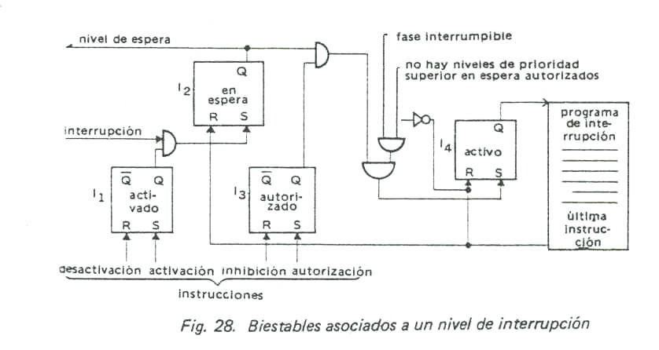

**Estado desactivado:** el nivel no acepta ninguna demanda de interrupción.

**Estado activado:** el nivel acepta y memoriza una demanda de interrupción. Un nivel de interrupción puede ser activado o desactivado por programa.

**Estado de espera:** el nivel pasa al estado de espera si recibe una señal de demanda de interrupción. Varias razones pueden diferir la consideración operativa de la interrupción. Primeramente, es preciso que el nivel esté autorizado, puesto que, en efecto, se distinguen dos formas del estado de espera:

- **Estado de espera inhibido:** el nivel ha resultado inhibido por programa de tal manera que la interrupción ha podido ser memorizada pero no tomada en cuenta por el ordenador. También se suele decir que el nivel ha sido *enmascarado*.

- **Estado de espera autorizado:** la interrupción puede ser tomada en cuenta por el ordenador, si se han satisfecho las siguientes condiciones:

- 1.  No existe ningún nivel de prioridad superior en el estado autorizado de espera;
  2.  La unidad central se encuentra en una fase interrumpible (generalmente en final de instrucción). El nivel pasa entonces al estado activo.

- 1.  - **Estado activo:** implica que la unidad central tome en cuenta la interrupción y se mantiene durante toda la ejecución del programa de interrupción.

Nótese que a cada nivel de interrupción se asocian dos señales: una, impulsional, procedente del exterior, para pedir la interrupción, otra de larga duración, que el calculador deja activada hasta tanto no se haya tratado la interrupción, es decir, hasta que el nivel sea capaz de aceptar una nueva demanda de interrupción (ver figura).

## Acuse de una interrupción

Corresponde a un paso al estado activo. A cada nivel de interrupción se asocia, por cableado, un conjunto de posiciones de memoria (registros, palabras de la memoria local o de la memoria central).

Tales posiciones de memoria se dividen en dos partes: la primera contiene todas las informaciones necesarias al arranque del programa de interrupción (en especial, la dirección de su primera instrucción); la segunda sirve para almacenar las informaciones que caracterizan al estado del programa en el instante de la interrupción, para su posterior reanudación (estado de los diferentes indicadores, contador ordinal, eventualmente registro de base).

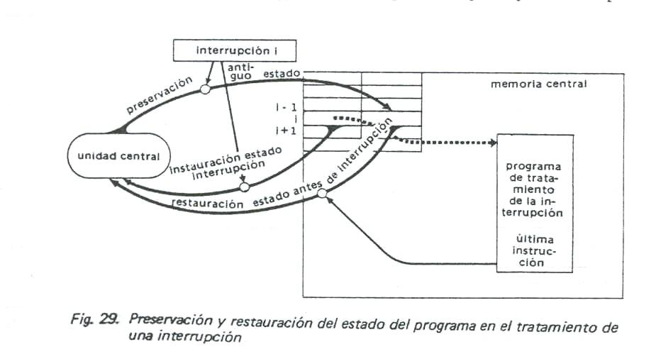

El paso de una interrupción al estado activo consiste en memorizar el estado del programa, almacenando las informaciones pertinentes en las posiciones asociadas de memoria y en instaurar después un nuevo estado del programa, buscando las informaciones necesarias al arranque del programa de interrupción.

La última instrucción de un programa de interrupción es una especial, cuya finalidad es la de restaurar el estado del programa en el momento de la interrupción, yendo a rescatar en las posiciones asociadas de memoria las informaciones preservadas. Además, desactiva el nivel de interrupción, lo que le permite responder a otra posible señal de interrupción.

## Instrucciones de gobierno del sistema de interrupción

Son instrucciones para activar (o desactivar), autorizar (o inhibir), desencadenar uno o varios niveles de interrupción. Si el calculador consta de muchos niveles de interrupción, se agrupan éstos de manera que puedan ser direccionados con mayor sencillez. Estas instrucciones pueden tener el siguiente formato:

<table>
<tbody>
<tr>
<td>CO</td>
<td>COMP.</td>
<td>Dirección de grupo</td>
<td>Configuración binaria</td>
</tr>
<tr>
<td></td>
<td></td>
<td></td>
<td></td>
</tr>
<tr>
<td></td>
<td></td>
<td></td>
<td>Cada nivel de grupo está representado por un bit puesto a 1, o 0, según que la operación afecte, o no, a este nivel.</td>
</tr>
<tr>
<td></td>
<td></td>
<td colspan="2">
Permite escoger el grupo implicado de niveles.
</td>
</tr>
<tr>
<td></td>
<td colspan="3">
Complemento al código de operación, especificando la operación precisa a efectuar; activación, inhibición, autorización, desencadenamiento.
</td>
</tr>
<tr>
<td colspan="4">
Código de operación definiendo un gobierno de interrupción.
</td>
</tr>
</tbody>
</table>

Cuando el número de interrupciones es muy limitado, se destina un registro de la unidad central para albergar lo que se ha convenido en llamar la **máscara de interrupción**. Se establece una asociación entre cada nivel de interrupción y un bit de este registro, que indica si la interrupción es autorizada o inhibida – enmascarada, se dirá entonces. La máscara de interrupción puede cargarse mediante una instrucción especial, donde el número de niveles de interrupción está limitado a 5.

**INFLUENCIA DE LOS SISTEMAS DE ENTRADA – SALIDA SOBRE LA ORGANIZACIÓN GENERAL DE LAS MAQUINAS**

Los tipos y los rendimientos de los canales asociados a una unidad central dependen:

1.  de la potencia de procesamiento de la unidad central;
2.  del tipo de aplicación;
3.  del número y de las características de las diferentes clases de unidades periféricas conectables.

## Canales y Potencias de Ordenador

**Ordenadores Pequeños**: El enlace programado es, a menudo, el único acceso en los ordenadores muy pequeños. Los distintos periféricos trabajan, en tal caso, por interrupciones. Con frecuencia, se encuentra también:

1.  el equivalente a un canal selector: las palabras de control (dirección en curso y cuenta de palabras) se almacenan generalmente en memoria central, mientras que la incrementación de la dirección y la decrementación del contador de palabras se, ejecutan en la unidad central; una transferencia elemental consume entonces 3 ó 5 ciclos, según que la dirección y el contador de palabras puedan acomodarse, o no, en una sola palabra de memoria;
2.  en algunas máquinas pequeñas de uso en tiempo real, un sistema de acceso directo a memoria en un ciclo, a sabiendas de que el elemento externo debe proporcionar la dirección de almacenamiento.

**Ordenadores Medios:** En máquinas ya un poco más importantes se emplea:

1.  bien el equivalente a un canal multiplado en el tiempo. Es la unidad central quién realiza las funciones del canal, es decir, que la unidad central hace de canal multiplado simulando las funciones de los canales autónomos. Los subcanales están en memoria central en el caso de los sistemas menos evolucionados, en memoria local en los más evolucionados.

2.  bien la posibilidad de implantar varios canales selectores, generalmente poseedores de sus propios registros de dirección en curso y de cuenta de palabras. Algunos modelos tienen canales selectores independientes de la unidad central, mientras que es todavía ésta quién desempeña el papel de canal multiplado.

**Ordenadores grandes:** Generalmente permiten la conexión:

1.  de un canal multiplado para las unidades periféricas lentas (líneas de transmisión, lectoras, perforadoras de tarjetas y de cinta, eventualmente bobinadores de cinta magnética);

2.  de un cierto número de canales selectores para los elementos periféricos rápidos (memorias de masa con núcleos, discos, tambores y, a veces, cintas magnéticas).

Estos canales funcionan independientemente de la unidad central y, en general, acceden directamente a la memoria por intermedio de un controlador de memoria que gestiona sus respectivas prioridades.

Organización en torno a un bus único

Todo el sistema se organiza en torno a un bus único, el unibus, al cual se conectan la unidad central, los bloques de memoria central y los controladores de los órganos periféricos (constituyendo cada uno su propio canal).

En lo que concierne al direccionamiento, todos los registros de los controladores de periférico (registro tampón de intercambio, registros de dirección en curso y de cuenta de palabras, registros de C.O.P. y de estado) son conocidos de la unidad central por direcciones que siguen a las de la memoria central. Por consiguiente, no existe instrucción especial de entrada – salida, sino que todas las instrucciones capaces de direccionar a la memoria central son utilizables para operar sobre estos registros.

La instrucción de base es la de movimiento, con dos direcciones: copia el contenido del elemento direccionado por la primera en el elemento indicado por la segunda.

Estructuralmente, el unibus contiene, además de los hilos de información y de dirección, un gran número de hilos de servicio correspondientes a las señales de diálogo, de interrupción y, a las señales de protección que impiden que un diálogo se vea perturbado por la intervención de una tercera unidad. De manera muy esquemática, el funcionamiento regulado por el controlador de unibus es el siguiente:

Una unidad pide utilizar el bus. Su demanda permanece bloqueada hasta tanto el diálogo en curso no haya terminado. En caso positivo, esta solicitud es comparada con las otras que pueda haber presentes y no se ve atendida inmediatamente más que si procede de la unidad de más elevada prioridad.

Esta se convierte en la unidad **maestra**. Envía sobre el bus la dirección de otra unidad que se autoidentifica y se convierte en la unidad **esclava**, obedeciendo las órdenes de la unidad maestra durante el tiempo necesario a una transferencia de información. La unidad central es siempre maestra, la memoria central siempre esclava.

Este concepto de unibus permite la transferencia directa de unidad periférica a unidad periférica (sin transitar por una zona tampón en memoria), en la medida que una de las unidades pueda ser sincronizada con la otra. Entonces, la primera se comporta, en lo que se refiere a los diálogos transportados por el unibus, como esclava de la segunda.

**Influencia de las entradas – salidas sobre la organización de la memoria central en los grandes ordenadores**

En las máquinas muy potentes la memoria se divide generalmente en bloques independientes, de tal forma que la unidad central y varias unidades de intercambio pueden acceder simultáneamente a la misma en la medida que las diferentes referencias a memoria conciernan a bloques diferentes.

La figura representa el tipo más corriente de organización, donde existe una interconexión de un determinado número de procesadores (procesador central o procesadores de entrada – salida) y de bloques de memoria.

Generalmente las distintas unidades funcionan de manera asíncrona entre sí. Cada bloque de memoria está provisto de un número de muelles de acceso igual al número máximo de procesadores susceptibles de conectársele. Cada procesador está comunicado con los diferentes bloques de memoria por un bus.

Cuando pide un ciclo de memoria envía sobre este bus una demanda de ciclo, acompañada de la dirección de memoria. Dicha demanda es simultáneamente recibida por los distintos bloques, que decodifican los dígitos correspondientes a la dirección de bloque.

Cuando un bloque se auto – identifica, lanza, si está libre, un ciclo de memoria para atender a esta demanda, si no, la memoriza en el muelle de acceso para atenderla ulteriormente.

En caso de conflicto de acceso, el controlador de bloque se encarga de regular las prioridades. Son posibles varias estrategias:

1.  **Primer llegado, primer atendido:** Implica una lógica poniendo cíclicamente en memoria la cronología de las demandas;

2.  **Prioridad fija asociada a cada procesador**. Se define una jerarquía de prioridades entre los canales selectores, todos ellos prioritarios frente al canal multiplado, y éste frente a la unidad central. El inconveniente de tal solución es que se corre el riesgo de bloquear al sistema y perder informaciones cuando un procesador de muy alta prioridad tuviera una tasa demasiado fuerte de transferencia;

3.  **Escrutación cíclica de los diferentes muelles:** siempre en el mismo orden. El peligro señalado en el punto 2 se evita en la medida que, tras haber concedido un ciclo a un procesador, se atienda el resto de las demandas antes de concederle otro. Por otro lado, esta solución no siempre es posible cuando determinados periféricos pidan tasas muy fuertes de transferencia.

La organización esquematizada en la figura es típicamente del tipo de los multiprocesadores. Habrá multiprocesador, en un sentido estricto, bajo estas dos hipótesis:

1.  Se añade una segunda unidad central;
2.  los canales son, en sí. pequeños ordenadores.

## INTERCAMBIOS DE INFORMACIÓN CON EL EXTERIOR

## Entrada/Salida

Junto con la CPU y la MEMORIA, el tercer elemento clave de un computador es el conjunto de MÓDULOS DE E/S. Cada módulo se conecta al Bus del Sistema o a un conmutador central y controla uno o más dispositivos periféricos.

Los módulos de E/S están dotados de la lógica necesaria para permitir la comunicación entre el bus y el periférico.

¿Por qué es necesario disponer de un intermediario entre el bus y el periférico? ¿Por qué no conectar los periféricos directamente al bus del sistema? Hay varias razones:

- Existe una gran variedad de periféricos, con formas de funcionamiento diferentes. Disponer de la lógica de cada tipo en la CPU resulta poco práctico.

- A menudo, la velocidad de transferencia de datos de los periféricos es mucho menor que la de la memoria o la CPU. Por ello no es práctico utilizar un bus de alta velocidad para comunicarse con un periférico.

- Con frecuencia, los periféricos utilizan datos con formatos y tamaños de palabra diferentes a los del computador al que se conectan.

El Módulo de E/S tiene dos funciones principales:

1.  Realizar la interfaz entre la CPU y la memoria a través del bus del sistema o un conmutador central.

2.  Realizar la interfaz entre uno o más dispositivos periféricos mediante enlaces de datos específicos.

## DISPOSITIVOS EXTERNOS

Los dispositivos externos se pueden clasificar en 3 categorías:

- **De interacción con los humanos:** permiten la comunicación con el usuario del computador (teclado, impresora, scanner, mouse, etc.)

- **De interacción con máquinas:** permiten la comunicación con elementos del equipo (discos, unidades de cinta, etc.)

- **De comunicación:** permiten la comunicación con dispositivos remotos (módem).

**DATOS**: se intercambian en forma de un conjunto de bits que son enviados a, o recibidos desde el módulo de E/S.

**SEÑALES DE CONTROL**: determinan la función que debe realizar el dispositivo, tales como **enviar datos al módulo de E/S**, Entrada (INPUT) o Lectura (READ), **aceptar datos desde el módulo de E/S**, ****Salida (OUTPUT) o Escritura (WRITE), **indicar el estado** o **realizar alguna función de control particular del** dispositivo (por ejemplo situar la cabeza del disco).

**SEÑALES DE ESTADO**: Indican el estado del dispositivo (READY / BUSY).

La **LÓGICA DE CONTROL** asociada al dispositivo controla su operación en respuesta a las indicaciones del módulo de E/S.

El **TRANSDUCTOR** convierte las señales eléctricas asociadas al dato a otra forma de energía (en el caso de una salida) y viceversa en el caso de una entrada. Usualmente, existe un BUFFER asociado al transductor para almacenar temporalmente el dato que se está transfiriendo entre el módulo de E/S y el exterior.

**Ejemplos: TECLADO/MONITOR**

**Entrada desde el Teclado:** cuando el usuario pulsa una tecla, se genera una señal electrónica interpretada por el transductor del teclado que la traduce al patrón binario del correspondiente código ASCII. Ese patrón se transmite al módulo de E/S del computador. En el computador, el texto se almacena utilizando el mismo código ASCII.

**Salida hacia el Monitor:** los códigos ASCII se transmiten al dispositivo externo desde el módulo de E/S. El transductor del dispositivo interpreta este código y envía las señales electrónicas precisas para que muestre en pantalla el carácter indicado o realice la función de control solicitada.

## MÓDULOS DE E/S

Función del Módulo

Es el responsable del control de uno o más dispositivos externos, y del intercambio de datos entre esos dispositivos y la memoria principal y/o los registros de la CPU. Por ello, el módulo tiene una interfaz interna al computador (con CPU y Memoria) y otra externa al computador (con el dispositivo externo).

Las funciones principales son:

- Control y temporización
- Comunicación con la CPU
- Comunicación con los dispositivos.
- Almacenamiento temporal de datos.
- Detección de errores.

En cualquier momento la CPU puede comunicarse con uno o más dispositivos externos en cualquier orden, según las necesidades de E/S del programa. Los recursos internos, tales como la memoria principal y el bus del sistema, deben compartirse entre las distintas actividades, incluyendo la E/S de datos. Por ello, la función de E/S incluye requerimientos de **control** y **temporización** para coordinar el tráfico entre los recursos internos y los dispositivos externos. Por ejemplo, el control de la transferencia de datos desde un dispositivo externo a la CPU podría implicar la siguiente secuencia de pasos:

1.  La CPU interroga al módulo para comprobar el estado del dispositivo conectado al mismo.
2.  El módulo de E/S devuelve el estado del dispositivo (READY / BUSY).

3.  Si el dispositivo está LISTO para transmitir, la CPU solicita la transferencia del dato mediante una orden al módulo de E/S.

4.  El módulo de E/S obtiene un dato del dispositivo externo.

5.  Los datos se transfieren desde el módulo de E/S a la CPU.

Si el sistema utiliza un bus, entonces cada una de las interacciones entre la CPU y el módulo de E/S implica uno o más arbitrajes del bus. Para cumplir con los pasos descriptos, el módulo de E/S debe poder entablar comunicación con la CPU y con el dispositivo externo. La comunicación con la CPU implica:

- **Decodificación de órdenes:** las órdenes provenientes de CPU están presentes en las líneas de control del bus. Por ejemplo. Un controlador de disco podría recibir las órdenes: LEER SECTOR, ESCRIBIR SECTOR, BUSCAR pista, ETC. Los parámetros necesarios para llevar a cabo la instrucción se envía por las líneas de datos (ejemplo BUSCAR pista).
- **Datos:** la CPU y el módulo de E/S intercambian datos a través de las líneas de datos del bus.
- **Información de estado:** puesto que los periféricos son lentos, es importante conocer el estado del módulo de E/S (puede suceder que el dispositivo no esté preparado por encontrarse respondiendo a una orden de E/S previa). Esta situación se indica con una señal de estado (BUSY, READY). También puede haber señales para indicar situaciones de error.
- **Reconocimiento de Dirección:** cada dispositivo de E/S tiene una dirección. Un módulo de E/S reconoce una única dirección para cada uno de los periféricos que controla.

Por otra parte, el módulo de E/S debe ser capaz de **comunicarse con el dispositivo**. Esta comunicación implica intercambiar órdenes, información de estado y datos.

Una tarea esencial para el módulo de E/S es el **almacenamiento temporal de datos** (buffering), para equilibrar las diferencias de velocidades entre la CPU y los dispositivos externos. Los datos provenientes de la memoria se envían al módulo de E/S en ráfagas rápidas. Estos se almacenan temporalmente en el módulo de E/S y después se envían al periférico a la velocidad de éste. En el sentido contrario, los datos se almacenan en el módulo para no mantener a la memoria ocupada en una transferencia lenta. Así el módulo de E/S debe ser capaz de operar a la velocidad del dispositivo y de la memoria.

Por último, el módulo de E/S debe ocuparse también de la detección de errores y de informar de estos errores a la CPU. Ejemplos de estos errores pueden ser: la impresora no está encendida, el papel está atascado, disco dañado, el diskette no está en la unidad, etc. Otros errores están dados por la modificación accidental en los bits al transmitirse desde el dispositivo al módulo de E/S. Para ello se utiliza algún código detector de errores (ASCII utiliza un bit de paridad. Al recibir un byte, el módulo comprueba la paridad para determinar si se produjo error o no).

Estructura del módulo de E/S

- El módulo de E/S se conecta al resto del computador a través de un conjunto de líneas (por ejemplo, las líneas del bus del sistema).
- Los datos que se transfieren a y desde el módulo se almacenan temporalmente en uno o más registros de datos.
- Además puede haber uno o más registros de estado que proporcionan información sobre el estado actual. Un registro de estado puede funcionar, también, como un registro de control para recibir información de control de la CPU.
- La lógica del módulo interactúa con la CPU a través de una serie de líneas de control, a través de las cuales la CPU envía las órdenes al módulo de E/S.
- Las líneas de control pueden ser utilizadas por el módulo de E/S, por ejemplo, para las señales de arbitraje y estado.
- El módulo, además, debe reconocer y generar las direcciones de los dispositivos que controla. Cada módulo de E/S tiene una dirección única, o, si controla varios dispositivos, un conjunto único de direcciones.
- Por último, el módulo de E/S dispone de una lógica específica para la interfaz con cada uno de los dispositivos que controla.
- El funcionamiento del módulo de E/S permite que la CPU vea una amplia gama de dispositivos de una forma simplificada. El módulo de E/S oculta detalles de temporización, formatos, electromecánica de los dispositivos, para que la CPU pueda funcionar únicamente en términos de órdenes LECTURA y ESCRITURA y de abrir y cerrar archivos.
- Un módulo de E/S que se encarga de la mayoría de los detalles de procesamiento, presentando a la CPU una interfaz de alto nivel se denomina CANAL DE E/S o PROCESADOR DE E/S. Un módulo simple, que requiera un control detallado se denomina CONTROLADOR DE DISPOSITIVO. Los CONTROLADORES usualmente aparecen en microcomputadoras, mientras que los CANALES se utilizan en grandes computadoras y los minicomputadores utilizan ambos tipos.

## TÉCNICAS DE E/S

Son posibles tres técnicas para las operaciones de E/S:

1.  **E/S Programada:** la CPU ejecuta un programa que controla directamente la operación de E/S, incluyendo la comprobación del estado del dispositivo, el envío de una orden de lectura o escritura y la transferencia del dato. Cuando la CPU envía una orden al módulo de E/S debe esperar hasta que la E/S concluya. Si la CPU es más rápida que el módulo de E/S, este tiempo de ESPERA se desperdicia

2.  **E/S Mediante Interrupciones:** la CPU proporciona la orden de E/S, continúa ejecutando otras instrucciones y es interrumpida por el módulo de E/S cuando éste termina su trabajo.

3.  **DMA (Acceso Directo a Memoria):** en los dos casos anteriores, la CPU es la encargada de extraer los datos de memoria principal en una salida, y de almacenar los datos de memoria principal en una entrada. Para que esto no ocurra se utiliza DMA. En este caso, el módulo de E/S y la memoria principal intercambian datos directamente sin intervención de la CPU.

## E/S Programada

Cuando la CPU está ejecutando un programa y encuentra una instrucción de E/S, ejecuta dicha instrucción enviando una orden al módulo de E/S correspondiente. El módulo de E/S realiza la acción solicitada y luego activa los bits apropiados en el registro de estado de E/S. El módulo de E/S no realiza ninguna otra acción para avisar a la CPU (no la interrumpe), por lo cual es la CPU la responsable de comprobar periódicamente el estado del módulo de E/S hasta que se determine que la operación ha terminado. Para explicar la técnica de E/S programada, la consideraremos primero desde el punto de vista de las órdenes de E/S que envía la CPU al módulo, y después el punto de vista de las instrucciones de E/S que ejecuta la CPU.

- Órdenes de E/S

Al ejecutar una instrucción de E/S la CPU proporciona:

- **Dirección:** Especificando módulo de E/S y dispositivo externo
- **Orden de E/S**.

Hay 4 tipos de **órdenes de E/S**: control, test, lectura y escritura.

**Control:** se utiliza para activar el periférico e indicarle qué hacer. Por ejemplo rebobinar, en el caso de una cinta magnética. Estas órdenes son específicas del tipo particular de dispositivo periférico.

**Test:** se utiliza para comprobar las condiciones de estado asociadas con el módulo de E/S y sus periféricos. La CPU podrá comprobar si el periférico está conectado y disponible para su uso. También podrá saber si la operación de E/S más reciente ha finalizado o si se ha producido algún error.

**Lectura:** hace que el módulo de E/S capte un dato de un periférico y lo sitúe en un buffer interno (registro de datos). Después la CPU puede obtener el dato solicitando que el módulo de E/S lo ponga en el bus de datos.

**Escritura:** hace que el módulo de E/S tome un dato, del bus de datos, y posteriormente lo transmita hacia el periférico de destino.

Por ejemplo, si se desea leer un bloque de datos (de cinta o disco) y almacenarlo en memoria. Los datos se leen palabra a palabra. Por cada palabra leída, la CPU debe permanecer en un ciclo de comprobación de estado hasta que determine que la palabra está disponible en el registro de datos del módulo de E/S. Aquí se verifica la principal desventaja de esta técnica: es un proceso que consume tiempo y mantiene a la CPU innecesariamente inactiva.

- Instrucciones de E/S

La forma de la instrucción de E/S depende de la manera de direccionar los dispositivos externos. Normalmente hay muchos dispositivos externos conectados al sistema a través de los módulos de E/S. Cada dispositivo tiene asociado un identificador único o dirección. Cuando la CPU envía una orden de E/S, esa orden tiene asociada la dirección del dispositivo deseado. Así, cada módulo de E/S debe interpretar las líneas de dirección para determinar si la orden es para él.

Cuando la CPU, la memoria principal y las E/S comparten un bus común, son posibles dos modos de direccionamiento:

- **Asignado en memoria (memory mapped)**: existe un único espacio de direcciones para las posiciones de memoria y los dispositivos de E/S. La CPU considera a los registros de estado y de datos de los módulos de E/S como posiciones de memoria y utiliza las mismas instrucciones de máquina para acceder tanto a memoria como a los dispositivos de E/S.

Así, con 10 líneas de dirección se puede acceder a un total de 1024 posiciones de memoria y direcciones de E/S en cualquier combinación. Así se necesita una sola línea de lectura y una sola línea de escritura en el bus.

- **E/S aislada**: el bus dispone de líneas de lectura y escritura para memoria principal y líneas de lectura y escritura para E/S. Así, el sistema puede direccionar 1024 posiciones de memoria y 1024 direcciones de E/S. Con la E/S aislada, los puertos de E/S sólo son accesibles mediante una orden específica de E/S, que activa las líneas de órdenes de E/S del bus.

La mayoría de las CPU disponen de un conjunto relativamente grande de instrucciones distintas para acceder a memoria. Si se utiliza E/S aislada, sólo existen unas pocas instrucciones de E/S.

Por eso, una ventaja de la primera es que se puede utilizar este amplio repertorio de instrucciones, permitiendo una programación más eficiente. Una desventaja es que se utiliza parte del espacio en memoria. Cualquiera de las dos técnicas se utiliza.

## E/S Mediante Interrupciones

Ya vimos que el problema de la E/S programada, es que la CPU debe esperar un tiempo considerable a que el módulo de E/S esté preparado para recibir o transmitir datos. Mientras espera, la CPU debe comprobar repetidamente el estado del módulo de E/S. Como consecuencia, se degrada el nivel de prestaciones de todo el sistema.

Una alternativa es que la CPU tras enviar la orden de E/S continúe realizando algún trabajo útil. Después, el módulo de E/S interrumpirá a la CPU para solicitar su servicio cuando esté listo para intercambiar datos con ella. La CPU ejecuta entonces la transferencia de datos y después continúa con el procesamiento previo.

Desde el punto de vista de la CPU las acciones para una entrada son las que siguen:

1.  La CPU envía la orden READ de lectura y pasa a realizar otro trabajo (puede estar ejecutando programas distintos al mismo tiempo).

2.  Al final de cada ciclo de instrucción la CPU comprueba las interrupciones. Cuando se pide la interrupción desde el módulo de E/S, la CPU guarda el contenido de los registros del programa en curso y procesa la interrupción.

3.  En este caso, la CPU lee la palabra de datos del módulo de E/S y la almacena en memoria.

4.  Después recupera el contexto (contenido de los registros) del programa que estaba ejecutando (o de otro programa) y continúa su ejecución.

La E/S con interrupciones es más eficiente que la programada porque elimina las esperas innecesarias. No obstante, las E/S con interrupciones consumen gran cantidad de tiempo de la CPU puesto que cada palabra de datos que va desde la memoria al módulo de E/S o viceversa debe pasar a través de la CPU.

Procesamiento de la interrupción

Cuando un dispositivo de E/S termina una operación de E/S se produce la siguiente secuencia de eventos en el HW:

1.  El dispositivo envía una señal de interrupción al procesador.

2.  El procesador termina la ejecución de la instrucción en curso antes de responder a la interrupción.

3.  El procesador comprueba si hay interrupciones, determina que hay una y envía una señal de reconocimiento al dispositivo que originó la interrupción. La señal de reconocimiento hace que el dispositivo desactive su señal de interrupción.

4.  Ahora el procesador debe prepararse para transferir el control a la rutina de interrupción. Para empezar, debe guardar la información necesaria para continuar el programa en curso en el punto en que se interrumpió (CP y Registro de Estado del Procesador).
5.  El procesador carga en el CP la posición de inicio del programa de gestión de la interrupción solicitada. Según la arquitectura del computador y el sistema operativo puede haber un sólo programa, uno por cada tipo de interrupción, o uno por cada dispositivo y cada tipo de interrupción. Si hay más de una rutina de gestión de interrupción, el procesador debe determinar que programa llamará. Esta información puede haber sido incluida en la señal de interrupción original, o el procesador puede tener que enviar una solicitud al dispositivo que originó la interrupción para que éste responda con la información necesaria.

Una vez que el CP se ha cargado, el procesador continúa con el ciclo de instrucción siguiente, que comienza con la búsqueda de la instrucción (del programa de gestión de interrupciones)

6.  Una vez que la rutina de gestión de interrupciones comienza a ejecutarse, se asegura en primer término, de guardar el contenido de todos los registros de la instrucción previa.

7.  Luego continúa con el procesamiento de la interrupción: examen de la información de estado, relativa a la operación de E/S; envío al dispositivo de E/S de órdenes o señales de reconocimiento adicionales.

8.  Cuando el procesamiento de la interrupción termina los valores de los registros de la instrucción previa son restaurados.

9.  Se ejecutará la siguiente instrucción del programa interrumpido.

Cuestiones de Diseño

Hay 2 cuestiones fundamentales que surgen al momento de implementar E/S con interrupciones:

1.  ¿Cómo determina la CPU qué dispositivo provocó la interrupción?

Hay 4 tipos de técnicas:

1)  *Múltiples líneas de interrupción*: entre la CPU y los módulos de E/S. Esta técnica no resulta práctica, ya que no es conveniente asignar varias líneas del bus a ser líneas de interrupción. Incluso si se utilizan varias líneas, es probable que a cada una se conecten varios módulos de E/S. Por ello, es conveniente utilizar alguna de las otras 3 técnicas.
2)  *Consulta software (software poll)*: cuando la CPU detecta una interrupción, se origina una bifurcación a una rutina de servicio de interrupción que se encarga de consultar a cada módulo de E/S para determinar cuál ha provocado la interrupción.

La consulta podría realizarse mediante una línea específica; por ejemplo, la CPU activa TEST_E/S y sitúa la dirección de un módulo de E/S en las líneas de dirección. Si ese módulo solicitó la interrupción, responde afirmativamente. Otra alternativa sería que cada módulo disponga de un registro de estado direccionable. La CPU lee el estado del registro de cada módulo para determinar cuál solicitó la interrupción. Una vez identificado el módulo se produce una bifurcación para que la CPU ejecute la rutina de servicio específica para ese dispositivo. La desventaja de esta técnica es el tiempo que consume.

3)  *Conexión en cadena (Daisy Chain*): consiste en utilizar una conexión en cadena de los módulos de E/S. Proporciona una consulta HW. Todos los módulos de E/S comparten una línea común para solicitar interrupciones. La línea de reconocimiento de interrupción se conecta encadenando los módulos uno tras otro. Cuando la CPU recibe una interrupción, activa el reconocimiento de interrupción. Esta señal se propaga a través de la secuencia de módulos de E/S hasta que alcanza el módulo que solicitó la interrupción. Normalmente este módulo responde colocando una palabra en las líneas de datos. Esta palabra se llama *vector* y es la dirección del módulo de E/S o algún otro tipo de identificador específico. La CPU utiliza el vector como un puntero a la rutina de servicio general en primer lugar. Esta técnica se conoce con el nombre de *interrupciones vectorizadas*.

Si el módulo de mayor prioridad no desea utilizar el bus activa su señal BPRO (salida de prioridad del bus). Al comienzo de un ciclo de reloj, cualquier módulo puede pedir el control de bus desactivando su línea BPRO. Esto hace que se desactive la línea BPRN del siguiente módulo de la cadena, que a su vez desactiva su línea BPRO. Así, la señal se propaga a lo largo de la cadena. Al final de esta respuesta en cadena, hay un único módulo con su señal BPRN (indica que ningún módulo de mayor prioridad solicita el bus) activada y su señal BPRO desactivada. Este módulo es el que tiene prioridad.

4)  *Arbitraje de Bus*: Un módulo de E/S debe disponer del control del bus para poder activar la línea de petición de interrupción. Así, sólo un módulo puede activar la línea en un instante. Cuando la CPU detecta una interrupción, responde mediante la línea de reconocimiento de interrupción. Después, el módulo que solicitó la interrupción sitúa su vector en las líneas de datos.

1.  Si se han producido varias interrupciones, ¿cómo decide la CPU cuál interrupción procesar?

Las técnicas mencionadas para determinar qué módulo de E/S solicitó la interrupción también proporcionan una forma de asignar prioridades cuando más de un dispositivo solicita atención de interrupción. Con varias líneas de interrupción, la CPU selecciona la línea de mayor prioridad. Con la consulta de software, el orden en que se consultan los módulos determina la prioridad. El orden de los módulos de la conexión en cadena determina la prioridad, igual que el arbitraje de bus establece que quien debe transmitir es el que tiene el control de la línea.

## Acceso Directo a Memoria

En las dos técnicas anteriores veíamos que se presentaban los siguientes inconvenientes:

- La velocidad de transferencia de E/S está limitada por la velocidad a la cual la CPU puede comprobar y dar servicio a un dispositivo.
- La CPU debe dedicarse a la gestión de las transferencias de E/S; debe ejecutarse cierto número de instrucciones por cada transferencia de E/S.

Con E/S programada se logra gran velocidad de E/S a expensas de no hacer nada más. Con Interrupciones la CPU puede ejecutar otra instrucción mientras se procesa la E/S, a expensas de la velocidad de E/S (es decir, la CPU queda liberada para ejecutar otras instrucciones, como resultado disminuye la velocidad de E/S). Cuando hay que transferir grandes volúmenes de datos, se requiere una técnica más eficiente: el DMA.

Para implementarlo es necesario incorporar un módulo adicional al bus del sistema: el módulo DMA. Cuando la CPU desea leer o escribir un bloque de datos, envía una orden al módulo DMA indicando:

- Si se trata de una lectura o una escritura.
- La dirección del dispositivo de E/S en cuestión.
- La posición inicial de memoria de donde se lee o adonde se escribe.
- El número de palabras a leer o escribir.

Después la CPU continúa con otro trabajo. El módulo DMA transfiere el bloque completo de datos a memoria, sin intervención de la CPU. Cuando la transferencia termina el módulo DMA envía una señal de interrupción a la CPU. Así la CPU sólo interviene al comienzo y al final de la transferencia.

El módulo DMA debe tomar el control del bus para transferir datos. Para ello, debe utilizarlo sólo **cuando la CPU no lo necesita**, o **debe forzar a la CPU a que se detenga temporalmente**. Esta última técnica es la más frecuente y recibe el nombre de ROBO DE CICLO porque el módulo DMA roba un ciclo del bus.

Funciona de la siguiente forma. Al finalizar el procesamiento de una instrucción la CPU se detiene, justo antes de necesitar el bus. Entonces el módulo DMA transfiere una palabra y devuelve el control a la CPU. En este caso la CPU no debe resguardar el contenido de los registros, y sólo espera durante 1 ciclo del bus. La CPU es lenta ejecutando los programas, pero para una transferencia E/S de varias palabras el DMA es mucho más eficiente que cualquiera de las técnicas mencionadas anteriormente.

1.  1)  **Bus único, DMA independiente:** El bus del sistema es utilizado para el intercambio de datos con los módulos de E/S y con la memoria (es decir, que la transferencia de cada palabra consume dos ciclos de bus).

2.  1)  **Bus único, DMA-E/S integrados:** En este caso, se integran las funciones DMA y E/S, esto significa que existe un camino entre el módulo de DMA y uno o más módulos de E/S que no incluyen al bus del sistema. La lógica DMA puede ser parte de un módulo de E/S, o puede ser un módulo separado que controla a uno o más módulos de E/S.

3.  1)  **Bus de E/S:** En este caso, se conectan los módulos de E/S a un módulo DMA mediante un bus de E/S, esto reduce a uno el número de interfaces de E/S en el módulo DMA y permite una configuración fácilmente ampliable.

En los dos últimos casos (b y c), el bus del sistema, que el módulo DMA comparte con la CPU y la memoria, es usado por el módulo DMA **sólo para intercambiar datos con la Memoria**. El intercambio de datos entre los módulos DMA y E/S se produce **fuera del bus del sistema.**

## INTERRUPCIONES

Prácticamente todos los computadores disponen de un mecanismo mediante el cual los módulos de E/S pueden interrumpir el procesamiento normal de la CPU. Una interrupción es precisamente una suspensión temporaria de la ejecución de un programa, para pasar a ejecutar una subrutina de servicio de interrupción.

Con el uso de interrupciones, el procesador puede dedicarse a ejecutar otras instrucciones mientras una operación de E/S está en curso. Por lo tanto, una operación de E/S se pude realizar concurrentemente con la ejecución de otra instrucción. Como consecuencia de lo declarado anteriormente, las interrupciones proporcionan una forma de mejorar la eficiencia del procesador. Hay que mencionar que el programa que se esté ejecutando no tiene que incluir ningún código para posibilitar las interrupciones; el sistema operativo y la BIOS (Basic Input Output System) son los responsables de detener el programa que se esté ejecutando y después permitir que prosiga en el mismo punto.

El MEINADIER enumera las clases de interrupciones más comunes.

Existen interrupciones por software (mediante una instrucción de máquina específica) e interrupciones por hardware.

Las interrupciones por HW **externas** (a la UCP) tienen lugar cuando una interfaz activa su señal de solicitud de interrupción (denominada IRQ – Interrupt Request – en las PCs), que por un línea de control del bus llega a un chip. Cada línea IRQ que sale de una interfaz tiene un subíndice n (del 0 al 15 en una PC) que la identifica. Todas las IRQ entran a un chip “árbitro de interrupciones”, que decide cuál interfaz interrumpirá primero, para el caso que se activen varias IRQ simultáneamente, es decir, que da curso sólo a la que tiene subíndice n menor, las restantes tienen que esperar.

Este chip activa una línea que llega al procesador (designada INTR), para indicarle que hay una solicitud de interrupción activa. Así, cada vez que termina de ejecutar una instrucción, el procesador sensa si la línea de control INTR está activa (indicadora de solicitud de interrupción). Si el programa en ejecución lo permite, el mismo es interrumpido. De no ser así, dicha solicitud espera hasta ser atendida. Las interrupciones por HW **internas** (designadas a veces “excepciones”) ocurren en el interior de la CPU, si hay algún problema mientras se ejecuta una instrucción.

Por ejemplo, la impresora de una PC suele usar la señal de IRQ de su interfaz para indicar falta de papel, lo cual origina que la subrutina que atiende a este evento indique el mismo con un aviso en pantalla.

Una interrupción por SW se realiza ejecutando el código de una instrucción que ordena llamar a subrutinas del sistema operativo o de la ROM BIOS cuando necesita el servicio de una de ellas. A diferencia de las interrupciones por HW, una interrupción por SW queda establecido en qué momento de la ejecución de un programa sucederá, pues se trata de una **instrucción** que está en determinado lugar de n programa, que llama a dichas subrutinas. En esencia, la interrupción por HW es activada por una señal IRQ y la interrupción por SW es activada mediante una instrucción de máquina.

Para localizar la subrutina, ya sea de una interrupción por SW o por HW, existe en memoria una zona llamada de “**vectores interrupción**” donde para cada número de IRQ y de INT (para el caso de interrupción por SW) existen dos celdas consecutivas de memoria que indican la dirección de la subrutina que atiende a esa interrupción. Por tal motivo a cada par de estas celdas se las llama “**vector interrupción**”, en el sentido que contienen un número que “**apunta**” hacia donde está dicha subrutina, y a las interrupciones que encuentran su subrutina de esta manera, se las llama “**interrupciones vectorizadas**”. A su vez la dirección donde están las dos celdas (vector) que corresponde a cada IRQ o INT se localiza en función del número de IRQ o de INT.

Las **interrupciones son vectorizadas**, cuando el dispositivo que interrumpe coloca la dirección de memoria, donde se debe bifurcar, sobre las líneas de datos del bus (esa dirección es denominada **vector interrupción**), la cual es enviada a la CPU para luego transferir el control directamente al programa de atención del dispositivo que interrumpe.

## Desarrollo de una Interrupción

Cuando el dispositivo externo pasa a estar preparado para aceptar datos del procesador, el módulo de E/S de este dispositivo externo envía una señal de petición de interrupción al procesador. La interrupción se inicia colocando un 1 sobre la línea de interrupción del bus. Esto notifica a la CPU que un dispositivo desea atención. El procesador responde suspendiendo la operación del programa que se estaba ejecutando (pero completa la instrucción que se estaba ejecutando en el momento de recibir la interrupción), y salta a un programa que da servicio a ese dispositivo concreto, conocido como gestor de interrupción o programa de atención de la interrupción, y prosigue con la ejecución del programa original después de haber dado servicio al dispositivo.

Para permitir el uso de interrupciones, se añade un ciclo de interrupción al ciclo de instrucción. En el ciclo de interrupción, el procesador comprueba si se ha producido alguna interrupción, indicada por la presencia de una señal interrupción. Si no hay señales de interrupción pendientes, el procesador continúa con la siguiente instrucción del programa en curso. Si hay alguna interrupción pendiente, el procesador hace lo siguiente:

1.  Suspende la ejecución del programa en curso y guarda su contexto. Esto significa almacenar la dirección de la siguiente instrucción a ejecutar (contenido actual del contador de programa) y cualquier otro dato relevante de la actividad en curso del procesador. De esta forma el programa puede ser reiniciado cuando se finalice el programa de atención a la interrupción.

2.  El dispositivo que genera la interrupción debe ser identificado.

3.  Se carga el contador del programa con la dirección de comienzo de una rutina de gestión de interrupción.

4.  A continuación el procesador accede a la primera instrucción del programa de gestión de interrupción, que dará servicio a la interrupción. Generalmente el programa de gestión de la interrupción forma parte del sistema operativo y de la BIOS. Normalmente, este programa determina el origen de la interrupción y realiza todas las acciones que sean necesarias.

5.  Cuando la interrupción ha sido atendida, el estado del programa que fue interrumpido debe ser restaurado. El regreso de una interrupción es similar al regreso de una subrutina. Se sacan los valores de la pila y la dirección de regreso se transfiere al CP.

6.  La operación del programa original debe ser reiniciado en el punto en el cual había sido interrumpido.

## Interrupciones Múltiples y Prioritarias

Hasta ahora únicamente se ha tratado la existencia de una sola interrupción. Supóngase, no obstante, que se pueden producir varias interrupciones simultáneamente. Por ejemplo, un programa puede estar recibiendo datos a través de una línea de comunicación e imprimiendo resultados. La impresora generará interrupciones cada vez que complete una operación de escritura. El controlador de la línea de comunicación generará una interrupción cada vez que llegue una unidad de datos. La unidad de datos puede ser un carácter o un bloque, según el protocolo de comunicación. En cualquier caso, es posible que se produzca una interrupción de comunicaciones mientras se está procesando la interrupción de la impresora.

Se pueden seguir 2 alternativas para tratar las interrupciones múltiples.

El método más común de manipular interrupciones múltiples, es comenzar la rutina de servicio haciendo un sondeo de los dispositivos examinando el registro de status (o registro de estado) de cada uno, a fin de identificar aquella que ha generado la requisición. La rutina de servicio prueba cada fuente para buscar si la señal esta activada. Una vez que se haya identificado al dispositivo que produjo la interrupción se descartan las demás interrupciones hasta que se haya completado una rutina de servicio para una fuente particular. El dispositivo que no es atendido mantendrá la interrupción hasta cuando sea atendido.

En este caso se desactivan las interrupciones por un período corto, mientras se está procesando una interrupción (ya que si no se desactiva el sistema de interrupciones, la interrupción que se esta atendiendo podría ser interrumpida por otra interrupción). Una interrupción inhabilitada simplemente significa que el procesador puede y debe ignorar la señal de petición de interrupción. Si se produce una interrupción en ese momento, generalmente se mantiene pendiente y será examinada por el procesador una vez éste haya habilitado las interrupciones. Así, cuando un programa se está ejecutando y se produce una interrupción, las interrupciones se inhabilitan inmediatamente.

Después de que la rutina de gestión de interrupción termine, las interrupciones se habilitan antes de volver al programa que se estaba ejecutando anteriormente, es decir, todavía no se retoma el programa ya que el procesador debe comprobar si se han producido interrupciones adicionales. Esta aproximación es correcta y simple, puesto que las interrupciones se manejan en un orden secuencial estricto.

Desventajas de esta alternativa:

- Consume mucho tiempo.
- El orden en que se haga esta interrogación determina quién será atendido en primer lugar, es decir, que no tiene en cuenta la prioridad relativa.

Estas desventajas podrían implicar lo siguiente: por ejemplo, cuando llega una entrada desde la línea de comunicaciones, ésta debe absorberse rápidamente para dejar espacio a los datos siguientes. Si los primeros datos no se han procesado antes de que lleguen los siguientes, estos se pueden perder.

Una segunda alternativa consiste en definir prioridades para las interrupciones y permitir que una interrupción de prioridad más alta pueda interrumpir a un gestor de interrupción de prioridad menor. Una interrupción prioritaria es un sistema de interrupción que establece una prioridad sobre varias fuentes para determinar a quién va a atender primero, cuando llegan dos o más requisiciones simultáneamente.

Como ejemplo de esta segunda alternativa, considérese un sistema con 3 dispositivos de E/S: una impresora, un disco, y una línea de comunicaciones, con prioridad crecientes de 2, 4 y 5 respectivamente. Supongamos que un programa se empieza a ejecuta en t = 0. En t = 10, la impresora produce una interrupción; la información del programa que es estaba ejecutando se sitúa en la pila del sistema, y la ejecución continúa con la rutina de servicio de interrupción de la impresora. Mientras se está ejecutando esta rutina, en t = 15, se produce una interrupción de comunicaciones. Como la línea de comunicaciones tiene una prioridad mayor que la impresora, se acepta la interrupción. La rutina de la impresora se interrumpe, su estado se introduce en la pila, y la ejecución continúa con la rutina de comunicaciones. Mientras se está ejecutando esta rutina, el disco ocasiona una interrupción en t =20. Puesto que esta interrupción tiene una prioridad menor, simplemente se retiene, y la rutina de comunicaciones se ejecuta hasta que termina.

Cuando la rutina de comunicaciones termina (t = 25), se restaura el estado previo del procesador, que corresponde a la ejecución de la rutina de la impresora. No obstante, antes incluso de que pueda ejecutarse una sola instrucción de esa rutina, el procesador acepta la interrupción, de mayor prioridad, generado por el disco y el control se transfiere a la rutina de disco. Sólo cuando esta rutina termina (t = 35), la rutina de la impresora puede reanudarse. Cuando termina esa rutina (t = 40), el control vuelve finalmente al programa que se estaba ejecutando en el principio.

El establecer la prioridad de las interrupciones simultáneas se puede lograr mediante la programación o por medio de circuitos integrados externos a la CPU que asignan la prioridad de los dispositivos que pueden generar interrupciones y permiten que se tramite sólo la del dispositivo de mayor nivel de prioridad que esté interrumpiendo en ese momento.

- Por programación: Por este método hay solamente una dirección de vector para todas las interrupciones. El programa de servicio comienza en la dirección vector y sondea las fuentes de interrupción en secuencia. El orden en el cual se prueban las fuentes determina la prioridad de cada petición de interrupción.

La fuente de mayor prioridad se prueba primero y si su señal de interrupción está activada el control se bifurca a otra rutina de servicio para esta fuente. En caso contrario, se prueba la siguiente fuente en prioridad y así sucesivamente. Así, la rutina de servicio inicial para todas las interrupciones consiste de un programa que prueba las fuentes de interrupción en secuencia y que se bifurca a una de las muchas rutinas de servicio.

- Por CI: Esta acepta peticiones de interrupción de muchas fuentes, determina cuál de las requisiciones entrantes es la de mayor prioridad y envía una interrupción al procesador basada en esta determinación. Para mejorar la velocidad de la operación, cada fuente de interrupción tiene una dirección vector propia para acceder directamente a su propia rutina de servicio. De manera que no se necesita un sondeo. Este circuito es un **codificador de prioridad**. La lógica de este codificador es tal, que si llegan dos o más niveles de entrada al mismo tiempo, entonces la entrada que tenga la mayor prioridad será la primera. La salida de un codificador de prioridad genera una dirección parcial para que el vector de interrupción suministre la dirección de bifurcación. La dirección parcial que sale del codificador se usa para conformar la dirección vector para cada fuente de interrupción. Este método es más rápido que el anterior.

Unidades de almacenamiento de información

Generalidades

Las unidades de almacenamiento corresponden a aquellos dispositivos encargados de guardar la información permanente los datos y/o programas para ser utilizados en el momento adecuado y poder ser modificados, vueltos a guardar y recuperados cuando se desee. Son por lo tanto dispositivos que guardan permanentemente la información en ausencia de alimentación, siendo mucho de ellos capaces de ser transportables, es decir, poder llevar la información a otro equipo o guardarla como copia de seguridad.

En la actualidad existen muchos tipos de unidades de almacenamiento para cubrir un amplio abanico de posibilidades de uso y que están pensadas para aplicaciones específicas, como son:

- Unidad de disco rígido.
- Unidad lectora de CD ROM/DVD (grabables y regrabables).
- Unidad de disco flexible, Floppy o Disquete.
- Unidades USB (Pen drive, reproductores de MP3 y MP4, cámaras digitales, etc.)
- Unidad LS-120.
- Unidad DITTO
- Unidad JAZ
- Unidad EZFleyer
- Unidades Magneto-ópticas MO.
- Unidades de Back-up.
- CD grabables y regrabables.
- Etc.

Estructura física y lógica

La estructura es la forma en que se guarda la información en el soporte y se puede dividir en dos partes: estructura física y estructura lógica.

**La estructura física** es la forma en que está dividido el medio de almacenamiento, ya sea disco, cinta, etc.: corresponde a los lugares donde se guardará la información y que están preparado para ello; se crea cuando se construye en la fábrica.

**La estructura lógica** es la forma en que está guardada la información en el soporte correspondiente.

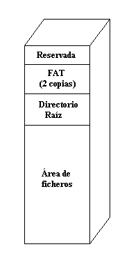

**Área Reservada:** También llamada sector de arranque o sector 0.

**FAT (Tabla de localización de ficheros):** es el lugar donde se indica la posición que ocupa cada uno de los espacios mínimos que se utilizan para guardar la información.

**Directorio Raíz:** se almacenan aquí todos los nombres y otros datos de los archivos y carpetas que hay en el directorio raíz.

**Área de ficheros:** el resto del elemento se utiliza como espacio para almacenar los archivos de usuario. Suele ser del orden del 98% del espacio total de almacenamiento, lo cual implica que las otras tres zonas ocupan muy poco espacio.

## ESTRUCTURA LÓGICA DE UN DISPOSITIVO DE ALMACENAMIENTO

# Unidades de disco flexible o disquete

El disco flexible, floppy o disquete es el soporte magnético que almacena permanentemente la información, de forma que el usuario pueda recuperarla en cualquier momento y trabajar con ella.

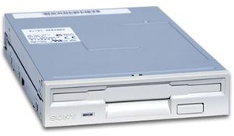Las unidades de discos flexibles o disqueteras son aquellas que leen/escriben la información contenida en los disquetes, los cuales son independientes de la unidad.

Los primeros disquetes hicieron su aparición en 1970, y pronto se convirtieron en el medio más utilizado para intercambiar información (dato e instrucciones) entre ordenadores. La complejidad de los programas y el tamaño de algunos archivos de bases de datos o imágenes, hizo que los disquetes fuesen insuficientes para esta tarea y, a mediados de la década de 1990, fueron progresivamente sustituidos por CD-ROM y otros dispositivos de almacenamiento.

El tamaño de los disquetes puede ser: de 8’’ de diámetro, con una capacidad de almacenamiento que varía entre 100 y 500 KBytes; de 5 ¼’’ pulgadas de diámetro, con capacidad entre 100 KBytes y 1,2 MBytes, y de 3 ½’’ pulgadas de diámetro, con capacidad entre 400 KBytes y 2,8 MBytes, aunque los más populares son de 1,44 MBytes. Los dos primeros son realmente discos flexibles, pero el tercero tiene la carcasa rígida.

Funcionamiento físico

Cuando se introduce un disquete de 3 ½’’en la unidad, este presiona contra un sistema de palancas. Su lámina metálica de protección se desplaza automáticamente para exponer el disco circular magnético que tiene en su interior. Otro movimiento de palancas y engranajes mueve dos cabezas de lectura/escritura hasta que casi tocan el disco por ambos lados. Las cabezas son electroimanes muy pequeños que utilizan impulsos magnéticos cambiar la orientación de las partículas magnéticas incorporadas en el revestimiento del disco.

El disco se pone a girar gracias a un motor eléctrico, por medio de un tope que se inserta en la muesca del centro del disco. Los circuitos de la unidad de disco reciben señales de la controladora incluyendo instrucciones e información para escribir en el disco. Estos circuitos traducen las instrucciones en señales que controlan el movimiento del disco y de las cabezas de lectura/escritura. Si esas señales incluyen instrucciones para escribir en el disco, se comprueba que no pasa ninguna luz a través de la ventana de protección contra escritura. Si la ventana está abierta y el rayo de un diodo emisor de luz puede ser detectado por un fotodiodo, la unidad sabe que el disco está protegido contra escritura y rehúsa registrar nueva información. Las cabezas se desplazan de delante hacia atrás gracias a un eje helicoidal arrastrado por un motor paso a paso. Este motor gira un cierto ángulo cada vez que recibe un impulso eléctrico. Cada impulso provoca un desplazamiento de las cabezas igual a la distancia de separación entre dos pistas. Cuando las cabezas están en la posición correcta, los impulsos eléctricos crean un campo magnético en una de las cabezas para escribir la información. Cuando las cabezas leen los datos del disco, reaccionan ante los campos magnéticos generados por las partículas magnéticas del disco.

Estructura física de un disquete

Un disquete de 3 ½’’ es un disco de un material llamado mylar (materia plástica) recubierto de una capa magnética. Contiene en su centro un núcleo metálico con un orificio que permite su giro.

El disco está situado en una cubierta de plástico rígido que le protege de los golpes, del polvo y de agresiones diversas. Esta cubierta posee una abertura en su entorno, que deja ver el núcleo. Otra abertura permite a la cabeza de lectura acceder a la superficie magnética. Esta está cerrada por una lámina metálica que posee también una abertura desfasada. Cuando se inserta el disquete en la disquetera, se desplaza la lámina de cierre en sentido lateral, para que su abertura coincida con la de la cubierta de plástico. Un muelle devuelve la lámina a su posición cuando se expulsa el disquete.

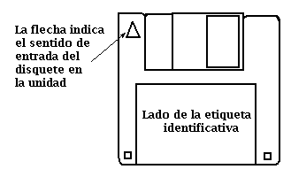

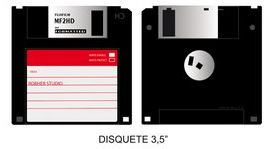

El disquete contiene igualmente uno o dos agujeros de forma cuadrada en el lado opuesto a la lámina. El de la derecha (visto desde el lado de la etiqueta) siempre existe y puede cerrarse impulsando un taquito de plástico. Cuando se cierra el agujero, puede leerse y escribirse en el disquete, pero cuando el agujero está libre es imposible escribir. Un disquete con un agujero está protegido contra escritura. El agujero del lado izquierdo sirve para indicar que se trata de un disquete de alta densidad, de 1,44 Mbytes. Los disquetes de 720 Kbytes de doble densidad no poseen este agujero.

Los datos se almacenan en el disco en círculos concéntricos llamados pistas, y cada una de esas pistas se divide en sectores de 512 bytes. El número total de sectores de un disco es:

Nº total de sectores = número de caras × número de pistas por cara × número de sectores por pista.

Los sectores que se encuentran en las pistas más cercanas al centro del disco son físicamente más pequeños que los sectores del exterior, sin embargo almacenan la misma cantidad de información, 512 bytes.

Dependiendo del tipo de disquete, tendrá un número u otro de pistas y sectores.

<table>
<tbody>
<tr>
<td rowspan="2">Parámetro</td>
<td colspan="5">Tamaño del disquete</td>
</tr>
<tr>
<td>720K (3 ½’’)</td>
<td>1,44MB (3 ½’’)</td>
<td>2,88MB (3 ½’’)</td>
<td>360K (5 ¼’’)</td>
<td>1,2MB (5 ¼’’)</td>
</tr>
<tr>
<td>Caras</td>
<td>2</td>
<td>2</td>
<td>2</td>
<td>2</td>
<td>2</td>
</tr>
<tr>
<td>Pistas/Caras</td>
<td>80</td>
<td>80</td>
<td>80</td>
<td>40</td>
<td>80</td>
</tr>
<tr>
<td>Sectores/Pistas</td>
<td>9</td>
<td>18</td>
<td>36</td>
<td>9</td>
<td>15</td>
</tr>
<tr>
<td>Bytes/Sector</td>
<td>512</td>
<td>512</td>
<td>512</td>
<td>512</td>
<td>512</td>
</tr>
<tr>
<td>TPI (pistas por pulgadas</td>
<td>135</td>
<td>135</td>
<td>135</td>
<td>48</td>
<td>96</td>
</tr>
<tr>
<td>Total sectores</td>
<td>1.440</td>
<td>2.880</td>
<td>5.760</td>
<td>720</td>
<td>2.400</td>
</tr>
<tr>
<td>Densidad</td>
<td>Doble</td>
<td>Alta</td>
<td>Extra</td>
<td>Doble</td>
<td>Alta</td>
</tr>
</tbody>
</table>

Capacidad = nº Caras × nº Pistas × nº Sectores/pista × 512 bytes.

Por ejemplo, un disquete de 3 ½’’ de alta densidad tiene 2 caras, 80 pistas y 18 sectores por pista, su capacidad será de 2×80×18×512 = 1.474.560 bytes = 1,406 Mbytes, aunque se indica de 1,44 Mbytes ya que se calcula como 1M = 1.024.000 bytes de forma incorrecta.

Las características más importantes de las disqueteras son: sensibilidad, alineación radial, histéresis, centrado de la sujeción, tangencia y velocidad de rotación, aunque los fabricantes no suelen incluir estos valores con las disqueteras (se supone que todas cumplen los criterios mínimos exigibles).

Unidades de disco rígido IDE

Los discos rígidos constituyen la unidad de almacenamiento principal de la computadora. En ellos se guardan una gran cantidad de datos y programas. Constituyen la memoria de almacenamiento masivo. Estos datos y programas no los puede procesar directamente el microprocesador, sino que en un paso previo deben ser transferidos a la memoria principal donde si se los puede manejar.

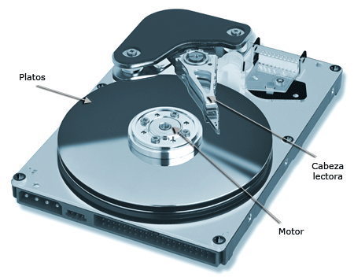

Las unidades de disco rígido contienen uno o más platos discos (platos) apilados sobre un eje central y aislados completamente del exterior.

Los elementos móviles de los discos rígidos están mucho mejor construidos que los de los disquetes, el sistema gira a más velocidad y los discos son de mayor densidad. Esto hace que la capacidad de los discos rígidos sea mucho mayor que la de los discos flexibles, pudiendo llegar a los 256 Gbytes y más en la actualidad. En la parte inferior del disco rígido hay una tarjeta de circuito impreso que recibe los comandos de la controladora de la placa base o tarjeta controladora, que es controlada por el sistema operativo. Esta tarjeta traduce esos comandos en variaciones de tensión que fuerzan el movimiento de las cabezas de lectura/ escritura a través de la superficie de los discos. La tarjeta también se asegura de que el eje de los discos tenga una velocidad constante e informa a la unidad de cuando leer y cuando escribir sobre el disco. En un disco IDE, el controlador de disco es parte integral de esta tarjeta.

Un eje conectado a un motor eléctrico, efectúa miles de giros por minuto (normalmente 4.500, aunque en discos duros más modernos llega a 7.200) en ocho capas como máximo, de platos magnéticos (lo normal 2 ó 3 platos). La cantidad de platos y la composición del revestimiento magnético determinan la capacidad de la unidad.

Una cabeza coloca y empuja el grupo de brazos o cabezales de lectura/escritura sobre las superficies de los platos con gran precisión. Alinea las cabezas y las pistas que están formadas por círculos concéntricos en la superficie de los platos.

Los cabezales de lectura/escritura incluidos a los extremos de los brazos en movimiento, se mueven al unísono a través de la superficie de los platos giratorios del disco rígido. Las cabezas escriben la información procedente del controlador de disco en los platos alineando las partículas magnéticas en la superficie de éstos; también leen la información detectando las polaridades de las partículas que ya fueron alineadas.

Cuando el usuario o el software pide al sistema operativo que lea o escriba un determinado sector del disco, el sistema operativo ordena a la controladora del disco rígido que mueva la cabeza de lectura/escritura sobre la pista que contiene ese sector. Los cabezales de lectura/escritura no tienen más que esperar que ese sector pase exactamente por debajo de ellos, para leer o escribir sobre él.

Estructura física

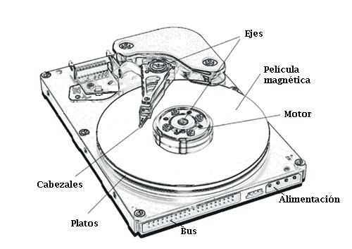

Un disco rígido está formado por una serie de discos o platos apilados unos sobre otro dentro de una carcasa impermeable al aire y al polvo. El diámetro de los platos oscila entre 2’’ (5 cm) y 5 ¼’’ (13,3 cm). Los más comunes son los platos de 3 ½’’ (8,9 cm)

Cada plato tiene dos caras. A cada cara le corresponde una cabeza de lectura/escritura, soportada por un brazo. En la práctica cada brazo situado entre dos platos contiene dos cabezas de lectura/escritura y a veces 3 en una cara.

La superficie de los platos se divide en pistas concéntricas numeradas desde la parte exterior empezando por la pista 0. Cuantas más pistas tenga un disco de una dimensión dada, más elevada será su densidad, y mayor será su capacidad.

Todas las cabezas de lectura/escritura se desplazan a la vez, por lo que es más rápido escribir en la misma pista de varios platos que llenar los platos unos después de otros. El conjunto de pistas del mismo número en los diferentes platos se denomina cilindro. Así por ejemplo, el cilindro 0 será el conjunto formado por la pista 0 de la cara 0, la pista 0 de la cara 1, la pista 0 de la cara 2, etc.

Por consiguiente, un disco rígido posee tantos cilindros como pistas hay en la cara de un plato.

Las pistas están divididas a su vez en sectores. El número de sectores por pista es variable desde 17 a más de 50. Estos sectores son de tamaño variable: los situados más cerca del centro son más pequeños que los del exterior, aunque almacenan sin embargo, la misma cantidad de datos: 512 bytes. La densidad de bits es mayor en los sectores internos que en los externos.

Un aumento de la capacidad de los discos poniendo más sectores en las pistas exteriores que en las interiores complicaría la organización de la información: Es más fácil controlar pistas que tienen todas un mismo número de sectores, que pistas en las que el número de sectores varía dependiendo de la posición de la pista.

La cabeza de lectura/escritura flota sobre la superficie del disco, no está en contacto físico. Es el desplazamiento de las capas de aire arrastradas por el movimiento de rotación de la superficie del disco el que provoca, por un fenómeno aerodinámico, el despegue de las cabezas y su colocación a una distancia de unas 0,5 micras por encima de la superficie.

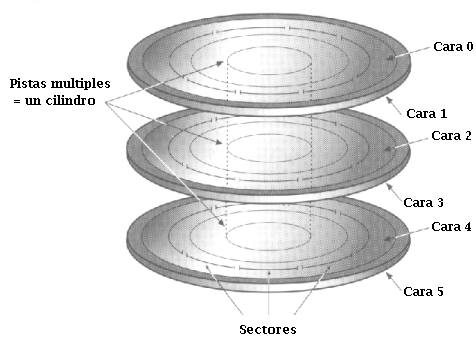

Durante el funcionamiento debe evitarse que se introduzca ninguna partícula de ninguna especie en el espacio situado entre el disco y la cabeza de lectura. Si una de esas partículas llegara a introducirse sufrirían daños importantes tanto la cabeza como la superficie del disco. Por este motivo los discos rígidos están protegidos con carcasas herméticas.

Otro problema importante con la cabeza de lectura/escritura es que cuando el disco no está en funcionamiento debe reposar sobre la superficie magnética. Se produce un despegue de la cabeza cuando se conecta la corriente y un aterrizaje cuando se interrumpe dicha corriente. Durante estas dos fases la cabeza roza la superficie del disco. Para evitar dañar las zonas que contienen datos, se reserva una pista especial para esta acción pegada al eje del disco, la que tiene el número más elevado, conocida como pista de aterrizaje (landing zone).

Las dos operaciones que realiza la cabeza de lectura/escritura son:

- **Escritura de datos:** los datos se escriben en la superficie del disco por medio de una corriente enviada al electroimán que porta la cabeza de lectura/escritura. Esta corriente produce un campo magnético que modifica la superficie del disco. Cuando el disco está virgen, no presenta particularidades magnéticas. Un impulso de corriente enviado al bobinado de la cabeza produce un campo magnético en el entrehierro del electroimán. El campo magnético imanta la superficie del disco formándose entonces un dipolo magnético, es decir, una zona que contiene, al igual que los imanes, un polo norte y un polo sur. Juntando dos dipolos se forma el elemento de la información que una computadora puede manejar, el bit, que puede tomar el valor 1 o el valor 0. Si el bit representa el valor binario 1, los dos dipolos magnéticos están alineados con direcciones opuestas. Si representa el valor 0, ambos dipolos magnéticos quedan alineados en la misma dirección.

- **Lectura de los datos:** la lectura de los datos se basa en el fenómeno inverso: una variación del campo magnético en las proximidades de un electroimán provoca la aparición de una corriente eléctrica en el bobinado de este. Los datos se escriben en el disco por impulsos de corriente. Su lectura provoca impulsos de la misma naturaleza. El desplazamiento de los dipolos que se encuentran en la superficie del disco con respecto a la cabeza de lectura produce una inversión del campo magnético. Esta inversión provoca la aparición de una corriente inducida en el bobinado. Esta corriente tendrá un sentido u otro según se haya leído un bit 0 o un bit 1. Conociendo el sentido de la corriente, el controlador del disco detecta si la cabeza de lectura pasa sobre un 0 o un 1.

Características técnicas de los discos rígidos

- **Velocidad de rotación:** está entre 5.400 rpm (revoluciones por minuto) y 7.200 rpm. Cuanto mayor sea esta velocidad, mayor será la velocidad de transferencia pero el disco y los circuitos se calentaran más.
- **Número de sectores por pista:** Cuanto mayor sea el número de sectores mayor será la capacidad del disco y más datos podrá leer en una vuelta.
- **Tiempo de búsqueda:** tiempo medio necesario para que las cabezas se posicionen en una pista determinada requerida. Se suele dar un tiempo medio. Cuanto menor sea el diámetro del disco, menor será el tiempo de búsqueda.
- **Tiempo de conmutación de cabezas:** es el tiempo medio que tarda el disco en conmutar para leer/escribir información con dos cabezas distintas.
- **Tiempo de conmutación de cilindros:** tiempo medio para mover las cabezas a la próxima pista para leer o escribir datos.
- **Latencia de rotación:** después de que la cabeza está posicionada sobre la pista, hay que esperar a que llegue el sector para leer o escribir en él. Este tiempo se denomina latencia de rotación y se mide en milisegundos. A mayor velocidad de giro, mayor latencia de rotación. Es típico una latencia de 4 ms a 7.200 rpm y de 6 ms a 5.400 rpm.
- **Tiempo de acceso a datos:** es la combinación del tiempo de búsqueda, tiempo de conmutación de cabezas y latencia de rotación medido en ms.
- **Caché:** los discos rígidos modernos disponen de una memoria intermedia donde precargan datos del disco para enviarlos a memoria cuando los pida el sistema, sin tener que leerlos del disco físico. La cantidad de caché es variable de unos discos a otros.

Grabación magnética de la información

Para grabar la información en el disco hay que codificarla para escribirla y decodificarla para leerla. Lo que persigue una buena técnica de codificación es manejar una misma información con un mínimo número de pulsos, y una serie de no pulsos no muy grande.

Fundamentalmente hay tres técnicas de grabación magnéticas de la información

- **Codificación FM** (Frecuency Modulation – modulación en frecuencia). Cada bit de información se codifica con dos pulsos: el 1 se codifica con dos cambios de flujo seguidos (dos pulsos), y el 0 con un pulso seguido de un no pulso. La codificación FM es un sistema de codificación simple utilizado por los primeros discos flexibles, pero que hoy en día no se usa.
- **Codificación MFM** (Modified Frecuency Modulation – modulación en frecuencia modificada). Esta codificación es empleada por los discos flexibles y por los primeros discos rígidos. MFM codifica los 1 con un no pulso seguido de un pulso, y los 0 los diferencia entre los que están precedidos por un cero y los que están precedidos por un 1. Los primeros los codifica PN (P = pulso N = no pulso), y los segundos con NN. Los discos rígidos que utilizan la codificación MFM tienen 17 sectores por pista.
- **Codificación RLL** (Run Length Limited – ejecución de longitud limitada). La codificación RLL fue desarrollada para conseguir mayores densidades de almacenamiento de información. Pudiéndose almacenar hasta un 50% más de información que con el procedimiento MFM en un mismo disco, necesitando solo tres pulsos, donde FM necesitaba 9 y MFM necesitaba 4. Esta complicada codificación es lo suficientemente segura como para formatear los discos duros con 26 sectores por pistas. El sistema RLL es empleado comúnmente por muchos de los discos rígidos. Una versión de la codificación RLL, es la llamada ARLL o ERLL (RLL avanzada), la cual consigue más de 26 sectores por pista (33, 34 o 51) y es la que fundamentalmente se utiliza actualmente, en la que los discos rígidos suelen tener 63 sectores/pista.

Lectores de CD-ROM/DVD IDE ATAPI

El disco CD-ROM

Las unidades CD-ROM (Compact Disk ROM) son capaces de leer la información contenida en unos discos compactos o compact disc, idénticos en aspecto físico a los CD de música. Estas unidades permiten leer información del disco, pero no pueden modificarla. Están formadas por un láser y un mecanismo de control asociado.

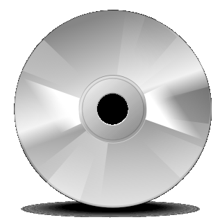

El disco CD-ROM, al igual que el compact disc, es un plato de plástico, con una fina capa de aluminio y otra capa de plástico par protección. La forma de almacenas la información difiere bastante a la utilizada en los discos rígidos. Hay una pista en espiral de unos 6 Km de longitud que se divide en sectores de 2.352 bytes. Cada disco contiene 270.000 sectores, lo que da una capacidad total de 605,62 Mbytes. El sector es la mínima unidad direccionable.

Cada sector se compone de 98 cuadros. Cada cuadro contiene 24 bytes de datos, 27 bits de sincronismo, un bit de control y 8 bytes de detección y corrección de errores. Los bytes de datos se codifican mediante el código Reed-Solomon (que extiende los 8 bits a 14), obteniendo un flujo de datos listo para su grabación en el CD-ROM. Sólo se graban las transiciones de 0 a 1 del flujo de datos. Al final, cada byte se codifica en 17 bites (y no en 14) ya que hay que añadir 3 bits de guarda (entre byte y byte).

Al contrario que en un disquete o disco rígido, un disco compacto no está dividido en cilindros. Los datos están todos situados en la misma pista enrollada en espiral y los sectores se encuentran unos detrás de otros. Todos ellos poseen el mismo tamaño, lo que implica que la velocidad de rotación debe variar de forma continua cuando la cabeza de lectura se desplaza desde la periferia hacia el centro. Su velocidad de giro varía entre 400 revoluciones por minuto en el exterior del disco y las 1.000 revoluciones por minuto en el interior del mismo.

La característica fundamental del CD-ROM es que permite almacenar en un disco gran cantidad de información, hasta 654 Mbytes, lo cual necesitaría 455 discos flexibles de 1,44 Mbytes. Un disco normal de música puede contener hasta 74 minutos de grabación, almacenados en 680 Mbytes de información general.

Las características de grabación del disco CD vienen establecidas por el estándar CD-DA consignado en el libro rojo publicado por la ISO (Internacional Standard Organization):

- Diámetro exterior: 120 mm.
- Espesor: 1,2 mm.
- Masa de 14 a 33 g.
- Sentido de rotación: horario (cuando el movimiento del disco se observa desde arriba, por la cara serigrafiada).
- Velocidad de rotación: de 1,2 m/s a 1,4 m/s, aproximadamente. La velocidad lineal de lectura es constante y permite obtener un flujo de información de audio digital de 176.000 bytes/s. La grabación se lee empezando por la pista situada más hacia el centro del disco. La primera área ubicada en el centro del disco contiene el índice, también llamado TOC (Table Of Contens) o directorio. Para poder reproducir el disco, el lector obligatoriamente debe haber leído con anterioridad este directorio.
- El tiempo máximo de reproducción es de 74 minutos (también hay discos de 80 minutos), es decir, equivalente a una capacidad de 640 Mbytes, que se corresponde con la información de audio digital. A éste, hay que añadir 360 Kbytes, utilizados para información de servicio y de sistema.
- La profundidad de impresión de grabado es de 0,13 µm. El diámetro del punto de luz (spot) láser es de aproximadamente 1 µm.

El estándar CD-ROM ha sido desarrollado a partir del estándar CD-DA (compact disc – digital audio). La estructura del CD-ROM se describe en el libro amarillo, publicado por la ISO en 1985. Está pensado para el almacenamiento y archivo de datos, soporta una arquitectura de tipo informático que permite un rápido acceso a un dato concreto. Los registros también están organizados en sectores. Cada sector está formado por 2.352 bytes, organizados según uno de los siguientes modos:

- **Modo 1:** esta organización de datos está adaptada a la grabación de programas informáticos o de texto. Si se cuela un error durante la grabación, el byte en fallo no puede ser recuperado por interpolación. La garantía en la veracidad de los datos útiles debe ser máxima. Por esta razón, se disminuye la velocidad de transferencia de los datos útiles. La capacidad del disco en este modo es de 650 Mbytes.
- **Modo 2:** los sectores grabados están peor protegidos contra cierto tipo de errores: así, la velocidad de transferencia de datos útiles es mayor, pero puede incluir algún error. Éste modo se aplica a la grabación de datos de audio y video. Capacidad del disco 742 Mbytes.

En 1989, el estándar CD-ROM se amplió para incluir los multimedias, dando origen al CD-ROM XA. Éste es un CD-ROM que funciona en modo 2.

El estándar CD-ROM XA permite la grabación del disco en varias secuencias, independientes unas de otras. De esta forma, es posible añadir nuevos ficheros mientras no se alcance el limite máximo de capacidad. Se dice que este disco es multisesión. Existen tantas TOC como sesiones haya en el disco.

Aunque los discos ópticos más extendidos son los discos compactos CD de música y los CD-ROM de datos, en realidad existe toda una amplia gama de tipos de discos y normativas que intentan cubrir un amplio campo de aplicaciones. Las especificaciones de cada tipo de disco CD están recogidas en una serie de libros publicados por la ISO.

El lector de CD-ROM

Las unidades de CD-ROM tienen un motor que varía constantemente la velocidad con la que gira un disco CD-ROM. También tienen una cabeza de lectura por un diodo que emite un rayo láser y un detector de luminosidad que sirve de receptor. Esta cabeza va corriendo la pista helicoidal del disco detectando las reflexiones de luz que se producen al pasar por una hendidura de la superficie del disco, o bien la falta de reflexión cuando pasa por una zona sin hendidura.

En presencia de una hendidura, el ángulo de incidencia del rayo varía, este es desviado y alcanza el receptor. El circuito electrónico del lector interpreta esta variación de radiación como un 1. Cuando no hay hendidura, el rayo no se desvía y no llega al receptor, interpretándose como un 0.

Cada marca, cada hendidura, consiste en una pequeña perforación de tan sólo un micra de ancho, consiguiéndose densidades lineales de 1.500 bits por pulgada, o lo que es lo mismo, aproximadamente 590 bits por centímetro.

Así, es posible leer los datos de forma continua (lo que es indispensable para los CD de audio). Por el contrario, el acceso a datos que se encuentren en el centro del disco requiere una búsqueda que puede llevar cierto tiempo.

Los lectores de CD-ROM tienen una velocidad lineal constante (a diferencia de los magnéticos que tienen una velocidad angular constante) de 153,60 Kbits/s. Ésta es la velocidad básica 1x, pero ha ido en aumento: 2x, 4x,…, 12x,…, 40x, etc.

Al ser velocidad lineal, la velocidad de rotación disminuye conforme nos alejamos del centro del disco. Ésta es una de las razones por la que los CD-ROM es más lento, ya que la variación de velocidad consume un tiempo. Además, es mucho más complicado encontrar un sector a lo largo de una espiral de 6 km que encontrarlo en un medio elegante y limpiamente dividido en pistas y sectores. El tiempo de acceso es de unos 200 a 300 ms.

El inconveniente de los lectores de CD-ROM es su baja velocidad de acceso. Las unidades de CD-ROM más rápidas pueden tener un tiempo de acceso del orden de 100 milisegundos, mientras que las más lentas llegan a los 1.500 milisegundos. Un disco rígido puede tener un tiempo de acceso del orden de 15 milisegundos, y un disco flexible del orden de 150 milisegundos.

En cuanto a velocidad de transferencia de información, ésta varía entre los 150 Kbytes por segundo para las unidades de velocidad sencilla (1x), 300 Kbytes para las unidades de doble velocidad (2x), 600 Kbytes para las de cuádruple, y así sucesivamente según la fórmula 150 × N, siendo N el multiplicador de transferencia del CD-ROM, y que distingue a los distintos lectores de CD-ROM en el mercado a nivel comercial.

Los lectores también tienen una caché o buffer para acelerar el acceso a los datos del disco.

El lector de CD-ROM contiene en su cara delantera: un botón para ordenar la inserción y extracción del disco. Eventualmente contendrá también una toma para auriculares, una rueda o dos pulsadores para ajustar el volumen, una lámpara de indicación de lectura del disco, la bandeja portadiscos y en los casos actuales el botón de play y de paso a la siguiente canción. Los lectores de CD-ROM permiten leer discos de audio. Para ello será necesario disponer del software adecuado o del botón de play en el panel frontal.

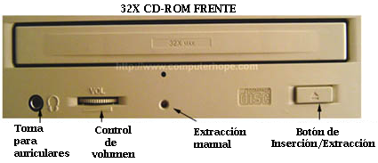

El lector de DVD

El DVD (disco versátil digital, también conocido al principio como vídeo disco digital), es un disco que aumenta la capacidad del disco CD-ROM y admite características añadidas.

Desde el nacimiento de la televisión, la señal de vídeo ha sido analógica. Este tipo de señales son difíciles de transmitir y almacenar, más aún, la tecnología digítal de los ordenadores tiene ciertas dificultades para tratar las señales analógicas.

El DVD es el primer medio diseñado para la distribución de vídeo digital. El vídeo digital puede ser almacenado y distribuido de forma más barata que el analógico y puede ser almacenado sobre soportes de acceso aleatorio (como discos magnéticos u ópticos), permitiendo aplicaciones interactivas.

El soporte empleado en DVD es óptico, con una densidad de información mayor que el CD normal, permitiendo por ejemplo, la grabación de hasta 9 horas de video de alta calidad con sonido envolvente multicanal, y de 30 horas de audio de calidad similar al CD. Esta alta capacidad para almacenar información ha hecho el DVD muy atractivo para la industria del PC, y cada día están apareciendo nuevas aplicaciones.

Las características principales del DVD son:

- **Capacidad de almacenamiento:** de hasta 17 Gbytes de datos. Un DVD-ROM de simple cara y una capa tendrá una capacidad de 4,7 Gbytes, lo cual es siete veces la capacidad de un CD-ROM normal; un DVD de doble capa dispondrá de 8,5 Gbytes. Doble cara con doble capa implica una capacidad de hasta 17 Gbytes. (Una película de 135 minutos se puede almacenar en un DVD de una capa, y por lo tanto serán los más comunes.)
- **La velocidad de reproducción:** es de aproximadamente 10,7 Mbits/s.
- **La naturaleza digital:** lo que permite a este medio muchas más facilidades que el procesamiento analógico, como interactividad, soporte para múltiples idiomas simultáneamente, control de contenidos, múltiples ángulos de cámara, pago por visión, etc.
- **La capacidad de vídeo y audio ofrecida:** basada en vídeo digital MPEG-25 (Motion Picture Expert Group – grupo de expertos para imagen en movimiento) y Dolby AC3 o MPEG-2 para audio (sonido envolvente de alta calidad), es muy superior a la de otros sistemas actuales.
- **Otros sistemas de difusión de vídeo:** como difusión directa por satélite y TV por cable utilizan la misma tecnología digital que el DVD, siendo previsible su convergencia.
- **Considerable mejora en calidad:** teniendo en cuenta sistemas como el VHS con 320 píxeles por línea horizontal, frente 720 de los sistemas actuales de reproducción.
- **Capacidad de reproducción de películas en varios formatos:** (4:3), (16:9) y (20:9).
- **Control de reproducción:** permitiendo la reproducción o no de ciertas escenas según la introducción de ciertos códigos.

La gran capacidad del DVD se consigue haciendo los “pits” (agujeros en el CD) más pequeños, la pista más estrecha y grabando los datos en varias capas, hasta dos capas por cada cara. El agujero en el disco DVD puede tener un tamaño de 0,4 µm y el espaciado entre pistas de 0,47µm.

Los láseres requeridos deben tener una longitud de onda más corta (650 a 635 mm (109 m) frente a los 780 mm del CD) y mecanismos de enfoque más precisos que el CD. Para leer la segunda capa el haz se enfoca con un poco más de profundidad.

El panel frontal de un lector de DVD-ROM es similar al de los lectores de CD-ROM, aunque cambia el CD por un DVD, e incluso hay modelos que no llevan bandeja de inserción del disco, sino que es aspirado como en algunos lectores de CD audio.

##### Otros Dispositivos de almacenamiento

###### Unidad LS-120 o Superdisk

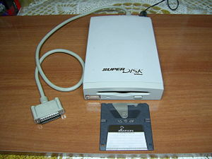El **SuperDisk**, también conocido como el **LS-120** y su posterior variante el **LS-240**, es un dispositivo de almacenamiento desarrollado por la división de almacenamiento de [3M](http://es.wikipedia.org/wiki/3M), posteriormente conocida como [Imation](http://es.wikipedia.org/wiki/Imation), y lanzado en [1997](http://es.wikipedia.org/wiki/1997) como una alternativa de alta capacidad y velocidad a los [disquetes](http://es.wikipedia.org/wiki/Disquete) de 3,5 y 1.44 [MB](http://es.wikipedia.org/wiki/Megabyte). Las unidades SuperDisk son capaces de leer y escribir disquetes de 1,44 y 720 en formato [MFM](http://es.wikipedia.org/w/index.php?title=MFM&action=edit&redlink=1) (Modified Frequency Modulation, lo que excluye, por ejemplo, los discos del [Apple Macintosh](http://es.wikipedia.org/wiki/Apple_Macintosh) de doble densidad ) además de sus formatos nativos. Las unidades LS-240 son capaces además de formatear los discos de alta densidad (HD) a mayores capacidades.

La verdadera capacidad de las unidades de "120 MB" es de 120,375 [MB](http://es.wikipedia.org/wiki/Mebibyte) (6848 cilindros x 36 bloques/cilindro x 512 bytes[\[](/C:/Documents%20and%20Settings/Frankus/Escritorio/Arquitectura2/#cite_note-0)[1](/C:/Documents%20and%20Settings/Frankus/Escritorio/Arquitectura2/#cite_note-0)[\]](/C:/Documents%20and%20Settings/Frankus/Escritorio/Arquitectura2/#cite_note-0) ). Las unidades de "240 MB" tiene una capacidad de 240,75 MB.

El diseño del sistema SuperDisk proviene de un proyecto de [Iomega](http://es.wikipedia.org/wiki/Iomega) de principios de los 90. Es uno de los últimos ejemplo de la tecnología [Floptical](http://es.wikipedia.org/wiki/Floptical) en la que, mediante [lasers](http://es.wikipedia.org/wiki/Laser) se guiaba a una cabeza lectograbadora magnética mucho más pequeña que la de los [disquetes](http://es.wikipedia.org/wiki/Disquete) tradicionales. Iomega abandonó el proyecto en las fecha en que lanzó el [Iomega Zip](http://es.wikipedia.org/wiki/Iomega_Zip) en [1994](http://es.wikipedia.org/wiki/1994). La idea acabó eventualmente en 3M, donde se refina el concepto y se licencia el concepto a varios de los mayores fabricantes de unidades de disquete como [Matsushita](http://es.wikipedia.org/wiki/Matsushita) (Panasonic) y [Mitsubishi](http://es.wikipedia.org/wiki/Mitsubishi). Otras compañías involucradas en el desarrollo del SuperDisk fueron [Compaq](http://es.wikipedia.org/wiki/Compaq) y [OR Technology](http://es.wikipedia.org/w/index.php?title=OR_Technology&action=edit&redlink=1).

Imation vendió principalmente unidades fabricadas por Matsushita bajo la marca SuperDisk; otras compañías prefirieron usar el nombre LS-120, y utilizaron unidades Mitsubishi. Sin embargo el sistema no alcanzó gran éxito. Pocos [OEMs](http://es.wikipedia.org/wiki/OEM) lo soportaron, aparte de Compaq y [Dell](http://es.wikipedia.org/wiki/Dell). Muchas unidades SuperDisk sufrieron problemas de rendimiento lento y fiabilidad. La mayor dificultad que encontró fue el éxito del [Iomega Zip](http://es.wikipedia.org/wiki/Iomega_Zip) que ya llevaba 3 años en el mercado. Tenía la suficiente popularidad para provocar falta de interés del público en el SuperDisk pese a su diseño superior y la compatibilidad con el disquete estándar. No obstante alcanza la suficiente popularidad para que varias [BIOS](http://es.wikipedia.org/wiki/BIOS) comiencen a incluirlo como dispositivo de arranque, incluso antes que al ZIP.

Antes del 2000, toda la categoría de discos removibles quedan obsoletos debido al desplome de los precios de las unidades y consumibles [CD-R](http://es.wikipedia.org/wiki/CD-R) y [CD-RW](http://es.wikipedia.org/wiki/CD-RW), y con posterioridad a [2006](http://es.wikipedia.org/wiki/2006), de las unidades de [disco de estado sólido](http://es.wikipedia.org/wiki/Disco_de_estado_sólido) (Pendrives de [Memoria USB](http://es.wikipedia.org/wiki/Memoria_USB) y los diferentes formatos de [tarjetas de memoria Flash](http://es.wikipedia.org/wiki/Tarjeta_de_memoria)). El SuperDisk ha sido descatalogado y hoy en día es difícil de encontrar unidades y consumibles, con la excepción de sitios de subastas como [eBay](http://es.wikipedia.org/wiki/EBay).

Unidad Zip

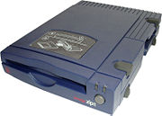El **Iomega Zip** (también llamado unidad Zip o disco Zip) es una [unidad de almacenamiento masiva](http://es.wikipedia.org/wiki/Unidad_de_disco) extraíble de media capacidad, lanzada por [Iomega](http://es.wikipedia.org/wiki/Iomega) en [1994](http://es.wikipedia.org/wiki/1994). La primera versión tenía una capacidad de 100 [MB](http://es.wikipedia.org/wiki/Megabyte), pero versiones posteriores lo ampliaron a 250 y 750 MB.

Se convirtió en el más popular candidato a suceder al [disquete](http://es.wikipedia.org/wiki/Disquete) de 3,5 [pulgadas](http://es.wikipedia.org/wiki/Pulgada), seguido por el [SuperDisk](http://es.wikipedia.org/wiki/SuperDisk). Aunque nunca logró conseguirlo, sustituyó a la mayoría de medios extraíbles como los 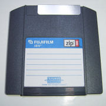[SyQuest](http://es.wikipedia.org/w/index.php?title=SyQuest&action=edit&redlink=1) y robó parte del terreno del [Disco magneto-óptico](http://es.wikipedia.org/wiki/Disco_magneto-óptico) al ser integrado de serie en varias configuraciones de [portátiles](http://es.wikipedia.org/wiki/Ordenador_portátil) y [Apple Macintosh](http://es.wikipedia.org/wiki/Apple_Macintosh).

La caída de precios de grabadoras y consumibles [CD-R](http://es.wikipedia.org/wiki/CD-R) y [CD-RW](http://es.wikipedia.org/wiki/CD-RW) y, sobre todo de los [pendrives](http://es.wikipedia.org/wiki/Memoria_USB) y las [tarjetas flash](http://es.wikipedia.org/wiki/Tarjeta_de_memoria) (que sí han logrado sustituir al disquete), acabaron por sacarlo del mercado y del uso cotidiano.

El disco Zip se basa en el mismo principio que el [Iomega Bernoulli Box](http://es.wikipedia.org/wiki/Iomega_Bernoulli_Box); en ambos casos, un sistema de cabezas de lectura/escritura montado en un [actuador](http://es.wikipedia.org/wiki/Actuador) linear que sobrevuela un disco de polímero similar a un [disquete](http://es.wikipedia.org/wiki/Disquete) que gira rápidamente en el interior de una carcasa rígida. El actuador linear utiliza la tecnología de la [Bobina de voz](http://es.wikipedia.org/wiki/Bobina_de_voz), relacionada con los modernos [discos duros](http://es.wikipedia.org/wiki/Disco_duro). El disco Zip tiene un tamaño de 9 centímetros (3,5 [pulgadas](http://es.wikipedia.org/wiki/Pulgada)) en lugar del tamaño similar al de un [CD-ROM](http://es.wikipedia.org/wiki/CD-ROM) del Bernoulli, y un diseño simplificado de la unidad lectograbadora que redujo su coste total.

Esto dio lugar a un disco que tiene el mismo tamaño de un disquete, pero es capaz de almacenar mucha más información, con un rendimiento mucho más rápido que el disquete estándar. Sin embargo no es competencia directa del [disco duro](http://es.wikipedia.org/wiki/Disco_duro). La unidad Zip 100 tiene una [tasa de transferencia](http://es.wikipedia.org/wiki/Tasa_de_transferencia) de cerca de 1 [megabyte](http://es.wikipedia.org/wiki/Megabyte)/segundo y un [tiempo de búsqueda](http://es.wikipedia.org/wiki/Tiempo_de_búsqueda) de 28 [milisegundos](http://es.wikipedia.org/wiki/Milisegundo) de promedio. En comparación un [disquete](http://es.wikipedia.org/wiki/Disquete) estándar de 1,44 MB tiene 500 [kbit/s](http://es.wikipedia.org/wiki/Bit_rate) (62,5 KB/s) de ratio y varios cientos de milisegundos de tiempo de búsqueda. Un disco de hoy en día con 7200 RPM tiene un tiempo de búsqueda de 8,5–9 ms.

La primera generación de discos Zip tuvo que competir con el [SuperDisk](http://es.wikipedia.org/wiki/SuperDisk), que almacena un 20% más de datos y puede leer/escribir discos estándar de 3,5 y 1,44 MB, pero tiene una menor velocidad de transferencia debido a una menor velocidad de rotación. La rivalidad duró hasta la llegada de la era USB.

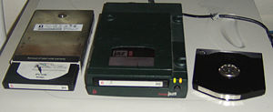Unidad Jaz

La **Iomega Jaz** es un sistema de almacenamiento masivo removible creado por [Iomega](http://es.wikipedia.org/wiki/Iomega) y lanzado inicialmente en [1997](http://es.wikipedia.org/wiki/1997). En la actualidad ha sido descatalogado, aunque su tecnología se usa en las unidades [Iomega REV](http://es.wikipedia.org/w/index.php?title=Iomega_REV&action=edit&redlink=1).

Existen dos versiones de la unidad, la inicial con una capacidad de 1 GB, y una versión revisada con una capacidad de 2 GB. En ambos casos son un aumento significativo sobre el producto estrella de Iomega, la [Iomega Zip](http://es.wikipedia.org/wiki/Iomega_Zip), por entonces con una capacidad de 100 MB. A diferencia de este último, que usa una variante de la tecnología del [disquete](http://es.wikipedia.org/wiki/Disquete), la Jaz utiliza tecnología de [disco duro](http://es.wikipedia.org/wiki/Disco_duro). Esencialmente consta de dos platos de disco en un cartucho removible, con el motor y las cabezas magnéticas en la unidad lectograbadora. Al introducirse el cartucho se retiraba la protección metálica por donde accedían las cabezas.

Utiliza una interfaz [SCSI](http://es.wikipedia.org/wiki/SCSI) y se comercializa como unidad interna de 3,5 pulgadas (de serie viene con un adaptador a 5,25) o como unidad externa (8,0 x 5,33 x 1,5 [pulgadas](http://es.wikipedia.org/wiki/Pulgada) y 2 libras de peso). Iomega comercializar además varios productos complementarios :

- [**Iomega Jaz Traveller**](http://es.wikipedia.org/w/index.php?title=Iomega_Jaz_Traveller&action=edit&redlink=1) adaptador de SCSI a [puerto paralelo](http://es.wikipedia.org/wiki/Puerto_paralelo), pensado principalmente para su uso con un [ordenador portátil](http://es.wikipedia.org/wiki/Ordenador_portátil)
- [**Iomega Jaz Jet PCI**](http://es.wikipedia.org/w/index.php?title=Iomega_Jaz_Jet_PCI&action=edit&redlink=1) tarjeta controladora [Ultra SCSI](http://es.wikipedia.org/w/index.php?title=Ultra_SCSI&action=edit&redlink=1) [PCI](http://es.wikipedia.org/wiki/PCI), con la ventaja de que puede usarse en un PC o un Mac sin problemas de drivers.
- [**Iomega Jaz Jet ISA**](http://es.wikipedia.org/w/index.php?title=Iomega_Jaz_Jet_ISA&action=edit&redlink=1) tarjeta controladora Fast [SCSI](http://es.wikipedia.org/wiki/SCSI) [ISA](http://es.wikipedia.org/wiki/ISA)
- [**Iomega Jaz Card PCMCIA**](http://es.wikipedia.org/w/index.php?title=Iomega_Jaz_Card_PCMCIA&action=edit&redlink=1) tarjeta [PCMCIA](http://es.wikipedia.org/wiki/PCMCIA) Tipo II controladora SCSI
- [**Iomega Jaz USB**](http://es.wikipedia.org/w/index.php?title=Iomega_Jaz_USB&action=edit&redlink=1) cable adaptador [USB](http://es.wikipedia.org/wiki/USB) a [SCSI](http://es.wikipedia.org/wiki/SCSI)
- Con posterioridad, lanzará cables adaptadores SCSI-[USB](http://es.wikipedia.org/wiki/USB) y SCSI-[FireWire](http://es.wikipedia.org/wiki/FireWire)

Las cifras de la Jaz sencillamente casi no pueden distinguirse de las de un disco duro estándar de la época, debido a la tecnología empleada. Dispone internamente de una caché de 215 KB para lectura/escritura, los tiempos de búsqueda son de 10 ms para lectura, 12 ms para escritura y entre 15,5 y 17,5 ms para acceso. La transferencia de datos es :

- Máxima sostenida : 8,7 MB/segundo
- Normal sostenida : 7,35 MB/segundo
- Mínima sostenida : 3,4 - 8,7 MB/segundo
- Modo burst : 20MB/s

Sin embargo la Jaz nunca obtiene la penetración en el mercado ni el éxito de la ZIP. A esto contribuye el alto precio inicial (es más económico comprar un disco duro de igual capacidad que la unidad + consumible, y sólo se obtiene ventaja cuando hablamos de 3 o más cartuchos), el desplome de los precios de consumibles y lectograbadoras [CD-R](http://es.wikipedia.org/wiki/CD-R) y [CD-RW](http://es.wikipedia.org/wiki/CD-RW) y la escalada de capacidad y velocidad de los discos [IDE](http://es.wikipedia.org/wiki/IDE). Sólo ofrece atractivo para el mercado empresarial, principalmente para copias de seguridad y clonado de servidores, pero al subir la capacidad de los discos duros acaban relegados de ese mercado.

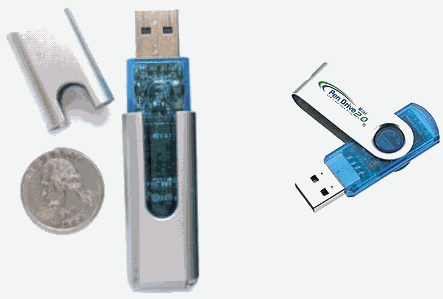Pen Drive o Memory Flash:

Es un pequeño dispositivo de almacenamiento que utiliza la memoria flash para guardar la información sin necesidad de [pilas](http://www.monografias.com/trabajos11/pila/pila.shtml). Los Pen Drive son resistentes a los rasguños y al polvo que han afectado a las formas previas de almacenamiento portable, como los CD y los disquetes. Los sistemas operativos más modernos pueden leer y escribir en ello sin necesidad de controladores especiales. En los equipos antiguos (como por ejemplo los equipados con [Windows 98](http://es.wikipedia.org/wiki/Windows_98/oWindows%2098)) se necesita instalar un controlador de dispositivo.

Pc Cards

 La norma de PCMCIA es la que define a las PC Cards. Las PC Cards pueden ser almacenamiento o tarjetas de I/O. Estas son compactas, muy fiable, y ligeras haciéndolos ideal para notebooks, palmtop, handheld y los PDAs,. Debido a su pequeño tamaño, son usadas para el almacenamiento de datos,   aplicaciones,  tarjetas de memoria, cámaras electrónicas y  teléfonos celulares. Las PC Cards tienen el tamaño de una tarjeta del [crédito](http://www.monografias.com/trabajos15/financiamiento/financiamiento.shtml), pero su espesor varía. La norma de PCMCIA define tres PC Cards diferentes: Tipo I  3.3 milímetros (mm) de espesor, Tipo II son 5.0 mm espesor, y Tipo III son 10.5 mm espesor.

El monitor

Generalidades

El monitor es una de las partes más importantes de la computadora, ya que es el primer medio por el que el usuario conoce los resultados de su trabajo. El monitor se conecta a la tarjeta gráfica, estando dicha tarjeta integrada en la placa base, o conectada a un bus de expansión, actualmente PCI, AGP o PCI Express.

Los monitores de las computadoras funcionan de manera muy parecida a como lo hacen los televisores, aunque hay una diferencia sustancial, y es que en los receptores de TV, las señales de color y sincronización van juntas en la misma señal, mientras que en un monitor van por separado.

En los monitores, la imagen en la pantalla está formada por un grupo de líneas horizontales que se van explorando secuencialmente. Un haz de electrones barre cada línea de la pantalla sucesivamente de izquierda a derecha desde la parte superior izquierda. A medida que el haz barre cada línea, el color y brillo de cada uno de los cientos de puntos que componen la pantalla (píxels) se modifican por la información suministrada por la tarjeta gráfica hasta formar una imagen coherente procedente de dicha tarjeta. Esta imagen de vídeo se refresca de una cíclica, a una frecuencia que envía la tarjeta gráfica.

Una vez que el haz de electrones ha barrido todas las líneas horizontales, la señal de activación de pantalla se sitúa en “off” (no aparece nada en pantalla), y el controlador del tubo de rayos catódicos genera una señal de **sincronismo vertical**, que le dice al monitor que desvíe el haz de electrones desde el final de la pantalla hacia el borde superior izquierdo.

El *tamaño del punto* representa la distancia en milímetros entre cada uno de los puntos luminiscentes que forman los píxels. De acuerdo con esto, cuanto más pequeño sea el tamaño del punto más nitidez alcanzará la imagen del monitor. Un tamaño de 0,28 mm se considera bastante apropiado para la mayoría de los monitores, pero tener en cuenta que si se desminuye esta medida se conseguirá mayor claridad en definición de imagen.

La frecuencia de barrido horizontal es el número de líneas por segundo que la tarjeta gráfica envía al monitor.

Por ejemplo, una pantalla VGA está formada por 480 líneas (640 × 480 píxels), mostrándose 60 pantallas por segundo (frecuencia de refresco), lo que quiere decir que la tarjeta gráfica tiene que enviar al monitor 60 × 480 = 28.800 líneas por segundo: La frecuencia de barrido horizontal sería en este caso 28.800 líneas, o sea 28.800 Hz o 28,8 Khz. Sin embargo, el monitor tiene algunas líneas que no pueden ser vistas, lo que hace que un monitor VGA tenga una frecuencia de barrido horizontal de 31,5 Khz. El número de líneas que no son vistas depende del modo de vídeo.

Una pantalla CGA tiene una frecuencia de barrido horizontal de 15,8 Khz, y una pantalla EGA, de 21,8 Khz.

La frecuencia de barrido vertical o frecuencia de refresco es el número de veces que se forma la pantalla en un segundo. Esta formación de imagen puede ser entrelazada o no entrelazada. Si es entrelazada, se barren primero todas las líneas impares y luego todas las pares; en caso de no entrelazada se barren todas las líneas seguidas.

El ojo humano es capaz de registrar del orden de 25 imágenes por segundo; de hecho, esas son las imágenes por segundo que muestra un receptor de televisión.

La frecuencia de barrido vertical de un monitor de un PC varía entre 50 y 70 veces por segundo, es decir, entre 50 y 70 Hz.

La imagen de la pantalla está formada por una serie de puntos o píxels. En los monitores a color cada uno de estos puntos o píxels está formado por una triada muy pequeña de puntos luminiscentes rojo, verde y azul, o por tres franjas de los mismos colores. Por ello en los monitores a color el haz de electrones está formado en realidad por tres haces, cada uno de los cuales ilumina uno de esos tres puntos luminiscentes. Para no mezclar entre sí cada uno de estos puntos y conseguir una imagen lo más nítida posible, en el interior de la pantalla del monitor existe una rejilla perforada llamada rejilla de potencial o mascara de sombra.

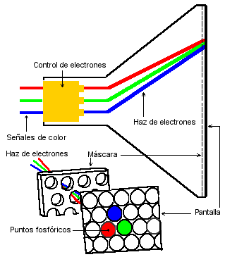

Cada perforación de la mascara coincidirá con cada una de las triadas de puntos de la imagen (cada punto de la imagen está formado por tres colores, rojo-verde-azul), y por lo tanto, cuanto más separadas estén unas perforaciones de otras, menos precisa resultará la imagen que se forme, y menor definición tendrá el monitor. Dicho de otra forma, cuanto menos distancia exista entre los centros de las perforaciones, mayor resolución admitirá el monitor con una misma nitidez. La resolución de un monitor es el número de puntos o píxels en que se divide la pantalla.

Por otro lado, cuanto más grande sea el monitor, más separación admitirá entre los centros de las perforaciones sin sacrificar la resolución. A esta separación se le llama dot pitch (separación de puntos).

Existen en la actualidad dos tipos de monitores VGA en cuanto a su rejilla de potencial: de 0,28 y de 0,26 mm de separación de centros.

El tamaño del monitor, la resolución de trabajo y la rejilla de potencial idóneos están relacionados entre sí. Para un monitor de 14 pulgadas y una resolución de 640 × 480 puntos es suficiente con una rejilla de potencial de 0,34 mm, mientras que para un monitor de ese mismo tamaño, pero con una resolución de 1.024 × 768 puntos resultaría más ideal una rejilla de potencial de 0,28 mm; los monitores actuales tienen el máximo en 0,28 mm.

Tipos de monitores

Cada tarjeta gráfica tiene su tipo de monitor. Un mismo monitor puede conectarse a distintas tarjetas gráficas, sin embargo no siempre una misma tarjeta gráfica puede conectarse a distintos monitores.

Tampoco existe una relación entre el tipo de monitor y el tipo de computadora. A una computadora XT se le puede conectar un monitor de alta resolución, de la misma manera que a un equipo basado en un µP 486 se le puede conectar una tarjeta y un monitor CGA. Otra cosa distinta es que resulte lógico o no.

Los tipos de monitores que han existido son:

- **Monitores composite:** Fueron los primeros monitores que se utilizaron en el mundo informático. Funcionaban de forma similar a una televisión, donde la señal de entrada de vídeo es una señal de vídeo compuesto (combinación de las señales de barrido horizontal y vertical con los datos de la memoria de vídeo). El conector de este tipo de monitores era redondo, no como el resto de los monitores, que son conectores tipo DB de 9 o de 15 patillas.
- **Monitores TTL:** Son monitores monocromáticos, bien ámbar y negro, o bien verde y negro. Los monitores TTL se caracterizan porque la comunicación entre la tarjeta gráfico y el monitor se realiza con señales digitales. La tarjeta envía dos informaciones por cada punto. La primera dice si el punto está iluminado o no y la segunda información si la señal es intensa o no intensa. Las tarjetas gráficas MDA, CGA, Hércules y EGA utilizan monitores de este tipo.
- **Monitores RGB:** A los monitores en color que reciben señales de Vídeo TTL se les llama monitores RGB (Red-Green-Blue). Estos monitores reciben de la tarjeta gráfica cuatro informaciones por cada punto. Reciben si el punto es rojo o no rojo, azul o no azul, verde o no verde e intenso o no intenso, consiguiéndose representar hasta 16 colores diferentes como combinación de los estados anteriores. Las tarjetas CGA y EGA utilizan monitores de este tipo.
- **Monitores analógicos:** Los monitores analógicos se diferencian de los TTL en que mientras estos últimos reciben señales digitales TTL de la tarjeta gráfica, los monitores analógicos reciben de las tarjetas gráficas una señal analógica con valores de tensión variable entre 0 y 0,7 voltios. Pueden representar tantos colores como se desee, siendo las tarjetas gráficas las que limitan su número. Los monitores analógicos monocromos transforman los colores en tonos de grises. Un monitor monocromo VGA transforma los 256 colores que recibe de la tarjeta en 64 tonalidades de diferentes grises. Todas las tarjetas gráficas modernas, como VGA, superVGA o XGA utilizan monitores analógicos.
- **Monitores multisync:** Este tipo de monitores, también llamados multifrecuencias, son capaces de detectar y sincronizar automáticamente cualquier tipo de frecuencia desde 15 KHz hasta 50 KHz en barrido horizontal, y desde 50 a 80 Hz en barrido vertical. Dicho de otra forma, un monitor multisync puede conectarse tanto a una tarjeta CGA como EGA o SuperVGA, aceptando distintos tipos de señales, al contrario que los monitores anteriores que eran de frecuencia fija y donde cada monitor sólo se podía utilizar para un tipo de tarjeta gráfica determinada.

El precio de los monitores crece conforme crece la frecuencia de barrido vertical y el tamaño de pantalla. Cuanto mayor sea esta frecuencia, mucho menor resulta el cansancio al trabajar con esa pantalla. Esto quiere decir que si se va a estar muchas horas delante de la computadora de forma continua, la inversión en un monitor con una frecuencia de barrido elevada y mayor tamaño, quizás no sea tan excesiva.

Estructura interna de un monitor

La estructura interna o diagrama de bloques de un monitor es igual que la sección de color de un receptor de televisión.

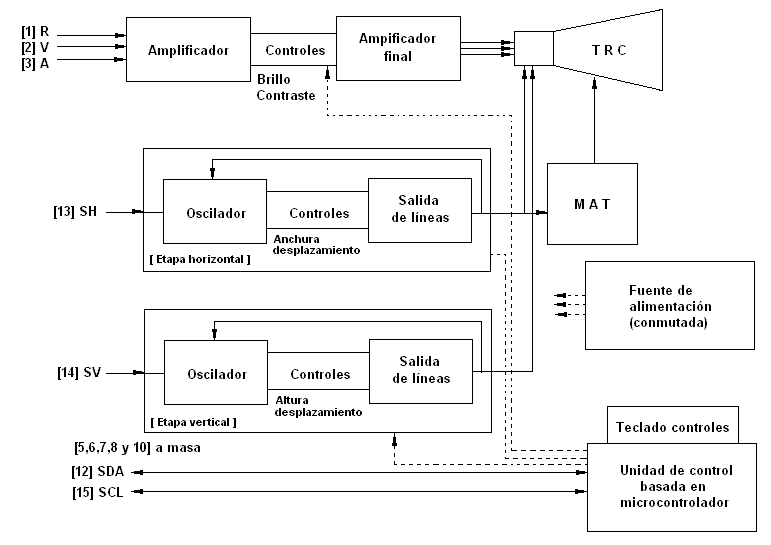

Las funciones de cada una de las partes son las siguientes:

1.  Las señales de color R, V, A, son amplificadas, controladas en brillo y contraste y aplicadas al tubo de rayos catódicos.
2.  Las señales de sincronismo proporcionan la sincronización en la desviación horizontal y vertical del haz de electrones del tubo de rayos catódicos.
3.  El MAT se encarga de aplicarle la Muy Alta Tensión al tubo de imagen.
4.  Las señales de identificación de monitor (SDA, SCL), se encargarán de comunicar la unidad de control del monitor con la tarjeta gráfica a fin de optimizar los resultados. Esta comunicación no existe en todos los monitores, aunque cada vez es más frecuente.
5.  Los controles son activados por la unidad de control que actuará según los valores introducidos por el teclado del monitor.
6.  La fuente de alimentación suministra la energía necesaria a cada módulo.

Muchos monitores actuales son digitales, en los cuales todo el proceso de la señal se hace de forma digital. Esto implica que en las entradas de señal llevarán unos convertidores analógico-digital con el fin de proceder al tratamiento digital de dicha señal, una vez procesada se vuelve a convertir en analógica para aplicársela al tubo de imagen. Las señales de sincronismo pueden tener también un tratamiento digital..

Tipos de Pantallas

Pantallas CRT

La imagen que se muestra en la pantalla se obtiene por un recorrido definido de arriba a abajo, y se crea la imagen haciendo variar la intensidad del flujo de electrones a lo largo del recorrido. El flujo en todos los monitores modernos es desviado por un campo magnético aplicado sobre el cuello del tubo, que está formado por bobinas (a menudo dos) envueltas sobre ferrita y controladas por un circuito electrónico.

Los monitores en color se muestran así de una forma sencilla. Cada píxel tiene tres puntitos, uno de cada color primario (rojo, verde, azul). Hay tres cañones de electrones, uno para cada color. Cada cañón puede encender solo su píxel. Así, combinando cada cañón de forma sincrona con el barrido anteriormente descrito, se muestran las imágenes en el cristal en el que resultan proyectadas.

## Ventajas

La principal ventaja es que al ser una tecnología muy desarrollada en el tiempo, ofrece mucha calidad a un precio muy reducido. La calidad de los colores mostrados son muy nítidos y fieles, y el tiempo de refresco (tiempo que tarda una imagen en cambiar en la pantalla) es de los más reducidos.

## Inconvenientes

Son voluminosos, muy voluminosos. Consumen mucha energía. Además, el uso de bobinas magnéticas y haces de electrones implican emisiones de RX y de campos electromagnéticos que son potencialmente nocivos para la salud. Además, su fabricación implica el empleo de materiales tóxicos difíciles de procesar en su reciclaje.

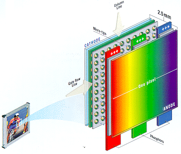

# Pantallas FED y SED

. Cada píxel es un micro tubo de vacío con un cátodo que emite electrones hacia una superficie con fósforos que generan los colores cuando los electrones chocan en ellos. Para formar una imagen entera se necesitan cientos de miles de píxeles (millones en alta definición). Por lo tanto actualmente se está estudiando la colocación de los cañones de electrones en un reducido espacio, sin que ello signifique una pérdida de funcionalidad por parte de dichos cañones o una pérdida de homogeneidad en la imagen.

****

# ****Ventajas****

Combina lo bueno del CRT y del LCD:  Calidad de imagen increíble, colores muy bien definidos, contraste altísimo, y un consumo que puede llegar a ser un 75% inferior al del Plasma. Además, el tiempo de respuesta es increíblemente bajo, menor de 1 milisegundo. Además la pérdida de emisores de electrones no provoca la muerte del píxel.

# ****Inconvenientes****

Mayor radiación, por la emisión de electrones contra una película de fósforo, aunque con el uso de nanotubos de carbono, que emitirán mucha menos radiación.

# Pantallas OLED

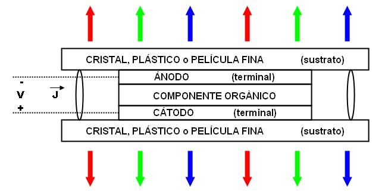

OLED (Diodo orgánico de emisión de luz) Básicamente se trata de una capa electroluminiscente formada por una película de componentes orgánicos que reaccionan, a una determinada estimulación eléctrica, generando y emitiendo luz por sí mismos.

Hay dos capas muy finas: una de conducción y otra de emisión, que a su vez están entre otras dos capas que hacen de ánodo y cátodo. Todas estas capas están formadas por semiconductores orgánicos (moléculas muy largas que ni son conductores ni aislantes, pero que pueden actuar como ambos dependiendo de la situación).

**

Cuando se aplica un voltaje a través del OLED, se genera una corriente desde el ánodo al cátodo. Gracias a esto, la capa de emisión comienza a cargarse negativamente y la capa de conducción se “llena de huecos” que dejan los electrones. Las fuerzas electroestáticas atraen a los electrones y a los huecos, los unos con los otros, y se recombinan. Esto sucede más cercanamente a la capa de emisión, porque en los semiconductores orgánicos los huecos son más movidos que los electrones. Esta recombinación libera energía en forma de fotones.

Utilizando voltajes determinados, se obtienen recombinaciones de valores predeterminados, para que la energía liberada como fotones se encuentre en una frecuencia determinada (lo que podríamos llamar “región visible”), y así generar colores e imágenes. La suma de muchas recombinaciones simultaneas genera las imágenes de las pantallas.

# ****Ventajas****

Al no necesitar de capas de cristal como en otras tecnologías, y usar capas orgánicas de polímeros, las pantallas son más delgadas luminosas y flexibles.

Debido a que los píxeles OLED emiten luz directamente, su rango de color, brillo, contraste y ángulo de visión es muy grande, superior al resto. Debido a esto también, no necesitan consumir electricidad para mostrar el negro, por lo que cuesta menos potencia energética que funcionen

# ****Inconvenientes****

Su tiempo de vida es corto, sobre todo para la luz azul, que se reduce a tan solo 1000 horas de vida. Además, su proceso de fabricación es, por el momento, muy caro, hasta que no se popularice la tecnología lo suficiente como para que se produzca en masa. Además, las moléculas y polímeros empleados en su fabricación son difíciles de reciclar, por lo que su impacto medioambiental es alto.

# Pantallas LCD

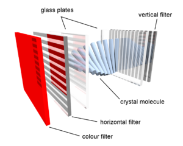

Esta tecnología funciona con una capa de moléculas alineadas entre dos electrodos transparentes y dos filtros de polarización, perpendiculares entre si. El cristal líquido entre el filtro polarizante es el que permite que la luz pase de un filtro a otro. Cuando se aplica un voltaje a través de los electrodos, las moléculas de cristal líquido distorsionan su estructura, dejando o no pasar la luz a través de ellas. Es la diferencia de polarización entre las dos capas la que produce que pase la luz. Al necesitar un gran número de píxeles, no es viable que cada píxel tenga un electrodo, por lo que estos se agrupan en columnas y filas, y cada uno tiene una fuente de voltaje.

El color se consigue de forma análoga a lo visto con anterioridad: dividiendo cada píxel en 3: rojo, verde y azul. Por lo que lo descrito anteriormente hay que multiplicarlo por 3: cada píxel de color tiene su propia fuente de voltaje.

Las pantallas modernas de alta resolución utilizan una estructura de matriz activa. Esto quiere decir que a la polarización y a los filtros de color como formas de generar imágenes, hay también una matriz de transistores dedicados. Cada píxel tiene su propio transistor para ser activado, lo que permite, a efectos prácticos, dispositivos con mayor brillo y tamaño, e imágenes más rápidas, ya que la actualización de la imagen en la pantalla es mucho más fidedigna y rápida.

# ****Ventajas****

Múltiples. Es una tecnología más nueva, y con un campo de crecimiento mayor que el Plasma, por ejemplo. Producir estas pantallas a nivel industrial es muy económico, y su consumo energético es menor. Si bien es cierto que no ofrecen un contraste tan alto como otras tecnologías, se están haciendo grandes progresos en este campo y ofrecen un brillo muy fidedigno para la mayoría de situaciones, permitiendo además una gran calidad de imagen en pantallas de tamaño mediano (menos de 40 pulgadas), consiguiendo desde hace poco, gran calidad con pantallas de gran tamaño.

# ****Inconvenientes****

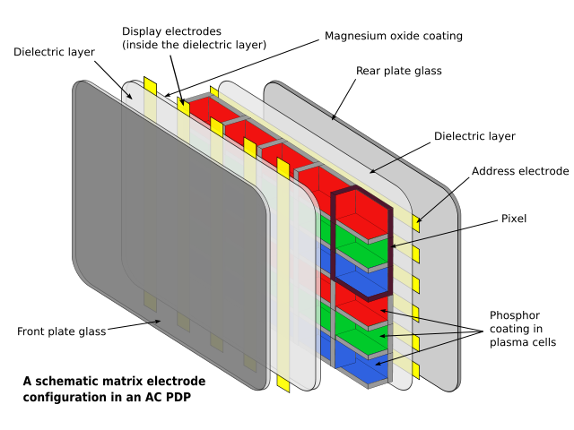Las pantallas LCD tienen una resolución nativa. Si bien pueden mostrar imágenes a otra resolución, el salirse de esta significa perder calidad. Al estar basada su tecnología en luz polarizada, el color negro y los colores oscuros no son tales, sino distintos grados de polarización de luz, por lo que nunca se representan correctamente. Su ángulo de visión es reducido, y tienen, por último, el problema de la imagen fantasma (por déficit en el barrido de la imagen) y los “píxeles muertos” (colores bloqueados por transistores estropeados).

# Pantallas de Plasma

Las pantallas de plasma se basan en una tecnología que comenzó a gestarse a mediados de la década de 1960, aunque hasta hace apenas 10 años no se empezaron a producir pantallas a color para el mercado de consumo.

Su funcionamiento se basa en una serie de diminutas celdas situadas entre dos paneles de cristal que contienen una mezcla de gases nobles (neon y xenon). El gas en las celdas se convierte eléctricamente en plasma el cual provoca que los fósforos emitan luz, gracias a unos electrodos que están empotrados entre la parte frontal y posterior de las celdas (unos detrás y otros rodeados de un aislante, en el frontal). La diferencia de voltaje entre la trasera y la frontal al cargarse eléctricamente hace que el gas se cargue eléctricamente y se convierta en plasma, emitiendo así fotones.

Cada píxel está formado por tres celdas, una de cada color primario. La mezcla de los tres produce los colores finales, de forma similar a como lo hace un monitor CRT. Esta similitud hace que las pantallas de plasma sean tan fieles en la muestra de colores como los monitores CRT, en especial mostrando el color negro, ya que, a diferencia de otras tecnologías, aquí el negro es que no hay celdas cargadas. En el LCD, por ejemplo, el negro se consigue cargando el píxel de una determinada forma, y el negro no se ve totalmente negro.

# ****Ventajas****

Las principales comprenden la calidad de la imagen. Ofrecen una calidad de colores muy alta, un ángulo de visión muy elevado y un contraste altísimo, de hasta 20.000:1. Los tonos oscuros, el negro y la escala de grises están muy bien representados, y este tipo de pantallas tiene una vida útil de unas 60000 horas (unos 30 años, si funciona 5 horas diarias). Además, al contrario que en otros tipos de pantallas, no hay tiempo de respuesta con esta tecnología, por lo que no hay efecto fantasma (ya veremos más adelante las LCD), y en su fabricación no se emplean materiales como el mercurio.

# ****Inconvenientes****

Son más caras de fabricar y consumen más electricidad que otros modelos de pantallas planas. Además, no son buenas para reproducir imágenes estáticas, ya que esto estropea las celdas de los gases.

# Pantallas Láser

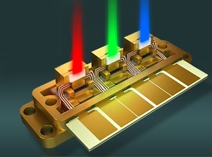

Este tipo de pantallas se basa en un chip conocido como GLV, cuyo funcionamiento se basa en tres láseres: uno rojo, otro verde y otro azul. La luz que forman pasa por una lente, y después por el GLV, que los combina entre si y los proyecta hacia un espejo que proyecta la luz en la pantalla creando líneas de 1080 píxeles, a una frecuencia de 60 por segundo.

Cada GLV tiene 1080 grupos de cintas móviles, cada una de las cuales crea un píxel de color. Este grupo está formado por seis cintas colocadas en paralelo, cubiertas con una capa reflectante y enganchadas en sus extremos con un sustrato de silicona. Tres de ellas son fijas y tres son móviles. Dependiendo de la posición de las cintas se creará una luz con más o menos intensidad.

La luz del láser que pasa por el GLV llega a una lente encargada de recogerla, y descarta la luz reflejada, lo que se consigue con un filtro de Fourier. Antes de llegar al espejo, la luz pasa por una lente de proyección para darle potencia para la pantalla. La forma de proyección en la misma es similar a la que usan los antiguos retroproyectores.

Aplicaciones tiene muchas. Dado lo liviano de su implementación, puede ser usado desde monitores para equipos informáticos, consiguiendo una calidad de colores similar al plasma, hasta dispositivos móviles como teléfonos o PDAs.

# ****Ventajas****

Proveen una paleta de colores más rica e intensa que las pantallas convencionales de plasma o LCD, y tiene la mitad de peso y coste. Además, consume un 75% menos que las pantallas de Plasma y son tan delgadas como ellas, unido a una vida útil de más de 50000 horas.

# ****Inconvenientes****

La industria de los monitores ha invertido mucho en otras tecnologías más antiguas, y no ha tenido muy en cuenta a esta, por lo cual no existe en el mercado una amplia gamma de dispositivos con esta tecnología.

# El teclado y el ratón

## Introducción

El teclado es el elemento esencial gracias al cual es posible comunicarse con el ordenado. Permite enviar a éste instrucciones o datos en forma de texto, cifras o símbolos diversos. El teclado es una copia del de las máquinas de escribir, aunque con algunas espaciales. La aparición de la interfaz gráfica como el entorno Windows hizo que tomase relevancia un dispositivo señalador que es el ratón (mouse). Ésta es la herramienta de apuntamiento más utilizada, sin embargo hay que indicar que se limita a actuar al servicio de la computadora o de sus programas. La introducción de datos es una tarea de la que sigue ocupándose, casi exclusivamente el teclado.

### El teclado

#### Generalidades

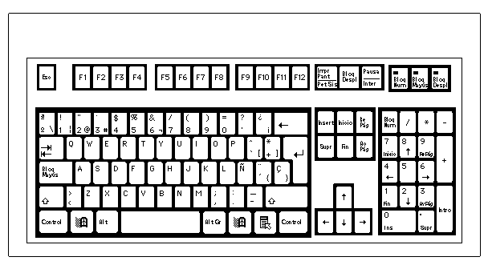El teclado es el elemento esencial gracias al cual es el posible comunicarse con la computadora, permitiéndole enviar datos o instrucciones en forma de texto, cifras o símbolos diversos.

Según el tipo de computadora al que vaya a conectarse, existen tres tipos de teclado:

- Teclado XT de 83 teclas.
- Teclado AT de 83 teclas.
- Teclado expandido de 102 teclas (101 en versión americana), que más reciente de 105 teclas.

Los *teclados XT y AT* se diferencian principalmente en que el XT tiene el procesador de teclado en el propio teclado, mientras que el AT asume que ese procesador se encuentra en la placa base. Esto hace que los teclados XT y AT sean incompatibles entre sí, no pudiéndose usar un teclado XT en una computadora AT, ni al contrario. En ese sentido, los teclados de algunos equipos clónicos incorporaban un interruptor por la parte inferior que permitía configurarlos como teclado XT o como teclado AT. En la actualidad sólo existen estos últimos. En los teclados expandidos el procesador de teclado también se encuentra en la placa base.

Desde el punto de vista de las teclas en sí, existen dos tipos de teclado: **teclado de contacto y teclado capacitivo**.

El teclado de contacto puede ser de dos tipos:

- **Mecánico**: usa pequeños interruptores individuales para cada tecla. Cuando se presiona una tecla se cierra el interruptor y permite el paso de corriente. Tiene el inconveniente de ser bastante vulnerable a la suciedad, de forma que después de un tiempo de uso es posible que alguna de sus piezas empiece a fallar; este teclado se nota porque al pulsar una tecla, suena el tic del pulsador.

- **De membrana**: las teclas llevan una membrana de goma que al pulsar hace que se unan dos pistas conductoras en la parte inferior y permite el paso de corriente: son similares a las que llevan las calculadoras. Estas membranas pueden ser individuales para cada tecla o bien una lámina completa con membranas que se mueven con cada tecla. Al pulsar una tecla, no suena como el mecánico.

El teclado capacitivo es de más capacidad y más caro que el de contacto, teniendo una vida de uso bastante más larga. Éste teclado está construido sobre una tarjeta de circuito impreso grabada, de tal forma que cuando se pulsa una tecla, esta hace presión sobre un condensador, el cual produce una señal eléctrica que es detectada e interpretada por el procesador de teclado.

Podemos encontrarnos modelos especiales de teclados, como por ejemplo:

- **Teclados inalámbricos**: caracterizados por la ausencia de cable. La comunicación se realiza a través de rayos infrarrojos o de frecuencia; cada vez son más utilizados.
- **Teclados TrackBall** (seguimiento de bola): incluyen una pequeña bola en la carcaza que puede girar libremente comportándose como si fuera un ratón.
- **Teclados ergonómicos**: con diseños especiales para adaptarse a la posición natural que tienen las manos al escribir; también se denominan teclados naturales.
- 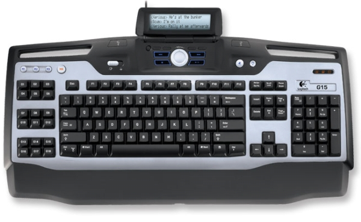**Teclados con funciones especiales**: contienen todas las teclas de una máquina de escribir más algunas suplementarias. Estas teclas permitan realizar funciones especiales como: desplazamiento del cursor, inserción, borrado, bloqueo del deslizamiento de imagen, etc.

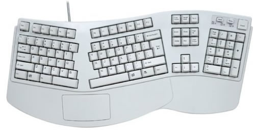

Funcionamiento

El teclado contiene un pequeño procesador que s encarga de comprobar si se ha pulsado alguna tecla, se sigue un proceso hasta que su código queda almacenado en la memoria, y es el siguiente:

- Se pulsa una tecla \[Si se pulsan varias teclas simultáneamente, el controlador de teclado las almacena en un buffer interno (de unos 10 caracteres). Este buffer no se llena nunca ya que la transmisión es demasiado rápida para que el usuario pueda mantener el ritmo\].
- El controlador de teclado detecta la pulsación:
- Generar el código de muestreo (llamado *sean code*) de tecla pulsada y lo envía al puerto del teclado.
- Activa una solicitud de interrupción al controlador de interrupciones del sistema (IRQ 1).
- El controlador genera un vector de interrupción (INT 9).
- El microprocesador accede a la tabla de vectores de interrupción a la dirección correspondiente al vector solicitad. Esta dirección contiene la dirección de comienzo de la rutina del controlador de teclado (en la RON-BIOS, controlador americano).
- Se ejecuta la rutina del controlador de teclado:

<!-- -->

- Lee el código de muestreo (depositado en el puerto 6011).
- Verifica el estado del teclado. Mayúsculas, Ctrl, Alt, AltGr, etc.
- Traduce el código de muestreo.
- Guarda los códigos en la cola de teclado y queda a la espera de que el programa solicite la entrada de teclado.

Cuando se suelta la tecla, el controlador de teclado genera un código de tecla solicitada (*break code*).

El carácter que aparezca, se corresponde con la tecla pulsada y depende de la página de códigos cargada en el sistema operativo.

El Ratón

Generalidades

#### 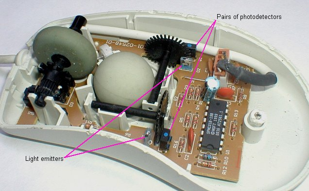**Mecánicos:** tienen una gran bola de plástico, de varias capas, en su parte inferior para mover dos ruedas que generan pulsos en respuesta al movimiento de éste sobre la superficie. Una variante es el modelo de *Honeywell* que utiliza dos ruedas inclinadas 90 [grados](http://es.wikipedia.org/wiki/Grado) entre ellas en vez de una bola. La circuitería interna cuenta los pulsos generados por la rueda y envía la información a la [computadora](http://es.wikipedia.org/wiki/Computadora), que mediante software procesa e interpreta.

- **Ópticos**: Es un ratón óptico, la bola y las ruedas de codificación son sustituidas por unos componentes ópticos: diodos emisores de luz y fototransistores. Su funcionamiento se basa en el reflejo de un haz de luz es una superficie reflectante que utiliza como soporte, que incorpora unas líneas formando cuadros que sirven para medir el desplazamiento del ratón y con ello la posición del cursor en la pantalla. Los diodos producen dos rayos dirigidos hacia abajo. Al estar situado el ratón sobre una superficie reflectante que contiene finas rayas horizontales y verticales, cuando se desplaza el ratón se reenvían hacia arriba y los fototransistores detectan las variaciones de luz que resultan de ello. Los componentes electrónicos del ratón transforman estos impulsos luminosos en señales eléctricas. Estos ratones son de manejo más suave que los ratones de bola. Sin embargo, no pueden utilizarse sin su tapete o superficie reflectante. No han tenido mucho éxito.

#### **De láser:** este tipo es más sensible y preciso, haciéndolo aconsejable especialmente para los [diseñadores gráficos](http://es.wikipedia.org/wiki/Diseñador_gráfico) y los fanáticos de los [videojuegos](http://es.wikipedia.org/wiki/Videojuego). También detecta el movimiento deslizándose sobre una superficie horizontal, pero el haz de luz de tecnología óptica se sustituye por un láser con resoluciones a partir de 2000 ppp, lo que se traduce en un aumento significativo de la precisión y sensibilidad.

- **Trackball:** el concepto de [*trackball*](http://es.wikipedia.org/wiki/Trackball) es una idea novedosa que parte del hecho: se debe mover el puntero, no el dispositivo, por lo que se adapta para presentar una bola, de tal forma que cuando se coloque la mano encima se pueda mover mediante el [dedo pulgar](http://es.wikipedia.org/wiki/Dedo_pulgar), sin necesidad de desplazar nada más ni toda la mano como antes. De esta manera se reduce el esfuerzo y la necesidad de espacio, además de evitarse un posible dolor de [antebrazo](http://es.wikipedia.org/wiki/Antebrazo) por el movimiento de éste. A algunas personas, sin embargo, no les termina de resultar realmente cómodo. Este tipo ha sido muy útil por ejemplo en la informatización de la navegación marítima.

- **Con teclas especiales**: han salido recientemente al mercado algunos modelos con teclas en la parte superior además de las habituales, con las que se pueden efectuar funciones especiales, algunas de ellas asignadas comúnmente al teclado, estos ratones se suministran con un disco con el controlador para los sistemas operativos gráficos más usuales. Los más extendidos son los que llevan un pulsador o rueda en la parte central que hacen la función de las barras de desplazamiento por las páginas Web (Net-mouse) dentro de la propia página, sin recurrir a las barras de desplazamiento del lateral de la página.

#### 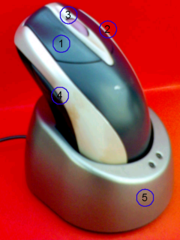**Inalámbrico:** en este caso el dispositivo carece de un cable que lo comunique con la computadora, sino que utiliza algún tipo de tecnología inalámbrica. Para ello requiere un receptor de la señal inalámbrica que produce, mediante [baterías](http://es.wikipedia.org/wiki/Batería_eléctrica), el *mouse*. El receptor normalmente se conecta a la computadora por USB, o por PS/2. Según la tecnología inalámbrica usada pueden distinguirse varias posibilidades: 

- - **Radio Frecuencia (RF)**: Es el tipo más común y económico de este tipo de tecnologías. Funciona enviando una señal a una frecuencia de 2.4[Ghz](http://es.wikipedia.org/wiki/Herzio), popular en la [telefonía móvil](http://es.wikipedia.org/wiki/Telefonía_móvil) o celular, la misma que los estándares [IEEE 802.11b](http://es.wikipedia.org/wiki/IEEE_802.11b) y [IEEE 802.11g](http://es.wikipedia.org/wiki/IEEE_802.11g). Es popular, entre otras cosas, por sus pocos errores de desconexión o interferencias con otros equipos inalámbricos, además de disponer de un alcance suficiente: hasta unos 10 metros.
  - **Infrarrojo (IR)**: Esta tecnología utiliza una señal de onda infrarroja como medio de trasmisión de datos, popular también entre los controles o mandos remotos de [televisiones](http://es.wikipedia.org/wiki/Televisión), [equipos de música](http://es.wikipedia.org/wiki/Equipo_de_música) o en telefonía celular. A diferencia de la anterior, al tener un alcance medio inferior a los 3 metros, y como emisor y receptor deben estar en una misma línea visual de contacto directo ininterrumpido, para que la señal se reciba correctamente, su éxito ha sido menor, llegando incluso a desaparecer del mercado.

<!-- -->

- - **Bluetooth (BT)**: [Bluetooth](http://es.wikipedia.org/wiki/Bluetooth) es la tecnología más reciente como transmisión inalámbrica (estándar [IEEE 802.15.1](http://es.wikipedia.org/wiki/IEEE_802.15.1)), que cuenta con cierto éxito en otros dispositivos. Su alcance es de unos 10 metros o 30 pies (que corresponde a la Clase 2 del estándar Bluetooth).

## El controlador 

Es, desde hace un tiempo, común en cualquier [equipo informático](http://es.wikipedia.org/wiki/Computadora), de tal manera que todos los sistemas operativos modernos suelen incluir de serie un software [controlador](http://es.wikipedia.org/wiki/Controlador_de_dispositivo) (*driver*) básico para que éste pueda funcionar de manera inmediata y correcta. No obstante, es normal encontrar software propio del fabricante que puede añadir una serie de funciones opcionales, o propiamente los controladores si son necesarios.

Uno, dos o tres botones 

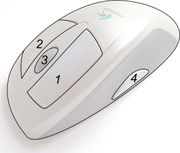Hasta mediados de [2005](http://es.wikipedia.org/wiki/2005), la conocida empresa [Apple](http://es.wikipedia.org/wiki/Apple), para sus sistemas Mac apostaba por un ratón de un sólo botón, pensado para facilitar y simplificar al usuario las distintas tareas posibles. Actualmente ha lanzado un modelo con dos botones [simulados](http://es.wikipedia.org/wiki/Simulación) virtuales con sensores debajo de la cubierta plástica, dos botones laterales programables, y una bola para mover el puntero, llamado [Mighty Mouse](http://es.wikipedia.org/wiki/Mighty_Mouse).

En Windows, lo más habitual es el uso de dos o tres botones principales. En sistemas [UNIX](http://es.wikipedia.org/wiki/UNIX) como [GNU/Linux](http://es.wikipedia.org/wiki/GNU/Linux) que utilicen entorno gráfico ([*X Window*](http://es.wikipedia.org/wiki/X_Window_System)), era habitual disponer de tres botones (para facilitar la operación de copiar y pegar datos directamente). En la actualidad la funcionalidad del tercer botón queda en muchos casos integrada en la rueda central de tal manera que además de poder girarse, puede pulsarse.

Hoy en día cualquier sistema operativo moderno puede hacer uso de hasta estos tres botones distintos e incluso reconocer más botones extra a los que el software reconoce, y puede añadir distintas funciones concretas, como por ejemplo asignar a un cuarto y quinto botón la operación de copiar y pegar texto.

La sofisticación ha llegado a extremos en algunos casos, por ejemplo el [MX610](http://es.wikipedia.org/w/index.php?title=MX610&action=edit&redlink=1) de Logitech, lanzado en [Septiembre](http://es.wikipedia.org/wiki/Septiembre) de [2005](http://es.wikipedia.org/wiki/2005). Preparado anatómicamente para diestros, dispone de hasta 10 botones.

Problemas frecuentes

- **Puntero que se** ***atasca*** **en la pantalla**: Es el fallo más frecuente, se origina a causa de la acumulación de suciedad, frenando o dificultando el movimiento del puntero en la pantalla. Puede retirarse fácilmente la bola de goma por la parte inferior y así acceder a los ejes de plástico para su limpieza, usando un pequeño pincel de cerdas duras. Para retardar la aparición de suciedad en el interior del ratón es recomendable usar una [alfombrilla](http://es.wikipedia.org/wiki/Alfombrilla). Este problema es inexistente con tecnología óptica, ya que no requiere partes mecánicas para detectar el desplazamiento. Es uno de los principales motivos de su éxito.

<!-- -->

- **Pérdida de sensibilidad o contacto de los botones**: se manifiesta cuando se pulsa una vez un botón y la computadora lo recibe como ninguno, dos o mas clics consecutivos, de manera errónea. Esto se debe al desgaste de las piezas de plástico que forman parte de los botones del ratón, que ya no golpean o pulsan correctamente sobre el pulsador electrónico. Para solucionarlo normalmente debe desmontarse completamente y colocar varias capas de papel adhesivo sobre la posible zona desgastada hasta recuperar su forma original. En caso de uso frecuente, el desgaste es normal, y suele darse a una cifra inferior al [milímetro](http://es.wikipedia.org/wiki/Metro) por cada 5 años de vida útil.

<!-- -->

- **Dolores musculares causados por el uso del ratón**: Si el uso de la computadora es frecuente, es importante usar un modelo lo mas [ergonómico](http://es.wikipedia.org/wiki/Ergonomía) posible, ya que puede acarrear problemas físicos en la [muñeca](http://es.wikipedia.org/wiki/Muñeca) o [brazo](http://es.wikipedia.org/wiki/Brazo) del usuario. Esto es por la posición totalmente plana que adopta la mano, que puede resultar forzada, o puede también producirse un fuerte desgaste del huesecillo que sobresale de la muñeca, hasta el punto de considerarse una enfermedad profesional. Existen [alfombrillas](http://es.wikipedia.org/wiki/Alfombrilla) especialmente diseñadas para mejorar la comodidad al usar el ratón.

La impresora

Introducción

Una impresora es un dispositivo electromecánico capaz de plasmar sobre un soporte físico (papel, transparencia, etc.) la información (textos, gráficos, etc.) creados en una computadora. Es por lo tanto un periférico de salida tan utilizado que se puede afirmar que es una parte más de la computadora personal, ya que difícilmente se trabaja con una PC si no se tiene una impresora para sacar una copia en papel del trabajo realizado.

A través de la conexión (ya sea utilizando un puerto paralelo o un puerto USB) la computadora envía una serie de códigos hexadecimales (o códigos ASCII) que representan los caracteres, signos de puntuación y movimiento de impresora como tabuladores, retornos de carro, avance de página, etc. Estos códigos hexadecimales se almacenan en la memoria RAM de la impresora (de unos cuantos Kbytes e incluso Mbytes) que liberan a la computadora para realizar otras funciones durante el proceso de impresión. El procesador de la impresora lee estos datos de la memora y según el tipo de impresora, dará las órdenes necesarias a las partes móviles, mecánicas y electromecánicas de la impresora para que los datos se representen de forma adecuada en el papel. Cuando el buffer de la impresora se llena, el controlador de la impresora envía un código de control para indicar a la computadora que interrumpa la transmisión de datos. En el momento en que se vacía en buffer, la impresora envía un nuevo código que reanuda el envío de datos.

El procesador de la impresora tomará toda la información, calculará el posicionamiento más eficaz de las distintas partes encargadas de la impresión, y enviará las señales de control a los distintos elementos de movimiento, para que todo salga a la perfección. Al mismo tiempo, se dispone de censores que detectan los movimientos y posición de cada elemento, con el fin de que el procesador contraste los datos enviados con los reales y corrija las deficiencias detectadas.

Una de las características que define la calidad de una impresora es su resolución que se mide en puntos por pulgada (DPI – Dot Per Inch). No hay que dejarse llevar por las cifras , ya que el número de puntos no lo es todo; por ejemplo; por ejemplo, en impresoras matriciales es posible que el grueso de las agujas indique que es posible alcanzar una resolución de 360 puntos por pulgadas, pero esos puntos, debido a su tamaño, no puedan ser diferenciados unos de otros. Un cabezal de impresión de alta resolución no puede compensar la poca precisión del mecanismo conductor de la impresora. También es importante la calidad del punto (forma, tamaño regular y constante), así como su precisión. En este sentido, la impresora láser es la que mayor calidad de punto y precisión tiene. Por tanto, a igualdad de definición, la láser da mayor calidad de impresión.

Existe otro factor a la hora de determinar la calidad de una impresora, al que no se suele prestar la debida atención, es la densidad (porcentaje de negro) que puede ofrecer la impresora. Algunos métodos de impresión, tales como el láser, pueden mantener la misma densidad de impresión incluso cuando se está acabando, cosa que no ocurren con las impresoras de agujas o matriciales.

Un factor que a veces se utiliza como reclamo comercial es la velocidad de impresión, el significado de este indicador suele sobrevalorarse e incluso se le puede dar importancia artificialmente por parte de los fabricantes para ganar un mercado más amplio. La velocidad de impresión suele definirse en caracteres por segundo (cps) o páginas por minuto (ppm). De todas formas, los fabricantes suelen indicar el valor de dicho parámetro para el modo de calidad de borrador, que no es probable que se utilice frecuentemente. La misma impresora es posible que tarde mucho más en imprimir con una calidad superior.

- **Entrada:** Consiste en adaptar las señales de entrada por el conector Centronics al microcontrolador. Dicha adaptación incluye un buffer en memoria RAM.
- **Sensores y actuadores:** su misión es la de mover, detectar y corregir la posición y movimiento de los distintos elementos importantes en el mecanismo de impresión de cada tipo de impresora.
- **Salida:** Consiste en actuar los mecanismos necesarios (inyectores, electroimanes, etc.) para sacar la copia directamente en papel.
- **Microcontrolador:** Se engloba aquí un circuito encargado de procesar la información recibida de la computadora y tratarla adecuadamente para que actuando sobre los distintos dispositivos de impresión, se obtenga como resultado la copia impresa con la calidad elegida. Este bloque incluye una memora ROM donde se realiza un autochequeo del sistema y posicionado de los elementos, cada vez que se enciende la impresora. Al mismo tiempo tiene el software de control para comunicarse con la computadora, para imprimir páginas de prueba, etc; en definitiva, es el cerebro de la impresora.

Todos estos elementos son distintos en función de cada tipo de impresora y en función del estado de la tecnología en cada momento; por ejemplo, un detector de posición en las antiguas impresoras era un simple pulsador miniatura, mientras que actualmente puede ser un optoacoplador o un detector de proximidad, por lo tanto, no se puede generalizar el tipo de componentes electrónicos, mecánicos, electromecánicos que incorporan los distintos modelos de impresoras, ya que son muy variables con el tiempo.

Clasificación

En la actualidad, tres son los métodos que se utilizan para la impresión: el impacto matricial o por agujas, la inyección de tinta y la impresión mediante tecnología láser. En la figura se muestra un diagrama de clasificación de los tipos de impresoras más utilizados actualmente, aunque las de transferencia térmica se utilizan en ambiente profesional y se llama “transferencia térmica de cera”.

Esta clasificación se refiere a la tecnología de impresión utilizada; cada uno de los tipos puede dividirse a su vez en blanco y negro (grises) y en color, teniendo cada una sus ventajas e inconvenientes en cada una de sus versiones.

La impresora de agujas

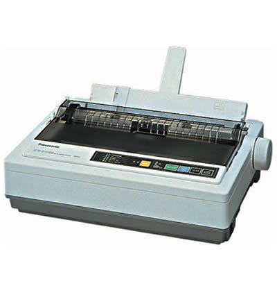Durante la aparición de los primeros PC, las impresoras se clasificaban en dos categorías: las de margarita y las de agujas. Las impresoras de margarita eran muy lentas y ruidosas. Ofrecían una calidad de impresión correcta, así como la posibilidad de obtener varios tipos de letra, pero al coste de tener que hacer molestas manipulaciones. Así, había que cambiar la rueda que contenía los caracteres (denominada margarita ) para cada cambio de tipo. Con frecuencia, el cambio se limitaba a la utilización de itálica. Estas impresoras eran capaces de simular los caracteres en negrita golpeando dos veces con el mismo carácter y haciendo un ligero desplazamiento horizontal.

Las impresoras de agujas, también llamadas matriciales, eran igual de ruidosas y ofrecían un resultado de calidad mediocre. Pero eran mucho más rápidas y baratas. Desde el momento de su aparición, las impresoras de margarita desaparecieron completamente. Habría podido pensarse que ocurriría lo mismo con las impresoras de agujas. Sin embargo, éstas ocupan un segmento de mercado, por ejemplo cuando se necesitan hacer varias copias con papel de calco o para imprimir facturas, gracias a las posibilidades que ofrece el papel continuo.

Las impresoras de agujas producen una imagen en una hoja de papel con ayuda de una serie de finas láminas metálicas (agujas) que golpean dicha hoja. Entre las agujas y la hoja se pone una cinta entintada, de forma similar a como se hace en una máquina de escribir. El choque de las agujas provoca una transferencia de la tinta desde la cinta hasta el papel. Así, los caracteres están formados por los puntos creados por el choque de las agujas. El número de puntos que constituye un carácter (o el número de agujas) determina la resolución, y por tanto, la calidad de impresión. Las más habituales son las de 9 y de 24 agujas.

Un diagrama de funcionamiento del mecanismo de este tipo de impresora se muestra en la figura. En ella, podemos observar que el mecanismo es similar al se una maquina de escribir, aunque en lugar de tener todos los caracteres, éstos se dibujan haciendo una impacto con un número determinado de agujas a la vez. Estas agujas están dispuestas de forma vertical sobre el cabezal, junto a un electroimán indicando que será activado por las señales enviadas por el microcontrolador, creando una campo magnético que repele un imán situado en el extremo de la aguja, lo que hace que ésta se desplace hacia la cinta. La aguja golpeará la cinta transfiriendo la tinta al papel, y una vez realizada su función, un muelle la llevará hacia su posición inicial. Mientras tanto, el cabezal se mueve de un lado al otro del papel, dejando a su paso los puntos necesarios para construir los caracteres enviados desde la computadora. El cabezal de impresión irá accionando distintas combinaciones de agujas a medida que se desplaza por la página para ir representando los distintos caracteres (para mejorar la impresión o imprimir caracteres en negrita se hace pasar el cabezal una segunda vez por encima de la línea de texto y para la impresión en color se utilizan cintas con tres o cuatros franjas de tinta de color).

Una vez que el cabezal ha terminado de imprimir una línea, el tambor (rodillo) que arrastra el papel girará un poco subiendo el papel para que sea impresa una nueva línea y en ese momento el cabezal podrá realizar una nueva pasada, dejando un nuevo rastro de puntos.

Gracias al movimiento combinado del cabezal de impresión en sentido horizontal y de la hoja de papel en sentido vertical, es posible situar el cabezal en cualquier punto del papel. Por este motivo, sólo es necesario disponer de un mecanismo conductor lo suficientemente preciso para conseguir una buena resolución, incluso con una sola aguja de impresión. Por ello, el número adicional de agujas no supone necesariamente una mejora de resolución, sino un incremento de la velocidad del proceso de impresión.

Las ventajas más importantes de este tipo de impresoras son su fiabilidad y bajo coste de mantenimiento (el coste de la cinta es insignificante comparado con el tóner de una láser o los cartuchos de tintas de inyección, aunque también su duración es bastante menor).

Los principales inconvenientes son su baja velocidad y sobre todo, el enorme ruido (comparándola con los otros tipos) que producen las agujas al golpear sobre el papel.

En cuanto al color, existen muy pocos fabricantes que ofrezcan dispositivos destinados a que las impresoras matriciales puedan imprimir a color. En estos casos, llevan una cinta con 4 colores (amarillo, cián-azul, magenta-rojo, negro), de tal forma que los distintos colores se forman con la combinación adecuada de los tres, y el negro para los grises.

La conexión entre el cabezal de impresión y el circuito de control se lleva a cabo mediante un cable flexible con un número de hilos dependiente del número de agujas (número de agujas + 1), y dicho y dicho cable se moverá con el cabezal, por ello es muy importante que siempre tenga el camino libre, ya que en caso contrario se quedará atrapado en dicho movimiento y se romperá, teniendo que ser sustituido por otro idéntico que a veces es difícil encontrar.

La impresora de inyección de tinta

La impresora de inyección de tinta, también denominada de chorro de tinta, es una impresora silenciosa, de alta o muy alta calidad y de bajo precio, más rápida que la de agujas aunque más lenta que la láser, y que por sus características se ha impuesto en el sector domestico de forma generalizada. Imprime línea a línea con ayuda de un cabezal de impresión móvil, de forma similar a como lo hace una impresora de agujas. Para crear la imagen impresa, se utiliza un sistema de no impacto, por el cual el cabezal no llega a tocar la hoja en ningún momento, sino que pulveriza pequeños chorros de tinta sobre el papel.

El cabezal de impresión de una impresora de chorro de tinta está montado en un carro móvil, como en el caso de las impresoras de agujas. Contiene un cierto número de orificios, a través de los cuales se expulsa la tinta líquida formando un minúsculo punto negro en el papel. Según el dato a imprimir, se expulsará la tinta por unos orificios u otros, formando la imagen en el papel.

Existen básicamente dos métodos para inyectar la tinta desde el cabezal: el método térmico y el método piezoeléctrico.

En el proceso térmico, la imagen se forma empleando una cabeza térmica para calentar y fusionar la tinta sobre el papel. Un impulso eléctrico hace que una pequeña resistencia (una por cada inyector) situada en el fondo de la cámara se caliente y caliente a su vez una delgada capa de tinta en el fondo de la cámara hasta una temperatura del orden de 480 ºC durante algunos microsegundos, lo que hace que la tinta hierva y se forme una burbuja de vapor. A medida que se expande la burbuja, empuja la tinta a través de la boquilla para finalmente formar un pequeñísima gota en la punta de ésta. La presión de la burbuja empuja la gota hacia el papel. Tras esto, la resistencia se enfría, la burbuja explota y la succión resultante atrae tinta nueva del depósito hacia la zona de disparo.

La tinta tiende a extenderse siguiendo las fibras del papel, por tanto sólo con papeles especiales, satinados o fotográficos, podremos obtener la calidad deseada (los folios suelen tener una cara satinada y otra no; conviene que el lado de la impresión sea el satinado, que se puede ver al trasluz).

En el método piezoeléctrico, se utiliza como mecanismo de impulsión de las partículas de tinta las propiedades de cambio de forma de un elemento piezoeléctrico al que se le aplica un impulso eléctrico. Cada inyector está formado por un elemento piezoeléctrico que al recibir un impulso eléctrico cambia de forma, aumentando bruscamente la presión del interior del cabezal y provocando la inyección de una partícula de tinta.

El ciclo completo de inyección es más rápido en el proceso piezoeléctrico que en el térmico, pero los cabezales son permanentes, no existiendo la modalidad de cabezales desechables, como sucede con el proceso térmico.

Dentro del grupo de proceso piezoeléctrico, hay un subgrupo denominado “cabezal actuador multicapa” (Multi-layer Actuator Head) de Epson, que consiste en la superposición de finas capas piezocerámicas de un grosor de unos 20mm que forman una estructura para conseguir que la gota de tinta sea una esfera y no haya restos detrás.

En el caso de impresión en color, este tipo de impresora tiene cuatro depósitos de tinta independientes; uno negro (para imprimir en blanco y negro) y otro con tres colores básicos: cián, magenta y amarillo (aunque han aparecido en el mercado impresoras con 6 depósitos). (Hay modelos de impresoras en las que cada color es un cartucho independiente). Una imagen en color se forma por combinación de estos tres colores básicos. El procedimiento empleado se ***denomina síntesis sustractiva.*** Consiste en eliminar de la luz blanca ciertos componentes. Así, una tinta roja absorbe el verde y el azul y refleja el rojo. Una tinta azul absorbe el verde y el rojo. Una tinta negra absorbe todos los colores y no refleja nada. Así pues pueden obtenerse los colores en papel con la ayuda de tres colores primarios en mezcla sustractiva: el cián, el magenta y el amarillo. La mezcla de esos tres colores debe producir el negro, aunque en la practica el color el color que dan es un gris verdoso muy oscuro. Es por ese motivo por el cual este procedimiento, llamado ***tricromía***, es poco utilizado. Se prefiere emplear la ***cuatricromía***, en el que una tinta negra permite reforzar los tonos oscuros y obtener el negro perfecto.

La imagen se imprime por páginas y por pasadas. En cada una de las pasadas se proporciona la cantidad necesaria de tinta de color para cada uno de los puntos de la hoja. Al cabo de tres pasadas, se ha depositado tinta de los tres colores sobre el papel, quedando impresa la imagen en color.

El papel entra en la impresora por dos procedimientos: por fricción y por tracción.

En el procedimiento de ***fricción***, el papel entra entre el rodillo de presión y unos rodillos con unos muelles, de tal forma que el rodillo de presión gira entrando el papel hacia el mecanismo de impresión; en este tipo de impresoras este es el mecanismo más utilizado.

En el procedimiento por ***tracción***, el papel lleva unos agujeros que pasan por un mecanismo que va tirando el papel por dichos agujeros, consiguiendo un desplazamiento muy preciso; se utiliza con papel continuo y no es muy utilizado en este tipo de impresoras, aunque si lo es en las matriciales.

Al elegir un modelo de impresora de inyección de tita uno de los factores que se considera es el precio, pero para ello hemos de tener en cuenta no solo el precio de la impresora en sí, sino también el precio de los cartuchos de tinta y la cantidad de folios que se impriman con cada uno. Esto es importante, ya que a veces entre estos elemento (consumibles) hay una gran diferencia de precio, y es muy importante conocerlos antes de decantarnos por un modelo determinado a otro.

En este sentido hay dos versiones; las que llevan los inyectores fijos en la propia impresora y las que llevan los inyectores en los propios cartuchos de recambio. Cada una tiene sus ventajas e inconvenientes, pero para las que llevan los inyectores en los cartuchos, éstos son más caros, mientras que la impresora en si es más económica (se sobreentiende a igualdad de prestaciones). Los inyectores fijos son de mayor calidad, y están fabricados para un tiempo de vida de la impresora bastante alto, mientras que los que van en los cartuchos, están pensados para la duración del cartucho (algo más); al cambiar el cartucho además se cambian los inyectores.

La impresora láser

La impresora láser es una impresora silenciosa, de muy alta calidad, precio elevado (aunque hay modelos a buen precio), más rápida que las de inyección a tinta y que debido a estas características se ha impuesto en el sector profesional y allí donde hay una gran tirada de documentos (secretarias, oficinas de grandes empresas, etc).

Una vez que los datos provenientes de la computadora llegan a la impresora, deben interpretarse en instrucciones que controlen el movimiento de un rayo láser.

En una impresora láser, la imagen se obtiene por un procedimiento electroestático, similar al de las fotocopiadoras. La impresión no imprime el papel línea por línea, sino por páginas completas, lo que hace necesario que la computadora transmita a la impresora todos los datos incluidos en la página a través del puerto de impresión. Todos estos datos se almacenan en una memoria RAM propia de la impresora, y cuando los datos de la página están completos tomará una hoja de la bandeja e imprimirá la hoja completa, pasándola entre dos rodillos. El rodillo situado en la parte superior está fabricado con un material fotosensible, que tiene la característica de producir cargas estáticas y eliminarlas cuando es iluminado. Los puntos que forman la impresión son dibujados mediante una haz láser sobre este rodillo. Para ello un espejo giratorio hace que el rayo láser recorra una horizontal en este cilindro llamado cartucho fotoconductor orgánico.

El rodillo de la impresora va girando y entra en contacto con un polvo muy fino llamado tóner que se adhiere a las zonas cargadas eléctricamente, las zonas donde ha incidido el rayo láser son descargadas y corresponden a las zonas que van en blanco. El rodillo seguirá girando y una vez que tiene toda la página registrada eléctricamente en el rodillo y con el polvo necesario para la impresión, entrará en contacto con el papel siendo fijado mediante calor. La intensidad del láser será la que determine la cantidad de polvo que se depositará en cada parte de la página, consiguiéndose los diferentes tonos de grises deseados. Cada vuelta de rodillo implica una página.

El papel es introducido mediante un sistema de rodillos y engranajes.

Para la impresión láser en color el papel pasará por distintos tóners, uno para cada color.

Estas impresoras suelen utilizar un lenguaje de descripción de página como PostScript o PCL

Una de las características de este tipo de impresora es el número de páginas por minuto, entendiéndose este número como el número de páginas iguales que se imprimen en un minuto: si las páginas son distintas, esta cifra es notablemente inferior.

El escáner

Generalidades

Se puede considerar el “escáner” como el ojo del ordenador, permitiendo convertir imágenes de cualquier formato (papel, diapositivas, negativos, etc.) en imágenes digitales que pueden tratarse posteriormente con un software de edición o tratamiento fotográfico para ser visualizados en pantalla o reproducirlas fielmente en una impresora con papel fotográfico.

Así mismo, con un escáner se puede convertir un texto impreso en un texto digital, mediante un software de reconocimiento óptico de caracteres (OCR – Optical Character Recognition), que puede editarse posteriormente con algún programa editor de textos de los más usuales.

Algunos escáneres pueden distinguir entre blanco y negro, útiles para texto, otros pueden diferenciar escala de grises, y los más potentes pueden distinguir colores, y son los más utilizados en la actualidad.

Para distinguir la calidad de un escáner respecto de otro se tienen en cuenta:

- **Resolución óptica:** este valor nos indica el grado de exactitud con que es capaz de leer los documentos tanto la mecánica como la unidad lectora. Este valor está relacionado con la calidad real de los lentes del escáner. Cuanto mayor sea la resolución óptica, mejor será el escáner, y también más caro. En la actualidad, es frecuente encontrar escáner de sobremesa de 600x1200 puntos por pulgada (DPI) de resolución óptica a un precio accesible. El tamaño en bytes que ocupara una imagen escaneada será el resultado de multiplicar el total de puntos que contendrá la imagen por la profundidad de color en bytes, esto es:(longitud foto)x(anchura foto)x(resolución horizontal)x(resolución vertical)x3/6,45.

Donde el 3 es suponiendo profundidad de color de 24 bits (3 bytes) y el 6,45 es el resultado de pasar la superficie (longitud x anchura) de cm2 a pulgadas2 (1 pulgada = 2,54 cm; 1 pulgada cuadrada = 2,54 x 2,54 = 6,45 cm2). La resolución que debemos elegir al escanear dependerá de la resolución que nos dé la impresora que utilicemos, y será a menos de dicha resolución, ya que aunque lo hagamos a mayor resolución, después en los resultados impresos no se apreciará.

- **Profundidad de color:** este parámetro nos dice cuantos colores distintos se pueden representar y por tanto cuanto se pueden reconocer. Con 1 bit de profundidad de color solo tendremos blanco y negro. 8 bits corresponden a 256 colores (28 colores), mientras que 24 bits se corresponden con 16 millones de colores (colores verdaderos). Cuando mayor sea el número de colores más fidedigna será la imagen.

- **Resolución interpolada:** es un “engaño” con el que se falsean los datos de la resolución real. Su funcionamiento consiste en introducir un nuevo punto entre dos puntos próximos con un color e intensidad intermedios, así “parece” que tiene mas resolución, pero es la misma imagen perfilada.

Tipos de escáner

Actualmente se pueden encontrar tres tipos básicos de escáneres, cuya diferencia fundamental está en el modo en que se desplaza el *cabezal lector* y la pagina que contiene la información. Estos tipos son:

**Escáner de rodillo:** Están provistos de un alimentador de hojas y unos rodillos que se encargan de arrastrar el papel para hacerlo pasar la cabeza exploradora.

**Escáner plano:** la página permanece estática tras un cristal mientras el cabezal pasa por debajo

**Escáner manual:** La mano del usuario es la que se encarga de desplazar el cabezal lector. Este tipo ha desaparecido por completo.

Cada método tiene sus ventajas e inconvenientes.

El ***escáner plano*** necesita una serie de espejos para enfocar la imagen que capta el cabezal móvil sobre la lente que envía la imagen a los sensores (actualmente un CCD2). Como el cristal no es perfecto, la imagen se degrada, aunque permite explorar documentos de hasta un A3 (297 mm x 420 mm). Este tipo es el más utilizado actualmente.

El *escáner de rodillo* capta las imágenes con mayor nitidez pero solo puede escanear una a una hojas de tamaño A4.

El ***escáner de mano*** tiene como ventaja principal el precio, aunque en la actualidad no lo es, ya que el escáner plano ha sufrido una bajada de precios tal que lo ha sustituido. Como inconvenientes tiene que la calidad de la imagen depende de la seguridad y la firmeza de la mano del usuario.

Elementos y funcionamiento de un escáner

Un escáner está formado por un conjunto de detectores determina la resolución horizontal del escáner. Este valor se mide en puntos por pulgadas, y determina en buena parte la calidad de un escáner.

El sistema electro-óptico del escáner hace que la luz reflejada en la imagen de la hoja a escanear, pase a través de un sistema de filtros de colores rojo, verde y azul (en escáner de color). Dividiendo la luz en sus tres componentes cromáticos fundamentales; se digitaliza cada color y se obtiene una imagen de mapa de bits con la imagen completa digitalizada. Esta imagen se almacena en una memoria RAM en el escáner y de ahí se envía al ordenador para poder ser procesada.

Tomando en cuenta el diagrama en bloques de un escáner se puede afirmar que e l bloque fundamental es el óptico, ya que determinara la definición del elemento. Otro bloque importante, es el controlador, encargado de controlar las distintas partes del mecanismo electro-óptico, así como sensores y motores para que todo funcione bien. También permite que el circuito envíe la información al ordenador por la conexión correspondiente.

Una forma sencilla de mejorar la calidad de digitalización pasa por el software. La mayoría de las aplicaciones de escáner dispone de un método de interpolación. Con la interpolación el software crea artificialmente un punto suplementario entre cada dos puntos, atribuyéndole como valor de dicho punto suplementario la media de los valores de los puntos vecinos. Este procedimiento no añade ninguna información a la imagen digitalizada, sino que tan solo efectúa un suavizado de la misma. La resolución aparente aumenta por un efecto óptico.

El proceso de reconocimiento óptico de caracteres (OCR). Consiste en digitalizar un documento mediante escáner al igual que una fotografía, en el lugar de producir un mapa de bits de la imagen, el resultado será una serie de bytes que representan el texto original en formato ASCII. Será necesario disponer de un programa capaz de reconocer las imágenes de carácter digitalizado.

En primer lugar se realiza un escáner de la página de texto para obtener una imagen compuesta únicamente de puntos blancos y negros. El programa deberá determinar las zonas de la página que contienen texto. Con caracteres separados por un espaciado normal y un documento de buena calidad, no habrá problemas. Pero el reconocimiento puede hacerse muy difícil en ciertos tipos cuyos caracteres estén unidos, e incluso imposible para una escritura manuscrita. Una vez aislados los caracteres empieza la fase más compleja: la del reconocimiento de esos caracteres y su conversión en caracteres ASCII convencionales. Existen en la actualidad programas para OCR con muy buena calidad y son capaces incluso de mantener el formato de las tablas y dibujos y convertir sólo el texto.

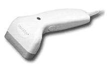El escáner de mano

En un escáner de mano se indica el comienzo de la digitalización por medio de un botón de encendido situado sobre su carcasa. Durante la exploración de la imagen, un haz de luz iluminara la sección situada debajo de la sección de exploración del escáner, mientras que un espejo con forma de ángulo situada en la parte delantera reflejara la luz hacia una lente colocada en la zona trasera.

Esta lente enfocara una línea de luz hacia un dispositivo denominado “dispositivo de acoplo de carga” o CCD que detectará los cambios de tensión. Las tensiones generadas son recibidas por un convertidor analógico-digital que se encargara de realizar la conversión Gamma (cambio del brillo de un nivel de gris en particular; es útil para dar brillo a sombras o a otras aéreas aisladas de la imagen) con el fin de resaltar los tonos oscuros de la imagen. Esta línea de luz convertida en una secuencia de distintas tensiones pasará al convertidor analógico-digital que transformará estos valores en un mapa de bits.

Dado el escaso volumen de los escáneres de mano, para ir detectando diferentes zonas de la imagen deberemos mover el escáner de forma manual a lo largo del documento. Así, mientras la mano traslada el escáner a lo largo del documento, iremos captando distintas aéreas de la imagen que podremos observar en la pantalla de la computadora. Una mayor rapidez en el recorrido de la página implica menor resolución, por lo tanto, conviene hacer el recorrido lo más lento y constante posible.

El mayor inconveniente de este tipo de dispositivos reside en la escasa anchura de su cabeza lectora (10 o 15 cm.) que no permite la digitalización de una página A4.

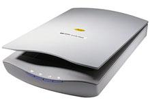El escáner plano

En un escáner plano o de sobremesa o de página, la imagen a digitalizar deberá estar situada sobre la ventana de vidrio disponible en el mecanismo del equipo. Una vez colocado el documento se debe ordenar vía software el comienzo de la digitalización de la imagen o del texto. Algunos llevan además un pulsador para ordenar el comienzo.

Durante su funcionamiento, un haz de luz ilumina diferentes zonas de la página, el motor del escáner moverá una cabeza lectora compuesta por detectores que capturan la luz reflejada por las distintas áreas de la imagen.

Un conjunto de espejos mantendrá constantemente alineada la luz reflejada con una lente, que enfocará estos rayos hacia el dispositivo de acoplo de carga CCD, encargado de traducir esta luminosidad en corriente eléctrica. El convertidor analógico-digital traducirá las diferentes tensiones en escalas de grises o de colores.

Toda esta información, una vez convertida en digital la manipulará el software de aplicación suministrado junto con el dispositivo, y posteriormente se almacenará en un formato determinado para su utilización por programas de tratamientos de imágenes o por editores de texto si se trata de texto.
