# Unidad Temática II — Introducción a la Arquitectura de Computadoras

## Contenido

- [Unidad Temática II — Introducción a la Arquitectura de Computadoras](#unidad-temática-ii--introducción-a-la-arquitectura-de-computadoras)
  - [Contenido](#contenido)
  - [Introducción](#introducción)
    - [INFORMACIÓN REPRESENTACION SIMBOLICA](#información-representacion-simbolica)
    - [PROCESAMIENTO DE DATOS](#procesamiento-de-datos)
    - [INPUTS](#inputs)
    - [PROCESAMIENTO AUTOMÁTICO DE DATOS](#procesamiento-automático-de-datos)
    - [SISTEMAS DE INFORMACIÓN](#sistemas-de-información)
    - [ORGANIZACIÓN GENERAL DE UNA COMPUTADORA](#organización-general-de-una-computadora)
    - [ORGANIZACIÓN GENERAL DE UNA COMPUT ADORA](#organización-general-de-una-comput-adora)
    - [HARDWARE Y SOFTWARE](#hardware-y-software)
    - [NOCIONES SOBRE EL HARDWARE](#nociones-sobre-el-hardware)
    - [PRIMERA VISIÓN DE UNA ARQUITECTURA TIPO VON NEUMANN](#primera-visión-de-una-arquitectura-tipo-von-neumann)
    - [Principio de funcionamiento del computador](#principio-de-funcionamiento-del-computador)
    - [MEMORIA CENTRAL O PRINCIPAL](#memoria-central-o-principal)
    - [UNIDAD DE CONTROL](#unidad-de-control)
    - [LAS UNIDADES PERIFERICAS](#las-unidades-perifericas)
    - [EL CANAL](#el-canal)
    - [PROGRAMA](#programa)
    - [DESARROLLO DE UNA INSTRUCCIÓN DE PROCESAMIENTO](#desarrollo-de-una-instrucción-de-procesamiento)
    - [INSTRUCCIÓN DE RUPTURA DE SECUENCIA](#instrucción-de-ruptura-de-secuencia)
    - [INSTRUCCIÓN DE INTERCAMBIO CON EL EXTERIOR](#instrucción-de-intercambio-con-el-exterior)
    - [LAS INTERRUPCIONES](#las-interrupciones)
    - [CONFIGURACION DE UN SISTEMA INFORMATICO](#configuracion-de-un-sistema-informatico)
    - [COMPUTADORES DIGITALES Y SISTEMAS DIGITALES](#computadores-digitales-y-sistemas-digitales)
    - [LAS GENERACIONES DE COMPUTADORAS](#las-generaciones-de-computadoras)
    - [Evolución de la tecnología](#evolución-de-la-tecnología)
    - [Evolución de la explotación de los ordenadores](#evolución-de-la-explotación-de-los-ordenadores)
  - [Sistemas Numéricos](#sistemas-numéricos)
    - [Señales Lógicas y Analógicas](#señales-lógicas-y-analógicas)
    - [SISTEMAS DE NUMERACION](#sistemas-de-numeracion)
    - [Naturaleza Posicional del Sistema Decimal](#naturaleza-posicional-del-sistema-decimal)
    - [Naturaleza Posicional del Sistema Binario](#naturaleza-posicional-del-sistema-binario)
    - [FORMATO DE LOS NUMEROS EN LAS MAQUINAS](#formato-de-los-numeros-en-las-maquinas)
    - [CODIFICACION DE LA INFORMACION](#codificacion-de-la-informacion)
    - [Introducción](#introducción-1)
    - [CODIFICACIÓN DE LA INFORMACIÓN EN LA MÁQUINA](#codificación-de-la-información-en-la-máquina)
    - [CODIFICACIÓN DE LA INFORMACIÓN NUMÉRICA](#codificación-de-la-información-numérica)
    - [Códigos Ponderados](#códigos-ponderados)
    - [Códigos No Ponderados](#códigos-no-ponderados)
    - [ALGUNOS CÓDIGOS NÚMERICOS MÁS USUALES](#algunos-códigos-númericos-más-usuales)
    - [ALGUNOS COMENTARIOS SOBRE LOS CÓDIGOS](#algunos-comentarios-sobre-los-códigos)
    - [CODIFICACIÓN DE LA INFORMACIÓN NO NUMÉRICA](#codificación-de-la-información-no-numérica)
    - [Codificación de los Caracteres](#codificación-de-los-caracteres)
    - [CARÁCTER](#carácter)
    - [PALABRA](#palabra)
    - [BYTE](#byte)
    - [Representación de los Números](#representación-de-los-números)
    - [CODIFICACION DE LAS INSTRUCCIONES](#codificacion-de-las-instrucciones)
    - [CODIGOS REDUNDANTES](#codigos-redundantes)
    - [Códigos Autodetectores](#códigos-autodetectores)
    - [Códigos Autocorrectores](#códigos-autocorrectores)
    - [Control y Corrección](#control-y-corrección)

## Introducción

Concepto de Sistema de Información y Procesamiento de Datos

**SISTEMA:** Conjunto de componentes coordinados que trabajan juntos para lograr objetivo comunes.
Es un conjunto de elementos dinámicamente relacionados entre sí, operando sobre entradas (datos,
energía, información), proveyendo salidas (datos, energía, información). Estos son la razón de su
existencia y lo determinan en un ámbito dado.

Componentes + Relaciones **SISTEMA** (puede dividirse en SUBSISTEMAS)

**DATO:** Representación simbólica de propiedades de entes o sucesos. Son realidades cuantitativas o
cualitativas determinadas en una situación.

Los datos tienen la propiedad de que se pueden:

Transmitir

Almacenar (para su uso posterior)

Transformar (operando sobre ellos para obtener nuevos datos)

Ejemplo: edad, fecha, estatura, temperatura, velocidad, etc.

**INFORMACIÓN:** Representación simbólica de entes, hechos, sucesos, cualidades, etc. que, por el
significado que les atribuye quien las percibe e interpreta, permiten disminuir la incertidumbre en
una decisión, lo que **no** ocurre con los datos. La información sirve para la toma de decisiones,
que se obtiene procesando ciertos datos. La decisión que se toma a partir de la información que se
obtiene es individual.

Además permite concretar la acción determinando los pasos a realizar y la secuencia a seguir. Esta
información descriptiva es la que permite la acción.

En las máquinas la información descriptiva se encuentra en la memoria constituyendo **programas**
que indican la secuencia de operaciones a seguir para lograr el resultado deseado. También existe
información de control que permite verificar si las acciones planificadas se realizan correctamente.
Al igual que los datos se puede almacenar, procesar, puede convertirse en la entrada (dato) de otro
proceso (retroalimentación).

DATOS & INFORMACION Ambos son representaciones simbólicas

Conjunto de datos que quien los necesita e interpreta puede decidir una acción entre varias.

Puede ocurrir que un mismo mensaje provea información distinta para dos o más decisiones a tomar.

### INFORMACIÓN REPRESENTACION SIMBOLICA

La información puede ser transmitida y almacenada (también puede ser procesada para obtener Nuevas
Informaciones)

TRANSMITIR ≠ COMUNICAR

Hay **comunicación** cuando el receptor asigna el _mismo significado_ que el que transmite.

### PROCESAMIENTO DE DATOS

### INPUTS

**DATOS** (Conjunto de símbolos)

**OUTPUTS:** INFORMACIÓN

ESTRUCTURA DE DATOS: Es un conjunto de datos o símbolos pero organizado respondiendo a relaciones
que no existen antes de procesarlos.

PROCESO: Conjunto finito de pasos u operaciones que deben llevarse a cabo en un cierto orden,
relacionando los datos para obtener la información necesaria para resolver un problema. Ejemplo de
información va a llover.

PROCESOS SECUENCIALES: Operaciones, totalmente ordenadas en el tiempo que se realizan una por vez.

**I O**

**T****1** **T****2**  **T****3** **T****4**

Las máquinas con arquitectura Von Neumann realizan el procesamiento siguiendo este modelo, no
comienzan una operación hasta haber terminado la anterior, es decir, lee la instrucción, realiza la
operación, etc.

PROCESOS CONCURRENTES: Hay operaciones que en su ejecución se superponen en el tiempo.

**I O****1**

**O****2**

**T****1** **T****2**  **T****3** **T****4** 
**T****5** **T****6**

Muchos procesadores actuales realizan procesos en forma simultánea, siempre y cuando que no utilicen
los mismos recursos (memoria, buses, etc.).

MICROCONTROLADOR: puede realizar procesos paralelos, ya que posee dos tipos de memorias

### PROCESAMIENTO AUTOMÁTICO DE DATOS

Las máquinas (computadoras, ordenadores) que procesan según este esquema están basadas en modelo VON
NEUMANN.

La computadora dio origen a la INFORMÁTICA que podemos definir como: “todas las tecnologías que
colectivamente tratan la recolección, procesamiento y transmisión de información con asistencia de
un computador”.

### SISTEMAS DE INFORMACIÓN

Una computadora puede considerarse un sistema que a su vez puede dividirse en subsistemas (memoria,
procesador, periféricos, etc.); pero también puede ser un subsistema otro sistema mayor como por
ejemplo en un sistema de procesamiento distribuido geográficamente y que esta interconectado
mediante un sistema de comunicación.

El sistema de información es un subsistema de la organización: elabora datos útiles (información)
para la toma de decisiones.

En una organización las áreas de información, decisión y control están distribuidos en todo el
sistema. La información presta servicios a cada subsistema componente ya la organización en
conjunto, para lograr el control, coordinación y cooperación de dichos subsistemas, al ser
transmitida de unos a otros.

### ORGANIZACIÓN GENERAL DE UNA COMPUTADORA

### ORGANIZACIÓN GENERAL DE UNA COMPUT ADORA

**PERIFERICOS:** es todo aquello que rodea al procesador central.

Entrada

Salida

E/S o I/O

Entrada Salida

**E/S**

**PERIF. DE ENTRADA:** Proporcionarán al sistema los datos provenientes del exterior.

La función es sensar (detectar) la existencia de señales que representan símbolos (letras, números,
etc.) y convertir esa señal eléctrica detectada en señales eléctricas binarias internas. Tiene un
conversor externo / interno.

**PERIF. DE SALIDA:** Envían al exterior los resultados almacenados en memoria.

Las señales eléctricas binarias internas que codifican los datos provenientes de la memoria deben
convertirse en el periférico en señales adecuadas para el almacenamiento, visualización o
transmisión. Tiene un conversor interno / externo.

**MEMORIA PRINCIPAL O CENTRAL:** almacena instrucciones y datos provenientes desde los periféricos y
guarda resultados intermedios y finales.

En general un periférico no puede pasar información a otro sin que intervenga la MC.

**PROCESADOR CENTRAL:** Lugar donde se ejecutan las instrucciones contenidas en MC. Si el procesador
central está constituido por un único **circuito integrado** se denomina microprocesador (mP).

El procesador tiene 3 secciones principales:

\*UC: Unidad de control

\*UAL: Unidad Aritmético Lógica.

\*Registros auxiliares

**CANALES** (Interfases de Adaptación y Control de Periféricos y Unidades de Acceso Directo a
Memoria: IACP y UADM)

Elemento que actúa como interfaz. Son dispositivos intermedios entre los periféricos y la memoria.
Su función es adaptar las diferencias de velocidad de funcionamiento existente entre la CPU y los
periféricos.

Analicemos las diferencias de velocidad:

El tiempo de acceso a memoria para leer o escribir una información está en el orden de 10 a 100 ns.
(1 ns = 10-9 s) por lo tanto en 1 s se podrían realizar 107 escrituras o
lecturas.

En un disco, teniendo en cuenta que posee elementos mecánicos, necesita de 1 a 5 ms. Para que la
cabeza de lectura se posicione sobre la pista y sector correspondiente y luego la información puede
transmitirse a aproximadamente 500.000 a un millón de transferencias /segundo.

En una impresora rápida se pueden lograr 6000 transferencias/segundo.

Los canales (IACP) deben adaptar estas disímiles velocidades y para ello poseen una memoria buffer
de capacidad limitada.

**MEMORIA BUFFER:** Utilizan algunos periféricos para adaptarse a la velocidad de la CPU e
igualmente los canales, dados a que algunos periféricos y canales no trabajan a la misma velocidad
que el procesador necesitan de la memoria buffer.

### HARDWARE Y SOFTWARE

**HARDWARE:** Constituye la porción material o “dura” que no cambia, que permanece con cada proceso
particular de datos. Es todo aquello que soporta al software.

Es la totalidad física, conformada por todos los componentes de su equipamiento: circuitos
electrónicos, plaquetas que los soportan, cables, mecanismos, discos, cintas gabinetes, tomillos,
pantallas. etc.

**SOFTWARE:** Se utiliza como sinónimo de programa. Se refiere a todos los programas que pueden
ejecutar en un equipo de computación. Todo aquello que es fácilmente modificable o que puede
modificarse en algún proceso particular de datos.

**FIRMWARE:** Es posible incluir programas y datos en una parte de la memoria principal que tenga
almacenamiento permanente (no se borra al desconectar los circuitos de la fuente de alimentación).

Esos, **circuitos integrados** constituyen las denominadas memorias ROM (Read Only Memory). Los
programas y tablas de datos contenidos no pueden cambiarse. Solo pueden leerse.

Los programas incluidos en firmware son de uso muy frecuente, tales como programas iniciadores de
funcionamiento de máquina, de verificación de funcionamiento del hardware, programas traductores,
etc., estos son grabados electrónicamente.

### NOCIONES SOBRE EL HARDWARE

Podemos admitir que el hardware se nutre de dos disciplinas: la TECNOLOGIA (fundamentalmente
electrónica) y la LÓGICA. La tecnología aporta los avances en los componentes (transistores,
resistencias, elementos de memoria, dispositivos ópticos, etc.) y la lógica aporta el estudio de
cómo ensamblar esos componentes para construir registros, sumadores, circuitos de selección o
unidades de mayor complejidad como ser memorias, la unidad aritmético – lógica, etc.

La ARQUITECTURA es otra disciplina, de importancia cada vez mayor, que apoya la construcción de
sistemas informáticos de complejidad cada vez mayor.

### PRIMERA VISIÓN DE UNA ARQUITECTURA TIPO VON NEUMANN

Von Neumann, en 1945, propone los conceptos fundamentales en que se basan las computadoras tal como
las conocemos actualmente.

1. **Programa almacenado:** En la memoria de la máquina se encuentran tanto los datos a procesar
   como los programas con la secuencia de instrucciones para el procesamiento.
2. **Ruptura de secuencia:** Von Neumann concibió la idea de hacer automáticas las operaciones de
   decisión lógica, dotando a las máquinas de la instrucción de **salto condicional**, teniendo en
   cuenta el resultado de una operación realizada con anterioridad seguiría una parte u otra del
   programa.

En una visión muy general un computador se compone de:

1. **Memoria Central:** Almacena los programas y datos
2. **Unidad Central de Proceso:** Ejecuta el programa
3. **Unidades de Entrada/Salida:** Permite el intercambio con el exterior

A veces se llama sistema informático al conjunto ordenador + elementos a él conectados.

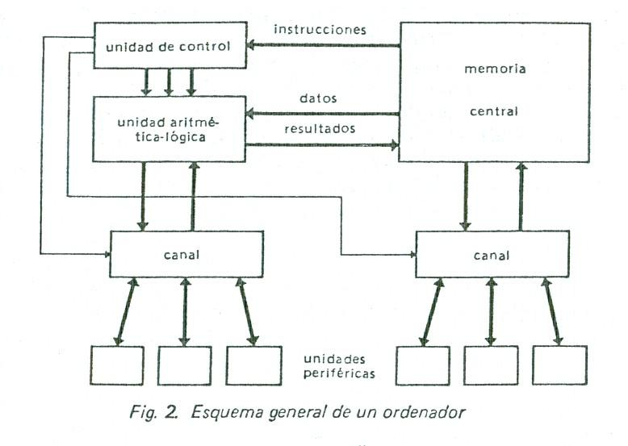

### Principio de funcionamiento del computador

### MEMORIA CENTRAL O PRINCIPAL

El programa a ser ejecutado debe encontrarse en memoria central, en el momento que se va a ejecutar.
Almacena fundamentalmente dos tipos de información:

1. Instrucciones del programa (o informaciones descriptoras del tratamiento) que la maquina deberá
   ejecutar.
2. Datos (dicho a veces operandos o informaciones a tratar), con los que trabajará la máquina, de
   acuerdo a lo indicado en el programa.

Estos dos tipos de información tienen su correspondencia física en dos unidades peculiares de la
máquina: **la unidad de control**, también llamada **unidad de instrucciones** o **unidad de
gobierno**, para las instrucciones, y la ALU o **unidad de proceso**, para los datos.

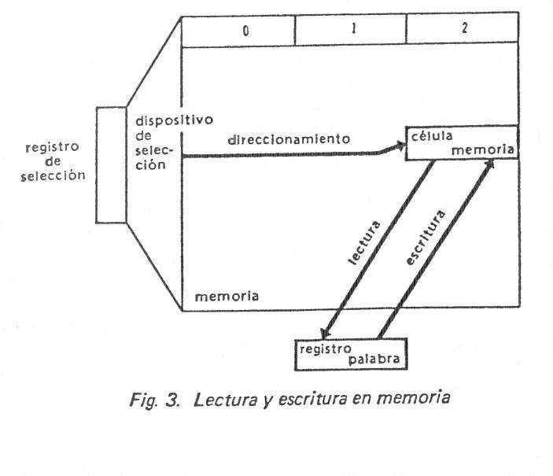

ALU

Manejada por la unidad de control (CU), ejecuta las operaciones con los datos _almacenados_ en la
memoria principal.

Para pedir al ordenador una operación aritmética, por ejemplo una suma, la instrucción debe
facilitarle las siguientes informaciones:

1. La clase de operación a realizar, en este caso una suma, es el papel del **código de operación**.
2. La dirección de la célula de memoria que contiene el primer dato, o **primer operando**.
3. La dirección de la célula de memoria que tiene el **segundo operando**.
4. La dirección de la célula de memoria donde quiere almacenarse el resultado.
5. La dirección de la célula de memoria de la siguiente instrucción.

De acuerdo a como se resuelvan las cuestiones anteriormente enunciadas, tendremos 4 formatos de
instrucción:

1. Instrucciones de 4 direcciones

|                     |                                   |                                   |                     |                                 |
| ------------------- | --------------------------------- | --------------------------------- | ------------------- | ------------------------------- |
| Código de Operación | Dirección 1er Operando | Dirección 2do Operando | Dirección Resultado | Dirección Siguiente Instrucción |

1. Instrucciones de 3 direcciones

|                     |                                   |                                   |                     |
| ------------------- | --------------------------------- | --------------------------------- | ------------------- |
| Código de Operación | Dirección 1er Operando | Dirección 2do Operando | Dirección Resultado |

Cuando se utiliza este formato de instrucción se supone que la siguiente instrucción se encuentra
almacenada en la dirección de memoria siguiente a la que se está ejecutando.

La figura a representa una ALU capaz de ejecutar la operación anterior (de tres direcciones), la
cual esta rodeada de 3 registros donde se memorizan los dos operandos y el resultado. La instrucción
de suma necesita cuatro accesos a la memoria central, que permiten sucesivamente buscar la
instrucción, después el 1er operando, después el 2do operando y por ultimo, almacenar el resultado.
A las máquinas que utilizan este tipo de instrucción se les llama maquinas de tres direcciones.

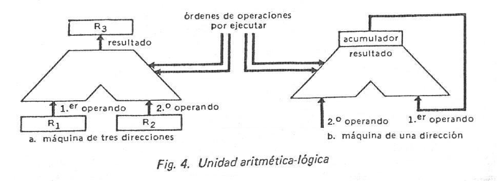

1. Instrucciones de 2 direcciones

|                     |                                   |                                   |
| ------------------- | --------------------------------- | --------------------------------- |
| Código de Operación | Dirección 1er Operando | Dirección 2do Operando |

En las máquinas que utilizan este formato de instrucción el resultado generalmente se guarda en la
dirección del primer operando. Es importante que el programador tenga en cuenta esto ya que ese
operando se perderá.

1. Instrucciones de 1 dirección

|                     |                        |
| ------------------- | ---------------------- |
| Código de Operación | Dirección del Operando |

Abacus es una máquina de una dirección. Su ALU posee un registro particular denominado
**Acumulador**, que contiene tanto el 1er operando como el resultado. Esta característica permite
instrucciones de una sola dirección: la del segundo operando.

En estas máquinas la operación de SUMA necesita 3 instrucciones para:

1. Cargar el primer operando en el Acumulador.
2. Sumar el segundo operando con el contenido del Acumulador.
3. Almacenar en memoria central el contenido del Acumulador.

Cada una de estas 3 instrucciones comportara un código de operación y una dirección:

|       |                     |                            |
| ----- | ------------------- | -------------------------- |
|       | Código de Operación | Dirección                  |
|       |                     |                            |
| \(1\) | Carga               | Dirección del 1er operando |
| \(2\) | Adición             | Dirección del 2do operando |
| \(3\) | Almacenamiento      | Dirección del resultado    |

La ALU esquematizada en la figura b, donde el acumulador sustituye a los registros R1 y
R3 de la figura a. El segundo operando puede almacenarse durante la operación en el
registro de palabra asociado a la memoria. Este es el caso del Abacus.

1. Instrucciones sin dirección

Este caso se presenta fundamentalmente en las máquinas con MICROPROCESADOR en las cuales la longitud
de la palabra es generalmente de 1 byte y se ocupa íntegramente para el código de operación, la
dirección del operando se encuentra en la dirección o direcciones siguientes al de la instrucción.

### UNIDAD DE CONTROL

Esta unidad se encarga de extraer y analizar las instrucciones de la memoria central, luego
establece las conexiones eléctricas correspondientes dentro de la ALU y extrae los datos de la MC
implicados por la instrucción. Por último ordena a la ALU el tratamiento de los datos extraídos.
Eventualmente, suele almacenar el resultado en la memoria central. Básicamente consta de dos
registros:

1. **Contador de Instrucciones** o contador de programa o contador ordinal: contiene la dirección de
   la próxima instrucción por ejecutar.
2. **Registro de Instrucción:** contiene la instrucción extraída de la memoria. El registro de
   instrucción de Abacus tiene 2 partes: una para el código de operación, que define el tipo de
   instrucción a ejecutar (suma, multiplicación, salto, etc.) y otra parte, que contiene la
   dirección del operando.

Otro elemento fundamental de la unidad de control es un órgano llamado **generador de secuencias** o
**secuenciador**, que es el encargado de analizar el código de operación de la instrucción, y en
base a ello distribuir las microórdenes al conjunto de las unidades del ordenador (memoria, ALU,
etc.) para hacer ejecutar las distintas Fases de la instrucción.

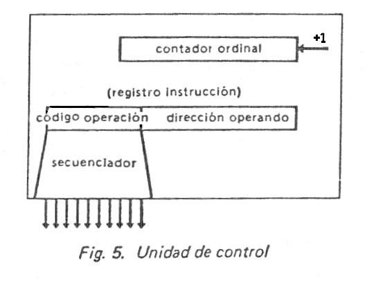

La unidad de control y unidad aritmética forma un todo en la mayoría de los ordenadores, que se
suele denominar **unidad central** o **unidad central de proceso** o **procesador central**.

### LAS UNIDADES PERIFERICAS

Son los elementos que permiten a la máquina el intercambio con el mundo exterior. Podemos citar:
unidades de cinta, unidades de disco (rígido, flexible, óptico), teclados, monitores, impresoras,
conversores analógico/digitales o dígito/analógicos, módem, etc.

**Las memorias auxiliares:** que sirven como soporte de almacenamiento de gran capacidad y medio de
comunicación en el interior del sistema. Están representadas fundamentalmente por cintas magnéticas,
discos magnéticos y ópticos.

La mayoría de estas unidades constan de dos partes:

1. Una parte electrónica, llamada **controlador** o _unidad de control del periférico_.
2. Una unidad electromecánica que, gobernada por la primera, lee o escribe informaciones.

Las unidades periféricas se conectan, bien a la unidad central, bien directamente a la memoria a
través de unidades especializadas en la gestión de las transferencias de información. Estas unidades
de intercambio se llaman canales.

Como se menciono anteriormente la unidad de control gobierna la ejecución de las operaciones pedidas
por el programa. Si la operación es un cálculo, es la ALU quién lo realiza, si es una transferencia
de informaciones con el exterior (instrucción de entrada/salida), se cede el control a un canal.

### EL CANAL

Cuando se efectúan intercambios entre el exterior y la máquina o viceversa, actúa la unidad
denominada CANAL; dispositivo especializado para gestionar las operaciones de entrada – salida
(I/O).

En las máquinas actuales, las transferencias de información entre el procesador central (CPU) y los
periféricos pueden realizarse en forma “simultánea” con el desarrollo de un programa de cálculo.
Esta simultaneidad es posible a causa de la gran diferencia de velocidad que existe entre los
periféricos y el interior de la máquina (CPU y MC). Por consiguiente los canales o INTERFACES DE
ADAPTACIÓN Y CONTROL DE PERIFERICOS (IACP), deben adaptar esas disímiles velocidades, para lo cual
cuentan con registros especializados para este fin.

Las informaciones producidas, como resultado del procesamiento, son almacenadas en memoria central
en forma secuencial. Para inicializar tal transferencia, especiales instrucciones de entrada –
salida deben suministrar al canal, por una parte, la dirección de la unidad periférica implicada y,
por otra, la dirección para el almacenamiento de la primera información y el número de informaciones
por transferir. En lo sucesivo, el canal se ocupara totalmente de la gestión de la transferencia;
por cada información transferida, añadirá 1 a la dirección de almacenamiento y restara 1 al numero
de informaciones por transferir. El canal advertirá a la unidad de control en el momento en que
todas las informaciones hayan sido transferidas.

### PROGRAMA

Se trata de un conjunto de instrucciones, que deben encontrarse en la memoria central, almacenadas
secuencialmente o no; esto nos indica que las instrucciones pueden estar o no en direcciones
sucesivas de memoria. En este primer análisis supondremos que las instrucciones se encuentran
almacenadas en forma sucesiva en memoria.

Esquemáticamente dividiremos a las instrucciones en tres clases:

1. **Instrucciones de procesamiento:** sobre operandos contenidos en memoria. Operaciones
   aritméticas, lógicas o de almacenamiento – escritura en memoria.
2. Instrucciones de ruptura de secuencia.
3. **Instrucciones de intercambio** entre el medio exterior y el ordenador.

### DESARROLLO DE UNA INSTRUCCIÓN DE PROCESAMIENTO

El desarrollo de una instrucción de procesamiento en un computador de una dirección, como Abacus,
puede descomponerse en tres fases:

1. Fase de búsqueda y análisis de la instrucción
2. Fase de búsqueda y procesamiento del operando
3. Fase de almacenamiento del resultado.
4. Fase de preparación para la próxima instrucción.

- **Búsqueda de la Instrucción:** La Unidad de Control ordena la transferencia del contenido del
  contador ordinal (es decir, la dirección de la instrucción por ejecutar) al registro de selección
  de memoria, y envía a la memoria una orden de lectura. Una vez terminada la operación de lectura,
  la instrucción queda disponible en el registro de palabra. Entonces la unidad de control ordena la
  transferencia del contenido de este registro al de instrucción. Los circuitos especializados de la
  unidad de control pueden ya analizar el código de operación de la instrucción. Esta primera fase
  es común a todos los tipos de instrucción.

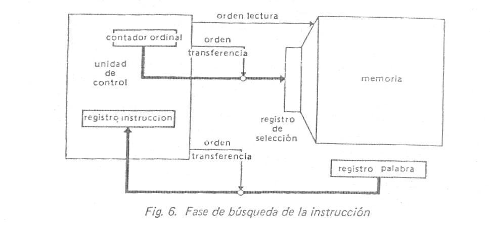

- **Búsqueda y Procesamiento del Operando:** Una vez analizado el código de operación de la
  instrucción, la unidad de control sabe que se trata de una instrucción de procesamiento, con
  búsqueda previa del operando. La dirección del operando se encuentra en la zona de dirección del
  registro de instrucción. La unidad de control ordena su transferencia al registro de selección de
  memoria y acto seguido ordena una operación de lectura en la memoria. Al finalizar dicha
  operación, el operando buscado queda disponible en el registro de palabra. La unidad de control
  posiciona los circuitos de la ALU para realizar el procesamiento solicitado por el código de
  operación y ordena la transferencia del operando a la ALU. El resultado del procesamiento queda
  almacenado en el acumulador. Obsérvese que un posible procesamiento pudiera ser simplemente una
  transferencia del operando al acumulador.

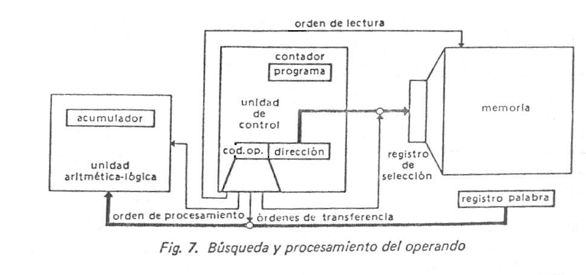

- **Almacenamiento del Resultado:** La dirección de almacenamiento del operando se encuentra en la
  zona de dirección del registro de instrucción: la unidad de control ordena su transferencia al
  registro de selección de la memoria. El operando por almacenar esta en el acumulador: la unidad de
  control ordena su transferencia al registro de palabra de memoria. Luego de esto el secuenciador
  emite la orden de escritura y el resultado queda almacenado en memoria central.

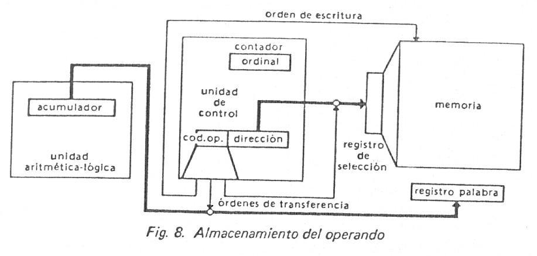

- **Preparación para la Próxima Instrucción:** Consiste en aumentar en una unidad el contenido del
  Contador Ordinal de la unidad de control, de manera que contenga la dirección de la próxima
  instrucción. Esta operación se realiza luego del análisis del código de operación de la
  instrucción, ya que el incremento se producirá automáticamente para todas las instrucciones que no
  sean de ruptura de secuencia.

### INSTRUCCIÓN DE RUPTURA DE SECUENCIA

Este tipo de instrucciones, también llamado instrucción de bifurcación o de salto, permite modificar
el desarrollo secuencial del programa. La ruptura de secuencia puede ser **condicional** o
**incondicional**.

El salto puede ser **incondicional**, la dirección de la siguiente instrucción está contenida en la
propia instrucción de salto y es transferida al contador ordinal.

En el caso de salto **condicional** esta no tendrá efecto más que si se satisface una determinada
condición, normalmente relacionada con el contenido del acumulador; si la condición no se satisface,
el programa continuará en secuencia. El código de operación de la instrucción establece la condición
y en la zona de dirección de la instrucción indica el emplazamiento de la próxima instrucción por
ejecutar en el caso de satisfacerse la condición. Si la respuesta de la ALU es que la condición se
ve satisfecha, la unidad de control ordena la transferencia de la dirección, contenida en la
instrucción, al contador ordinal e inhibe la suma de una unidad al contador ordinal, en caso
contrario, se ordena incrementar en 1 el contador.

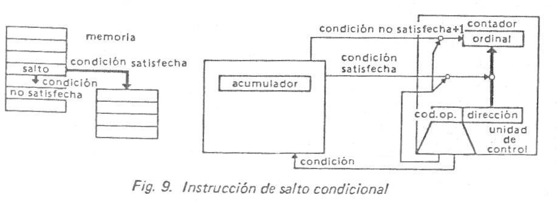

### INSTRUCCIÓN DE INTERCAMBIO CON EL EXTERIOR

Para que el canal pueda encargarse, en forma autónoma, de las transferencias desde y hacia el
exterior, es necesario que la CU le suministre la dirección del periférico implicado, la dirección
de la primer información y la cantidad de informaciones por transferir. Luego el canal se ocupará
totalmente de la gestión, como se indicó cuando se describió el canal.

### LAS INTERRUPCIONES

Las **interrupciones** son órdenes que dimanan del medio exterior y que piden al ordenador ejecutar
un programa asociado a la orden. El programa en curso se ve interrumpido para permitir la ejecución
del programa solicitado por la interrupción, considerado ahora como prioritario. Acabado este
último, se reanuda la ejecución del programa interrumpido. Es gracias a las interrupciones, por
poner un ejemplo, como los canales avisan a la unidad de control que una operación de entrada –
salida ha llegado a su fin.

### CONFIGURACION DE UN SISTEMA INFORMATICO

Se llama configuración de un sistema de procesamiento de la información a la lista, posiblemente
acompañada de sus características, de las unidades que lo componen, y la forma en que se deben
interconectar.

### COMPUTADORES DIGITALES Y SISTEMAS DIGITALES

Los computadores se usan para cálculos científicos, procesamientos de datos comerciales y de
negocios, control de tráfico aéreo, dirección espacial, campo educacional y en muchas otras áreas,
también cabe aclarar que los computadores digitales han hecho posible muchos avances en distintas
áreas y que no se hubiesen podido lograr por otros medios. La propiedad más impactante de un
computador es su generalidad. Puede seguir una serie de instrucciones, llamadas **programa,** que
operan con datos dados. El usuario puede determinar y cambiar los programas y datos de acuerdo a una
necesidad específica. Como resultado de esta f1exibilidad, los computadores digitales de uso general
pueden realizar una serie de tareas de procesamiento de información de amplia variedad.

El computador digital de uso general es el ejemplo más conocido de **sistema digital**. Otros
ejemplos incluyen conmutadores telefónicos, voltímetros digitales, contadores de frecuencia,
máquinas calculadoras, y máquinas teletipos. Es característico de un sistema digital la manipulación
de **elementos discretos** de información. Tales elementos discretos pueden ser impulsos eléctricos,
los dígitos decimales, las letras de un alfabeto, las operaciones aritméticas, los símbolos de
puntuación o cualquier otro conjunto de símbolos significativos. La yuxtaposición de elementos
discretos de información representan una cantidad de información. Por ejemplo, las letras d, o y g
forman la palabra dog. Los dígitos 237 forman un número.

De la misma manera una secuencia de elementos discretos forman un lenguaje, es decir una disciplina
que con lleva información. Los primeros computadores fueron usados principalmente para cálculos
numéricos, en este caso los elementos discretos usados son los dígitos. De esta aplicación ha
surgido el término computador digital. Un nombre mas adecuado para un computador digital podría ser
“sistema de procesamiento de información discreta”.

Los elementos discretos de información se representan en un sistema digital por cantidades físicas
llamadas **señales.** Las señales eléctricas tales como voltajes y corrientes son las más comunes.
Las señales en los sistemas digitales electrónicos de la actualidad tienen solamente dos valores
discretos y se les llama **binarios.** El diseñador de sistemas digitales está restringido al uso de
señales binarias debido a la baja confiabilidad de los circuitos electrónicos de muchos valores.
Debido a la restricción física de los componentes y a que la lógica humana tiende a ser binaria, los
sistemas digitales que estén restringidos a usar valores discretos, lo estarán para usar valores
binarios.

Las cantidades discretas de información podrían desprenderse de la naturaleza del proceso o podrían
ser cuantificadas a propósito de un proceso continuo. Por ejemplo, un programa de pago es un proceso
que contiene nombres de empleados, números de seguro social, salarios semanales, impuestos de renta,
etc. El cheque de pago de un empleado, se procesa usando valores discretos, tales como las letras de
un alfabeto (nombres), dígitos (salarios) y símbolos especiales tales como \$. Por otra parte, un
científico investigador podría observar un proceso continuo pero anotar solamente cantidades
específicas en forma tabular. El científico estará cuantificando sus datos continuos. Cada número en
su tabla constituye un elemento discreto de información.

Un **computador análogo** realiza una **simulación** directa de un sistema físico. Cada sección del
computador es similar al de alguna parte específica del proceso sometido a estudio. Las variables en
el computador análogo están representadas por señales continuas que varían con el tiempo y que por
lo general son voltajes eléctricos. Las señales variables son consideradas similares con aquellas
del proceso y se comportan de la misma manera.

Una calculadora electrónica es un sistema digital similar al computador digital que tiene como
elemento de entrada el teclado y como elemento de salida una pantalla numérica. Inclusive Algunas
calculadoras tienen forma de imprimir y además facilidad de programación. Sin embargo un aparato más
poderoso que una calculadora; puede usar muchos otros dispositivos de entrada y salida, puede
realizar no solamente cálculos aritméticos y operaciones lógicas sino que puede ser programado para
tomar decisiones basadas en condiciones internas y externas.

Un computador digital es una interconexión de módulos digitales. Un procesador combinado con la
unidad de control forma un componente llamado unidad central de proceso o CPU. Un CPU encapsulado en
una pastilla de circuito integrado se denomina **microprocesador.** La unidad de memoria, de la
misma forma que la parte que controla la interconexión entre el microprocesador y los elementos de
entrada y salida, puede ser encapsulada dentro de la pastilla del microprocesador o puede
encontrarse en pastillas pequeñas de circuitos integrados. Un CPU combinado con una memoria y un
control de interconexión formará un computador de tamaño pequeño denominado **microcomputador.**

Los elementos de entrada y salida son sistemas digitales especiales manejables por partes
electromecánicas y controladas por circuitos electrónicos digitales.

En síntesis un computador digital manipula elementos discretos de información y que estos elementos
se presentan en forma binaria. Los operandos, usados en los cálculos pueden ser expresados en el
sistema de números binarios. Otros elementos discretos, incluidos los dígitos decimales, se
representan con códigos binarios. El procesamiento de datos se lleva acabo por medio de los
elementos lógicos binarios, usando señales binarias. Las cantidades se acumulan en los elementos de
almacenamiento binario.

### LAS GENERACIONES DE COMPUTADORAS

### Evolución de la tecnología

En primera aproximación puede hacerse corresponder sucesivamente las válvulas electrónicas a la
primera generación, los transistores a la segunda, los circuitos integrados a la tercera y con mucha
probabilidad, los circuitos integrados a media o a gran escala a la cuarta.

De una a otra generación se han conseguido progresos, algunas veces considerables, en las
características de los circuitos: miniaturización, fiabilidad, complejidad y velocidad.

**La miniaturización** se ilustra en la figura 11, donde se representa cómo la misma función lógica
necesitaba un armario en la generación de las válvulas, un cajón o parte de uno en la generación de
los transistores, una placa impresa en la de los circuitos integrados a pequeña escala, una cápsula
de circuito en la generación de los circuitos integrados a gran escala.

**La fiabilidad** introduce la noción de calidad de funcionamiento de un componente o de un
conjunto. Se mide por el factor M.T.B.F. (Mean Time Between Failure) que expresa el promedio de
tiempos entre averías o, si se quiere conservar las siglas, la Media de los Tiempos de Buen
Funcionamiento. Media que ha pasado de varias decenas de minutos para una unidad central de la
primera generación a varios miles de horas para una unidad central equivalente de la tercera.

Tal progreso en el terreno de la fiabilidad se debe a dos causas: el progreso en la fiabilidad del
componente y la reducción, gracias a la integración, del número de interconexiones.

**La complejidad** la posibilidad de concebir conjuntos electrónicos cada vez más complejos es un
corolario directo de la ganancia en fiabilidad. Así es como, a igual fiabilidad, pueden hoy
realizarse conjuntos electrónicos 1.000 a 10.000 veces más complejos que en la tecnología de
válvulas.

**La velocidad** los tiempos de conmutación de los circuitos lógicos han pasado de los varios
microsegundos de la primera generación a varios nanosegundos en la tercera. Esto ha permitido pasar
de máquinas de un millar de instrucciones por segundo a máquinas, de complejidad equivalente, que
ejecutan un millón de instrucciones por segundo.

### Evolución de la explotación de los ordenadores

Las sucesivas generaciones se nutren de tecnologías diferentes y se diferencian sobre todo en las
técnicas de organización y explotación.

El ordenador de la **primera generación** (**válvulas electrónicas**) ejecutaba sus trabajos de
manera puramente secuencial, cada uno en tres tiempos:

1. 1. el programa perforado en tarjetas o en cinta de papel era leído y registrado en memoria
      gracias a un programa cargador;
   2. el programa era ejecutado;
   3. se imprimían los resultados.

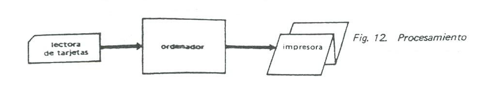

Era posible incluir en el programa lecturas de nuevos datos o impresiones de resultados parciales,
pero las operaciones de procesamiento, de entrada o de salida tenían que encadenarse en el tiempo,
con lo que la duración de todo el proceso era la suma de todas y cada una de las operaciones.

El ordenador de la **segunda generación** (**transistores**) ofrecía posibilidades de simultaneidad
del cálculo con las operaciones de entrada y salida. Sin embargo, el encadenamiento de los trabajos
seguía siendo secuencial como en las máquinas de la primera generación, de tal suerte que las
posibilidades de simultaneidad no eran tales sino dentro de un mismo programa y, en consecuencia,
eran generalmente poco utilizadas. En particular, la unidad central permanecía inactiva cuando se
cargaban nuevos programas en memoria.

La desproporción entre la velocidad de cálculo y las velocidades de lectura de tarjetas o de
impresión ocasionaba que la unidad central no fuera utilizada realmente más que durante un pequeño
porcentaje del tiempo. Se restringió, entonces, a las cintas magnéticas, mucho más rápidas que las
lectoras de tarjetas y que las impresoras, el soportar las operaciones de entradas y salidas. Las
grandes instalaciones estaban dotadas de un ordenador auxiliar, que realizaba las conversiones de
soporte tarjeta a soporte cinta magnética y de cinta magnética a impresora y del computador
principal, el cual no conocía ni operaba más que con las cintas magnéticas.

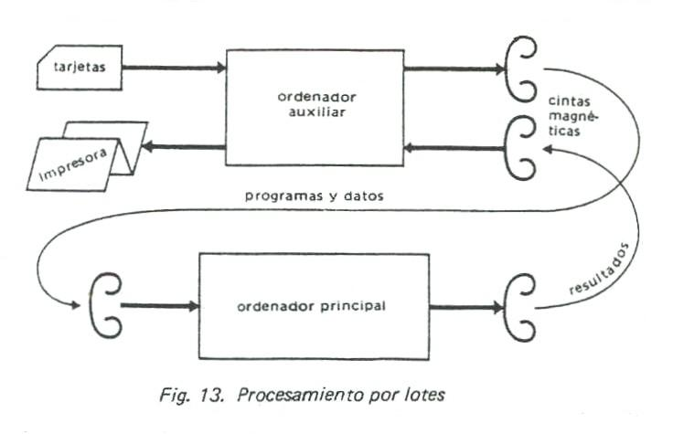

Este procedimiento de explotación se conoce a veces con el nombre de procesamiento por lotes, para
indicar que es preciso esperar a que el lote de trabajos cargados en cinta magnética haya sido
totalmente procesado, antes de poder obtener los resultados de cualquiera de ellos o poder cargar
uno nuevo.

En el curso de esta segunda generación nació un nuevo tipo de aplicación: el control de procesos, en
el que el computador va directamente conectado al proceso controlado y en sincronismo con él. La
sincronización se obtiene gracias a las interrupciones de programa, que permiten al proceso avisar
al ordenador de todo acontecimiento exterior y, en consecuencia, gobernar la ejecución prioritaria
de los programas preparados para estos acontecimientos.

El ordenador de la **tercera generación** (**circuitos integrados**) permite explotar eficazmente
las simultaneidades latentes ya en la segunda. Varios programas pueden residir simultáneamente en la
memoria; en un instante dado sólo uno de ellos utiliza la unidad central, pero los otros pueden
simultáneamente efectuar operaciones de entrada – salida.

Cuando el programa que utiliza la unidad central se detiene en espera de una operación de entrada o
de salida, otro programa toma su lugar y esto evita los tiempos muertos en la unidad central. Este
método de explotación se llama multiprogramación. Permite mejorar el empleo del conjunto de recursos
de un sistema informático.

La explotación normal de una computadora de la tercera generación consiste en particionar, o sea, en
dividir la memoria en dos zonas, una reservada al paquete de trabajos de 1os usuarios, la otra a los
programas de conversión de soporte y al sistema de explotación.

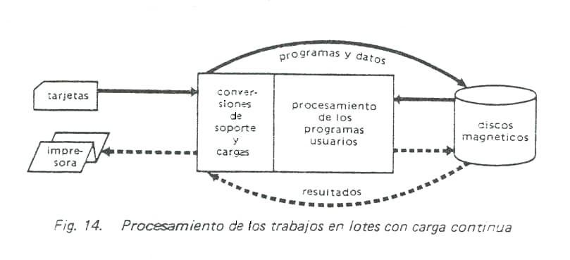

En visión simplista, estas dos particiones corresponden respectivamente a los computadores auxiliar
y principal de la precedente generación. Sin embargo hay una diferencia importante: la carga por
lotes ha sido sustituida por la carga continua de los trabajos a medida que se presentan. Los
trabajos son puestos en cola de espera en el disco magnético, después cargados en memoria para ser
ejecutados bajo el control del sistema operativo, quien toma en cuenta su grado de prioridad.

Los resultados son transferidos al disco, de donde serán extraídos más tarde a través de la
impresora según sus niveles de prioridad. El utilizador prioritario no se ve forzado a esperar el
fin del procesamiento de todo un lote de programas para obtener los resultados del suyo.

La evolución del procesamiento por lotes a la carga continua supone un primer paso en la búsqueda
del “confort” en el acceso a un ordenador. Con la tercera generación se han franqueado otras dos
etapas hacia ese confort: la posibilidad de trabajar a distancia, o teleprocesamiento, y la
posibilidad de trabajar en forma conversacional.

El **teleprocesamiento** no es otra cosa que una extensión del sistema de carga continua, con la
ventaja de que pueden someterse los trabajos al ordenador desde unos terminales remotos y recibirse
los resultados a través de estos mismos terminales. Estos trabajos quedan incluidos en la cola de
espera de trabajos a ejecutar, exactamente igual que aquellos cargados localmente y sometidos a un
régimen específico de prioridades.

Los **sistemas conversacionales** permiten a los usuarios seguir el desarrollo de las diferentes
etapas de sus programas, así como intervenir sobre este desarrollo, por medio de terminales
adaptados al diálogo (teclado, unidad de visualización, máquina de escribir conectada, etc.). A fin
de servir simultáneamente a un gran número de usuarios puede el computador operar en tiempo
compartido, lo que quiere decir que dedica a cada usuario una parte de su tiempo, con una
periodicidad determinada.

## Sistemas Numéricos

### Señales Lógicas y Analógicas

El procesamiento de la información en un calculador electrónico consiste en tratar, transferir y
memorizar señales eléctricas. En los _calculadores analógicos_ se utilizan señales de variación
continua. Por ejemplo, una magnitud cualquiera será representada por una tensión eléctrica, tensión
que deberá mantenerse, durante el procesamiento, tan proporcional como sea posible a la magnitud
representada. En los _calculadores digitales_, la información procesada que es de tipo binario, está
materializada por señales eléctricas de dos estados, que pueden hacerse muy distintos uno del otro,
por ejemplo un nivel de tensión para el estado 1 y otro, muy diferente para el estado 0.

Inmediatamente resalta una primera ventaja de la representación digital respecto de la analógica: la
información digital se transmite mejor. Es bastante fácil realizar sistemas con dos estados
estables, capaces de memorizar un bit. Por el contrario memorizar el valor de una señal eléctrica es
mucho más difícil (se memorizan muy temporalmente las tensiones eléctricas cargando condensadores).

Lógica de Nivel

Puede representarse la información digital elemental sobre una línea eléctrica, manteniendo una
tensión A para materializar el 1 lógico y una tensión B para el 0 lógico. En realidad no son valores
precisos de la tensión, sino franjas alrededor de estos valores (figura 1). Se llama “zona
prohibida” a la zona intermedia, en ella, el valor lógico de la señal eléctrica es indeterminado.

Se dirá que se trabaja con _lógica positiva_ cuando la tensión que representa el 1 lógico es
superior a la tensión del 0 lógico y, en caso contrario, se trabajará con _lógica negativa_. La
mayoría de las veces el 0 lógico será la masa o la tensión 0 voltios (figura 2). La elección de los
_niveles_ de tensión resulta de la tecnología escogida para la realización de los circuitos.

Se dice que se trabaja con una lógica de impulsos cuando la magnitud eléctrica representativa de la
información dura un tiempo muy corto. Una primera técnica consiste en utilizar un impulso positivo
para representar un 1, un impulso negativo para el 0, y la tensión 0 para la ausencia de información
(figura 3).

La mayoría de las lógicas de impulsos emplean solamente impulsos positivos (o negativos) e imponen
leer las informaciones en instantes dados, t1, t2, t3, etc. Si un
“top” coincide con un impulso, se trata de un 1 lógico, en caso contrario es un 0 lógico (figura 4).

Convencionalmente se anotan las líneas de nivel por una semiflecha, las líneas de pulsos por una
flecha. Una señal eléctrica analógica puede variar a lo largo del tiempo de una manera continuada,
gradual, sin saltos bruscos, entre dos valores extremos, que determinan un rango, y en un instante
dado puede tener un valor dentro de dicho rango.

### SISTEMAS DE NUMERACION

Para empezar conviene tener presente que, en cualquier sistema de representación, un mismo conjunto
de símbolos puede tener distintos significados según la convención que se siga.

Ejemplo: Los diez símbolos decimales pueden usarse para distintas convenciones de representación
170527 puede significar:

1. el número decimal ciento setenta mil quinientos veintisiete.
2. La fecha de nacimiento 17 de mayo de 1927
3. 17 horas 05’27”, etc.

Este multisignificado también existe para las representaciones binarias numéricas que se dan dentro
de las máquinas.

Ejemplo: una combinación binaria como 10000110, puede significar:

1. El número decimal equivalente 134 si corresponde a un número natural
2. El número decimal equivalente 86 si es un número BCD
3. El número que identifica una celda de memoria, etc.

_Números con precisión finita:_ otra consideración a tener en cuenta en la representación y
operaciones de números en una máquina está relacionada con el hecho de que los mismos solo pueden
constar de una cantidad fija de dígitos.

_Módulo:_ es el número máximo de enteros diferentes que pueden representarse en un registro físico.
La noción de módulo es útil para poner formalmente de manifiesto la capacidad limitada de
representación de los dispositivos físicos usados.

### Naturaleza Posicional del Sistema Decimal

La denominación “decimal” o de “base diez”, se refiere a los diez dígitos o símbolos (0 a 9) que
combinados permiten simbolizar los números, conforme a una convención que atribuye un valor
individual y otro posicional a cada símbolo.

Cada dígito indica cuantos subconjuntos (0,1,..,9) que agrupan igual número de elementos (uno, diez,
cien, mil, …) se han utilizado para formar un número decimal. Existen tantos tipos distintos de
subconjuntos como dígitos contenga un número. Por ejemplo, los símbolos 107 implican que el número
de elementos representados está formado por un subconjunto que agrupa cien, mas siete subconjuntos
que solo contienen un elemento cada uno, no existiendo ningún subconjunto de diez elementos.

107 = 1.100 + 0.10 + 7.1 = 1.102 + 0.101 + 7

Características de un Sistema Numérico Posicional:

- Consta de un número finito de símbolos distintos, número que define la “base” o “raíz” de cada
  sistema.
- Cada símbolo aislado representa un número especificado de unidades.
- Existe un símbolo (cero) para indicar la ausencia de elementos a representar.
- Los símbolos pueden ordenarse en forma monótona creciente.
- Formando parte de un número compuesto por varios símbolos, un mismo símbolo tiene una
  significación o “peso” distinto según su posición.
- La posición extrema derecha corresponde a unidades (peso uno), a partir de ella, cada posición
  tiene el peso de la que está a su derecha multiplicada por la base.

### Naturaleza Posicional del Sistema Binario

El método empleado es el mismo que el usado para base diez, solo varía el tamaño de los grupos, y el
hecho de estar permitido formar un solo agrupamiento de cada tamaño. En consonancia con ello,
únicamente existen dos símbolos: 1 y 0, cuyo significado es el mismo que los respectivos símbolos
decimales.

Con los mismos se puede representar cualquier número, resultando así un sistema numérico en _base
dos_ o _binario._

Cada uno de los símbolos que forman un número binario se llama “dígito binario” o BIT (de “binary
digit”).

1101011 = 1.20 + 1.21 + 0.22 +1.23 + 0.24 +
1.25 + 1.26 = 107

Luego 1101011b = 107d (“b” binario y “d” decimal)

**Base:** Determina la cantidad de símbolos distintos para representar los números, “los símbolos
son finitos pero los números no”.

**Complemento** A la base (en binario complemento a 2)

A la base -1 (En binario complemento a 1)

**Complemento a la base:** Es lo que le falta al número para llegar a la base, es decir, la base –
el número, el 1 seguido de tantos ceros como dígitos tenga el número. Potencia de la base
inmediatamente superior al número.

**Complemento a la base -1:** se define como el complemento a la base, pero restando 1, es decir, se
obtiene restando 1 a la base. En el complemento a 1 los unos se cambian por ceros, y los ceros por
unos.

**Tipos de Datos:** Las computadoras digitales manejan 4 tipos básicos de datos.

- Números enteros con signo (representación numérica).
- Números reales con signo (representación numérica).
- Número de decimales codificados en binario BCD (representación numérica).
- Caracteres (representación alfanumérica).

El número de bits que se usan para representar cada uno de estos tipos de datos y el significado de
cada uno varía según el tipo de dato a representar y el sistema computacional que se utilice (HW y
SW).

### FORMATO DE LOS NUMEROS EN LAS MAQUINAS

Un operador aritmético no puede procesar más que números que le sean presentados según uno o unos
_formatos_ bien definidos.

Componentes del Formato:

- _Dimensión:_ Las máquinas de palabra, que trabajan generalmente en sistema binario, admiten
  formato de _longitud fija_, según que la información ocupe una palabra, media palabra, dos
  palabras, etc., se hablará de _longitud simple, media longitud, doble longitud_, etc. Las máquinas
  de carácter, que operan en sistema decimal, trabajan generalmente con formatos de _longitud
  variable_, bajo los cuales un número va codificado con un número variable de caracteres.

- _Formato_: analizaremos tres tipos de formato, el _formato fijo_ o formato en coma fija y el
  _formato flotante_ o formato en coma flotante, para los números binarios, por otro lado, los
  formatos de longitud variable, para los números decimales.

La Coma Fija

Es la manera más natural de escribir un número binario en una palabra de memoria: Los números se
consideran como enteros y se le deja al programador el cuidado de situar la coma. Pueden
representarse los números negativos de acuerdo con uno de los tres convenios.

1. Signo-magnitud
2. Complemento a 1
3. Complemento a 2

La forma más simple de representación que emplea un bit de signo es la representación
_signo-magnitud_. En una palabra de N bits, los N-1 bit menos significativos almacenan la magnitud
del entero; mientras que el bit más significativo indica el signo del número, siendo 0 la
representación positiva y 1 la negativa.

**0**0010010 = +18

**1**0010010 = -18

Ahora, una palabra de 8 bits puede representar valores en un rango -127 a +127.

Desventajas:

- La adición y la sustracción requieren considerar ambos signos y sus magnitudes relativas para
  poder llevar a cabo la operación.
- Existen 2 representaciones para el cero.

**0**0000000 = 010

**1**0000000 = -010

Hay otras dos representaciones que utilizan el bit más significativo para el signo. Difieren una de
la otra y de la representación _signo-magnitud_, en la manera que los otros bits se interpretan.
Estas representaciones se conocen como _complemento a 1_ y _complemento a 2_. Ambas permiten
algoritmos más eficientes para la adición y sustracción. La representación de _complemento a 2_,
además, tiene una sola representación para el cero.

Para llevar a cabo la operación de _complemento a 1_ sobre el conjunto de dígitos binarios solo hay
que reemplazar los dígitos 0 con dígitos 1 y los dígitos 1 con dígitos 0.

Así:

X = 01010001

Complemento a 1 de X = 10101110

La representación en _complemento a 1_ de los dígitos binarios es como sigue. Los enteros positivos
se representan de la misma manera como en la representación _signo-magnitud_. Un entero negativo
está representado por el _complemento a 1_ de un entero positivo con la misma magnitud.

Por ejemplo:

18 = 00010010

-18 = Complemento a 1 de 18 = 11101101

Puesto que todos los enteros positivos tienen el bit más significativo igual a 0, todos los números
negativos tienen necesariamente el bit más significativo igual a 1. De esta manera, el bit de más a
la izquierda sigue funcionando como bit de signo.

La operación de _Complemento a 2_ consiste en dos pasos:

1. Llevar a cabo la operación de _complemento a 1_.
2. Tratar el resultado como un entero binario sin signo, sumarle 1.

La representación en _complemento a 2_ de enteros positivos es la misma como en las representaciones
de _signo-magnitud_ y _complemento a 1_. Un número negativo es representado por el complemento del
entero positivo con la misma magnitud. Por ejemplo:

18 = 00010010

Complemento a 1= 11101101

_+ 1_

-18 = Complemento a 2 de 18 = 11101110

Esta representación tiene una anomalía no encontrada con _signo-magnitud_ o _Complemento a 1_. El
patrón de bits 1 seguido por N-1 ceros es su propio _complemento a 2_. Para mantener consistencia en
el bit de signo, a este patrón de bits se le asigna el valor -2_N_.

Por ejemplo, para las palabras de 8 bits:

-128 = 10000000

Complemento a 1 = 01111111

_+ 1_

10000000 = -128

Con esta interpretación, todos los enteros positivos tienen el bit más a la izquierda en 0 y todos
los negativos tienen el bit más a la izquierda en 1. De esta manera el bit más significativo sigue
funcionando como bit de signo.

En las representaciones de _Complemento a 1_ y _Complemento a 2_ encontramos que el negativo del
negativo de ese número es el mismo ( -(-18) = 18 )

Si se representaran números binarios sin signo, para **_n_** bits \***\*se obtendrían 2n
combinaciones; vale aclarar que todas estas combinaciones son positivas. \*\***Ahora bien, cuando se
representan números con signo, la mitad del rango corresponde a números positivos y la otra mitad a
números negativos (signo-magnitud y complemento a la base menos 1), es decir, desde
-2n-1 + 1 hasta 2n-1 – 1; para el caso de complemento a la base es necesario
añadir un elemento más a la parte negativa, ya que existe una sola representación para el 0.

**En las operaciones en coma fija se dan algunas peculiaridades. La suma de dos números fijos puede
ocasionar lo que se llama** **_desbordamiento_** **o** **\*sobrepasamiento de capacidad\*\*\***.\*\*

**La multiplicación de dos números de** **_n_** **cifras da un número de** **_2n_** **cifras, como
máximo, que será representado en coma fija de doble longitud.**

|     |     |     |     |     |     |     |
| --- | --- | --- | --- | --- | --- | --- |
|     | 0   | 1   | 1   | 0   | 1   | 0   |
| \+  | 0   | 1   | 0   | 0   | 1   | 0   |
| 1   | 0   | 0   | 1   | 1   | 0   | 0   |

Características de la representación en coma fija:

- _Rango_: se determina por la diferencia entre el mayor y el menor elemento.
- _Precisión_: es la distancia entre dos números consecutivos en una serie numérica.
- _Error_: se obtiene dividiendo la precisión por 2.

La Coma Flotante

Con la notación en coma fija puede representarse un rango de números enteros centrados en el cero.
También pueden representarse números decimales asumiendo una coma fija. El problema de esta
representación es que los números muy grandes o muy pequeños requieren mucho espacio. Esta
limitación se soluciona mediante otra representación llamada _coma flotante_, la cual consiste en
representar los números bajo la forma: SM x αE donde

S: el signo del número

M: la mantisa del número

E: Es el exponente del número

α: se escoge generalmente igual a la base del sistema de numeración

Esta notación es corriente en la escritura cuando representamos 125000000 por 125x106.
Tal representación no es única, puesto que también puede escribirse: 12,5x107 ó
1250x105, etc. De entre estas representaciones se selecciona una, llamada _normalizada_,
que permite conservar el mayor número de cifras significativas. Para normalizar un número se
desplaza su mantisa hacia la izquierda o derecha según corresponda hasta que el primer digito sea
significativo, y se reduce o aumenta el exponente, respectivamente, en un número igual al número de
desplazamientos que han sido necesarios. (en hipótesis de que el exponente expresa una potencia de
2).

|     |     |     |     |     |     |     |     |     |
| --- | --- | --- | --- | --- | --- | --- | --- | --- |
| 0   | 0   | 0   | 1   | 2   | 5   |     | 0   | 6   |
| 0   | 0   | 1   | 2   | 5   | 0   |     | 0   | 5   |
| 0   | 1   | 2   | 5   | 0   | 0   |     | 0   | 4   |
| 1   | 2   | 5   | 0   | 0   | 0   |     | 0   | 3   |

En virtud de la normalización que sigue a toda la operación, la mantisa se ve siempre reajustada, de
tal suerte que los desbordamientos de capacidad no pueden afectar más que al exponente. Además del
desbordamiento de capacidad por exponente demasiado grande, puede ocurrir un _sub-desbordamiento de
capacidad_ cuando el exponente se hace demasiado pequeño para poder ser representado. La mayoría de
las máquinas sustituyen entonces el resultado correspondiente por cero, lo que supone una excepción
a las reglas de normalización.

Obsérvese que el número de dígitos de la mantisa está directamente ligado a la precisión de los
cálculos, mientras que el número de dígitos del exponente determina los valores extremos que la
máquina es capaz de representar.

Hay diferentes convenios de representación de los números flotantes binarios en la máquina. De
manera general se sitúan las informaciones más significativas en cabeza: primeramente, el signo,
luego el exponente y por último la mantisa.

La mantisa puede ser considerada como entera, o como fraccionaria. 125x106 se escribirá
según el convenio utilizado.

Representación Binaria

Se sigue el mismo procedimiento anterior con la particularidad de que a continuación de la coma
decimal siempre va un 1, por lo cual no es necesario representarlo (se sabe que está ahí). Así es
posible reducir el almacenamiento en un bit.

Cuando es necesario utilizar el número, se lo toma de la memoria y se le incorpora el 1. El bit
eliminado se conoce con el nombre de bit implícito.

1110101 = 0,1110101 x 27

Considerando el bit implícito la mantisa se almacenará como 0,110101

Cadenas Decimales de Longitud Variable

Los dígitos decimales van generalmente codificados por los cuatro bits de menor peso de los
caracteres de 6 o de 8 bits. También se encuentran representaciones condensadas con dos dígitos
decimales por octeto. Un número se forma con una cadena de tales caracteres. El signo del número
puede ser codificado por un carácter y situado en la cabeza o, más corrientemente, en la cola de la
cadena de caracteres que lo constituye. Asimismo puede ser incluido en los bits de mayor peso del
primero o del último carácter significativo.

Estas cadenas de caracteres son generalmente de longitudes variables y direccionadas por su último
carácter que será tratado en primer lugar para considerar los posibles arrastres. El primer carácter
puede tener una marca de fin de número en sus bits de mayor peso; en ausencia de marca de fin de
número, la instrucción debe precisar al calculador la longitud de la cadena.

### CODIFICACION DE LA INFORMACION

### Introducción

Para poder transmitir información existen dos problemas fundamentales: el _Hardware_ \****y el
*Lenguaje de Comunicación\*. Haciendo una analogía entre las computadoras y la comunicación humana
podemos decir que, si bien todas las personas del mundo tienen el mismo hardware para la
comunicación hablada (labios, lengua, dientes y el resto del complejo aparato bucal) para transmitir
y los oídos para recibir, la comunicación oral es posible solamente cuando dos personas conocen el
mismo lenguaje, es decir la misma manera de **codificar la información\*\*.

Así como el habla sería imposible sin lenguajes comunes, la comunicación entre computadoras sería
imposible sin coordinación de códigos de caracteres.

Todas las computadoras digitales actuales usan un **lenguaje binario** para representar la
información, internamente. Debido a que algunos de los dispositivos con los que se deben comunicar
las computadoras están diseñados para uso humano (específicamente teclados, monitores e impresoras),
es importante que estos **periféricos** utilicen un código de comunicación compatible con la
comunicación humana.

Existen varios métodos para alcanzar dicha compatibilidad y cada uno utiliza un modo diferente de
codificar los números y las letras, que conforman la base de la comunicación escrita entre las
personas.

Actualmente es frecuente encontrar en los **sistemas de cómputo**, dispositivos provistos por
distintos fabricantes. La posibilidad de conectar estos dispositivos existe únicamente si éstos
utilizan un código común para la transmisión y recepción de la información.

Son claras las ventajas de conseguir que todas las computadoras utilicen el mismo código de
comunicación. Aún cuando la calidad de los códigos varía enormemente, casi cualquier estándar
universal sería mejor que ninguno. Si bien hay códigos que prácticamente son aceptados por todos los
fabricantes, aún no existe un estándar que optimice el aprovechamiento tanto de los recursos del
hardware como las nuevas teorías sobre codificación e información.

En sentido genérico **CÓDIGO** significa: Sistema de signos y de reglas que permite formular y
comprender un mensaje.

La codificación consiste en establecer una ley de correspondencia, llamada **CÓDIGO**, entre las
informaciones por representar y las posibles configuraciones binarias, de tal manera que a cada
información corresponda una y generalmente solo una, configuración binaria.

El proceso de **CODIFICAR** significa: Transformar, mediante las reglas de un código, la formulación
de un mensaje.

Llamamos **CODIFICACIÓN** al proceso de convertir un símbolo complejo en un grupo de símbolos más
simples. Ejemplo: convertir una letra del alfabeto en un código de cinco bits.

**DECODIFICAR**: Aplicar inversamente las reglas de su código a un mensaje codificado para obtener
la forma primitiva de este.

**DECODIFICACIÓN** es el proceso inverso al de codificación, se convierte a un código donde la
cantidad de símbolos es menor, pero cada una contiene más información.

**TRANSCODIFICACIÓN:** Aplicación de un cambio de código a una información ya codificada. Ejemplo:
EBCDIC a ASCII.

**BITS:** Teniendo en cuenta que las computadoras manejan un lenguaje binario analizaremos los
**DÍGITOS BINARIOS** como caracteres para comunicación de datos.

La condición binaria es la que posee una calidad BIVALUADA. En el sistema binario de numeración esas
condiciones están representadas por los dígitos 0 y 1. Se denomina **BIT** (contracción de
**BI**NARY \***\*DIGI**T**) al dígito binario, independientemente del valor asignado (0 o 1). Un
**BIT\*\* es la unidad de información más pequeña posible, que no puede tomar más que dos valores,
generalmente 1 ó 0.

Los dígitos binarios llevan, ambos, la misma cantidad de información, ya que la presencia de uno
significa la ausencia del otro.

Un proceso fundamental en la codificación binaria es determinar la cantidad de BITS necesarios para
representar las informaciones. De manera que podamos identificar una entre varias posibles.

Como un bit puede ser l o 0, podremos utilizarlos para seleccionar una información entre dos; con
dos bits, una entre cuatro; tres bits una entre ocho; etc. Las posibilidades aumentan como potencias
de dos:

Un bit 21 = 2 elecciones

Dos bits 22 = 4 elecciones

Tres bits 23 = 8 elecciones

Si quisiéramos conocer cuantos bits necesitamos para una de ocho situaciones utilizamos logaritmos
en base 2, así: log 2 8 = 3.

En general el número de bits (I) que necesitaremos para poder codificar una determinada cantidad de
informaciones (N) estará determinado por:

I = Log 2 N

Como ejemplo, para poder representar en forma binaria los 26 caracteres de nuestro alfabeto
necesitaríamos:

I = Log 2 26 = 4,7 bits I = 5 bits

### CODIFICACIÓN DE LA INFORMACIÓN EN LA MÁQUINA

Analizaremos los siguientes puntos:

1. Codificación de la Información Numérica

2. 1. Códigos Ponderados
   2. Códigos No Ponderados

3. Codificación de la Información No Numérica

4. 1. Codificación de los Caracteres
   1. 1. 1. Caracteres Imprimibles
      2. Caracteres No Imprimibles

5. 1. Codificación de las Instrucciones

### CODIFICACIÓN DE LA INFORMACIÓN NUMÉRICA

Estudiaremos la representación de los símbolos del sistema decimal de numeración mediante símbolos
binarios (BIT).

¿Cuántos bits necesitarnos para representar los 10 símbolos del sistema decimal de numeración?

- I = Log 2 l0 = 3,162 … ≡ 4

Esto nos indica que cualquier código que utilicemos para representar los números del sistema decimal
precisará, como mínimo, 4 Dígitos Binarios (Bits). Cuando el código utilice más dígitos que los que
necesita lo denominaremos **CODIGO REDUNDANTE**.

### Códigos Ponderados

Se denomina código ponderado a aquel que respeta, para la representación de cada dígito decimal, el
“peso” que corresponde a cada dígito binario de acuerdo a la posición que ocupa. Ejemplos: BCD
(8421), AIKEN (2421), 84-2-1.

**Nota I: En cualquiera de los códigos numéricos (ponderados y no ponderados) un número decimal se
codificará cada dígito decimal por separado.**

Ejemplo: el número 345 se codificará

3 4 5

En BCD 0011 0100 0101 345(10 = 001101000101(BCD

En AIKEN 0011 0100 1011 345(10 = 001101001011(AIKEN

Nota II: Si bien los símbolos utilizados se corresponden con los del sistema binario, la
representación codificada no tiene nada que ver con el SISTEMA BINARIO DE NUMERACION.

- **BCD (Pesos 8, 4, 2, 1)**

El código **BCD** (DECIMAL CODIFICADO BINARIO) respeta para cada dígito decimal el “peso” que
corresponde a cada dígito binario de acuerdo a la posición que ocupa, teniendo en cuenta el “peso”
asignado en el sistema binario de numeración.

- 2, 4, 2, 1

**Nota III:** El código 2, 4, 2, 1 permite dos combinaciones de los dígitos 2, 3, 4, 5, 6 y 7.
Cualquiera es válida, más aún, en un mismo número de varios dígitos iguales pueden usarse
codificaciones distintas.

**AIKEN (Pesos 2, 4, 2, 1):** Construcción de la tabla de código Airen

<table>
<tbody>
<tr>
<td></td>
<td></td>
<td colspan="4">Aiken</td>
<td></td>
<td></td>
<td></td>
<td></td>
<td></td>
</tr>
<tr>
<td></td>
<td></td>
<td>2</td>
<td>4</td>
<td>2</td>
<td>1</td>
<td></td>
<td>2</td>
<td>4</td>
<td>2</td>
<td>1</td>
</tr>
<tr>
<td>0</td>
<td></td>
<td>0</td>
<td>0</td>
<td>0</td>
<td>0</td>
<td></td>
<td></td>
<td></td>
<td></td>
<td></td>
</tr>
<tr>
<td>1</td>
<td></td>
<td>0</td>
<td>0</td>
<td>0</td>
<td>1</td>
<td></td>
<td></td>
<td></td>
<td></td>
<td></td>
</tr>
<tr>
<td>2</td>
<td></td>
<td>0</td>
<td>0</td>
<td>1</td>
<td>0</td>
<td></td>
<td>1</td>
<td>0</td>
<td>0</td>
<td>0</td>
</tr>
<tr>
<td>3</td>
<td></td>
<td>0</td>
<td>0</td>
<td>1</td>
<td>1</td>
<td></td>
<td>1</td>
<td>0</td>
<td>0</td>
<td>1</td>
</tr>
<tr>
<td>4</td>
<td></td>
<td>0</td>
<td>1</td>
<td>0</td>
<td>0</td>
<td></td>
<td>1</td>
<td>0</td>
<td>1</td>
<td>0</td>
</tr>
<tr>
<td>5</td>
<td></td>
<td>1</td>
<td>0</td>
<td>1</td>
<td>1</td>
<td></td>
<td>0</td>
<td>1</td>
<td>0</td>
<td>1</td>
</tr>
<tr>
<td>6</td>
<td></td>
<td>1</td>
<td>1</td>
<td>0</td>
<td>0</td>
<td></td>
<td>0</td>
<td>1</td>
<td>1</td>
<td>0</td>
</tr>
<tr>
<td>7</td>
<td></td>
<td>1</td>
<td>1</td>
<td>0</td>
<td>1</td>
<td></td>
<td>0</td>
<td>1</td>
<td>1</td>
<td>1</td>
</tr>
<tr>
<td>8</td>
<td></td>
<td>1</td>
<td>1</td>
<td>1</td>
<td>0</td>
<td></td>
<td></td>
<td></td>
<td></td>
<td></td>
</tr>
<tr>
<td>9</td>
<td></td>
<td>1</td>
<td>1</td>
<td>1</td>
<td>1</td>
<td></td>
<td></td>
<td></td>
<td></td>
<td></td>
</tr>
</tbody>
</table>

- **Exceso en Tres**

La representación en el código exceso de 3, cada dígito decimal se representa como en BCD pero
excedido en 3. Ejemplo la representación del 2 es la BCD del 5.

### Códigos No Ponderados

En estos códigos la representación de cada dígito decimal es en principio arbitraria o responde a
características que no son el “peso” de acuerdo a la posición que ocupan. Ejemplos GRAY.

- **Construcción de la tabla del Código de GRAY**

1. Se colocan los dos bits (0 y 1) y se traza una línea debajo de ellos (espejo), se copian los bits
   como si se reflejaran en dicho espejo.

0

1

1

0

1. Se completa la siguiente columna con 1 por debajo del espejo y con 0 por encima del mismo.

0 0

0 1

1 1

1 0

1. Se repite la operación de reflejado con los cuatro números obtenidos.

0 0

0 1

1 1

1 0

1 0

1 1

0 1

0 0

1. Se completa la tercera columna con 1 debajo del espejo y 0 por encima.

0 0 0

0 0 1

0 1 1

0 1 0

1 1 0

1 1 1

1 0 1

1 0 0

1. Se vuelve a realizar la operación hasta completar los diez dígitos.

### ALGUNOS CÓDIGOS NÚMERICOS MÁS USUALES

|                |              |                |                  |           |            |                |
| -------------- | ------------ | -------------- | ---------------- | --------- | ---------- | -------------- |
| Dígito Decimal | B C D (8421) | Exceso de tres | A I K E N (2421) | 8 4 -2 -1 | BIQUINARIO | Código de Gray |
| 0              | 0000         | 0011           | 0000             | 0000      | 0100001    | 0000           |
| 1              | 0001         | 0100           | 0001             | 0111      | 0100010    | 0001           |
| 2              | 0010         | 0101           | 0010             | 0110      | 0100100    | 0011           |
| 3              | 0011         | 0110           | 0011             | 0101      | 0101000    | 0010           |
| 4              | 0100         | 0111           | 0100             | 0100      | 0110000    | 0110           |
| 5              | 0101         | 1000           | 1011             | 1011      | 1000001    | 0111           |
| 6              | 0110         | 1001           | 1100             | 1010      | 1000010    | 0101           |
| 7              | 0111         | 1010           | 1101             | 1001      | 1000100    | 0100           |
| 8              | 1000         | 1011           | 1110             | 1000      | 1001000    | 1100           |
| 9              | 1001         | 1100           | 1111             | 1111      | 1010000    | 1101           |

### ALGUNOS COMENTARIOS SOBRE LOS CÓDIGOS

1. Los códigos Exceso de 3, el 2421 y 84-2-1 son autocomplementarios. o sea que el complemento a 9
   del número decimal se obtiene cambiando los ceros por unos y los unos por ceros.

2. El código Biquinario es un CODIGO REDUNDANTE donde cada dígito decimal se representa con cinco
   ceros y dos unos.

3. El código de Gray o BINARIO REFLEJADO tiene la particularidad que de un dígito decimal al
   siguiente cambia siempre un solo dígito por vez.

El código de Gray y Biquinario son códigos NO PONDERADOS.

### CODIFICACIÓN DE LA INFORMACIÓN NO NUMÉRICA

### Codificación de los Caracteres

Luego de ver como pueden representarse los números, analizaremos ahora como extender el sistema de
codificación al conjunto de signos de la máquina de escribir: letras, signos de puntuación,
operadores y caracteres especiales.

**Condiciones que se Imponen para la Codificación de Caracteres**

1. La representación debe englobar a las de las cifras en una de las formas descriptas (BCD, 2421,
   etc.) y permitir distinguir las cifras rápidamente de los otros caracteres.
2. La representación debe permitir añadir nuevos caracteres específicos para una aplicación
   determinada.
3. En el caso de las transmisiones, la representación debe incluir un sistema de redundancia que
   permita la detección de errores.

### CARÁCTER

El concepto de caracter aparece como la cantidad de BITS necesarios para representar los diferentes
símbolos del alfabeto (letras, cifras, signos de puntuación, etc.).

De acuerdo al código utilizado cada caracter puede codificarse con un número variable de BITS, pero
dentro de un sistema todos los caracteres se representan con el mismo número de bits.

El código ASCII se definió inicialmente con 6 bits, esto permitía representar 26 = 64
caracteres. Posteriormente la ANSI (Instituto Nacional Norteamericano de Normas) definió un nuevo
ASCII (que se mantiene como norma) de 7 bits. Esta nueva definición permite codificar 128
caracteres; haciéndolo más apto, fundamentalmente para la transmisión donde parte de los
“caracteres” codifican funciones de control.

El código EBCDIC creado por IBM utiliza 8 bits para representar cada caracter.

### PALABRA

La palabra es un conjunto de caracteres, fijo o variable, según el caso, que la computadora trata
como unidad.

Es una unidad de información de rango superior al caracter. Generalmente contiene un número entero
de caracteres.

La palabra es la unidad de información procesada por la máquina.

### BYTE

El término BYTE (octeto), se utiliza para describir un conjunto de 8 bits consecutivos que se toman
como unidad.

El BYTE muchas veces no es práctico para manipular datos en problemas de programación, recurriéndose
al concepto de PALABRA (WORD), de acuerdo a la siguiente relación:

1 BYTE = 8 bits

1 PALABRA = 2 Bytes

1 DOBLE PALABRA = 4 Bytes

1 CUADRUPLE PALABRA = 8 Bytes

1 DECABYTE = l0 Bytes

**_Otras agrupaciones de bytes:_** PARRAFO = 16 Bytes

PAGINA = 256 Bytes

SEGMENTO = 64 Kbytes

El KILOBYTE (KB): Unidad de capacidad de memoria que representa 210 unidades de
información, por lo tanto una memoria de 1 KB podrá al maceran 1024 caracteres.

**CODIGO EBCDIC (Expanded Binary Code Decimal Interchange Code)**

Este código fué diseñado y utilizado exclusivamente por IBM. Su importancia radica en que sirvió
como base para los códigos posteriores normalizados.

Utiliza 8 dígitos binarios para representar cada caracter. La correspondencia entre las
informaciones por representar la correspondiente secuencia binaria se encuentra en tablas con
distintos formatos.

Con respecto a los caracteres alfabéticos y signos de puntuación no tiene características que lo
destaquen, salvo que podemos encontrar pequeñas alteraciones al ser utilizados en países con
distintos alfabetos.

**Representación de la Información Numérica (EBCDIC)**

Cada dígito decimal es representado internamente con 8 bits, distribuidos de la siguiente forma:

|        |        |
| ------ | ------ |
| ZONA   | DIGITO |
| 4 Bits | 4 Bits |

**_ZONA:_** Ocupa los 4 bits de orden superior del Byte, tiene una secuencia binaria fija para
cualquier número: 1111(2 = F (16

**_DIGITO:_** En este espacio se representa el número decimal codificado en BCD.

Los datos numéricos codificados en **EBCDIC con zona**, no son técnicamente aptos para ser
procesados aritméticamente. Si necesitamos realizar operaciones aritméticas con ellos, se debe
eliminar la parte correspondiente a la ZONA de cada byte. Esta operación se llama **empaque** y la
información resultante, información **empacada** (**empaquetada**) o decimal sin zona. Los datos
numéricos con zona se denominan información **desempacada** o **zoneada**.

EJEMPLO: Queremos representar el número 36945 en EBCDIC

|     |     |     |     |     |     |     |     |     |     |                            |
| --- | --- | --- | --- | --- | --- | --- | --- | --- | --- | -------------------------- |
| F   | 3   | F   | 6   | F   | 0   | F   | 4   | F   | 5   | Decimal con Zona (zoneado) |

|     |     |     |     |     |     |     |     |     |     |                             |
| --- | --- | --- | --- | --- | --- | --- | --- | --- | --- | --------------------------- |
| 0   | 0   | 0   | 0   | 3   | 6   | 0   | 4   | 5   | F   | Decimal sin Zona (empacado) |

Medio Byte correspondiente al signo

**F o C (positivo), B o D (negativo)**

|     |     |     |     |     |     |     |     |     |     |                      |
| --- | --- | --- | --- | --- | --- | --- | --- | --- | --- | -------------------- |
| 0   | 0   | 0   | 0   | 3   | 6   | 0   | 4   | 5   | D   | = -36,045 (empacado) |

En las representaciones internas de memoria, de los números, el punto decimal (coma) no se
representa, queda implícitamente considerado en el lugar correspondiente, nunca forma parte física
de la cifra, es el programador quien debe tenerlo en cuenta cuando efectúe la salida de los
resultados.

**CODIGO ASCII (American Standard Code for Information Interchange)**

Se trata de un código que utiliza 7 bits para representar cada caracter. Parte de las
configuraciones binarias son utilizadas para codificar funciones de control.

La mayor parte de las máquinas actuales utilizan este código normalizado, pero generalmente agregar
un octavo bit, que les permite extender el código para representaciones no previstas o para
utilizarlo como bit de control de paridad en las transmisiones.

El éxito de este código se basa en que cumple con todas las condiciones impuestas para la
codificación de caracteres:

- Utiliza relaciones para establecer el código.

- Los valores correspondientes a las letras de alfabeto y a los restantes caracteres, siguen una
  secuencia binaria continua, la computadora no tiene que dejar su propio lenguaje binario para
  realizar operaciones secuenciales con esos caracteres.

- Agrupamiento de las funciones de control, con solo analizar los dos primeros bits de una
  combinación cualquiera codificada, la computadora puede determinar si se trata de una función de
  control (dos ceros) o de un caracter (uno de los dos no es cero).

### Representación de los Números

En este código, al igual en el EBCDIC, la representación de la información numérica contempla
representar los símbolos del sistema decimal de numeración en forma binaria. Cada dígito se codifica
con 7 bit que también se encuentran asociados en dos grupos ZONA Y DIGITO.

La zona es siempre 011 y dígito corresponde a la representación BCD del número.

Aquí surge el mismo inconveniente visto en el código EBCDIC, la dificultad para realizar operaciones
matemáticas con los números representados con la ZONA, la solución es la misma que la indicada para
el código anterior. Como la mayor parte de las máquinas utilizan 8 bits para cada dígito no surgen
conflictos al producirse el EMPAQUE.

### CODIFICACION DE LAS INSTRUCCIONES

La codificación de las instrucciones se desarrollará en conjunto con la Arquitectura del procesador.

### CODIGOS REDUNDANTES

Es difícil pensar en un equipo que funcione sin fallas durante un tiempo indefinido. Para cualquier
máquina se define un Tiempo Medio Entre Fallas (MTBF), el objetivo de los desarrollos tecnológicos
es incrementar ese tiempo.

Teniendo en cuenta esa premisa, es de esperar que la información pueda verse alterada en transcurso
de la transmisión o almacenamiento, si nuestro equipo tiene la posibilidad de detectar o, mejor aún,
corregir esas modificaciones es evidente que aumentará la confiabilidad del mismo. Estos códigos
utilizan un número de bits superior al estrictamente necesario para codificar la información.

### Códigos Autodetectores

Código en el que mediante un determinado número de bits de redundancia se puede detectar si la
información recibida es correcta o no. El ejemplo mas clásico de este tipo de códigos es de CONTROL
DE PARIDAD.

- **Control de Paridad**

Este código, si bien no permite detectar errores dobles, es el más utilizado debido a su simplicidad
y a que en los ordenadores la probabilidad de que ocurra un error es muy pequeña, por lo tanto que
ocurran 2 es mucho menos probable.

Consiste en agregar a los bits de información transmitidos un bit mas (generalmente el primero de la
izquierda), que hace que la cantidad de unos transmitidos sea PAR (PARIDAD PAR) o IMPAR (PARIDAD
IMPAR).

### Códigos Autocorrectores

Mediante el uso de estos códigos, el receptor puede determinar si la información recibida es
correcta o no y en este caso corregir el error producido durante la transmisión.

- **Control 2 en 3**

Para transmitir una información cualquiera de “**n**” bits, se envían 3 veces esos “**n”** bits, en
forma sucesiva. El receptor de la información, al efectuar el análisis de la misma, se le puede
presentar tres situaciones distintas:

1. Las tres son idénticas. La información se toma como correcta.

2. Dos son iguales y una distinta. El código se comporta como **AUTOCORRECTOR**, selecciona una de
   las dos iguales y la toma como correcta.

3. Las tres son distintas. El código se comporta como **AUTODETECTOR**, la máquina detecta que hay
   error pero no puede determinar cual es la información correcta.
   - **Códigos de Hamming**

Codificación

Estos códigos permiten detectar y corregir uno o más errores producidos durante la transmisión para
palabras de cualquier número de bits. Analizaremos el método para construir un código de Hamming
para corregir un solo error.

El primer paso consiste en determinar, para un código de “**i**” dígitos binarios de información,
cuantos bits de de control de paridad “**p**” son necesarios para detectar y corregir un error
único. Si consideramos que tenemos **i** dígitos de información y **p** bits de control y con la
premisa que los casos que se puede presentar son de ningún error o un solo error por vez, tendremos
**i + p + 1** condiciones que deben identificarse usando los **p** bits de control de paridad.
Teniendo en cuenta que con **p** bits podemos formar 2 p combinaciones, entonces la
cantidad de bits de control de paridad debe ser tal que satisfaga que:

2 p ≥ i + p + 1

Mediante esta expresión podemos construir la siguiente tabla:

|     |     |     |     |     |     |     |     |     |     |     |     |     |     |                     |
| --- | --- | --- | --- | --- | --- | --- | --- | --- | --- | --- | --- | --- | --- | ------------------- |
| i   | 1   | 2   | 3   | 4   | 5   | 6   | 7   | 8   | 9   | 10  | 11  | 12  | …   | Bits de información |
| p   | 2   | 3   | 3   | 3   | 4   | 4   | 4   | 4   | 4   | 4   | 4   | 5   | …   | Bits de control     |
| n   | 3   | 5   | 6   | 7   | 9   | 10  | 11  | 12  | 13  | 14  | 15  | 17  | …   | Bits del mensaje    |

La forma en que se distribuyen los bits de información y los de control, para conformar el mensaje,
es en principio arbitraria.

Analizaremos una distribución en el mensaje de la siguiente forma, considerando un mensaje de 4 bits
de información y que por lo tanto necesitará 3 bits de control:

|                  |               |               |               |               |               |               |               |
| ---------------- | ------------- | ------------- | ------------- | ------------- | ------------- | ------------- | ------------- |
| Posición Mensaje | 7             | 6             | 5             | 4             | 3             | 2             | 1             |
|                  | i3 | i2 | i1 | p2 | i0 | p1 | p0 |

**Los bits de control se colocan en las posiciones que corresponden a las potencias de dos.**

Se desea que los dígitos de control (en nuestro ejemplo 3) que indican el resultado del test de
paridad sobre los dígitos de paridad, den (en binario) la posición del dígito erróneo.

Para determinar el valor que tomará cada bit de paridad se construye una tabla de combinaciones
binarias de tantas columnas como la cantidad de bits de paridad determinada para la codificación.
Para el caso anterior serían 3 columnas (p0, p1 y p2).

<table>
<tbody>
<tr>
<td></td>
<td>p2</td>
<td>p1</td>
<td>p0</td>
<td></td>
</tr>
<tr>
<td>0</td>
<td>0</td>
<td>0</td>
<td>0</td>
<td rowspan="3">Cada bit de paridad controla la posición que coincide con un 1 en su columna en la tabla binaria. Es decir:</td>
</tr>
<tr>
<td>1</td>
<td>0</td>
<td>0</td>
<td>1</td>
</tr>
<tr>
<td>2</td>
<td>0</td>
<td>1</td>
<td>0</td>
</tr>
<tr>
<td>3</td>
<td>0</td>
<td>1</td>
<td>1</td>
<td>p0 controla las posiciones: 1, 3, 5 y 7</td>
</tr>
<tr>
<td>4</td>
<td>1</td>
<td>0</td>
<td>0</td>
<td>p1 controla las posiciones: 2, 3, 6 y 7</td>
</tr>
<tr>
<td>5</td>
<td>1</td>
<td>0</td>
<td>1</td>
<td>p2 controla las posiciones: 4, 5, 6 y 7</td>
</tr>
<tr>
<td>6</td>
<td>1</td>
<td>1</td>
<td>0</td>
<td></td>
</tr>
<tr>
<td>7</td>
<td>1</td>
<td>1</td>
<td>1</td>
<td></td>
</tr>
</tbody>
</table>

Para mayor cantidad de bits de paridad se agregan más columnas a la tabla. El bit de paridad debe
hacer que la cantidad de bit unos controlados sea par.

Para el caso de un byte (8 bits) de información, corresponde un mensaje de 12 bits.

### Control y Corrección

Cuando el mensaje es enviado, el receptor calcula el valor de los bits de control de la siguiente
forma:

c0 **=** 1 3 5 7

c1 = 2 3 6 7

c2 **=** 4 5 6 7

**Los números corresponden a la posición de cada bit utilizado para el cálculo de los bits de
control (ejemplo: “3” corresponde al bit ubicado en la posición 3) y el símbolo designa la operación
OR exclusiva.**

Si el bit de control es igual a 0 es correcto, si es 1 es incorrecto. La posición del error se
determina según los valores obtenidos en los bits de control ordenados en forma decreciente, es
decir c2, c1 y c0. Si todos los bits de control son igual a cero no
se detecta error en el mensaje.

EJEMPLO: Información a transmitir:

p = 3 (2 p ≥ i + p + 1)

|               |               |               |                       |               |                       |                       |
| ------------- | ------------- | ------------- | --------------------- | ------------- | --------------------- | --------------------- |
| 7             | 6             | 5             | 4                     | 3             | 2                     | 1                     |
| 1             | 1             | 0             | \_\_                  | 1             | \_\_                  | \_\_                  |
| i3 | i2 | il | **p****2** | i0 | **p****l** | **p****0** |

**p****0****: 1, 3, 5, 7** **\*0\*\*\***, 1, 0, 1 (para mantener la paridad para toma el
valor 0)\*\*

**p****l****: 2, 3, 6, 7** **\*1\*\*\***, 1, 1, 1 (para mantener la paridad para toma el
valor 1)\*\*

**p****2****: 4, 5, 6, 7** **\*0\*\*\***, 0, 1, 1 (para mantener la paridad para toma el
valor 0)\*\*

Mensaje transmitido:

|     |     |     |     |     |     |     |
| --- | --- | --- | --- | --- | --- | --- |
| 7   | 6   | 5   | 4   | 3   | 2   | 1   |
| 1   | 1   | 0   | 0   | 1   | 1   | 0   |

Supongamos que al receptor llega el siguiente mensaje: 1101110

Al calcular, el receptor, los bits de paridad determina:

c0 **=** 1 3 5 7 = 0 1 0 1 = 0 **Correcto**

c1 = 2 3 6 7 = 1 1 1 1 = 0 **Correcto**

c2 **=** 4 5 6 7 = 1 0 1 1 = 1 **Incorrecto**

1 0 0 (2 **=** 4 indica la posición del error.

c2 c1 c0

|     |     |     |     |     |     |     |                                                     |
| --- | --- | --- | --- | --- | --- | --- | --------------------------------------------------- |
| 7   | 6   | 5   | 4   | 3   | 2   | 1   |                                                     |
| 1   | 1   | 0   | 0   | 1   | 1   | 0   | Error en la posición 4 (se cambia el valor del bit) |
