# Unidad Temática III — Circuitos Secuenciales

## Contenido

- [Unidad Temática III — Circuitos Secuenciales](#unidad-temática-iii--circuitos-secuenciales)
  - [Contenido](#contenido)
  - [BIESTABLES](#biestables)
  - [Flip – Flop RS Flip – Flop JK](#flip--flop-rs-flip--flop-jk)
  - [Flip – Flop D Flip – Flop T](#flip--flop-d-flip--flop-t)
  - [FLIP-FLOP RS](#flip-flop-rs)
  - [FLIP-FLOP RS SINCRONICO](#flip-flop-rs-sincronico)
  - [FLIP-FLOP D](#flip-flop-d)
  - [FLIP-FLOP JK](#flip-flop-jk)
  - [FLIP-FLOP T](#flip-flop-t)
  - [REGISTROS](#registros)
  - [Operaciones elementales sobre los registros](#operaciones-elementales-sobre-los-registros)
  - [Transferencia en Serie entre Registros](#transferencia-en-serie-entre-registros)
  - [Transferencia en Paralelo entre Registros](#transferencia-en-paralelo-entre-registros)
  - [Contador de Programa](#contador-de-programa)
  - [CIRCUITOS INTEGRADOS](#circuitos-integrados)

El circuito que debemos diseñar, por ejemplo para el funcionamiento de un ascensor, recibe el nombre
de circuito lógico secuencial, conocido como **máquina de estados finitos**, el cual toma una
entrada y un estado actual para generar una salida y un nuevo estado. Esta máquina de estados
finitos se distingue de un circuito combinacional en que la historia de las entradas del circuito
secuencial tiene influencia sobre sus estados y sobre su salida. Este concepto es importante en la
implementación de circuitos de memoria, así como en el diseño de unidades de control en una
computadora.

El modelo clásico de una máquina de estados finitos es el que se muestra en la figura. Consiste en
un circuito combinacional que toma las entradas desde las líneas E0 – Ek
externas a la máquina de estados finitos, además de tomar las entradas desde las líneas de estado
Q0 – Qi internas a ella. El circuito combinacional genera los nuevos bits de
salida S0 – Sm y un nuevo conjunto de bits de estado. Los elementos de retardo
mantienen el estado actual de la máquina de estados finitos hasta que una señal de sincronismo
provoque la carga de los valores Bi en los elementos FFi, tras lo que aparecen
en Qi como los nuevos bits de estado.

Los circuitos secuenciales usan elementos de memoria (celdas binarias) además de las compuertas
lógicas. Las salidas de un circuito secuencial son una función no solamente de las entradas externas
sino del presente estado de los elementos de la memoria. El estado de los elementos de memoria, a su
vez, es una función de las entradas previas. Como consecuencia las salidas de un circuito secuencial
dependen no solo de las entradas presentes, sino también, de las entradas del pasado y el
comportamiento del circuito debe especificarse por una secuencia de tiempos de las entradas y
estados internos.

Un diagrama de bloques de un circuito secuencial consta de un circuito combinacional al cual se le
conectan elementos de memoria para formar un camino de realimentación. Los elementos de memorias son
capaces de almacenar dentro de ellos información binaria. La información binaria almacenada en los
elementos de memoria en cualquier momento dado define el estado del circuito secuencial.

Hay dos tipos de circuitos secuenciales. Su clasificación depende del temporizado de sus señales. Un
circuito secuencial **sincrónico** es un sistema cuyo comportamiento puede definirse a partir del
conocimiento de sus señales en instantes discretos de tiempos.

El comportamiento de un circuito secuencial **asincrónico** depende del orden en que cambien las
señales de entrada y puedan ser afectadas en cualquier instante de tiempo dado. Los elementos de
memoria comúnmente usados en los circuitos secuenciales asincrónicos son mecanismos retardadores de
tiempo. Así, un circuito secuencial asincrónico puede tomarse como un circuito combinacional con
realimentación.

Un sistema lógico secuencial sincrónico, puede usar señales que afecten los elementos de memoria
solamente en instantes de tiempo discreto. Una forma de lograrlo es usar pulso de duración limitada
a través del sistema de tal manera que la amplitud de un pulso representa la lógica 1 y otra
amplitud de pulso (o la ausencia de un pulso) represente lógica 0.

La sincronización se logra por un dispositivo de tiempo llamado generador maestro de tiempo el cual
genera un tren periódico de pulsos de reloj. Los pulsos de reloj se distribuyen a través del sistema
de tal manera que los elementos de memoria son afectados solamente con la llegada del pulso de
sincronización.

El pulso de reloj se aplica a las compuertas AND conjuntamente con las señales que especifican los
cambios requeridos en los elementos de memoria. Los circuitos secuenciales sincrónicos son el tipo
más usado, también se les suele llamar circuitos secuenciales temporizados.

Tabla de Estados

La secuencia de tiempo de las entradas, salidas y estados de los flip – flops pueden enumerarse en
una tabla de estado. Ella consiste en 3 secciones llamadas estado presente, estado siguiente y
salida.

El estado presente designa los estados de los flip – flops antes de la ocurrencia de un pulso de
reloj. El estado siguiente muestra los estados de los flip – flops después de la aplicación del
pulso de reloj y la sección de salida lista los valores de las variables de salida durante el
presente estado. La deducción de la tabla de estado comienza a partir de un estado inicial asumido.
El estado inicial de la mayoría de los circuitos secuenciales se define como el estado con ceros en
todos los flip –flops. En general, el siguiente estado es una función de las entradas, el estado
presente y el tipo de flip – flop usado, por ejemplo, para el flip – flop RS, si S = 1 pone a uno el
flip – flop, en cambio si R = 0 pone a cero, etc.

Generalmente un circuito secuencial con m flip – flops y n variables de entrada tendrá 2m
filas, una para cada estado. Las secciones del siguiente estado y de salida tendrán cada una
2n columnas, una para cada combinación de entrada.

Ecuaciones de estado

Una ecuación de estado (también conocida como una ecuación de aplicación) es una expresión
algebraica que especifica las condiciones para la transición de estado de un flip – flop. El lado
izquierdo de la ecuación denota el estado siguiente del flip – flop y el lado derecho una función de
Boole que especifica las condiciones del presente estado que hacen el siguiente estado igual a 1. La
ecuación de estado se deriva directamente de la tabla de estado.

Diagrama de estados

La información disponible en la tabla de estado puede representarse gráficamente en un diagrama de
estado. En este diagrama se representa un estado por un círculo y la transición entre estados se
indica por líneas dirigidas que conectan los círculos. El número binario dentro de cada círculo
identifica el estado representado por el círculo. Las líneas dirigidas se marcan con dos números
binarios separados por /. El valor de entrada que causa la transición de estado se marca primero; el
número después de la / da el valor de la salida durante el presente estado. Una línea dirigida que
conecta un círculo a sí mismo indica que no hay cambio de estado. El diagrama de estado suministra
la misma información que la tabla de estado, es decir, que no hay diferencias excepto en la forma de
presentación.

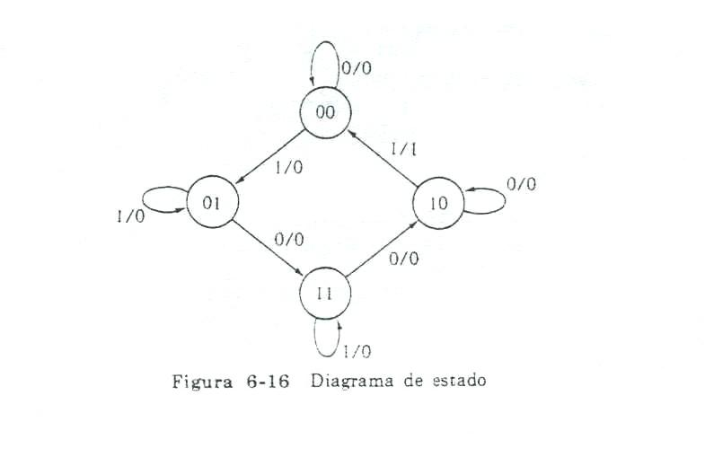

Tablas de Excitación

Cada tabla consiste en dos columnas, Q (t) y Q (t + 1), y una columna para cada entrada para mostrar
cómo se logra la transición requerida (o cambio de estado). Hay cuatro transiciones posibles del
presente estado al siguiente. Las condiciones de entrada requeridas para cada una de las cuatro se
derivan de la información disponible en la tabla característica (o tabla de funcionamiento). El
símbolo X en las tablas representa la condición de no importa, es decir, no importa que la entrada
sea 1 ó 0.

## BIESTABLES

Son los elementos de memoria que se usan en los circuitos secuenciales temporizados. Estos circuitos
son celdas binarias capaces de almacenar un bit de información. Un circuito flip – flop tiene dos
salidas, una para el valor normal y uno para el valor complemento del bit almacenado en él. La
información binaria puede entrar a un flip – flop en una gran variedad de formas, hecho que da lugar
a diferentes tipos de flip – flop.

Un circuito flip – flop puede mantener un estado binario en forma indefinida aún luego de que las
entradas pasen a un estado inactivo, hasta que se cambie por una señal de entrada para cambiar
estados. La diferencia principal entre los diversos flip – flop esta en el número de entradas que
poseen y en la manera en la cual las entradas afectan el estado binario.

**Flip – Flop:** se llama así porque el sonido de las memorias de las maquinas viejas eran
compuertas de biestables electromecánicos (relais). Circuito que conduce o no conduce.

Características

- El flip-flop es un sistema con dos estados estables (0 o 1 **estados binarios**). A cada
  representación del estado se le asigna una función. El estado es una situación interna del
  circuito. El estado de un circuito esta determinado por los valores que los biestables puedan
  estar en ese momento.
- La salida de un flip – flop queda determinada tanto por las entradas actuales como por la historia
  de las mismas.
- El circuito del flip-flop puede recordar o almacenar un BIT de información binaria.
- El flip-flop tiene dos señales de salida, de las cuales una es el complemento de la otra.
- El flip – flop se mantiene en uno de los estados, mientras no sea exitado por señal alguna.
- La mayoría de los flip – flop tienen entradas de impulso y salidas de nivel.

Según en qué instante pueden actuar sus entradas y cambiar de estado (y en correspondencia cambiar
el valor de sus salidas), los flip – flops pueden ser:

**Asincrónico:** sus entradas pueden actuar en cualquier instante para cambiar el estado del
circuito, y en conformidad cambiar el valor de sus salidas.

**Sincrónico:** sus entradas pueden actuar sobre el estado del circuito sólo en determinados
instantes, definidos en relación a pulsos que llegan por otra entrada de sincronismo conocida como
reloj o “clock”. La entrada CP o CLK recibe pulsos de sincronismo que son generados por lo general a
una frecuencia regular por algún tipo de oscilador, de donde viene el nombre “reloj”.

## Flip – Flop RS Flip – Flop JK

## Flip – Flop D Flip – Flop T

Flip – Flop M-S

Tipos

_Elementos biestables elementales:_ poseen dos estados posibles en los cuales permanecen.

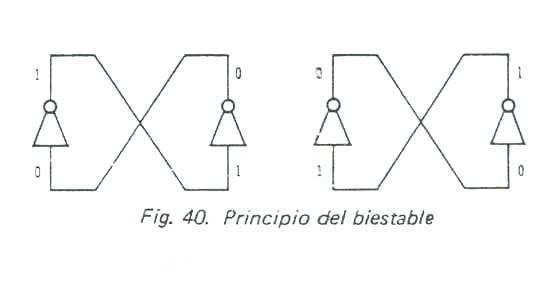

## FLIP-FLOP RS

Un circuito flip – flop puede construirse con dos compuertas NAND o dos compuertas NOR. La conexión
de acoplamiento intercruzado de la salida de una compuerta a la entrada de la otra constituye un
camino de realimentación. Por esta razón, los circuitos se clasifican como circuitos secuenciales
asincrónicos.

Este tipo de flip – flop se llama RS acoplado directamente o bloqueador SR. El biestable dispone de
2 entradas S (set) y R (reset) y de dos salidas Q y Q’, donde una es el complemento de la otra, y se
les trata como salidas normales y de complemento respectivamente.

Supongamos que la entrada de puesta a uno (set) es 1 y que la entrada de puesta a cero (reset)
sea 0. Como la compuerta 2 tiene una entrada de 1, su salida Q’ debe ser 0, lo cual coloca ambas
entradas de la compuerta 1 a 0 para tener la salida Q como 1. Cuando la entrada de puesta a uno
(set) vuelva a 0, las salidas permanecerán iguales ya que la salida Q permanece como 1, dejando una
entrada de la compuerta 2 en 1. De la misma manera es posible demostrar que un 1 en la entrada de
puesta a cero (reset) cambia la salida Q a 0 y Q’ a 1. Cuando la entrada de puesta a cero cambia a
0, las salidas no cambian.

Cuando se aplica un 1 a ambas entradas de puesta a uno y puesta a cero ambas salidas Q y Q’ van a 0,
esta condición viola el hecho de que estas salidas deben ser complementos entre sí; por lo tanto,
este estado es indefinido y debe evitarse.

S = SET: puesta a 1

R = RESET: puesta a 0

El circuito RS con compuertas NAND trabaja a la inversa del anterior, es decir, cuando se aplica un
0 en la entrada de puesta a uno, pone a uno al flip – flop; y un 0 en R pone a cero el flip – flop.
Cuando las dos entradas sean 0, el estado del flip – flop es indefinido.

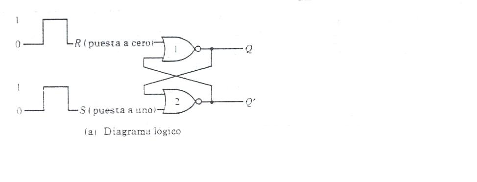

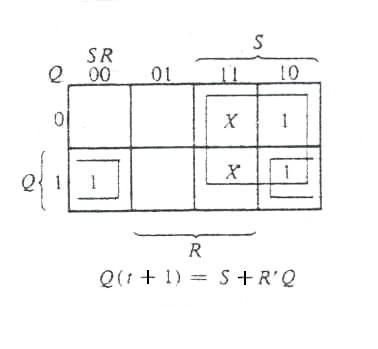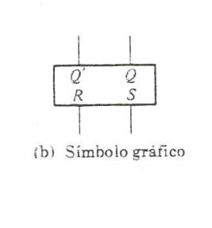

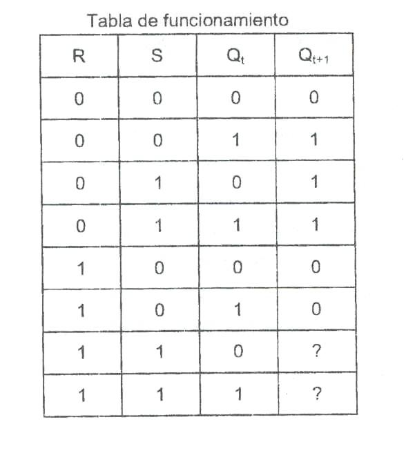

Esta tabla denominada tabla de excitación que consiste en definir qué valor debe ingresar por las
entradas del biestable para que un cierto cambio de estados sea posible:

|                       |                          |     |     |                                                                                                                                                                                                                                                                     |
| --------------------- | ------------------------ | --- | --- | ------------------------------------------------------------------------------------------------------------------------------------------------------------------------------------------------------------------------------------------------------------------- |
| **Q****t** | **Q** **t+1** | R   | S   | Explicación                                                                                                                                                                                                                                                         |
| 0                     | 0                        | X   | 0   | Observando la tabla de funcionamiento se verifica que hay dos situaciones en que se verifica este cambio de estado: en ambos casos por S ingresa un 0 y por R puede ingresar 1 o 0. Esto implica que independientemente del valor de R(x) por S debe ingresar un 0. |
| 0                     | 1                        | 0   | 1   | Observando la tabla de funcionamiento se verifica que hay una sola situación en que se verifica este cambio de estado: Cuando por R ingresa un 0 y por S ingresa un 1.                                                                                              |
| 1                     | 0                        | 1   | 0   | Ocurre lo mismo que en el caso anterior, es decir, hay una sola situación, donde por R ingresa un 1 y por S ingresa un 0.                                                                                                                                           |
| 1                     | 1                        | 0   | X   | Para este hay dos situaciones en que se verifica este cambio de estado: en ambos casos por R ingresa un 0 y por S puede ingresar un 1 o 0. Esto implica que independientemente del valor de S(x) por R debe ingresar un 0.                                          |

Otras Consideraciones

El tiempo requerido para que una señal se propague desde las entradas de una compuerta lógica hasta
sus salidas no es nulo, existe un cierto retardo Δt que representa el tiempo de propagación a través
de la compuerta. Para el análisis, el retardo suele considerarse acumulado a la salida de la
compuerta, como se indica en la figura. El retardo no se indica en los circuitos, pero su presencia
está implícita.

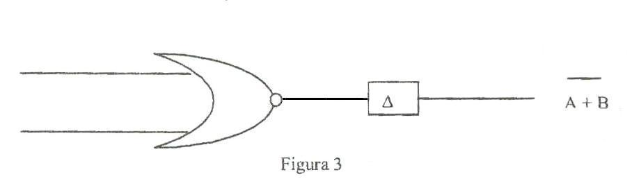

El tiempo de propagación a través de la compuerta NOR afecta el funcionamiento de un flip – flop.
Supongamos un circuito biestable RS cuando se aplica un 1 en la entrada S y un 0 por R, la salida Q’
adopta el valor 0 luego de un tiempo Δt, lo que hace que la salida Q adopte el valor 1 luego de un
retardo igual a 2Δt.

Como resultado de este tiempo de propagación finito (no nulo), durante un pequeño instante de tiempo
Δt ambas salidas adoptan el valor 0, lo que no corresponde desde el punto de vista lógico. Esta
situación se soluciona mediante la configuración conocida como maestro – esclavo.

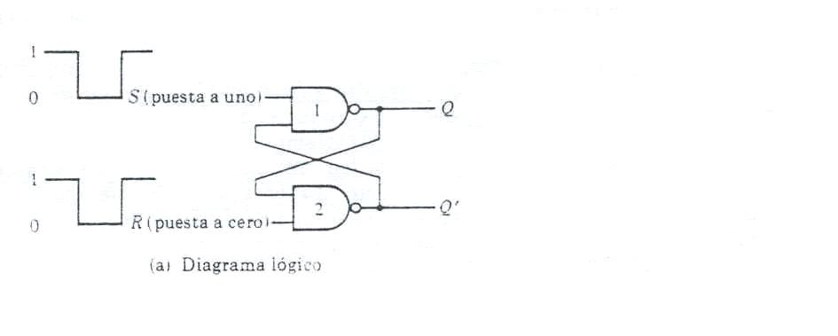

## FLIP-FLOP RS SINCRONICO

Con el objeto de lograr una sincronización controlada de los circuitos de lógica secuencial, se
suele incorporar una señal de sincronismo o reloj, con la cual cada circuito se sincroniza a sí
mismo para aceptar cambios de sus entradas en instantes determinados. Un circuito de reloj produce
una secuencia continua de ceros y unos, como se muestra en la figura.

Se define como **frecuencia** de señal de reloj a la inversa de su período. Para un período de 25
ns/ciclo, la frecuencia correspondiente es de 1/25 ciclos/ns, lo que corresponde a 40 millones de
ciclos por segundo 40 Mhz (1ns = 10-9 seg)

El uso de una señal de sincronismo permite la eliminación de riesgos por medio de la creación de un
circuito biestable sincrónico que incluye una entrada CP (clock pulse) como señal de sincronismo.

El flip – flop RS con reloj consta de un flip – flop básico NOR y dos compuertas AND. Las salidas de
las 2 compuertas AND permanecen en 0 en tanto que el pulso de reloj (clock pulse) sea 0 sin importar
los valores de entrada de R y S. Cuando el CP va a 1, se permite que la información de las entradas
S y R lleguen al flip – flop básico. El estado de puesta a uno se logra con S = 1, R = 0 y CP = 1 y
para puesta a cero S = 0, R = 1 y CP = 1. Cuando S = 1 y R = 1, la ocurrencia de un pulso de reloj
provoca que ambas salidas momentáneamente sean 0. Cuando el pulso se elimina, el estado del
flip-flop es indeterminado, esto es, puede resultar cualquier estado.

Este flip – flop tiene 3 entradas S, R y CP; la entrada CP no se escribe sino que se simboliza con
un triángulo, que denota el hecho de que el flip –flop responde a una transición del reloj. El
estado del flip – flop se determina del valor de su salida normal Q, para obtener el complemento de
la salida normal, no es necesario usar un inversor ya que el valor complementado se obtiene
directamente de la salida Q’.

**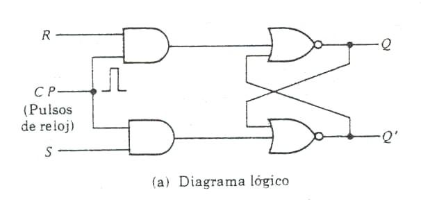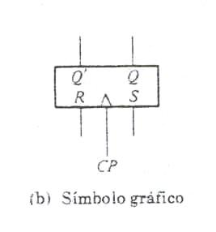**

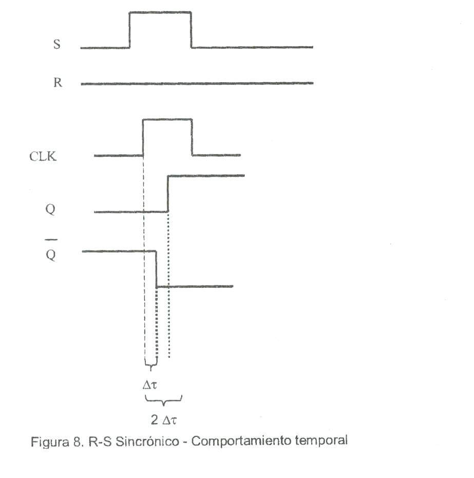

## FLIP-FLOP D

Es una modificación del flip – flop básico RS con reloj. Las compuertas NOR 1 y 2 forman el flip –
flop básico y las compuertas 3 y 4 las modifican para conformar el flip – flop RS sincronizado. La
entrada D va en forma directa a la entrada S, y su complemento se aplica a la entrada R. La
diferencia que tiene este flip – flop con el RS con reloj es que, en el RS para almacenar un 1 o un
0, hace falta aplicar un 1 a una de sus entradas y un cero a la otra, lo que no ocurre con el flip –
flop D ya que las entradas R y S están conectadas a través de un inversor. Dicho de otra manera,
cuando D = 1 y CP = 1, el flip – flop se pone a uno, y cuando D = 0 y CP = 1, el flip – flop se pone
a cero.

Este flip - flop recibe su denominación por la habilidad de transferir “datos” a u flip – flop. Es
básicamente un flip – flop RS con un inversor en R. El inversor agregado reduce el número de
entradas de dos a uno. Este flip -flop se llama algunas veces bloqueador D con compuertas o flip –
flop de bloque. La entrada CP con frecuencia recibe la designación de variable G (Gate o compuerta)
para indicar que esta entrada habilita el flip – flop de bloqueo para hacer posible la entrada de
información dentro del flip-flop.

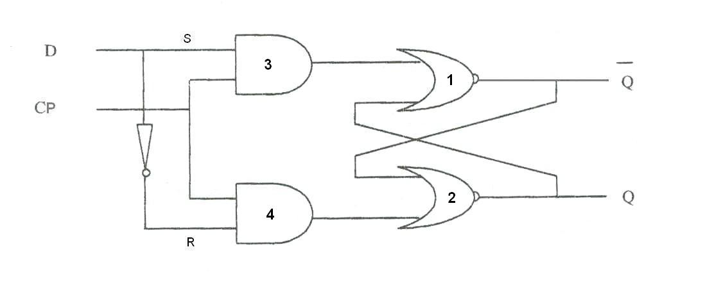

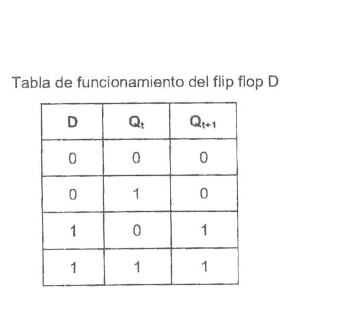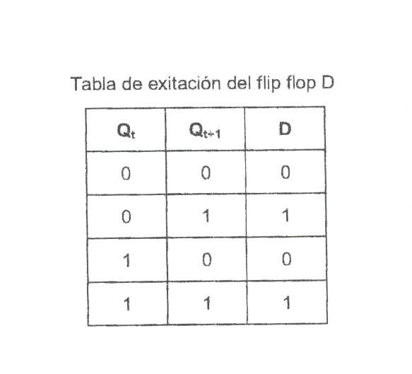

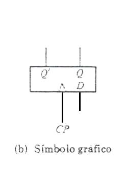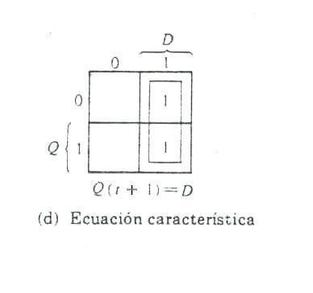

## FLIP-FLOP JK

Un flip – flop JK es un refinamiento del flip – flop RS ya que el estado indeterminado del tipo RS
se define en el tipo JK. Las entradas J y K se comportan como las entradas S y R para poner a uno o
cero al flip – flop (en este flip – flop, la letra J se usa para la entrada de puesta a uno y la
entrada K para la entrada de puesta a cero). Cuando se aplican señales de entrada en forma
simultanea a J como a K, es decir cuando ambas son 1, el flip – flop cambia a su estado de
complemento, o sea, si Q = 1 cambia a Q = 0 y viceversa.

La salida Q se aplica con K y CP a una compuerta AND de tal manera que el flip – flop se ponga a
cero (clear) durante un pulso de reloj solamente si Q fue 1 previamente. De manera similar la salida
Q’ se aplica con J y CP a una compuerta AND de tal manera que el flip – flop se ponga a uno con un
pulso de reloj, solamente si Q’ fue 1 previamente.

Cuando J y K sean 1, el pulso de reloj se transmite a través de una compuerta AND solamente; es
decir, si Q = 1 la salida de la compuerta AND superior se convertirá en 1 una vez que se aplique el
pulso de reloj y el flip – flop se pondrá a cero. Si Q’ = 1 la salida de la compuerta AND inferior
se convierte en 1 y el flip – flop se pone a uno. En cualquier caso el estado de salida del flip –
flop se complementa, cuando J y K sean 1.

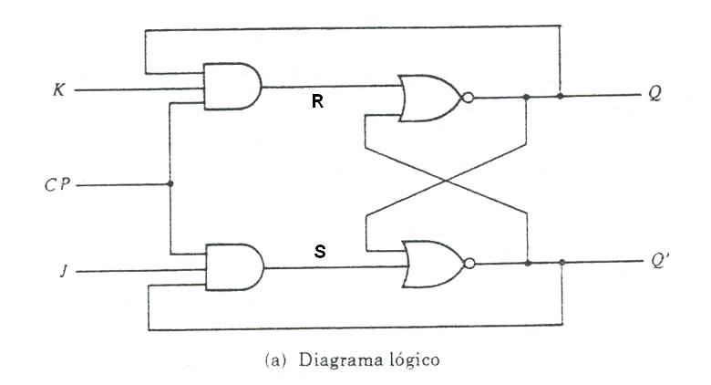

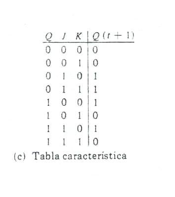**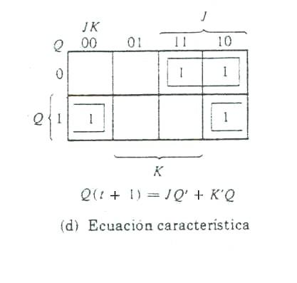**

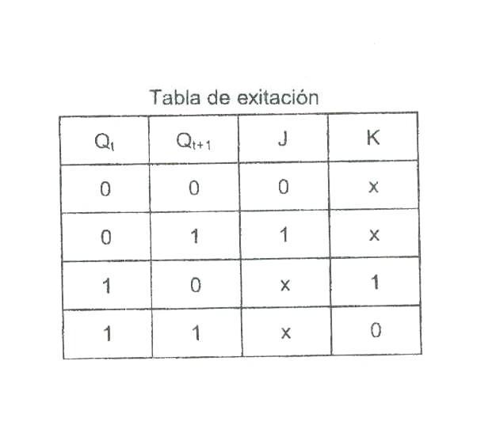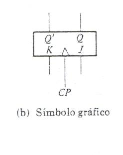

## FLIP-FLOP T

El flip – flop T es una versión de una sola entrada del flip – flop JK. El flip – flop T se obtiene
de un tipo JK a la cual se le unen las dos entradas. La denominación T proviene de la habilidad del
flip – flop para “conmutar” (del termino ingles: toggle), o cambiar de estado. Independientemente
del presente estado del flip – flop, este asume el estado de complemento cuando ocurre el pulso de
reloj mientras que la entrada T esté en lógica 1.

Es decir, que este biestable mantiene su estado si por la entrada ingresa un 0 y complementa el
estado si por la entrada ingresa un 1.

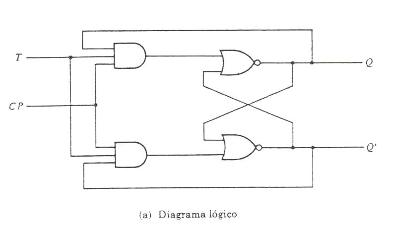

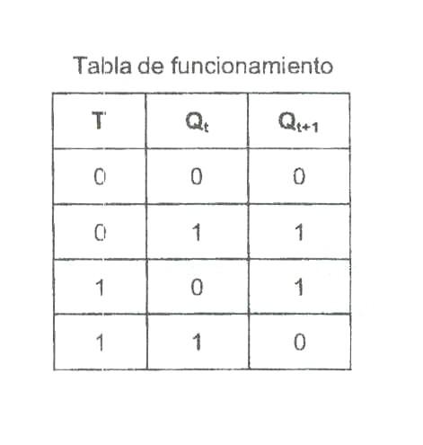**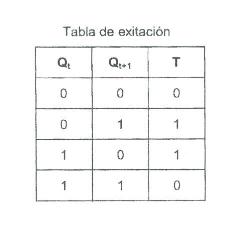**

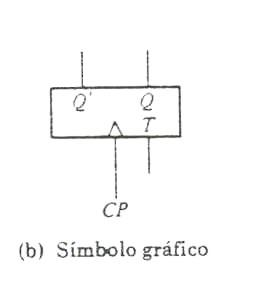**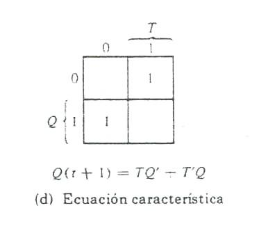**

FLIP-FLOP Maestro – Esclavo

Un flip-flop maestro esclavo se construye con dos flip – flops separados. Un circuito sirve como
maestro y el otro como esclavo y el circuito completo se conoce como un flip – flop maestro esclavo.
Este consiste en un flip – flop maestro, un flip – flop esclavo y un inversor. Cuando el pulso de
reloj CP es 0, la salida del inversor es 1. Como el pulso de entrada de reloj del esclavo es 1, el
flip – flop se habilita y la salida Q es igual a Y mientras que Q’ se iguala a Y’. El flip – flop
maestro se inhabilita debido a que CP = 0. Cuando el pulso de reloj se convierte en 1, la
información en las entradas externas R y S se transmiten al flip – flop maestro. El flip – flop
esclavo sin embargo, se aísla por el intervalo en que el pulso esté en un nivel 1, ya que la salida
del inversor es 0. Cuando el pulso regresa a 0, el flip – flop maestro se aísla, lo cual previene
que las entradas externas lo afecten. El flip – flop esclavo irá al mismo estado que el maestro.

Las relaciones de tiempo mostradas en la figura ilustran la secuencia de eventos que ocurren en un
flip – flop maestro esclavo. Asúmase que el flip – flop está en el estado de puesta a cero antes de
la ocurrencia de un pulso, de tal manera que Y = 0 y Q = 0.

Supongamos que las entradas sean S = 1 y R = 0, cuando el pulso de reloj pasa de 0 a 1, el flip –
flop maestro se pone a uno y conmuta Y a 1. El flip – flop esclavo no se afecta debido a que su CP
es 0. Cuando el pulso de reloj regrese a 0, la información del maestro se permite pasar al esclavo
haciendo la salida externa Q = 1.

Hay que tener en cuenta que la entrada S puede cambiarse al mismo tiempo que el pulso va a través de
la transición de un flanco negativo. Esto se debe a que una vez que CP alcance el 0, el maestro se
inhabilita y sus entradas R y S no tienen influencia hasta que el siguiente pulso de reloj ocurra.
Entonces, en un flip – flop maestro esclavo, es posible variar la salida y la información de entrada
con el mismo pulso de reloj. Puede ocurrir por ejemplo que la entrada S venga de la salida de otro
flip – flop maestro esclavo que fuera conmutado con el mismo pulso de reloj.

Algunos flip – flops maestro esclavo cambian los estados de salida en la transición del flanco
positivo de los pulsos de reloj, esto se debe a que el inversor del CP esta puesto en el flip – flop
maestro.

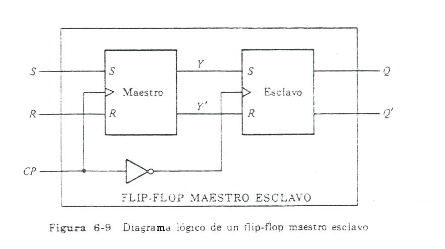

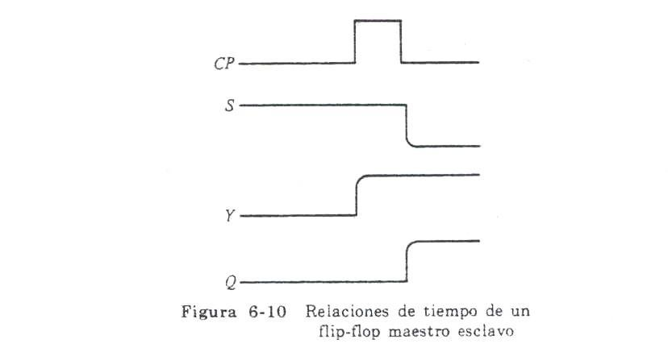

La combinación maestro esclavo puede construirse para cualquier tipo de flip-flop agregando un
flip-flop RS temporizado con un reloj invertido para formar un esclavo. La figura muestra un flip –
flop JK maestro esclavo que consiste en 2 flip – flops; las compuertas 1 hasta 4 forman el flip –
flop maestro y las compuertas 5 hasta 8 el flip – flop esclavo. La diferencia con el anterior es que
esta construido con compuertas NAND. El CP de este flip – flop maestro esclavo funciona de la misma
manera que el anterior.

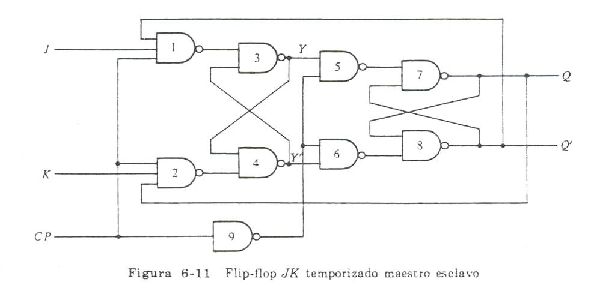

Se dice que un flip – flop es **activado por nivel** cuando puede cambiar sus estados en forma
continua cuando la señal de reloj esta en su estado activo (alto o bajo, según como se haya
diseñado).

Un flip – flop es **activado por flanco** cuando solo cambia en una transición creciente o
decreciente de la señal de reloj.

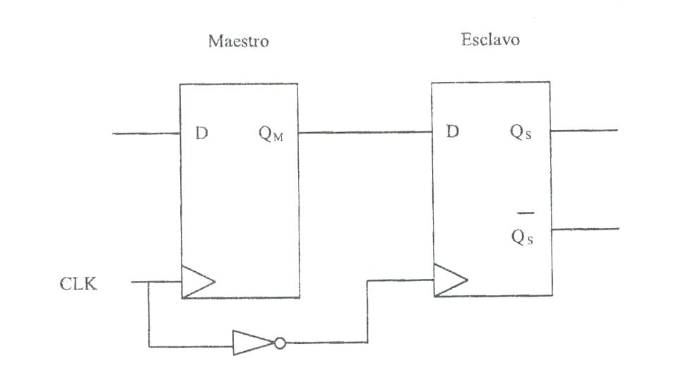

El Monoestable

Es un sistema de 2 estados con solo una posición estable. Bascula bajo el efecto de un impulso de
entrada y retorna seguidamente a su posición de equilibrio.

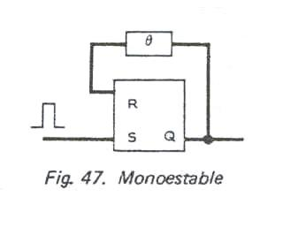

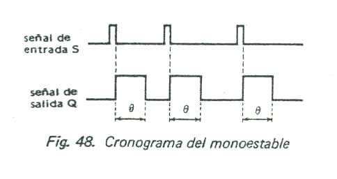

El estado estable es el estado 0, que bajo la influencia de un impulso S el biestable pasa a 1, lo
que a su vez posiciona la entrada R a 1: el sistema vuelva al estado de equilibrio. La temporización
θ permite ajustar la duración de la señal de salida

**Bascula (Cambia de estado)**

La báscula es un sistema de 2 estados, ninguno de ellos estable. Puede realizarse uniendo las 2
entradas de un biestable JK.

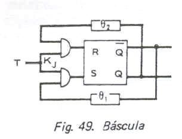

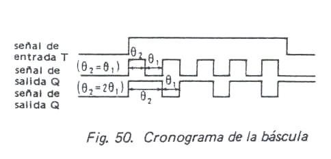

Mientras se tenga a 1 la entrada T, la báscula cambia constantemente de estado y el ritmo de cambio
depende del tiempo de respuesta de los circuitos. Este ritmo es ajustable mediante las
temporizaciones θ1 y θ2. Pueden utilizarse las básculas para realizar relojes
que dan un tren de impulsos regularmente espaciados.

## REGISTROS

Son elementos de memoria de almacenamiento temporal de información, instrucciones y datos, durante
el procesamiento. A una orden procedente en general de la unidad de control, una información puede
ser transferida de un registro a otro, sin que se altere el contenido del primero. Se denomina
registro a un conjunto de biestables que funcionan como unidad, permitiendo almacenar información en
el transcurso de un proceso.

Un registro es un grupo de celdas de almacenamiento binario capaz de retener información binaria que
actúan en conjunto para cumplir con cierta función. Como una celda almacena un bit de información,
se desprende que un registro de n celdas puede almacenar cualquier cantidad discreta de información
que contenga n bits. Un registro de n bits tiene un grupo de n flip – flops y tiene la capacidad de
acumular cualquier información binaria que contiene n bits.

El estado de un registro es un número enésimo de unos o ceros con cada bit indicando el estado de
una celda en el registro. Más claramente, un registro de n celdas puede estar en uno de los
2n estados posibles. El contenido de un registro, es una función de la interpretación
dada a la información almacenada en él.

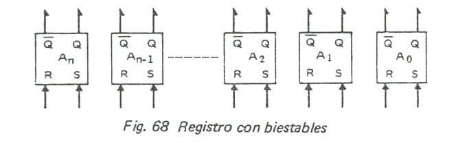

Además de los flip – flops, un registro puede tener compuertas combinacionales que ejecutan ciertas
tareas de procesamiento de datos, es decir, que las compuertas controlan cuando y como se transfiere
la nueva información al registro.

Un registro puede almacenar uno o más elementos discretos de información, pero la misma
configuración de bits puede ser interpretada, de manera diferente para diferentes elementos de
información. Los registros de un sistema digital son designados por letras mayúsculas (algunas veces
seguidas de números) para denotar la función del registro. Tal es el caso del registro de palabra de
memoria RPM. Las celdas o flip – flops de un registro de n bits se numeran en secuencia desde 1 a n
(o desde 0 hasta n-1) comenzando desde la izquierda o desde la derecha. La forma más común e
representar un registro es por medio de un rectángulo con el nombre del registro dentro de él
(Figura a). Las celdas individuales pueden ser distinguidas como en la Figura b, cada celda con su
respectiva letra y número suscrito.

**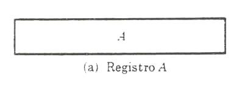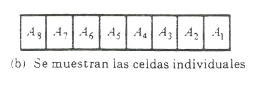**

**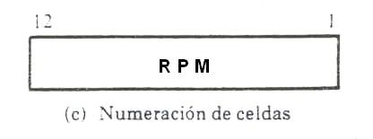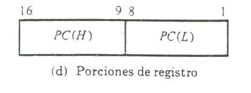**

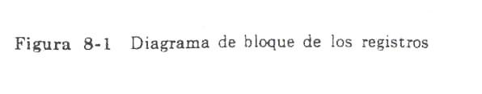

La numeración de las celdas de derecha a izquierda puede ser marcada en la parte superior del
rectángulo como en el registro RPM de 12 bits en la Figura c. Un registro de 16 bits se divide en
dos partes en Figura d. Los bits de 1 a 8 se designan por medio de la letra L (LOW) y los bits 9 a
16 se les asigna la letra H (HIGH). El nombre del registro de 16 bits es PC. El símbolo PC (H) se
refiere a las 8 celdas de mayor orden y PC (L) se refiere a las 8 de menor orden. En algunos casos
los paréntesis se utilizan para definir una porción del registro y en otras para hacer referencia al
contenido del registro.

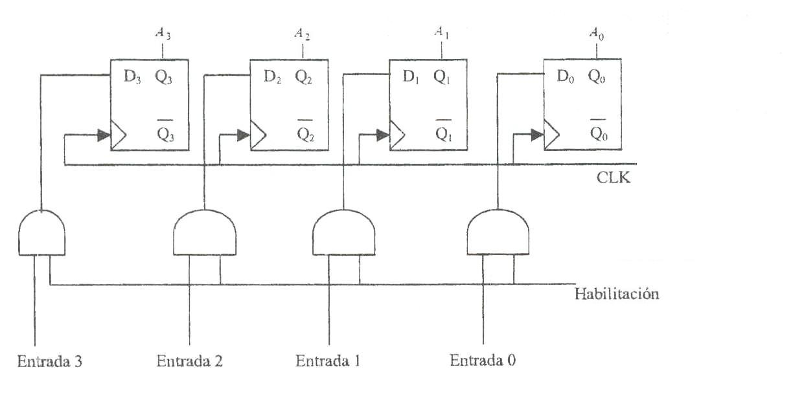

## Operaciones elementales sobre los registros

1. Un registro puede limpiarse o ponerse a cero, enviándole un impulso por la entrada R de cada
   biestable. (ver figura 69)

2. El contenido de un registro puede complementarse, enviándole un impulso por la entrada C (de
   complemento) de cada biestable (ver figura 69). Para complemento a la base -1 se toma los Q**’**.

3. El contenido de un registro puede desplazarse a izquierda o a la derecha.

4. El contenido de un registro puede incrementarse o decrementarse.

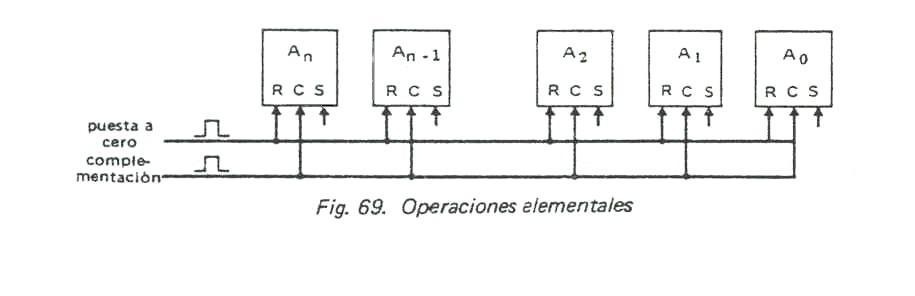

**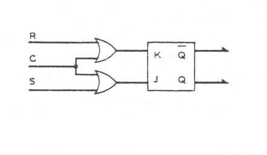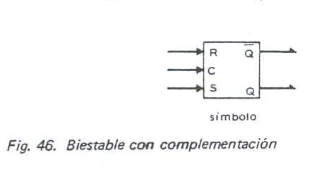**

Operaciones entre registros

1. Transferir el contenido de un registro a otro.

2. Sumar o restar el contenido de un registro con el contenido de otro.

Registros de Desplazamiento

Es un registro capaz de desplazar su información binaria hacia la izquierda o hacia la derecha. La
configuración lógica de un registro de desplazamiento consiste en una cadena de flip – flops
conectados en cascada, con la salida de un flip – flop conectado a la entrada del siguiente. Todos
los flip – flops reciben un pulso de reloj común el cual causa el desplazamiento de un estado al
siguiente. La salida Q de un flip – flop dado, se conecta a la entrada S, mientras que la salida Q’
a la entrada R, del flip – flop a la derecha (en caso de desplazamiento a derecha). Cuando se
trabaja con flip – flop D, la salida Q va conectado a la entrada D, del flip – flop de la derecha.

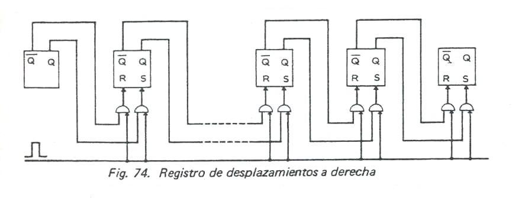

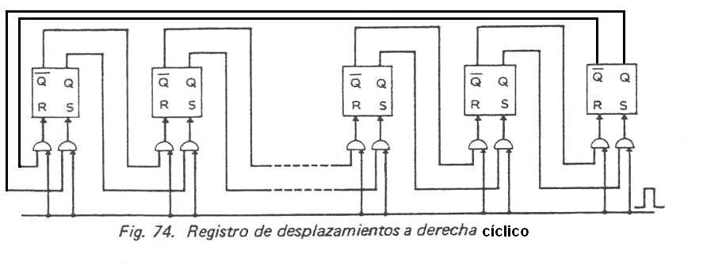

Transferencia entre Registros

Una operación de transferencia entre registros es una operación básica en sistemas digitales y
consiste en la transferencia de la información almacenada de un registro a otro.

Por medio de una flecha se indica la transferencia de información, de un registro a otro, y también
indica la dirección de la misma. Por lo tanto, la siguiente expresión designa un reemplazo del
contenido de A por lo contenido en B.

A B

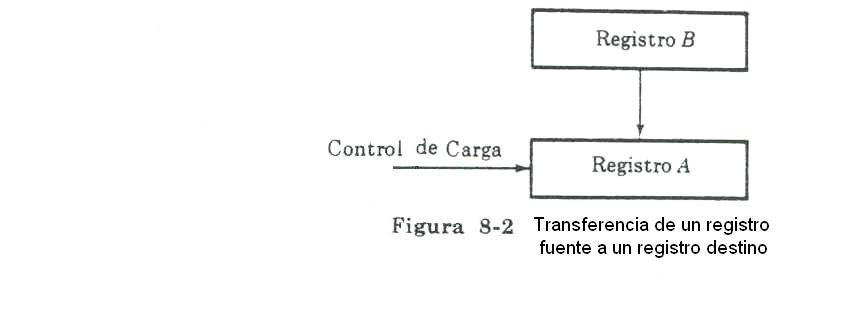

Por definición, lo contenido en el registro fuente B no cambia después de la transferencia.

Esta proposición que especifica una transferencia entre registros implica que los circuitos están
conectados entre las salidas del registro fuente hasta las celdas de entrada del registro destino.
Las salidas del registro B se conectan a las entradas del registro A, y el número de líneas en esta
condición es igual al número de bits en los registros. El registro A debe tener una entrada de
control de carga de tal manera que pueda habilitarse cuando la señal de carga sea igual a 1.

Considérese las siguientes 2 proposiciones:

C A

C B

La conexión de 2 registros fuente al mismo registro de destino no puede hacerse directamente, pero
requiere un circuito multiplexor para seleccionar entre 2 caminos posibles. Para registros con 4
bits cada uno, se necesita un multiplexor de 2 a 1 líneas cuádruple, como se verá en una figura en
el tema multiplexores. También se podrá ver otro ejemplo en el tema buses en la parte de memoria.

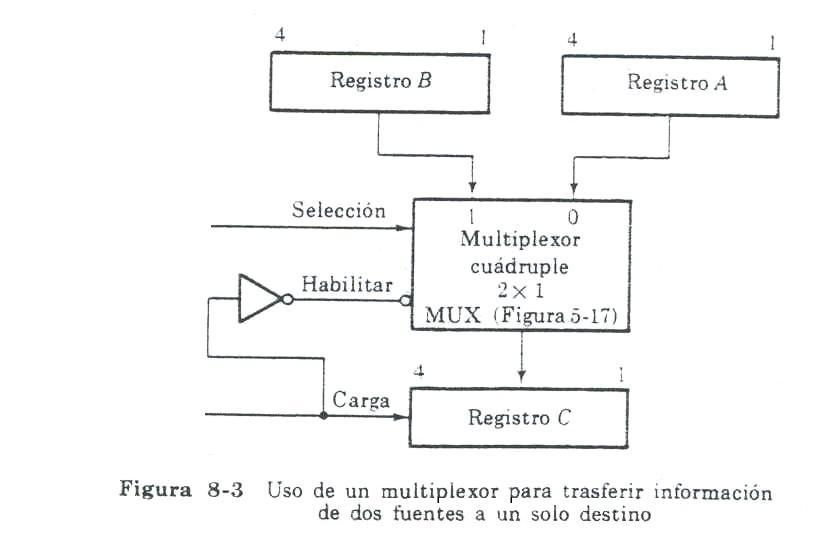

## Transferencia en Serie entre Registros

Se dice que un sistema digital opera en modo serie cuando la información se transfiere y se manipula
un bit en cada pulso de reloj. El contenido de un registro se transfiere a otro desplazando los bits
de un registro al siguiente. La información se transfiere bit a bit, uno cada vez desplazando los
bits del registro fuente hacia el registro de destino. La transferencia en serie de la información
del registro A al registro B se hace con registros de desplazamiento. La salida serial (SO) del
registro A va a la entrada serial (SI) del registro B.

Para prevenir la pérdida de información almacenada en el registro fuente, al registro A se le hace
circular su información conectando la salida serial a su terminal de entrada serial, como
consecuencia de esto el registro A tiene desplazamiento cíclico a derecha. En cambio, el contenido
inicial del registro B es desplazado hacia afuera a través de su salida serial y se pierde a no ser
que se desplace a un tercer registro de desplazamiento. La entrada de control de desplazamiento, en
forma conjunta con los pulsos de reloj, determina cuándo y cuántas veces se desplazan los registros.
Los computadores pueden operar en modo serie, en paralelo o una combinación de ambas.

La diferencia entre los modos de operación en serie o en paralelo son: en el modo en paralelo, la
información es disponible de todos los bits del registro y todos los bits pueden ser transferidos
simultáneamente durante un pulso de reloj; en el modo en serie, los registros tienen una entrada en
serie sencilla y una salida en serie sencilla y por lo tanto, la información se transfiere bit a
bit, un bit cada vez mientras que los registros se desplazan en la misma dirección. Las operaciones
en serie son más lentas debido al tiempo que se demora en transferir la información hacia adentro y
hacia fuera de los registros de desplazamiento; sin embargo los computadores en serie requiere menos
materiales para ejecutar operaciones porque un circuito común puede usarse una y otra vez para
manipular los bits que salen del registro de desplazamiento de una manera secuencial.

El intervalo de tiempo entre los pulsos de reloj se llama el **tiempo del bit** y el tiempo
necesario para desplazar todo el contenido del registro de desplazamiento se llama **tiempo de
palabra**. La mayoría de los computadores operan en un modo en paralelo ya que este es un modo más
rápido de operación.

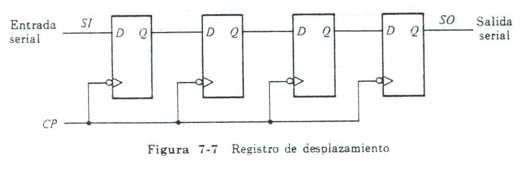

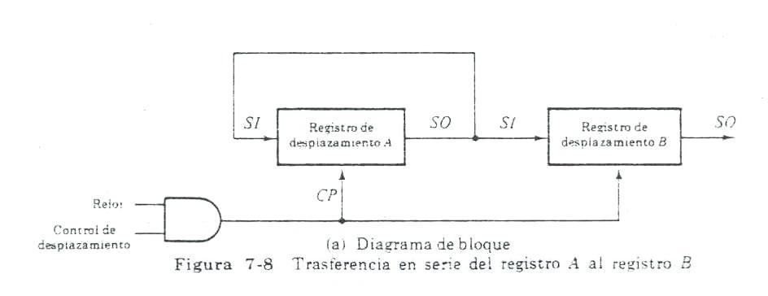

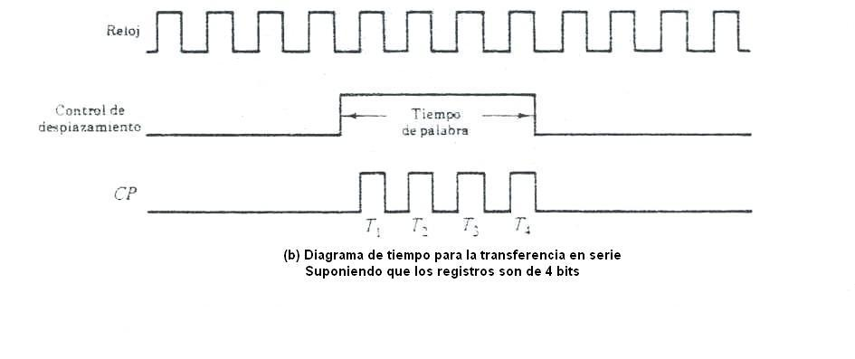

## Transferencia en Paralelo entre Registros

Puede transferirse la información de un registro B a otro A, bien por dos impulsos sucesivos, uno de
puesta a cero, el otro de transferencia de los 1 (figura a), bien por introducción forzada de los 0
y de los 1 (figura b y c).

**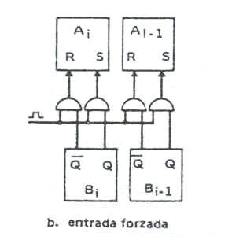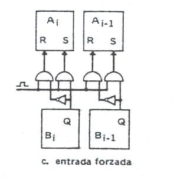**

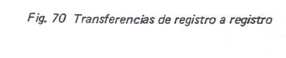

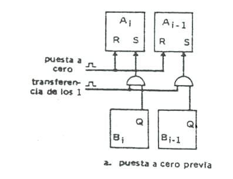

Registro con Carga en Paralelo

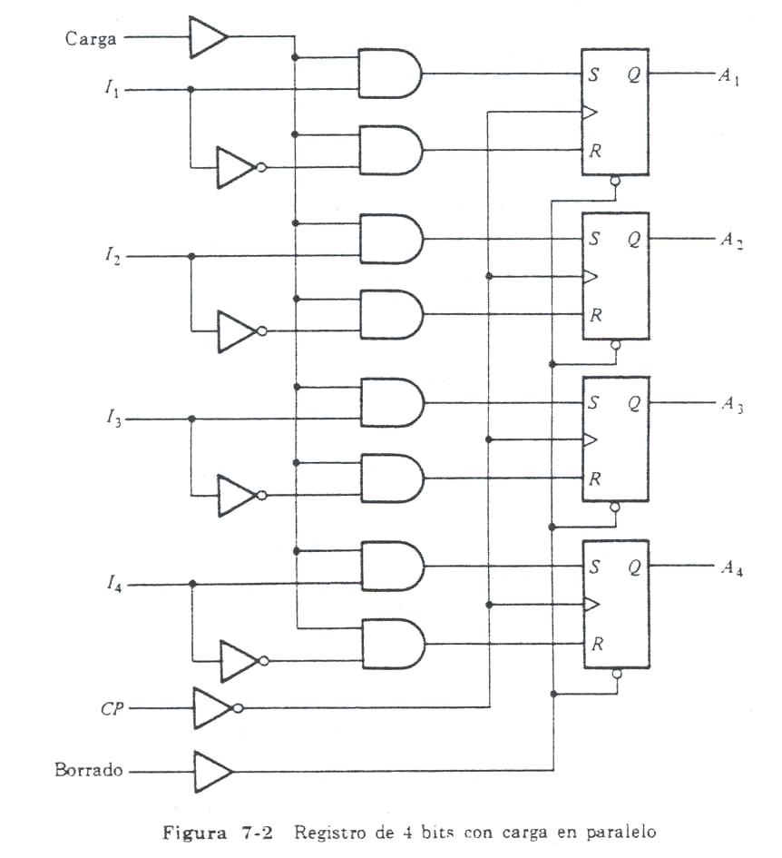

La transferencia de nueva información a un registro se denomina como la carga del registro. Si todos
los bits del registro se cargan simultáneamente con un solo pulso de reloj, se dice que la carga se
hace en paralelo. Esto quiere decir, que cuando el CP va a 1, la información se carga al registro.
Si CP permanece en 0, el contenido del registro no cambia.

El terminal de carga sería una señal habilitadora, mientras que el terminal de borrado funciona como
puesta a cero de los flip – flops del registro antes de realizar cualquier operación. Esto decir,
cuando el terminal de borrado va a 0, todos los flip – flops se borran asincrónicamente. Así, el
valor de la entrada se transfiere al registro, si el terminal de carga (Carga) y el terminal de
borrado (Borrado) están en 1, y el pulso de reloj pasa de 1 a 0.

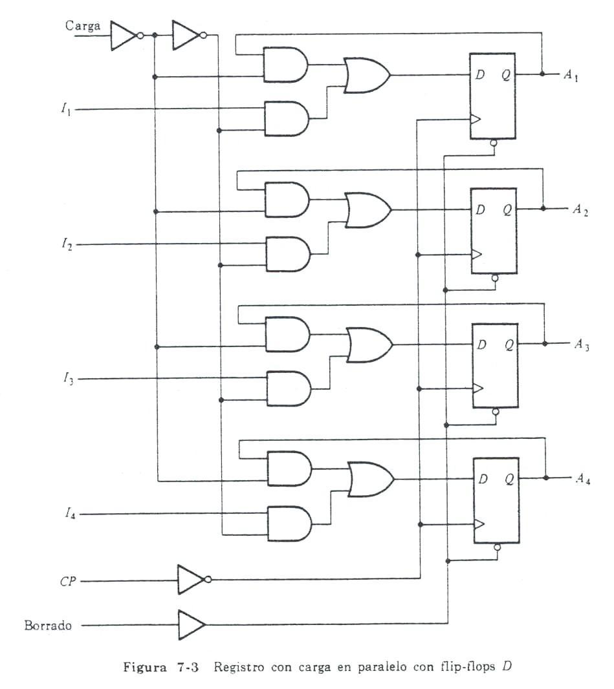

La conexión de realimentación en cada flip – flop es necesaria cuando se usa el tipo de flip – flop
D ya que no tiene una condición de entrada de **“no cambio”**. Para dejar la salida sin cambiar, es
necesario hacer la entrada D igual a la salida Q en cada flip – flop.

Registros de Desplazamiento Bidireccional con Carga en Paralelo

Un registro capaz de desplazar hacia la izquierda y hacia la derecha se llama **registro de
desplazamiento bidireccional**. En cambio, un registro que puede desplazarse solamente en una
dirección se llama **registro de desplazamiento unidireccional**.

Características que tiene el siguiente registro:

1. Un control de borrado para llevar el registro a 0.
2. Una entrada o terminal CP para sincronizar con los pulsos de reloj todas las operaciones.
3. Un control de desplazamiento a la derecha para habilitar dicha operación, y las líneas de entrada
   y salida en serie asociadas con este tipo de desplazamiento.
4. Un control de desplazamiento a la izquierda para habilitar dicha operación, y las líneas de
   entrada y salida en serie asociadas con este tipo de desplazamiento.
5. Un control de carga en paralelo para habilitar una transferencia en paralelo y las n líneas de
   entrada asociadas con la transferencia en paralelo.
6. n líneas de salida en paralelo.
7. Un estado de control que deja la información sin variar en el registro aunque los pulsos de reloj
   se apliquen continuamente.

Los 4 multiplexores que aparecen en la figura son parte del registro. Cuando las dos variables de
selección s1 s2 = 00, selecciona la entrada 0, si s1 s2
= 01 selecciona la entrada 1, y así sucesivamente. Las entradas s1 y s2
controlan el modo de operación del registro como se especifica en la tabla.

<table>
<tbody>
<tr>
<td colspan="2">Control de modo</td>
<td rowspan="2">Operación de Registro</td>
</tr>
<tr>
<td>S1</td>
<td>S2</td>
</tr>
<tr>
<td>0</td>
<td>0</td>
<td>No cambio</td>
</tr>
<tr>
<td>0</td>
<td>1</td>
<td>Desplazar derecha</td>
</tr>
<tr>
<td>1</td>
<td>0</td>
<td>Desplazar izquierda</td>
</tr>
<tr>
<td>1</td>
<td>1</td>
<td>Carga en paralelo</td>
</tr>
</tbody>
</table>

En lugar de flip – flops D, se pueden utilizar RS siempre y cuando se coloque un inversor entre los
terminales S y R.

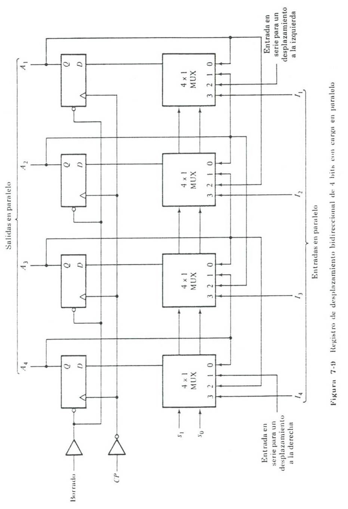

Contador

Es un registro (circuito secuencial) que pasa por una secuencia predeterminada de estados después de
la aplicación de pulsos de entrada. Esta secuencia es creciente y es almacenada en dicho registro
cada vez que se excite. Las compuertas en un contador se conectan de tal manera que se produce una
secuencia preestablecida de estados binarios en el registro.

Los pulsos de entrada, pueden ser pulsos de reloj, o ellos pueden originarse en una fuente externa y
pueden ocurrir en intervalos establecidos de tiempo o aleatoriamente. En un contador, la secuencia
de estados puede seguir una cuenta binaria, que es la más simple y directa, o cualquier otra
secuencia de estados. Un contador que sigue la secuencia binaria se llama **contador binario**.

Un contador de n bits consiste en n flip – flops y puede contar de 0 hasta 2n – 1. La
única entrada al circuito puede ser el pulso de cuenta, o bien, una entrada de habilitación.
Mientras que las salidas se especifican directamente con los estados presentes de los flip – flops.

El siguiente estado del contador depende enteramente de su estado presente y la transición de estado
ocurre cada vez que ocurre un pulso de reloj. Debido a esta propiedad, un contador puede
especificarse por medio de una lista de secuencia de cuenta, es decir, la secuencia de los estados
binarios que se le suceden. Esto es muy importante ya que la secuencia de cuenta da toda la
información necesaria para diseñar el circuito.

Otra cosa que se debe tener claro, es que la secuencia de cuenta del contador se **repite** una vez
que se haya alcanzado el último valor, de tal manera que el estado 000 es el estado siguiente
después de 111. Los contadores binarios se construyen más eficientemente con flip – flops T (o JK
con J y K unidas).

Para un contador BDC cuenta la secuencia binaria desde 0000 hasta 1001 y regresa a 0000 para repetir
la secuencia. Otros contadores pueden seguir una secuencia arbitraria, la cual puede no ser la
binaria.

Los contadores se usan para contar el número de ocurrencias de un evento y se usan para generar
secuencias de tiempo para controlar las operaciones en un sistema digital.

<table>
<tbody>
<tr>
<td colspan="3">Secuencia de cuenta</td>
<td colspan="3">Entradas del flip - flop</td>
</tr>
<tr>
<td>A2</td>
<td>A1</td>
<td>A0</td>
<td>TA2</td>
<td>TA1</td>
<td>TA0</td>
</tr>
<tr>
<td>0</td>
<td>0</td>
<td>0</td>
<td>0</td>
<td>0</td>
<td>1</td>
</tr>
<tr>
<td>0</td>
<td>0</td>
<td>1</td>
<td>0</td>
<td>1</td>
<td>1</td>
</tr>
<tr>
<td>0</td>
<td>1</td>
<td>0</td>
<td>0</td>
<td>0</td>
<td>1</td>
</tr>
<tr>
<td>0</td>
<td>1</td>
<td>1</td>
<td>1</td>
<td>1</td>
<td>1</td>
</tr>
<tr>
<td>1</td>
<td>0</td>
<td>0</td>
<td>0</td>
<td>0</td>
<td>1</td>
</tr>
<tr>
<td>1</td>
<td>0</td>
<td>1</td>
<td>0</td>
<td>1</td>
<td>1</td>
</tr>
<tr>
<td>1</td>
<td>1</td>
<td>0</td>
<td>0</td>
<td>0</td>
<td>1</td>
</tr>
<tr>
<td>1</td>
<td>1</td>
<td>1</td>
<td>1</td>
<td>1</td>
<td>1</td>
</tr>
</tbody>
</table>

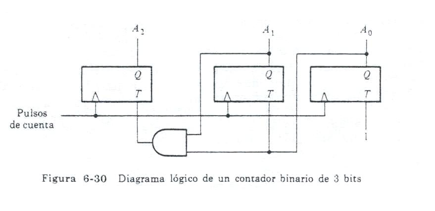

Contadores de Impulsos

Son registros cuyo contenido se incrementa en 1 cada vez que se presenta un impulso a la entrada de
cuenta. Son capaces de contar el número de impulsos recibidos. Trabaja de la siguiente manera: el
impulso ataca al biestable de menor peso posicional.

Si esta a cero, debe pasar a 1; si está a 1, debe pasar a 0, pero debe propagar el impulso al
biestable inmediato con objeto de tomar en cuenta el arrastre. Por consiguiente, el biestable debe
ser complementado en todos los casos y debe propagarse el impulso solamente en aquellos casos en que
el biestable estaba a 1 antes de la complementación (condición para que haya arrastre).

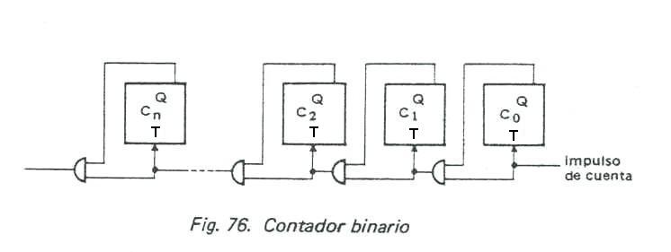

Contador Binario Creciente – Decreciente

Un contador binario con una cuenta invertida se llama contador binario decreciente. En este contador
la cuenta binaria se disminuye en 1 con cada pulso de cuenta de entrada. La cuenta de un contador
decreciente de 4 bits comienza con el binario 15 y continúa con las cuentas binarias 14, 13, 12,…, 0
para pasar de nuevo a 15. El circuito de la figura 7-18 funcionará como un descontador binario si
las salidas se toman de los terminales complementados Q’ de todos los flip – flops. Es decir, si al
circuito 7-18 le sacamos todas las compuertas OR, las compuertas AND (conectadas a la salida normal
Q) y la entrada creciente; para el primer flip – flop de menor orden conectamos la entrada
decreciente directamente al flip – flop en la entrada T y para los demás conectamos la salida de una
compuerta AND a la entrada T de su correspondiente flip – flop.

Una lista de una secuencia de cuenta de un contador binario decreciente muestra que el bit de menor
orden debe ser complementado con cada pulso de cuenta. Cualquier otro bit en la secuencia es
complementado, si el bit previo de menor orden va de 0 a 1. Por lo tanto, podemos decir que cuando Q
va de 0 a 1, Q’ irá de 1 a 0 y se complementará el siguiente flip – flop como se requiere.

En un contador binario sincrónico creciente – decreciente el flip – flop en la posición de menor
orden se complementa con cada pulso. Un flip – flop en cualquier otra posición se complementa con un
pulso siempre y cuando todos los bits de menor orden sean iguales a cero. Un contador capaz de
contar hacia arriba o hacia abajo se muestra en la figura. Los flip – flops T empleados en este
circuito pueden considerarse como flip – flops JK con los terminales J y K unidos entre sí.

Cuando la entrada de control **creciente** es 1, el circuito cuenta hacia arriba, ya que las señales
de T se determinan a partir de los valores previos de las salidas normales de Q.

Cuando la entrada del control **decreciente** es 1, el circuito contará hacia abajo, ya que las
salidas complementadas Q’ determinan los estados de las entradas T. Cuando ambas señales creciente y
decreciente son 0, el registro no cambia de estado pero permanece en la misma cuenta.

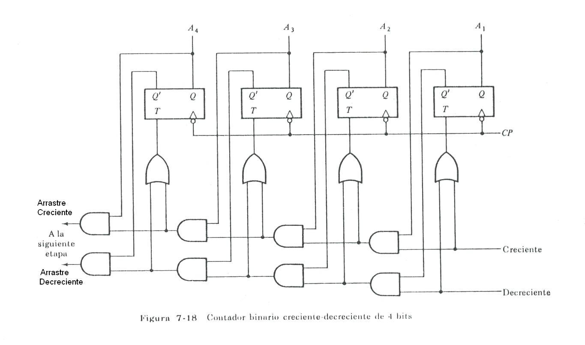

El Contador Decimal

Un contador decimal sigue una secuencia de diez estados, es decir, que cuenta desde 0000 a 1001 y
regresa a 0000 después de la cuenta de 1001 (9(10). Debido al regreso a 0 después de la
cuenta de 9, un contador BDC no tiene un patrón regular como el contador binario directo. Tal
contador debe tener por lo menos 4 flip – flops para representar cada dígito decimal, ya que en este
caso utilizamos el código BDC para representar los dígitos decimales.

El contador BDC de la de la figura es un contador en década, ya que cuenta de 0 hasta 9. El
siguiente impulso deberá devolver el contenido de la década a cero y generar un impulso de arrastre
hacia la próxima década de mayor orden. Hay que tener en cuenta que los términos del 10 al 15 se
toman como términos de no importa, estos términos los podríamos utilizar en el mapa para obtener un
circuito más simplificado. Para contar en decimal desde 0 hasta 99 se necesitan 2 contadores en
década. Para contar desde 0 a 999 se necesitan 3 contadores en década. Los contadores multidécada
pueden construirse conectando los contadores BDC en cascada, uno para cada década.

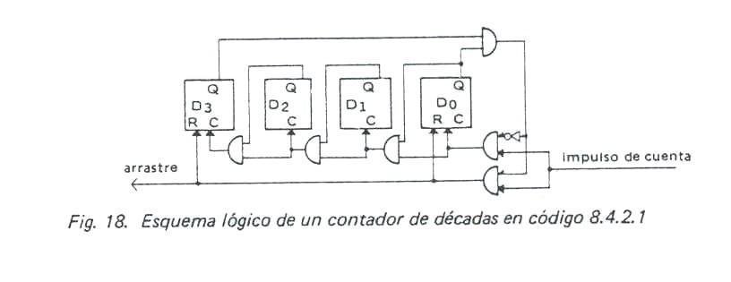

Contador Binario con Carga en Paralelo

Los contadores usados en los sistemas digitales a menudo requieren una condición de carga en
paralelo para transferir un número binario inicial antes de la operación de conteo. La figura
muestra el diagrama lógico de un registro que tiene una característica de carga en paralelo y puede
operar también como un contador. La entrada de control de carga, cuando es igual a 1, inhabilita la
secuencia de cuenta y causa la transferencia de datos I1 hasta I4 a los flip –
flops A1 hasta A4 respectivamente.

Si la entrada de carga es 0 y la entrada del control de cuenta es 1, el circuito opera como un
contador. Los pulsos de reloj causan entonces cambios del estado de los flip – flops de acuerdo a la
secuencia de cuenta binaria. Si ambas entradas de control son 0, los pulsos de reloj no cambian el
estado del registro.

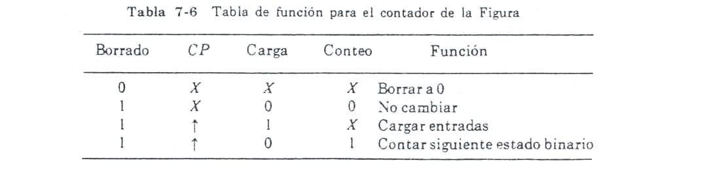

El terminal de salida del arrastre se convierte en 1 si todos los flip – flops son iguales a 1
mientras se habilita la entrada de cuenta. Esta es una condición para complementar los flip – flops
que almacenan el bit siguiente de mayor orden. Esta salida es útil para expandir el contador a más
de 4 bits.

Cuando la entrada de borrado es 0, causará que el contador sea puesto a cero, independientemente de
la presencia de los pulsos de reloj de otras entradas. Esto se indica en la tabla por medio de las
entradas X, las cuales simbolizan las condiciones de no importa para las otras entradas, bien sea
que su valor sea 0 ó 1. La entrada de borrado debe ir al estado de 1 para las operaciones
temporizadas listadas en las siguientes entradas en la tabla. Con las entradas de carga y cuanta
iguales a 0, las salidas no cambian bien sea aplique un pulso en el terminal CP o no. Un contador
con carga en paralelo puede ser usado para generar cualquier número deseable de secuencias de
cuenta.

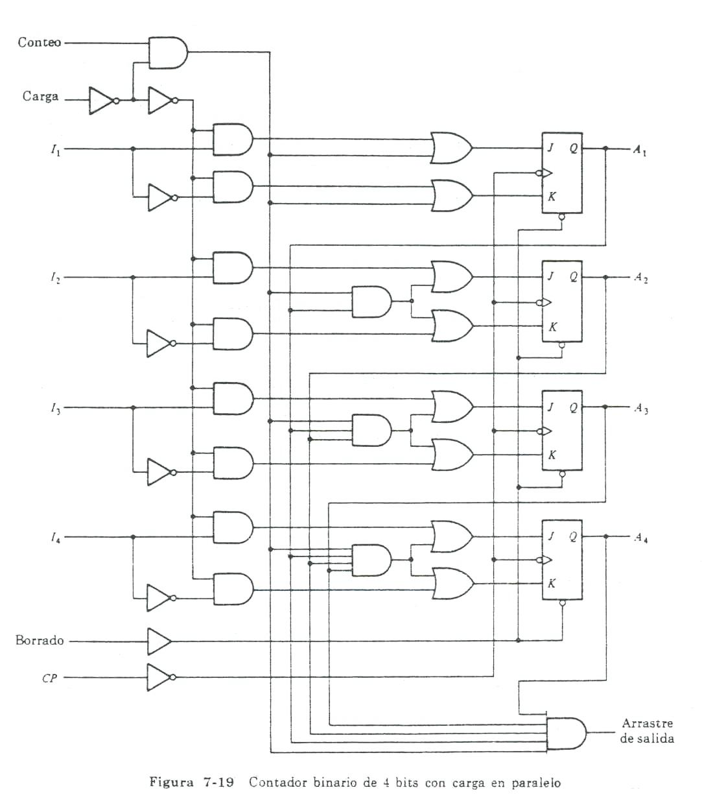

Un contador de N módulos (abreviado en inglés mod N) es un contador que pasa por una secuencia
repetida de N cuentas. Por ejemplo, un contador binario de 4 bits es un contador de 16 módulos (mod
– 16 counter). Un contador BDC es un contador de 10 módulos.

## Contador de Programa

El contador de programa almacena la dirección de la siguiente instrucción para ser leída de la
memoria. Este registro pasa por una secuencia de conteo paso a paso y causa que el computador lea
instrucciones sucesivas almacenadas previamente en la memoria.

Cuando el programa llama una transferencia a otro lugar con el fin de evitar la siguiente
instrucción en secuencia, se modifica el contador de programa al mismo tiempo, causando que el
programa continúe a partir de un lugar de memoria que está fuera de la secuencia de conteo. Para
leer una instrucción, el contenido del contador de programa se transfiere al MAR y se inicia la
operación de lectura. El contador del programa incremente siempre en 1 mientras que la operación de
escritura de memoria lee la instrucción presente. Por tanto, la dirección de la siguiente
instrucción, mayor una unidad que la que está siendo ejecutada en el procesador, está siempre
disponible en el contador de programa.

**Registro de Dirección de Memoria y Registro Separador de Memoria**

El registro de dirección de memoria, MAR (o registro de selección), se usa para direccionar lugares
de memoria específicos. Como cada palabra de memoria tiene una identificación, para comunicarse con
una palabra de memoria específica, su número de localización o dirección se transfiere al registro
de direcciones. El MAR se carga del contenido del contador del programa cuando una instrucción se va
a leer de la memoria (iniciándose un ciclo de lectura de memoria) y de los 12 bits menos
significativos del registro B, cuando un operando se va a leer de la memoria.

Los circuitos internos de la unidad de memoria aceptan esta dirección del registro de y abren los
caminos necesarios para seleccionar la palabra buscada. Un registro de dirección con n bits puede
especificar hasta 2n palabras de memoria.

La información transferida hacia adentro y afuera de los registros en la memoria y al ambiente
externo, se comunica a través de un registro común llamado registro separador de memoria (registro
de palabra, registro de información y registro de almacenamiento).

El registro separador de memoria B almacena la palabra leída o escrita en la memoria.

Cuando la unidad de memoria recibe una señal de control de escritura, el control interno interpreta
el contenido del registro separador como la configuración de bits de la palabra que se va a
almacenar en un registro de memoria. Con una señal de control de lectura, el control interno envía
la palabra del registro de memoria al registro separador. En cada caso el contenido del registro de
direcciones especifica el registro de memoria particular referenciado para escritura o lectura.

Por ejemplo, considérese una memoria de 1.024 palabras de 8 bits por palabra. Para especificar 1.024
palabras, se necesita una dirección de 10 bits, ya que a 210 = 1.024. Por lo tanto, el
registro de direcciones debe contener 10 flip – flops. El registro separador de memoria debe tener 8
flip – flops para almacenar los contenidos de las palabras transferidas hacia adentro y afuera de la
memoria. La unidad de memoria tiene 1.024 registros con números asignados desde 0 hasta 1.023.

La secuencia de operaciones necesarias para comunicarse con la memoria para propósitos de transferir
una palabra hacia fuera dirigida al MBR es:

1. Transferir los bits de dirección de la palabra seleccionada al MAR.
2. Activar la entrada de control de lectura.

Como resultado, la información binaria almacenada hasta el presente en el registro de memoria se
transfiere al MBR.

La secuencia de operaciones necesarias para almacenar una nueva palabra a la memoria es:

1. Transferir los bits de dirección de la palabra seleccionada al MAR.
2. Transferir los bits de datos de la palabra al MBR.
3. Activar la entrada de control de escritura.

El resultado de la operación de escritura, muestra que los bits de datos del MBR se almacenan en el
registro de memoria.

Otras Consideraciones:

La parte de operación de una palabra de instrucción colocada en B, se transfiere al registro I
(Instrucción) y la parte de la dirección se deja en el registro B para ser transferida al MAR. Una
palabra de operando colocada en el registro B se hace accesible para operación con el registro A. La
palabra que va a ser almacenada en la memoria debe ser cargada al registro B antes de iniciar una
operación de escritura.

Registro Acumulador

Algunas unidades procesadoras separan un registro de otros y se le llama registro **acumulador**,
abreviado AC o registro A. El nombre de este registro se deriva del proceso de adición aritmética
que se encuentra en los computadores digitales.

El registro acumulador en una unidad de proceso es un registro procesador o multipropósito que opera
con datos previamente almacenados en la memoria. Este registro se usa para ejecutar la mayoría de
instrucciones, es decir, es capaz de realizar no solamente la microoperación de suma sino también
otras microoperaciones de la misma forma. De hecho, las compuertas asociadas con un registro
acumulador suministran todas las funciones digitales encontradas en un ALU. La figura muestra el
diagrama de bloque de una unidad procesadora que emplea un registro acumulador.

También se utiliza para aceptar datos del dispositivo de entrada o transferir datos al dispositivo
de salida. En algunos casos toda la unidad procesadora es justamente el registro acumulador y la ALU
asociado, y algunas veces se suele incluir al registro B. Aunque la mayoría de los sistemas
procesadores de datos incluyen más registros para la unidad procesadora, se ha escogido incluir
solamente un acumulador, para no complicar el diseño.

Es posible configurar solamente la operación de suma con un simple acumulador con elemento
aritmético. Otras operaciones aritméticas tales como sustracción, multiplicación y división pueden
ser configuradas con una secuencia de instrucciones que forman una subrutina.

El registro en sí puede funcionar como un registro de desplazamiento bidireccional con carga en
paralelo para suministrar las microoperaciones de desplazamiento. La entrada B suministra una fuente
de información externa. Esta información puede provenir de otros registros procesadores o
directamente de la memoria principal del computador.

El proceso de sumar muchos números se lleva a cabo almacenando inicialmente esos números en otros
registros procesadores o en la unidad de la memoria del computador y borrando el acumulador a 0. Los
números se agregan al acumulador 1 a 1 en orden consecutivo. El primer número se agrega a 0 y la
suma se transfiere al acumulador. El segundo número se agrega a los contenidos del acumulador y la
suma formada de nuevo remplaza su valor previo. Este proceso continúa hasta que todos los números se
agregan y se forma la suma total. Así el registro “acumula” la suma paso a paso haciendo sumas
secuenciales entre un número nuevo y la suma acumulada previamente.

El registro A suministra la otra fuente de información a la ALU por el terminal A. El resultado de
una operación se transfiere de nuevo al registro A y se remplaza su contenido previo. La salida del
registro A puede ir a un destino externo o a los terminales de entrada de otros registros
procesadores o unidad de memoria.

Para formar la suma de dos números almacenados en los registros procesadores, es necesario
agregarlos en el registro A usando la siguiente secuencia de microinstrucciones:

T1: A 0 borrar A

T2: A A + R1 Transferir R1 a A

T3: A A + R2 Agregar R2 a A

El registro A se borra primero. El primer número en R1 se transfiere al registro A agregando al
actual contenido de ceros de A. El segundo número en R2 se agrega al valor presente de A. La suma
formada en A debe usarse para otros cálculos o puede ser transferida a su destino requerido.

Diseño del Acumulador

El registro A y el circuito combinacional asociado constituyen un circuito secuencial. El circuito
combinacional remplaza a la ALU pero no puede separarse del registro ya que éste es solamente la
parte del circuito combinacional del circuito secuencial.

Las entradas externas al acumulador son las entradas de datos de B y las variables de control que
determinan las microoperaciones del registro. El acumulador es similar a los registros que
desplazan, cargan en paralelo y cuentan, pero es más general ya que éste puede realizar no solamente
las funciones anteriores sino también otras operaciones de procesamiento de datos. Las
microoperaciones incluidas en un acumulador dependen de las operaciones que deben incluirse en el
procesador particular.

Se presentará el diseño de un acumulador con 9 microoperaciones, cabe aclarar que se puede extender
este registro para que realice otras microoperaciones. El conjunto de microoperaciones para el
acumulador se listan en la tabla. Las variables de control p1 hasta p9 son
generadas por los circuitos lógicos de control y deben ser consideradas como funciones de control
que inician las operaciones correspondientes de transferencia entre registros.

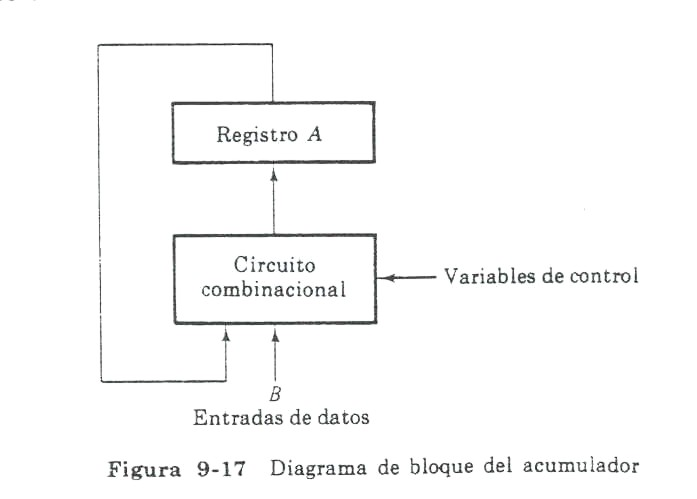

El registro A es un registro fuente de todas las microoperaciones listadas.

El registro B se usa como un segundo registro fuente para microoperaciones que necesitan dos
operandos. El registro B se asume que está conectado al acumulador y suministra las entradas al
circuito secuencial.

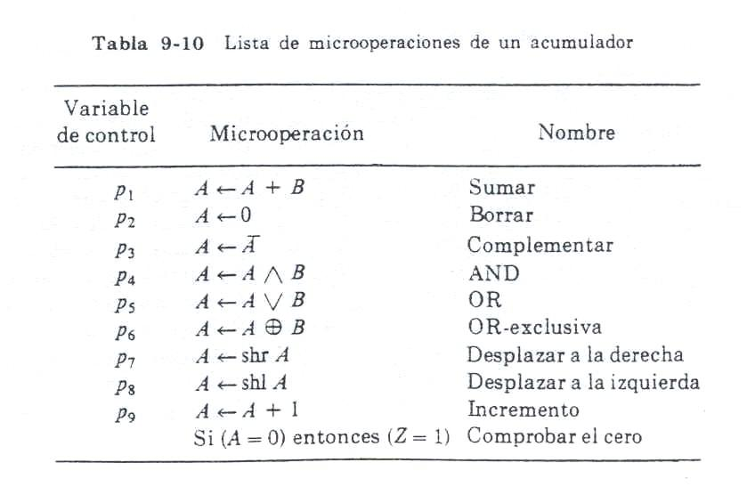

El registro destino para todas las microoperaciones es siempre el registro A. La nueva información
transferida a A constituye el siguiente estado del circuito secuencial. Las nueve variables de
control se consideran también como entradas al circuito secuencial. Estas variables son excluyentes
mutuamente y solamente una variable debe ser habilitada cuando ocurre un pulso de reloj. La última
entrada que figura en la tabla es una declaración de control condicional. Esta produce un 1 binario
en una variable de salida Z, cuando el contenido del registro A es 0, es decir, cuando los flip –
flops del registro están borrados.

El acumulador consiste en n etapas y n flip – flops A1, A2,..., An
numeradas consecutivamente comenzando desde la posición de la extrema izquierda.

Es conveniente la partición del acumulador en n etapas similares compuesta cada una de un flip –
flop denotado como Ai, una entrada de datos denotada por Bi y la lógica
combinacional asociada con el flip – flop. En el procedimiento de diseño se considera solamente una
etapa típica i teniendo en cuenta que un acumulador de n bits consiste de n etapas para i = 1, 2,…,
n. Cada etapa Ai se interconecta a su etapa Ai-1 vecina a su derecha y a la
Ai+1 a su izquierda. La primera etapa A1 y la última no tienen vecinas de un
lado. Como las microoperaciones son excluyentes y ocurre solamente una en un tiempo dado se puede
tratar separadamente el circuito combinacional una para cada microoperación (después las unimos).

_Explicación de las operaciones:_

**Agregar B a A (p****1****):** La microoperación de suma se inicia cuando la variable de
control p1 es 1. Se puede utilizar un sumador completo en cada etapa i que aceptará como
entradas el estado presente Ai, la entrada de datos Bi y el bit de arrastre
previo Ci. El bit de suma generado con el sumador completo debe ser transferido al flip –
flop Ai y el arrastre de salida Ci+1 debe aplicarse al arrastre de entrada en
la siguiente etapa.

**Borrar (p****2****):** Para borrar todos los flip – flops del registro A simplemente se
aplica la variable de control p2 a la entrada K del flip – flop, mientras la entrada J se
asumirá como cero.

**Complementar (p****3****):** Para complementar aplico la variable de control
p3 sobre las entradas J y K.

**AND (p****4****):** Cuando la variable p4 es 1 se realiza la operación AND
entre Ai y Bi.

**OR (p****5****):** La variable de control p5 inicia la operación OR entre
Ai y Bi.

**OR – Exclusivo (p****6****):** Realiza la operación OR – Exclusivo entre Ai
y Bi.

**Desplazamiento a la derecha (p****7****):** Esta operación desplaza el contenido del
registro A una posición a la derecha.

**Desplazamiento a la izquierda (p****8****):** La inversa del anterior.

**Incremento (p****9****):** Esta operación incrementa el contenido del registro A en
uno, es decir, que se comporta como un contador.

**Comprobación del cero (Z):** La variable Z es una salida del acumulador usado para indicar un
contenido de cero en el registro A. Esta salida es igual 1 cuando todos los flip – flops se hayan
borrado. Para ello se toman la salida complementada Q’ que es igual a 1, si el flip – flop es 0.

Todos los resultados de las microoperaciones deben transferirse nuevamente al registro A. Una etapa
típica del acumulador consiste de todos los circuitos que fueron deducidos para las microoperaciones
individuales. Las variables de control son excluyentes mutuamente de manera que los circuitos
lógicos correspondientes pueden ser con una operación OR.

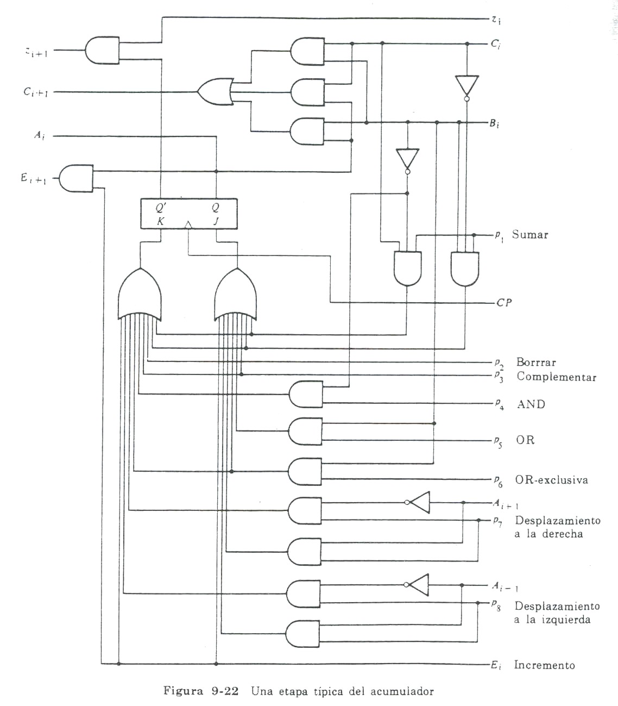

Cada etapa del acumulador tiene ocho entradas de control p1 hasta p8 que
indican una de las 8 microoperaciones posibles. La variable de control p9 se aplica
solamente a la primera etapa para habilitar la operación de incremento a través de la entrada
Ei, hay otras seis entradas en el circuito. Bi es el bit de datos de los
terminales B que suministran las entradas al acumulador. Ci es el arrastre de entrada de
la etapa previa a la derecha. Ai-1 viene de la salida del flip – flop que está una
posición a la derecha y Ai+1 de la izquierda. Ei es el arrastre de entrada
para la operación de incremento y zi se usa para formar la cadena para la detección de
cero (con compuertas AND).

El circuito tiene 4 salidas: Ai es la salida del flip – flop, Ci+1 es el
arrastre para la siguiente etapa, Ei+1 es el arrastre de incremento para la siguiente
etapa y zi+1 es para la siguiente etapa a la izquierda, para formar la famosa cadena de
cero te rompí el agujero.

Un acumulador completo con n bits requiere n estados conectados en cascada con cada etapa
conteniendo el circuito mostrado en la figura anterior. Todas las variables de control excepto
p9 deben ser aplicadas a cada etapa. Las otras entradas y salidas en cada etapa deben
estar conectadas en cascada para formar un acumulador completo. Cada bloque en el diagrama
representa el circuito de la figura anterior. La operación de incremento se habilita con la variable
de control p9 en la primera etapa. Los otros bloques reciben el incremento de arrastre de
la etapa previa.

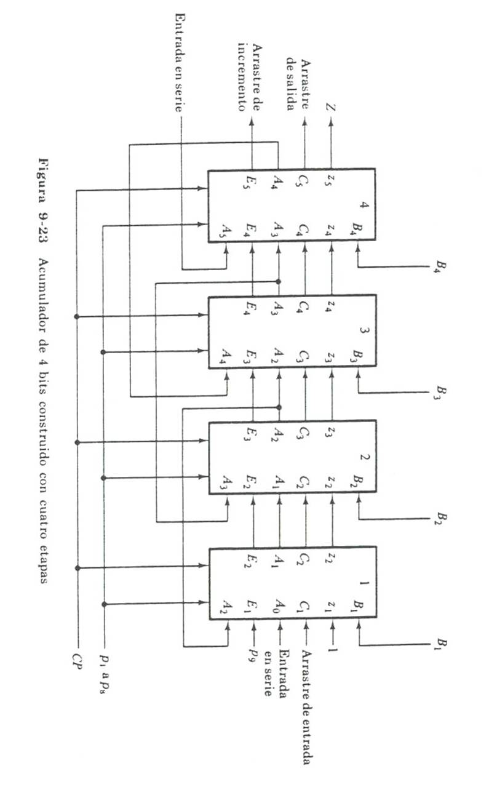

Operaciones de Desplazamiento

El operador de desplazamiento puede estar constituido únicamente por puertas lógicas, en cuyo caso
posee un carácter puramente combinacional. La figura 5 representa un operador de esta clase,
colocado entre dos buses, para realizar desplazamientos circulares.

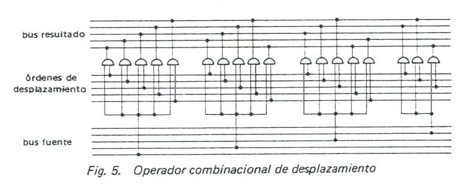

También puede montarse el acumulador como un registro de desplazamiento. En los operadores de las
máquinas pequeñas no puede ejecutarse generalmente más que un desplazamiento elemental (una posición
a derecha o a izquierda) por impulso. A fin de no tener que utilizar una instrucción para cada
desplazamiento elemental, se emplea un descontador de desplazamiento, cargado al principio de la
operación con el número de desplazamientos por efectuar, número que aparece como operando inmediato
en la instrucción. Este contador se ve restado en una unidad a cada impulso de orden de
desplazamiento; la operación se detiene cuando el descontador de desplazamiento llega a cero (figura
6). Es un primer ejemplo de operador secuencial y de su dispositivo de control. En las máquinas más
importantes, el acumulador está cableado de tal manera que puedan ejecutarse desplazamientos de 1,
2, 3,…, k posiciones, a derecha o izquierda, a la recepción de cada impulso de reloj.

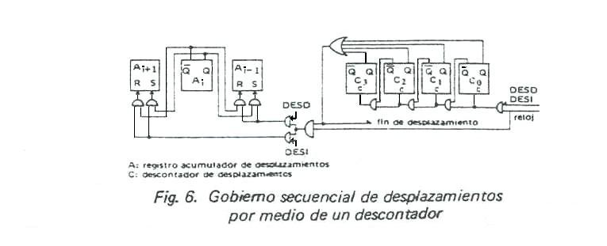

## CIRCUITOS INTEGRADOS

Un circuito integrado (CI) es un cristal semiconductor de silicón, llamado pastilla, que contiene
componentes eléctricos tales como transistores, diodos, resistencias y condensadores. Los diversos
componentes están interconectados dentro de la pastilla para formar un circuito electrónico. Los
circuitos integrados vienen en dos clases de pastillas, la pastilla plana y la pastilla de hilara
doble de patillas. La última es la más usada debido a su bajo costo y fácil instalación en los
circuitos impresos.

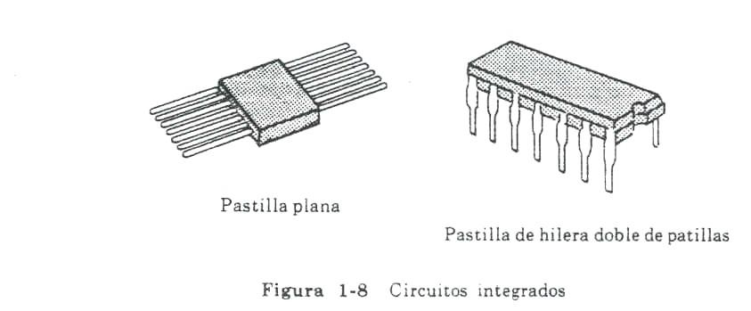

Características

- Tienen una protección que se hace de plástico o cerámica.
- Para identificarlo tienen una designación numérica impresa sobre su superficie.
- Son de bajo costo.
- Tienen bajo consumo de energía.
- Tienen gran confiabilidad de no fallar.
- La velocidad de operación es alta.
- Son de tamaño bastante pequeño y por lo tanto reduce el número de conexiones externas.

Los CI se clasifican en dos categorías generales: lineales y digitales. Los CI lineales operan con
señales continuas para producir funciones electrónicas tales como amplificadores y comparadores de
voltaje. Los CI digitales, operan con señales binarias y se hacen de compuertas digitales
interconectadas.

Unas pocas compuertas en una sola pastilla constituyen un elemento de integración pequeña (SSI).
Para poder calificar como un elemento de integración mediana (MSI) el circuito integrado debe
cumplir una función lógica completa y tener una complejidad de 10 a 100 compuertas.

Un elemento de integración a gran escala (LSI) realiza una función lógica con más de 100 compuertas.
Existe también una integración de muy grande escala (VLSI) para aquellos elementos que contienen
miles de compuertas en una sola pastilla. Estos son algunos de los CI más populares:

|                                                     |       |                                  |                                     |                                                                                                                                                                                                                |                                                                                                                        |
| --------------------------------------------------- | ----- | -------------------------------- | ----------------------------------- | -------------------------------------------------------------------------------------------------------------------------------------------------------------------------------------------------------------- | ---------------------------------------------------------------------------------------------------------------------- |
| Nombre del circuito                                 | Sigla | Velocidad retardo por compuerta  | Potencia por compuerta              | Ventajas                                                                                                                                                                                                       | Problema                                                                                                               |
| Lógica **resistencia transistor**                   | RTL   | 40                               | 20 mW                               | Simple y barato para fabricar. Fácil de interconectar                                                                                                                                                          | Sensible al ruido. Capacidad de salida (Fan-out) baja. Baja densidad de componentes                                    |
| Lógica **diodo transistor**                         | DTL   | 20                               | 8 mW                                | Barata con buen rechazo al ruido, fácil de usar e interconectar                                                                                                                                                | Relativamente de baja velocidad. Baja densidad de componentes.                                                         |
| Lógica **diodo transistor de alto nivel**           | HLDTL | 30                               | 15 mW                               | Tipo especial de DTL hecho para aplicaciones industriales a causa de su alto rechazo al ruido. Fácil de interconectar.                                                                                         | Baja velocidad, disipación de potencia relativamente alta. Baja densidad de componentes.                               |
| Lógica **transistor transistor**                    | TTL   | 4 (1.5 ns para el tipo Schottky) | 10 mW (20 mW para el tipo Schottky) | En el momento el tipo más popular. Fácil de interconectar, rápida, gran variedad de circuitos disponibles. Empaques MSI disponibles, barata.                                                                   | Genera impulsos de ruido, disipación de potencia relativamente alta, densidad de componentes modesta.                  |
| Lógica **transistor transistor de baja densidad**   | LPTTL | 20                               | 1 mW                                | TTL de baja potencia por compuerta, desarrollada para el espacio y otras aplicaciones, fácil de usar e interconectar.                                                                                          | Baja velocidad.                                                                                                        |
| Lógica **acoplada por emisor**                      | ECL   | 0.3                              | 60 mW                               | Altísima velocidad, generando un poco de ruido internamente                                                                                                                                                    | Difícil de interconectar. Baja densidad de componentes. Difícil de enfriar. Más costosa que la TTL.                    |
| Canal-**p, metal óxido semiconductor**              | PMOS  | 50                               | 0.1 mW                              | Baja potencia, buena densidad de componentes, fácil de construir, barata.                                                                                                                                      | Lenta y delicada, tiene una limitada capacidad de manejo y de interconexión con otros tipos de circuitos.              |
| Nombre del circuito                                 | Sigla | Velocidad retardo por compuerta  | Potencia por compuerta              | Ventajas                                                                                                                                                                                                       | Problema                                                                                                               |
| Canal-**n, metal óxido semiconductor**              | NMOS  | 10                               | 0.1 mW                              | Más rápida que la PMOS, baja disipación relativa, buena densidad de componentes, barata y relativamente fácil de fabricar.                                                                                     | Capacidad limitada de manejo y de interconexión con otros tipos de circuitos.                                          |
| Lógica **metal óxido semiconductor complementaria** | CMOS  | 5                                | 10 nW                               | Requiere baja potencia de reposo. Modesta velocidad y densidad de componentes, precio razonable. Considerable resistencia al ruido.                                                                            | Difícil de fabricar. El consumo de potencia aumenta al conmutarse a alta velocidad.                                    |
| Lógica de **inyección integrada**                   | IIL   | 1                                | 0.1 mW                              | Rápida, de baja potencia. Esta concebida básicamente para realizar circuitos de integración de gran escala (como la MOS). Estos circuitos solemos encontrar en microprocesadores y memorias de alta velocidad. | Dificultad de fabricación, formación de compuertas de lógica no convencional. No permite interconexión entre circuitos |

w = vats n = nanos (=10-9) m = mili (=10-3) s = segundos

Los seis primeros tipos de la tabla, se llaman **lógica bipolar**, a causa de la utilización de
transistores convencionales en los CI; los tres tipos finales usan los llamados transistores de
efecto de campo (FET), fabricados usando tecnología metal – óxido – semiconductor (MOS). El tipo de
lógica bipolar se usa ampliamente para construir tarjetas en las que se realizan operaciones lógicas
de alta velocidad. Generalmente, no se tienen muchas compuertas o flip – flops en un CI usando
lógica bipolar, pero este tipo es más rápido y puede interconectarse con mayor facilidad que los del
tipo MOS. Esto se debe a que su lógica bipolar consume más potencia (básicamente más corriente) por
cada flip – flop o compuerta y puede, como resultado, producir una mayor corriente de salida y por
lo tanto, manejar cables más largo, alambres mayores, y en general una mayor cantidad de circuitos.

Los circuitos MSI y los integrados convencionales usan transistores npn y algunas veces pnp
convencionales fabricados sobre pastillas de silicio. Los circuitos MOS necesitan áreas muy pequeñas
en la pastilla, y consumen muy poca potencia, lo que es muy importante considerando el factor
volumen – complejidad. Por otra parte, los circuitos bipolares convencionales son más rápidos y más
fáciles de interconectar.

Como resultado la tecnología MOS se usa con mayor frecuencia para grandes conjuntos que pueden se
tratados como una unidad sencilla en vez de unidades de varios circuitos.

La TTL tiene una lista extensa de funciones digitales y es la más popular. La ECL se usa en sistemas
que requieren operaciones de alta velocidad. Los MOS e I2L se usan en circuitos que
requieren alta densidad de componentes y la CMOS se usa para sistemas que requieren bajo consumo de
energía.

Los circuitos DTL se caracterizan por contener diodos y transistores en sus circuitos; estos tienen
significado histórico, ya que se usan muy raramente en nuevos diseños. Los circuitos que suplantaron
al anterior son los circuitos TTL o T2L que reemplazó los diodos de la DTL por
transistores. Los transistores MOS constituidos físicamente por una estructura Metal – Óxido de
Silicio – Semiconductor, son los únicos componentes de los circuitos de las familias NMOS, PMOS y
CMOS. Los mismos se usan ya sea como llaves conmutadoras o bien como resistores fijos. Las siglas
ECL identifican a los circuitos muy veloces usadas en grandes computadoras.

Los transistores MOS ocupan menos superficie que los transistores bipolares, son más sencillos de
fabricar que éstos, y reemplazan a las resistencias, ahorrando superficie de silicio en los
circuitos. Por presentar menor disipación y área de silicio por compuerta, los circuitos MOS son
pues las que permiten mayores escalas de integración, si bien su tiempo de respuesta es
comparativamente más lento.

Mientras los circuitos TTL para funcionar necesitan una fuente de 5 volts ± 5% muy estabilizada, un
circuito CMOS puede hacerlo con baterías comunes dentro del rango de 3 a 18 volts. Los circuitos
CMOS fue desarrollada originalmente para las industrias aeroespacial y oceanográficas, y se suelen
usar ampliamente para diversos propósitos, desde relojes y calculadoras hasta microprocesadores.

La ECL ofrece los menores tiempos de respuesta a costa de una fuerte de disipación de potencia y de
escalas de integración reducidas. Se usa para grandes y veloces computadoras. Los circuitos MOS se
usan para microcomputadoras y memorias dinámicas de gran capacidad. Los CMOS son apreciados por su
alta inmunidad al ruido en aplicaciones industriales sin exigencias de velocidad ni de fuentes de
alimentación elaboradas, y en aplicaciones donde se requiere bajo consumo de energía cuando el
circuito no esta activo. Los circuitos TTL comparten algunas propiedades de los circuitos
anteriores. Si bien no son tan rápidos como los circuitos ECL, pero en algunas series de TTL son
usadas en microcomputadoras en aplicaciones que necesitan buena velocidad de respuesta y nivel de
integración. También puede utilizarse en aplicaciones industriales si el nivel de ruido no es muy
elevado. Existen algunas series CMOS que pueden reemplazar con igual disposición de patas a las
pastillas TTL, con la ventaja de menor disipación estática y mayor inmunidad al ruido.

Debido a la alta densidad con la que puedan ser fabricados los transistores con MOS e
I2L, estas se usan principalmente para funciones LSI. Las TTL, ECL y CMOS se usan en las
compuertas LSI y en un gran número de compuertas MSI y SSI. Las compuertas SSI son aquellas que
contienen un número pequeño de compuertas o flip – flops en una pastilla de CI.
