# Memoria

## Contenido

- [DEFINICION](#definicion)
- [CARACTERISTICAS DE LAS MEMORIAS](#caracteristicas-de-las-memorias)
- [PALABRA DE MEMORIA](#palabra-de-memoria)
- [SELECCIÓN 2 y 1/2 D](#selección-2-y-12-d)
- [PRO Y CONTRA DE LAS ORGANIZACIONES DE MEMORIA](#pro-y-contra-de-las-organizaciones-de-memoria)
- [ORGANIZACIÓN Y BUSQUEDA DE LAS INFORMACIONES EN MEMORIA](#organización-y-busqueda-de-las-informaciones-en-memoria)
- [PILAS](#pilas)
- [DECODIFICADORES](#decodificadores)
- [CODIFICADORES](#codificadores)
- [LOS BUSES](#los-buses)
- [CONEXIÓN DE LOS CIRCUITOS DE MEMORIA A UN BUS](#conexión-de-los-circuitos-de-memoria-a-un-bus)
- [ALMACENAMIENTO EN NUCLEOS MAGNÉTICOS](#almacenamiento-en-nucleos-magnéticos)

Los dispositivos de almacenamiento están dispersos por toda la máquina. Por ejemplo, los registros de operación son registros con flip – flops usado en las unidades aritmética y de control del computador.

La memoria esta formada por un conjunto de células o registros, capaces de almacenar información (en general una palabra). La información guardada podrá ser un dato o una instrucción, sin embargo, las instrucciones están en una zona y los datos en otra. Los registros de almacenamiento en una unidad de memoria se llaman registros de memoria.

Cada célula de memoria tiene un número que la identifica (su **dirección**), que es habilitada por la unidad de control, ya que conoce a cada célula por su número. Esta habilitación nos permite leer o escribir información contenida en una dirección determinada.

Las memorias que pueden ser leídas y escritas se llaman memoria de lectura y escritura, en cambio, las memorias que tienen programas o datos permanentes almacenados se denominan memorias de solo lectura.

Para realizar una lectura o escritura, la unidad de control proporciona la dirección de la célula implicada a un registro asociado a la memoria central, llamado registro de dirección de memoria, o también conocido como registro de selección de memoria.

Este registro esta formado por **n** elementos binarios (generalmente flip-flops), en los que 2 n es el número de palabras que pueden ser almacenados en la memoria.

**Figura 1** Memoria de lectura y escritura

El dispositivo de selección de memoria analiza el contenido del registro de dirección y sensibiliza la célula implicada, bien para una lectura o para una escritura. Si se tratase de una lectura, primero se limpia registro de palabra, y luego la información almacenada en la célula sensibilizada será transferida a este registro. El registro de palabra esta asociado a la memoria central, y también se conoce como **registro de intercambio** que tiene tantos elementos de almacenamiento binario como bits en cada palabra de memoria (**m bits**). En el caso de una escritura, previamente habrá sido preciso cargar este mismo registro con la información que se quiera transferir a la célula en cuestión. Se dice a la memoria que se va a escribir, por medio de un 1 en la línea de escribir. La memoria, entonces almacenará el contenido del registro intermedio de memoria, en la posición especificada en el registro de dirección de memoria.

La operación de lectura no destruye la información almacenada en la célula (**lectura no destructiva**). La operación de escritura destruye la información almacenada, sustituyéndola por una nueva información.

**Figura 2** lectura y escritura en la memoria

## DEFINICION

Es un dispositivo electrónico capaz de almacenar información, de manera que el órgano que se sirva de él pueda acceder a la información solicitada en cualquier momento.

Dispositivo de almacenamiento de información que forma parte integral de la máquina y está directamente controlado por ella. De esta manera no consideramos memoria a las cintas y discos magnéticos, pero sí una vez que están montados en el dispositivo de lectura. Debe pertenecer a la máquina.

La memoria debe ser de lectura no destructiva, por lo tanto una celda de memoria tendrá que poder ser leída todas las veces que sea necesaria sin que se altere su contenido. Solo deberá modificarse el contenido cuando escribimos una nueva palabra.

- **Punto de memoria:** Prácticamente, la totalidad de las memorias emplean el almacenamiento binario, es decir, que la información más elemental registrada es el bit; a cuyo soporte físico llamamos punto de memoria (almacena un bit). El punto de memoria debe poseer circuitos electrónicos de manera que pueda ser perfectamente definido e individualizado y constará, además del dispositivo de almacenamiento, de los de lectura y escritura.

Los elementos de almacenamiento pueden ser:

- - Electrónico – F. F. Memoria
  - Eléctrico – condensador (DRAM) Central
  - Magnético – Punto magnetizable Memoria
  - Deformaciones de superficie – Discos ópticos Auxiliar

## CARACTERISTICAS DE LAS MEMORIAS

- **Volatilidad:** se dice que la información almacenada es volátil si corre el riesgo de verse alterada cuando se produce un corte en la alimentación y no volátil en caso contrario. Las memorias electrónicas son de este tipo. Las memorias magnéticas son no volátiles. La memoria central es volátil, mientras que las memorias auxiliares (también llamadas externas o secundarias) son no volátiles.

- **Lectura y Escritura:** Son las operaciones básicas de las memorias. Se realiza escritura cuando se registran informaciones en la memoria y lectura cuando se extraen informaciones previamente registradas.

- - **Destructibilidad:** La lectura puede ser **destructiva** (la información leída se borra de la memoria), era el caso de los núcleos magnéticos y es el de las memorias RAM Dinámicas; en estas se debe re-grabar la información sistemáticamente luego de cada lectura. El otro tipo de lectura es **no destructiva**, caso de las memorias de biestables (RAM Estáticas), y memorias de semiconductores. La escritura puede exigir o no un borrado previo. En las memorias de semiconductores no obligan forzosamente a un borrado previo a la escritura, mientras que en las memorias de núcleos la escritura exige un borrado previo.

- Modo de Acceso:

- - **Aleatorio, Directo o Selectivo:** en las memorias con punto de memoria electrónico (biestables por ejemplo) se tiene acceso directamente a cualquier información, cuya dirección sea previamente conocida, en una cantidad de tiempo que es independiente a la posición de la información en la estructura de la memoria.

- - **Secuencial:** En las informaciones guardadas en cinta magnéticas, es necesario desenrollar completamente la cinta, leyendo registro por registro hasta encontrar el buscado. En este tipo de memorias, el tiempo de acceso al registro buscado dependerá fundamentalmente de la posición de este en la cinta.

En los discos magnéticos el acceso a la información es selectivo (directo) en cuanto a la elección de la pista, y secuencial en el interior de la pista.

- **Tiempo de Acceso:** Tiempo que transcurre entre el instante en que se lanza una operación de lectura en memoria y el instante en que se dispone, en el RPM, la primera información buscada. En las memorias actuales, es de aproximadamente de 10ns (nano segundos) para las RAM estáticas y de 60ns para las RAM dinámicas.
- **Tiempo de Escritura:** Es el tiempo que transcurre entre el momento en que se proveen, en los registros asociados correspondientes de la memoria, la información a guardar y su dirección, y el instante en que la información queda realmente almacenada.

En el tiempo de acceso para la lectura es mayor en la RAM dinámica fundamentalmente porque en estas memorias la lectura es destructiva y por lo tanto, la lectura debe incluir necesariamente un ciclo de reescritura.

- **Velocidad de Transferencia:** Es la velocidad a la que se pueden transferir datos a, o desde, una unidad de memoria. Para memorias de acceso aleatorio coincide con el inverso del tiempo de ciclo. Para otras memorias se utiliza la siguiente relación:

TN = TA + N/R

Donde:

TN = Tiempo medio de escritura o de lectura de N bits

TA = Tiempo de acceso medio

N = Número de bits

R = Velocidad de transferencia, en bits por segundo (bps)

- **Caudal:** así se llama al número máximo de informaciones leídas o escritas por unidad de tiempo. Generalmente se expresa en Kiloinformaciones o Megainformaciones transferidas por segundo. Se relaciona con la velocidad.

- **Tiempo de Ciclo de Memoria:** Incluye el tiempo de lectura y de reescritura.

- **Capacidad:** numero de palabras o de bits que la memoria puede almacenar, teniendo en cuenta el direccionamiento binario, las capacidades de memoria se expresan habitualmente como potencias de 2: 1024, 4096 palabras, etc.

Para simplificar se ha convenido utilizar de capacidad, la Kb (kilo) palabra que representa 210 = 1024 unidades de información, 1Mb (mega) = 220, 1Gb (giga) = 230, 1Tb (tera) = 240.

Clasificación Tecnológica

Existen dos tipos de memoria que se comunican directamente con la CPU: la memoria de acceso aleatorio (RAM) y la memoria de solo lectura (ROM).

Las memorias de solo lectura son dispositivos de *lógica programable*. La información que esta contenido en estos dispositivos, debe especificarse de alguna manera y luego se introduce incorporándose al hardware. A este proceso se lo denomina *programación de la unidad*.

- **Memorias Bipolares:** En estas, el elemento de almacenamiento (flip-flop) y los demás elementos están fabricados con transistores de unión PN convencionales. Estas son memorias muy rápidas pero de mayor precio. (Registros y Caché)

- **Memorias MOS Estáticas:** se fabrican utilizando transistores de efecto de campo MOS para hacer los circuitos de los FF. Estas memorias tienen menor velocidad que las bipolares pero tiene menor precio, consumen menos potencia y permiten mayor densidad de empaque (más elementos por unidad de volumen). Las celdas MOS ocupan entre un medio y un cuarto del área de una celda bipolar y por lo tanto ofrecen una ventaja de costo considerable.

El tipo de dispositivos MOS predominante fue el canal p tipo incremento PMOS, en el que los huecos son los vehículos del flujo de corriente, fáciles de producir, muy baratos y confiables, los PMOS son relativamente lentos y limitados en sus densidades de empaque LSI. Para velocidades iguales, las unidades de canal n son más pequeñas, permitiendo mayores densidades de empaque, y pueden utilizarse mayores niveles de dopado del sustrato, aumentando todavía más la densidad de integración. Los componentes bipolares pueden permitir tiempos de acceso hasta de 10 ns, en contraste con los 300 ns o más de los PMOS, o los 20 ns o más de los NMOS. Los dispositivos MOS tienen una capacitancia e impedancia internas relativamente grandes, las cuales llevan a constantes de tiempo y tiempos de acceso grandes.

- **Memorias MOS Dinámicas:** también se fabrican utilizando transistores MOS pero en lugar de usar FF como elemento de almacenamiento del punto de memoria, se usa la carga depositada en un condensador fabricado en circuitos integrados y la presencia o ausencia de esta carga determina el estado de la celda.

En los condensadores la carga desaparece con el tiempo, por perdidas a través del dieléctrico, entonces es necesario “refrescar” periódicamente esta carga y por esto se llaman memorias dinámicas.

Este tipo de memorias son mas lentas, su costo es menor, consumen menos potencia y permiten mayor densidad de empaque y por lo tanto estos circuitos de memorias se utilizan ampliamente.

La ventaja principal de la memoria MOS dinámica radica en la sencillez de la celda individual. Una celda de memoria RAM dinámica es más simple que una estática y por lo tanto más pequeña. Otra ventaja es que no es necesario aplicar potencia a las celdas, cuando no van a ser leídas o escritas. Esto hace mayores las densidades de empaque de cada circuito. Por lo tanto las RAM dinámicas son más densas (celdas más pequeñas = más celdas por unidad de superficie) y más baratas que las correspondientes RAMs estáticas. La desventaja radica en la necesidad de refrescar estas celdas cada pocos milisegundos dado que la carga se fuga continuamente de los condensadores. Generalmente se requieren circuitos externos para controlar la escritura de refresco, como resultado se requieren ciclos adicionales, aunque éstos ocupan sólo un pequeño porcentaje de los tiempos totales de operación. En memorias grandes, el coste fijo de la circuitería de refresco se ve más que compensado por el menor coste de las celdas RAM dinámicas. Así pues, las RAM dinámicas tienden a ser las preferidas para memorias grandes.

Las memorias con flip-flops MOS o bipolares se llaman memorias estáticas. Un último detalle es que las RAMs estáticas son generalmente más rápidas que las dinámicas.

- **Memorias CMOS:** Los CMOS utilizan elementos de canal n y p en el mismo sustrato. Como resultado, esto involucra un proceso más complejo. Los CMOS tienen mejoras en su salida en potencia y velocidad sobre los dispositivos MOS canal n o p, pero su costo es mayor.

- **Memorias de silicon sobre safiro (SOS):** Los SOS son similares a los CMOS. Estos dispositivos están formados sobre una superficie aisladora de safiro. Esto reduce la capacitancia, aumentando la velocidad. Sin embargo, los SOS tienen un costo mayor.

- **Memorias con lógica de inyección integrada (IIL):** Los circuitos IIL eliminan las resistencias de carga y las fuentes de corrientes de los circuitos TTL. Esto reduce el consumo de potencia sobre las memorias bipolares, dando una densidad de empaque mayor que en éstas. Como resultado, la IIL mezcla la alta velocidad de las memorias bipolares con la densidad de empaque de los MOS. Estas tienen un costo intermedio.

Jerarquía de las Memorias

Las características ideales de una memoria serían: gran capacidad, alta velocidad, bajo costo, alta densidad de empaque y bajo consumo de potencia.

Existen memorias que tienen esas características, pero no todas a la vez.

Como solución se ofrecen memorias centrales de capacidad, velocidad y precio intermedio, memorias tampón o caché de baja capacidad y alta velocidad y memorias auxiliares de gran capacidad, baja velocidad y bajo precio.

- **Memoria Caché:** Las memorias caché o antememoria, es un buffer inteligente, corresponden a una jerarquía de memoria situada entre la CPU y la memoria principal. Su función es mejorar el rendimiento del Procesador Central sin aumentar el costo del sistema. El caché recibe de la memoria principal DRAM, a una cierta velocidad, una copia de las instrucciones que serán ejecutadas próximamente por la CPU, y los datos que serán procesador por ellas. Esta información, es mayormente la que ya fue accedida recientemente, pues la estadística indica que es la que con mayor probabilidad será accedida una y otra vez. De este modo la CPU leerá del caché instrucciones y datos, al triple o más de velocidad, que de la memoria principal sin acceder a ella, dado que se trata de una memoria SRAM (de acceso mas rápido que la DRAM). Esto último implica que no existan pulsos de espera (“wait states”).

Luego pasarán más lentamente a la memoria principal desde el caché los resultados que la CPU escribió velozmente en este. Un subsistema circuital denominado “controlador de caché” asegura que lo anterior se cumplirá, en más del 90% de los accesos (aunque esta cifra depende del software ejecutado), o sea que la CPU sólo accederá a la memoria principal en un 10% de todos los accesos requeridos. El porcentaje anterior se logra, almacenando con anticipación en el caché instrucciones y datos que la CPU solicitará próximamente. Por lo tanto, el manejo de la memoria caché está a cargo de un hardware de control, no requiriéndose software alguno.

La CPU toma información de la memoria caché, conforme a su velocidad de procesamiento, siendo que dicha información pasa de la memoria principal al caché a la velocidad con que ésta puede ser leída.

Para mejorar el tiempo de acceso a memoria, los procesadores operan con dos niveles de caché, el primer nivel (Level 1) está constituido por el caché interno que el microprocesador lleva incorporado junto con su controlador de caché. A este caché se accede tan rápidamente como a los registros de la CPU.

Un segundo nivel (Level 2) lo constituye el caché externo al procesador (256 kb y 30 ns), conformado por los chips SRAM opcionales, que pueden insertarse en zócalos de la “mother”. Cada vez que la CPU ordena leer la MC, el caché interno provee la información si está presente (hit) en él. De no estarlo (miss) en 30 ns la proveerá el caché externo, pasando también una copia al caché interno. Si la información no esta en el caché interno ni el externo, se deberá recurrir a la MC a través del bus, lo cual implica el costo de tiempo adicional que insume un estado de espera.

Asimismo, en los dos niveles de caché se escribe dicha información, que estaba ausente en los mismos. Se deduce, que en general existirán copias de una misma información en los niveles de caché y MC. De lo anterior también resulta, que el caché de segundo nivel permite una menor utilización directa de la MC por parte de la CPU, descongestionando el bus que une a ambos.

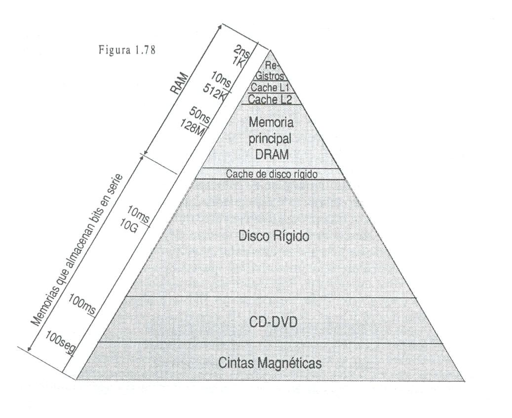

Esto permite que la MC sea accedida por otros dispositivos, mientras la CPU accede a los niveles de caché para leer y escribir información.

Son de acceso aleatorio, muy rápidas y de baja capacidad (1kb a 512kb). Se fabrican con transistores bipolares o HCMOS, son estáticas y su tiempo de acceso oscila entre 5 y 10ns, son más costosas.

- **Memoria Central:** Se construyen con semiconductores en CI de muy alta escala de integración (VLSI). En las memorias centrales actuales se reúnen a menudo las memorias RAM y ROM. Lo más común es que las memorias RAM sean de tecnología MOS dinámica.

- **Memorias de Masa:** Son memorias de acceso selectivo, de gran capacidad, tiempos de acceso considerables y gran velocidad de transferencia. Se accede en ellas a bloques de información que son transferidas a la memoria central para ser utilizadas desde allí por la CPU. Esta jerarquía de memorias esta representada fundamentalmente por los discos magnéticos (rígidos) y mas recientemente por los CD-ROM. (DVD-ROM diría yo). En periféricos se tratara mejor este tema.

- **Memorias Ficheros:** Realizadas con cintas magnéticas. Se caracterizan por su acceso secuencial que implica tiempos de acceso de hasta varios minutos y por su intercambiabilidad que les proporcionan una capacidad prácticamente infinita de almacenamiento. (Cintas y Discos Ópticos).

El medio es una cinta de plástico (“Mylar”) flexible cubierta por un óxido magnético. La cinta y la unidad de cinta son análogas a una cinta de grabación doméstica. El medio de la cinta se estructura en un pequeño número de pistas paralelas. Los primeros sistemas de cintas usaban 9 pistas.

Esto hace posible almacenar datos de un byte en un instante dado, con un bit de paridad adicional, en la novena pista; en algunos casos se suele incorporar un carácter de arranque y parada únicos para señalizar el comienzo y el final de un bloque.

Los nuevos sistemas usan de 18 a 36 pistas, correspondiendo a una palabra o doble palabra digital. Los datos se leen y escriben en bloques contiguos, llamados **registros físicos** de cinta. Los bloques en la cinta están separados por bandas vacías llamadas bandas inter-registros. A las unidades de cintas magnéticas se la llama dispositivo de acceso secuencial, ya que necesita leer todos los sectores secuencialmente para llegar al sector deseado.

Las cintas magnéticas fueron el primer tipo de memorias secundarias. Se usan todavía ampliamente como los miembros de la jerarquía de memoria de menor coste y de menor velocidad.

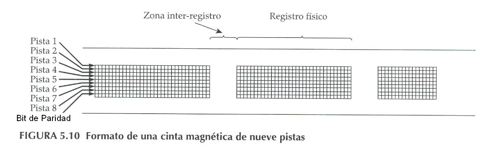

## PALABRA DE MEMORIA

Denominaremos así (word o palabra) al conjunto de bits que la maquina trata como unidad básica de información. Mínima unidad de información que la máquina puede almacenar, transferir y transformar (definición de Vicente). Cada palabra se almacena en un registro de memoria. Una palabra es una entidad de n bits que se mueven hacia adentro y afuera del almacenamiento como una unidad. Una palabra de memoria puede representar un operando, una instrucción, o un grupo de caracteres alfanuméricos o cualquier información codificada binariamente.

En general el procesador mueve a través de los buses un número de bits igual al tamaño de la palabra que puede procesar. En general la longitud de la palabra es múltiplo de 8 bits (1 byte).

La longitud de la palabra decide una serie de aspectos destacables de la arquitectura de la maquina. Así el procesador central (CPU) interpretara a los datos e instrucciones almacenadas en memoria como grupos de bits del tamaño de una palabra.

Los registros de la CPU que almacenarán informaciones en el transcurso del procesamiento, los de la ALU y los asociados a la MC, deben tener un tamaño mínimo a la longitud de la palabra.

**MEMORIAS DE ACCESO ALEATORIO (RAM)**

Es posible leer o escribir en cualquier dirección de la memoria “a la vez”, esto es si el retardo para encontrar una posición determinada es exactamente igual que para encontrar cualquier otra, la memoria se denomina memoria de acceso aleatorio (RAM).

Las memorias RAM son volátiles, es decir que si se interrumpe la energía se pierden los datos y sólo pueden utilizarse como almacenamiento temporal. Existen dos tipos de RAM: las estáticas y dinámicas, ver clasificación tecnológica. Tanto las RAMs estáticas como las dinámicas son volátiles.

La figura ****muestra una memoria principal organizada en palabra de longitud fija. Como indica la figura una memoria esta dividida en **N** palabras, donde **N** es generalmente una potencia de 2, y a cada palabra se asigna una dirección, o posición en la memoria. Cada palabra tiene el mismo número de bits, llamados **longitud de la palabra**.

Las direcciones o números de dirección en la memoria, van consecutivamente, partiendo de la dirección 0 llegando hasta la dirección mas grande.

Existen diferencias entre el contenido de una dirección de memoria y la dirección en sí misma. La memoria es como un gran gabinete con muchos cajones, los cuales corresponden a las direcciones de memoria. En cada cajón hay una palabra y la dirección de cada palabra se escribe en la parte externa del cajón. Si escribimos o almacenamos una palabra en la dirección 17, es como si colocáramos la palabra en el cajón marcado con 17. Posteriormente, leer en la dirección 17, es como mirar este cajón para ver su contenido. Solo cambiaremos el contenido de una dirección cuando almacenamos o escribimos una nueva palabra.

Cada dirección o posición contiene un número fijo de bits, numero que ha sido llamado **longitud de palabra de memoria**. Así una memoria con 4096 posiciones, cada una con una dirección diferente y con cada posición que almacena 16 bits, se llama memoria de 4096 palabras de 16 bits, o memoria de 4k de 16 bits.

(Dado que las memorias vienen generalmente con un número de palabras igual a **2** **n** para cualquier **n**, si una memoria tiene 2 ****14 = 16.384 palabras, se hará referencia a ella como una memoria de 16k y dado que siempre se entiende que la memoria tiene la capacidad de 2 n completa. Por lo tanto, una memoria de 2 15 palabras de 16 bits se denomina memoria de 32k de 16 bits).

La unidad de memoria se especifica por el número de palabras que contiene y el número de bits que hay en cada palabra. Las líneas de direcciones seleccionan una palabra en particular. Cada palabra almacenada en la memoria es identificada por su dirección.

En la memoria habrá tantas direcciones como posiciones pueda tener una memoria.

En la figura tenemos representada una memoria de palabras de 8 bits, de 65536 posiciones. Los registros de uso general R0 a Rn y RI son de 8 bits, mientras que RD, CP y RPM son de 16 bits. Lógicamente los buses tendrán la misma cantidad de conductores que la cantidad de biestables de los registros que unen.

La descripción de la memoria RAM comprende dos partes:

- El funcionamiento del punto de memoria.
- La organización general de la memoria, esencialmente ligada a la técnica de selección.

Los computadores usan invariablemente memorias de lectura y escritura de acceso aleatorio como memoria principal de alta velocidad y para su respaldo memorias de baja velocidad como reserva para mantener datos auxiliares.

Las memorias de acceso aleatorio más usadas son los circuitos integrados y las de núcleos magnéticos, así mismo, ambos están organizados de una manera similar.

**MEMORIAS DE SELECCIÓN LINEAL (2D)**

En cualquier memoria debe existir una celda básica o punto de memoria, formada por el elemento de almacenamiento (flip-flop) y los circuitos de control. Para que esta celda sea útil, deberá poder ser seleccionada mediante el registro de dirección de memoria y se debe tener un método para controlar cuando las celdas seleccionadas deban ser leídas o escritas.

El esquema de organización tiene 4 palabras de 3 bits por palabra (por lo tanto tendremos 3 celdas de almacenamiento o puntos de memorias por cada palabra almacenada). Por lo tanto podemos decir que cada fila tiene 3 celdas que componen una palabra.

El registro de dirección de memoria selecciona la celda de memoria (flip-flop) para ser leída o escrita, por medio de un decodificador que selecciona tres flip-flops para cada una de las direcciones que puede tener el registro de dirección de memoria.

El esquema muestra que el decodificador tiene una entrada para cada flip-flop (bit) que va a ser decodificado. Si hay dos bits de entrada, se tendrán 4 líneas de salida, una para cada estado (valor) que pueda tomar el registro de entrada.

Por ejemplo, si el RDM tiene 0 en los dos flip-flops (es decir, Q = 0 de cada flip-flop), la línea superior de salida del decodificador será 1 y las tres restantes permanecerán en 0. De igual forma, si las dos celdas de memoria tienen un 1, la línea d salida más baja será 1, y las tres restantes serán 0.

Razonamientos similares mostrarán que habrá una línea de salida en 1, para cada uno de los posibles estados de entrada, mientras que las restantes permanecen en 0.

**Lectura:** cuando la dirección de la palabra a ser leída se encuentre en el RSM, el DSM (decodificador), mediante las líneas correspondientes sensibilizará a la palabra seleccionada y colocando un 1 en la línea de habilitación de lectura, el contenido de las 3 celdas de la palabra se transferirán, por las líneas O1, O2, O3 al RPM, donde podrán ser leídas.

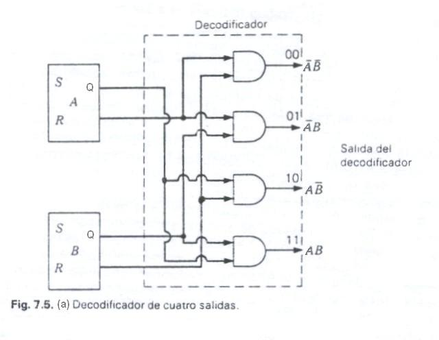

**Escritura:** la palabra que se va a escribir es cargada en el registro de palabra de memoria, mientras que en el RDM se carga con la dirección donde se va a escribir; el DSM sensibiliza a la palabra seleccionada; y colocando un 1 en la línea de habilitación de escritura, la información disponible en las líneas I1, I2, I3 quedará almacenada en las celdas de la palabra.

Las compuertas AND de la salida, de los puntos de memoria deben tener la propiedad de que cuando se unan las líneas de salida de estas compuertas AND, la salida será la de mayor nivel. (Si cualquiera de las salidas es 1, la línea será 1, de otra forma será 0). Vemos que las cuatro celdas de memoria de la primera columna forman lo que se llama un OR alambrado, de tal forma que si cualquiera de las salidas es 1, la línea será un 1. (Las celdas de los circuitos integrados se construyen de esta forma).

Por ejemplo, si la segunda fila de la memoria contiene 110 en las 3 celdas de memoria, y si el RDM contiene 01, la segunda línea de salida del decodificador (marcada como 01), será 1 y serán seleccionadas las compuertas de entrada de estas 3 celdas de memoria. Si la línea LEER está en 1, las salidas de estas 3 celdas de memoria de la segunda fila estarán en 110, a la entrada de las compuertas AND, de la parte inferior de la figura, que transmitirán el valor 110 como salida de la memoria.

Si la línea ESCRIBIR está en 1 y el RDM contiene nuevamente 01, la segunda fila de flip-flops tendrá seleccionadas las líneas de entrada. Los valores de entrada I1, I2, I3 quedarán almacenados en los flip-flops de la segunda fila.

Es la memoria más sencilla, consiste en una matriz de biestables, cada uno de ellos alcanzados por tres hilos, un hilo para seleccionar la fila, un hilo para la entrada de información y un hilo para habilitar la escritura. Los biestables de una misma fila memorizan una palabra. Se dice que una memoria así concebida está organizada por palabras y que su selección es lineal o en dos dimensiones 2D.

Para escribir una determinada configuración binaria en una palabra de memoria (no es necesario que este puesta a cero) se envía un 1 para seleccionar la fila correspondiente, la información por los hilos de bit (I1, I2, I3) y un 1 por el hilo de escritura que alcanza a todos los biestables. Únicamente los biestables sensibilizados por el hilo de palabra almacenaran la información.

La operación de lectura (no es destructiva) consiste en enviar un 1 por el hilo de selección (o palabra) que se desea leer y un 1 por el hilo de habilitación de lectura.

Esta es una memoria completa, con capacidad total de lectura y escritura. La memoria almacenará los datos por un período indefinido y operará tan rápido como lo permitan las compuertas y los flip-flops. En las memorias 2D la organización es muy sencilla pero el decodificador del sistema de selección resulta muy complejo a medida que aumenta el tamaño de la memoria. El gran número de componentes a utilizar en los circuitos decodificadores es la principal objeción a este tipo de memorias.

**MEMORIA DE SELECCIÓN POR CORRIENTES COINCIDENTES (3D)**

En este tipo de organización de memoria, parte de la decodificación la realiza la propia organización de la memoria. La memoria se divide en **m** matrices de 2 **n** biestables, donde **m** es el número de bits de la palabra de memoria y **n** el número de bits del RSM.

Cada biestable de la i-sima matriz corresponde al bit de peso **i** de una de las 2 **n** palabras de la memoria.

Cada biestable es alcanzado por 4 hilos, 2 hilos para la selección de filas y columnas, un hilo para la entrada de información y un hilo para habilitar la escritura.

En síntesis, a la celda básica de la memoria 2D le agregamos otra entrada de selección (S1 y S2), ambas deben estar en 1 para seleccionar una celda determinada. Se precisan 2 decodificadores para esta memoria, que tiene 16 palabras de 1 bit por palabra. El RDM tiene 4 bits y, por lo tanto, 16 estados. Dos de las entradas del RDM van a un decodificador y dos al otro.

Por ejemplo, si el RDM contiene 0111, el valor 01 va al decodificador de la izquierda y 11 irá al decodificador superior. Esto seleccionará la segunda fila con el decodificador de la izquierda y la columna del extremo derecho con el decodificador superior.

El resultado es que solo la celda (flip-flop) en esta intersección de la segunda fila con la columna del extremo derecho, tendrá ambas entradas S1 y S2 en 1. Como resultado, solo esta celda particular será seleccionada, y ninguna otra celda lo estará, por ello, sólo este flip-flop podrá ser leído o escrito. Si la línea LEER esta en 1, la celda habilitada será leída, o si la línea ESCRIBIR esta en 1 la celda será escrita.

Para construir una memoria con más bits por palabra, simplemente haremos una memoria como la de la figura anterior para cada bit de la memoria (excepto que sólo se necesitarán un RDM y los 2 decodificadores originales). Esta es la organización usada en la mayoría de memorias de núcleos y en algunas memorias con circuitos integrados de 256 bits en circuito. Se lee una palabra enviando 2 impulsos por los hilos de selección de filas y columnas y un 1 por el hilo de habilitación de lectura. Se escriben los bits de una palabra (no es necesario la puesta a 0) enviando un 1 por los hilos S1 y S2, la información por el hilo correspondiente y un 1 por la habilitación de escritura. Estos 2 últimos afectan a todos los biestables de la matriz.

## SELECCIÓN 2 y 1/2 D

Estas memorias se caracterizan por poseer celda 2D y organización 3D (usa 2 decodificadores). El esquema de selección usa un control en las entradas LEER y ESCRIBIR para así lograr la organización 3D. Es también una selección por corrientes coincidentes, con la única diferencia respecto a la selección 3D que la habilitación para escritura no se sitúa a nivel de los biestables, sino al de las líneas de selección de columna.

Consideremos la operación ESCRIBIR, suponiendo que inicialmente el RDM contiene 0010. Esto hará que la salida 00 del decodificador superior sea 1, seleccionando la fila de más arriba de las celdas de memoria. En el decodificador inferior, la salida 10 será 1, y esto se lleva a una de las compuertas AND de la parte inferior del diagrama, cuya salida activa las entradas W de la tercera columna. Como resultado, la celda de memoria de la fila superior y la tercera columna tendrá a 1 las entradas S y W. Ninguna otra celda de memoria tendrá colocado en su flip-flop RS el valor de entrada. (Todas las entradas I de las celdas de memoria están conectadas al valor de entrada D1).

Para la operación de lectura se opera de la misma forma, por ejemplo, si el RDM contiene 0111, el decodificador fila va a seleccionar las celdas ubicadas en la segunda fila, mientras que el decodificador columna habilitará la última AND de la fila inferior (selecciona la última columna). Como resultado, la salida disponible será la de aquella celda que se encuentre en la intersección, de la segunda fila y última columna de la derecha. El valor de esta celda irá a la compuerta OR y luego a la última AND de la parte inferior del diagrama, que la habilitaremos con un 1 en la señal de LEER. Esta es la organización básica usada actualmente en la mayoría de las memorias con circuitos integrados. Todos los circuitos necesarios para una memoria están colocados en el mismo circuito integrado, excepto los flip-flops del RDM, los cuales con mucha frecuencia no se disponen dentro del circuito integrado, sino que las entradas van directamente al decodificador.

## PRO Y CONTRA DE LAS ORGANIZACIONES DE MEMORIA

El sistema básico de selección lineal 2D es la organización más sencilla, sin embargo, el decodificador del sistema de selección resulta muy grande a medida que el tamaño de la memoria aumenta. Si la memoria de 16 palabras de 1 bit fue diseñada usando el sistema 2D, será necesario un decodificador con 16 x 4 entradas, y por lo tanto se utilizarían 64 diodos. En cambio para un sistema 3D se requerirán 2 decodificadores de 2 entradas y cuatro salidas, cada uno con 8 diodos, o sea, requerirán 16 diodos para ambos decodificadores.

Consideremos un decodificador para una memoria de 4.096 palabras, por lo tanto, se tendrán 12 entradas por compuerta AND, y se necesitarán 4.096 compuertas AND. Si se necesita un diodo (o transistor) en cada entrada de las compuertas AND, entonces 12 x 4.096 = 49.152 diodos (o transistores). Este gran número de componentes es la principal objeción al tipo de organización 2D. Examinemos ahora para una memoria de igual capacidad pero organizada mediante el sistema 3D. Este sistema tendrá dos decodificadores cada uno con 6 entradas. En consecuencia, cada uno requerirá de 2 6 x 6 = 384 diodos o transistores, es decir, un total de 768 diodos o transistores para el decodificador, contra los 49.152 del sistema 2D. Este es un ahorro muy apreciable, que se extiende a memorias muy grandes.

En una memoria de tres dimensiones, sin embargo, la simplificación en la complejidad del decodificador se paga con la complejidad de la celda. En algunos casos, esta complejidad de la celda no es costosa, aunque es un problema y, por lo tanto, se usa una variación del esquema 3D, el 2 y 1/2D, que es un sistema de selección que usa dos decodificadores, pero las celdas de memoria son las básicas.

## ORGANIZACIÓN Y BUSQUEDA DE LAS INFORMACIONES EN MEMORIA

Conceptos de Vector, Lista y Puntero

La organización más clásica de las informaciones en memoria consiste en almacenarlas sucesivamente, una detrás de otra. Muy generalmente este es el caso de las instrucciones sucesivas de un programa. Necesitara entonces, para buscar las informaciones sucesivas disponer de un **puntero**, cuyo valor sea igual sucesivamente a las direcciones de las informaciones almacenadas en secuencia. En lo que concierne a las instrucciones éste es, evidentemente, el papel del contador ordinal. Un conjunto de informaciones almacenadas en secuencia se denomina **vector**.

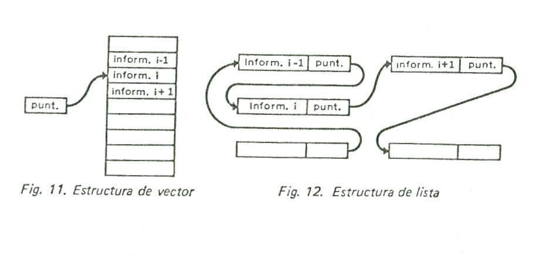

Este método no encaja bien en el caso de las manipulaciones de listas de datos, tales como la extracción o la inserción de datos, la combinación de listas de datos, etc., porque estas exigen desplazamientos de las informaciones en memoria; se recurre a una **estructura de lista** en que cada dato va acompañado de un puntero, que contiene la dirección del próximo dato. Las operaciones de inserción, extracción, combinación, se llevan a cabo por simple manejo de punteros.

Concepto de Tabla

Una tabla establece una correspondencia entre 2 tipos de información: la información significativa que se busca, y la información de entrada que permite localizarla. Esta última se llama también dirección **asociativa o etiqueta.**

La memorización de una tabla puede reducirse a la constitución de un simple vector, si la posición de la información significativa en el vector es calculable a partir de la información de entrada.

En el caso general, la tabla se almacenará bajo la forma de un vector, cada uno de cuyos elementos contendrá la información de entrada y la información significativa correspondiente. Así será el caso de la tabla de correspondencia entre el código nemotécnico de operación, empleado en lenguaje ensamblador y la representación binaria de máquina del código de operación.

La búsqueda en tabla exige sucesivas comparaciones de la información de entrada con todas las posibles informaciones de entrada, hasta llegar a la coincidencia.

Conceptos de Pila y de Cola de Espera

Estos dos conceptos designan organizaciones particulares de datos en la memoria, en las que el orden de utilización de las informaciones depende del orden en que han sido introducidas.

*Cola de Espera*: La cola de espera funciona según un principio análogo al que conocemos en los negocios: se tiene acceso a la información de acuerdo con el esquema “primer llegado, primero en ser atendido”.

Se necesitan dos punteros para definir el estado de una cola de espera, uno apuntando a la última palabra introducida, el otro a la próxima palabra por extraer.

*Pila*: El mecanismo de la pila recuerda a la pila de camisas en el armario: se accede a la última información almacenada, con el esquema “último en entrar, primero en salir”.

El estado de la pila se consigue con un solo puntero, pues basta con conocer el emplazamiento de la cima de la pila.

Las pilas y colas de espera pueden constituirse en memoria central por programación.

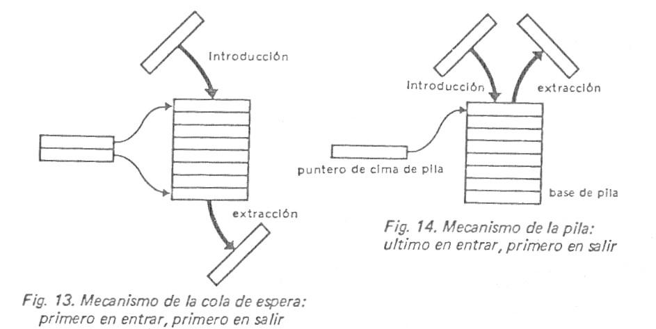

## PILAS

Básicamente una pila es un conjunto de posiciones consecutivas en la memoria, en las cuales se pueden colocar los operandos. El nombre de pila se deriva del hecho de que la memoria está organizada como una pila de platos (puede considerarse cada operando como si fuese un plato).

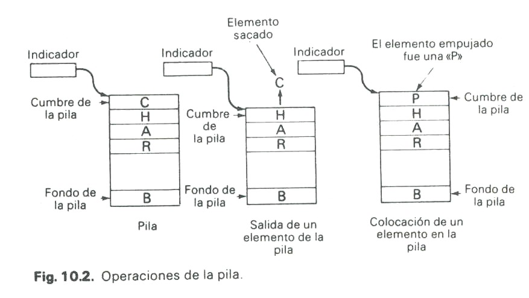

Las dos operaciones de la pila son la inserción y el desecho. La operación de inserción de un operando se llama **empujar** (push), es decir, añade un nuevo operando en la cumbre de la pila.

La operación de desecho de un operando se llama sacar (pop), el operando que se elimina es el que esta en la cima de la pila. Se dice que el primer operando colocado en la pila está en el fondo de la pila. Sólo el operando que esté en la cumbre (top), está disponible de forma inmediata.

Si colocamos A, B y C en una pila desocupada, en ese orden, y luego los sacamos, primero se extraerá C, luego B, y finalmente A. (Este principio del último en entrar, primero en salir, hace que las pilas se llamen LIFO).

Las pilas se mantienen en una memoria como un conjunto de palabras. Cada palabra tiene, por lo tanto, una longitud fija (número de bits) y una dirección. El indicador de la pila es un registro que contiene la dirección del operando superior de la pila. El indicador de pila se incrementa o decrementa cada vez que se introduce o saca un operando.

Si se da una instrucción de SUMAR a un computador con una arquitectura de pila, los dos operandos superiores de la pila serán sacados y sumados, y luego el resultado de la suma se colocará en la cumbre de la pila. Análogamente, para una instrucción de MULTIPLICAR ocurre exactamente lo mismo.

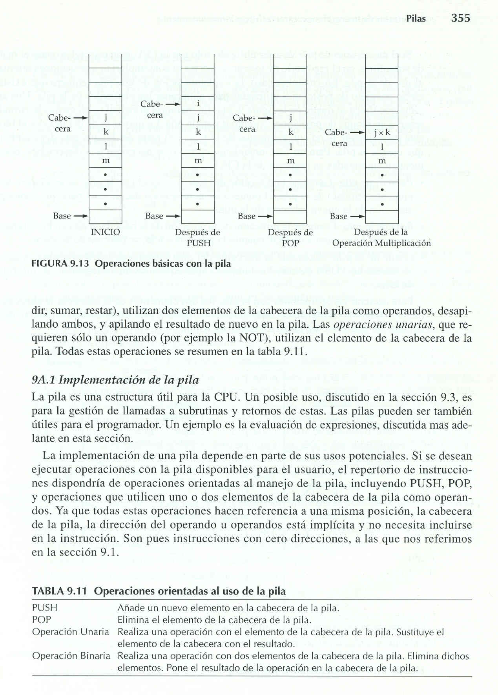

La implementación de una pila requiere que exista un cierto conjunto de posiciones utilizadas para almacenar los operandos de la pila, por lo tanto, en memoria principal (o en memoria virtual) se reserva un bloque de posiciones contiguas para la pila. Una parte de esta reserva va a estar parcialmente llena de operandos y otra va a estar disponible para que crezca la pila. Para un funcionamiento correcto se necesitan 3 direcciones, normalmente memorizadas en registros de la CPU:

- **Puntero de la pila:** contiene la dirección del tope o cabecera de la pila.
- **Base de la pila:** contiene la dirección de la posición de la base de la pila, esto es por si se intenta realizar un POP cuando la pila esta vacía.
- **Límite de la pila:** contiene la dirección del otro extremo de los bloques reservados. Si se intenta un PUSH cuando los bloques están utilizados en su totalidad, se informa de un error.

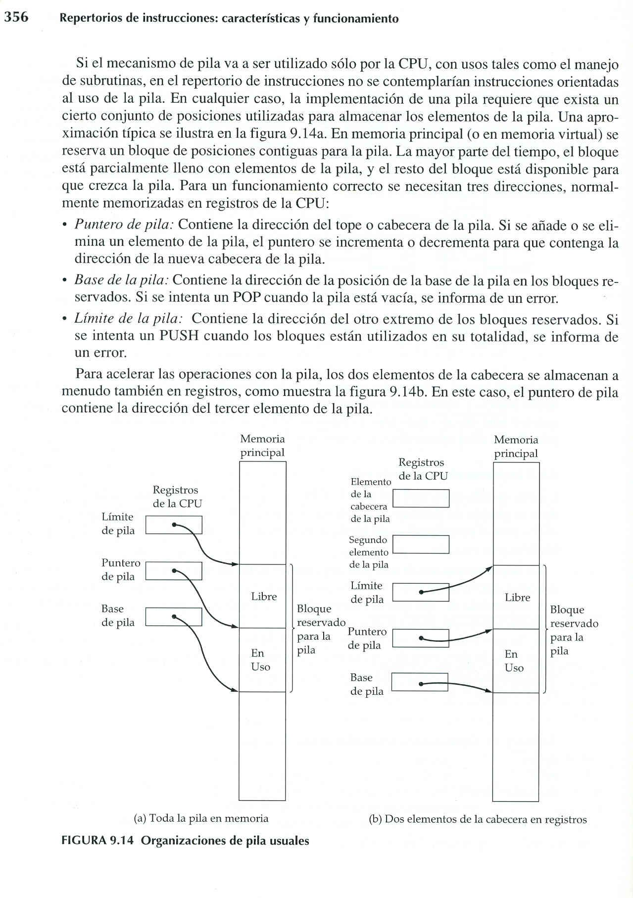

Su uso en el microprocesador está dirigido en su mayoría para el manejo de subrutinas (llamadas y retornos de estas) e interrupciones. La ventaja de una pila de memoria es que el procesador puede referirse a ella sin tener que especificar una dirección ya que la dirección está siempre disponible y actualizada automáticamente en el indicador de la pila.

Así, un procesador puede hacer referencia a una pila de memoria sin especificar una dirección. Por esta razón, las instrucciones que incluyen operaciones de pila se llaman **dirección cero,** **instrucciones implícitas,** o **instrucciones sin dirección**, son del tipo de instrucciones que no especifican ninguna posición en la memoria para el operando ya que la dirección del operando esta en el indicador de la pila.

También es necesario mover operandos de la memoria a la pila, o de la pila a la memoria, y la palabra instrucción para estas operaciones debe ser más grande debido a que se debe especificar la dirección de memoria. (Estas instrucciones serán como las instrucciones de una sola dirección, excepto que los operandos se mueven desde y hacia la pila en vez de hacia o desde el acumulador).

## DECODIFICADORES

Cantidades discretas de información se presentan en sistemas digitales con códigos binarios. Un código binario de **n** bits es capaz de representar hasta **2** **n** elementos diferentes de información codificada. Un decodificador es un circuito combinacional que convierte la información binaria de **n** entradas a un máximo de **2** **n** líneas de salida., de las cuales *solo una* de estas **2** **n** líneas de salida será seleccionada por el decodificador (es decir tendrá el valor 1). Este circuito particular se llama decodificador de varios a uno, matriz decodificadora, o simplemente decodificador.

El siguiente esquema muestra un decodificador que es completamente paralelo en su construcción y diseñado para decodificar 3 entradas (flip-flops). Tiene 2 3 = 8 líneas de salidas, y se seleccionara una sola línea de salida para cada uno de los 8 estados que pueden tomar las tres entradas (flip-flop), dicho esto este decodificador opera de la misma forma que el de 2 entradas, explicado en memoria 2D.

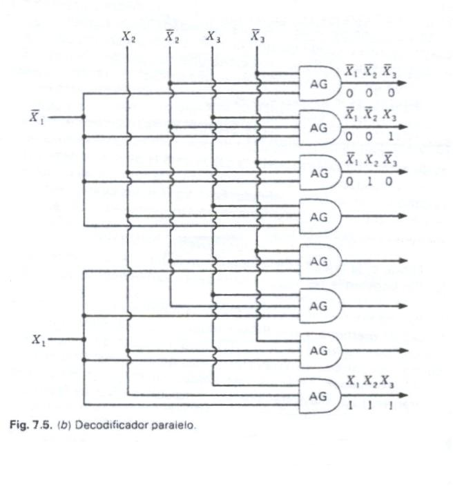

Este tipo de decodificador se construye usando diodos (o transistores) para las compuertas AND. La regla es: el número de diodos (o transistores) usados en cada compuerta AND es igual al número de entradas a cada compuerta AND.

El número de compuertas AND es igual al número de líneas de salida, que es igual a 2 n

(n = es el numero de flip-flops de entrada que se están decodificando).

El número total de diodos es por lo tanto igual a **n x 2** **n** y para la matriz decodificadora binaria de 3 entradas se necesitan 24 diodos. El número de diodos necesarios aumenta bruscamente con el número de entradas del circuito.

Para construir un decodificador paralelo necesitamos tantos operadores AND como salidas. Si a los operadores AND los materializamos con diodos, necesitamos 1 por cada entrada. Los operadores AND tendrán tantas entradas como biestables tenga el registro de selección.

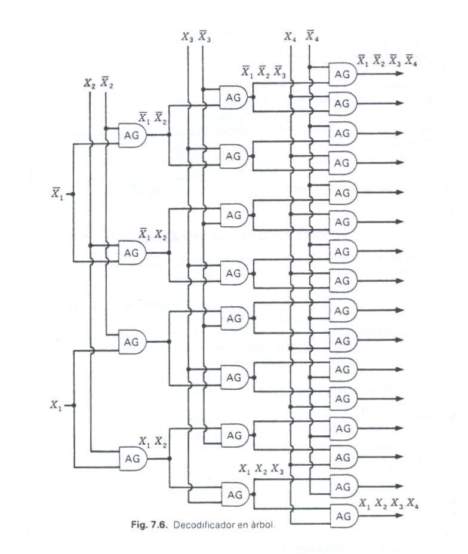

Existe un decodificador **tipo árbol**, que decodifica cuatro flip-flops, y por lo tanto tiene 24 = 16 líneas de salida. Para construir este circuito en particular se necesitan 56 diodos, mientras que se necesitan 4 x 24 = 64 diodos para construir el decodificador tipo paralelo.

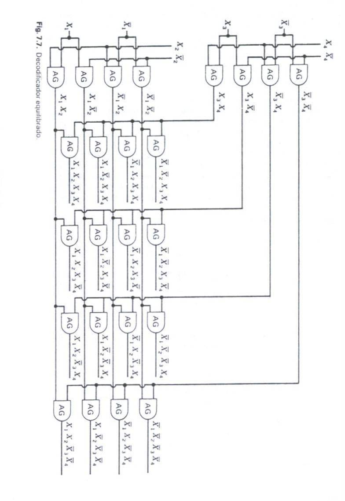

El circuito llamado **decodificador equilibrado multiplicativo**, requiere de solo 48 diodos, vemos que este decodificador necesita de un número mínimo de diodos para sui construcción a diferencia de los explicados anteriormente. Sin embargo el circuito decodificador paralelo tiene la ventaja de que es más rápido y regular en construcción de los 3 tipos explicados.

En lo sucesivo simplemente dibujaremos el decodificador como una caja de n entradas y 2 n salidas, entendiéndose que uno de los 3 tipos se usa en la caja; sólo las entradas sin complementación están conectadas al decodificador, y los inversores están incluidos en el paquete. Por lo tanto para un decodificador de 3 entradas tendrá solo 3 líneas entradas y 8 líneas de salidas.

El Dispositivo de Selección de Memoria no es otra cosa que un circuito combinacional, habitualmente conocido como decodificador. Las entradas al circuito provienen del Registro de Selección.

Si el RSM tiene **n** biestables, el DSM podrá seleccionar **2** **n** palabras de memoria. Este tipo de decodificadores pone en 1 la salida correspondiente, de acuerdo al valor contenido en el RSM.

Si quisiéramos construir un decodificador para un registro de selección de n biestables, con probabilidad de seleccionar 2n palabras de memoria, necesitaremos:

**2****n** compuertas AND.

Cada compuerta AND tendrá **n** entradas

Para calcular la cantidad de diodos aplicaremos ****

*Decodificador BDC a Decimal:* los elementos de información en este caso son los diez dígitos decimales representados por el código BDC. El código tiene cuatro bits, por lo tanto, el decodificador deberá tener 4 entradas para aceptar el dígito codificado y diez salidas para cada uno de los dígitos decimales. Esto dará un decodificador de 4 a 10 líneas de BDC a Decimal.

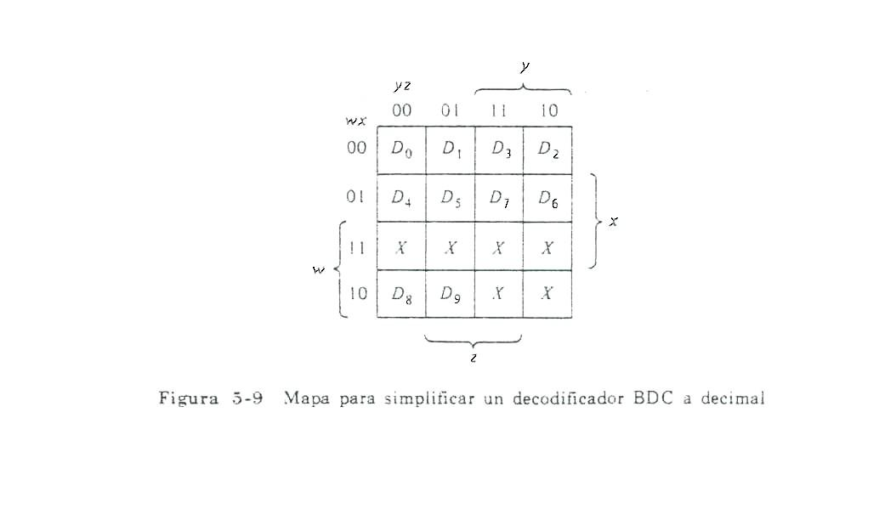

En vez de dibujar 10 mapas, se dibujara solamente un mapa y se escribirán cada una de las variables de salida D0 hasta D9, dentro de su cuadrado de término mínimo, como muestra la figura. Hay 6 combinaciones de entrada que nunca ocurren, por lo tanto se marcan los cuadrados correspondientes con X, de manera que podamos utilizarlos para simplificar al número mínimo de literales. Esta es sólo una de las tantas maneras de tratar las condiciones de no importa, lo que también podríamos hacer cuando una combinación de entrada no sea válida es que todas las salidas sean igual a 0.

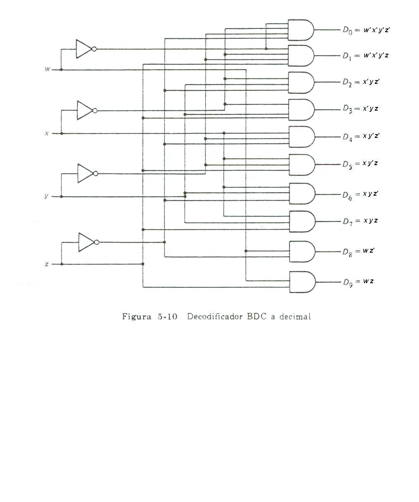

## CODIFICADORES

Un codificador es una función digital que produce una operación inversa a la del decodificador. Un codificador tiene 2n (o menos) líneas de entrada y n líneas de salida. Las líneas de salida generan el código binario para las 2n variables de entrada. La figura muestra un decodificador octal a binario que consiste en 8 entradas, una para cada uno de los 8 dígitos y tres salidas para generar el número binario correspondiente. Este se construye a partir de la siguiente tabla de verdad.

<table>
<tbody>
<tr>
<td colspan="8">Entradas</td>
<td colspan="3">Salidas</td>
</tr>
<tr>
<td>D0</td>
<td>D1</td>
<td>D2</td>
<td>D3</td>
<td>D4</td>
<td>D5</td>
<td>D6</td>
<td>D7</td>
<td>X</td>
<td>Y</td>
<td>Z</td>
</tr>
<tr>
<td>1</td>
<td>0</td>
<td>0</td>
<td>0</td>
<td>0</td>
<td>0</td>
<td>0</td>
<td>0</td>
<td>0</td>
<td>0</td>
<td>0</td>
</tr>
<tr>
<td>0</td>
<td>1</td>
<td>0</td>
<td>0</td>
<td>0</td>
<td>0</td>
<td>0</td>
<td>0</td>
<td>0</td>
<td>0</td>
<td>1</td>
</tr>
<tr>
<td>0</td>
<td>0</td>
<td>1</td>
<td>0</td>
<td>0</td>
<td>0</td>
<td>0</td>
<td>0</td>
<td>0</td>
<td>1</td>
<td>0</td>
</tr>
<tr>
<td>0</td>
<td>0</td>
<td>0</td>
<td>1</td>
<td>0</td>
<td>0</td>
<td>0</td>
<td>0</td>
<td>0</td>
<td>1</td>
<td>1</td>
</tr>
<tr>
<td>0</td>
<td>0</td>
<td>0</td>
<td>0</td>
<td>1</td>
<td>0</td>
<td>0</td>
<td>0</td>
<td>1</td>
<td>0</td>
<td>0</td>
</tr>
<tr>
<td>0</td>
<td>0</td>
<td>0</td>
<td>0</td>
<td>0</td>
<td>1</td>
<td>0</td>
<td>0</td>
<td>1</td>
<td>0</td>
<td>1</td>
</tr>
<tr>
<td>0</td>
<td>0</td>
<td>0</td>
<td>0</td>
<td>0</td>
<td>0</td>
<td>1</td>
<td>0</td>
<td>1</td>
<td>1</td>
<td>0</td>
</tr>
<tr>
<td>0</td>
<td>0</td>
<td>0</td>
<td>0</td>
<td>0</td>
<td>0</td>
<td>0</td>
<td>1</td>
<td>1</td>
<td>1</td>
<td>1</td>
</tr>
</tbody>
</table>

Nótese que D0 no se conecta a ninguna compuerta OR; la salida binaria debe ser sólo ceros en este caso. Una salida de sólo ceros se obtiene también cuando todas las entradas sean cero. Esta discrepancia puede resolverse agregando una salida más para indicar el hecho de que todas las entradas no son ceros. El codificador de la figura asume que solamente una línea de entrada puede ser igual a 1 en cualquier momento; de otra forma el circuito no tiene significado. Nótese que el circuito tiene ocho entradas y podría tener 28 = 256 combinaciones de entrada posibles. Solamente 8 de estas combinaciones tienen significado. Las otras combinaciones son condiciones de no importa.

Existen otros codificadores que establecen una prioridad de entrada para asegurar que solamente la línea de entrada de la más alta prioridad se codifica. Estos codificadores se llaman **codificadores de prioridad**. Por ejemplo, tomando la tabla de verdad dada, si la prioridad es dada a una entrada con un número de suscrito mayor con respecto a un número suscrito menor, entonces si ambos D2 y D5 son lógica 1 simultáneamente, la salida será 101 porque el D5 tiene una mayor prioridad sobre D2. Cabe aclarar que la tabla de verdad para un codificador de prioridad es diferente a la que se acaba de presentar.

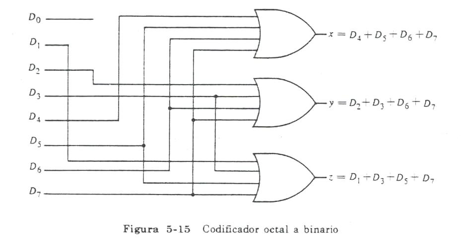

## LOS BUSES

Los buses también llamados líneas ómnibus, se utilizan para interconectar varios registros, unos considerados como registros **fuentes** de información, otros como registros **destinatarios** de información.

Un bus es un conjunto de hilos o alambres, en donde las informaciones binarias son mantenidas bajo forma de tensión por uno de los registros **fuente**. Un bus consta de un hilo por bit o de dos hilos por bit, en uno de los cuales está la magnitud cierta, en el otro la complementada. El bus puede alimentar independientemente o simultáneamente a varios registros destinatarios.

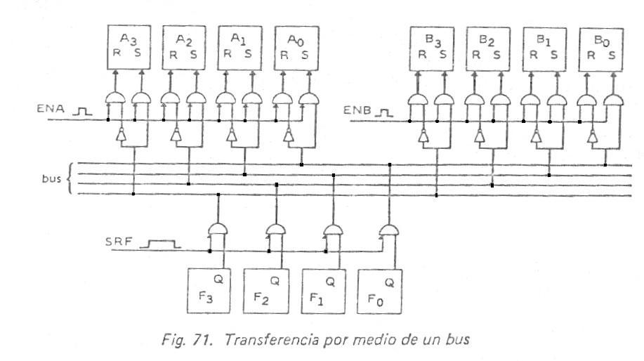

Observamos en la figura que una señal de nivel abre las puertas de salida del registro fuente F. En el bus se establecen los niveles de tensión correspondientes a los contenidos de los biestables del registro F y se mantienen mientras este activada la señal SRF. Una vez estabilizados dichos niveles en el bus, el impulso de señal ENB, abriendo las puertas de entrada a los biestables del registro B, fuerza a la introducción en este registro de la información mantenida en el bus por el registro F. Entonces la señal SRF puede volver al valor cero. A la señal de gobierno EN (ENA, ENB, etc.) que valida la información a la entrada del registro, se la llama **señal de muestreo**.

Para la transferencia en paralelo, el número de líneas en el bus es igual al número de bits en los registros.

Un sistema de bus común puede construirse con multiplexores y decodificadores. Los multiplexores seleccionan un registro fuente para el bus mientras que el decodificador selecciona un registro de destino para transferir la información desde el bus. La figura muestra un sistema de bus con cuatro registros, donde los 4 bits en la misma posición significativa de los registros pasan a través de un multiplexor de 4 a 1 línea para formar una línea de bus. Para registros de n bits, se necesitan n multiplexores para producir un bus de n líneas. Las n líneas en el bus se conectan a n entradas de todos los registros.

La transferencia en este caso se logra activando la señal de control de carga de ese registro. El control de carga particular activado se selecciona mediante las salidas del decodificador cuando se habilita, por lo tanto, si el decodificador no se habilita no se transferirá ninguna información, aunque los multiplexores coloquen el contenido de un registro fuente en el bus.

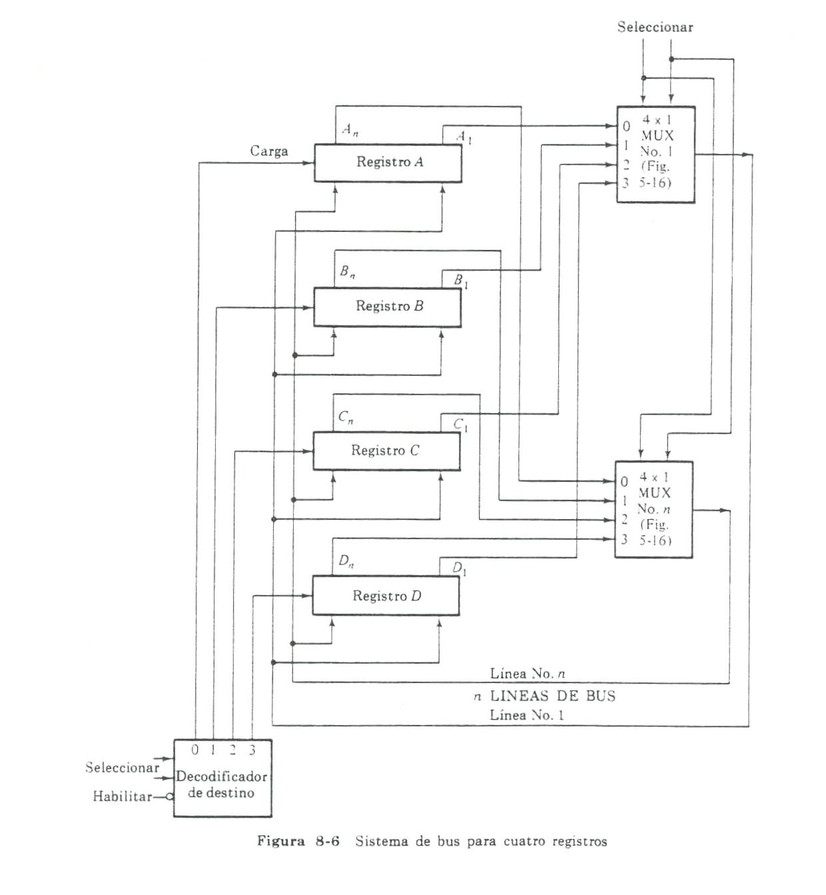

## CONEXIÓN DE LOS CIRCUITOS DE MEMORIA A UN BUS

La tendencia actual, fundamentalmente en los sistemas con microprocesador, es conectar la memoria del computador a la CPU por medio de un BUS, este es un conjunto de alambres, que es compartido por todos los elementos de memoria que se utilizan. El Bus que conecta la memoria al microprocesador consiste en:

- Un conjunto de **líneas de dirección**, llevan la dirección de la palabra a seleccionar.
- Un conjunto de **líneas de datos**, para entrar datos a la memoria o sacar datos de ella.
- Un conjunto de **líneas de control**, para controlar las operaciones de lectura o escritura.

La figura anterior ilustra un Bus para un microprocesador con tres líneas de dirección, tres líneas de entrada de datos, tres de salida de datos y 2 señales de control. Podemos deducir que la memoria que puede conectarse a ese Bus, tendrá como máximo 8 palabras de 3 bits por palabra. La línea L/E se pondrá en 1 o 0 según si la CPU indica que se lea o escriba en la memoria. La línea H/M (habilitación de memoria) se pondrá en 1 cuando en la memoria se va a leer o escribir, caso contrario será 0.

Con frecuencia surgen casos en los que no es adecuado el número de palabras de una pastilla (C. I. de memoria) o el número de bits por palabra o las dos cosas a la vez. El problema puede solucionarse colocando pastillas en paralelo. La figura muestra una conexión para incrementar el número de bits por palabra (pero no el número de palabras).

Si observamos vemos que hay en paralelo 2 pastillas de 8 palabras, de 4 bits por palabra, que dispuestas de esa forma da como resultado una memoria cuyo número de palabras sigue siendo 8, pero el número de bits se ha incrementado de 4 a 8. Los 3 bits de dirección se aplican en la entrada de dirección de ambas memorias. Los terminales CS de las pastillas se unen, lo mismo que los WE.

Las entradas de selección de pastillas y habilitación de escritura, seleccionan y habilitan simultáneamente las pastillas. La pastilla 1 acepta y almacena 4 bits (0, 1, 2, 3) y la pastilla 2, 4 bits más (4, 5, 6, 7). Por supuesto se pueden conectar en paralelo más pastillas adicionales para incrementar aún más el número de bits por palabra.

CS: Selección de pastilla.

W/E: Habilitación de escritura.

Con dos pastillas de memoria de 8 palabras, 4 bits por palabra, se obtiene una memoria de 8 palabras de 8 bits por palabra.

También pueden obtenerse conexiones que permitan incrementar el número de palabras manteniendo fijo el número de bits por palabra. La siguiente figura muestra la conexión de 2 pastillas de 8 palabras de 4 bits por palabra para obtener una memoria de 16 palabras de 4 bits por palabra. Los 3 bits de dirección se aplican a ambas pastillas, como en el caso anterior, sin embargo, la entrada CS del sistema de memoria ahora es un bit de dirección adicional, que llamamos A4; cuando A4 = 1, se activa la pastilla 2, y cuando A4 = 0 se activa la pastilla 1, es decir, cuando se activa la entrada CS de una pastilla, se desactiva la entrada de la otra. Los bits de dirección A0, A1, A2, seleccionan la posición de una palabra particular en la pastilla seleccionada. Los bits de entrada de datos y la entrada WE son los mismos para ambas pastillas, hay que tener en cuenta que sola en una pastilla se escribe dependiendo del valor de A4. Ahora una palabra se lee a veces de una pastilla y a veces de otra. La palabra se transmitirá a un bus común, independientemente de la pastilla que la origine. A diferencia de la anterior figura, en esta necesitaríamos agregar un multiplexor para seleccionar la salida de una o de la otra pastilla, mientras que en la otra figura no es necesario un multiplexor ya que la longitud de la palabra es de 8 bits. (Más información en el tema multiplexores para el caso del bus común).

CS: Selección de pastilla.

L/E: Habilitación de lectura / escritura.

Con 4 pastillas de memoria de 8 palabras, 4 bits por palabra, se obtiene una memoria de 32 palabras de 4 bits por palabra.

MEMORIAS DE SOLO LECTURA (ROM)

Una memoria de solo lectura (Read only memory, ROM), es una memoria de la que podemos leer, pero en la que no se puede escribir. Son memorias de acceso aleatorio, la información almacenada en estas memorias es introducida de forma tal que la información es permanente o semipermanente, como consecuencia tienen la característica de ser **no volátil**; si bien, no necesita energía eléctrica para mantener guardados los datos, pero si para leerlos.

Algunas veces la información almacenada en una ROM se coloca en la memoria en el momento de la construcción y algunas veces se usan dispositivos en los cuales, la información puede ser cambiada.

Básicamente una ROM es un circuito combinacional formado por compuertas AND seguidas de OR, con varias líneas de entradas y salidas, de tal forma que para cada valor de entrada existe un solo valor de salida, o sea, una ROM físicamente es un circuito combinacional que ejecuta una tabla de verdad.

El siguiente diagrama en bloques consiste en n líneas de entrada y m líneas de salida. Cada combinación de bits de las variables de entrada se llama una dirección. Cada combinación de bits que sale por las líneas de salida se llama una palabra. El número de bits por palabra es igual al número de líneas de salida m. Una dirección es esencialmente un número binario que denota uno de los términos mínimos de n variables. El número de direcciones diferentes posibles con n variables de entrada es 2n.

Una palabra de salida puede ser seleccionada por una dirección única y como hay 2n direcciones diferentes en una ROM, hay 2n palabras diferentes que se dice que están acumuladas en la unidad.

Si consideramos una ROM de 32 x 8, esta consiste en 32 palabras de 8 bits cada una. Esto significa que hay 8 líneas de salida y 32 palabras distintas almacenadas. En algunas ocasiones una ROM se especifica por el número total de bits que contiene, el cual será 2n x m, por ejemplo una ROM de 2048 bits puede organizarse como 512 palabras de 4 bits cada una (29 x 4 = 2048 bits)

n entradas m salidas

Estas memorias se construyen generalmente en forma matricial y las compuertas lógicas podrán estar materializadas mediante diodos, transistores MOS o transistores bipolares.

Hay disponibles pastillas de ROM que permiten tanto al usuario como el fabricante almacenar información. Son las PROM (programmable read-only memories). Estas memorias pueden ser escritas una sola vez. Algunas de las técnicas pueden ser, mediante matrices de diodos donde en todas las intersecciones de la matriz encontramos conexiones con enlaces fusibles o diodos conectados en oposición.

Si la memoria ROM se fabrica de tal forma que el contenido de la memoria puede fijarse como lo desee el usuario y posteriormente puede borrarse y escribirse nuevamente, se dice que es una EPROM (ROM borrable y reprogramable – Erasable – Programmable read - only memories).

La forma de borrar las EPROM es mediante la exposición a la luz ultravioleta (U. V.) durante 20 o 30 minutos. Son escritas mediante determinados voltajes aplicados a sus entradas.

Las memorias ROM eléctricamente alterables (EAROM) tienen la característica de que pueden ser borradas y re-escritas por medio de voltajes correctamente aplicados. Estas memorias tienen a ventaja de que se actúa eléctricamente en forma directa sobre el punto de memoria a modificar.

La EPROM al ser expuestas a la luz U. V. se borran completamente en cambio en las EAROM puede seleccionarse cual es la información que desea borrar y reprogramar mediante dispositivos provistos por las compañías fabricantes de esas memorias. Algunos de estos dispositivos para reprogramar la memoria, son operados desde un teclado, algunos desde cintas, y algunos, desde entradas externas, tales como un microprocesador.

Cuando va a programarse un circuito PROM o EPROM, existe generalmente una habilitación de escritura que debe ponerse a 1 y que hace que las líneas de salida se habiliten para recibir datos, a continuación se fijan las líneas de dirección o la posición en la que se desea escribir. Luego se escribe, aplicando una secuencia de voltajes de gran amplitud, a las líneas de salida. Aplicando un borrador o exponiendo la memoria a la luz ultravioleta, normalmente se borra todo el contenido de la memoria.

En las memorias ROM, la escritura demanda muchísimo mas tiempo que su lectura.

Las ROM son ampliamente utilizadas para ejecutar circuitos combinacionales complejos directamente de su tabla de verdad. Son muy útiles para convertir de un código binario a otro (como ser ASCII a EBCDIC o viceversa). También en funciones aritméticas como multiplicadores, para mostrar caracteres en un tubo de rayos catódicos, y en cualquier otra aplicación que requiera un gran número de entradas y salidas.

Se emplean además en el diseño de la unidad de control de los computadores digitales. Como tales, se utilizan para almacenar patrones fijos de bits que representen una secuencia de variables de control necesarias para habilitar las distintas operaciones del sistema. Las unidades de control que usa una ROM para almacenar información de control binario se llaman Unidad de Control Microprogramada.

En una PC la porción de memoria principal que es ROM se denomina ROM BIOS (“Basic Input Output System”). Contiene por un lado programas que se ejecutan cuando se enciende un computador y sirven para:

- Verificar el correcto funcionamiento del hardware y su configuración.
- Traer del disco a memoria principal (o sea escribir en ésta) una copia de programas del sistema operativo del computador (acción conocida como “bootear o arrancar” el sistema).
- Por otro lado, almacena programas que se usan permanentemente para la transferencia de datos entre periféricos y memoria, sea en operaciones de entrada o salida de datos.

También la ROM BIOS contiene tablas, por ejemplo relativas a características de discos.

## ALMACENAMIENTO EN NUCLEOS MAGNÉTICOS

El dispositivo básico de almacenamiento en una memoria de núcleos magnéticos consiste en una pequeña pieza toroidal (en forma de anillo), llamada **núcleo magnético**. El núcleo magnético, almacena información binaria, es generalmente una pieza sólida de material cerámico ferromagnético.

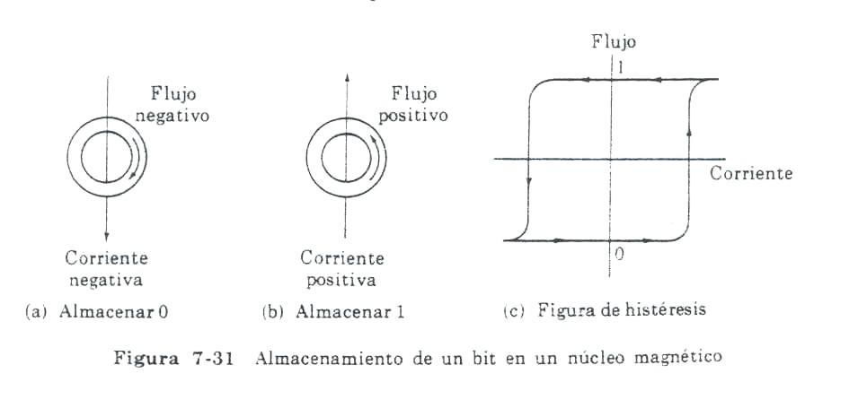

El gráfico muestra un núcleo magnético, en un tamaño mucho mayor a su tamaño normal. El arrollamiento de entrada (hilo conductor), se muestra enhebrado a través del núcleo. Si pasa corriente a través del arrollamiento, se producirá un flujo magnético, con una dirección que depende de la dirección de la corriente en el arrollamiento. El núcleo es en forma de anillo, forrado de un material de alta permeabilidad, de tal forma que presenta una trayectoria de baja reluctancia al flujo magnético. Dependiendo de la dirección de la corriente a través del arrollamiento de entrada, el núcleo se magnetiza en el sentido del movimiento de las agujas del reloj o en el sentido contrario.

Un núcleo magnético emplea tres cantidades físicas: corriente, flujo magnético y voltaje. La señal que excita al núcleo es un pulso de **corriente** en un alambre que pasa a través del núcleo. El pulso de corriente que excita al núcleo, es generado por un circuito accionador (DR = Driver).

La información binaria almacenada se representa por la dirección del **flujo magnético** dentro del núcleo. La información binaria de salida se extrae de un alambre que encadena el núcleo, en la forma de un pulso de **voltaje**.

Las información de salida pasa por un amplificador sensor (SA = Sense Amplifier) cuyas salidas ponen a uno los flip – flops en el registro separador. Con cero corriente, un flujo que puede ser positivo en dirección (hacia la izquierda) o negativo (hacia la derecha) permanece en el núcleo magnetizado. Se usa una dirección, por ejemplo la magnetización a la izquierda, para representar un 1 y la contraria para representar un 0.

Como se ve en la figura (a) la corriente en dirección hacia abajo produce el flujo en dirección hacia la derecha, causando que el núcleo vaya al estado de 0. La figura (b) muestra las direcciones de la corriente y el flujo para almacenar un 1.

La operación de lectura debe estar seguida por otro ciclo que restaura los valores previamente almacenados en los núcleos, es decir, que la lectura es destructiva. Una operación de lectura destructiva transfiere la palabra seleccionada al MBR pero deja el registro de memoria con puros ceros. Por lo tanto, el ciclo que restaura los valores escribe la información del RPM o MBR en el registro de memoria seleccionada.

Durante esta operación de recuperación, los contenidos del MAR y el MBR deben permanecer invariables. Y la operación de escritura debe estar precedida por un ciclo que borra los núcleos de la palabra seleccionada. Después de hacer lo anterior, el contenido del MBR se puede transferir a la palabra seleccionada. El MAR o RS no debe cambiar durante la operación para asegurar que la misma palabra seleccionada que se ha borrado es aquella que recibe la nueva información. Sin embargo, el ciclo de borrado es equivalente a una operación de lectura, ya que destruye la información, pero inhibe al RPM para que no vuelva a cargar la información almacenada en este.
