# Unidad Temática IV — Arquitectura de los Procesadores

## Contenido

- [Unidad Temática IV — Arquitectura de los Procesadores](#unidad-temática-iv--arquitectura-de-los-procesadores)
  - [Contenido](#contenido)
  - [Memoria](#memoria)
    - [DEFINICION](#definicion)
    - [CARACTERISTICAS DE LAS MEMORIAS](#caracteristicas-de-las-memorias)
    - [PALABRA DE MEMORIA](#palabra-de-memoria)
    - [SELECCIÓN 2 y 1/2 D](#selección-2-y-12-d)
    - [PRO Y CONTRA DE LAS ORGANIZACIONES DE MEMORIA](#pro-y-contra-de-las-organizaciones-de-memoria)
    - [ORGANIZACIÓN Y BUSQUEDA DE LAS INFORMACIONES EN MEMORIA](#organización-y-busqueda-de-las-informaciones-en-memoria)
    - [PILAS](#pilas)
    - [DECODIFICADORES](#decodificadores)
    - [CODIFICADORES](#codificadores)
    - [LOS BUSES](#los-buses)
    - [CONEXIÓN DE LOS CIRCUITOS DE MEMORIA A UN BUS](#conexión-de-los-circuitos-de-memoria-a-un-bus)
    - [ALMACENAMIENTO EN NUCLEOS MAGNÉTICOS](#almacenamiento-en-nucleos-magnéticos)
  - [ALU — Unidad Aritmético-Lógica](#alu--unidad-aritmético-lógica)
    - [UNIDAD ARITMÉTICO-LOGICA ELEMENTAL](#unidad-aritmético-logica-elemental)
    - [UNIDAD ARITMÉTICO-LOGICA PARA ABACUS](#unidad-aritmético-logica-para-abacus)
    - [ARITMETICA DE NUMEROS ALGEBRAICOS BINARIOS](#aritmetica-de-numeros-algebraicos-binarios)
    - [MULTIPLICACION Y DIVISION BINARIAS](#multiplicacion-y-division-binarias)
    - [TECNICAS DE MULTIPLICACION RAPIDA](#tecnicas-de-multiplicacion-rapida)
    - [ARITMETICA EN COMA FLOTANTE](#aritmetica-en-coma-flotante)
  - [UCP — Unidad Central de Proceso](#ucp--unidad-central-de-proceso)
    - [PROCESADOR Y MICROPROCESADOR (UCP)](#procesador-y-microprocesador-ucp)
    - [Introducción](#introducción)
    - [Encaminamiento de las Informaciones](#encaminamiento-de-las-informaciones)
    - [Convenciones de Gráfico y Lenguaje](#convenciones-de-gráfico-y-lenguaje)
    - [Descripción de la Unidad Central de Abacus](#descripción-de-la-unidad-central-de-abacus)
    - [La Suma de Abacus](#la-suma-de-abacus)
    - [Señales de Gobierno de Abacus](#señales-de-gobierno-de-abacus)
    - [Organización y Componentes de la Ruta de Datos](#organización-y-componentes-de-la-ruta-de-datos)
    - [Ruta de Datos](#ruta-de-datos)
    - [Registros de la Ruta de Datos y su Interconexión](#registros-de-la-ruta-de-datos-y-su-interconexión)
    - [Encaminamiento de los Operandos y utilización de las Unidades Funcionales](#encaminamiento-de-los-operandos-y-utilización-de-las-unidades-funcionales)
    - [Esquemas Con Una Sola Unidad Funcional](#esquemas-con-una-sola-unidad-funcional)
    - [Unidades Funcionales con Registros Aritméticos Independientes](#unidades-funcionales-con-registros-aritméticos-independientes)
    - [Combinación de Registros Independientes y de una Memoria Local](#combinación-de-registros-independientes-y-de-una-memoria-local)
    - [Adaptación de las unidades funcionales al formato de los operandos](#adaptación-de-las-unidades-funcionales-al-formato-de-los-operandos)
    - [Esquemas Con Varias Unidades Funcionales](#esquemas-con-varias-unidades-funcionales)
    - [MODOS DE DIRECCIONAMIENTO](#modos-de-direccionamiento)
    - [Diferentes Clases de Direccionamiento](#diferentes-clases-de-direccionamiento)
    - [Direccionamiento Inmediato](#direccionamiento-inmediato)
    - [Direccionamiento Normal (directo y absoluto)](#direccionamiento-normal-directo-y-absoluto)
    - [Direccionamiento Indirecto](#direccionamiento-indirecto)
    - [Direccionamiento Relativo](#direccionamiento-relativo)
    - [Direccionamiento por base y desplazamiento](#direccionamiento-por-base-y-desplazamiento)
    - [Direccionamiento por Referencia al Programa](#direccionamiento-por-referencia-al-programa)
    - [Direccionamiento por Página (o por Yuxtaposición)](#direccionamiento-por-página-o-por-yuxtaposición)
    - [Direccionamiento Indexado](#direccionamiento-indexado)
    - [Relación entre los tipos de direccionamiento](#relación-entre-los-tipos-de-direccionamiento)
    - [Pre-indexación y Post-indexación](#pre-indexación-y-post-indexación)
    - [Combinación de los diferentes tipos de direccionamiento](#combinación-de-los-diferentes-tipos-de-direccionamiento)
    - [Resumen sobre tipos de direccionamiento](#resumen-sobre-tipos-de-direccionamiento)
    - [FORMATO Y CLASIFICACIÓN DE LAS INSTRUCCIONES](#formato-y-clasificación-de-las-instrucciones)
    - [Longitud de instrucción](#longitud-de-instrucción)
    - [Asignación de los bits](#asignación-de-los-bits)
    - [Clasificación de las Instrucciones](#clasificación-de-las-instrucciones)
    - [Ejemplos](#ejemplos)
    - [Primer ejemplo de instrucción y direccionamiento](#primer-ejemplo-de-instrucción-y-direccionamiento)
    - [Segundo ejemplo de instrucción y direccionamiento](#segundo-ejemplo-de-instrucción-y-direccionamiento)
    - [SECUENCIAMIENTO DE LA INSTRUCCIONES](#secuenciamiento-de-la-instrucciones)
    - [Concepto de Secuenciador Central](#concepto-de-secuenciador-central)
    - [Entradas y Salidas del Secuenciador](#entradas-y-salidas-del-secuenciador)
    - [Calculadores Síncronos a Asíncronos](#calculadores-síncronos-a-asíncronos)
    - [Secuenciadores Cableados y Secuenciadores Microprogramados](#secuenciadores-cableados-y-secuenciadores-microprogramados)
    - [Secuenciadores de Lógica Cableada](#secuenciadores-de-lógica-cableada)
    - [El Distribuidor de Fases](#el-distribuidor-de-fases)
    - [Decodificación de la Instrucción](#decodificación-de-la-instrucción)
    - [Biestables de Estado](#biestables-de-estado)
    - [Funcionamiento De La Unidad De Control](#funcionamiento-de-la-unidad-de-control)
    - [Microoperaciones](#microoperaciones)
    - [Ciclo de Captación o Fase de Búsqueda de la Instrucción](#ciclo-de-captación-o-fase-de-búsqueda-de-la-instrucción)
    - [Ciclo Indirecto o Fase de Búsqueda del Operando](#ciclo-indirecto-o-fase-de-búsqueda-del-operando)
    - [Ciclo de Ejecución de la Instrucción](#ciclo-de-ejecución-de-la-instrucción)
    - [Ciclo de Interrupción](#ciclo-de-interrupción)
    - [Señales de Control o Microórdenes](#señales-de-control-o-microórdenes)
    - [Generación de las Señales de Control](#generación-de-las-señales-de-control)
    - [Trazado de Cronogramas](#trazado-de-cronogramas)
    - [Ecuaciones Lógicas](#ecuaciones-lógicas)

## Memoria

Los dispositivos de almacenamiento están dispersos por toda la máquina. Por ejemplo, los registros
de operación son registros con flip – flops usado en las unidades aritmética y de control del
computador.

La memoria esta formada por un conjunto de células o registros, capaces de almacenar información (en
general una palabra). La información guardada podrá ser un dato o una instrucción, sin embargo, las
instrucciones están en una zona y los datos en otra. Los registros de almacenamiento en una unidad
de memoria se llaman registros de memoria.

Cada célula de memoria tiene un número que la identifica (su **dirección**), que es habilitada por
la unidad de control, ya que conoce a cada célula por su número. Esta habilitación nos permite leer
o escribir información contenida en una dirección determinada.

Las memorias que pueden ser leídas y escritas se llaman memoria de lectura y escritura, en cambio,
las memorias que tienen programas o datos permanentes almacenados se denominan memorias de solo
lectura.

Para realizar una lectura o escritura, la unidad de control proporciona la dirección de la célula
implicada a un registro asociado a la memoria central, llamado registro de dirección de memoria, o
también conocido como registro de selección de memoria.

Este registro esta formado por **n** elementos binarios (generalmente flip-flops), en los que 2
<sup>n</sup> es el número de palabras que pueden ser almacenados en la memoria.

**Figura 1** Memoria de lectura y escritura

El dispositivo de selección de memoria analiza el contenido del registro de dirección y sensibiliza
la célula implicada, bien para una lectura o para una escritura. Si se tratase de una lectura,
primero se limpia registro de palabra, y luego la información almacenada en la célula sensibilizada
será transferida a este registro. El registro de palabra esta asociado a la memoria central, y
también se conoce como **registro de intercambio** que tiene tantos elementos de almacenamiento
binario como bits en cada palabra de memoria (**m bits**). En el caso de una escritura, previamente
habrá sido preciso cargar este mismo registro con la información que se quiera transferir a la
célula en cuestión. Se dice a la memoria que se va a escribir, por medio de un 1 en la línea de
escribir. La memoria, entonces almacenará el contenido del registro intermedio de memoria, en la
posición especificada en el registro de dirección de memoria.

La operación de lectura no destruye la información almacenada en la célula (**lectura no
destructiva**). La operación de escritura destruye la información almacenada, sustituyéndola por una
nueva información.

**Figura 2** lectura y escritura en la memoria

### DEFINICION

Es un dispositivo electrónico capaz de almacenar información, de manera que el órgano que se sirva
de él pueda acceder a la información solicitada en cualquier momento.

Dispositivo de almacenamiento de información que forma parte integral de la máquina y está
directamente controlado por ella. De esta manera no consideramos memoria a las cintas y discos
magnéticos, pero sí una vez que están montados en el dispositivo de lectura. Debe pertenecer a la
máquina.

La memoria debe ser de lectura no destructiva, por lo tanto una celda de memoria tendrá que poder
ser leída todas las veces que sea necesaria sin que se altere su contenido. Solo deberá modificarse
el contenido cuando escribimos una nueva palabra.

- **Punto de memoria:** Prácticamente, la totalidad de las memorias emplean el almacenamiento
  binario, es decir, que la información más elemental registrada es el bit; a cuyo soporte físico
  llamamos punto de memoria (almacena un bit). El punto de memoria debe poseer circuitos
  electrónicos de manera que pueda ser perfectamente definido e individualizado y constará, además
  del dispositivo de almacenamiento, de los de lectura y escritura.

Los elementos de almacenamiento pueden ser:

- - Electrónico – F. F. Memoria
  - Eléctrico – condensador (DRAM) Central
  - Magnético – Punto magnetizable Memoria
  - Deformaciones de superficie – Discos ópticos Auxiliar

### CARACTERISTICAS DE LAS MEMORIAS

- **Volatilidad:** se dice que la información almacenada es volátil si corre el riesgo de verse
  alterada cuando se produce un corte en la alimentación y no volátil en caso contrario. Las
  memorias electrónicas son de este tipo. Las memorias magnéticas son no volátiles. La memoria
  central es volátil, mientras que las memorias auxiliares (también llamadas externas o secundarias)
  son no volátiles.

- **Lectura y Escritura:** Son las operaciones básicas de las memorias. Se realiza escritura cuando
  se registran informaciones en la memoria y lectura cuando se extraen informaciones previamente
  registradas.

- - **Destructibilidad:** La lectura puede ser **destructiva** (la información leída se borra de la
    memoria), era el caso de los núcleos magnéticos y es el de las memorias RAM Dinámicas; en estas
    se debe re-grabar la información sistemáticamente luego de cada lectura. El otro tipo de lectura
    es **no destructiva**, caso de las memorias de biestables (RAM Estáticas), y memorias de
    semiconductores. La escritura puede exigir o no un borrado previo. En las memorias de
    semiconductores no obligan forzosamente a un borrado previo a la escritura, mientras que en las
    memorias de núcleos la escritura exige un borrado previo.

- Modo de Acceso:

- - **Aleatorio, Directo o Selectivo:** en las memorias con punto de memoria electrónico (biestables
    por ejemplo) se tiene acceso directamente a cualquier información, cuya dirección sea
    previamente conocida, en una cantidad de tiempo que es independiente a la posición de la
    información en la estructura de la memoria.

- - **Secuencial:** En las informaciones guardadas en cinta magnéticas, es necesario desenrollar
    completamente la cinta, leyendo registro por registro hasta encontrar el buscado. En este tipo
    de memorias, el tiempo de acceso al registro buscado dependerá fundamentalmente de la posición
    de este en la cinta.

En los discos magnéticos el acceso a la información es selectivo (directo) en cuanto a la elección
de la pista, y secuencial en el interior de la pista.

- **Tiempo de Acceso:** Tiempo que transcurre entre el instante en que se lanza una operación de
  lectura en memoria y el instante en que se dispone, en el RPM, la primera información buscada. En
  las memorias actuales, es de aproximadamente de 10ns (nano segundos) para las RAM estáticas y de
  60ns para las RAM dinámicas.
- **Tiempo de Escritura:** Es el tiempo que transcurre entre el momento en que se proveen, en los
  registros asociados correspondientes de la memoria, la información a guardar y su dirección, y el
  instante en que la información queda realmente almacenada.

En el tiempo de acceso para la lectura es mayor en la RAM dinámica fundamentalmente porque en estas
memorias la lectura es destructiva y por lo tanto, la lectura debe incluir necesariamente un ciclo
de reescritura.

- **Velocidad de Transferencia:** Es la velocidad a la que se pueden transferir datos a, o desde,
  una unidad de memoria. Para memorias de acceso aleatorio coincide con el inverso del tiempo de
  ciclo. Para otras memorias se utiliza la siguiente relación:

T<sub>N</sub> = T<sub>A</sub> + N/R

Donde:

T<sub>N</sub> = Tiempo medio de escritura o de lectura de N bits

T<sub>A</sub> = Tiempo de acceso medio

N = Número de bits

R = Velocidad de transferencia, en bits por segundo (bps)

- **Caudal:** así se llama al número máximo de informaciones leídas o escritas por unidad de tiempo.
  Generalmente se expresa en Kiloinformaciones o Megainformaciones transferidas por segundo. Se
  relaciona con la velocidad.

- **Tiempo de Ciclo de Memoria:** Incluye el tiempo de lectura y de reescritura.

- **Capacidad:** numero de palabras o de bits que la memoria puede almacenar, teniendo en cuenta el
  direccionamiento binario, las capacidades de memoria se expresan habitualmente como potencias de
  2: 1024, 4096 palabras, etc.

Para simplificar se ha convenido utilizar de capacidad, la Kb (kilo) palabra que representa
2<sup>10</sup> = 1024 unidades de información, 1Mb (mega) = 2<sup>20</sup>, 1Gb (giga) =
2<sup>30</sup>, 1Tb (tera) = 2<sup>40</sup>.

Clasificación Tecnológica

Existen dos tipos de memoria que se comunican directamente con la CPU: la memoria de acceso
aleatorio (RAM) y la memoria de solo lectura (ROM).

Las memorias de solo lectura son dispositivos de _lógica programable_. La información que esta
contenido en estos dispositivos, debe especificarse de alguna manera y luego se introduce
incorporándose al hardware. A este proceso se lo denomina _programación de la unidad_.

- **Memorias Bipolares:** En estas, el elemento de almacenamiento (flip-flop) y los demás elementos
  están fabricados con transistores de unión PN convencionales. Estas son memorias muy rápidas pero
  de mayor precio. (Registros y Caché)

- **Memorias MOS Estáticas:** se fabrican utilizando transistores de efecto de campo MOS para hacer
  los circuitos de los FF. Estas memorias tienen menor velocidad que las bipolares pero tiene menor
  precio, consumen menos potencia y permiten mayor densidad de empaque (más elementos por unidad de
  volumen). Las celdas MOS ocupan entre un medio y un cuarto del área de una celda bipolar y por lo
  tanto ofrecen una ventaja de costo considerable.

El tipo de dispositivos MOS predominante fue el canal p tipo incremento PMOS, en el que los huecos
son los vehículos del flujo de corriente, fáciles de producir, muy baratos y confiables, los PMOS
son relativamente lentos y limitados en sus densidades de empaque LSI. Para velocidades iguales, las
unidades de canal n son más pequeñas, permitiendo mayores densidades de empaque, y pueden utilizarse
mayores niveles de dopado del sustrato, aumentando todavía más la densidad de integración. Los
componentes bipolares pueden permitir tiempos de acceso hasta de 10 ns, en contraste con los 300 ns
o más de los PMOS, o los 20 ns o más de los NMOS. Los dispositivos MOS tienen una capacitancia e
impedancia internas relativamente grandes, las cuales llevan a constantes de tiempo y tiempos de
acceso grandes.

- **Memorias MOS Dinámicas:** también se fabrican utilizando transistores MOS pero en lugar de usar
  FF como elemento de almacenamiento del punto de memoria, se usa la carga depositada en un
  condensador fabricado en circuitos integrados y la presencia o ausencia de esta carga determina el
  estado de la celda.

En los condensadores la carga desaparece con el tiempo, por perdidas a través del dieléctrico,
entonces es necesario “refrescar” periódicamente esta carga y por esto se llaman memorias dinámicas.

Este tipo de memorias son mas lentas, su costo es menor, consumen menos potencia y permiten mayor
densidad de empaque y por lo tanto estos circuitos de memorias se utilizan ampliamente.

La ventaja principal de la memoria MOS dinámica radica en la sencillez de la celda individual. Una
celda de memoria RAM dinámica es más simple que una estática y por lo tanto más pequeña. Otra
ventaja es que no es necesario aplicar potencia a las celdas, cuando no van a ser leídas o escritas.
Esto hace mayores las densidades de empaque de cada circuito. Por lo tanto las RAM dinámicas son más
densas (celdas más pequeñas = más celdas por unidad de superficie) y más baratas que las
correspondientes RAMs estáticas. La desventaja radica en la necesidad de refrescar estas celdas cada
pocos milisegundos dado que la carga se fuga continuamente de los condensadores. Generalmente se
requieren circuitos externos para controlar la escritura de refresco, como resultado se requieren
ciclos adicionales, aunque éstos ocupan sólo un pequeño porcentaje de los tiempos totales de
operación. En memorias grandes, el coste fijo de la circuitería de refresco se ve más que compensado
por el menor coste de las celdas RAM dinámicas. Así pues, las RAM dinámicas tienden a ser las
preferidas para memorias grandes.

Las memorias con flip-flops MOS o bipolares se llaman memorias estáticas. Un último detalle es que
las RAMs estáticas son generalmente más rápidas que las dinámicas.

- **Memorias CMOS:** Los CMOS utilizan elementos de canal n y p en el mismo sustrato. Como
  resultado, esto involucra un proceso más complejo. Los CMOS tienen mejoras en su salida en
  potencia y velocidad sobre los dispositivos MOS canal n o p, pero su costo es mayor.

- **Memorias de silicon sobre safiro (SOS):** Los SOS son similares a los CMOS. Estos dispositivos
  están formados sobre una superficie aisladora de safiro. Esto reduce la capacitancia, aumentando
  la velocidad. Sin embargo, los SOS tienen un costo mayor.

- **Memorias con lógica de inyección integrada (IIL):** Los circuitos IIL eliminan las resistencias
  de carga y las fuentes de corrientes de los circuitos TTL. Esto reduce el consumo de potencia
  sobre las memorias bipolares, dando una densidad de empaque mayor que en éstas. Como resultado, la
  IIL mezcla la alta velocidad de las memorias bipolares con la densidad de empaque de los MOS.
  Estas tienen un costo intermedio.

Jerarquía de las Memorias

Las características ideales de una memoria serían: gran capacidad, alta velocidad, bajo costo, alta
densidad de empaque y bajo consumo de potencia.

Existen memorias que tienen esas características, pero no todas a la vez.

Como solución se ofrecen memorias centrales de capacidad, velocidad y precio intermedio, memorias
tampón o caché de baja capacidad y alta velocidad y memorias auxiliares de gran capacidad, baja
velocidad y bajo precio.

- **Memoria Caché:** Las memorias caché o antememoria, es un buffer inteligente, corresponden a una
  jerarquía de memoria situada entre la CPU y la memoria principal. Su función es mejorar el
  rendimiento del Procesador Central sin aumentar el costo del sistema. El caché recibe de la
  memoria principal DRAM, a una cierta velocidad, una copia de las instrucciones que serán
  ejecutadas próximamente por la CPU, y los datos que serán procesador por ellas. Esta información,
  es mayormente la que ya fue accedida recientemente, pues la estadística indica que es la que con
  mayor probabilidad será accedida una y otra vez. De este modo la CPU leerá del caché instrucciones
  y datos, al triple o más de velocidad, que de la memoria principal sin acceder a ella, dado que se
  trata de una memoria SRAM (de acceso mas rápido que la DRAM). Esto último implica que no existan
  pulsos de espera (“wait states”).

Luego pasarán más lentamente a la memoria principal desde el caché los resultados que la CPU
escribió velozmente en este. Un subsistema circuital denominado “controlador de caché” asegura que
lo anterior se cumplirá, en más del 90% de los accesos (aunque esta cifra depende del software
ejecutado), o sea que la CPU sólo accederá a la memoria principal en un 10% de todos los accesos
requeridos. El porcentaje anterior se logra, almacenando con anticipación en el caché instrucciones
y datos que la CPU solicitará próximamente. Por lo tanto, el manejo de la memoria caché está a cargo
de un hardware de control, no requiriéndose software alguno.

La CPU toma información de la memoria caché, conforme a su velocidad de procesamiento, siendo que
dicha información pasa de la memoria principal al caché a la velocidad con que ésta puede ser leída.

Para mejorar el tiempo de acceso a memoria, los procesadores operan con dos niveles de caché, el
primer nivel (Level 1) está constituido por el caché interno que el microprocesador lleva
incorporado junto con su controlador de caché. A este caché se accede tan rápidamente como a los
registros de la CPU.

Un segundo nivel (Level 2) lo constituye el caché externo al procesador (256 kb y 30 ns), conformado
por los chips SRAM opcionales, que pueden insertarse en zócalos de la “mother”. Cada vez que la CPU
ordena leer la MC, el caché interno provee la información si está presente (hit) en él. De no
estarlo (miss) en 30 ns la proveerá el caché externo, pasando también una copia al caché interno. Si
la información no esta en el caché interno ni el externo, se deberá recurrir a la MC a través del
bus, lo cual implica el costo de tiempo adicional que insume un estado de espera.

Asimismo, en los dos niveles de caché se escribe dicha información, que estaba ausente en los
mismos. Se deduce, que en general existirán copias de una misma información en los niveles de caché
y MC. De lo anterior también resulta, que el caché de segundo nivel permite una menor utilización
directa de la MC por parte de la CPU, descongestionando el bus que une a ambos.


Esto permite que la MC sea accedida por otros dispositivos, mientras la CPU accede a los niveles de
caché para leer y escribir información.

Son de acceso aleatorio, muy rápidas y de baja capacidad (1kb a 512kb). Se fabrican con transistores
bipolares o HCMOS, son estáticas y su tiempo de acceso oscila entre 5 y 10ns, son más costosas.

- **Memoria Central:** Se construyen con semiconductores en CI de muy alta escala de integración
  (VLSI). En las memorias centrales actuales se reúnen a menudo las memorias RAM y ROM. Lo más común
  es que las memorias RAM sean de tecnología MOS dinámica.

- **Memorias de Masa:** Son memorias de acceso selectivo, de gran capacidad, tiempos de acceso
  considerables y gran velocidad de transferencia. Se accede en ellas a bloques de información que
  son transferidas a la memoria central para ser utilizadas desde allí por la CPU. Esta jerarquía de
  memorias esta representada fundamentalmente por los discos magnéticos (rígidos) y mas
  recientemente por los CD-ROM. (DVD-ROM diría yo). En periféricos se tratara mejor este tema.

- **Memorias Ficheros:** Realizadas con cintas magnéticas. Se caracterizan por su acceso secuencial
  que implica tiempos de acceso de hasta varios minutos y por su intercambiabilidad que les
  proporcionan una capacidad prácticamente infinita de almacenamiento. (Cintas y Discos Ópticos).

El medio es una cinta de plástico (“Mylar”) flexible cubierta por un óxido magnético. La cinta y la
unidad de cinta son análogas a una cinta de grabación doméstica. El medio de la cinta se estructura
en un pequeño número de pistas paralelas. Los primeros sistemas de cintas usaban 9 pistas.

Esto hace posible almacenar datos de un byte en un instante dado, con un bit de paridad adicional,
en la novena pista; en algunos casos se suele incorporar un carácter de arranque y parada únicos
para señalizar el comienzo y el final de un bloque.

Los nuevos sistemas usan de 18 a 36 pistas, correspondiendo a una palabra o doble palabra digital.
Los datos se leen y escriben en bloques contiguos, llamados **registros físicos** de cinta. Los
bloques en la cinta están separados por bandas vacías llamadas bandas inter-registros. A las
unidades de cintas magnéticas se la llama dispositivo de acceso secuencial, ya que necesita leer
todos los sectores secuencialmente para llegar al sector deseado.

Las cintas magnéticas fueron el primer tipo de memorias secundarias. Se usan todavía ampliamente
como los miembros de la jerarquía de memoria de menor coste y de menor velocidad.


### PALABRA DE MEMORIA

Denominaremos así (word o palabra) al conjunto de bits que la maquina trata como unidad básica de
información. Mínima unidad de información que la máquina puede almacenar, transferir y transformar
(definición de Vicente). Cada palabra se almacena en un registro de memoria. Una palabra es una
entidad de n bits que se mueven hacia adentro y afuera del almacenamiento como una unidad. Una
palabra de memoria puede representar un operando, una instrucción, o un grupo de caracteres
alfanuméricos o cualquier información codificada binariamente.

En general el procesador mueve a través de los buses un número de bits igual al tamaño de la palabra
que puede procesar. En general la longitud de la palabra es múltiplo de 8 bits (1 byte).

La longitud de la palabra decide una serie de aspectos destacables de la arquitectura de la maquina.
Así el procesador central (CPU) interpretara a los datos e instrucciones almacenadas en memoria como
grupos de bits del tamaño de una palabra.

Los registros de la CPU que almacenarán informaciones en el transcurso del procesamiento, los de la
ALU y los asociados a la MC, deben tener un tamaño mínimo a la longitud de la palabra.

**MEMORIAS DE ACCESO ALEATORIO (RAM)**

Es posible leer o escribir en cualquier dirección de la memoria “a la vez”, esto es si el retardo
para encontrar una posición determinada es exactamente igual que para encontrar cualquier otra, la
memoria se denomina memoria de acceso aleatorio (RAM).

Las memorias RAM son volátiles, es decir que si se interrumpe la energía se pierden los datos y sólo
pueden utilizarse como almacenamiento temporal. Existen dos tipos de RAM: las estáticas y dinámicas,
ver clasificación tecnológica. Tanto las RAMs estáticas como las dinámicas son volátiles.

La figura \***\*muestra una memoria principal organizada en palabra de longitud fija. Como indica la
figura una memoria esta dividida en **N** palabras, donde **N** es generalmente una potencia de 2, y
a cada palabra se asigna una dirección, o posición en la memoria. Cada palabra tiene el mismo número
de bits, llamados**longitud de la palabra\*\*.

Las direcciones o números de dirección en la memoria, van consecutivamente, partiendo de la
dirección 0 llegando hasta la dirección mas grande.

Existen diferencias entre el contenido de una dirección de memoria y la dirección en sí misma. La
memoria es como un gran gabinete con muchos cajones, los cuales corresponden a las direcciones de
memoria. En cada cajón hay una palabra y la dirección de cada palabra se escribe en la parte externa
del cajón. Si escribimos o almacenamos una palabra en la dirección 17, es como si colocáramos la
palabra en el cajón marcado con 17. Posteriormente, leer en la dirección 17, es como mirar este
cajón para ver su contenido. Solo cambiaremos el contenido de una dirección cuando almacenamos o
escribimos una nueva palabra.

Cada dirección o posición contiene un número fijo de bits, numero que ha sido llamado **longitud de
palabra de memoria**. Así una memoria con 4096 posiciones, cada una con una dirección diferente y
con cada posición que almacena 16 bits, se llama memoria de 4096 palabras de 16 bits, o memoria de
4k de 16 bits.

(Dado que las memorias vienen generalmente con un número de palabras igual a **2** <sup>**n**</sup>
para cualquier **n**, si una memoria tiene 2<sup> \*\*\*\*14</sup> = 16.384 palabras, se hará
referencia a ella como una memoria de 16k y dado que siempre se entiende que la memoria tiene la
capacidad de 2 <sup>n</sup> completa. Por lo tanto, una memoria de 2 <sup>15</sup> palabras de 16
bits se denomina memoria de 32k de 16 bits).

La unidad de memoria se especifica por el número de palabras que contiene y el número de bits que
hay en cada palabra. Las líneas de direcciones seleccionan una palabra en particular. Cada palabra
almacenada en la memoria es identificada por su dirección.

En la memoria habrá tantas direcciones como posiciones pueda tener una memoria.

En la figura tenemos representada una memoria de palabras de 8 bits, de 65536 posiciones. Los
registros de uso general R0 a Rn y RI son de 8 bits, mientras que RD, CP y RPM son de 16 bits.
Lógicamente los buses tendrán la misma cantidad de conductores que la cantidad de biestables de los
registros que unen.

La descripción de la memoria RAM comprende dos partes:

- El funcionamiento del punto de memoria.
- La organización general de la memoria, esencialmente ligada a la técnica de selección.

Los computadores usan invariablemente memorias de lectura y escritura de acceso aleatorio como
memoria principal de alta velocidad y para su respaldo memorias de baja velocidad como reserva para
mantener datos auxiliares.

Las memorias de acceso aleatorio más usadas son los circuitos integrados y las de núcleos
magnéticos, así mismo, ambos están organizados de una manera similar.

**MEMORIAS DE SELECCIÓN LINEAL (2D)**

En cualquier memoria debe existir una celda básica o punto de memoria, formada por el elemento de
almacenamiento (flip-flop) y los circuitos de control. Para que esta celda sea útil, deberá poder
ser seleccionada mediante el registro de dirección de memoria y se debe tener un método para
controlar cuando las celdas seleccionadas deban ser leídas o escritas.

El esquema de organización tiene 4 palabras de 3 bits por palabra (por lo tanto tendremos 3 celdas
de almacenamiento o puntos de memorias por cada palabra almacenada). Por lo tanto podemos decir que
cada fila tiene 3 celdas que componen una palabra.

El registro de dirección de memoria selecciona la celda de memoria (flip-flop) para ser leída o
escrita, por medio de un decodificador que selecciona tres flip-flops para cada una de las
direcciones que puede tener el registro de dirección de memoria.

El esquema muestra que el decodificador tiene una entrada para cada flip-flop (bit) que va a ser
decodificado. Si hay dos bits de entrada, se tendrán 4 líneas de salida, una para cada estado
(valor) que pueda tomar el registro de entrada.

Por ejemplo, si el RDM tiene 0 en los dos flip-flops (es decir, Q = 0 de cada flip-flop), la línea
superior de salida del decodificador será 1 y las tres restantes permanecerán en 0. De igual forma,
si las dos celdas de memoria tienen un 1, la línea d salida más baja será 1, y las tres restantes
serán 0.

Razonamientos similares mostrarán que habrá una línea de salida en 1, para cada uno de los posibles
estados de entrada, mientras que las restantes permanecen en 0.

**Lectura:** cuando la dirección de la palabra a ser leída se encuentre en el RSM, el DSM
(decodificador), mediante las líneas correspondientes sensibilizará a la palabra seleccionada y
colocando un 1 en la línea de habilitación de lectura, el contenido de las 3 celdas de la palabra se
transferirán, por las líneas O<sub>1</sub>, O<sub>2</sub>, O<sub>3</sub> al RPM, donde podrán ser
leídas.


**Escritura:** la palabra que se va a escribir es cargada en el registro de palabra de memoria,
mientras que en el RDM se carga con la dirección donde se va a escribir; el DSM sensibiliza a la
palabra seleccionada; y colocando un 1 en la línea de habilitación de escritura, la información
disponible en las líneas I<sub>1</sub>, I<sub>2</sub>, I<sub>3</sub> quedará almacenada en las
celdas de la palabra.

Las compuertas AND de la salida, de los puntos de memoria deben tener la propiedad de que cuando se
unan las líneas de salida de estas compuertas AND, la salida será la de mayor nivel. (Si cualquiera
de las salidas es 1, la línea será 1, de otra forma será 0). Vemos que las cuatro celdas de memoria
de la primera columna forman lo que se llama un OR alambrado, de tal forma que si cualquiera de las
salidas es 1, la línea será un 1. (Las celdas de los circuitos integrados se construyen de esta
forma).

Por ejemplo, si la segunda fila de la memoria contiene 110 en las 3 celdas de memoria, y si el RDM
contiene 01, la segunda línea de salida del decodificador (marcada como 01), será 1 y serán
seleccionadas las compuertas de entrada de estas 3 celdas de memoria. Si la línea LEER está en 1,
las salidas de estas 3 celdas de memoria de la segunda fila estarán en 110, a la entrada de las
compuertas AND, de la parte inferior de la figura, que transmitirán el valor 110 como salida de la
memoria.

Si la línea ESCRIBIR está en 1 y el RDM contiene nuevamente 01, la segunda fila de flip-flops tendrá
seleccionadas las líneas de entrada. Los valores de entrada I<sub>1</sub>, I<sub>2</sub>, I<sub>3
</sub>quedarán almacenados en los flip-flops de la segunda fila.

Es la memoria más sencilla, consiste en una matriz de biestables, cada uno de ellos alcanzados por
tres hilos, un hilo para seleccionar la fila, un hilo para la entrada de información y un hilo para
habilitar la escritura. Los biestables de una misma fila memorizan una palabra. Se dice que una
memoria así concebida está organizada por palabras y que su selección es lineal o en dos dimensiones
2D.

Para escribir una determinada configuración binaria en una palabra de memoria (no es necesario que
este puesta a cero) se envía un 1 para seleccionar la fila correspondiente, la información por los
hilos de bit (I<sub>1</sub>, I<sub>2</sub>, I<sub>3</sub>) y un 1 por el hilo de escritura que
alcanza a todos los biestables. Únicamente los biestables sensibilizados por el hilo de palabra
almacenaran la información.

La operación de lectura (no es destructiva) consiste en enviar un 1 por el hilo de selección (o
palabra) que se desea leer y un 1 por el hilo de habilitación de lectura.

Esta es una memoria completa, con capacidad total de lectura y escritura. La memoria almacenará los
datos por un período indefinido y operará tan rápido como lo permitan las compuertas y los
flip-flops. En las memorias 2D la organización es muy sencilla pero el decodificador del sistema de
selección resulta muy complejo a medida que aumenta el tamaño de la memoria. El gran número de
componentes a utilizar en los circuitos decodificadores es la principal objeción a este tipo de
memorias.

**MEMORIA DE SELECCIÓN POR CORRIENTES COINCIDENTES (3D)**

En este tipo de organización de memoria, parte de la decodificación la realiza la propia
organización de la memoria. La memoria se divide en **m** matrices de 2 <sup>**n**</sup> biestables,
donde **m** es el número de bits de la palabra de memoria y **n** el número de bits del RSM.

Cada biestable de la i-sima matriz corresponde al bit de peso **i** de una de las 2<sup> **n**</sup>
palabras de la memoria.

Cada biestable es alcanzado por 4 hilos, 2 hilos para la selección de filas y columnas, un hilo para
la entrada de información y un hilo para habilitar la escritura.

En síntesis, a la celda básica de la memoria 2D le agregamos otra entrada de selección
(S<sub>1</sub> y S<sub>2</sub>), ambas deben estar en 1 para seleccionar una celda determinada. Se
precisan 2 decodificadores para esta memoria, que tiene 16 palabras de 1 bit por palabra. El RDM
tiene 4 bits y, por lo tanto, 16 estados. Dos de las entradas del RDM van a un decodificador y dos
al otro.

Por ejemplo, si el RDM contiene 0111, el valor 01 va al decodificador de la izquierda y 11 irá al
decodificador superior. Esto seleccionará la segunda fila con el decodificador de la izquierda y la
columna del extremo derecho con el decodificador superior.

El resultado es que solo la celda (flip-flop) en esta intersección de la segunda fila con la columna
del extremo derecho, tendrá ambas entradas S<sub>1</sub> y S<sub>2</sub> en 1. Como resultado, solo
esta celda particular será seleccionada, y ninguna otra celda lo estará, por ello, sólo este
flip-flop podrá ser leído o escrito. Si la línea LEER esta en 1, la celda habilitada será leída, o
si la línea ESCRIBIR esta en 1 la celda será escrita.

Para construir una memoria con más bits por palabra, simplemente haremos una memoria como la de la
figura anterior para cada bit de la memoria (excepto que sólo se necesitarán un RDM y los 2
decodificadores originales). Esta es la organización usada en la mayoría de memorias de núcleos y en
algunas memorias con circuitos integrados de 256 bits en circuito. Se lee una palabra enviando 2
impulsos por los hilos de selección de filas y columnas y un 1 por el hilo de habilitación de
lectura. Se escriben los bits de una palabra (no es necesario la puesta a 0) enviando un 1 por los
hilos S<sub>1</sub> y S<sub>2</sub>, la información por el hilo correspondiente y un 1 por la
habilitación de escritura. Estos 2 últimos afectan a todos los biestables de la matriz.

### SELECCIÓN 2 y 1/2 D

Estas memorias se caracterizan por poseer celda 2D y organización 3D (usa 2 decodificadores). El
esquema de selección usa un control en las entradas LEER y ESCRIBIR para así lograr la organización
3D. Es también una selección por corrientes coincidentes, con la única diferencia respecto a la
selección 3D que la habilitación para escritura no se sitúa a nivel de los biestables, sino al de
las líneas de selección de columna.

Consideremos la operación ESCRIBIR, suponiendo que inicialmente el RDM contiene 0010. Esto hará que
la salida 00 del decodificador superior sea 1, seleccionando la fila de más arriba de las celdas de
memoria. En el decodificador inferior, la salida 10 será 1, y esto se lleva a una de las compuertas
AND de la parte inferior del diagrama, cuya salida activa las entradas W de la tercera columna. Como
resultado, la celda de memoria de la fila superior y la tercera columna tendrá a 1 las entradas S y
W. Ninguna otra celda de memoria tendrá colocado en su flip-flop RS el valor de entrada. (Todas las
entradas I de las celdas de memoria están conectadas al valor de entrada D<sub>1</sub>).

Para la operación de lectura se opera de la misma forma, por ejemplo, si el RDM contiene 0111, el
decodificador fila va a seleccionar las celdas ubicadas en la segunda fila, mientras que el
decodificador columna habilitará la última AND de la fila inferior (selecciona la última columna).
Como resultado, la salida disponible será la de aquella celda que se encuentre en la intersección,
de la segunda fila y última columna de la derecha. El valor de esta celda irá a la compuerta OR y
luego a la última AND de la parte inferior del diagrama, que la habilitaremos con un 1 en la señal
de LEER. Esta es la organización básica usada actualmente en la mayoría de las memorias con
circuitos integrados. Todos los circuitos necesarios para una memoria están colocados en el mismo
circuito integrado, excepto los flip-flops del RDM, los cuales con mucha frecuencia no se disponen
dentro del circuito integrado, sino que las entradas van directamente al decodificador.

### PRO Y CONTRA DE LAS ORGANIZACIONES DE MEMORIA

El sistema básico de selección lineal 2D es la organización más sencilla, sin embargo, el
decodificador del sistema de selección resulta muy grande a medida que el tamaño de la memoria
aumenta. Si la memoria de 16 palabras de 1 bit fue diseñada usando el sistema 2D, será necesario un
decodificador con 16 x 4 entradas, y por lo tanto se utilizarían 64 diodos. En cambio para un
sistema 3D se requerirán 2 decodificadores de 2 entradas y cuatro salidas, cada uno con 8 diodos, o
sea, requerirán 16 diodos para ambos decodificadores.

Consideremos un decodificador para una memoria de 4.096 palabras, por lo tanto, se tendrán 12
entradas por compuerta AND, y se necesitarán 4.096 compuertas AND. Si se necesita un diodo (o
transistor) en cada entrada de las compuertas AND, entonces 12 x 4.096 = 49.152 diodos (o
transistores). Este gran número de componentes es la principal objeción al tipo de organización 2D.
Examinemos ahora para una memoria de igual capacidad pero organizada mediante el sistema 3D. Este
sistema tendrá dos decodificadores cada uno con 6 entradas. En consecuencia, cada uno requerirá de 2
<sup>6</sup> x 6 = 384 diodos o transistores, es decir, un total de 768 diodos o transistores para
el decodificador, contra los 49.152 del sistema 2D. Este es un ahorro muy apreciable, que se
extiende a memorias muy grandes.

En una memoria de tres dimensiones, sin embargo, la simplificación en la complejidad del
decodificador se paga con la complejidad de la celda. En algunos casos, esta complejidad de la celda
no es costosa, aunque es un problema y, por lo tanto, se usa una variación del esquema 3D, el 2 y
1/2D, que es un sistema de selección que usa dos decodificadores, pero las celdas de memoria son las
básicas.

### ORGANIZACIÓN Y BUSQUEDA DE LAS INFORMACIONES EN MEMORIA

Conceptos de Vector, Lista y Puntero

La organización más clásica de las informaciones en memoria consiste en almacenarlas sucesivamente,
una detrás de otra. Muy generalmente este es el caso de las instrucciones sucesivas de un programa.
Necesitara entonces, para buscar las informaciones sucesivas disponer de un **puntero**, cuyo valor
sea igual sucesivamente a las direcciones de las informaciones almacenadas en secuencia. En lo que
concierne a las instrucciones éste es, evidentemente, el papel del contador ordinal. Un conjunto de
informaciones almacenadas en secuencia se denomina **vector**.


Este método no encaja bien en el caso de las manipulaciones de listas de datos, tales como la
extracción o la inserción de datos, la combinación de listas de datos, etc., porque estas exigen
desplazamientos de las informaciones en memoria; se recurre a una **estructura de lista** en que
cada dato va acompañado de un puntero, que contiene la dirección del próximo dato. Las operaciones
de inserción, extracción, combinación, se llevan a cabo por simple manejo de punteros.


Concepto de Tabla

Una tabla establece una correspondencia entre 2 tipos de información: la información significativa
que se busca, y la información de entrada que permite localizarla. Esta última se llama también
dirección **asociativa o etiqueta.**

La memorización de una tabla puede reducirse a la constitución de un simple vector, si la posición
de la información significativa en el vector es calculable a partir de la información de entrada.

En el caso general, la tabla se almacenará bajo la forma de un vector, cada uno de cuyos elementos
contendrá la información de entrada y la información significativa correspondiente. Así será el caso
de la tabla de correspondencia entre el código nemotécnico de operación, empleado en lenguaje
ensamblador y la representación binaria de máquina del código de operación.

La búsqueda en tabla exige sucesivas comparaciones de la información de entrada con todas las
posibles informaciones de entrada, hasta llegar a la coincidencia.

Conceptos de Pila y de Cola de Espera

Estos dos conceptos designan organizaciones particulares de datos en la memoria, en las que el orden
de utilización de las informaciones depende del orden en que han sido introducidas.

_Cola de Espera_: La cola de espera funciona según un principio análogo al que conocemos en los
negocios: se tiene acceso a la información de acuerdo con el esquema “primer llegado, primero en ser
atendido”.

Se necesitan dos punteros para definir el estado de una cola de espera, uno apuntando a la última
palabra introducida, el otro a la próxima palabra por extraer.

_Pila_: El mecanismo de la pila recuerda a la pila de camisas en el armario: se accede a la última
información almacenada, con el esquema “último en entrar, primero en salir”.

El estado de la pila se consigue con un solo puntero, pues basta con conocer el emplazamiento de la
cima de la pila.

Las pilas y colas de espera pueden constituirse en memoria central por programación.


### PILAS

Básicamente una pila es un conjunto de posiciones consecutivas en la memoria, en las cuales se
pueden colocar los operandos. El nombre de pila se deriva del hecho de que la memoria está
organizada como una pila de platos (puede considerarse cada operando como si fuese un plato).


Las dos operaciones de la pila son la inserción y el desecho. La operación de inserción de un
operando se llama **empujar** (push), es decir, añade un nuevo operando en la cumbre de la pila.

La operación de desecho de un operando se llama sacar (pop), el operando que se elimina es el que
esta en la cima de la pila. Se dice que el primer operando colocado en la pila está en el fondo de
la pila. Sólo el operando que esté en la cumbre (top), está disponible de forma inmediata.

Si colocamos A, B y C en una pila desocupada, en ese orden, y luego los sacamos, primero se extraerá
C, luego B, y finalmente A. (Este principio del último en entrar, primero en salir, hace que las
pilas se llamen LIFO).

Las pilas se mantienen en una memoria como un conjunto de palabras. Cada palabra tiene, por lo
tanto, una longitud fija (número de bits) y una dirección. El indicador de la pila es un registro
que contiene la dirección del operando superior de la pila. El indicador de pila se incrementa o
decrementa cada vez que se introduce o saca un operando.

Si se da una instrucción de SUMAR a un computador con una arquitectura de pila, los dos operandos
superiores de la pila serán sacados y sumados, y luego el resultado de la suma se colocará en la
cumbre de la pila. Análogamente, para una instrucción de MULTIPLICAR ocurre exactamente lo mismo.


La implementación de una pila requiere que exista un cierto conjunto de posiciones utilizadas para
almacenar los operandos de la pila, por lo tanto, en memoria principal (o en memoria virtual) se
reserva un bloque de posiciones contiguas para la pila. Una parte de esta reserva va a estar
parcialmente llena de operandos y otra va a estar disponible para que crezca la pila. Para un
funcionamiento correcto se necesitan 3 direcciones, normalmente memorizadas en registros de la CPU:

- **Puntero de la pila:** contiene la dirección del tope o cabecera de la pila.
- **Base de la pila:** contiene la dirección de la posición de la base de la pila, esto es por si se
  intenta realizar un POP cuando la pila esta vacía.
- **Límite de la pila:** contiene la dirección del otro extremo de los bloques reservados. Si se
  intenta un PUSH cuando los bloques están utilizados en su totalidad, se informa de un error.


Su uso en el microprocesador está dirigido en su mayoría para el manejo de subrutinas (llamadas y
retornos de estas) e interrupciones. La ventaja de una pila de memoria es que el procesador puede
referirse a ella sin tener que especificar una dirección ya que la dirección está siempre disponible
y actualizada automáticamente en el indicador de la pila.

Así, un procesador puede hacer referencia a una pila de memoria sin especificar una dirección. Por
esta razón, las instrucciones que incluyen operaciones de pila se llaman **dirección cero,**
**instrucciones implícitas,** o **instrucciones sin dirección**, son del tipo de instrucciones que
no especifican ninguna posición en la memoria para el operando ya que la dirección del operando esta
en el indicador de la pila.

También es necesario mover operandos de la memoria a la pila, o de la pila a la memoria, y la
palabra instrucción para estas operaciones debe ser más grande debido a que se debe especificar la
dirección de memoria. (Estas instrucciones serán como las instrucciones de una sola dirección,
excepto que los operandos se mueven desde y hacia la pila en vez de hacia o desde el acumulador).

### DECODIFICADORES

Cantidades discretas de información se presentan en sistemas digitales con códigos binarios. Un
código binario de **n** bits es capaz de representar hasta **2** <sup>**n**</sup> elementos
diferentes de información codificada. Un decodificador es un circuito combinacional que convierte la
información binaria de **n** entradas a un máximo de **2** <sup>**n**</sup> líneas de salida., de
las cuales _solo una_ de estas **2** <sup>**n**</sup> líneas de salida será seleccionada por el
decodificador (es decir tendrá el valor 1). Este circuito particular se llama decodificador de
varios a uno, matriz decodificadora, o simplemente decodificador.

El siguiente esquema muestra un decodificador que es completamente paralelo en su construcción y
diseñado para decodificar 3 entradas (flip-flops). Tiene 2 <sup>3</sup> = 8 líneas de salidas, y se
seleccionara una sola línea de salida para cada uno de los 8 estados que pueden tomar las tres
entradas (flip-flop), dicho esto este decodificador opera de la misma forma que el de 2 entradas,
explicado en memoria 2D.


Este tipo de decodificador se construye usando diodos (o transistores) para las compuertas AND. La
regla es: el número de diodos (o transistores) usados en cada compuerta AND es igual al número de
entradas a cada compuerta AND.

El número de compuertas AND es igual al número de líneas de salida, que es igual a 2 <sup>n</sup>

(n = es el numero de flip-flops de entrada que se están decodificando).

El número total de diodos es por lo tanto igual a **n x 2** <sup>**n**</sup> y para la matriz
decodificadora binaria de 3 entradas se necesitan 24 diodos. El número de diodos necesarios aumenta
bruscamente con el número de entradas del circuito.

Para construir un decodificador paralelo necesitamos tantos operadores AND como salidas. Si a los
operadores AND los materializamos con diodos, necesitamos 1 por cada entrada. Los operadores AND
tendrán tantas entradas como biestables tenga el registro de selección.


Existe un decodificador **tipo árbol**, que decodifica cuatro flip-flops, y por lo tanto tiene
2<sup>4</sup> = 16 líneas de salida. Para construir este circuito en particular se necesitan 56
diodos, mientras que se necesitan 4 x 2<sup>4</sup> = 64 diodos para construir el decodificador tipo
paralelo.


El circuito llamado **decodificador equilibrado multiplicativo**, requiere de solo 48 diodos, vemos
que este decodificador necesita de un número mínimo de diodos para sui construcción a diferencia de
los explicados anteriormente. Sin embargo el circuito decodificador paralelo tiene la ventaja de que
es más rápido y regular en construcción de los 3 tipos explicados.

En lo sucesivo simplemente dibujaremos el decodificador como una caja de n entradas y 2 <sup>n</sup>
salidas, entendiéndose que uno de los 3 tipos se usa en la caja; sólo las entradas sin
complementación están conectadas al decodificador, y los inversores están incluidos en el paquete.
Por lo tanto para un decodificador de 3 entradas tendrá solo 3 líneas entradas y 8 líneas de
salidas.

El Dispositivo de Selección de Memoria no es otra cosa que un circuito combinacional, habitualmente
conocido como decodificador. Las entradas al circuito provienen del Registro de Selección.

Si el RSM tiene **n** biestables, el DSM podrá seleccionar **2** <sup>**n**</sup> palabras de
memoria. Este tipo de decodificadores pone en 1 la salida correspondiente, de acuerdo al valor
contenido en el RSM.

Si quisiéramos construir un decodificador para un registro de selección de n biestables, con
probabilidad de seleccionar 2<sup>n</sup> palabras de memoria, necesitaremos:

**2**<sup>**n**</sup> compuertas AND.

Cada compuerta AND tendrá **n** entradas

Para calcular la cantidad de diodos aplicaremos \*\*\*\*

_Decodificador BDC a Decimal:_ los elementos de información en este caso son los diez dígitos
decimales representados por el código BDC. El código tiene cuatro bits, por lo tanto, el
decodificador deberá tener 4 entradas para aceptar el dígito codificado y diez salidas para cada uno
de los dígitos decimales. Esto dará un decodificador de 4 a 10 líneas de BDC a Decimal.


En vez de dibujar 10 mapas, se dibujara solamente un mapa y se escribirán cada una de las variables
de salida D<sub>0</sub> hasta D<sub>9</sub>, dentro de su cuadrado de término mínimo, como muestra
la figura. Hay 6 combinaciones de entrada que nunca ocurren, por lo tanto se marcan los cuadrados
correspondientes con X, de manera que podamos utilizarlos para simplificar al número mínimo de
literales. Esta es sólo una de las tantas maneras de tratar las condiciones de no importa, lo que
también podríamos hacer cuando una combinación de entrada no sea válida es que todas las salidas
sean igual a 0.


### CODIFICADORES

Un codificador es una función digital que produce una operación inversa a la del decodificador. Un
codificador tiene 2<sup>n</sup> (o menos) líneas de entrada y n líneas de salida. Las líneas de
salida generan el código binario para las 2<sup>n</sup> variables de entrada. La figura muestra un
decodificador octal a binario que consiste en 8 entradas, una para cada uno de los 8 dígitos y tres
salidas para generar el número binario correspondiente. Este se construye a partir de la siguiente
tabla de verdad.

<table>
<tbody>
<tr>
<td colspan="8">Entradas</td>
<td colspan="3">Salidas</td>
</tr>
<tr>
<td>D<sub>0</sub></td>
<td>D<sub>1</sub></td>
<td>D<sub>2</sub></td>
<td>D<sub>3</sub></td>
<td>D<sub>4</sub></td>
<td>D<sub>5</sub></td>
<td>D<sub>6</sub></td>
<td>D<sub>7</sub></td>
<td>X</td>
<td>Y</td>
<td>Z</td>
</tr>
<tr>
<td>1</td>
<td>0</td>
<td>0</td>
<td>0</td>
<td>0</td>
<td>0</td>
<td>0</td>
<td>0</td>
<td>0</td>
<td>0</td>
<td>0</td>
</tr>
<tr>
<td>0</td>
<td>1</td>
<td>0</td>
<td>0</td>
<td>0</td>
<td>0</td>
<td>0</td>
<td>0</td>
<td>0</td>
<td>0</td>
<td>1</td>
</tr>
<tr>
<td>0</td>
<td>0</td>
<td>1</td>
<td>0</td>
<td>0</td>
<td>0</td>
<td>0</td>
<td>0</td>
<td>0</td>
<td>1</td>
<td>0</td>
</tr>
<tr>
<td>0</td>
<td>0</td>
<td>0</td>
<td>1</td>
<td>0</td>
<td>0</td>
<td>0</td>
<td>0</td>
<td>0</td>
<td>1</td>
<td>1</td>
</tr>
<tr>
<td>0</td>
<td>0</td>
<td>0</td>
<td>0</td>
<td>1</td>
<td>0</td>
<td>0</td>
<td>0</td>
<td>1</td>
<td>0</td>
<td>0</td>
</tr>
<tr>
<td>0</td>
<td>0</td>
<td>0</td>
<td>0</td>
<td>0</td>
<td>1</td>
<td>0</td>
<td>0</td>
<td>1</td>
<td>0</td>
<td>1</td>
</tr>
<tr>
<td>0</td>
<td>0</td>
<td>0</td>
<td>0</td>
<td>0</td>
<td>0</td>
<td>1</td>
<td>0</td>
<td>1</td>
<td>1</td>
<td>0</td>
</tr>
<tr>
<td>0</td>
<td>0</td>
<td>0</td>
<td>0</td>
<td>0</td>
<td>0</td>
<td>0</td>
<td>1</td>
<td>1</td>
<td>1</td>
<td>1</td>
</tr>
</tbody>
</table>

Nótese que D<sub>0</sub> no se conecta a ninguna compuerta OR; la salida binaria debe ser sólo ceros
en este caso. Una salida de sólo ceros se obtiene también cuando todas las entradas sean cero. Esta
discrepancia puede resolverse agregando una salida más para indicar el hecho de que todas las
entradas no son ceros. El codificador de la figura asume que solamente una línea de entrada puede
ser igual a 1 en cualquier momento; de otra forma el circuito no tiene significado. Nótese que el
circuito tiene ocho entradas y podría tener 2<sup>8</sup> = 256 combinaciones de entrada posibles.
Solamente 8 de estas combinaciones tienen significado. Las otras combinaciones son condiciones de no
importa.

Existen otros codificadores que establecen una prioridad de entrada para asegurar que solamente la
línea de entrada de la más alta prioridad se codifica. Estos codificadores se llaman **codificadores
de prioridad**. Por ejemplo, tomando la tabla de verdad dada, si la prioridad es dada a una entrada
con un número de suscrito mayor con respecto a un número suscrito menor, entonces si ambos
D<sub>2</sub> y D<sub>5</sub> son lógica 1 simultáneamente, la salida será 101 porque el
D<sub>5</sub> tiene una mayor prioridad sobre D<sub>2</sub>. Cabe aclarar que la tabla de verdad
para un codificador de prioridad es diferente a la que se acaba de presentar.


### LOS BUSES

Los buses también llamados líneas ómnibus, se utilizan para interconectar varios registros, unos
considerados como registros **fuentes** de información, otros como registros **destinatarios** de
información.

Un bus es un conjunto de hilos o alambres, en donde las informaciones binarias son mantenidas bajo
forma de tensión por uno de los registros **fuente**. Un bus consta de un hilo por bit o de dos
hilos por bit, en uno de los cuales está la magnitud cierta, en el otro la complementada. El bus
puede alimentar independientemente o simultáneamente a varios registros destinatarios.


Observamos en la figura que una señal de nivel abre las puertas de salida del registro fuente F. En
el bus se establecen los niveles de tensión correspondientes a los contenidos de los biestables del
registro F y se mantienen mientras este activada la señal SRF. Una vez estabilizados dichos niveles
en el bus, el impulso de señal ENB, abriendo las puertas de entrada a los biestables del registro B,
fuerza a la introducción en este registro de la información mantenida en el bus por el registro F.
Entonces la señal SRF puede volver al valor cero. A la señal de gobierno EN (ENA, ENB, etc.) que
valida la información a la entrada del registro, se la llama **señal de muestreo**.

Para la transferencia en paralelo, el número de líneas en el bus es igual al número de bits en los
registros.

Un sistema de bus común puede construirse con multiplexores y decodificadores. Los multiplexores
seleccionan un registro fuente para el bus mientras que el decodificador selecciona un registro de
destino para transferir la información desde el bus. La figura muestra un sistema de bus con cuatro
registros, donde los 4 bits en la misma posición significativa de los registros pasan a través de un
multiplexor de 4 a 1 línea para formar una línea de bus. Para registros de n bits, se necesitan n
multiplexores para producir un bus de n líneas. Las n líneas en el bus se conectan a n entradas de
todos los registros.

La transferencia en este caso se logra activando la señal de control de carga de ese registro. El
control de carga particular activado se selecciona mediante las salidas del decodificador cuando se
habilita, por lo tanto, si el decodificador no se habilita no se transferirá ninguna información,
aunque los multiplexores coloquen el contenido de un registro fuente en el bus.


### CONEXIÓN DE LOS CIRCUITOS DE MEMORIA A UN BUS

La tendencia actual, fundamentalmente en los sistemas con microprocesador, es conectar la memoria
del computador a la CPU por medio de un BUS, este es un conjunto de alambres, que es compartido por
todos los elementos de memoria que se utilizan. El Bus que conecta la memoria al microprocesador
consiste en:

- Un conjunto de **líneas de dirección**, llevan la dirección de la palabra a seleccionar.
- Un conjunto de **líneas de datos**, para entrar datos a la memoria o sacar datos de ella.
- Un conjunto de **líneas de control**, para controlar las operaciones de lectura o escritura.

La figura anterior ilustra un Bus para un microprocesador con tres líneas de dirección, tres líneas
de entrada de datos, tres de salida de datos y 2 señales de control. Podemos deducir que la memoria
que puede conectarse a ese Bus, tendrá como máximo 8 palabras de 3 bits por palabra. La línea L/E se
pondrá en 1 o 0 según si la CPU indica que se lea o escriba en la memoria. La línea H/M
(habilitación de memoria) se pondrá en 1 cuando en la memoria se va a leer o escribir, caso
contrario será 0.

Con frecuencia surgen casos en los que no es adecuado el número de palabras de una pastilla (C. I.
de memoria) o el número de bits por palabra o las dos cosas a la vez. El problema puede solucionarse
colocando pastillas en paralelo. La figura muestra una conexión para incrementar el número de bits
por palabra (pero no el número de palabras).

Si observamos vemos que hay en paralelo 2 pastillas de 8 palabras, de 4 bits por palabra, que
dispuestas de esa forma da como resultado una memoria cuyo número de palabras sigue siendo 8, pero
el número de bits se ha incrementado de 4 a 8. Los 3 bits de dirección se aplican en la entrada de
dirección de ambas memorias. Los terminales CS de las pastillas se unen, lo mismo que los WE.

Las entradas de selección de pastillas y habilitación de escritura, seleccionan y habilitan
simultáneamente las pastillas. La pastilla 1 acepta y almacena 4 bits (0, 1, 2, 3) y la pastilla 2,
4 bits más (4, 5, 6, 7). Por supuesto se pueden conectar en paralelo más pastillas adicionales para
incrementar aún más el número de bits por palabra.

CS: Selección de pastilla.

W/E: Habilitación de escritura.

Con dos pastillas de memoria de 8 palabras, 4 bits por palabra, se obtiene una memoria de 8 palabras
de 8 bits por palabra.

También pueden obtenerse conexiones que permitan incrementar el número de palabras manteniendo fijo
el número de bits por palabra. La siguiente figura muestra la conexión de 2 pastillas de 8 palabras
de 4 bits por palabra para obtener una memoria de 16 palabras de 4 bits por palabra. Los 3 bits de
dirección se aplican a ambas pastillas, como en el caso anterior, sin embargo, la entrada CS del
sistema de memoria ahora es un bit de dirección adicional, que llamamos A<sub>4</sub>; cuando
A<sub>4</sub> = 1, se activa la pastilla 2, y cuando A<sub>4</sub> = 0 se activa la pastilla 1, es
decir, cuando se activa la entrada CS de una pastilla, se desactiva la entrada de la otra. Los bits
de dirección A<sub>0</sub>, A<sub>1</sub>, A<sub>2</sub>, seleccionan la posición de una palabra
particular en la pastilla seleccionada. Los bits de entrada de datos y la entrada WE son los mismos
para ambas pastillas, hay que tener en cuenta que sola en una pastilla se escribe dependiendo del
valor de A<sub>4</sub>. Ahora una palabra se lee a veces de una pastilla y a veces de otra. La
palabra se transmitirá a un bus común, independientemente de la pastilla que la origine. A
diferencia de la anterior figura, en esta necesitaríamos agregar un multiplexor para seleccionar la
salida de una o de la otra pastilla, mientras que en la otra figura no es necesario un multiplexor
ya que la longitud de la palabra es de 8 bits. (Más información en el tema multiplexores para el
caso del bus común).

CS: Selección de pastilla.

L/E: Habilitación de lectura / escritura.

Con 4 pastillas de memoria de 8 palabras, 4 bits por palabra, se obtiene una memoria de 32 palabras
de 4 bits por palabra.

MEMORIAS DE SOLO LECTURA (ROM)

Una memoria de solo lectura (Read only memory, ROM), es una memoria de la que podemos leer, pero en
la que no se puede escribir. Son memorias de acceso aleatorio, la información almacenada en estas
memorias es introducida de forma tal que la información es permanente o semipermanente, como
consecuencia tienen la característica de ser **no volátil**; si bien, no necesita energía eléctrica
para mantener guardados los datos, pero si para leerlos.

Algunas veces la información almacenada en una ROM se coloca en la memoria en el momento de la
construcción y algunas veces se usan dispositivos en los cuales, la información puede ser cambiada.

Básicamente una ROM es un circuito combinacional formado por compuertas AND seguidas de OR, con
varias líneas de entradas y salidas, de tal forma que para cada valor de entrada existe un solo
valor de salida, o sea, una ROM físicamente es un circuito combinacional que ejecuta una tabla de
verdad.

El siguiente diagrama en bloques consiste en n líneas de entrada y m líneas de salida. Cada
combinación de bits de las variables de entrada se llama una dirección. Cada combinación de bits que
sale por las líneas de salida se llama una palabra. El número de bits por palabra es igual al número
de líneas de salida m. Una dirección es esencialmente un número binario que denota uno de los
términos mínimos de n variables. El número de direcciones diferentes posibles con n variables de
entrada es 2<sup>n</sup>.

Una palabra de salida puede ser seleccionada por una dirección única y como hay 2<sup>n</sup>
direcciones diferentes en una ROM, hay 2<sup>n</sup> palabras diferentes que se dice que están
acumuladas en la unidad.

Si consideramos una ROM de 32 x 8, esta consiste en 32 palabras de 8 bits cada una. Esto significa
que hay 8 líneas de salida y 32 palabras distintas almacenadas. En algunas ocasiones una ROM se
especifica por el número total de bits que contiene, el cual será 2<sup>n </sup>x m, por ejemplo una
ROM de 2048 bits puede organizarse como 512 palabras de 4 bits cada una (2<sup>9 </sup>x 4 = 2048
bits)

n entradas m salidas

Estas memorias se construyen generalmente en forma matricial y las compuertas lógicas podrán estar
materializadas mediante diodos, transistores MOS o transistores bipolares.

Hay disponibles pastillas de ROM que permiten tanto al usuario como el fabricante almacenar
información. Son las PROM (programmable read-only memories). Estas memorias pueden ser escritas una
sola vez. Algunas de las técnicas pueden ser, mediante matrices de diodos donde en todas las
intersecciones de la matriz encontramos conexiones con enlaces fusibles o diodos conectados en
oposición.

Si la memoria ROM se fabrica de tal forma que el contenido de la memoria puede fijarse como lo desee
el usuario y posteriormente puede borrarse y escribirse nuevamente, se dice que es una EPROM (ROM
borrable y reprogramable – Erasable – Programmable read - only memories).

La forma de borrar las EPROM es mediante la exposición a la luz ultravioleta (U. V.) durante 20 o 30
minutos. Son escritas mediante determinados voltajes aplicados a sus entradas.

Las memorias ROM eléctricamente alterables (EAROM) tienen la característica de que pueden ser
borradas y re-escritas por medio de voltajes correctamente aplicados. Estas memorias tienen a
ventaja de que se actúa eléctricamente en forma directa sobre el punto de memoria a modificar.

La EPROM al ser expuestas a la luz U. V. se borran completamente en cambio en las EAROM puede
seleccionarse cual es la información que desea borrar y reprogramar mediante dispositivos provistos
por las compañías fabricantes de esas memorias. Algunos de estos dispositivos para reprogramar la
memoria, son operados desde un teclado, algunos desde cintas, y algunos, desde entradas externas,
tales como un microprocesador.

Cuando va a programarse un circuito PROM o EPROM, existe generalmente una habilitación de escritura
que debe ponerse a 1 y que hace que las líneas de salida se habiliten para recibir datos, a
continuación se fijan las líneas de dirección o la posición en la que se desea escribir. Luego se
escribe, aplicando una secuencia de voltajes de gran amplitud, a las líneas de salida. Aplicando un
borrador o exponiendo la memoria a la luz ultravioleta, normalmente se borra todo el contenido de la
memoria.

En las memorias ROM, la escritura demanda muchísimo mas tiempo que su lectura.

Las ROM son ampliamente utilizadas para ejecutar circuitos combinacionales complejos directamente de
su tabla de verdad. Son muy útiles para convertir de un código binario a otro (como ser ASCII a
EBCDIC o viceversa). También en funciones aritméticas como multiplicadores, para mostrar caracteres
en un tubo de rayos catódicos, y en cualquier otra aplicación que requiera un gran número de
entradas y salidas.

Se emplean además en el diseño de la unidad de control de los computadores digitales. Como tales, se
utilizan para almacenar patrones fijos de bits que representen una secuencia de variables de control
necesarias para habilitar las distintas operaciones del sistema. Las unidades de control que usa una
ROM para almacenar información de control binario se llaman Unidad de Control Microprogramada.

En una PC la porción de memoria principal que es ROM se denomina ROM BIOS (“Basic Input Output
System”). Contiene por un lado programas que se ejecutan cuando se enciende un computador y sirven
para:

- Verificar el correcto funcionamiento del hardware y su configuración.
- Traer del disco a memoria principal (o sea escribir en ésta) una copia de programas del sistema
  operativo del computador (acción conocida como “bootear o arrancar” el sistema).
- Por otro lado, almacena programas que se usan permanentemente para la transferencia de datos entre
  periféricos y memoria, sea en operaciones de entrada o salida de datos.

También la ROM BIOS contiene tablas, por ejemplo relativas a características de discos.

### ALMACENAMIENTO EN NUCLEOS MAGNÉTICOS

El dispositivo básico de almacenamiento en una memoria de núcleos magnéticos consiste en una pequeña
pieza toroidal (en forma de anillo), llamada **núcleo magnético**. El núcleo magnético, almacena
información binaria, es generalmente una pieza sólida de material cerámico ferromagnético.


El gráfico muestra un núcleo magnético, en un tamaño mucho mayor a su tamaño normal. El
arrollamiento de entrada (hilo conductor), se muestra enhebrado a través del núcleo. Si pasa
corriente a través del arrollamiento, se producirá un flujo magnético, con una dirección que depende
de la dirección de la corriente en el arrollamiento. El núcleo es en forma de anillo, forrado de un
material de alta permeabilidad, de tal forma que presenta una trayectoria de baja reluctancia al
flujo magnético. Dependiendo de la dirección de la corriente a través del arrollamiento de entrada,
el núcleo se magnetiza en el sentido del movimiento de las agujas del reloj o en el sentido
contrario.

Un núcleo magnético emplea tres cantidades físicas: corriente, flujo magnético y voltaje. La señal
que excita al núcleo es un pulso de **corriente** en un alambre que pasa a través del núcleo. El
pulso de corriente que excita al núcleo, es generado por un circuito accionador (DR = Driver).

La información binaria almacenada se representa por la dirección del **flujo magnético** dentro del
núcleo. La información binaria de salida se extrae de un alambre que encadena el núcleo, en la forma
de un pulso de **voltaje**.

Las información de salida pasa por un amplificador sensor (SA = Sense Amplifier) cuyas salidas ponen
a uno los flip – flops en el registro separador. Con cero corriente, un flujo que puede ser positivo
en dirección (hacia la izquierda) o negativo (hacia la derecha) permanece en el núcleo magnetizado.
Se usa una dirección, por ejemplo la magnetización a la izquierda, para representar un 1 y la
contraria para representar un 0.

Como se ve en la figura (a) la corriente en dirección hacia abajo produce el flujo en dirección
hacia la derecha, causando que el núcleo vaya al estado de 0. La figura (b) muestra las direcciones
de la corriente y el flujo para almacenar un 1.

La operación de lectura debe estar seguida por otro ciclo que restaura los valores previamente
almacenados en los núcleos, es decir, que la lectura es destructiva. Una operación de lectura
destructiva transfiere la palabra seleccionada al MBR pero deja el registro de memoria con puros
ceros. Por lo tanto, el ciclo que restaura los valores escribe la información del RPM o MBR en el
registro de memoria seleccionada.

Durante esta operación de recuperación, los contenidos del MAR y el MBR deben permanecer
invariables. Y la operación de escritura debe estar precedida por un ciclo que borra los núcleos de
la palabra seleccionada. Después de hacer lo anterior, el contenido del MBR se puede transferir a la
palabra seleccionada. El MAR o RS no debe cambiar durante la operación para asegurar que la misma
palabra seleccionada que se ha borrado es aquella que recibe la nueva información. Sin embargo, el
ciclo de borrado es equivalente a una operación de lectura, ya que destruye la información, pero
inhibe al RPM para que no vuelva a cargar la información almacenada en este.

## ALU — Unidad Aritmético-Lógica

La unidad aritmético-lógica (U.A.L.) se compone de una unidad capaz de ejecutar todo el surtido de
instrucciones del calculador o de _varias unidades funcionales_ u _operadores_, cada uno
especializado en la ejecución de una o varias clases de operaciones. Los operadores pueden
clasificarse en función del carácter combinacional o secuencial de su concepción. Los primeros
ejecutan las operaciones en una sola fase y por esto pueden ser gobernados por señales de nivel, que
permanecen activadas durante toda la operación.

En los segundos, las operaciones se ejecutan en varias fases gobernadas por impulsos distribuidos
por un dispositivo de control (que puede ser la unidad de control del computador o un órgano del
operador). Los operadores constan entonces de dispositivos de memorización de los resultados
parciales. Una solución intermedia consiste en disponer de un operador combinacional asociado a un
registro acumulador o totalizador, que sirve para la memorización del primer operando durante la
operación y para la memorización del resultado, después.

Habitualmente se asocian al operador aritmético indicadores que suministran informaciones acerca de
la última operación realizada. Se encuentran indicadores de error: desbordamiento o sobrepasamiento
de capacidad, división por cero, etc. e indicadores del estado del acumulador: positivo o negativo,
igual a cero, etc. Estos indicadores constituyen lo que se ha dada en llamar código de condición,
porque representan informaciones a verificar con ocasión de las instrucciones de salto condicional.

Todos los otros elementos del sistema computacional – UC, registros de memoria, E-S – principalmente
llevan datos a la ALU para que esta los procese y luego devuelva los resultados. Está basada en el
uso de dispositivos lógicos digitales simples que pueden almacenar dígitos binarios y ejecutar
operaciones de lógica simple de Bolean.

Los datos se presentan a la ALU en registros, y los resultados de una operación se almacenan en
registros. Éstos son localidades de almacenamiento temporal dentro de la CPU que están conectados
por vías de señal a la ALU. La ALU también pondrá banderas como resultado de una operación; los
valores de as banderas se almacenan también en registros dentro de la CPU. La unidad de control
proporciona señales que controlan la operación de la ALU, y el movimiento de los datos hacia dentro
y hacia fuera de la misma.

### UNIDAD ARITMÉTICO-LOGICA ELEMENTAL

Para el caso de operaciones entre bits del mismo peso, se encuentran dos montajes posibles de los
operadores.

1. _Operador Combinacional_: Los operadores se montan entre dos registros fuentes F1 y F2 (o entre
   dos buses fuentes) para los operandos y un registro R para el resultado (o un bus para el
   resultado). (Obsérvese que, sobre este esquema, el resultado solo es válido en tanto los
   operandos fuentes permanezcan posicionados).


1. _Operadores con Acumulador_: no exigen más que un registro fuente para almacenar uno de los
   operandos, ya que el otro es memorizado por el acumulador durante todo el tiempo de la operación.
   Cuando a la salida de los operadores elementales quedan establecidos los niveles lógicos, un
   impulso EAC introduce el resultado en el acumulador.

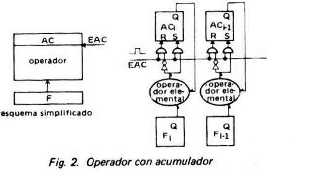

Operaciones Lógicas

Fuera de la complementación, que se consigue por circuitos NOT en el caso del operador combinacional
y por la complementación del acumulador, en el caso del operador con acumulador, las demás
operaciones se reducen esencialmente a operaciones AND, OR y ORX.

_Operador Combinacional:_ Utiliza el mismo esquema del operador combinacional visto anteriormente
sustituyendo los operadores elementales por el circuitos AND, si se trata de la operación de
intersección, OR si se trata de la operación reunión, ORX (OR exclusivo) si de la operación
diferencia simétrica.

_Operador con Acumulador:_ La organización presentada con la figura del operador con acumulador
anterior puede simplificarse, si se parte de la idea siguiente: en vez de ejecutar la operación con
los bits homólogos del registro fuente y del acumulador, se observa que basta, según el valor del
bit fuente F*i*, con dejar inalterado el bit del acumulador o forzarle a un valor no dependiente más
que de F*i*. Por ejemplo: para el AND, el bit acumulador continua inalterado si Fi = 1, pero debe
ponerse a cero si Fi = 0

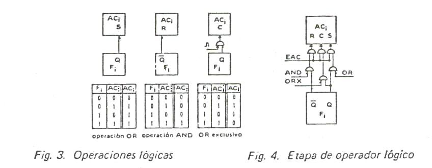

### UNIDAD ARITMÉTICO-LOGICA PARA ABACUS

La unidad aritmética de Abacus está montada entre un bus fuente M, donde se mantienen los niveles
lógicos representativos del segundo operando, y un acumulador AC que mantiene los niveles lógicos
correspondientes al primer operando hasta que la señal de muestreo EAC introduce el resultado en el
acumulador.

Consta de un sumador en paralelo y de un conjunto de puestas para ejecutar las operaciones lógicas y
distribuir las informaciones de acuerdo con las operaciones aritméticas a efectuar. Además, el
acumulador está montado como registro de desplazamiento.

Las diferentes operaciones están gobernadas por señales lógicas, procedente normalmente del
generador central de secuencias del ordenador. Todas estas señales son de nivel, de tal suerte que
al cabo de un cierto tiempo después del posicionamiento el resultado de la operación se estabiliza
bajo la forma de niveles lógicos, que serán introducidos en el acumulador por el impulso EAC. En la
figura siguiente se representa el _i-simo_ elemento de esta unidad. Las diferentes operaciones que
permite son:

**CAR** _Carga:_ transferencia al acumulador de la información presente sobre el bus M.

**CARC** _Carga con complementación:_ el mismo proceso, pero después de complementar cada dígito.

**SUM** **\***Adición:\* suma al contenido del acumulador, la información presente sobre el bus M.
Esta adición es operada por el sumador en paralelo y la duración de la misma es el tiempo de
propagación de los arrastres.


**SUS** _Sustracción:_ se resta la información en el bus M del contenido del acumulador. Se realiza
complementando la información del bus M y después sumándola en el sumador paralelo. La operación es
correcta si Abacus opera en complemento a 1. Si no, se precisa posicionar un nivel 1 a la entrada de
arrastre a la etapa de sumador de menor peso.

**AND** _intersección lógica:_ entre la información en el bus M y el contenido del acumulador.

**OR** _reunión lógica:_ entre la información en el bus M y el contenido del acumulador. Estas dos
últimas operaciones se realizan según el esquema de la etapa de operador lógico.

**ORX** _OR exclusivo:_ entre la información en el bus M y el contenido del acumulador. Esta
operación se ejecuta aquí por parte del sumador, inhibiendo la propagación de los arrastres.

**DESI** _Desplazamiento a izquierda_: desplazamiento del contenido del acumulador una posición
binaria a la izquierda.

**DESD** _Desplazamiento a derecha:_ desplazamiento del contenido del acumulador una posición
binaria a la derecha.

Los indicadores asociables a la unidad aritmética de Abacus podrían ser los siguientes:

**DEB** Indicador de desbordamiento.

**S** Indicador de signo.

**CE** Indicador de cero. Puede cablearse mediante un NOR recibiendo todas las salidas Q de los
biestables del acumulador, si Abacus trabaja en complemento a 2. (En complemento a 1 se precisaría
un OR detrás de un NOR para todas las salidas Q y de un NOR para todas las salidas Q’).

### ARITMETICA DE NUMEROS ALGEBRAICOS BINARIOS

Suma Acelerada

Es de notar en el sumador paralelo visto en la unidad anterior que el tiempo de estabilización de
las salidas de las etapas de sumador tras el posicionamiento de los biestables varía según los
operandos por sumar; el caso más desfavorable es aquel en que un arrastre generado al nivel del bit
de menor peso se propaga hasta el de mayor peso.

Por tanto es la duración de la propagación del arrastre a través del conjunto de las etapas lo que
debe tomarse como tiempo de adición, ya que no debe hacerse el muestreo antes de haber transcurrido
este tiempo, si se quiere estar seguro de haber obtenido la estabilización de las salidas.

Entre las numerosas soluciones propuestas para acelerar la operación de la suma citaremos la técnica
del puente (by pass). Se divide el sumador en secciones (o sub sumadores), cada uno de ellos activo
sobre un pequeño número de bits.

En una primera fase, se realizan las sumas al nivel de cada sección, sin tomar en cuenta el
arrastre, eventualmente generado en la sección inmediatamente anterior. En una segunda fase, los
arrastres son propagados.

El arrastre generado en la sección i-1 debe conducir a añadir 1 a la sección i; esta operación puede
llevar a la sección i a propagar también este arrastre hasta la sección i+1.

El procedimiento se centra en detectar, sin necesidad de realizar la propagación en la sección i, si
este arrastre existe y ha de transmitirse a la sección 1+1. Si la respuesta es positiva el arrastre
generado en la sección i-1 se transmitirá a la sección i+1 “puenteando” a la sección i; por
consiguiente, no tendrá que atravesar mas que una puerta.

Es cuestión de encontrar la condición que permitirá saber, sin tener que efectuar realmente la
propagación, si el arrastre puenteará o no la sección. Es fácil convencerse de que tal condición se
anuncia así: el arrastre será bloqueado cuando los dos operandos presenten dos dígitos binarios
idénticos en una de sus posiciones por lo menos, (o si el resultado obtenido en la primera fase de
la operación posee al menos un dígito 0).

En dicho tipo de sumador, la duración de la suma es igual al doble del tiempo máximo de propagación
del arrastre en una sección.

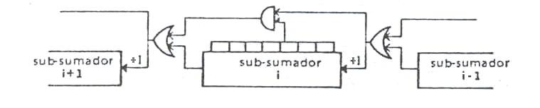

Adición y Sustracción

Sustraer un número de otro equivale a sumarle su opuesto. La sustracción se reduce a la suma
algebraica siempre que se sepa calcula el opuesto de un número, lo que generalmente se hace por
complementación. Este método evita tener que situar un Sustractor junto al sumador. Acá nos
limitaremos al estudio de la suma de dos números algebraicos al caso de la representación por
complementación auténtica (complemento a 2), ya que las dificultades planteadas por la
complementación restringida son muy semejantes.

Supondremos que nuestra unidad aritmética procesa números representados por _n_ bits, con el bit de
signo situado en la primera posición a la izquierda. Asociaremos al acumulador un (n+1)-simo bit,
que actuará de indicador de desbordamiento.

Para estudiar la operación de suma algebraica elaboramos un cuadro a tres entradas correspondientes
a las tres configuraciones posibles de signo de los operandos y considerando el arrastre n-1
procedente de la etapa inmediatamente a la derecha del bit de signo. La presencia de este arrastre
implica un desbordamiento en el caso de un resultado esperado positivo; su ausencia implica un
desbordamiento en el caso de un resultado esperado negativo.

El indicador de desbordamiento debe posicionarse solo en dos casos: cuando no hay arrastre de orden
_n-1_ pero hay arrastre de orden _n_ o bien cuando hay arrastre de orden _n-1_ pero no de orden _n_.

<table>
<tbody>
<tr>
<td>Condiciones de signo</td>
<td>2 operandos &gt; 0; el resultado debe ser positivo</td>
<td>1 operando &gt; 0; 1 operando &lt; 0. No puede haber desbordamiento</td>
<td>2 operandos &lt; 0; el resultado debe ser negativo</td>
</tr>
<tr>
<td>Representación inicial (registros de 5 bits)</td>
<td><p>0….</p>
<p>0….</p></td>
<td><p>1…..</p>
<p>0…..</p></td>
<td><p>1…..</p>
<p>1…..</p></td>
</tr>
<tr>
<td>Resultado si no hay arrastre procedente de la etapa n-1 </td>
<td><p>0….</p>
<p>Válido: resultado positivo.</p></td>
<td><p>1…..</p>
<p>Válido: resultado negativo</p></td>
<td><p>10….</p>
<p>No válido puesto que resultado positivo: desbordamiento.</p></td>
</tr>
<tr>
<td>Resultado si hay arrastre procedente de la etapa n-1</td>
<td><p>1….</p>
<p>No válido: puesto que resultado negativo: desbordamiento.</p></td>
<td><p>10….</p>
<p>Válido olvidándose del arrastre: resultado positivo</p></td>
<td><p>11….</p>
<p>Válido olvidándose del arrastre: resultado negativo.</p></td>
</tr>
</tbody>
</table>

### MULTIPLICACION Y DIVISION BINARIAS

Multiplicador Secuencial por Suma - Desplazamiento

Hay que mencionar que aquí nos limitaremos a las operaciones con los números en valores absolutos,
dejando aparte el tratamiento de los signos. Consideremos el siguiente ejemplo numérico:

1011 Multiplicando

_1101_ Multiplicando

1011

0000

1011

\_1011 \_\_

10001111 Producto

Los productos parciales son iguales al multiplicando si el bit correspondiente del multiplicador es
1, nulos en caso contrario. Una primera operación consiste, entonces, en verificar sucesivamente
cada bit del multiplicador, de donde se deducen los productos parciales que, convenientemente
desplazados, se totalizan en un acumulador. Nótese que si el multiplicador y el multiplicando tienen
n bits cada uno, el acumulador necesario deberá poseer capacidad para 2n bits; por consiguiente, el
resultado se obtiene en doble longitud. La unidad aritmética capaz de realizar una multiplicación
debe estar dotada de un anexo al acumulador, generalmente llamado “Multiplicador-Cociente”,
abreviadamente MC, porque contiene el multiplicador en el caso de la multiplicación, el cociente en
el caso de la división.

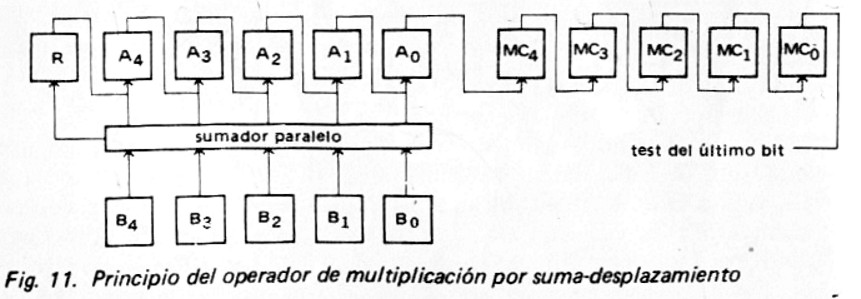

La operación se inicializa de la siguiente manera:

1. Carga del multiplicador en el acumulador.
2. Desplazamiento a derecha del contenido del conjunto formado por el acumulador y el registro MC,
   cuyo resultado es poner 0 en el acumulador y el multiplicador en MC.
3. Carga del multiplicando en B (que, eventualmente, pudiera ser sustituido por el RPM).

A continuación se ejecuta la operación siguiendo las líneas marcadas por el siguiente organigrama de
principio.


Al final de la operación, el resultado de la multiplicación ocupa en doble longitud el conjunto
acumulador + MC.

### TECNICAS DE MULTIPLICACION RAPIDA

Dos vías principales permiten aumentar, por medios lógicos, la velocidad de la multiplicación.

1. Basándose en la técnica tradicional de suma-desplazamiento y disminuyendo el número de
   operaciones parciales sucesivas.

2. Realizando un operador celular para una multiplicación casi paralela.

**\*1. Mejora de la técnica de Suma-Desplazamiento**:\* pueden aportarse modificaciones a la técnica
anterior. Entre las diversas soluciones propuestas, escogemos una que se refiere a la condensación
de operaciones por realizar cuando se tiene una sucesión de ceros o una sucesión de unos. Por
consiguiente se presupone que pueda verificarse el número de 0 o de 1 sucesivos.

**Caso de una sucesión de 0.** La mejora consiste en dotar al acumulador de circuitos para el
desplazamiento de varias posiciones en una sola operación. En estas condiciones, la sucesión de 0
será tratada por un solo desplazamiento.

**Caso de una sucesión de 1.** Se emplea el método llamado de “suma y sustracción”. En el esquema
tradicional una serie de 1 contiguos da lugar a una serie de adiciones, cada una seguida de un
desplazamiento.

El método consiste en sustituir esta serie de adiciones por una adición y una sustracción. Por
ejemplo, se la operación; **multiplicando x 01111100**; esta operación implica 5 adiciones, pero el
multiplicador puede también escribirse: **10000000 – 00000100**; de donde se deducen las reglas de
la operación para el caso de presentarse una serie de 1 son las siguientes:

\(1\) Al primer 1 de la serie, se resta el multiplicando del contenido del acumulador.

\(2\) Al primer 0 después de la serie, se suma el multiplicando con el contenido del acumulador,
tras haber ordenado un desplazamiento de tantas posiciones como 1 hay en la serie.

El esquema se puede mejorar aún más, por ejemplo, si se tiene un cero entre dos series de 1, ello
conduce normalmente a una suma para tomar en cuenta al 0 y a una sustracción para el siguiente 1. De
hecho, es posible agrupar estas dos operaciones en una sola sustracción al nivel del 0.

**\*2**. **Multiplicación celular en paralelo:\*** En el método de Suma-Desplazamiento,
eventualmente mejorado, la multiplicación consiste en hacer un determinado número de operaciones
sucesivas, cada una de las cuales debe concluirse antes de pasar a la siguiente. Pero es factible un
circuito combinacional con dos entradas (el multiplicando y el multiplicador) que de el resultado a
la salida en una sola operación. La red celular de la figura siguiente realiza la multiplicación:

|                       |                       |                       |                       |                       |                       |                       |                       |                       |                       |
| --------------------- | --------------------- | --------------------- | --------------------- | --------------------- | --------------------- | --------------------- | --------------------- | --------------------- | --------------------- |
|                       |                       |                       |                       |                       | **Y**<sub>**4**</sub> | **Y**<sub>**3**</sub> | **Y**<sub>**2**</sub> | **Y**<sub>**1**</sub> | **Y**<sub>**0**</sub> |
|                       |                       |                       |                       | x                     | **X**<sub>**4**</sub> | **X**<sub>**3**</sub> | **X**<sub>**2**</sub> | **X**<sub>**1**</sub> | **X**<sub>**0**</sub> |
| **A**<sub>**9**</sub> | **A**<sub>**8**</sub> | **A**<sub>**7**</sub> | **A**<sub>**6**</sub> | **A**<sub>**5**</sub> | **A**<sub>**4**</sub> | **A**<sub>**3**</sub> | **A**<sub>**2**</sub> | **A**<sub>**1**</sub> | **A**<sub>**0**</sub> |

Esta operación es ejecutada en paralelo. La señal EAC muestrea los niveles a la entrada del registro
A.

Si se exceptúan la fila y la comuna 0, la célula está constituida por una puerta AND y una etapa de
sumador. Si fijamos nuestra atención en la célula correspondiente a la fila i y a la columna j, la
puerta AND está cerrada si el bit X<sub>i</sub> del multiplicador vale 0: el sumador se limita a
transmitir a la fila inferior el resultado parcial precedentemente obtenido, desplazándolo una
posición.

En caso contrario, la puerta se abre: el sumador adiciona el nuevo producto parcial Y<sub>j</sub> al
resultado parcial obtenido en la fila superior, después practica el desplazamiento de una posición
transmitiéndolo a la fila inferior.

Esta sucesión, mucho más onerosa que la anterior, puesto que se multiplica por n el número de etapas
de sumador, ofrece la ventaja de ser muy rápida: aproximadamente el doble del tiempo de una suma de
n dígitos, ya que un arrastre atraviesa como máximo _2n+1_ etapas de sumador.

Multiplicación en Complemento a 2 ( STALLING )

En el caso de complemento a dos, cuando tenemos el multiplicador o multiplicando o ambos con signo
negativo debemos operar de diferente manera. Existen varias soluciones para este dilema. Una de
ellas es convertir el multiplicador y el multiplicando en números positivos, realizar la
multiplicación, y después tomar el complemento a 2 del resultado si y solo si el signo de los dos
números originales difiere. Los implantadores han preferido utilizar técnicas que no requieren este
paso final de transformación. Uno de los más comunes es el algoritmo de Booth.

El algoritmo de Booth se puede describir de la siguiente manera: El multiplicador y el multiplicando
se colocan el los registros Q y M, respectivamente. También existe un registro de 1 bit colocado de
manera lógica a la derecha del bit menos significativo (Q0) del registro Q y designado Q-1.

Los resultados de la multiplicación aparecerán en los registros A y Q. Los registros A y
Q<sub>-1</sub> se inicializarán en 0. Como antes la lógica de control analiza los bits del
multiplicador, uno a la vez. Ahora, cada bit es examinado, el bit a su derecha también es examinado.
Si los dos bits son el mismo (1-1 o 0-0), entonces todos los bits de los registros A, Q y
Q<sub>-1</sub> se corren un bit a la derecha. Si los dos bit difieren, entonces el multiplicando se
suma a o se resta del registro A, de acuerdo a si los dos bit son 0-1 o 1-0.

Siguiendo a la suma o la resta, el corrimiento a la derecha ocurre. En cualquier caso el corrimiento
a la derecha es tal que el bit más significativo de A, denominado An<sub>-1</sub>, no solo se
recorre a An<sub>-2</sub>, sino que también permanece en An<sub>-1</sub>. Esto se requiere para
preservar el signo del número en A y Q. Esto se conoce como un _corrimiento aritmético_, puesto que
preserva el bit del signo.

Divisor por Sustracción y Desplazamiento

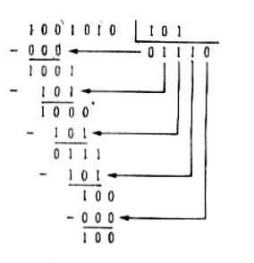

En la multiplicación, los productos parciales eran iguales al multiplicando o nulos, según que el
correspondiente bit del multiplicador valiera 1 ó 0. Se iban totalizando después de desplazar una
posición hacia la izquierda a cada producto parcial en relación con el anterior.

En la división, se resta del dividendo el divisor o cero, según que el correspondiente bit del
cociente valga 1 o 0. Se recomienza después de practicar un desplazamiento a la derecha del divisor
en relación con el dividendo. Por tanto, multiplicación y división son operaciones muy semejantes.
Basta cambiar sumas en sustracciones e invertir el sentido de los desplazamientos. Sin embargo, en
la división aparece una dificultad complementaria: es necesario añadir a cada etapa una operación de
comparación entre los bits de mayor peso de dividendo y divisor a fin de determinar el bit
correspondiente del cociente.

Para efectuar una división tomaremos de nuevo la unidad aritmética utilizada con la multiplicación
(casi siempre es común la unidad para ambas operaciones); pero transformaremos el sumador en
sustractor, invertiremos el sentido del desplazamiento y añadiremos el dispositivo de comparación.


Generalmente la operación se inicializa de la manera siguiente:

1. Carga del dividendo en el Acumulador

2. Desplazamiento a derecha del contenido del conjunto acumulador + MC, con objeto de poner a cero
   el acumulador y cargar el dividendo en el MC.

3. Carga del divisor en B.

La operación comenzará por un desplazamiento a izquierda del conjunto acumulador + MC, lo que tiene
por consecuencia poner el bit de mayor peso del dividendo en A<sub>0</sub> y liberar el biestable
MC<sub>0</sub>. Se compara el contenido del acumulador con el contenido del registro B. Si
(AC)\<(B), se pone MC<sub>0</sub> a cero sin tocar el acumulador, si (AC)\>=(B), se resta del
acumulador el divisor, se pone MC<sub>0</sub> a 1, etc. Al final de la operación, el registro
multiplicador cociente alberga al cociente y el resto aparece en el acumulador.

Por lo mismo que hemos obtenido en la multiplicación un resultado en doble longitud, puede
presuponerse aquí un dividendo de doble longitud. Basta cargar al principio los bits de mayor peso
del dividendo en el acumulador, y los bits inferiores al MC. En estas condiciones, se corre el
riesgo de cometer un error si el contenido del acumulador es mayor que el divisor: el cociente
excedería entonces a la capacidad del MC y se perderían sus bits de mayor peso.

Se evita este error comparando inicialmente los contenidos de acumulador y registro B. A este nivel
es cuando pueden detectarse las divisiones por cero. También puede convenirse en no dividir más que
por números enmarcados a izquierda, de manera que siempre el bit de mayor peso del divisor sea 1.
(Este será el caso en la división de números flotantes).


División con Restauración

En el punto anterior hemos dado por supuesto que contábamos con un dispositivo para comparar
directamente los valores numéricos de los contenidos del acumulador y del registro B. En realidad,
casi nunca se cuenta con él por razones de precio, por lo que puede hacerse la comparación
intentando restar el divisor del dividendo y comprobando el signo del resultado. Este es, además, el
procedimiento que empleamos cuando nos vemos obligados (desgraciadamente) a operar una división sin
máquina ni regla de cálculo. Pero, al contrario de lo que sucede en el papel, la unidad aritmética
pierde el antiguo valor del dividendo cuando el intento no surte efecto. En tal caso, es necesario
restaurarlo, añadiendo el divisor al dividendo antes de hacer un nuevo intento, de ahí el algoritmo
de la división con restauración.

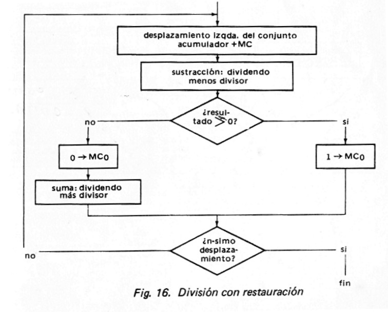

División sin Restauración

Corresponde a un algoritmo que permite ahorrar la fase de restauración después de una sustracción
con resultado negativo, lo que supone una ganancia de tiempo. Sea α el contenido del acumulador y β
el divisor antes de la fase de restauración. Esta consiste en hacer α + β, sistemáticamente seguida
de una sustracción del divisor desplazado (que vale β/2) y el resultado es (α + β) - β/2 = α + β/2.
Es posible combinar la restauración y la sustracción que la sigue en una sola operación: la suma del
divisor desplazado. En otros términos, un intento dando resto positivo ira seguido, al paso
siguiente, de la sustracción del divisor desplazado, mientras que un intento resultando en resto
negativo deberá seguirse de la suma del divisor desplazado.

### ARITMETICA EN COMA FLOTANTE

Recordemos que los números en coma flotante se representan en la forma S.M.α<sup>E</sup>, donde S es
el signo del número, M la mantisa, E el exponente y α la base (que generalmente vale 2 o 16 en
aritmética binaria). Las operaciones se llevan a cabo sobre números normalizados, esto es, sobre
números cuyo valor de exponente está ajustado para que la mantisa tenga el mayor número posible de
dígitos significativos. Por consiguiente, los operadores en aritmética flotante deben, no solamente
ejecutar la operación correspondiente, sino también normalizar el resultado obtenido.

Suma y Sustracción en Coma Flotante

La primera fase consiste en _alinear las mantisas_ con el objeto de enfrentar los bits del mismo
peso. Supongamos a sumar los números A = 12000 x 10<sup>-1</sup> y B = 80000 x 10<sup>2</sup>

No puede operarse directamente la suma de las mantisas, se comparan los exponentes y se detecta que
el primero de los números es más pequeño, sobre este número se ejecuta una doble operación:
incremento del exponente en una unidad y desplazamiento de la mantisa una posición a la derecha. De
nuevo se comparan y se recomienza hasta obtener identidad de exponentes. En ese momento puede
efectuarse la suma de las mantisas:

La segunda fase consiste en _ajustar los signos_. Consideremos la sustracción de A –B. En la
representación en valor absoluto y signo, se deben primeramente comparar las mantisas A y B,
comprobar que la de B es superior a la de A y deducir de ello que la operación pertinente es
sustraer la mantisa de A de la de B y al resultado darle el signo menos.

Debe tomarse así en cuenta en esta fase la clase de operación (suma o sustracción), el signo de los
operandos y el resultado de la comparación de mantisas. El problema se simplifica si el conjunto
signo-mantisa fuera representado en complementación cuando el número sea negativo.

La tercera fase es la _normalización del resultado_

Puede que el resultado bruto de la operación no esté normalizado, por dos razones:

- Hay desbordamiento de capacidad en la suma, en cuyo caso se deberá desplazar la mantisa una
  posición a la derecha, aumentando al mismo tiempo en una unidad el exponente.

- La diferencia de las mantisas implica un número de n ceros a la izquierda del resultado, en cuyo
  caso se deberá desplazar la mantisa n posiciones a la izquierda, restando simultáneamente n del
  exponente.

Funcionamiento de un Operador de Suma Flotante

Operando

S  1 bit signo del operando S = 0 (signo más); S = 1 (signo menos)

E e bits exponente; representa una potencia de 2 y está comprendido entre -2<sup>e-1</sup> y
2<sup>e-1</sup>-1; el exponente -2<sup>e-1</sup> está representado por E = 0 y el exponente
2<sup>e-1</sup>-1 está representado por E = 2<sup>e</sup>-1.

M  m bits mantisa; la mantisa de un operando negativo está representada en complemento a 2. Un
operando normalizado se caracteriza por el hecho de que el bit de signo y el bit de mayor peso de la
mantisa tienen valores diferentes.

Este operador utilizado comprende dos registros A y B para los operandos y un sumador m + 1 bits que
ejecuta las sustracciones por complementación previa del segundo operando.

Se emplea de una parte, para comparar los exponentes por sustracción cuyo resultado va a un registro
CD montado como contador-descontador binario con bit de desbordamiento, y por otra parte, para las
operaciones con signo y mantisa, cuyo resultado va a un registro RD montado como registro de
desplazamiento a derecha e izquierda con bit de desbordamiento (en general se utiliza el sumador de
la unidad aritmética, al que se le añade eventualmente un sumador de exponentes).

La operación se divide en varias fases:

1. **Comparación de los exponentes**: Se resta E<sub>B</sub> de E<sub>A</sub> sumando a
   E<sub>A</sub> E<sub>B</sub> complementado, y el resultado va a CD. Si el resultado es nulo, las
   dos mantisas están correctamente alineadas y se pasa inmediatamente a la fase de suma o
   sustracción de las mantisas. Si no, el contenido de CD permitirá contar los desplazamientos
   necesarios para alinear las mantisas.

2. **Alineamiento de mantisas**: Esta operación se realiza sobre el operando cuyo exponente es
   menor. Si E<sub>A</sub> \<sub E<sub>B </sub>el resultado de la sustracción de los exponentes es
   negativo y se caracteriza por el valor 1 del bit de desbordamiento. El complemento del contenido
   de CD indica el número de desplazamientos por efectuar. CD se usará entonces en funciones de
   contador, y los desplazamientos se sucederán hasta un nuevo desbordamiento.

El desplazamiento de la mantisa se efectúa en RD, entonces se envían los contenidos de S<sub>A</sub>
de M<sub>A</sub> yuxtapuestos a RD y se opera por desplazamiento aritmético hacia la derecha (lo que
permite reproducir el signo en los bits no significativos y por lo tanto conservar la representación
complementada).

En el caso E<sub>A</sub> \> E<sub>B</sub>, el desplazamiento aritmético a la derecha afecta a
S<sub>B</sub> y M<sub>B</sub>, pero en esta ocasión el registro CD se emplea como descontador,
deteniéndose los desplazamientos cuando CD=0 (nótese que después de todo, pueden detenerse al cabo
del m-ésimo desplazamiento ya que a partir de entonces la mantisa pierde todo su significado).

Esta fase finaliza preservando el mayor exponente en CD y devolviendo la mantisa contenida en RD al
registro A o B que corresponda.

1. **Suma-sustracción de las mantisas**: Estas operaciones se ejecutan sobre el conjunto formado por
   el signo y mantisa, yuxtapuestos. La sustracción se obtiene sumando S<sub>A</sub> M<sub>A</sub>
   el complemento auténtico de S<sub>B</sub> M<sub>B</sub>. El resultado a RD, tomando en cuenta el
   signo y un eventual desbordamiento.

Las operaciones de normalización se realizan mediante desplazamientos sobre el registro RD, que
contiene el signo y la mantisa del resultado, y sobre el registro CD, que contiene el exponente.

1. **Normalización en el caso de desbordamiento**: Consiste en desplazar la mantisa del resultado en
   una posición a la derecha, siendo sustituido el bit de mayor peso por el de desbordamiento. El
   signo queda inalterado. El contenido del registro CD se ve aumentado en una unidad.

2. **Normalización en caso que la mantisa del resultado contenga dígitos no significativos a su
   izquierda**: esta eventualidad es detectable haciendo un test sobre el signo y el digito de mayor
   peso de la mantisa. Si son diferentes, el número ya estaba normalizado. Sino, es preciso realizar
   desplazamientos aritméticos de la mantisa hacia la izquierda hasta que sean diferentes. A cada
   desplazamiento se resta una unidad del contenido de CD. El proceso se detiene incondicionalmente
   al cabo de **m** desplazamientos.

Multiplicación y División en Coma Flotante

La multiplicación flotante es reducible a la multiplicación de las mantisas y a la suma de los
exponentes, en tanto que la división se reduce a la división de las mantisas y a la sustracción de
los exponentes. No hay operación preliminar de comparación de exponentes o de alineamiento de las
mantisas. La normalización es sencilla si se compara con la suma. La multiplicación de dos números
comprendidos entre ½ y 1 da un resultado entre ¼ y 1, de tal suerte que la normalización supondrá,
como máximo, un desplazamiento de una posición a la izquierda. La división dará un resultado entre 2
y ½, de forma que su normalización implicará, como máximo, un desplazamiento de una posición a la
derecha. Se ejecutan estas operaciones sobre las mantisas representadas en valor absoluto.

## UCP — Unidad Central de Proceso

### PROCESADOR Y MICROPROCESADOR (UCP)

### Introducción

Para analizar el funcionamiento de un computador digital partimos de la siguiente base: un programa
es registrado en memoria antes de comenzar su ejecución. Esta memoria se llama Memoria Central o
Memoria Principal y entorno suyo se organiza el resto de las diferentes unidades de la máquina. Esta
memoria almacena dos clases de información: las instrucciones del programa que la máquina deberá
ejecutar y los datos (operandos) con los cuales efectuará la máquina los tratamientos dictados por
las instrucciones. La Unidad de Control (Unidad de Instrucciones o Unidad de Gobierno) tratará las
instrucciones y la Unidad Aritmética y Lógica (Unidad de Proceso) tratará los datos, de acuerdo a lo
“indicado” por la Unidad de Control (UC).

La UC extrae de la memoria central la nueva instrucción a ejecutar, la analiza y establece las
conexiones eléctricas correspondientes dentro de la ALU, extrae de la memoria central los datos
implicados por la instrucción, desencadena el tratamiento de dichos datos en la ALU y,
eventualmente, almacena el resultado en MC. La ALU opera con los datos que recibe siguiendo órdenes
de la UC.

Al conjunto UC y ALU se lo denomina Unidad Central de Procesamiento (UCP) o Procesador Central
(cuando están integradas en una sola pastilla -chip- se denomina microprocesador).

La UC necesita dos registros para operar:

1. Contador de instrucciones, contador de programa o contador ordinal, que contiene la dirección de
   la próxima instrucción por ejecutarse. Este registro aumenta su contenido en uno para pasar a la
   siguiente instrucción.
2. Registro de instrucción, que contiene la instrucción extraída de la MC. Este registro tiene (al
   menos en Abacus) dos partes: el código de operación, que indica que tratamiento se debe seguir, y
   la dirección del operando.

La UC tiene un órgano denominado Generador de secuencias o Secuenciador que, luego de analizar el
código de operación, distribuye las órdenes al conjunto de unidades del computador para hacerles
ejecutar las distintas fases de la instrucción en curso.

### Encaminamiento de las Informaciones

A fin de conocer y comprender el funcionamiento de un computador, vamos a describir la forma en que
se ejecutan las transferencias de información en la UCP. Para esto utilizaremos una máquina
hipotética que llamaremos Abacus.

### Convenciones de Gráfico y Lenguaje

Un registro será esquematizado por un rectángulo. Las entradas y salidas positivas serán
simbolizadas por una sola entrada y por una sola salida respectivamente.

No se representan las entradas y salidas negativas. Las puertas impulsionales que franquean la
entrada a los diferentes biestables de un registro serán esquematizadas por una sola puerta.
Utilizaremos las dos simbolizaciones de la siguiente. Figura:


Fig.1. Entrada de información en un registro.

La salida de un registro desembocará generalmente sobre un bus. Dado que varios registros pudieran
desembocar sobre el mismo bus, tendrán puertas de salida gobernadas por señales de nivel. Un
conjunto de registros podría estar situado entre dos buses como se ilustra en la siguiente figura:


Fig. 2. Registros situados entre dos buses

En el caso de una transferencia entre registros, la salida de información de un registro es
habilitada por una señal de nivel, una vez estabilizados los niveles en el bus en donde desemboca
esta señal, se activa una señal de impulso que habilita la entrada en el registro destino, como se
ve en la siguiente figura:

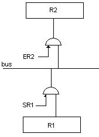

Fig. 3 Transferencia de información entre registros

La apertura de la puerta de nivel por la señal SR1 permitirá hacer subir al bus intermediario los
niveles de tensión dados por los biestables del registro R1. Una vez estabilizados estos niveles
podrá enviarse el impulso ER2, que autorizará la carga en R2 del contenido latente en el bus. Es
preciso entonces mantener la señal SR1 durante un intervalo suficiente para que los niveles se
estabilicen en el bus intermediario antes de enviar el impulso ER2.


Fig. 4.

En una máquina, estas señales estarán sincronizadas normalmente con un reloj productor de impulsos
periódicos.


Fig. 5.

### Descripción de la Unidad Central de Abacus

Características Generales:

- Instrucción de una sola dirección.
- Transferencias en paralelo.
- Máquina Síncrona (lo que implica que todos los elementos de la máquina están sincronizados con un
  mismo reloj).
- El reloj producirá un batido cada θ segundos.
- El ciclo de base de la memoria será de 2 θ.
- La longitud de la palabra será de n bits.
- La longitud del Código de Operación será de p bits.
- La longitud de la palabra es suficiente para que los m bits de la parte de dirección permitan
  direccionar toda la memoria.


Fig. 6 Esquema simplificado de Abacus

Abacus es una máquina organizada en torno a dos buses, que son el bus de memoria (bus M) que
transfiere las palabras leídas de, o escritas en memoria y el bus de selección (bus S) que
transfiere las direcciones.

Resumen de los registros de Abacus:

S: Registro de Selección de Memoria m bits.

P: Contador Ordinal o de Programa m bits.

M: Registro de Intercambio o de Palabra n bits.

I: Registro de instrucción con dos partes:

CO: Código de Operación p bits.

D: Dirección m bits.

AC: Acumulador n bits.

Estudiaremos el desarrollo de algunas instrucciones a fin de profundizar el esquema anterior y
conocer las transferencias de informaciones necesarias y el comportamiento de las señales que las
gobiernan.

### La Suma de Abacus

|     |           |
| --- | --------- |
| SUM | DIRECCION |

Suma el contenido de la célula de memoria designada por la dirección con el contenido del
acumulador. Se descompone en cuatro fases:

_Fase 1:_ Búsqueda de la Instrucción.

Suponiendo que la dirección de la instrucción por ejecutar se halle en el contador ordinal, es
preciso:

Transferir el contenido del Contador Ordinal al Registro de Selección de Memoria (RSM): (P) → S

Lanzar un ciclo de memoria, de tal modo que sea transferido el contenido de la célula de memoria
direccionada por el registro S al registro de palabra. ((S)) → M.

Análisis del Proceso:

\(P\) → S. Durante el último θ de la instrucción precedente, la señas SRP mantiene abierta la puerta
de salida del registro P, por lo que la información de P está latente en el bus S bajo la forma de
niveles lógicos. Bastará con validar esta información al primer batido de reloj de la instrucción
por medio de la señal de muestreo (de impulso) ENS para introducirla en el registro S.

((S)) → M. Será necesario lanzar un ciclo de memoria mediante la señal impulsional ICM (inicio de
ciclo de memoria), indicar que se trata de una lectura, manteniendo por ejemplo la señal LEC durante
todo el intervalo del ciclo (y en cualquier caso hasta el inicio de la regeneración) y, si fuera
preciso, poner a cero el registro M antes de la lectura de los núcleos (PACM).


Fig. 7. Búsqueda de la instrucción


Fig. 8. Cronograma de la búsqueda de la instrucción

Cronograma de búsqueda de la instrucción

La fase de búsqueda de la instrucción puede resumirse así:

\(P\) → S SRP, ENS

((S)) → M ICM, PACM, LEC

_Fase 2:_ Búsqueda del Operando.

Debe enviarse la instrucción contenida en el registro M al registro I para proceder a su
decodificación: (M) → I, la parte de dirección D de la instrucción, que especifica la dirección del
operando ha de ser transferida al registro S: (D) → S, de manera que, tras un semiciclo de lectura,
el operando se encuentre en el registro M: ((S)) → M.

Análisis paso a paso del proceso:

\(M\) → I. La instrucción se encuentra en el registro M antes del fin del primer θ del ciclo, se
abre la puerta de salida del registro M al bus M durante este primer θ, para que, así mantenida la
información en el bus M, pueda forzarse su introducción en I gracias a la señal de muestreo ENI,
sincronizada con el segundo batido del reloj del ciclo de memoria.

\(D\) → S. El registro I se divide en dos partes: una parte de control, con el CO e informaciones
complementarias, y una parte de dirección. La decodificación de la primera parte indica que esta
dirección es la del operando que debe ahora localizarse en la memoria.

Por consiguiente, es preciso enviar la parte de dirección del registro I al registro S abriendo la
puerta de nivel (señal SRD) para mantener la información en el bus S. Al siguiente batido se abrirá
la puerta impulsional de entrada en S (señal ENS).

((S)) → M. Se borrará el registro M (señal PACM) simultáneamente con la introducción en S y se
lanzará un ciclo de memoria por medio de un impulso ICM, indicando que se trata de una lectura
gracias al mantenimiento durante todo el nuevo ciclo del nivel LEC.


Fig. 9. Transferencia de la instrucción y búsqueda del operando


La fase de búsqueda del operando puede resumirse así:

\(M\) → I SRM, ENI

\(D\) → S SRD, ENS

((S)) → M ICM, PACM, LEC

_Fase 3:_ Ejecución de la Suma.

Se trata de sumar el contenido de M con el contenido de AC: (M) + (AC) → AC.

Los niveles lógicos correspondientes a los registros M y AC durante todo el tiempo de trabajo del
sumador, consagrado esencialmente a la propagación del arrastre. Se consigue por las señales SRM,
ENA, SUM. Terminada la suma, una señal EAC introduce el resultado en el AC.

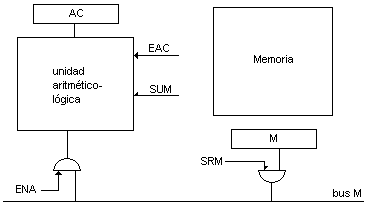

Fig. 11. Ejecución de la Suma


Fig. 12. Cronograma de la Ejecución de Suma

La fase de procesamiento del operando puede resumirse así:

\(M\) + (AC) → AC SRM, ENA, SUM, EAC

_Fase 4:_ Preparación de la próxima instrucción.

Esta fase se dedica esencialmente a incrementar el contador de programa en 1: (P) + 1 → P,
enviándole un impulso de cuenta INCP para que al final de la instrucción contenga la dirección de la
próxima instrucción. Esta última reanudará nuevamente el proceso: (P) → S, ciclo de búsqueda de la
instrucción, etc.


Fig. 13. Preparación de la siguiente instrucción

La fase de preparación de la próxima instrucción puede resumirse así:

\(P\) + 1 → P INCP

\(P\) → S SRP, ENS

Síntesis de la suma en Abacus:


Fig. 14. Cronograma de la suma en abacus

\(P\) → S SRP, ENS

((S)) → M ICM, PACM, LEC

\(M\) → I SRM, ENI

\(D\) → S SRD, ENS

((S)) → M ICM, PACM, LEC

\(M\) + (AC) → AC SRM, ENA, SUM, EAC

\(P\) + 1 → P INCP

\(P\) → S SRP, ENS

Instrucción de Almacenamiento en Abacus:

El primer ciclo de la instrucción es idéntico al de la suma. El segundo ciclo consiste en almacenar
el contenido del acumulador en memoria, en la dirección especificada por la instrucción. Entonces
será preciso reproducir en M el contenido del acumulador, justo antes de la escritura en memoria.

\(D\) → S SRD, ENS

(AC) → M SAC, ENM

\(M\) → (S) ICM, ESC


Fig. 15. Almacenamiento del Acumulador


Fig. 16. Cronograma del Almacenamiento

Instrucción de Salto incondicional en Abacus:

La información de la parte de dirección de la instrucción debe ser transferida simultáneamente a S
para buscar la próxima instrucción y a P para actualizar el contador: (D) → S, (D) → P.

Obsérvese que esta instrucción no dura más que un ciclo de memoria y que no hay que incrementar en 1
el contador como ocurre en las otras instrucciones.

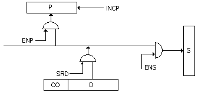

Fig. 17. Carga de la dirección de salto


Fig. 18. Cronograma del Salto incondicional

Resumen del desarrollo de la operación de salto incondicional

\(P\) → S SRP, ENS

((S)) → M ICM, PACM, LEC

\(M\) → I SRM, ENI

\(D\) → P SRD, ENS

\(D\) → S SRD, ENP, ENS

### Señales de Gobierno de Abacus

Son todas las señales de impulsos o de nivel empleadas para gobernar las distintas operaciones en el
desarrollo de una instrucción. Las clasificaremos en tres categorías:

<table>
<tbody>
<tr>
<td colspan="4">Señales de transferencia:</td>
</tr>
<tr>
<td>ENS</td>
<td>Impulso</td>
<td>(bus S)</td>
<td>→ S</td>
</tr>
<tr>
<td>PACM</td>
<td>Impulso</td>
<td>0</td>
<td>→ M</td>
</tr>
<tr>
<td>SRM</td>
<td>Nivel</td>
<td>(M)</td>
<td>→ bus M</td>
</tr>
<tr>
<td>ENM</td>
<td>Impulso</td>
<td>(bus M)</td>
<td>→ M</td>
</tr>
<tr>
<td>ENI</td>
<td>Impulso</td>
<td>(bus M)</td>
<td>→ I</td>
</tr>
<tr>
<td>ENA</td>
<td>Nivel</td>
<td>(bus M)</td>
<td>→ UAL</td>
</tr>
<tr>
<td>SAC</td>
<td>Nivel</td>
<td>(AC) bus</td>
<td>→ M</td>
</tr>
<tr>
<td>ENP</td>
<td>Impulso</td>
<td>(bus S)</td>
<td>→ P</td>
</tr>
<tr>
<td>SRD</td>
<td>Nivel</td>
<td>(D) bus</td>
<td>→ S</td>
</tr>
<tr>
<td>SRP</td>
<td>Nivel</td>
<td>(P) bus</td>
<td>→ S</td>
</tr>
<tr>
<td>INCP</td>
<td>Impulso</td>
<td>(P) + 1</td>
<td>→ P</td>
</tr>
</tbody>
</table>

<table>
<tbody>
<tr>
<td colspan="3">Señales de gobierno de la memoria:</td>
</tr>
<tr>
<td>ICM</td>
<td>Impulso</td>
<td>Inicio ciclo memoria</td>
</tr>
<tr>
<td>LEC</td>
<td>Nivel</td>
<td>Ciclo de lectura</td>
</tr>
<tr>
<td>ESC</td>
<td>Nivel</td>
<td>Ciclo de escritura</td>
</tr>
</tbody>
</table>

<table>
<tbody>
<tr>
<td colspan="3">Señales de gobierno de la unidad aritmético-lógica:</td>
</tr>
<tr>
<td>CAR</td>
<td>Nivel</td>
<td>Carga acumulador</td>
</tr>
<tr>
<td>SUM</td>
<td>Nivel</td>
<td>Suma </td>
</tr>
<tr>
<td>SUS</td>
<td>Nivel</td>
<td>Sustracción</td>
</tr>
<tr>
<td>Etc</td>
<td>. . .</td>
<td>. . .</td>
</tr>
<tr>
<td>EAC</td>
<td>Impulso</td>
<td>Introducción del resultado en el AC</td>
</tr>
</tbody>
</table>


Fig. 19. Esquema de Abacus

A fin de presentar esta “Unidad” que reúne los elementos anteriormente descriptos, recurrimos a la
definición de “Abacus”. Máquina hipotética descripta por Meinadier y al concepto de “Ruta de Datos”
del mismo autor.

### Organización y Componentes de la Ruta de Datos

### Ruta de Datos

Es el conjunto de órganos de la máquina que intervienen para transferir, memorizar y procesar las
informaciones (instrucciones, direcciones y operandos) procedentes de la MC.

Buses de Interconexión: Para la transferencia de información.

Registros y memorias: Para su almacenamiento.

Unidades funcionales: Para su procesamiento.

Las señales de gobierno están distribuidas por toda la ruta autorizando las diferentes operaciones.
Se las llama microórdenes y son generadas por el secuenciador.

Por una parte haremos la distinción entre unidad de instrucciones y unidad de procesamiento. Esta
distinción se basa en la diferencia entre dos tipos de información: Instrucciones y direcciones por
un lado, operandos por el otro. Del mismo modo haremos la distinción entre ruta de datos y
distribución de microórdenes.

Esta distinción también se basa en la diferencia entre dos tipos de información: las informaciones
conocidas del programador (instrucciones, direcciones y operandos) por una parte, y las
informaciones desconocidas del programador; que son las microórdenes. Los puntos de contacto entre
ruta de datos y distribuidor de microórdenes se sitúan a dos niveles: 1) El registro de instrucción,
puesto que las microórdenes por distribuir dependen del código de operación; 2) El impacto de las
microórdenes sobre los diversos componentes de la ruta de datos (puede considerarse a la MC parte de
la ruta de datos).

Dimensión de la ruta de Datos: Es el número de dígitos transmitidos en paralelo por la ruta. La
dimensión puede variar a lo largo de una misma ruta de datos. Por ejemplo, en una máquina como
Abacus, la dimensión de la ruta de datos es igual a la dimensión de la palabra de máquina, en lo que
se refiere a las instrucciones de los operandos; en cambio, las direcciones se transfieren sobre un
número más restringido de dígitos.

El estudio de la ruta de datos abarcará:

Los registros y su interconexión.

El encadenamiento de los operandos y la utilización de las unidades funcionales.

El encadenamiento de las direcciones y las técnicas de direccionamiento de la MC.

### Registros de la Ruta de Datos y su Interconexión

_Plano Funcional_: Se distinguen dos tipos de registros.

**Registros no direccionables**: Poseen una función bien definida y exclusiva. Ejemplo: RI, AC y
Multiplicador Cociente, Contador de Programa, R. de Selección del Memoria., Contador de
Desplazamientos. Algunos de estos registros pueden permanecer desconocidos del programador. Se dirá
que le son transparentes. Otros son implícitamente diseccionados por el programador, como es el caso
del AC de Abacus en cuanto a todas las instrucciones aritméticas y lógicas.

**Registros direccionables**: Son los que el programador puede emplear para conservar determinadas
informaciones en el transcurso del cálculo. Entre los distintos registros direccionables se aprecian
tres categorías:

_Registros aritméticos:_ Para conservar resultados parciales.

_Registros de direccionamiento:_ Para conservar elementos fijos de direccionamiento de partes de
programas o de vectores.

_Registros Banalizados:_ Un registro direccionable que puede usarse indistintamente como registro
aritmético o de direccionamiento.

_Plano Estructural:_ Se distinguirán tres posibles organizaciones de registros direccionables:

**Registros independientes**: La dirección de los registros necesita ser decodificada para obtener
las señales de apertura o de clausura de las puertas de los registros.

**Memorias locales**: La dirección del registro le será dada a la memoria sin decodificación previa.
En comparación con un conjunto de registros independientes presentan una ventaja económica (menos
puntos de entrada y de salida, un solo Circuito Integrado), pero, como contrapartida, no autorizan
simultáneamente más que una sola operación de lectura o escritura.

**Seudo-Registros**: Son registros direccionables que carecen de existencia física dentro de la ruta
de datos. Son simulados en MC o en M. Local.

Las interconexiones entre registros pueden ser directas o a través de buses. La interconexión por
bus tiene, frente a las conexiones directas, la ventaja de ser barata, pero no permite
transferencias simultáneas.


Fig. 20 Interconexión Directa de 6 registros 2 a 2 Interconexión por bus de 6 registros

### Encaminamiento de los Operandos y utilización de las Unidades Funcionales

Veremos esquemas de organización de la ruta de los operandos, demostrativos de las relaciones entre
estos diversos elementos, como se encuentran en las pequeñas máquinas constituidas por unidades
aritméticas y lógicas combinacionales.

### Esquemas Con Una Sola Unidad Funcional

**Utilización de los Registros Aritméticos Montados como ML** (memoria local)

Las operaciones se llevan a cabo entre el registro M y uno de los registros aritméticos de la
memoria local o el acumulador. El resultado obtenido en el AC puede ser almacenado en ML. El
acumulador sería innecesario si se cumplieran las dos hipótesis siguientes:

Toda operación aritmética implica a un operando en ML y a un operando en MC y el resultado sustituye
el operando de la ML.

La ML está cableada de manera que la palabra seleccionada pueda ser utilizada en lectura hasta que
se introduzca allí una nueva información.


Fig. 21. Ruta de datos con registros aritméticos organizados como memoria local.

### Unidades Funcionales con Registros Aritméticos Independientes

La preparación de la ruta de datos para la ejecución de una operación consiste en abrir las puertas
para permitir que los dos operandos estén presentes en las entradas de la unidad funcional y en
posicionar la unidad funcional para ejecutar la operación solicitada. Después de esperar el tiempo
necesario a la ejecución de la operación, bastará con enviar un impulso para muestrear el resultado
en el registro escogido, en consecuencia no es imprescindible un registro tampón en la unidad
funcional.


Fig. 22. Ruta de datos con registros aritméticos independientes

### Combinación de Registros Independientes y de una Memoria Local

Esta organización permite en particular procesar fácilmente operandos de longitud múltiple en
relación con la dimensión de la ruta de datos; se ejecutan las operaciones con un operando sobre n
palabras en MC y otro sobre n registros en ML, almacenando los resultados intermedios en los
registros independientes, como sucede en la multiplicación o división, por ejemplo. Un conjunto de n
células de ML con un operando en longitud múltiple se denomina, a menudo, seudo-registro, porque
simula un registro aritmético de longitud múltiple.


Fig. 23. Ruta de datos con memoria local y registros independientes

### Adaptación de las unidades funcionales al formato de los operandos

Los operando por procesar pueden presentarse bajo diferentes formatos: formato decimal; formato
binario fijo, de simple y doble longitud; formato binario flotante, de simple y doble longitud. Es
posible hacer ejecutar todas las operaciones aritméticas con estos operandos por una sola unidad
funcional, bien porque se utilice una cuya dimensión sea igual a la del mayor formato (en tal caso
se emplea solo parcialmente con los operandos cortos), bien porque se utilice una unidad de pequeña
dimensión, en cuyo caso ha de emplearse total y repetitivamente para procesar cada operando largo.

### Esquemas Con Varias Unidades Funcionales

Especialización de las Unidades Funcionales:

Acabamos de ver que es posible realizar con una sola unidad funcional operaciones con operandos de
formatos diferentes. Una solución más costosa, pero más eficaz, consiste en utilizar varias unidades
funcionales adaptando cada una a un tipo de operación o a un particular formato en los operandos.
Así podrá haber una unidad funcional de procesamiento de caracteres y de aritmética decimal; una
unidad para la aritmética fija, una unidad para la aritmética flotante, etc.

Operaciones Simultáneas:

Pudiera ser necesario emplear varias unidades funcionales simultáneamente, bien para la ejecución de
una instrucción, bien para permitir un cierto grado de simultaneidad entre instrucciones diferentes.
La ruta de datos de la siguiente figura autoriza operaciones simultáneas puesto que cada registro se
conecta en forma independiente a todos los buses de entrada y de salida de las diferentes unidades
funcionales.


Fig. 24. Ruta de datos con varias unidades funcionales

### MODOS DE DIRECCIONAMIENTO

### Diferentes Clases de Direccionamiento

Direccionamiento Normal, Directo o Absoluto.

Direccionamiento Inmediato.

Direccionamiento Indirecto

Direccionamiento Indexado

Direccionamiento Relativo

Direccionamiento por Base y Desplazamiento.

Direccionamiento por Referencia al Programa.

Direccionamiento por Página o Yuxtaposición.

Las diferentes técnicas de direccionamiento equivalen generalmente a una transformación de la parte
de dirección de la instrucción en la dirección que se transferirá finalmente al registro de
selección en memoria para obtener la información deseada. Llamaremos a esta última _dirección
efectiva_. El tipo de procesamiento que debe sufrir el contenido de la zona de dirección viene
especificado, o por el código de operación cuando éste impone un tipo determinado, o por la
configuración binaria de una parte de la instrucción que contiene lo que convendremos en llamar las
_condiciones de direccionamiento_. La instrucción en un calculador de una dirección de tres partes:

|                     |                                 |                              |
| ------------------- | ------------------------------- | ---------------------------- |
| CO                  | CD                              | D                            |
| Código de Operación | Condiciones de Direccionamiento | Zona de Dirección de Memoria |

### Direccionamiento Inmediato

No es propiamente un direccionamiento, puesto que la parte de dirección de la instrucción contiene
ya el operando que se quiere procesar. Este tipo de direccionamiento no consume ciclo de memoria.

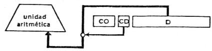

Fig. 25. Direccionamiento inmediato

### Direccionamiento Normal (directo y absoluto)

La zona de dirección de la instrucción contiene la dirección efectiva del operando. El
direccionamiento normal exige un ciclo de memoria para obtener el operando. Su limitación es que
proporciona un espacio de direcciones reducido.


Fig. 26. Direccionamiento normal

### Direccionamiento Indirecto

La parte de dirección de la instrucción contiene, no la dirección de la información pedida, sino la
dirección de una palabra de memoria donde se encontrará la dirección efectiva de la información. Por
tanto, la localización de un operando direccionado indirectamente exigirá dos ciclos de memoria: un
ciclo para buscar la dirección efectiva, otro ciclo para buscar el contenido del operando. Su
ventaja es que permite ampliar el espacio de direcciones con respecto al direccionamiento directo.

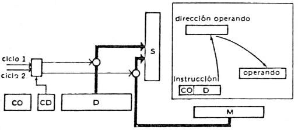

Fig. 27. Direccionamiento indirecto

### Direccionamiento Relativo

La dirección relativa no indica la posición de la información en la memoria en valor absoluto, sino
que la sitúa en relación a una dirección de referencia. Esta, a su vez, está almacenada en un
registro frecuentemente llamado registro de traslación. La dirección efectiva se obtendrá sumando la
dirección relativa con la dirección de referencia. Las técnicas de direccionamiento relativo se
emplean especialmente cuando la longitud de la palabra de memoria es insuficiente para permitir
direccionar a toda la memoria.

### Direccionamiento por base y desplazamiento

Un registro de la máquina, llamado registro de base, contiene la dirección de referencia (primera
dirección de un programa o de una zona de datos, por ejemplo). A la información que alberga la parte
de dirección se le llama desplazamiento. La dirección es la suma de la base y del desplazamiento.
Algunos calculadores admiten varios registros de base. La instrucción debe especificar entonces la
dirección de registro de base escogido.


Fig. 28. Direccionamiento por base y desplazamiento

### Direccionamiento por Referencia al Programa

El contenido del contador de programa sirve de dirección de referencia. Con este sistema es posible
generalmente direccionar dos zonas de memoria a un lado y a otro de la instrucción en curso, según
que la parte de dirección se sume o se reste con el contenido del contador.

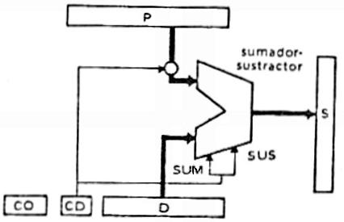

Fig. 29. Direccionamiento por referencia al programa

### Direccionamiento por Página (o por Yuxtaposición)

Se considera a la memoria dividida en zonas de 2<sup>n</sup> palabras llamadas páginas. En general
la parte de dirección de la instrucción contiene n bits, por lo que no capacita a la máquina para
direccionar más palabras que las que tiene una página. La dirección efectiva se obtendrá por
yuxtaposición del número de página (o dirección de página), supuesto conocido y de la parte de
dirección de la instrucción, que suministra la dirección dentro de la página.

Las condiciones de direccionamiento, en la mayoría de los pequeños ordenadores organizados por
páginas, poseen un BIT de direccionamiento que, según su valor, implica el direccionamiento
absoluto, es decir dentro de la página cero, o el direccionamiento dentro de la página de la
instrucción en curso por yuxtaposición de los bits de mayor peso del contador de programa y de la
dirección dentro de la página. En este caso, el direccionamiento por yuxtaposición puede ser
considerado como un direccionamiento por referencia al principio de la página en curso.

<span id="anchor"></span>

Fig. 30. Dirección en la página cero o en la página de la instrucción

### Direccionamiento Indexado

Se obtiene la dirección efectiva sumando a la parte de dirección de la instrucción el contenido de
un registro de la unidad central llamado registro índice; a menudo se llama índice al contenido. El
registro de índice admite un cierto número de operaciones, como carga, lectura, incremento o
decremento en 1, comparación. El programador lo utiliza para tratar, mediante una sola instrucción
en un bucle de programa, datos almacenados vectorialmente en células sucesivas de la memoria. El
direccionamiento correspondiente es indexado, lo que quiere decir que la dirección especificada en
la instrucción es la primera célula del vector y a ella se suma el valor del índice, inicialmente
puesto a cero e incrementado en 1 cada vez que se ejecute la instrucción de fin de bucle. Esta
última compara el índice con el número de elementos del vector y origina un salto al principio del
bucle mientras quede algún elemento por procesar.


Fig. 31. Indexación

En algunos calculadores el índice se inicializa en (n-1), donde n representa el número de elementos
del vector, la dirección especificada en la instrucción es la última del vector, el índice se
incrementa en 1 a cada pasada y se sale del bucle cuando el índice es cero. Otras máquinas poseen
dos registros por índice, uno contiene el índice, el otro contiene el valor máximo de este índice,
ambos resultan comparados al momento de la instrucción de fin de bucle y se origina un salto al
principio del mismo mientras no se produzca coincidencia entre los dos valores.

Combinación de los diferentes tipos de direccionamiento.

Es posible combinar, dentro de los límites impuestos por la concepción de la máquina o por el simple
sentido común, los diversos tipos de direccionamiento.

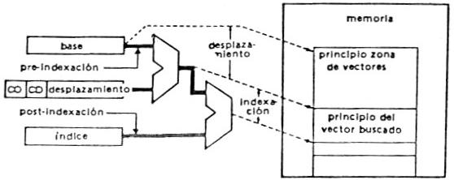

Fig. 32. Lógica de direccionamiento relativo con indexación


Fig. 33. Sumador de direcciones con 3 entradas

### Relación entre los tipos de direccionamiento

### Pre-indexación y Post-indexación

Se denomina pre-indexación al direccionamiento por suma desplazamiento, y post-indexación al
direccionamiento por suma del índice.

### Combinación de los diferentes tipos de direccionamiento

Es posible combinar, dentro de los límites impuestos por la concepción de la máquina y por el
sentido común, los diversos tipos de direccionamiento. Véase la siguiente figura:


Fig. 34. Lógica del direccionamiento relativo con indexación

Las máquinas potentes con pre- y post-indexación, efectúan el cálculo de direcciones en un sumador
de direcciones con tres entradas.


Fig. 35. Sumador de direcciones con tres entradas

Si se combinan pre-indexación, post-indexación y direccionamiento indirecto es preciso establecer
una norma de prioridad entre los tres tipos de direccionamiento. Generalmente se acepta el orden que
permite direccionar, por medio de una sola instrucción, un elemento de un vector cuya dirección del
primer elemento del vector se encuentra en una célula de memoria, cuya dirección es definida
relativamente al contenido de un registro base:

1. Pre-indexación, es decir, se obtiene en primer lugar la dirección absoluta de la célula de
   memoria que contiene la dirección del primer elemento del vector:

Base + Desplazamiento

1. Direccionamiento indirecto, es decir, la célula de memoria hallada anteriormente será el nuevo
   desplazamiento, pudiendo ahora encontrar la célula de memoria del primer elemento del vector:

(Base + Desplazamiento)

1. Post-indexación, para obtener la dirección del elemento buscado dentro del vector, puesto que el
   registro de índice tendrá el número de orden elemento en el vector:

Dirección efectiva = (Base + Desplazamiento) + índice

Algunas máquinas con direccionamiento indirecto en cascada permiten también una eventual indexación
por cada nivel de indirección, basándose en los indicadores de indirección e indexación repetidos en
las palabras que albergan las sucesivas direcciones

### Resumen sobre tipos de direccionamiento

|                                              |                                                |
| -------------------------------------------- | ---------------------------------------------- |
| Operando inmediato                           | Operando = (D)                                 |
| Direccionamiento normal (directo y absoluto) | Dirección efectiva = (D)                       |
| Direccionamiento indirecto                   | Dirección efectiva = ((D))                     |
| Direccionamiento relativo                    |                                                |
| \- base y desplazamiento (pre-indexación)    | Dirección efectiva = (B) + (D)                 |
| \- por referencia la programa                | Dirección efectiva = (P) ± (D)                 |
| \- en la página de la instrucción            | Dirección efectiva = dirección de página + (D) |
| Direccionamiento indexado (post-indexación)  | Dirección efectiva = (D) + (X)                 |

### FORMATO Y CLASIFICACIÓN DE LAS INSTRUCCIONES

Un formato de instrucciones define la descripción en bits de una instrucción, en términos de las
distintas partes que la componen. Un formato de instrucciones debe incluir un código de operación e,
implícita o explícitamente, ningún o algunos operandos. Cada operando implícito se referencia
utilizando uno de los modos de direccionamiento estudiados. El formato debe, implícita o
explícitamente, indicar el modo de direccionamiento para cada operando. En la mayoría de los
repertorios de instrucciones se emplea más de un formato de instrucción.

### Longitud de instrucción

El aspecto más básico a considerar en el formato de instrucción es la longitud de la instrucción.
Este aspecto afecta, y se ve afectado, por el tamaño de la memoria, su organización, la estructura
de buses, complejidad de la CPU y velocidad de la CPU. En la medida que se contemplen más códigos de
operación y más operandos en la instrucción, se hará más fácil el trabajo del programador, logrando
programas más cortos que realicen las mismas tareas. Por otra parte, disponer de más modos de
direccionamiento dará más flexibilidad al programador para implementar ciertas funciones, tales como
la gestión de tablas y las bifurcaciones multi-rama.

Además de poder direccionar rangos de memoria grandes. Todo esto requiere bits, resultando en
instrucciones de longitud cada vez más largas. Además debe cumplirse que el tamaño de la instrucción
sea igual al tamaño de las transferencias a memoria (en un sistema basado en un bus, igual al tamaño
del bus de datos), o que uno fuera múltiplo del otro. De no ser así, no conseguiremos un número
entero de instrucciones durante un ciclo de búsqueda de la instrucción. Otra consideración a tener
en cuenta es la velocidad de la memoria.

Esta no es tan rápida como la velocidad de la CPU, y puede convertirse en un cuello de botella si el
procesador puede ejecutar las instrucciones más rápido de lo que puede captarlas. Una solución a
esto es utilizar memoria caché, otra es utilizar instrucciones más cortas. Otro punto a tener en
cuenta es que la longitud de la instrucción debiera ser un múltiplo de la longitud de un carácter,
que normalmente es de 8 bits, y de la longitud de los números en punto fijo.

### Asignación de los bits

Otro aspecto a considerar es como asignar los bits en un formato de instrucción determinado. Para
una longitud de instrucción dada, existe un compromiso entre el número de códigos de operación y la
capacidad de direccionamiento. Cuanto mayor sea el número de códigos de operación, mayor cantidad de
bits para el campo CO, por ende, menor cantidad de bits para el direccionamiento de los operandos.

Existe un refinamiento interesante que es el uso de códigos de operación de longitud variable. De
modo que existe una longitud mínima de CO, pero, para algunos códigos, se pueden especificar
operaciones adicionales utilizando más bits de la instrucción. Los siguientes factores, relacionados
entre sí, afectan a la definición del uso dado a los bits de direccionamiento.

- _Número de modos de direccionamiento_: en algunos casos, un modo de direccionamiento puede
  indicarse de manera explícita, en otros casos, debe hacerlo de forma explícita, de modo que se
  necesitará uno o más bits de modo.

- _Número de operandos_: la cantidad de operandos que puede ser direccionada por una sola
  instrucción afecta significativamente el número de bits asignado a direccionamiento, asimismo, si
  una instrucción puede direccionar dos operandos, estos podrían tener un modo de direccionamiento
  distinto, debiendo quizás expresar ambos explícitamente o uno de ellos en forma implícita.

- _Registros frente a memoria_: una máquina debe disponer de registros para traer los datos a la CPU
  a fin de procesarlos. Cuanto más registros tenga, más fácil será la programación y, considerando
  un número entre 8 y 32 registros como aceptable, solo se necesita una cantidad mínima de bits para
  direccionarlos.

- _Número de conjunto de registros_: Si en lugar de tener un banco de registros de 16 registros, por
  ejemplo, se divide en 2 o más bancos, esta partición requiere menos bits de la instrucción. Por
  ejemplo, con dos conjuntos de 8 registros, solo se necesitan 3 bits para identificar un registro,
  el código de operación determina de forma implícita que conjunto de registro se está
  referenciando.
- _Rango de direcciones_: El rango de direcciones que puede utilizarse está relacionado con el
  número de bits de direccionamiento. Dado que esto impone una limitación severa, raramente se
  emplea direccionamiento directo.

- _Granularidad de las direcciones_: Para direcciones que hacen referencia a memoria, en un sistema
  con palabras de 16 o 32 bits, una dirección puede referenciar una palabra o un byte, según elija
  el diseñador. Un direccionamiento por bytes permite manipular caracteres, pero requiere de más
  bits de direcciones.

### Clasificación de las Instrucciones

En general, las instrucciones de cualquier tipo de ordenador se clasifican en los siguientes tipos,
según el trabajo que realicen:

1. Instrucciones aritméticas. Realizan las operaciones de tipo aritmético que admite el procesador,
   ejemplo Suma.

2. Instrucciones lógicas. Efectúan operaciones de tipo lógico, por ej. AND.

3. Instrucciones de lectura y escritura de memoria. Se encargan de trasladar datos a/o desde las
   diferentes posiciones de memoria hasta cualquier registro de trabajo del ordenador.

4. Instrucciones de bifurcación. Sirven para efectuar roturas en las secuencias del programa y son
   capaces de modificar el contenido del Contador de Programa. La bifurcación puede ser condicional
   o incondicional.

5. Instrucciones de salto a subrutina y retorno. Se rompe la secuencia del programa accediendo a
   zonas de programa repetitivas (subrutinas). También se modifica el Contador de Programa. En este
   caso, el valor del Cont. de Programa se almacena en memoria a fin de retornar al programa
   principal una vez concluida la subrutina.

6. Instrucciones de transferencia entre registros. Sirven para intercambiar los contenidos de los
   registros de trabajo de la CPU. Dentro de este grupo se encuentra también las instrucciones que
   producen desplazamientos y rotaciones de los bits de los registros hacia ambos lados.

7. Instrucciones especiales. Instrucciones que originan la entrada o salida de los datos,
   instrucción de “paro” para detener el programa, de “no operar”, consume un tiempo sin producir
   ninguna variación y otras instrucciones específicas.

### Ejemplos

En un primer lugar vamos a definir una serie de formatos conceptuales, esto son:

Forma general de una instrucción

|     |           |
| --- | --------- |
| CO  | Dirección |

Máquina de 4 direcciones

|     |                                   |                       |                     |                          |
| --- | --------------------------------- | --------------------- | ------------------- | ------------------------ |
| CO  | Dirección 1<sup>er</sup> Operando | Dirección 2º Operando | Dirección resultado | Dirección próxima instr. |

Máquina de 3 direcciones

|     |                                   |                       |                     |
| --- | --------------------------------- | --------------------- | ------------------- |
| CO  | Dirección 1<sup>er</sup> Operando | Dirección 2º Operando | Dirección resultado |

Máquina de 2 direcciones

|     |                                   |                       |
| --- | --------------------------------- | --------------------- |
| CO  | Dirección 1<sup>er</sup> Operando | Dirección 2º Operando |

A fin de dar una comprensión acabada de los distintos formatos de instrucción utilizaremos el
ejemplo de SuperAbacus. Para esto vamos a describir la conformación de SuperAbacus: posee un
conjunto de registros banalizados, utilizables como registros aritméticos o, según las condiciones
de direccionamiento, como registros de base o de índice. Todos los cálculos se realizan en un solo
sumador, que actúa como ALU y de unidad de cálculo de direcciones. No posee contador ordinal, el
registro R0 actuará como tal y su incremento se consigue por transferencia vía el sumador. Es de
destacar que el ciclo de memoria es de 4 impulsos de reloj. El esquema de SuperAbacus se observa en
la siguiente figura.

### Primer ejemplo de instrucción y direccionamiento

SuperAbacus tendrá una palabra de 24 bits con el siguiente formato:

<table>
<tbody>
<tr>
<td>0</td>
<td></td>
<td></td>
<td></td>
<td>4</td>
<td>5</td>
<td>6</td>
<td>7</td>
<td> 8</td>
<td></td>
<td>10</td>
<td> 11</td>
<td></td>
<td></td>
<td>14</td>
<td> 15</td>
<td></td>
<td></td>
<td></td>
<td></td>
<td></td>
<td></td>
<td></td>
<td>23</td>
</tr>
<tr>
<td colspan="5">CO</td>
<td>I</td>
<td colspan="2">CD</td>
<td colspan="3">X</td>
<td colspan="4">R</td>
<td colspan="9">D</td>
</tr>
</tbody>
</table>

<table>
<tbody>
<tr>
<td>CO</td>
<td>5 bits</td>
<td colspan="5">Código de operación, capaz para 32 instrucciones</td>
</tr>
<tr>
<td>I</td>
<td>1 bit</td>
<td colspan="5">I = 0 : direccionamiento directo, I = 1 : direccionamiento indirecto (un nivel)</td>
</tr>
<tr>
<td>CD</td>
<td>2 bits</td>
<td colspan="4"><p>CD = 00 : direccionamiento inmediato</p>
<p>CD = 01 : direccionamiento absoluto de las 512 primeras palabras </p></td>
<td></td>
</tr>
<tr>
<td></td>
<td></td>
<td><p>CD = 10 </p>
<p>CD = 11 </p></td>
<td>} </td>
<td>direccionamiento relativo por referencia al contador de programa</td>
<td>{</td>
<td><p>(R0)-(D)</p>
<p>(R0)+(D)</p></td>
</tr>
<tr>
<td>X</td>
<td>3 bits</td>
<td colspan="5">Direccionamiento indexado. Si X = 000: no indexado, sino, X indica la dirección de uno de lo registros R1 a R7, que tendrá que usarse como registro índice.</td>
</tr>
<tr>
<td>R</td>
<td>4 bits</td>
<td colspan="5">Direcciona el registro aritmético: capaz de direccionar los registro R0 a R15</td>
</tr>
<tr>
<td>D</td>
<td>9 bits</td>
<td colspan="5">Elemento de la dirección en memoria, capaz de direccionar una zona de 512 palabras, cuya posición depende de las condiciones de direccionamiento.</td>
</tr>
</tbody>
</table>

Las operaciones se ejecutan sobre un operando albergado en un registro y un operando tomado de la
memoria, y el resultado ocupa el lugar del operando del registro. Por ejemplo, SUM R4 M suma los
contenidos de la célula de memoria direccionada por M y del registro R4 y envía el resultado a R4.


Ejemplo de instrucción de suma con direccionamiento relativo e indexación:

<table>
<tbody>
<tr>
<td>0</td>
<td></td>
<td></td>
<td></td>
<td>4</td>
<td>5</td>
<td>6</td>
<td>7</td>
<td> 8</td>
<td></td>
<td>10</td>
<td> 11</td>
<td></td>
<td></td>
<td>14</td>
<td> 15</td>
<td></td>
<td></td>
<td></td>
<td></td>
<td></td>
<td></td>
<td></td>
<td>23</td>
</tr>
<tr>
<td colspan="5">SUM</td>
<td>0</td>
<td colspan="2">1 0</td>
<td colspan="3">0 1 1</td>
<td colspan="4">0 1 0 0</td>
<td colspan="9">D</td>
</tr>
<tr>
<td colspan="5"></td>
<td></td>
<td colspan="2"></td>
<td colspan="3">X = 3</td>
<td colspan="4">R = 4</td>
<td colspan="9"></td>
</tr>
<tr>
<td colspan="5"></td>
<td></td>
<td colspan="2"></td>
<td colspan="16">Direccionamiento relativo por referencia anterior a R0</td>
</tr>
<tr>
<td colspan="5"></td>
<td></td>
<td colspan="2"></td>
<td colspan="16">Direccionamiento directo</td>
</tr>
</tbody>
</table>

### Segundo ejemplo de instrucción y direccionamiento

SuperAbacus tendrá una palabra de 32 bits con el siguiente formato:

<table>
<tbody>
<tr>
<td>0</td>
<td></td>
<td></td>
<td></td>
<td>4</td>
<td>5</td>
<td>6</td>
<td></td>
<td></td>
<td>9</td>
<td> 10</td>
<td></td>
<td></td>
<td>13</td>
<td> 14</td>
<td></td>
<td></td>
<td>17</td>
<td> 18</td>
<td></td>
<td></td>
<td></td>
<td></td>
<td></td>
<td></td>
<td></td>
<td></td>
<td></td>
<td></td>
<td></td>
<td></td>
<td>31</td>
</tr>
<tr>
<td colspan="5">CO</td>
<td>I</td>
<td colspan="4">X</td>
<td colspan="4">R</td>
<td colspan="4">B</td>
<td colspan="14">desplazamiento</td>
</tr>
</tbody>
</table>

|      |         |                                                                                                                                                                                        |
| ---- | ------- | -------------------------------------------------------------------------------------------------------------------------------------------------------------------------------------- |
| CO   | 5 bits  | Código de operación, capaz para 32 instrucciones                                                                                                                                       |
| I    | 1 bit   | I = 0 : direccionamiento directo, I = 1 : direccionamiento indirecto (un nivel)                                                                                                        |
| X    | 4 bits  | Direccionamiento indexado. Si X = 0000: no indexado, sino, X indica la dirección de uno de lo registros R1 a R15, que tendrá que usarse como registro índice.                          |
| R    | 4 bits  | Contiene el registro con el primer operando.                                                                                                                                           |
| B    | 4 bits  | Direcciona el registro de base a considerar, si B=0000 se tiene automáticamente direccionamiento relativo por referencia al contador de programa, puesto que se toma a este como base. |
| Desp | 14 bits | Capaz de direccionar una zona de 2<sup>14 </sup>= 16K palabras a partir de un registro base.                                                                                           |

### SECUENCIAMIENTO DE LA INSTRUCCIONES

### Concepto de Secuenciador Central

El secuenciador central de un ordenador es el órgano que genera las microórdenes, que son
distribuidas a lo largo de la ruta de datos para activarla y gobernar sus diversos elementos
constituyentes.

### Entradas y Salidas del Secuenciador

Las Informaciones de salida del secuenciador son las microórdenes que deben distribuirse por la ruta
de datos según cronogramas precisos a causa de los tiempos de respuesta de los órganos gobernados.
Las informaciones de entrada al secuenciador son suministradas, de una parte, por la instrucción
(código de operación, condiciones de direccionamiento y las direcciones de registros), de otra
parte, por el estado de la máquina, que agrupa un cierto número de informaciones (indicadores de
error, demandas de interrupción, indicadores del estado de la memoria y de las unidades funcionales,
etc.).


Fig. Entorno de un secuenciador

### Calculadores Síncronos a Asíncronos

El secuenciamiento de las microórdenes en el tiempo puede llevarse a cabo de dos maneras distintas:

_Ordenador Síncrono:_ el secuenciador conoce los tiempos de respuesta de los diferentes órganos
gobernados. Entonces hace intervenir los retardos apropiados entre las diferentes órdenes sucesivas
de manera que tengan tiempo de ejecutarse las operaciones.

_Ordenador Asíncrono:_ el secuenciador recibe de los diferentes órganos del calculador señales
indicando que han terminado las operaciones indicadas y que se liberan, aquel puede eventualmente
comprobar su estado. No lanzará una nueva operación más que después de haber quedado advertido de
que las operaciones precedentes han sido ejecutadas completamente y de haberse asegurado que el
órgano que debe realizarla está libre.

### Secuenciadores Cableados y Secuenciadores Microprogramados

Secuenciadores Cableados: realizados en forma de circuito secuencial electrónico.

Secuenciadores Microprogramados: corresponden a la introducción en la UC de una memoria con un
pequeño programa llamado microprograma para cada instrucción.

### Secuenciadores de Lógica Cableada

Principio del Secuenciamiento:

El Objetivo es generar microórdenes distanciadas en el tiempo por retardos apropiados, Una cadena de
retardos permite, en el plano teórico, realizar esta función. Por ejemplo, el inicio de la
instrucción de almacenamiento en Abacus, suponiendo que la dirección de la instrucción se encuentre
sobre el bus S será efectuado por la cadena de retardos, muy esquemáticamente indicada a
continuación:

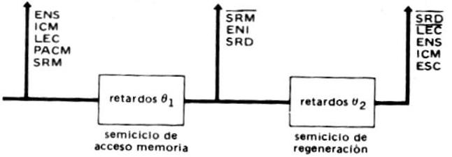

Fig. Búsqueda en memoria (solución síncrona)

### El Distribuidor de Fases

En la mayoría de los casos se sincronizan las distintas microórdenes con señales temporales
regularmente espaciadas, provenientes de un mismo reloj. A cada impulso de reloj debe ser generado
un cierto número de microórdenes.

Al ser idénticas todas las señales de reloj, es preciso dar al secuenciador los medios para situarse
por referencia al tiempo, por ejemplo, para saber en que fase del ciclo de la instrucción se
encuentra; en ésta la función del distribuidor de fases, que partiendo de los impulsos periódicos
del reloj, produce señales de impulso o de nivel acordes a las diferentes fases del ciclo de memoria
o de la instrucción.

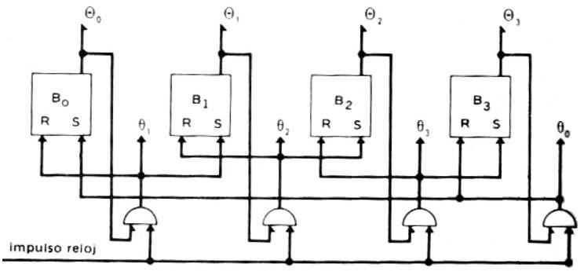

Fig. Distribuidor de fases

En un instante determinado, solamente uno de los biestables B<sub>0</sub>, B<sub>1</sub>,
B<sub>2</sub>, B<sub>3</sub> está posicionado a 1. El próximo impulso de reloj devolverá este
biestable a cero y posicionará el siguiente biestable a 1. Los niveles lógicos Θ<sub>0</sub>,
Θ<sub>1</sub>, Θ<sub>2</sub>, Θ<sub>3</sub>, serán ciertos uno a continuación del otro, pero solo
uno en un momento dado. Los impulsos θ<sub>0</sub>, θ<sub>1</sub>, θ<sub>2</sub>, θ<sub>3</sub>,
sincronizados con las señales de reloj, se producirán cada cuatro batidos. Suponiendo que el tiempo
de basculamiento de los biestables sea igual a la anchura del impulso de reloj, se obtiene el
cronograma de base siguiente:


Fig. Cronograma de un distribuidor de fases

En el caso de Abacus, en el que el ciclo de memoria equivale a dos batidas de reloj, resultará
cómodo emplear un distribuidor de dos fases (respectivamente lectura y escritura).

### Decodificación de la Instrucción

La instrucción consta de diferentes campos de información de interés para el secuenciador, como son
el código de operación, las condiciones de direccionamiento, la dirección de registros o de unidades
periféricas, etc. El decodificador de instrucción se encarga de realizar esta decodificación.

Puede utilizarse una matriz de diodos o de transistores. Por ejemplo, para Abacus, dotado de las
operaciones indicadas en la siguiente tabla y capaz de direccionamiento indirecto, se necesitaría el
decodificador de la siguiente figura:

Nombre Nemotécnico Código Operación Efecto de la instrucción

PAC 000 Puesta a cero del acumulador

SUM 001 Suma con el acumulador

SUS 010 Sustracción del acumulador

AND 011 Intersección con el acumulador

OR 100 Reunión con el acumulador

ALM 101 Almacenamiento del acumulador

SAI 110 Salto incondicional

SAP 111 Salto si (AC)\>=0


Fig. Decodificador del código de operación de Abacus

Se observa en este esquema que la decodificación puede ser considerada prácticamente instantánea y
las señales salidas de la matriz permanecen posicionadas todo el tiempo que la instrucción
correspondiente se encuentra en el registro de instrucción.

### Biestables de Estado

Se define al estado del calculador por el contenido de un cierto número de biestables, llamados
biestables de estado. Los hay de dos clases:

Los primeros memorizan lo que hemos denominado el estado de la máquina. Son posicionados por las
instrucciones y los resultados de operaciones, o también por acontecimientos exteriores, petición de
ciclo de memoria, interrupción, etc.

Sus salidas figuran entre las informaciones de entrada al secuenciador. Los segundos constituyen
parte integrante del secuenciador.

Es éste quien los posiciona y quien utiliza su salida. Esencialmente sirven de marcas temporales. En
cierto modo, los biestables del distribuidor de fases podrían incluirse dentro de esta categoría.

Abacus consta de los cuatro biestables representados en la siguiente figura:


Fig. Biestables de estado de Abacus


### Funcionamiento De La Unidad De Control

Para especificar la funcionalidad de una CPU es necesario el conocimiento de los siguientes
conceptos:

1. Operaciones (códigos de operación)
2. Modos de direccionamiento
3. Registros
4. Interfaz con el módulo de E/S
5. Interfaz con el módulo de memoria
6. Estructura del procesamiento de interrupciones.

Estos puntos determinan lo que debe hacer una CPU. Los distintos elementos de la CPU que
proporcionan esta funcionalidad están gobernados por la UC (unidad de control). Estudiando su
funcionamiento se determina como se llevan a cabo estas funciones.

### Microoperaciones

La función de un computador es ejecutar programas, la ejecución de un programa consiste en la
ejecución secuencial de instrucciones. Cada instrucción se ejecuta durante un ciclo de instrucción
compuesto de subciclos más cortos (por ejemplo, subciclo de captación, indirecto, de ejecución, de
interrupción). La ejecución de cada subciclo involucra una o más operaciones elementales, es decir,
microoperaciones. Las microoperaciones son las operaciones funcionales, o atómicas, de una CPU.

### Ciclo de Captación o Fase de Búsqueda de la Instrucción

Tomando de ejemplo la instrucción de suma, analizamos el comportamiento de la CPU. Suponemos que la
dirección de la siguiente instrucción se encuentra en el registro P (contador de programa). Lo
siguiente será llevar esta dirección al registro S (de selección de memoria). Una vez que la
dirección se encuentra en el registro S, el contenido de la célula de memoria direccionada por S
pasa al registro M (de palabra de memoria).

En resumen sería:

\(P\) → S SRP, ENS, ICM, PACM

((S)) → M LEC

\(P\) → S es la _microoperación_ que indica que el contenido del registro P pasa al reg. S.

((S)) → M es la _microoperación_ que indica que el contenido de la memoria direccionado por S pasa
al registro M.

Las órdenes SRP (salida del registro P), ENS (entrada al registro S), ICM (inicio de ciclo de
memoria), PACM (puesta a cero del registro M) y LEC (lectura de memoria) son señales de impulsos o
de nivel empleadas para gobernar las distintas operaciones en el desarrollo de una instrucción. Se
las denomina señales de control, señales de gobierno o microórdenes. Es de destacar que la
microoperación P → (P) + 1 es factible de realizar simultáneamente con la microoperación ((S)) → M
ya que estas dos no interfieren entre sí y, además, permite un ahorro de tiempo, sin afectar el
funcionamiento.

Si la instrucción por ejecutar sería un salto, el incremento de P no afectaría el desarrollo de la
instrucción, pero si lo dejamos para el final, y la condición de salto resultara negativa, agregaría
una unidad de tiempo más para su ejecución. Ahora bien, considerando el ejemplo de Abacus, con un
distribuidor de fases de dos fases, los instantes de ejecución de cada microoperación serían:

t<sub>0</sub>: (P) → S

t<sub>1</sub>: ((S)) → M

t<sub>1</sub>: P → (P) + 1

### Ciclo Indirecto o Fase de Búsqueda del Operando

Una vez que la instrucción se encuentra en M es transferida al registro I (de instrucción). Se
analiza el código de operación y las condiciones de direccionamiento, luego el contenido del
registro D (parte de dirección del registro I) se envía al registro S para localizar el operando en
memoria. Paso siguiente, el contenido de la célula de memoria señalada por S pasa al registro M. En
resumen sería:

\(M\) → I SRM, ENI

\(D\) → S SRD, ENS, ICM, PACM

((S)) → M LEC

Siguiendo la línea temporal, estas microoperaciones se ejecutarían en el siguiente orden:

t<sub>2</sub>: (M) → I

t<sub>3</sub>: (D) → S

t<sub>4</sub>: ((S)) → M

### Ciclo de Ejecución de la Instrucción

Consiste en sumar el operando contenido en M con el contenido del registro Acumulador (AC):

\(M\) + (AC) → AC SRM, ENA, SUM, EAC

Siguiendo la línea temporal, estas microoperaciones se ejecutarían en el siguiente orden:

t<sub>5</sub>: (M) + (AC) → AC

### Ciclo de Interrupción

Cuando termina el ciclo de ejecución, se realiza una comprobación para determinar si ha ocurrido
alguna interrupción habilitada. Si es así, tiene lugar un ciclo de interrupción. La naturaleza de
este ciclo varía mucho de una máquina a otra. Se observa aquí una secuencia muy simple de eventos:

t<sub>1</sub>: (P) → M

t<sub>2</sub>: Dirección de salvaguarda → S

Dirección de la rutina → P

t<sub>3</sub>: M → memoria

En el primer paso, el contenido de P se transfiere a M, de modo que pueda guardarse para el retorno
de la interrupción. Entonces S se carga con la dirección en la cual va a guardarse el contenido de
P, y P se cara con la dirección de comienzo de la rutina de procesamiento de interrupción.

Cada una de estas dos acciones puede ser una única microoperación. Sin embargo, ya que la mayoría de
las CPUs. Tienen múltiples tipos y/o niveles de interrupciones, podrían hacer falta una o más
microoperaciones adicionales para obtener la dirección de salvaguarda y la dirección de la rutina
antes de que puedan transferirse a S y a P, respectivamente.

En todo caso, una vez hecho esto, el paso final es almacenar M, que contiene el antiguo valor de P,
en la memoria. La CPU está entonces preparada para iniciar el siguiente ciclo de instrucción.

### Señales de Control o Microórdenes

Para que la unidad de control realice su tarea debe tener entradas que le permitan determinar el
estado del sistema y salidas que le permitan controlar el comportamiento del mismo.

Como se ha indicado anteriormente, continuando con el ejemplo de Abacus, las entradas al
secuenciador serán:

- Las señales del distribuidor de fases.

- Señal de los biestables que indican el subciclo que se está ejecutando (I-subciclo de búsqueda de
  la instrucción, O-subciclo de búsqueda del operando)

- Señal del biestable S que indica el signo del acumulador

- Código de operación y condiciones de direccionamiento del reg. de instrucción.

- Señales de control de bus de control, incluye interrupciones, de reconocimiento, etc. (no se
  contempla en el análisis a fin de facilitar el estudio del funcionamiento)

Las salidas del secuenciador serán:

- Señales de control que gobiernan la transferencia de datos, funciones específicas de la ALU,
  control de memoria y control de los módulos de entrada/salida.

Resumiendo, se podría decir que el objetivo del secuenciador es general las señales de control o
microórdenes para gobernar el funcionamiento del computador. En la siguiente figura se observa un
esquema general de lo descrito anteriormente.


Fig. Modelo de la Unidad de Control

### Generación de las Señales de Control

Para lograr diseñar los circuitos que generan estas señales se deben seguir dos pasos:

1. Trazar los cronogramas deseados para cada instrucción del conjunto de instrucciones que admite la
   CPU.

2. Relacionar cada microórden que aparece en los cronogramas con los batidos del reloj del
   distribuidor de fases y con las distintas informaciones de entrada y de estado del secuenciador.
   Esto se denomina formular las ecuaciones lógicas de la máquina.

### Trazado de Cronogramas

A fin de lograr la realización de los cronogramas se deberá tener en cuenta los tiempos de respuesta
de los diferentes operadores implicados en la ejecución de cada microoperación y de el se deducen
las microórdenes a generar a cada batido de reloj. Para poder explicar la forma de realizar esta
tarea tomaremos el ejemplo de Abacus, para el cual definimos lo siguiente:

Abacus está provisto:

1. De un distribuidor de fases de dos fases
2. De un decodificador de instrucciones descrito anteriormente.
3. De los biestables de estado definidos anteriormente. Se supondrá que el funcionamiento del reloj
   está condicionado por la señal de detención-marcha, y que la puesta en marcha inicializa el
   distribuidor de fases.

Se observa a continuación los cronogramas de las diferentes instrucciones de abacus, partiendo del
cronograma del secuenciador.

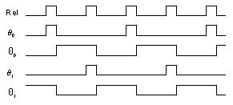

Fig. Cronograma del distribuidor de fases

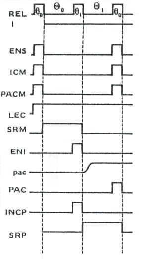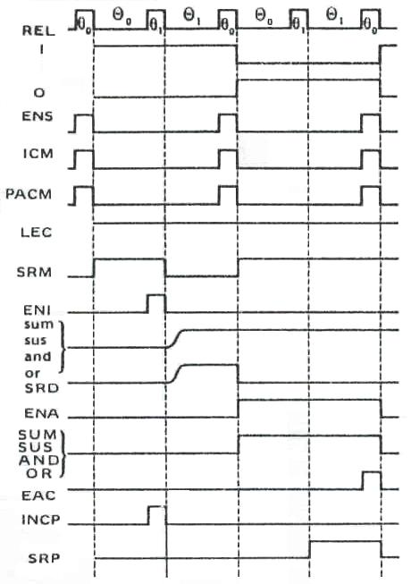

<table>
<tbody>
<tr>
<td><p>Fig. Cronograma de puesta a cero del acumulador</p></td>
<td>Fig. Cronograma de las instrucciones de procesamiento</td>
</tr>
</tbody>
</table>


Fig. Cronograma del almacenamiento en memoria


Fig. Cronograma de las instrucciones de salto

En cada uno de esto cronogramas hemos anotado la evolución de diversas informaciones de entrada en
el secuenciador, de una cierta importancia para la instrucción en curso. Cada cronograma permite
definir de forma analítica el comportamiento del secuenciador.

### Ecuaciones Lógicas

Un vez realizados todos los cronogramas, el paso siguiente consiste en, microórden por microórden,
buscar todas las veces que debe ser activada y de ellas deducir la expresión lógica en relación con
las informaciones de entrada y de estado del secuenciador. El conjunto de estas expresiones
constituye las ecuaciones lógicas del ordenador.

Por ejemplo, analicemos la señal SRM:

- Todos los casos en que está activa en el intervalo <sub>0</sub> :

Cuando se trata de un ciclo de búsqueda de la instrucción, es decir I = 1, se escribe I . <sub>0
</sub> ;

Cuando se trata de un ciclo del operando para las instrucciones SUM, SUS, OR, AND, durante todo el
tiempo que se efectúe la operación en la ALU, esto corresponde a <sub>0</sub> + <sub>1</sub> , O
= 1. Se escribe O . (<sub>0</sub> + <sub>1</sub>) . (

```math
{{{\text{sum} + \text{sus}} + \text{or}} + \text{and}}{}
```

)

Como (<sub>0</sub> + <sub>1</sub>) valdría siempre 1, no es necesario incluirlo en la ecuación,
quedando esta de la siguiente manera: O . (

```math
{{{\text{sum} + \text{sus}} + \text{or}} + \text{and}}{}
```

)

Hilando un poco más fino se observa que las instrucciones implicadas son todas aquellas que
necesitan un ciclo de operando excepto

```math
\text{alm}{}
```

, teniendo en cuenta esto, se puede rescribir la ecuación de la siguiente manera: O .

```math
\overline{\text{alm}}{}
```

De esta manera logramos reducir a una expresión más simple.

- Todos los casos en que está activa en el intervalo <sub>1</sub>:

Cuando se presenta un direccionamiento indirecto, es decir la señal IND = 1, en este caso también se
da que I = 0 y O = 0, se ecribe: IND . Ī . Ō . <sub>1</sub>

Analizado esto y considerando que son lo únicos casos en que se activará la señal SRM, es decir
cuando se produzcan las microoperaciones (M) → I, (M) → ALU, (M) → S, la ecuación completa para esta
señal será:

SRM = I . <sub>0 </sub> + O .

```math
\overline{\text{alm}}{}
```

- IND . Ī . Ō . <sub>1</sub>

De esta manera, microórden por microórden, podemos deducir las expresiones lógicas del ordenador.
Además de las ecuaciones de las microórdenes, también serán necesarias las ecuaciones de entrada a
los biestables de estado del secuenciador, los biestables I y O.

Por ejemplo:

I debe ser posicionado a 1 al final del ciclo del operando:

```math
{\text{SI} = {\Theta_{0} \cdot O}}{}
```

I de ser puesto a cero al final del ciclo de búsqueda de la instrucción de aquellas instrucciones
que necesitan ciclo de operando:

```math
\left. {\text{RI} = {{\theta_{0} \cdot I} \cdot (}}{{{{\text{sum} + \text{sus}} + \text{or}} + \text{and}} + \text{alm}} \right){}
```

O debe ser puesto a 1 al final de un ciclo de instrucción cuando la instrucción a ejecutar es con
operando y no es con direccionamiento indirecto, y luego de la búsqueda de la dirección del operando
en una instrucción con direccionamiento indirecto:

```math
{{\text{SO} = {{{\overline{\text{IND}} \cdot \theta_{0}} \cdot I} \cdot (}}{{{{\text{sum} + \text{sus}} + \text{or}} + \text{and}} + \text{alm}}{) + {{{\text{IND} \cdot \theta_{0}} \cdot \overline{I}} \cdot \overline{O}}}}{}
```

O debe ser puesto a cero al final del ciclo de operando:

```math
{\text{RO} = {\theta_{0} \cdot O}}{}
```

A continuación se observan todas las ecuaciones para formar el secuenciador de Abacus:

|     |     |
| --- | --- |
| ENS | =   |

````math
\theta_{0}{}
``` |
| ICM | =
``` math
\theta_{0}{}
``` |
| PACM | =
``` math
\theta_{0}{}
``` |
| LEC | =
``` math
\left. {{I + {O \cdot \overline{\text{alm}}}} + (}{\overline{I} \cdot \overline{O}} \right){}
``` |
| ESC | =
``` math
{O \cdot \text{alm}}{}
``` |
| SRM | = I . <sub>0 </sub> + O .
``` math
\overline{\text{alm}}{}
````

- IND . <sub>1</sub> . (Ī . Ō) | | TMS | =

````math
{{{\text{IND} \cdot \overline{I}} \cdot \overline{O}} \cdot \Theta_{1}}{}
``` |
| ENI | =
``` math
{\theta_{1} \cdot I}{}
``` |
| SRD | =
``` math
\left. {{\Theta_{1} \cdot I} \cdot (}{{{{{{\text{sum} + \text{sus}} + \text{and}} + \text{or}} + \text{alm}} + {\text{sap} \cdot \text{AP}}} + \text{sai}} \right){}
``` |
| SRP | =
``` math
{{{\Theta_{1} \cdot I} \cdot (}{\text{pac} + {\text{sap} \cdot \text{AN}}}{) + {\Theta_{1} \cdot O}}}{}
``` |
| INCP | =
``` math
{\theta_{1} \cdot I}{}
``` |
| ENP | =
``` math
\left. {\theta_{0} \cdot (}{{\text{sap} \cdot \text{AP}} + \text{sai}} \right){}
``` |
| SUM | =
``` math
{\text{sum} \cdot O}{}
``` |
| SUS | =
``` math
{\text{sus} \cdot O}{}
``` |
| AND | =
``` math
{\text{and} \cdot O}{}
``` |
| OR | =
``` math
{\text{or} \cdot O}{}
``` |
| ENA | =
``` math
{O \cdot \overline{\text{alm}}}{}
``` |
| EAC | =
``` math
{{O \cdot \overline{\text{alm}}} \cdot \theta_{0}}{}
``` |
| PAC | =
``` math
{\text{pac} \cdot \theta_{0}}{}
``` |
| SAC | =
``` math
{{O \cdot \Theta_{0}} \cdot \text{alm}}{}
``` |
| ENM | =
``` math
{{O \cdot \theta_{1}} \cdot \text{alm}}{}
``` |
| SI | =
``` math
{\text{SI} = {\Theta_{0} \cdot O}}{}
``` |
| RI | =
``` math
\left. {\text{RI} = {{\theta_{0} \cdot I} \cdot (}}{{{{\text{sum} + \text{sus}} + \text{or}} + \text{and}} + \text{alm}} \right){}
``` |
| SO | =
``` math
{{\text{SO} = {{{\overline{\text{IND}} \cdot \theta_{0}} \cdot I} \cdot (}}{{{{\text{sum} + \text{sus}} + \text{or}} + \text{and}} + \text{alm}}{) + {{{\text{IND} \cdot \theta_{0}} \cdot \overline{I}} \cdot \overline{O}}}}{}
``` |
| RO | =
``` math
{\text{RO} = {\theta_{0} \cdot O}}{}
``` |

El secuenciador de abacus será la materialización de sus biestables de estado y del circuito combinacional correspondiente a las ecuaciones lógicas. Es de destacar que el ordenador Abacus es una máquina simple con un conjunto de instrucciones reducido para facilitar su estudio.

En una compleja CPU moderna, el número de ecuaciones booleanas necesarias para definir la unidad de control es muy grande. La tarea de implementar un circuito combinacional que satisfaga todas esas ecuaciones llega a ser muy difícil.

El resultado es que, por regla general, se usa una aproximación mucho más sencilla, conocida como microprogramación.

### Secuenciamiento de los operadores aritméticos

En máquinas complejas, el control de los operadores aritméticos de funcionamiento secuencial está frecuentemente descentralizado y cada operador posee su órgano de control. En estos casos, el secuenciador general envía una orden especificando el tipo de operación a ejecutar y los batidos del reloj central, si el operador no tuviese uno propio.

El operador se encarga, entonces, del secuenciamiento de la operación aritmética.

Una vez terminada la operación, el operador envía al secuenciador central una señal de fin de operación. El secuenciador de un operador secuencial puede poseer su propio decodificador de órdenes, su contador de fase, sus biestables de estado e incluso su propio reloj.

### Secuenciamiento de un operador de multiplicación por suma-desplazamiento

En la siguiente figura se observa en que entrono trabaja el secuenciador del operador. Este recibe del secuenciador general la orden de multiplicación y los batidos del reloj, a su vez, este secuenciador enviará al secuenciador general una señal de fin de operación (una vez finalizada la multiplicación), y al operador una orden de SUM de posicionamiento del sumador, la validación de la suma EAC y la orden de desplazamiento a derecha DESD. Del último biestable del multiplicador-cociente recibe una señal indicativa de su estado.

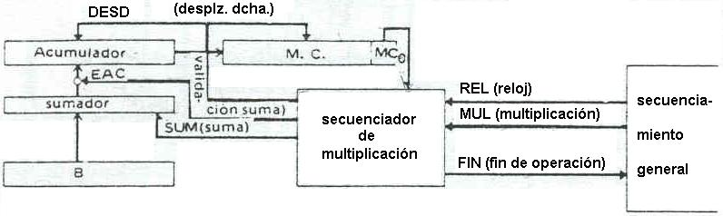

Fig. Entorno del secuenciador de multiplicación.

En la figura siguiente se representa al secuenciador. Este diseño se hace bajo las siguientes hipótesis:

- El sumador permanece activado mientras dure la multiplicación para ejecutar la adición de los contenidos del registro B y del acumulador.

- La duración máxima de la suma es de dos batidos de reloj.

- En ausencia de suma (MC0 = 0), se produce un desplazamiento a cada batido de reloj

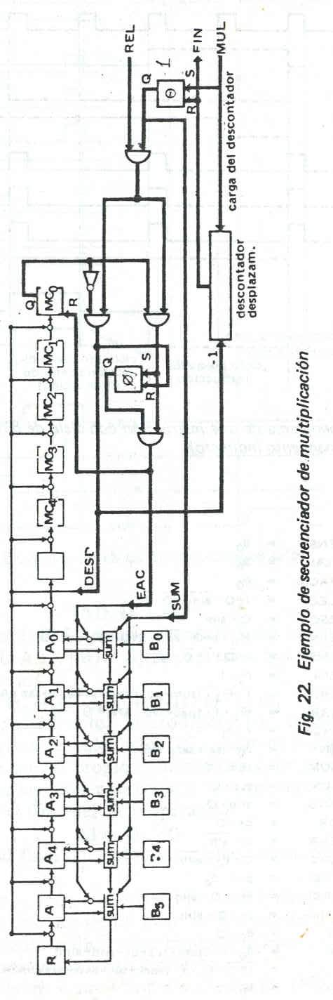

El funcionamiento es el siguiente:

1)  La orden de inicio de multiplicación (MUL) carga el descontador de desplazamientos con una cantidad igual al número de dígitos de los operandos, posiciona el biestable Θ, el que estará en 1 durante toda la multiplicación, habilitando las puertas de entrada al sumador paralelo (SUM).
2)  Al primer batido de reloj siguiente al posicionamiento de Θ comienza la operación:

Si MC0 = 0, se produce un desplazamiento a derecha en el conjunto acumulador-MC y un decremento en el descontador.

Si MC0 = 1, se ejecuta la suma que dura dos batidos de reloj, antes de desplazar. Se memoriza el primer batido en el biestable Φ lo que permite validar, al segundo batido, el resultado de la suma EAC y reponer a cero el biestable MC0, con lo que se producirá, al tercer batido, el desplazamiento a derecha, el decremento del descontador y la puesta a cero de Φ.

3)  Se repite el paso 3 hasta que el descontador valga cero.

4)  Cuando el descontador vale cero, se genera un impulso que pone a cero Θ, y una señal al secuenciador central de fin de operación.

Este circuito posee tres biestables de estado: MC0, Θ y Φ, y un descontador de desplazamiento, que ejerce una función análoga al distribuidor de fases del secuenciador de un ordenador.

### Secuenciadores Microprogramados

### Microinstrucciones

El diseño de un secuenciador cableado para un ordenador complejo, como lo son los actuales, es una tarea muy difícil, además, el diseño es relativamente inflexible. Es difícil cambiar el diseño si se desea añadir una nueva instrucción máquina. La alternativa actual es un secuenciador microprogramado.

Si se consideramos las microoperaciones observaremos que están descriptas en notación simbólica. En realidad es un lenguaje conocido como lenguaje de microprogramación. Cada línea describe un conjunto de microoperaciones que suceden a la vez y se conoce como microinstrucción. Una secuencia de microinstrucciones se conoce como microprograma, o firmware. Este último término refleja el hecho de que un microprograma está a mitad de camino entre hardware y software. Es más fácil diseñar en firmware que en hardware, pero es más difícil escribir un programa firmware que un programa software.

Para usar el concepto de microprogramación en el diseño de un secuenciador debemos considerar que para cada microoperación, todo lo que la unidad de control puede hacer es generar un conjunto de señales de control, de modo que, para cualquier microoperación, cada línea de control procedente de la unidad de control está activa o inactiva. Esta condición puede representarse con un dígito binario para cada línea de control. De este modo, podríamos construir una palabra de control en la que cada bit representara una línea de control. Entonces, cada microoperación se representaría mediante un patrón diferente de 1s y 0s en la palabra de control. Supongamos que se ensarta una secuencia de palabras de control para representar la secuencia de microoperaciones ejecutadas por la unidad de control.

A continuación, hemos de admitir que la secuencia de microoperaciones no es fija. Algunas veces tenemos un ciclo indirecto; otras no. Por tanto, coloquemos nuestras palabras de control en una memoria, cada palabra en una dirección única. Añadamos ahora un campo de dirección a cada palabra de control, indicando la posición de la siguiente palabra de control a ejecutar si una determinada condición es cierta (por ejemplo, que el bit de direccionamiento indirecto de una instrucción que referencia a la memoria sea 1). Añadamos también algunos bits para especificar la condición.

El resultado se conoce como microinstrucción horizontal y se muestra en la figura siguiente. El formato de la microinstrucción o palabra de control es el siguiente. Hay un bit para cada línea de control interna a la CPU y un bit para cada línea de control del bus del sistema. Hay un campo de condición que indica la condición bajo la cual debe producirse un salto, y hay un campo con la dirección de la microinstrucción a ejecutar cuando el salto se produzca. Esta microinstrucción se interpreta como sigue:

1.  Para ejecutar la microinstrucción, se activan todas las líneas de control con el bit correspondiente a 1; y se dejan inactivas todas las líneas de control indicadas con un bit a 0. Las señales de control resultantes harán que se ejecuten una o más microoperaciones.

2.  Si la condición indicada por los bits de condición es falsa, se ejecuta la siguiente microinstrucción secuencial.

3.  Si la condición indicada por los bits de condición es cierta, la siguiente microinstrucción a ejecutar se indica en el campo de dirección.

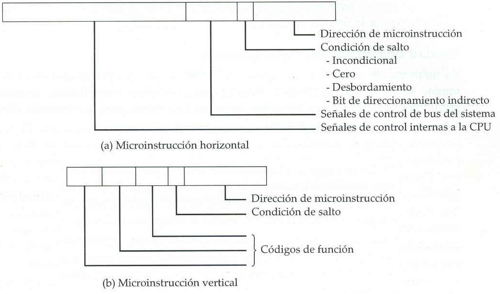

La figura siguiente muestra como se pueden organizar estas palabras de control o microinstrucciones en una memoria de control. Las microinstrucciones de cada rutina se ejecutarán secuencialmente. Cada rutina termina con una instrucción de bifurcación o salto indicando a dónde ir a continuación.

Hay una rutina especial de ciclo de ejecución cuyo único objetivo es indicar que una de las rutinas de las instrucciones máquina (and, sum, etc.) se va a ejecutar a continuación, dependiendo del código de operación en curso.

La memoria de control de esta figura, es una descripción concisa de todo lo que hace la unidad de control. Define la secuencia de microoperaciones a realizar en cada ciclo (captación, indirecto, ejecución, interrupción), y especifica el secuenciamiento de estos ciclos. Si solo fuera eso, esta notación sería un recurso útil para documentar el funcionamiento de una unidad de control para un computador particular. Pero es más que eso. Es también una forma de implementar la unidad de Control.

### Unidad de Control Microprogramada

La memoria de control de la figura siguiente contiene un programa que describe el funcionamiento de la unidad de control. Resulta que podríamos implementar la unidad de control sencillamente suministrando los mecanismos necesarios para la ejecución de ese programa.


Fig. Organización de la memoria de control

La figura siguiente muestra los elementos clave de esta implementación. El conjunto de microinstrucciones se almacena en la memoria de control. El registro de dirección de control contiene la dirección de la siguiente microinstrucción a leer. Cuando se lee una microinstrucción de la memoria de control, se transfiere al registro intermedio de control. La parte izquierda de ese registro se conecta a las líneas de control que salen de la unidad de control. De este modo, leer una microinstrucción de la memoria de control es lo mismo que ejecutar la microinstrucción. El tercer elemento que muestra la figura es una unidad de secuenciamiento que carga el registro de dirección de control y emite una orden de lectura.


Fig. Microarquitectura de la Unidad de Control

Examinando la estructura de la figura siguiente vemos la UC tiene las mismas entradas (reg. I, Indicadores de la ALU, reloj) que una UC cableada, y las mismas salidas (señales de control). La UC funciona como sigue:

1.  Para ejecutar una instrucción, la unidad lógica de secuenciamiento emite una orden de lectura a la memoria de control.

2.  La palabra cuya dirección se especifica en el registro de dirección de control se lee en el registro intermedio de control.

3.  El registro intermedio de control genera las señales de control y contiene además la información de dirección siguiente para la unidad lógica de secuenciamiento.

4.  La unidad lógica de secuenciamiento carga en el registro de dirección de control una nueva dirección, basada en la información siguiente del registro intermedio de control y en los indicadores de la ALU.

Todo esto sucede durante un pulso de reloj.

El último paso recién mencionado requiere cierta elaboración. Al final de la ejecución de cada microinstrucción, la unidad lógica de secuenciamiento cara una nueva dirección el registro de dirección de control.

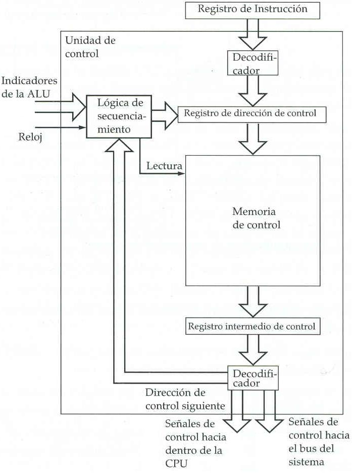

Fig. Funcionamiento de la unidad de control microprogramada

Dependiendo del valor de los indicadores y del registro intermedio de control, se toma una de las tres siguientes decisiones:

- Captar la microinstrucción siguiente: se suma 1 al registro de dirección de control.

- Saltar a una nueva rutina según indica una microinstrucción de salto: El campo de dirección del registro intermedio de control se carga en el registro de dirección de control.

- Saltar a la rutina de una instrucción máquina: se carga el registro de dirección de control en función del código de operación almacenado en el registro I.

Se observa también en la figura dos módulos rotulados decodificador. El decodificador de arriba traduce el código de operación del registro I en una dirección de memoria de control.

El otro decodificador no se usa con microinstrucciones horizontales pero sí con microinstrucciones verticales. Como se mencionó, en una microinstrucción horizontal cada bit del campo de control corresponde a una línea de control.

En una microinstrucción vertical, se usa un código para cada acción a realizar, por ejemplo, (P) → S, y el decodificador traduce este código en señales de control individuales.

La ventaja de las microinstrucciones verticales es que son más compactas (ocupan menos bits) que las microinstrucciones horizontales, a costa de añadir una pequeña lógica y cierto retardo de tiempo.

### Control de Wilkes

La configuración que propuso Wilkes se representa en la siguiente figura. El núcleo del sistema es una matriz parcialmente llena de diodos. Durante un ciclo máquina, se activa una fila de la matriz mediante un pulso. Esto produce señales en aquellos puntos en los que un diodo está presente (indicados mediante un punto en el diagrama). La primera parte de la fila genera las señales de control que gobiernan el funcionamiento de la CPU. La segunda parte genera la dirección de la fila que será seleccionada mediante un pulso en el siguiente ciclo máquina. Por tanto, cada fila de la matriz es una microinstrucción, y el trazado de la matriz es la memoria de control.

Al comienzo de un ciclo, la dirección de la fila a seleccionar está almacenada en el registro I. Esta dirección es la entrada del decodificador, el cual, cuando se activa mediante un pulso de reloj, selecciona una fila de la matriz. Dependiendo de las señales de control, durante el ciclo se pasa al registro II bien el código de operación almacenado en el registro de instrucción, o bien la segunda parte de la fila activada. El contenido del registro II se lleva entonces al registro I mediante un pulso de reloj. Se usan pulsos de reloj alternos para activar una fila de la matriz y para transferir el contenido del registro II al registro I. La configuración con dos registros es necesaria ya que el decodificador es sencillamente un circuito combinacional; con un solo registro, la salida se convertiría en entrada dentro del mismo ciclo, originando un estado inestable.

Este esquema es muy similar a la aproximación de microprogramación horizontal descrita anteriormente. La principal diferencia es ésta: en la descripción previa, el registro de dirección de control podía incrementarse en 1 para acceder a la siguiente dirección. En el esquema de Wilkes, la dirección siguiente está contenida en la microinstrucción.

Para permitir bifurcaciones, una fila debe contener dos partes de direcciones, controladas por una señal condicional (por ejemplo, un indicador), como muestra la figura.

Después de proponer este esquema, Wilkes proporciona un ejemplo de su utilización para implementar la unidad de control de una máquina sencilla. Este ejemplo, el primer diseño conocido de una CPU microprogramada, merece repetirse aquí porque ilustra muchos de los principios actuales de la microprogramación.


Fig. UC microprogramada de Wilkes

### Secuenciamiento De Microinstrucciones

Las dos tareas básicas realizadas por una UC microprogramada son:

- El secuenciamiento de microinstrucciones: Obtener la siguiente microinstrucción de la memoria de control.
- La ejecución de microinstrucciones: Generar las señales de control necesarias para ejecutar la microinstrucción.

Al diseñar una UC, las dos tareas deben considerarse a la vez, ya que las dos afectan al formato de la microinstrucción y a la temporización de la UC.

### Consideraciones de diseño

Hay dos cuestiones involucradas en el diseño de una técnica de secuenciamiento de microinstrucciones: el tamaño de la microinstrucción y el tiempo de generación de la dirección.

El primer asunto es evidente; minimizar el tamaño de la memoria de control reduce su costo. El segundo asunto es sencillamente un deseo de ejecutar las microinstrucciones tan rápido como sea posible.

Cuando se ejecuta un microprograma, la dirección de la siguiente microinstrucción a ejecutar está en una de estas situaciones:

- Determinada por el registro de instrucción
- Siguiente dirección secuencial
- Salto

La primera situación tiene lugar solo una vez por ciclo de instrucción, justo tras la captación de la instrucción. La segunda situación es la más común en la mayoría de los diseños.

No obstante, el diseño no se puede optimizar solo para los accesos secuenciales. Los saltos, tanto condicionales como incondicionales, son una parte necesaria del microprograma. Además, las secuencias de microinstrucciones tienden a ser cortas; una de cada tres o cuatro microinstrucciones podría ser un salto.

Por consiguiente, es importante diseñar técnicas compactas y eficientes en cuanto al tiempo para los saltos a microinstrucciones.

### Técnicas de secuenciamiento

A partir de la microinstrucción en curso, de los indicadores de condición, y del contenido del registro de instrucción, hay que generar una dirección de la memoria de control para la siguiente microinstrucción.

Se ha usado una gran variedad de técnicas. Podemos agruparlas en tres categorías, como ilustran las figuras siguientes.

Estas categorías se basan en el formato de la información de dirección de la microinstrucción:

- Dos campos de dirección
- Un único campo de dirección
- Formato variable

La aproximación más simple es tener dos campos de dirección en cada microinstrucción. La figura indica como se va a usar esta información. Se tiene un multiplexor que sirve de destino de los dos campos de dirección y del registro de instrucción. Basándose en la entrada de selección de dirección, el multiplexor transmite el código de operación o una de las dos direcciones al registro de dirección de control. Este se decodifica a continuación para producir la dirección de la siguiente microinstrucción.

Las señales de selección de dirección son suministradas por un módulo de lógica de salto, cuyas entradas son los indicadores de la unidad de control y ciertos bits de la parte de control de la microinstrucción.

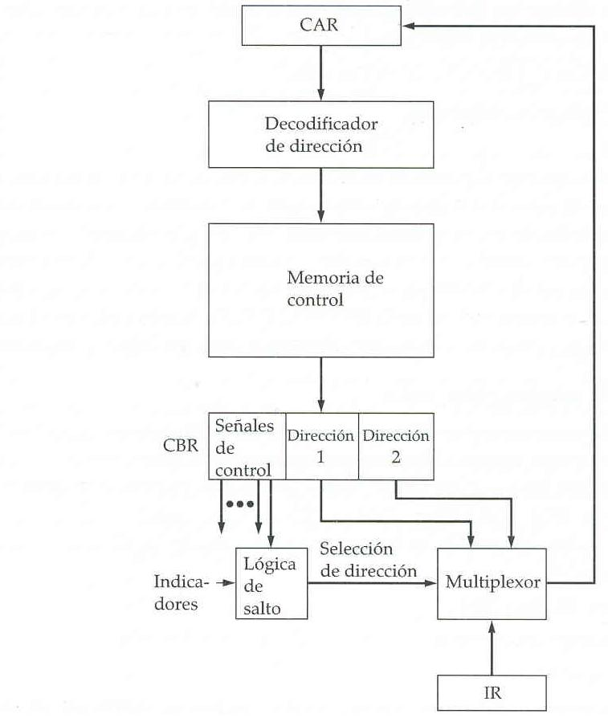

Fig. Lógica de control de salto, dos campos dirección

Aunque la aproximación de dos direcciones es sencilla, necesita más bits por microinstrucción que las otras técnicas. Con alguna lógica adicional, se puede conseguir algún ahorro. Una aproximación común es tener un único campo de dirección. Con este enfoque, las opciones para la dirección siguiente son:

- Campo de dirección
- Código del registro de instrucción
- Siguiente dirección secuencial

Las señales de selección de dirección determinan qué opción se escoge. Esta aproximación reduce el número de campos de dirección a uno. Observemos, sin embargo, que el campo de dirección a menudo no se usa Por tanto, hay alguna ineficiencia en este esquema de codificación.

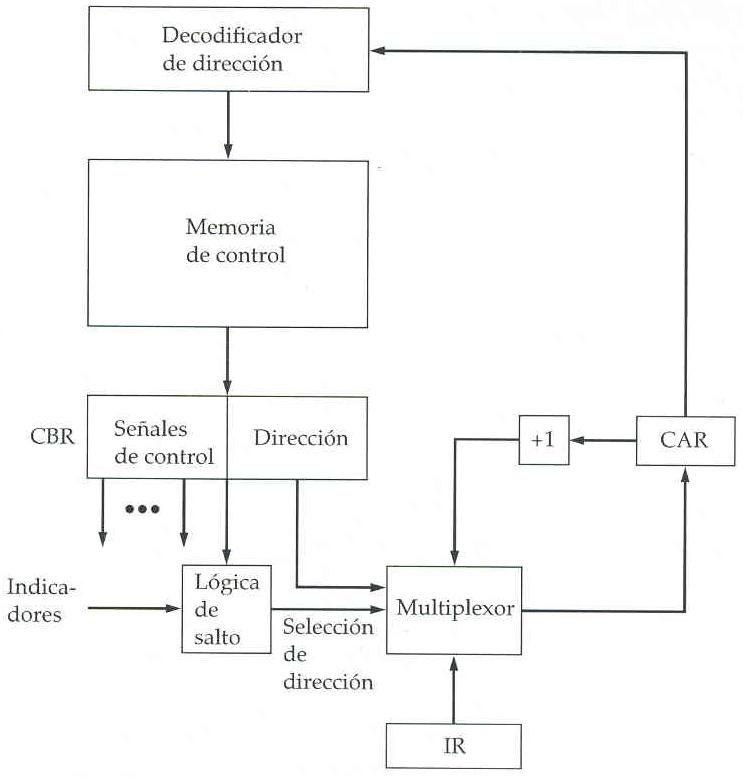

Fig. Lógica de control de salto, un único campo de dirección

Otra aproximación es proporcionar dos formatos de microinstrucción totalmente diferentes. Un bit designa que formato se utilizará. En uno de los dos formatos, los demás bits se usan para activar señales de control. En el otro formato, algunos bits controlan el módulo de lógica de salto, y los bits restantes suministran la dirección. En el primer formato, la dirección siguiente es la siguiente dirección secuencial o una dirección derivada del registro de instrucción. En el segundo formato, se especifica un salto condicional o incondicional. Un inconveniente de esta aproximación, tal como se ha descrito, es que se consume un ciclo completo por cada microinstrucción de salto. Con las otras aproximaciones, la generación de la dirección sucede como parte del mismo ciclo en el que se generan las señales de control, con lo que se minimizan los accesos a la memoria de control.

Estas aproximaciones son generales. Las implementaciones específicas con frecuencia usarán una variación o una combinación de estas técnicas.

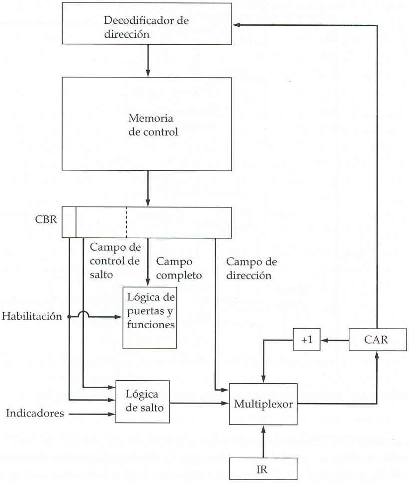

Fig. Lógica de control de salto, formato variable

### Generación de la dirección

Otro punto de vista es considerar las diversas formas en que la siguiente dirección se puede obtener o calcular.

La siguiente tabla relaciona las diversas técnicas de generación de la dirección. Estas se pueden dividir en técnicas explícitas, en las que la dirección aparece explícitamente en la microinstrucción, y técnicas implícitas, que requieren lógica adicional para generar la dirección.

|                     |                  |
|---------------------|------------------|
| Explícitas          | Implícitas       |
| Dos Campos          | Traducción       |
| Salto incondicional | Adición          |
| Salto condicional   | Control residual |

Nos hemos ocupado esencialmente de las técnicas explícitas. Con una aproximación de dos campos, hay dos direcciones alternativas disponibles en cada microinstrucción.

Usando un único campo de dirección o un formato variable, se pueden implementar varias instrucciones de salto. Una instrucción de bifurcación condicional depende de los siguientes tipos de información:

- Indicadores de la ALU
- Parte del código de operación o campos de modo de direccionamiento de la instrucción máquina
- Partes de un registro seleccionado, tales como el bit de signo
- Bits de estado dentro de la UC.

También se usan frecuentemente varias técnicas implícitas. Una de ellas, la traducción, se necesita en casi todos los diseños. La parte de código de operación de una instrucción máquina se traduce a una dirección de microinstrucción.

Esto se presenta solo una vez por ciclo de instrucción. Una técnica implícita común combina o suma dos partes de una dirección parar formar la dirección completa.

### Ejecución De Microinstrucciones

El ciclo de microinstrucción es el evento básico de una CPU microprogramada. Cada ciclo se compone de dos partes: captación y ejecución. La parte de captación depende de la generación de una dirección de microinstrucción, como se vio en la sección precedente. Esta sección se ocupa de la ejecución de una microinstrucción.

Recordemos cuales son las consecuencias de la ejecución de una microinstrucción. Fundamentalmente, el resultado de la ejecución es la generación de señales de control. Algunas de estas señales controlan puntos internos de la CPU.

Las demás señales van al bus de control externo o a otras interfaces externas. Como función accesoria, se determina la dirección de la siguiente microinstrucción.

La descripción precedente sugiere la organización de una unidad de control que se muestra en la figura siguiente. Esta versión subraya el centro de atención de esta sección. Los principales módulos de este diagrama ya deben estar claros.

El módulo de lógica de secuenciamiento contiene la lógica que realiza las funciones estudiadas en la sección anterior. Genera la dirección de la siguiente microinstrucción, usando como entradas el registro de instrucción, los indicadores de la ALU, el registro de dirección de control (para incrementarlo), y el registro intermedio de control.

Este último puede proporcionar una dirección real, bits de control, o ambos. Este módulo está controlado por un reloj que determina la temporización del ciclo de instrucción.

El módulo de lógica de control genera las señales de control en función de algunos de los bits de la microinstrucción. Debe quedar claro que el formato y contenido de la microinstrucción determinará la complejidad del módulo de lógica de control.

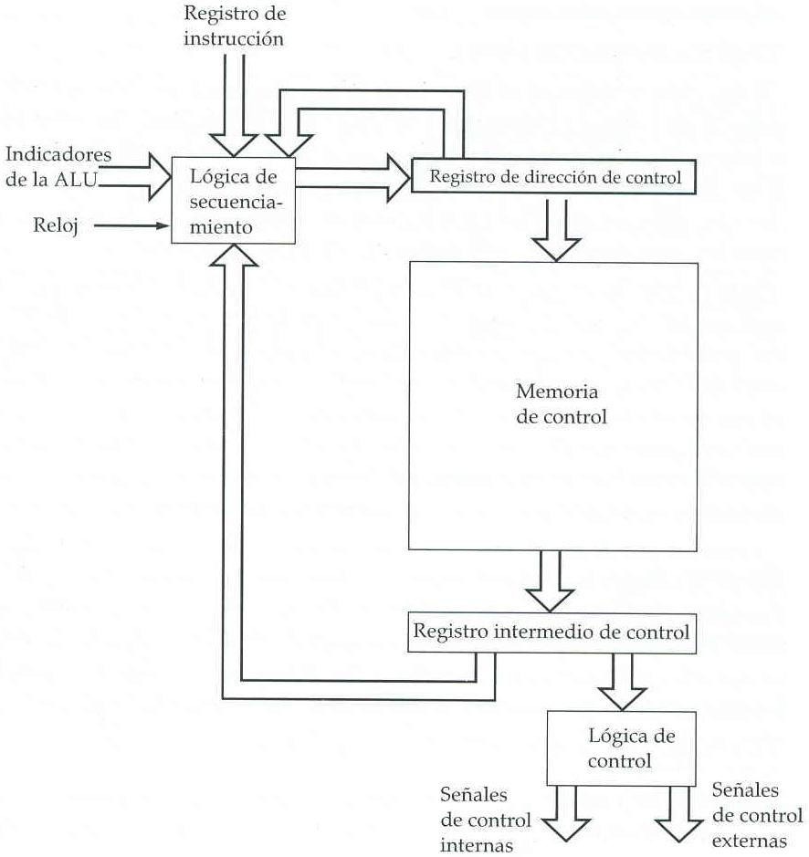

Fig. Organización de la UC

### Una taxonomía de las microinstrucciones

Las microinstrucciones se pueden clasificar de varias formas. Las distinciones que generalmente se hacen en la bibliografía incluyen:

- Vertical/horizontal
- Empaquetada/desempaquetada
- Microprogramación “hard”/”soft”
- Codificación directa/indirecta

Todas ellas se refieren al formato de la microinstrucción. Ninguno de estos términos se ha usado de una manera coherente y precisa en la bibliografía. No obstante, un examen de estas parejas de cualidades sirve para aclarar las alternativas de diseño de microinstrucciones.

En la propuesta original de Wilkes, cada bit de una microinstrucción producía directamente una señal de control o un bit de la dirección siguiente. Hemos visto que son posibles tanto esquemas de secuenciamiento de direcciones más complejos, como esquemas que usen menos bits por microinstrucción.

Estos esquemas requieren un módulo de lógica de secuenciamiento más complejo. Existe un tipo de compromiso semejante para la parte de la microinstrucción que atañe a las señales de control. Se pueden ahorrar bits de la palabra de control codificando la información de control, y decodificándola más tarde para producir las señales de control.

Para hacer esto consideremos que hay un total de K señales de control internas y externas diferentes que tiene que generar la UC. En el esquema de Wilkes, K bits de la microinstrucción se dedicarían a este propósito. Esto permite que se puedan generar las 2<sup>K</sup> combinaciones posibles de señales de control durante cualquier ciclo de instrucción.

Pero somos capaces de hacerlo mejor si observamos que no todas las combinaciones posibles se usarán. Por ejemplo:

- Dos fuentes no se pueden llevar al mismo destino
- Un registro no puede ser a la vez fuente y destino
- Solo un patrón de señales de control se puede presentar a la ALU cada vez
- Solo un patrón de señales de control se puede presentar al bus de control externo cada vez

De esta manera, para una CPU dada, puede hacerse una lista con todas las posibles combinaciones de señales de control admisibles, obteniendo un número de posibilidades Q\<2<sup>K</sup>, que podrían codificarse con log<sub>2</sub>Q bits, siendo (log<sub>2</sub>Q)\<K.

Esta sería la forma más estricta posible de codificación que preserva todas las combinaciones permisibles de señales de control. En la práctica, este sistema de codificación no se usa, por dos razones:

- Es tan difícil de programar como un esquema decodificado puro (como el de Wilkes).
- Requiere un módulo de lógica de control complejo y, por consiguiente, lento.

En lugar de eso, se adoptan algunos compromisos. Los hay de dos tipos:

- Se usan más bits de los estrictamente necesarios para codificar las posibles combinaciones.
- Algunas combinaciones que son físicamente permisibles no se pueden codificar.

El último tipo de compromiso tiene el efecto de reducir el número de bits. El resultado neto, sin embargo, es que se usan más bits que log<sub>2</sub>Q.

Visto lo dicho hasta aquí, podemos ver que el campo de señales de control del formato de microinstrucción se encuadra dentro de un espectro. En un extremo, hay un bit para cada señal de control, en el otro extremo, se usa un formato muy codificado. La tabla siguiente muestra otras características de una unidad de control microprogramada que también se encuadran dentro de espectros de posibilidades, y que en general depende del espectro del grado de codificación.

<table>
<tbody>
<tr>
<td colspan="2">Características</td>
</tr>
<tr>
<td>Microinstrucción no codificada</td>
<td>Microinstrucción muy codificada</td>
</tr>
<tr>
<td>Muchos bits</td>
<td>Pocos bits</td>
</tr>
<tr>
<td>Visión detallada del hardware</td>
<td>Visión global de hardware</td>
</tr>
<tr>
<td>Difícil de programar</td>
<td>Fácil de programar</td>
</tr>
<tr>
<td>Concurrencia explotada completamente</td>
<td>Concurrencia no explotada completamente</td>
</tr>
<tr>
<td>Poca o ninguna lógica de control</td>
<td>Lógica de control compleja</td>
</tr>
<tr>
<td>Ejecución rápida</td>
<td>Ejecución lenta</td>
</tr>
<tr>
<td>Optimización de las prestaciones</td>
<td>Optimización de la programación</td>
</tr>
</tbody>
</table>

<table>
<tbody>
<tr>
<td colspan="2">Terminología</td>
</tr>
<tr>
<td>Desempaquetada</td>
<td>Empaquetada</td>
</tr>
<tr>
<td>Horizontal</td>
<td>Vertical</td>
</tr>
<tr>
<td>“Hard”</td>
<td>“Soft”</td>
</tr>
</tbody>
</table>

### Codificación de las Microinstrucciones

Existen dos métodos extremos para pasar de la configuración binaria de la microinstrucción a las diversas microórdenes correspondientes. El primer método consiste en asociar un bit de la microinstrucción a cada microórden (mayor longitud de la microinstrucción y difícil programación, permite ejecutar varias microórdenes simultáneas). En el otro extremo, el segundo método consiste en codificar el conjunto de las posibles microórdenes con el número mínimo de bits (menor longitud de microinstrucción y mayor decodificación, se necesitaría una microinstrucción por cada microórden).

En la práctica se dan dos soluciones intermedias.

**Codificación tipo instrucción.** Este tipo de codificación da a la microinstrucción una estructura semejante a la de una instrucción, con código de operación y dirección de operando (en registro o en memoria local).

La decodificación de las microinstrucciones para obtener las correspondientes microórdenes es relativamente compleja, siendo compensado por la pequeña longitud de la microinstrucción.

Codificación por campos. Se dividen las distintas microórdenes en grupos independientes de modo tal que sería imposible que, dentro de cada grupo, se den microórdenes simultáneas. Cada grupo, además, corresponde a un determinado tipo de función: apertura de puertas de diversos registros a un mismo bus, gobierno de una unidad funcional, gobierno de la memoria local, etc.

A modo de ejemplo podemos decir que las microórdenes LEC y ESC, de lectura y escritura en memoria, correspondientemente, estarían en el mismo grupo y nunca serían activadas simultáneamente. Cada campo contiene un código que efectúa la decodificación correspondiente y activa una señal de control.


Fig. Codificación por campos con una microórden activa por campo

### Acompasamiento

- Si se trabaja con CODIFICACIÓN TIPO INSTRUCCIÓN, el único compás existente es el de la demanda de microinstrucciones.
- Si se trabaja con CODIFICACIÓN POR CAMPOS, será necesario disponer de un Distribuidor de fases que indique en qué momento emitir las microórdenes de cada campo.

 

|  |  |
|----|----|
| Fig. Microprogramación horizontal y ritmo fijo | Fig. Ritmo variable definido por la microinstrucción |

### Ejemplo de máquina microprogramada

Para este ejemplo hacemos la hipótesis de que se trata de microinstrucciones codificadas por campos con secuenciamiento explícito. Descripción general. Consideremos una ruta de datos formada por un conjunto de registros enlazados por 3 buses una unidad aritmético-lógica. Los buses A y B transfieren los operandos de los registros a la unidad aritmética-lógica, mientras que el bus C permite enviar el resultados a los registros.


Fig. Ruta de datos de una máquina microprogramada

Una microinstrucción que defina una operación entre registros, puede escribirse sobre cuatro campos: CFA, para designar el registro fuente sobre el bus A, CFB, para el registro fuente sobre el bus B, COP, para el código de operación, CRC, para el registro resultado sobre el bus C.

|  |  |  |  |
|----|----|----|----|
| CFA | CFB | COP | CRC |
| Registro fuente bus A | Registro fuente bus B | Código de operación | Registro resultad |

Por ejemplo, la microinstrucción:

|     |     |     |     |
|-----|-----|-----|-----|
| CFA | CFB | COP | CRC |
| Ri  | Rj  | SUS | Rk  |

Ejecuta: (Ri) –(Rj) → Rk

Mientras la microinstrucción:

|     |     |     |     |
|-----|-----|-----|-----|
| CFA | CFB | COP | CRC |
| Ri  | \-  | NOP | Rj  |

Copia el contenido de Ri en Rj.

A fin de permitir una posibilidad de direccionamiento inmediato, se agrega un quinto campo CIN para albergar al operando inmediato. Uno de los campos CFA o CFB reenvía al nuevo campo cuando resulta activado un indicador. Por ejemplo:

|     |     |     |     |     |
|-----|-----|-----|-----|-----|
| CFA | CFB | COP | CRC | CIN |
| Ri  | CIN | SUS | Ri  | 1   |

Restará 1 de Ri: (Ri) – 1 → Ri

Para utilizar la memoria se agrega otro campo, CM. Así las microinstrucciones 1 y 2 efectuarán respectivamente una lectura en Ri y una escritura de Ri, siendo direccionada la memoria por intermedio del registro S.

|     |     |     |     |     |     |     |
|-----|-----|-----|-----|-----|-----|-----|
|     | CFA | CFB | COP | CRC | CIN | CM  |
| 1   | 0   | 0   | NOP | Ri  | 0   | LEC |
| 2   | Ri  | 0   | NOP | 0   | 0   | ESC |

Por último añadiremos unos biestables de estado, los que deberán poder ser posicionados por las microinstrucciones, por ejemplo en función de condiciones eventualmente satisfechas en la ALU y servirán para realizar las bifurcaciones pertinentes en el microprograma. Los campos CD y CMP permiten definir la dirección de la siguiente microinstrucción. El campo CD contiene los n-1 bits fuertes de esta dirección y CMP, según el valor de un indicador, bien inmediatamente el bit de menor peso de la dirección, bien la dirección de biestable de estado que contienen dicho bit. Por eso, la microinstrucción por efectuar después de esta:

|     |     |     |     |     |     |     |     |
|-----|-----|-----|-----|-----|-----|-----|-----|
| CFA | CFB | COP | CRC | CIN | CM  | CD  | CMP |
|     |     |     |     |     |     | m   | BEi |

Se encontrará en la dirección: 2m si (BEi) = 0, y 2m + 1 si (BEi) = 1.

Un último campo CSBE permitirá posicionar los biestables de estado. Suponemos a modo de ejemplo, que Ri actúe de registro de índice, cada vez que se llegue al final de bucle de microprograma, Ri será decrementado en 1. Si el resultado de decrementar fuera 0 (indicador de cero CE de la ALU igual a cero), se cargará un biestable Bej, que permitirá operar el salto a la siguiente instrucción:

<table>
<tbody>
<tr>
<td>dirección</td>
<td>CFA</td>
<td>CFB</td>
<td>COP</td>
<td>CRC</td>
<td>CIN</td>
<td>CM</td>
<td>CD</td>
<td>CMP</td>
<td>CSBE</td>
</tr>
<tr>
<td>2m-2</td>
<td>Ri</td>
<td>CIN</td>
<td>SUS</td>
<td>Ri</td>
<td>1</td>
<td>NOP</td>
<td>m-1</td>
<td>1</td>
<td>(CE=0) 1→BEJ</td>
</tr>
<tr>
<td>2m-1</td>
<td>0</td>
<td>0</td>
<td>NOP</td>
<td>0</td>
<td>0</td>
<td>NOP</td>
<td>m</td>
<td>Bej</td>
<td>-</td>
</tr>
<tr>
<td>2m</td>
<td>0</td>
<td>0</td>
<td>NOP</td>
<td>0</td>
<td>0</td>
<td>NOP</td>
<td colspan="3">direcc. de principio de bucle</td>
</tr>
<tr>
<td>2m+1</td>
<td colspan="9">Primera instrucción después del bucle</td>
</tr>
</tbody>
</table>

La ruta de datos de microabacus, controlada por las microinstrucciones cuya estructura acaba de ser definida, comprende esencialmente:

- Una memoria central dividida en octetos, direccionada por el registro S, cuyos últimos 8 bits pueden ser cargados desde la ALU o enviados sobre el bus A.
- Una memoria local (lectura y escritura) con los seudos-registros de varios octetos para operaciones en múltiple longitud y en coma flotante. Esta memoria, dividida en octetos, es direccionada por el registro SMR.
- 3 registros de 8 bits, actuando A y B de acumulador y de multiplicador-cociente respectivamente y X de índice.
- 2 biestables de estado BE1 y BE2.
- Una ALU que opera sobre informaciones de un octeto, SUM, SUS, ANDO, OR, etc (NOP significa no operación). DE es el indicador de desbordamiento y CE, que vale cero si el resultado de la última operación ha sido nulo.


## Tecnologías CISC y RISC

Introducción

Este trabajo trata acerca de las estrategias utilizadas para secuenciar las instrucciones de las computadoras a nivel digital. Para ello se hace referencia al secuenciamiento de las instrucciones y los tipos de secuenciadores, para concluir con una descripción de las dos tecnologías que se utilizan en el diseño de microprocesadores: CISC y RISC.

### Secuenciamiento de las Instrucciones

El elemento fundamental en el manejo de las instrucciones a nivel digital es el SECUENCIADOR. Este genera las microórdenes según dos tipos de información de entrada al secuenciador:

- La operación a realizar
- El estado de la máquina

La operación a realizar está definida por el *código de operación*, las *condiciones de direccionamiento* y los *registros involucrados* (todos estos datos son extraídos del registro de instrucción). El estado de la máquina está determinado por los valores de los *flags* asociados a distintos registros.

Como consecuencia del análisis y proceso de la información de entrada se generan las microórdenes que conforman las salidas del secuenciador.

El secuenciamiento de las microórdenes en el tiempo puede llevarse a cabo de dos maneras distintas:

1.  El secuenciador conoce los tiempos de respuesta de los diferentes componentes, entonces incorpora retardos entre las diferentes microórdenes sucesivas de manera que se sincronicen.

2.  El secuenciador recibe señales de los diferentes componentes que indican el estado en que se encuentran (por ejemplo que han terminado una operación y que se hallan disponibles). No se lanzará una operación hasta no estar seguro de que la anterior ha finalizado.

### Secuenciadores Cableados y Secuenciadores Microprogramados

Existen dos clases de Secuenciadores:

1.  Secuenciadores cableados o de lógica cableada, realizados en forma de circuito secuencial electrónico.

2.  Secuenciadores microprogramados, que utilizan un medio de almacenamiento (memoria de control) donde se guarda un microprograma para cada instrucción.

Secuenciadores de Lógica Cableada

El objetivo es generar microórdenes desplazadas en el tiempo por retardos apropiados. Una cadena de retardos apropiados permite realizar esta función.

### El Distribuidor de Fases

El problema de desplazar las señales de control de las operaciones es que a un mismo pulso de reloj debe ser generado un cierto número de microórdenes. Al ser idénticas todas las señales de reloj, es preciso dar al secuenciador los medios para situarse por referencia al tiempo, para saber en que fase del ciclo o de la instrucción se encuentra; esta es la función del distribuidor de fases, que partiendo de los impulsos periódicos del reloj, produce señales de impulso o nivel acordes a las diferentes fases del ciclo de memoria o de la instrucción.

En un instante determinado solamente uno de los biestables B<sub>0</sub>, B<sub>1</sub>, B<sub>2</sub>, B<sub>3</sub> estará puesto a 1. El próximo impulso de reloj lo pondrá a 0 y poniendo a 1 el siguiente biestable. Suponiendo que el tiempo de basculamiento del biestable sea igual al ancho de un pulso de reloj, se puede esquematizar el siguiente cronograma.

### Decodificación de la Instrucción

La instrucción consta de diferentes campos de información de interés para el secuenciador, como el código de operación, las condiciones de direccionamiento, las direcciones de los registros, etc. Algunos de estos campos deben ser decodificados, excepto aquellos en los cuales los bits involucrados hacen referencia directa a algún tipo de registro. El decodificador de instrucción se encarga de realizar la tarea de decodificación. Puede utilizarse para ello una matriz de diodos o transistores.

### Biestables de Estado

Un aspecto importante para el secuenciamiento de instrucciones en secuenciadores de lógica cableada lo constituye el estado de la máquina. El mismo está definido por el contenido de ciertos registros llamados “flags”. Los flags pueden cambiar de valores debido a dos causas: 1) como resultado de alguna operación, 2) como resultado de la acción directa del secuenciador (por ejemplo la reserva de algún registro particular).

Trazado de Cronogramas

Todo lo visto anteriormente sirve de base para la realización de las “ecuaciones lógicas de la máquina”. Estas asociadas a los valores de los flags definen completamente al secuenciador. Para construir las ecuaciones lógicas se deben analizar paso por paso una instrucción y determinar dos aspectos fundamentales:

1)  Que microórdenes intervienen

2)  En que tiempo deben ser disparadas (en referencia a los pulsos del reloj y a las microórdenes anteriores).

Una herramienta útil para la definición de las ecuaciones lógicas de un secuenciador son los cronogramas.

### Secuenciadores de Lógica Microprogramada

La microprogramación consiste en reemplazar al secuenciador cableado por un secuenciador programado. A cada instrucción de la máquina le corresponde un microprograma almacenado en una memoria especial, llamada memoria de control.

Modelo de WILKES

El modelo de WILKES contiene la base del funcionamiento de la lógica microprogramada. La representación esquemática es la siguiente:

A la entrada del dispositivo de control tenemos el código de operación de la instrucción a ejecutar, la que se considera como la dirección de la primera micro – instrucción del microprograma asociado a la instrucción. Esa dirección se envía al registro SMC (Selección de Memoria de Control) que, cuando se decodifica, permite activar el hilo de la palabra horizontal sobre el cual está grabada la micro – instrucción de la siguiente manera:

Los unos están representados por un acoplamiento (marcado con un punto en el esquema) con el correspondiente hilo del bit vertical, los ceros por la ausencia de acoplamiento. A la salida, la micro – instrucción está compuesta por dos partes: una, el código de la micro – instrucción que da directamente las microórdenes a distribuir al conjunto de la máquina; y la otra, la dirección de la próxima micro – instrucción (DC o Dirección de Control) que se transfiere, en el siguiente pulso de reloj, al SMC. El microprograma continúa hasta la última micro – instrucción, la cual cargará en el SMC el nuevo código de Operación.

También se hace referencia en el esquema, a la posibilidad de realizar saltos condicionales, utilizando el biestable E que puede ser puesto a uno bajo determinadas condiciones por las micro – instrucciones.

### La Memoria de Control

Es la memoria que contiene los microprogramas. La velocidad de la memoria de control debe ser superior a la de la memoria principal. Esto se debe a que es preciso que un microprograma se desarrolle completamente en intervalos de tiempo correspondiente a los accesos de memoria en busca de los operandos. La memoria de control brinda flexibilidad al sistema debido a que generalmente se pueden modificar los microprogramas, agregar nuevos microprogramas e incluso sustituirla por completo.

### Consideraciones acerca de los secuenciadores

Ventajas y desventajas

La ventaja que sobresale en los secuenciadores cableados es la velocidad de ejecución de una micro – instrucción, ya que para ejecutarse solamente depende del tipo de instrucción y el estado de la máquina. No ocurre lo mismo con los secuenciadores microprogramados debido a que al tipo de instrucción y al estado de la máquina se le suma el tiempo de ejecución del microprograma.

Existen, sin embargo dos ventajas de los secuenciadores microprogramados que provocaron que los diseñadores se volcaran a la construcción de los mismos: la facilidad en el diseño y la modularidad en el crecimiento. Diseñar un secuenciador cableado es muy complejo y más aún depurarlo. Agregar una micro – instrucción representa un trabajo muy arduo en los secuenciadores cableados y a veces implica su rediseño.

En la evolución del diseño de computadoras se sopesaron la velocidad y la simpleza, y a partir de ello surgieron dos tecnologías que durante mucho tiempo fueron contrapuestas: CISC y RISC.

Tecnologías CISC y RISC

Evolución histórica

Al principio los programas se realizaban en lenguaje de máquina, esto hacía que el programador tuviese que tener un gran conocimiento del Hardware y dependía de él la mejora o no de la performance en la ejecución de sus programas.

Apareció entonces la idea de hacer que la suma de varias instrucciones sencillas se plasmaran en un microprograma haciendo más fácil la tarea del programador. Esta idea se conoció con el nombre de CISC (Complex Instructions Set Computer).

Funcionalmente la CPU creció con un modulo de decodificación. Después de efectuarse una lectura, la instrucción es decodificada según varios campos y subcampos. Como primer resultado se obtiene un puntero al microprograma, confinado con el Control Store. Inmediatamente el control se transfiere a éste y las acciones se suceden en el orden del microprograma (utilizando varios ciclos de reloj).

A principios de la década del 80, el mundo aparecía rendido a los pies del CISC, desde las PCs hasta los Mainframes, y a nadie se le ocurría otra cosa que tratar de mejorarlo. Ocupados en esta tarea alguien se dio cuenta que algo andaba mal.

Después de diferentes testeos se comprobó que a excepción de las operaciones de punto flotante, la mayor parte del esfuerzo del procesamiento se concentra en las instrucciones más simples, lo que significa que la mayor parte del tiempo no se utiliza la CPU ya que aquellas se ejecutan por medio de un microprograma.

Como contrapartida a la tecnología CISC surgió entonces la tecnología RISC (Reduced Instructions Set Computer) con las siguientes características:

- Elimina las instrucciones complejas del Instruction Set (a excepción de las operaciones de punto flotante)
- Elimina el microcódigo
- Logra ejecutar todas las instrucciones en un ciclo de reloj.
- Jerarquiza el uso del compilador

Características de la Tecnología CISC

La denominación CISC se debe a que los procesadores que utilizan esta tecnología pueden ejecutar desde instrucciones simples (como las que ordenan sumar o restar dos números que están almacenados en registros de la CPU y el resultado asignarlo a uno de estos registros), hasta instrucciones muy complejas (como movimiento de cadenas de caracteres de gran longitud y variable, en procesamiento de textos).

Las instrucciones simples, luego de su decodificación, pueden ejecutarse en un pulso de reloj, mientras que las complejas requieren un número de pulsos que dependen de la secuencia de pasos necesarios para su ejecución.

Cada paso se lleva a cabo mediante una combinación binaria (microcódigo), que aparece en las líneas de control de la UC con cada pulso de reloj, la cual activa los circuitos que intervienen en ese paso. Las sucesivas combinaciones (microcódigos) que requiere la ejecución de una instrucción compleja, deben ser provistas por una memoria de control que las almacena y que forma parte de la UC.

**Por lo tanto, un procesador CISC necesariamente debe contener una memoria de control con los microcódigos, para poder ejecutar las instrucciones complejas. Esta es una de las características CISC.**

En general; cada operación que ordena una instrucción de un procesador CISC presenta variantes para ser aplicadas a diversas estructuras de datos, desde simples constantes y variables, hasta matrices y otras. Así, una instrucción que ordena sumar tiene muchas variantes (códigos) en función de la estructura de datos sobre la cual opera. Es como si existieran tantas instrucciones que ordenan una misma operación como estructuras de datos típicas se han definido para operar, lo cual se denomina “modos de direccionamiento” de una instrucción.

**La existencia de muchos “modos de direccionamiento” para realizar la operación que ordena una instrucción, es otra de las características de complejidad de los procesadores CISC. Esto se manifiesta en que el set de instrucciones de una máquina CISC presente un número elevado de códigos de instrucción.**

Esto definitivamente incide sobre el set de instrucciones de una máquina CISC. Un set de instrucciones CISC posee alrededor de 210 instrucciones.

Asimismo, lo anterior exige instrucciones que ocupan distinta cantidad de bytes en memoria.

Un aspecto importante es el solapamiento de microórdenes (o “PIPE LINE”) ya que al haber instrucciones que requieren distinta cantidad de pulsos de reloj para su ejecución, podrán generarse errores. De esto se desprende que un procesador CISC no puede utilizar eficazmente su PIPE LINE en la producción de instrucciones.

En la concepción CISC se busca lograr el “salto semántico”, que es obtener la menor disparidad entre los lenguajes de alto nivel y el lenguaje de máquina.

Recordar al respecto, que una sentencia como Z = P + P – Q se debe traducir a una secuencia de instrucciones de máquina como I<sub>1</sub>, I<sub>2</sub>, I<sub>3</sub>, I<sub>4</sub>. Suponiendo que en un cierto lenguaje de alto nivel dicha sentencia (u otra más común) se usara frecuentemente, se podría tener un CISC que hiciera corresponder a esa sentencia una sola instrucción I<sub>x </sub>, de máquina, que reemplazara a las 4 instrucciones citadas. Esto se conseguiría escribiendo en la memoria de control una extensa secuencia de microcódigos para poder ejecutar I<sub>x</sub> .

De existir muchas equivalencias entre sentencias en alto nivel e instrucciones de máquina, el programa traductor entre ambos niveles (compilador) sería más sencillo de fabricar, y los tiempos de compilación disminuirían, que lógicamente son los objetivos de la arquitectura CISC.

Se comprende que esta concepción puede llegar al extremo de fabricar un CISC con instrucciones de máquina que sean equivalentes a sentencias muy usadas en un cierto lenguaje de alto nivel, pero que no se usarán, si se programa en otro lenguaje de alto nivel que no las utiliza.

### Características de la Tecnología RISC

Buscando optimizar la performance de los procesadores, se realizaron estadísticas de las instrucciones de máquina más usadas. Resultó que las instrucciones más simples (que son solo el 20% del repertorio de instrucciones de un procesador CISC) constituían el 80% de los programas típicos ejecutados.

El 91% de las sentencias más usadas en lenguajes de alto nivel (Fortran, Pascal, Basic, C, etc.) son las del tipo “Asignar” (un valor a una variable), “IF” (condicional), “Call” (llamar a procedimiento), “Loop” (repetir una secuencia), que en promedio constituyen el 47%, 23%, 15%, 6%, respectivamente.

La información anterior sirvió para planificar procesadores con un set de instrucciones simples (operar dos números que están en registros de la CPU, y el resultado asignarlo a uno de esos registros) que presentan muy pocos modos de direccionamiento. Por ser simples, estas instrucciones se ejecutan en un solo pulso de reloj, luego de haber sido decodificadas.

A fin de traducir un lenguaje de alto nivel a este tipo de instrucciones, empleando un mínimo de ellas, se requiere para RISC un programa compilador inteligente, muy elaborado. O sea que es necesario un compilador (software) complejo, como contrapartida de un hardware más simple.

Para mover datos de memoria a registros, y en sentido contrario, fue necesario la existencia de instrucciones que ordenen estos movimientos, que en lenguaje assembler de RISC se llaman LOAD y STORE, respectivamente. Se trata de utilizar estas instrucciones lo menos posible (usando programas compiladores “inteligentes”), pues requieren dos pulsos de reloj para ser ejecutadas, luego que fueron decodificadas.

A diferencia, en un CISC cualquier instrucción tiene la opción de requerir un dato de memoria.

El número total del set de instrucciones de un procesador RISC es reducido (entre 70 y 150 instrucciones, según el modelo).

Debido a que la mayoría de las instrucciones RISC se ejecutan en un pulso de reloj, se obtiene un PIPE LINE eficaz, terminándose de ejecutar en promedio, una instrucción por cada pulso de reloj (en promedio, debido a que las instrucciones LOAD – STORE utilizan dos pulsos). Todas las instrucciones RISC son de formato fijo, siendo que en un CISC ocupan distinta cantidad de bytes. Esto redunda en una mayor sencillez y velocidad de procesamiento.

Por constar de instrucciones cuya fase de ejecución requiere mayormente de un pulso, o a lo sumo dos, no se requiere de una memoria de control que sirva de base para la ejecución del microcódigo que debe aparecer a las salidas de la UC con cada pulso de reloj para comandar el procesador.

Esto es, los bits del código de operación de cada instrucción que llega al registro de instrucción RI para ser ejecutados por un procesador RISC, sirven de base para que un circuito de la UC los convierta directamente en la combinación de bits que deben aparecer en las salidas de la UC (microcódigo) para que en proximo pulso de reloj se ejecute la instrucción en cuestión.

Por lo tanto, la UC de un RISC no contiene memoria de control (de microcódigos). Esto, por un lado permite ganar mayor velocidad de procesamiento, pues se evita el acceso a la memoria de control. Por otro lado, beneficia mucho el diseño del chip que contiene un procesador RISC, dado que la superficie que ocupa una memoria de control de un CISC, en un RISC es aprovechada para aumentar el número de registros de uso general de la CPU. Un mayor número de registros permite utilizar menos instrucciones LOAD-STORE, lo cual redunda en menos accesos a memoria principal.

Otra característica de los procesadores RISC es la incorporación de un cache interno para datos y otro para instrucciones, que reducen los accesos a memoria principal. Esta misma idea también fue aprovechada en procesadores de base CISC como el Pentium.

Comparación entre CISC y RISC

El hecho de que la mayoría de las instrucciones sean de igual complejidad trae aparejado un mejor rendimiento del “pipe-line”. Otro factor que disminuye este rendimiento son la dependencia del resultado de una instrucción para poder ejecutar la siguiente, y un mismo recurso (por ejemplo un registro de la CPU) que es requerido por varias etapas de un “pipe-line”. Estos factores influyen menos en un RISC que en un CISC, resultando así una mayor velocidad de procesamiento.

Por ejemplo, si el resultado de una instrucción es el dato de la siguiente, puesto que la mayoría requiere dos pulsos (fases) para ejecutarse, cuando una instrucción en el pipe-line pasa a la fase de ejecución, las anteriores que entraron al pipe-line ya completaron dicha fase. Solo existe una espera, cuando el dato que opera una instrucción se cargo en un registro desde memoria en la instrucción anterior. Se trata de un pipe-line al cual llegan instrucciones de máquina planificadas por un compilador inteligente.

Los procesadores CISC pierden mucho tiempos en las instrucciones de llamado a subrutina y en las interrupciones, dado los consiguientes accesos la pila de memoria principal que requieren. Las estadísticas indican que en el llamado a procedimientos, el 98% de las veces se utilizan menos de 6 argumentos, y el 92% de las veces menos de 6 variables locales.

Asimismo, que un procedimiento llame a otro, este a un tercero, el tercero a un cuarto, etc., (anidamiento o llamadas sucesivas) sólo se llega a 8 llamadas sucesivas en el 1% de las veces.

Dado que los RISC posee un número elevado de registro estos pueden usarse para el manejo de llamados en lugar de perder tiempo para escribir y leer la pila ubicada en memoria.

|  |  |  |
|----|----|----|
| Característica | CISC | RISC |
| Memoria de control | Sí | No |
| Set de instrucciones | Grande | Reducido |
| Ciclos de reloj por instrucción | No existe un número definido | Uno o dos |
| Accesos a MP mediante microinstrucciones | Sí | No, utiliza registros auxiliares. (excepto LOAD – STORE) |
| PIPE LINE | Ineficiente | Eficiente |
| Compiladores | Simples | Complejos |
| Permite modularidad y el crecimiento del set de instrucciones | Sí | No |
| Formato de Instrucciones | Variable | Fijo |
| Implementación de paralelismo en la ejecución de las instrucciones | Compleja | Simple |
| Velocidad de procesamiento | Reducida por los accesos a memoria de control | Optimizada por el paralelismo de ejecución |
| Predicción de bifurcaciones | No | Sí |

### Tendencias en la Utilización

Si bien la década de los 80´s y principios de los 90´s estuvieron marcadas por la influencia CISC, debido a que su utilización brindó excelente respuesta a los requerimientos de los usuarios, las mejoras que introdujo la utilización de RISC, en lo referente a velocidad de procesamiento, no fueron descartadas por los diseñadores de microprocesadores.

La muestra más clara de lo referido anteriormente es la fabricación del PENTIUM, un microprocesador básicamente CISC, con características de procesamiento RISC. Este procesador que incluye una memoria de control incorpora también predicción de bifurcación, procesamiento en paralelo, división de la memoria cache en cache de datos y cache de instrucciones. Es, en definitiva, un procesador híbrido, una mezcla de las dos tecnologías.

Esta es la tendencia de los microprocesadores, la creación de híbridos que contengan las ventajas de las dos tecnologías, que durante mucho tiempo parecieron ser contrapuestas y no tener puntos de contacto.

## Arquitectura Pipeline

Diremos que una unidad es del tipo *pipe-line* cuando le podemos exigir que se encargue de una nueva operación cada *θ* nanosegundos, mientras que, de hecho, cada operación dura n *θ* nanosegundos. Por lo tanto, en el plano de los rendimientos globales, las cosas suceden como si la unidad ejecutase una operación cada *θ* nanosegundos.

### Operadores Pipe-Line y Operadores Paralelos

Existen dos formas de realizar un operador, respondiendo a la figura anterior. Una primera solución consiste en utilizar varios operadores idénticos que trabajan en paralelo.

Es así como el esquema de la figura 2 corresponde, gracias a sus cuatro operadores en paralelo, al diagrama de tiempos de la figura 1. Al batido *θ*<sub>1</sub>, la operación 1 es desencadenada sobre el operador 1, al batido *θ*<sub>2</sub> la operación 2 sobre el operador 2 …, al batido *θ*<sub>5</sub>, se recupera el resultado de la operación 1 a la salida del operador 1, que queda libre para lanzar la operación 5 …, etc. Designaremos esta estructura bajo el nombre de *estructura paralela*, y dado que responde al esquema de la figura 1, usaremos igualmente los términos de *estructura seudo-pipe-line*.

Una segunda opción consiste en utilizar un solo operador dividido en varias secciones, cada una correspondiente a una etapa de la operación por ejecutar. Se separan las secciones por conjunto de registros capaces de memorizar, de cara a la siguiente sección, los resultados obtenidos en la anterior. El tiempo de transición por una sección es igual al intervalo entre dos batidos de reloj:

La figura 3 es la representación típica de un operador pipe-line. Al batido *θ*<sub>1</sub>, se inicializa la operación 1 en la sección 1, al batido *θ*<sub>2</sub> se sigue la operación 1 en la sección 2, mientras que la sección 1 queda libre para ocuparse de la operación 2, y así sucesivamente…. Así resulta que, entre los batidos *θ*<sub>4</sub> y *θ*<sub>5</sub>, las operaciones 1, 2, 3 y 4 estarán en curso de realización en las secciones 4, 3, 2 y 1. Esto es, las operaciones se empujan unas a otras de sección en sección, a semejanza del correr de un fluido en una tubería (pipe-line); de ahí el nombre asignado a este tipo de operador.

### Estructura Pipe-Line del Operador de Suma Flotante

Puede concebirse este operador en cuatro secciones:

La primera resta los exponentes y entrega a la segunda sección (1) los dos operadores antes del desplazamiento; (2) el mayor exponente; (3) la diferencia de los dos exponentes, cuyo signo indica a qué mantisa hay que desplazar una posición a la derecha y cuyo valor absoluto define el número de desplazamientos elementales.

La segunda sección ejecuta el desplazamiento pedido y proporciona a la tercera: (1) el exponente común a los dos operandos y (2) las dos mantisas alineadas.

La tercera sección realiza la operación de suma de los operandos y da a la cuarta: (1) el exponente de la suma y (2) la suma de las mantisas.

La cuarta normaliza el resultado así obtenido.

La suma de las mantisas, que es probablemente la operación más larga, puede hacerse en pipe-line empleando en el sumador técnicas anticipativas. (Ej: técnicas “by-pass” elaboradas). Esto añadiría nuevas secciones al operador completo.

### Organización Seudo-Pipe-Line de la Memoria Central

No se trata de realizar una memoria con estructura estrictamente pipe-line, en cambio, puede organizarse de suerte que, vista desde afuera se comporte como tal. Lo que quiere decir que, bajo ciertas hipótesis, puede inicializarse un ciclo de memoria a cada batido de reloj (*θ*), cuando en realidad el ciclo dura *n* batidos (*n* es, en general, del orden de 10). La idea consiste en dividir la memoria en bloques físicos independientes, llamados *bancos*. Se escoge un número de bancos superior a *n* (corrientemente 16 o 32).

Después de haber sido referenciado, cada banco queda indisponible, durante todo el ciclo de memoria, a saber *nθ*. Por consiguiente cualquier nueva referencia a este mismo banco deberá ser puesta en espera hasta que éste se libere. Sin embargo, la memoria aceptará una nueva petición a cada batido *θ*, en la medida que se refiera a un bloque libre.

Así, bajo la hipótesis de que el número de bancos sea superior al de batidos por ciclo de memoria, y de que las referencias sucesivas sean seleccionadas de manera a evitar conflictos de acceso a un mismo banco, la memoria se comporta, vista desde afuera, como un operador pipe-line capaz de lanzar una nueva operación a cada batido de reloj.

En el plano de direccionamiento, la memoria está organizada lógicamente de forma que las direcciones sucesivas se encuentren en bancos sucesivos, lo que equivale a utilizar los pesos inferiores de la dirección como número de banco, y los pesos superiores para determinar la posición dentro del banco. En tales condiciones, se comporta la memoria como un operador pipe-line cada vez que se direccionan células consecutivas de memoria (Entrada o salida de un vector, búsqueda de las sucesivas instrucciones de un programa, etc.)

### Las Máquinas Pipe-Line

El concepto de máquina pipe-line es una generalización, al nivel del conjunto de la computadora, del de operador pipe-line. En realidad, las máquinas que actualmente apellidamos pipe-line se alejan relativamente de este principio por varias razones:

1)  No puede definirse un solo flujo de informaciones susceptibles de atravesar continuamente el ordenador. Es preciso tener en cuenta el flujo de las instrucciones y de los operandos, que deben frecuentemente esperarse uno al otro.
2)  La existencia de operadores aritméticos específicos implica que los flujos de informaciones se subdividen a lo largo de su transición por la máquina, en función del tipo de operación pedido.
3)  Los operadores no son todos estrictamente pipe-line. Tal es el caso de la memoria central que no se comporta de forma pipe-line más que si las informaciones sucesivamente referenciadas han sido previamente almacenadas en bloques distintos. De no ser así, se producen esperas.
4)  Las operaciones sucesivas no siempre son independientes, pues el resultado de una operación puede ser operando para la siguiente operación, la cual, por consiguiente, deberá esperar a que haya concluido la primera antes de iniciar su ejecución.

La técnica de solapamiento de las instrucciones era un primer paso por la vía de los computadores pipe-line. A cada ciclo de memoria podía inicializarse una nueva instrucción, siempre que no hubiera conflictos de acceso, cuando realmente la instrucción duraba dos ciclos.

Dentro de las actuales máquinas pipe-line distinguiremos dos niveles de ciclos: el ciclo de máquina o *ciclo menor*, que corresponde al *θ* de reloj de los operadores pipe-line, y el ciclo de memoria, a veces denominado *ciclo mayor*. A cada ciclo menor debería poder inicializarse una instrucción. En realidad, debemos consignar esta condición como un límite ideal por razón de todos los incidentes de recorrido que alteran el funcionamiento pipe-line.

### Problemas del Paralelismo en los Computadores Pipe-Line

Una instrucción comprende un buen número de ciclos menores, lo que implica que, simultáneamente, varias instrucciones se encuentran en el ordenador en diferentes estados de ejecución. Este tipo de paralelismo exige una división de la máquina en unidades funcionales, cada una responsable de una o varias etapas del desarrollo de uno o varios tipos de instrucciones. Las unidades intercambian informaciones entre sí, pero poseen controles independientes. Por ejemplo, la unidad de instrucción, al detectar una operación flotante, cederá el control a la unidad flotante dándole todas las informaciones necesarias.

La propia unidad flotante, al decodificar una información de multiplicación, traspasará su tratamiento al operador especializado suministrándole todas las informaciones necesarias, en particular el punto de destino del resultado, etc. Se observa el carácter pipe-line de este esquema, aunque con una complicación: el flujo de informaciones procedente de la primera unidad se va ramificando a medida que atraviesa diferentes unidades. El funcionamiento de una máquina así organizada no deja de plantear un cierto número de problemas, que podemos clasificar en dos categorías: el control y la bifurcación del flujo de informaciones, por un lado, la detección y la regulación de los conflictos de paralelismo, por otro.

- **Control del flujo de informaciones**: Se realiza asociando a cada información transferida de una unidad a otra un indicador, especificando la operación por efectuar sobre dicha información, y designando su destino posterior. Por ejemplo se referenciará la memoria central suministrándole, no solamente la dirección, sino también un indicador asociado especificando el tipo de operación (lectura, escritura) y, si se tratase de una lectura, el destino de la información leída. A la salida de una unidad, un dispositivo especial decodifica los indicadores y crea las ramificaciones a otras unidades. En ciertos casos, el destino depende del estado de las diferentes unidades receptoras: en tal circunstancia, la bifurcación se establecerá en las mismas unidades receptoras por comparación asociativa del indicador asociado a la información con los indicadores asociados a las posibles unidades destinatarias.
- **Conflictos del paralelismo:** El paralelismo en las máquinas pipe-line está restringido por causa de dos categorías de conflicto, los *conflictos de acceso* a una misma unidad, los *conflictos de dependencia* (o de precedencia) de las instrucciones entre sí. Los primeros se deben a la organización de la máquina, ya que no todos sus elementos son perfectamente pipe-line y los segundos están relacionados con la estructura lógica de los programas, cuyas instrucciones están concebidas para encadenarse secuencialmente y no para ejecutarse simultáneamente.

1)  **Conflictos de acceso:** Se encuentran de dos tipos:

    1)  *Acceso a una unidad no pipe-line* que se halla ocupada por una demanda anterior (por ejemplo, dos accesos sucesivos a un mismo banco de memoria). Esta impone un estado de espera a la unidad precedente, lo que puede provocar un bloqueo de las siguientes operaciones, a menos que se intercale entre ambas unidades una *cola de espera* de las informaciones en tránsito.
    2)  *Demandas simultáneas de acceso*. Habida cuenta del carácter pipe-line del ordenador, una simultaneidad en las peticiones de acceso implica que varias unidades pueden acceder a una unidad común (por ejemplo, acceso a la memoria central desde la unidad de búsqueda de instrucción, desde la unidad de cálculo de direcciones, desde las unidades de entrada-salida). Será preciso, entonces, disponer, además de posibles colas de espera, de dispositivos de gestión de prioridades.

2)  **Conflictos de dependencia:** Un computador pipe-line es capaz de ejecutar simultáneamente varias instrucciones, incluso invertir su secuencia normal de ejecución, a condición de respetar el encadenamiento lógico del programa. Para conseguirlo, tendrá que detectar las dependencias entre instrucciones sucesivas y tenerlas en cuenta.

Un primer caso de dependencia se da en el salto condicional: mientras no se ha comprobado su condición no es posible saber cuál será la próxima instrucción. Dejando aparte este caso tan peculiar, se dirá que existe dependencia entre dos instrucciones, cuando ambas se refieran al mismo registro o a la misma palabra de memoria, si al menos una de estas referencias implica una alteración del registro o de la palabra de memoria.

Distinguiremos tres casos:

3)  1)  *Dependencia total*: la primera instrucción debe estar completamente ejecutada antes de ejecutar la segunda.

Ejemplo:

DIV R<sub>1</sub> R<sub>2</sub> (R<sub>1</sub>)/(R<sub>2</sub>)  R<sub>1</sub>

MUL R<sub>3</sub> R<sub>1</sub> (R<sub>3</sub>)x(R<sub>1</sub>)  R<sub>2</sub>

4)  1)  *Dependencia parcial*: la primera instrucción debe haber sido lanzada antes de almacenar el resultado de la segunda.

Ejemplo:

DIV R<sub>1</sub> R<sub>2</sub> (R<sub>1</sub>)/(R<sub>2</sub>)  R<sub>1</sub>

SUM R<sub>2</sub> R<sub>3</sub> (R<sub>2</sub>)+(R<sub>3</sub>)  R<sub>2</sub>

5)  1)  *Falsa la dependencia*: dos trozos de programas son falsamente dependientes, cuando no son dependientes más que por la utilización de común de un registro de trabajo.

Ejemplos:

CAR R<sub>1</sub> M<sub>1</sub> (M<sub>1</sub>)R<sub>1</sub>

DIV R<sub>1</sub> R<sub>3</sub> (R<sub>1</sub>)/(R<sub>3</sub>)R<sub>1</sub>

ALM R<sub>1</sub> M<sub>1</sub> (R<sub>1</sub>)M<sub>1</sub>

CAR R<sub>1</sub> M<sub>2</sub> (M<sub>2</sub>)R<sub>1</sub>

DIV R<sub>1</sub> R<sub>3</sub> (R<sub>1</sub>)/(R<sub>3</sub>)R1

ALM R<sub>1</sub> M<sub>2</sub> (R<sub>1</sub>)M<sub>2</sub>

Obsérvese que, si se hubiera sustituido R<sub>1</sub> por R<sub>2</sub> en uno o en otro grupo de las tres instrucciones, ambos grupos podrían haberse ejecutado simultáneamente (dejando aparte posibles conflictos de acceso). No existe dependencia más que en virtud del uso del mismo registro de trabajo R<sub>1</sub>.

En resumen, una máquina pipe-line tiene que detectar necesariamente todos los casos de dependencia y efectuar los oportunos bloqueos: bloqueos de las informaciones no actualizadas, con los que las instrucciones correspondientes a dichas informaciones deberán esperar el desbloqueo, y bloqueo de las propias instrucciones que no podrán sobrepasar determinados estadios de su ejecución mientras no se haya levantado aquél.

Además, puede esperarse que, tras haber detectado un conflicto de dependencia y efectuado los necesarios bloqueos, la máquina continúe decodificando y ejecutando las instrucciones posteriores a los casos de dependencia sin esperar a que sean resueltos, y encuentre una solución para no detenerse en los casos de falsa dependencia.

**Resumen acerca de las dificultades del Paralelismo en las Máquinas Pipe-Line**

<table>
<tbody>
<tr>
<td>DIFICULTADES</td>
<td>SOLUCIONES GENERALES</td>
</tr>
<tr>
<td>Control del flujo de informaciones</td>
<td>Indicadores asociados a las informaciones transferidas, para describir los tratamientos previstos y designar su destino posterior.</td>
</tr>
<tr>
<td>Problemas de bifurcación</td>
<td>Bien: dispositivos para decodificar los indicadores y ramificar las informaciones hacia su destino; bien: bus para distribuir las informaciones a todos los destinatarios posibles, que se reconozcan mediante comprobación del indicador.</td>
</tr>
<tr>
<td><p>Conflictos de acceso</p>
<p>Bien: espera ante un operador ocupado</p>
<p>Bien: demandas simultaneas de acceso a un mismo operador</p></td>
<td><p>Puesta en cola de espera, o riesgo de bloqueo del operador precedente</p>
<p>Puesta en cola de espera y gestión de prioridades.</p></td>
</tr>
<tr>
<td><p>Conflictos de dependencia</p>
<p>Ejecución secuencial (y no por solapamiento) de las instrucciones dependientes entre sí.</p></td>
<td>Detección de las dependencias y bloqueos sobre las propias instrucciones, o los operandos no actualizados.</td>
</tr>
</tbody>
</table>

### Descripción General de un Ordenador Pipe-Line

A continuación se describe de manera más concisa el funcionamiento de una máquina pipe-line. Nuestro modelo, Super-Superabacus, está muy inspirado en el IBM 360-91. Se ha preferido éste frente al CDC 6600 porque esta última comparte también los principios de la arquitectura de operadores paralelos.

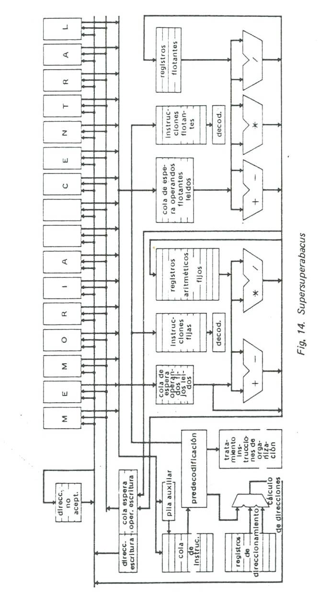

Muy esquemáticamente, nuestro ordenador está dividido en cuatro grandes unidades:

1)  *La memoria central*, entrelazada sobre un número de bancos congruente con el número de ciclos menores por ciclo de memoria y con el dispositivo que controla los accesos a esta memoria.

2)  *La Unidad de instrucción*, que comporta una cola de espera para las instrucciones provenientes de la memoria, los registros de direccionamiento, una unidad de cálculo de dirección, una unidad de premodificación de las instrucciones y una unidad de decodificación y de ejecución de las instrucciones de organización de programa.

3)  y (4) *Una unidad para operaciones aritméticas fijas* y otra para la *aritmética flotante* que, por simplificar, hemos incorporado al mismo modelo. Una unidad flotante que, bajo tal forma, comprende una cola de espera de las instrucciones flotantes y el decodificador asociado, registros de espera para los operandos flotantes provenientes de la memoria, los registros aritméticos flotantes y los operandos flotantes todos del tipo pipe-line.

A modo de ejemplo, vamos a considerar una instrucción de multiplicación flotante. Se descompone en varias etapas:

La dirección de la instrucción se genera en la unidad de instrucción (contador de inicialización de instrucciones). Después de un acceso a memoria, la instrucción buscada se almacena en la pila en donde se desplazará eventualmente hasta que sea transferida al predecodificador.

Éste detectará, por un lado, que se trata de una instrucción flotante y gobernará su transferencia hacia la unidad flotante, por otro lado que el operando se encuentra en memoria y enviará la parte de dirección a la unidad de cálculo de dirección que, tras obtener la dirección efectiva, pedirá un acceso a memoria. Durante el acceso a memoria la unidad flotante decodificará la instrucción y preparará al operador de multiplicación para ejecutar la operación, bloqueándola en tanto el operando extraído de la memoria no le haya sido efectivamente transferido.

En lo que concierne al aspecto pipe-line de la ejecución de las instrucciones sucesivas, anotaremos que es necesario:

\(1\) que las instrucciones sean decodificadas ordenadamente en la unidad de instrucción; (2) que las direcciones sean calculadas ordenadamente en la unidad de cálculo de dirección y enviadas en ese orden a la unidad de control de memoria, que se encargará de evitar invertir las secuencia de las operaciones de lectura y de escritura relacionadas con la misma dirección; (3) que las instrucciones sean ordenadamente decodificadas en cada unidad aritmética.

En cambio, veremos que el orden del programa no tiene forzosamente que ser respetado: (1) entre las decodificaciones de instrucciones en dos unidades aritméticas diferentes; (2) entre las inicializaciones de ejecución efectiva de las operaciones dentro de una misma unidad aritmética, en la medida que no se hayan detectado condiciones de dependencia.

Gestión de la Memoria Central

Supondremos que disponemos de una memoria central entrelazada sobre un número de bancos netamente superior al cociente ciclo memoria/ciclo menor. Comprende tres buses de acceso: un bus para las direcciones, un bus de lectura y un bus de escritura. Por cada ciclo menor puede solicitarse una nueva referencia a memoria. La dirección correspondiente es enviada simultáneamente a todos los bancos de memoria por intermedio del bus de direcciones. El banco que se reconozca lanzará un ciclo de memoria – excepto si hubiera un conflicto de acceso. El acceso a memoria plantea numerosos problemas: la bifurcación de las informaciones leídas en la memoria; la gestión de los conflictos de acceso (conflictos al nivel de un banco o al nivel del conjunto de la memoria); la gestión de los conflictos de dependencia.

**Bifurcación de las informaciones leídas en la memoria:** el problema reside en dirigir toda la información leída en memoria hacia su unidad de destino. A este fin, se asocia con cada dirección un indicador que designe la unidad destinataria. El problema planteado puede considerarse prácticamente resuelto si se es capaz de asociar el indicador adecuado a toda la información irrumpiendo en el bus de lectura proveniente de la memoria.

Una primera solución (inspirada en el 6600) consiste en enviar el indicador al banco al tiempo que la dirección. Éste lo memoriza durante el tiempo de acceso y lo restituye, con la información leída, sobre el bus de lectura.

Segunda solución (360-91): los indicadores están insertos en una cola de espera, cuyos elementos descienden un peldaño por cada ciclo menor. La duración del recorrido es igual al tiempo de acceso a memoria, de suerte que el retorno de la información procedente de la memoria esté sincronizado con la salida fuera de la cola del indicador asociado.


**Gestión de los conflictos de acceso al nivel de los bancos de memoria:** Es preciso conservar, al nivel del controlador de memoria, las direcciones de las referencias que, aunque aceptadas por el dispositivo de gestión de prioridades, no hayan podido ser atendidas por encontrarse ocupado el banco direccionado.

El CDC 6600 resuelve este problema con una cola de espera. Toda referencia enviada mediante el bus de direcciones resulta simultáneamente introducida en un conjunto de registros donde recircula durante un cierto tiempo, calculado para estar en sincronismo con el retorno de una señal, emitida por el banco de memoria direccionado indicativa de si éste ha aceptado la demanda o se encuentra ocupado. En este último caso, se introduce nuevamente la dirección en el bus con vistas a otro intento.

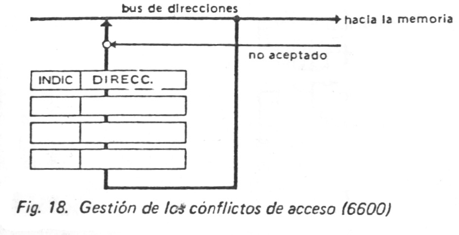

En el 360-91 no se envían sobre el bus de direcciones más que las referencias que serán aceptadas. El resto se almacena en un conjunto de registros tampón y se presentarán sobre el bus en el momento que el banco direccionado quede libre. Para detectar si una dirección puede ser aceptada, se necesita disponer de una tabla de las direcciones de bancos ocupados que pueda ser comprobada por vía asociativa en cada ciclo menor.

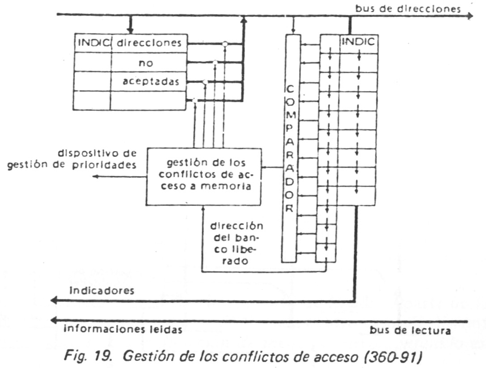

Parece entonces normal asociar a la cola de espera de los indicadores las direcciones de los correspondientes bancos ocupados. De hecho, la cola de estas direcciones de banco será más larga que la de los indicadores, puesto que debe ser recorrido durante un ciclo completo de memoria (y no durante el tiempo de acceso solamente).

**Gestión de las prioridades de acceso a la memoria:** La unidad de acceso a memoria recibe demandas procedentes: (1) de la unidad de instrucción, que pide lecturas de instrucción; (2) de la unidad de cálculo de dirección, para las lecturas o escrituras de operandos; (3) de los canales; además, no pueden olvidarse aquellas que vienen de la cola de las demandas de referencia a memoria enfrentadas a conflictos tales como el de banco ocupado y, en el 360-91, de una cola de las direcciones de almacenamiento de operando.

Aparte de las entradas-salidas, que son de mayor prioridad, las prioridades de los diferentes accesos dependen del estado de los conflictos de acceso precedentemente encontrados, para hacer prioritariamente a las demandas que se han visto diferidas, y del estado de la pila de instrucción, que es prioritaria frente a las demandas de operandos cuando esté incompletamente rellena.

**Gestión de los problemas de dependencia:** se corre el riesgo de encontrarse ante un problema de dependencia si a una petición de escritura le sigue una de lectura en la misma dirección o viceversa. El orden de estas operaciones no puede garantizarse sin precauciones especiales cuando el banco direccionado estuviera ocupado a la aparición de la primera demanda. En efecto, la segunda puede hallar libre al banco, mientras la primera se encuentra circulando en la cola. En el 6600, tal problema se solventa por el procedimiento de prohibir la introducción de una referencia de lectura (respectivamente, escritura) proveniente de la unidad central, si ya existe una referencia de escritura (respectivamente, lectura) recirculando.

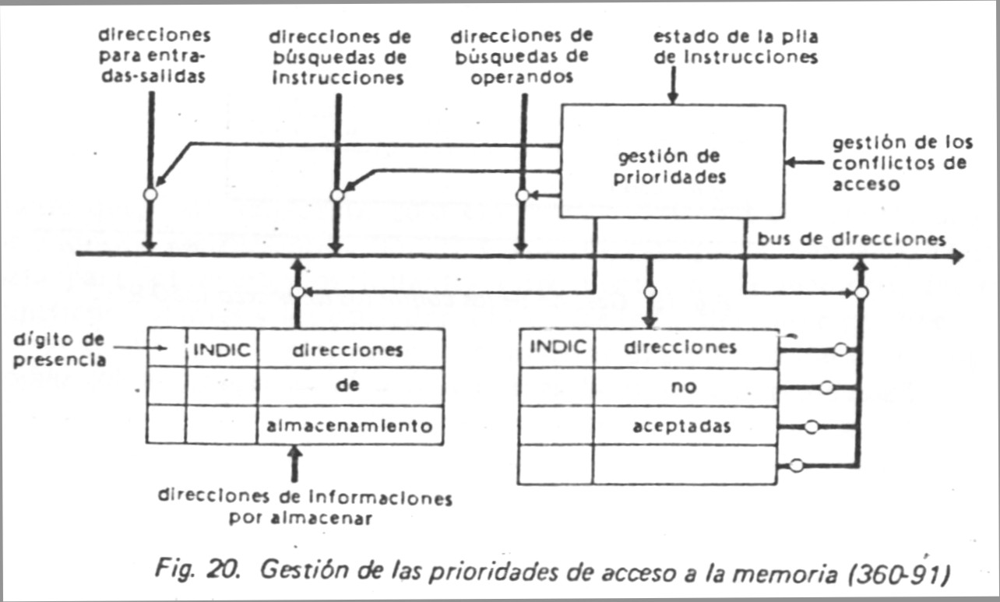

**Gestión de los accesos múltiples:** en el ordenador 360-91 se dispone de una gestión mucho mas afinada de los accesos múltiples a una misma dirección de memoria. Las dificultades se resuelven por comparación asociativa, a cada ciclo menor, de la nueva dirección que se presenta, con todas las direcciones comprendidas en tres juegos de registros: colas de esperas de las direcciones de almacenamiento, registros tampón con direcciones no aceptadas, colas de espera con las direcciones aceptadas. Fig 21

Esto permite: (1) descubrir problemas de dependencia y, por tanto, evitar modificar es secuenciamiento lógico de las instrucciones; (2) descubrir las demandas de lecturas concernientes a una misma dirección, que podrán ser atendidas entonces en un solo ciclo de memoria; (3) suministrar, sin necesidad de acceso a memoria, la información buscada cuando una operación sigue muy de cerca a otra escritura concerniente a la misma dirección.


### Gestión de la Pila de Instrucciones

**La unidad de instrucción:** esta unidad

- - Inicializa las instrucciones, enviando sus direcciones y los indicadores correspondientes hacia la memoria.
  - Gestiona el avance de la pila de las instrucciones provenientes de la memoria.
  - Ejecuta las predecodificaciones de las instrucciones y bifurca las instrucciones aritméticas hacia las unidades correspondientes (fijas o flotantes), después de haberlas dotado de los indicadores necesarios, sustituyendo, en particular, la dirección en memoria por el número del registro tampón hacia el que será encaminado el operando.
  - Calcula las direcciones de operandos y los envía al controlador de memoria asociándoles los indicadores necesarios para designar, además del tipo de ciclo de memoria a ejecutar, el registro tampón destinatario en la unidad aritmética adecuada a la clase de operando.
  - Decodifica y ejecuta las instrucciones de organización de los programas y de modificación de estado de máquina.

Estados de funcionamiento de la pila de instrucciones:

La pila tiene tres estados de funcionamiento: inicialización, funcionamiento normal, discontinuidad. La etapa de inicialización existe en el arranque de la máquina e inmediatamente después de ciertas discontinuidades. Estas se deben esencialmente a las instrucciones de salto y a las interrupciones, pero también a algunas instrucciones de almacenamiento (cuando afectan a una información de la pila).

- **Inicialización de la pila:** al principio, se toma la pila como vacía. Las instrucciones extraídas de la memoria la llenan, empujándose unas a otras. Las búsquedas de instrucciones son prioritarias respecto de las búsquedas de operandos en tanto la pila esté incompleta. Si el decodificador estuviera en estado de espera puede, durante la inicialización, trasmitírsele las instrucciones de cualquier lugar de la pila.

- **Funcionamiento normal de la pila:** en funcionamiento normal, la instrucción en curso de predecodificación ocupa siempre la misma posición de la pila, que desciende un peldaño cada vez que se pasa a la decodificación de la siguiente palabra. Se escoge la posición del registro que contiene las instrucciones en curso de predecodificación de tal manera que pueda cargarse adelantadamente con un número suficiente de instrucciones para ahorrar al predecodificador toda espera. La pila se gestiona por medio de tres registros: (1) la dirección en memoria de la palabra almacenada en el primer registro de la pila; (2) la dirección en memoria de la palabra en curso de decodificación; (3) la dirección en memoria de la palabra almacenada en el último registro de la pila. Funcionando normalmente los tres registros se incrementan en 1 cada vez que la pila desciende un peldaño.

- **Discontinuidades en el funcionamiento de la pila:** aparte de las interrupciones se distinguen cuatro casos de discontinuidades:

1)  *Almacenamiento en una dirección de memoria cuyo contenido está cargado en la pila*. Este es un caso muy particular de conflicto de paralelismo: hemos copiado en la pila una porción de memoria. Tal copia no es válida más que en la medida que el contenido de dicha porción de memoria no sufra alteración, es decir, más que si la instrucción en curso no altera las instrucciones cargadas en pila.
2)  *Salto incondicional*. A menos que el salto incondicional se produzca sobre una instrucción cargada en la pila, esta debe ser reinicializada.
3)  *Salto condicional*. Mientras no se haya comprobado la condición, no es posible saber si el salto se producirá o no. En la espera, es preciso apostar. Se apuesta a que la condición no será satisfecha, esto es, que no habrá salto. Se continúa decodificando las instrucciones siguientes, marcándolas. A fin de diferir su ejecución se pone el ordenador en modo condicional: se preparan las instrucciones, se lanzan las búsquedas de operandos, pero la ejecución efectiva es bloqueada. Preparando así el cambio ante la hipótesis “condición no satisfecha”, se prepara simultáneamente la hipótesis “condición satisfecha” llevando a una pila aneja las instrucciones almacenadas en memoria a partir de la dirección de salto. Cuando se comprueba la condición, cualquiera de estas dos hipótesis puede realizarse: (a) no satisfecha: el ordenador pasa del modo condicional al modo normal y las instrucciones ya preparadas se ejecutan. (b) satisfecha: se anulan las instrucciones preparadas bajo el régimen de modo condicional y se reinicializa la pila de instrucción a partir de la pila aneja.
4)  *Procesamiento de bucles de pequeña longitud*. Cuando hay salto hacia atrás de menos de *n* posiciones, siendo *n* la altura de la pila de instrucciones, se supone que es un bucle. Desplazase la pila de instrucciones hasta conseguir que contenga al bucle completo y se posiciona la unidad de instrucción en modo bucle, con lo cual la pila permanece estática mientras no se salga del bucle.


**Gestión de la Unidad Aritmética: el Algoritmo de Tomasulo**

El algoritmo de Tomasulo permite explotar de forma muy eficaz una unidad aritmética dotada de operadores aritméticos pipe-line. Lo describiremos inspirándonos en su aplicación a la unidad flotante del 360-91. Esta unidad comprende: (1) una cola de espera de instrucciones flotantes salidas de la unidad de instrucción; (2) registro de espera para los operandos provenientes de la memoria central; (3) una cola de espera de operandos por almacenar en memoria central; (4) los registros aritméticos flotantes direccionables; (5) los operadores pipe-line (uno para suma-sustracción, uno para multiplicación división). Puede ejecutar las tres clases siguientes de instrucciones:

1\) CAR R*i* M*j*

(M*j*)R*i*

Carga del registro R*i* desde la célula de memoria de dirección M*j* (es decir, desde un registro tampón de carga)

2\) ALM R*i* M*j*

(R*i*)M*j*

Almacenamiento del contenido del registro R*i* en la célula de memoria de dirección M*j* (es decir en un registro tampón de almacenamiento).

3\) SUM

SUS M*j*

MUL R*i* R*k*

DIV

 + M*j*

(R*i*) - R*i*

\*

/ R*k*

Operación aritmética con el contenido del registro R*i* y el contenido de la célula de memoria de dirección M*j* o el contenido del registro R*k*, quedando el resultado en R*i*. En este último caso, el registro Ri hará al tiempo las veces de origen u de destino. Llamaremos *primer operando* al operando correspondiente.

Una instrucción flotante puede verse bloqueada en tres hipótesis de conflicto: (1) el operador correspondiente no está libre; (2) el operando salido de la memoria no ha llegado aún a los registros-tampón; (3) uno de los registros de la operación se está utilizando como primer operando en una operación anterior aún no concluida.

Para abordar el algoritmo de Tomasulo adoptamos el esquema siguiente:

1)  *Puesta a punto de un método de detección de las dependencias y de los bloqueos que permitan ejecutar en secuencia las instrucciones dependientes (método llamado del bit de bloqueo).*
2)  Crítica del método del bit de bloqueo dentro del terreno de la eficacia. Será demasiado severa, ya que aquel destruye el aspecto pipe-line de la unidad aritmética incluso en circunstancias no impuestas por la dependencia.
3)  Descripción de los dispositivos y conceptos básicos del algoritmo de Tomasulo.
4)  Descripción, sobre un ejemplo, del algoritmo de Tomasulo.

**Método del bit de bloqueo:** permite detectar las dependencias y efectuar los bloqueos oportunos, con la finalidad de imponer la ejecución secuencial de las instrucciones dependientes. Consiste en bloquear el empleo de un registro aritmético cuando su contenido no es válido, es decir, durante la ejecución de toda instrucción que lo altere. Las próximas instrucciones que impliquen a este registro deberán por consiguiente, esperar su desbloqueo para ser ejecutadas. Con cada registro aritmético se asocia un bit de bloqueo BB, que se pone en 1 cuando el contenido de dicho registro es inválido.

**Crítica del método del bit de bloqueo:** Dado que el bit de bloqueo resuelve todos los casos de dependencia, esta crítica se refiere únicamente al problema de la eficacia y se concentra sobre tres puntos: las transferencias inútiles entre registros, la inhibición de la decodificación de las instrucciones y el bloqueo en el caso de las falsas dependencias. Vamos a resaltar estos puntos sobre un ejemplo muy sencillo. Consideremos las dos instrucciones:

MUL R<sub>1</sub> R<sub>2</sub> (R<sub>1</sub>) x (R<sub>2</sub>)  R<sub>1</sub>

SUM R<sub>1</sub> R<sub>3</sub> (R<sub>1</sub>) + (R<sub>3</sub>)  R<sub>1</sub>

Cuyo cronograma se da en la figura 24.

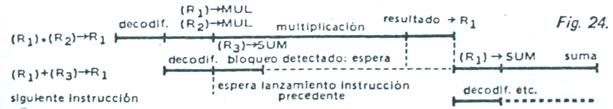

1)  *Transferencias inútiles entre registros:* se envía el resultado de la multiplicación al registro R<sub>1</sub>, después el contenido del registro R<sub>1</sub> al sumador. Se habría ahorrado un ciclo menor transfiriendo simultáneamente el resultado hacia sus dos destinos, o lo que es lo mismo, realizar el esquema b en lugar del a de la figura 25.

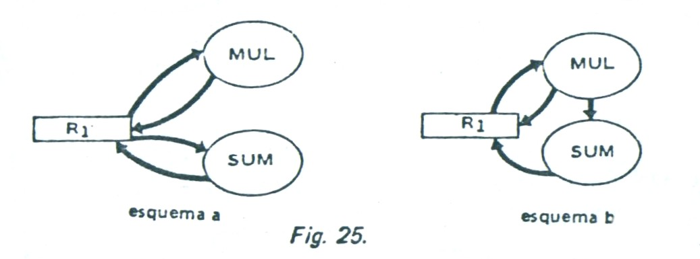

2)  *Inhibición de la decodificación de instrucciones:* después de decodificar la suma, el decodificador se apercibe de que no puede lanzar dicha operación, ya que el registro R<sub>1</sub> está bloqueado. Tampoco puede decodificar la próxima operación, pues perdería las informaciones para lanzar la suma cuando ésta sea posible. Por tanto, una dependencia inhibe el aspecto pipe-line de las siguientes instrucciones.

Puede paliarse tal inconveniente enviando las informaciones necesarias para el lanzamiento de la suma al sumador, quien irá por si mismo a buscar el operando en R<sub>1</sub> después del desbloqueo de este registro. Esto libera al decodificador de cara a la siguiente instrucción. Pero el problema se transfiere al nivel de operadores aritméticos quienes, reservados para operaciones en espera, no pueden encargarse de las nuevas instrucciones.

3)  *Bloqueo en el caso de las falsas dependencias:* suponiendo solucionada la inhibición de la decodificación de las instrucciones tras un bloqueo por dependencia, aún quedaría el problema de las falsas dependencias. De él tenemos un ejemplo típico insertando nuestras dos instrucciones en un bucle (fig.26). Se observa que, por el hecho de utilizar el registro R<sub>1</sub> como registro común de trabajo, las pasadas sucesivas por el bucle no se solapan. No ocurriría lo mismo si consiguiéramos no pasar por el registro R<sub>1</sub>, esto es si transmitiéramos directamente los resultados de operador a operador (fig 27)


### Dispositivos Básicos del Algoritmo de Tomasulo

1)  *El dígito de bloqueo, asociado con cada registro aritmético.(explicado antes)*
2)  *Las estaciones-tampón ante los operadores, para memorizar operaciones en espera por causa de conflicto de paralelismo.* evitan el aumento de los operadores aritméticos supuestos pipe-line.
3)  *El bus común, para enlazar los orígenes posibles de operandos previstos con todos sus posibles destinos.* Está alimentado por todas las unidades de las que se esperan resultados y alimenta a todo registro que pueda esperar un resultado.


4)  *Los indicadores, para controlar los movimientos de operandos sobre el bus común.* A cada unidad susceptible de ser origen de operando para el bus común se le asigna un número, que llamaremos la “*insignia*”. Se hacen asignaciones a: (1) registros-tampón provenientes de la memoria y (2) estaciones-tampón. Cada registro susceptible de ser alimentado por el bus común está prefijado. El *prefijo* posee un número suficiente de dígitos para contener una insignia- Así, son prefijados: (1) los registros flotantes, (2) cada uno de los registros de la estación-tampón y (3) los registros de la cola de espera de los almacenamientos. El bus común transportará, además del operando, la insignia que indica su origen.

### Descripción del Algoritmo de Tomasulo

Tomasulo resume así su algoritmo:

“El prefijo de un registro flotante identifica la última estación-tampón cuyo resultado le es destinado. Cuando una instrucción hace referencia a un registro que se halla bloqueado, es el contenido del prefijo del registro y no el contenido en sí de dicho registro quien está direccionado en la estación escogida. La estación compara continuamente el contenido de su prefijo con la insignia del bus común, que no es sino el número de la estación emisora.

Cuando se detecta una coincidencia, la estación receptora muestrea la información del bus común. Las unidades aritméticas comienzan la ejecución de una operación en cuanto que los dos operandos están presentes en una estación. Una estación puede recibir uno o los dos operandos, bien desde el bus común (si hay espera), bien directamente de los registros aritméticos o de los registros-tampón. Al decodificar una instrucción se transmiten los eventuales contenidos de los prefijos de los registros aritméticos a la estación-tampón escogida y se actualiza el prefijo del registro resultado.

Esta ronda de insignias permite secuenciar correctamente las instrucciones que implican al mismo registro resultado, mientras que el resto de instrucciones es tratado independientemente. Por último, el prefijo de un registro aritmético controla las modificaciones de este registro, de manera que únicamente la instrucción más reciente que comporte su modificación, supone un cambio efectivo de su contenido”. Observemos, en particular, que esta transmisión directa de los resultados de operador a operador, sin transitar por el registro teóricamente destinatario, permite el solapamiento de las instrucciones en el caso de las falsas dependencias. (fig 26 y 27)

### El Futuro de la Arquitectura Pipe-Line

Resulta difícil pronosticar cual será el provenir de los potentes computadores pipe-line. Recordemos que su concepción se sitúa en un punto de compromiso entre, por un lado, el incremento del aspecto pipe-line, lo que supone un aumento de la complejidad de los algoritmos de control, y, por otro lado, la reducción simultanea del ciclo menor y del precio de coste, lo que, a igualdad de tecnologías, se opone al aumento de complejidad. Las ideas cara al futuro parecen orientarse hacia una reducción del hardware de control, dejando en manos del software el control del aspecto pipe-line, actualmente muy costoso tanto en tiempo de ejecución como en cantidad de circuitos, es decir, en precio.

El ordenador prototípico STAR parece abrir una primera posible vía. El programador podría definir secuencias de operaciones idénticas, independientes entre sí y afectando a operandos almacenados bajo forma de vector en memoria entrelazada.

En tales secuencias gobernadas por una sola instrucción, la máquina sería transitada por un flujo de operandos completamente pipe-line, sin que sea necesario hacer intervenir ninguno de los complejos controles ya descritos anteriormente. Cuando no fuera así, la máquina funcionaría o en régimen secuencial normal, o en pipe-line restringido. Dicha máquina podría comportarse muy potentemente frente a problemas especializados, en que se presentasen con frecuencia tales secuencias de instrucciones idénticas e independientes.

Una segunda solución consistiría en conservar el tipo de ruta de datos y los algoritmos actuales, pero controlarlos por software, lo que, según ciertos autores, permitiría ganar un orden de magnitud en eficacia por un precio apenas superior al de un gran calculador tradicional. Con esto proponen, en definitiva, un tipo de máquina que no poseería ya un lenguaje de máquina tradicional sino más bien un lenguaje especializado pipe-line. Las instrucciones, codificadas por más de una centena de bits estarían divididas en campos concernientes a las diversas partes de la máquina.

Serían desencadenadas a razón de una instrucción por cada ciclo menor, y la decodificación de los diferentes campos definiría la tarea de cada unidad de la máquina durante este ciclo menor. El compilador debería evidentemente prever el desarrollo del programa objeto al nivel de los ciclos menores y optimizar el aspecto pipe-line tomando en cuenta tiempos de tránsito en las distintas unidades y conflictos de acceso o de dependencia.
````
