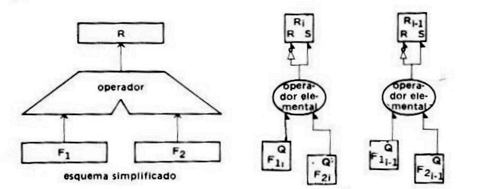
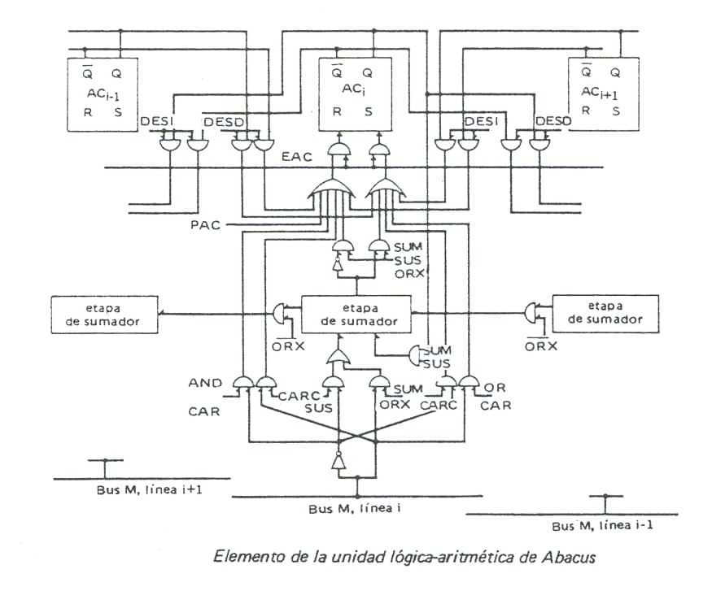
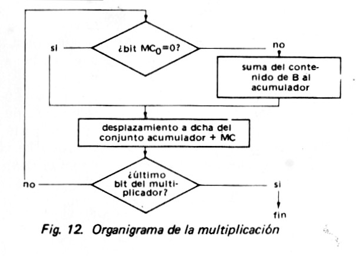
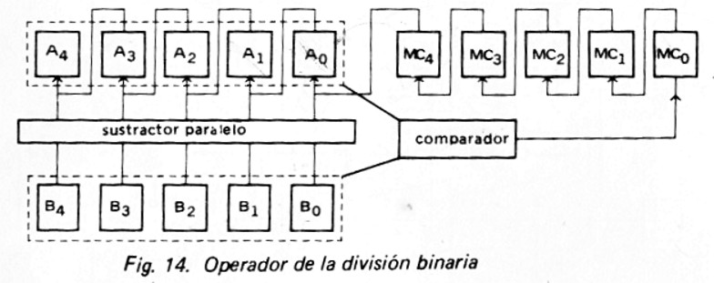
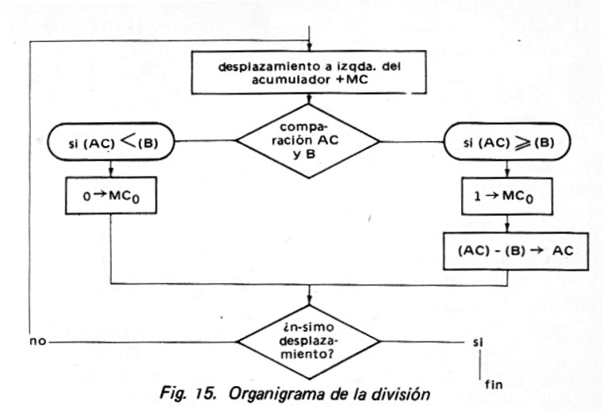

# ALU — Unidad Aritmético-Lógica

## Contenido

- [UNIDAD ARITMÉTICO-LOGICA ELEMENTAL](#unidad-aritmético-logica-elemental)
- [UNIDAD ARITMÉTICO-LOGICA PARA ABACUS](#unidad-aritmético-logica-para-abacus)
- [ARITMETICA DE NUMEROS ALGEBRAICOS BINARIOS](#aritmetica-de-numeros-algebraicos-binarios)
- [MULTIPLICACION Y DIVISION BINARIAS](#multiplicacion-y-division-binarias)
- [TECNICAS DE MULTIPLICACION RAPIDA](#tecnicas-de-multiplicacion-rapida)
- [ARITMETICA EN COMA FLOTANTE](#aritmetica-en-coma-flotante)

La unidad aritmético-lógica (U.A.L.) se compone de una unidad capaz de ejecutar todo el surtido de instrucciones del calculador o de *varias unidades funcionales* u *operadores*, cada uno especializado en la ejecución de una o varias clases de operaciones. Los operadores pueden clasificarse en función del carácter combinacional o secuencial de su concepción. Los primeros ejecutan las operaciones en una sola fase y por esto pueden ser gobernados por señales de nivel, que permanecen activadas durante toda la operación.

En los segundos, las operaciones se ejecutan en varias fases gobernadas por impulsos distribuidos por un dispositivo de control (que puede ser la unidad de control del computador o un órgano del operador). Los operadores constan entonces de dispositivos de memorización de los resultados parciales. Una solución intermedia consiste en disponer de un operador combinacional asociado a un registro acumulador o totalizador, que sirve para la memorización del primer operando durante la operación y para la memorización del resultado, después.

Habitualmente se asocian al operador aritmético indicadores que suministran informaciones acerca de la última operación realizada. Se encuentran indicadores de error: desbordamiento o sobrepasamiento de capacidad, división por cero, etc. e indicadores del estado del acumulador: positivo o negativo, igual a cero, etc. Estos indicadores constituyen lo que se ha dada en llamar código de condición, porque representan informaciones a verificar con ocasión de las instrucciones de salto condicional.

Todos los otros elementos del sistema computacional – UC, registros de memoria, E-S – principalmente llevan datos a la ALU para que esta los procese y luego devuelva los resultados. Está basada en el uso de dispositivos lógicos digitales simples que pueden almacenar dígitos binarios y ejecutar operaciones de lógica simple de Bolean.

Los datos se presentan a la ALU en registros, y los resultados de una operación se almacenan en registros. Éstos son localidades de almacenamiento temporal dentro de la CPU que están conectados por vías de señal a la ALU. La ALU también pondrá banderas como resultado de una operación; los valores de as banderas se almacenan también en registros dentro de la CPU. La unidad de control proporciona señales que controlan la operación de la ALU, y el movimiento de los datos hacia dentro y hacia fuera de la misma.

## UNIDAD ARITMÉTICO-LOGICA ELEMENTAL

Para el caso de operaciones entre bits del mismo peso, se encuentran dos montajes posibles de los operadores.

1)  *Operador Combinacional*: Los operadores se montan entre dos registros fuentes F1 y F2 (o entre dos buses fuentes) para los operandos y un registro R para el resultado (o un bus para el resultado). (Obsérvese que, sobre este esquema, el resultado solo es válido en tanto los operandos fuentes permanezcan posicionados).

2)  *Operadores con Acumulador*: no exigen más que un registro fuente para almacenar uno de los operandos, ya que el otro es memorizado por el acumulador durante todo el tiempo de la operación. Cuando a la salida de los operadores elementales quedan establecidos los niveles lógicos, un impulso EAC introduce el resultado en el acumulador.

Operaciones Lógicas

Fuera de la complementación, que se consigue por circuitos NOT en el caso del operador combinacional y por la complementación del acumulador, en el caso del operador con acumulador, las demás operaciones se reducen esencialmente a operaciones AND, OR y ORX.

*Operador Combinacional:* Utiliza el mismo esquema del operador combinacional visto anteriormente sustituyendo los operadores elementales por el circuitos AND, si se trata de la operación de intersección, OR si se trata de la operación reunión, ORX (OR exclusivo) si de la operación diferencia simétrica.

*Operador con Acumulador:* La organización presentada con la figura del operador con acumulador anterior puede simplificarse, si se parte de la idea siguiente: en vez de ejecutar la operación con los bits homólogos del registro fuente y del acumulador, se observa que basta, según el valor del bit fuente F*i*, con dejar inalterado el bit del acumulador o forzarle a un valor no dependiente más que de F*i*. Por ejemplo: para el AND, el bit acumulador continua inalterado si Fi = 1, pero debe ponerse a cero si Fi = 0

## UNIDAD ARITMÉTICO-LOGICA PARA ABACUS

La unidad aritmética de Abacus está montada entre un bus fuente M, donde se mantienen los niveles lógicos representativos del segundo operando, y un acumulador AC que mantiene los niveles lógicos correspondientes al primer operando hasta que la señal de muestreo EAC introduce el resultado en el acumulador.

Consta de un sumador en paralelo y de un conjunto de puestas para ejecutar las operaciones lógicas y distribuir las informaciones de acuerdo con las operaciones aritméticas a efectuar. Además, el acumulador está montado como registro de desplazamiento.

Las diferentes operaciones están gobernadas por señales lógicas, procedente normalmente del generador central de secuencias del ordenador. Todas estas señales son de nivel, de tal suerte que al cabo de un cierto tiempo después del posicionamiento el resultado de la operación se estabiliza bajo la forma de niveles lógicos, que serán introducidos en el acumulador por el impulso EAC. En la figura siguiente se representa el *i-simo* elemento de esta unidad. Las diferentes operaciones que permite son:

**CAR** *Carga:* transferencia al acumulador de la información presente sobre el bus M.

**CARC** *Carga con complementación:* el mismo proceso, pero después de complementar cada dígito.

**SUM** *****Adición:* suma al contenido del acumulador, la información presente sobre el bus M. Esta adición es operada por el sumador en paralelo y la duración de la misma es el tiempo de propagación de los arrastres.

**SUS** *Sustracción:* se resta la información en el bus M del contenido del acumulador. Se realiza complementando la información del bus M y después sumándola en el sumador paralelo. La operación es correcta si Abacus opera en complemento a 1. Si no, se precisa posicionar un nivel 1 a la entrada de arrastre a la etapa de sumador de menor peso.

**AND** *intersección lógica:* entre la información en el bus M y el contenido del acumulador.

**OR** *reunión lógica:* entre la información en el bus M y el contenido del acumulador. Estas dos últimas operaciones se realizan según el esquema de la etapa de operador lógico.

**ORX** *OR exclusivo:* entre la información en el bus M y el contenido del acumulador. Esta operación se ejecuta aquí por parte del sumador, inhibiendo la propagación de los arrastres.

**DESI** *Desplazamiento a izquierda*: desplazamiento del contenido del acumulador una posición binaria a la izquierda.

**DESD** *Desplazamiento a derecha:* desplazamiento del contenido del acumulador una posición binaria a la derecha.

Los indicadores asociables a la unidad aritmética de Abacus podrían ser los siguientes:

**DEB** Indicador de desbordamiento.

**S** Indicador de signo.

**CE** Indicador de cero. Puede cablearse mediante un NOR recibiendo todas las salidas Q de los biestables del acumulador, si Abacus trabaja en complemento a 2. (En complemento a 1 se precisaría un OR detrás de un NOR para todas las salidas Q y de un NOR para todas las salidas Q’).

## ARITMETICA DE NUMEROS ALGEBRAICOS BINARIOS

Suma Acelerada

Es de notar en el sumador paralelo visto en la unidad anterior que el tiempo de estabilización de las salidas de las etapas de sumador tras el posicionamiento de los biestables varía según los operandos por sumar; el caso más desfavorable es aquel en que un arrastre generado al nivel del bit de menor peso se propaga hasta el de mayor peso.

Por tanto es la duración de la propagación del arrastre a través del conjunto de las etapas lo que debe tomarse como tiempo de adición, ya que no debe hacerse el muestreo antes de haber transcurrido este tiempo, si se quiere estar seguro de haber obtenido la estabilización de las salidas.

Entre las numerosas soluciones propuestas para acelerar la operación de la suma citaremos la técnica del puente (by pass). Se divide el sumador en secciones (o sub sumadores), cada uno de ellos activo sobre un pequeño número de bits.

En una primera fase, se realizan las sumas al nivel de cada sección, sin tomar en cuenta el arrastre, eventualmente generado en la sección inmediatamente anterior. En una segunda fase, los arrastres son propagados.

El arrastre generado en la sección i-1 debe conducir a añadir 1 a la sección i; esta operación puede llevar a la sección i a propagar también este arrastre hasta la sección i+1.

El procedimiento se centra en detectar, sin necesidad de realizar la propagación en la sección i, si este arrastre existe y ha de transmitirse a la sección 1+1. Si la respuesta es positiva el arrastre generado en la sección i-1 se transmitirá a la sección i+1 “puenteando” a la sección i; por consiguiente, no tendrá que atravesar mas que una puerta.

Es cuestión de encontrar la condición que permitirá saber, sin tener que efectuar realmente la propagación, si el arrastre puenteará o no la sección. Es fácil convencerse de que tal condición se anuncia así: el arrastre será bloqueado cuando los dos operandos presenten dos dígitos binarios idénticos en una de sus posiciones por lo menos, (o si el resultado obtenido en la primera fase de la operación posee al menos un dígito 0).

En dicho tipo de sumador, la duración de la suma es igual al doble del tiempo máximo de propagación del arrastre en una sección.

Adición y Sustracción

Sustraer un número de otro equivale a sumarle su opuesto. La sustracción se reduce a la suma algebraica siempre que se sepa calcula el opuesto de un número, lo que generalmente se hace por complementación. Este método evita tener que situar un Sustractor junto al sumador. Acá nos limitaremos al estudio de la suma de dos números algebraicos al caso de la representación por complementación auténtica (complemento a 2), ya que las dificultades planteadas por la complementación restringida son muy semejantes.

Supondremos que nuestra unidad aritmética procesa números representados por *n* bits, con el bit de signo situado en la primera posición a la izquierda. Asociaremos al acumulador un (n+1)-simo bit, que actuará de indicador de desbordamiento.

Para estudiar la operación de suma algebraica elaboramos un cuadro a tres entradas correspondientes a las tres configuraciones posibles de signo de los operandos y considerando el arrastre n-1 procedente de la etapa inmediatamente a la derecha del bit de signo. La presencia de este arrastre implica un desbordamiento en el caso de un resultado esperado positivo; su ausencia implica un desbordamiento en el caso de un resultado esperado negativo.

El indicador de desbordamiento debe posicionarse solo en dos casos: cuando no hay arrastre de orden *n-1* pero hay arrastre de orden *n* o bien cuando hay arrastre de orden *n-1* pero no de orden *n*.

<table>
<tbody>
<tr>
<td>Condiciones de signo</td>
<td>2 operandos &gt; 0; el resultado debe ser positivo</td>
<td>1 operando &gt; 0; 1 operando &lt; 0. No puede haber desbordamiento</td>
<td>2 operandos &lt; 0; el resultado debe ser negativo</td>
</tr>
<tr>
<td>Representación inicial (registros de 5 bits)</td>
<td>
0….

0….
</td>
<td>
1…..

0…..
</td>
<td>
1…..

1…..
</td>
</tr>
<tr>
<td>Resultado si no hay arrastre procedente de la etapa n-1 </td>
<td>
0….

Válido: resultado positivo.
</td>
<td>
1…..

Válido: resultado negativo
</td>
<td>
10….

No válido puesto que resultado positivo: desbordamiento.
</td>
</tr>
<tr>
<td>Resultado si hay arrastre procedente de la etapa n-1</td>
<td>
1….

No válido: puesto que resultado negativo: desbordamiento.
</td>
<td>
10….

Válido olvidándose del arrastre: resultado positivo
</td>
<td>
11….

Válido olvidándose del arrastre: resultado negativo.
</td>
</tr>
</tbody>
</table>

## MULTIPLICACION Y DIVISION BINARIAS

Multiplicador Secuencial por Suma - Desplazamiento

Hay que mencionar que aquí nos limitaremos a las operaciones con los números en valores absolutos, dejando aparte el tratamiento de los signos. Consideremos el siguiente ejemplo numérico:

1011 Multiplicando

*1101* Multiplicando

1011

0000

1011

*1011 \_*

10001111 Producto

Los productos parciales son iguales al multiplicando si el bit correspondiente del multiplicador es 1, nulos en caso contrario. Una primera operación consiste, entonces, en verificar sucesivamente cada bit del multiplicador, de donde se deducen los productos parciales que, convenientemente desplazados, se totalizan en un acumulador. Nótese que si el multiplicador y el multiplicando tienen n bits cada uno, el acumulador necesario deberá poseer capacidad para 2n bits; por consiguiente, el resultado se obtiene en doble longitud. La unidad aritmética capaz de realizar una multiplicación debe estar dotada de un anexo al acumulador, generalmente llamado “Multiplicador-Cociente”, abreviadamente MC, porque contiene el multiplicador en el caso de la multiplicación, el cociente en el caso de la división.

La operación se inicializa de la siguiente manera:

1)  Carga del multiplicador en el acumulador.
2)  Desplazamiento a derecha del contenido del conjunto formado por el acumulador y el registro MC, cuyo resultado es poner 0 en el acumulador y el multiplicador en MC.
3)  Carga del multiplicando en B (que, eventualmente, pudiera ser sustituido por el RPM).

A continuación se ejecuta la operación siguiendo las líneas marcadas por el siguiente organigrama de principio.

Al final de la operación, el resultado de la multiplicación ocupa en doble longitud el conjunto acumulador + MC.

## TECNICAS DE MULTIPLICACION RAPIDA

Dos vías principales permiten aumentar, por medios lógicos, la velocidad de la multiplicación.

1)  Basándose en la técnica tradicional de suma-desplazamiento y disminuyendo el número de operaciones parciales sucesivas.

2)  Realizando un operador celular para una multiplicación casi paralela.

***1. Mejora de la técnica de Suma-Desplazamiento**:* pueden aportarse modificaciones a la técnica anterior. Entre las diversas soluciones propuestas, escogemos una que se refiere a la condensación de operaciones por realizar cuando se tiene una sucesión de ceros o una sucesión de unos. Por consiguiente se presupone que pueda verificarse el número de 0 o de 1 sucesivos.

**Caso de una sucesión de 0.** La mejora consiste en dotar al acumulador de circuitos para el desplazamiento de varias posiciones en una sola operación. En estas condiciones, la sucesión de 0 será tratada por un solo desplazamiento.

**Caso de una sucesión de 1.** Se emplea el método llamado de “suma y sustracción”. En el esquema tradicional una serie de 1 contiguos da lugar a una serie de adiciones, cada una seguida de un desplazamiento.

El método consiste en sustituir esta serie de adiciones por una adición y una sustracción. Por ejemplo, se la operación; **multiplicando x 01111100**; esta operación implica 5 adiciones, pero el multiplicador puede también escribirse: **10000000 – 00000100**; de donde se deducen las reglas de la operación para el caso de presentarse una serie de 1 son las siguientes:

\(1\) Al primer 1 de la serie, se resta el multiplicando del contenido del acumulador.

\(2\) Al primer 0 después de la serie, se suma el multiplicando con el contenido del acumulador, tras haber ordenado un desplazamiento de tantas posiciones como 1 hay en la serie.

El esquema se puede mejorar aún más, por ejemplo, si se tiene un cero entre dos series de 1, ello conduce normalmente a una suma para tomar en cuenta al 0 y a una sustracción para el siguiente 1. De hecho, es posible agrupar estas dos operaciones en una sola sustracción al nivel del 0.

***2**. **Multiplicación celular en paralelo:*** En el método de Suma-Desplazamiento, eventualmente mejorado, la multiplicación consiste en hacer un determinado número de operaciones sucesivas, cada una de las cuales debe concluirse antes de pasar a la siguiente. Pero es factible un circuito combinacional con dos entradas (el multiplicando y el multiplicador) que de el resultado a la salida en una sola operación. La red celular de la figura siguiente realiza la multiplicación:

|  |  |  |  |  |  |  |  |  |  |
|----|----|----|----|----|----|----|----|----|----|
|  |  |  |  |  | **Y****4** | **Y****3** | **Y****2** | **Y****1** | **Y****0** |
|  |  |  |  | x | **X****4** | **X****3** | **X****2** | **X****1** | **X****0** |
| **A****9** | **A****8** | **A****7** | **A****6** | **A****5** | **A****4** | **A****3** | **A****2** | **A****1** | **A****0** |

Esta operación es ejecutada en paralelo. La señal EAC muestrea los niveles a la entrada del registro A.

Si se exceptúan la fila y la comuna 0, la célula está constituida por una puerta AND y una etapa de sumador. Si fijamos nuestra atención en la célula correspondiente a la fila i y a la columna j, la puerta AND está cerrada si el bit Xi del multiplicador vale 0: el sumador se limita a transmitir a la fila inferior el resultado parcial precedentemente obtenido, desplazándolo una posición.

En caso contrario, la puerta se abre: el sumador adiciona el nuevo producto parcial Yj al resultado parcial obtenido en la fila superior, después practica el desplazamiento de una posición transmitiéndolo a la fila inferior.

Esta sucesión, mucho más onerosa que la anterior, puesto que se multiplica por n el número de etapas de sumador, ofrece la ventaja de ser muy rápida: aproximadamente el doble del tiempo de una suma de n dígitos, ya que un arrastre atraviesa como máximo *2n+1* etapas de sumador.

Multiplicación en Complemento a 2 ( STALLING )

En el caso de complemento a dos, cuando tenemos el multiplicador o multiplicando o ambos con signo negativo debemos operar de diferente manera. Existen varias soluciones para este dilema. Una de ellas es convertir el multiplicador y el multiplicando en números positivos, realizar la multiplicación, y después tomar el complemento a 2 del resultado si y solo si el signo de los dos números originales difiere. Los implantadores han preferido utilizar técnicas que no requieren este paso final de transformación. Uno de los más comunes es el algoritmo de Booth.

El algoritmo de Booth se puede describir de la siguiente manera: El multiplicador y el multiplicando se colocan el los registros Q y M, respectivamente. También existe un registro de 1 bit colocado de manera lógica a la derecha del bit menos significativo (Q0) del registro Q y designado Q-1.

Los resultados de la multiplicación aparecerán en los registros A y Q. Los registros A y Q-1 se inicializarán en 0. Como antes la lógica de control analiza los bits del multiplicador, uno a la vez. Ahora, cada bit es examinado, el bit a su derecha también es examinado. Si los dos bits son el mismo (1-1 o 0-0), entonces todos los bits de los registros A, Q y Q-1 se corren un bit a la derecha. Si los dos bit difieren, entonces el multiplicando se suma a o se resta del registro A, de acuerdo a si los dos bit son 0-1 o 1-0.

Siguiendo a la suma o la resta, el corrimiento a la derecha ocurre. En cualquier caso el corrimiento a la derecha es tal que el bit más significativo de A, denominado An-1, no solo se recorre a An-2, sino que también permanece en An-1. Esto se requiere para preservar el signo del número en A y Q. Esto se conoce como un *corrimiento aritmético*, puesto que preserva el bit del signo.

Divisor por Sustracción y Desplazamiento

En la multiplicación, los productos parciales eran iguales al multiplicando o nulos, según que el correspondiente bit del multiplicador valiera 1 ó 0. Se iban totalizando después de desplazar una posición hacia la izquierda a cada producto parcial en relación con el anterior.

En la división, se resta del dividendo el divisor o cero, según que el correspondiente bit del cociente valga 1 o 0. Se recomienza después de practicar un desplazamiento a la derecha del divisor en relación con el dividendo. Por tanto, multiplicación y división son operaciones muy semejantes. Basta cambiar sumas en sustracciones e invertir el sentido de los desplazamientos. Sin embargo, en la división aparece una dificultad complementaria: es necesario añadir a cada etapa una operación de comparación entre los bits de mayor peso de dividendo y divisor a fin de determinar el bit correspondiente del cociente.

Para efectuar una división tomaremos de nuevo la unidad aritmética utilizada con la multiplicación (casi siempre es común la unidad para ambas operaciones); pero transformaremos el sumador en sustractor, invertiremos el sentido del desplazamiento y añadiremos el dispositivo de comparación.

Generalmente la operación se inicializa de la manera siguiente:

1)  Carga del dividendo en el Acumulador

2)  Desplazamiento a derecha del contenido del conjunto acumulador + MC, con objeto de poner a cero el acumulador y cargar el dividendo en el MC.

3)  Carga del divisor en B.

La operación comenzará por un desplazamiento a izquierda del conjunto acumulador + MC, lo que tiene por consecuencia poner el bit de mayor peso del dividendo en A0 y liberar el biestable MC0. Se compara el contenido del acumulador con el contenido del registro B. Si (AC)\<(B), se pone MC0 a cero sin tocar el acumulador, si (AC)\>=(B), se resta del acumulador el divisor, se pone MC0 a 1, etc. Al final de la operación, el registro multiplicador cociente alberga al cociente y el resto aparece en el acumulador.

Por lo mismo que hemos obtenido en la multiplicación un resultado en doble longitud, puede presuponerse aquí un dividendo de doble longitud. Basta cargar al principio los bits de mayor peso del dividendo en el acumulador, y los bits inferiores al MC. En estas condiciones, se corre el riesgo de cometer un error si el contenido del acumulador es mayor que el divisor: el cociente excedería entonces a la capacidad del MC y se perderían sus bits de mayor peso.

Se evita este error comparando inicialmente los contenidos de acumulador y registro B. A este nivel es cuando pueden detectarse las divisiones por cero. También puede convenirse en no dividir más que por números enmarcados a izquierda, de manera que siempre el bit de mayor peso del divisor sea 1. (Este será el caso en la división de números flotantes).

División con Restauración

En el punto anterior hemos dado por supuesto que contábamos con un dispositivo para comparar directamente los valores numéricos de los contenidos del acumulador y del registro B. En realidad, casi nunca se cuenta con él por razones de precio, por lo que puede hacerse la comparación intentando restar el divisor del dividendo y comprobando el signo del resultado. Este es, además, el procedimiento que empleamos cuando nos vemos obligados (desgraciadamente) a operar una división sin máquina ni regla de cálculo. Pero, al contrario de lo que sucede en el papel, la unidad aritmética pierde el antiguo valor del dividendo cuando el intento no surte efecto. En tal caso, es necesario restaurarlo, añadiendo el divisor al dividendo antes de hacer un nuevo intento, de ahí el algoritmo de la división con restauración.

División sin Restauración

Corresponde a un algoritmo que permite ahorrar la fase de restauración después de una sustracción con resultado negativo, lo que supone una ganancia de tiempo. Sea α el contenido del acumulador y β el divisor antes de la fase de restauración. Esta consiste en hacer α + β, sistemáticamente seguida de una sustracción del divisor desplazado (que vale β/2) y el resultado es (α + β) - β/2 = α + β/2. Es posible combinar la restauración y la sustracción que la sigue en una sola operación: la suma del divisor desplazado. En otros términos, un intento dando resto positivo ira seguido, al paso siguiente, de la sustracción del divisor desplazado, mientras que un intento resultando en resto negativo deberá seguirse de la suma del divisor desplazado.

## ARITMETICA EN COMA FLOTANTE

Recordemos que los números en coma flotante se representan en la forma S.M.αE, donde S es el signo del número, M la mantisa, E el exponente y α la base (que generalmente vale 2 o 16 en aritmética binaria). Las operaciones se llevan a cabo sobre números normalizados, esto es, sobre números cuyo valor de exponente está ajustado para que la mantisa tenga el mayor número posible de dígitos significativos. Por consiguiente, los operadores en aritmética flotante deben, no solamente ejecutar la operación correspondiente, sino también normalizar el resultado obtenido.

Suma y Sustracción en Coma Flotante

La primera fase consiste en *alinear las mantisas* con el objeto de enfrentar los bits del mismo peso. Supongamos a sumar los números A = 12000 x 10-1 y B = 80000 x 102

No puede operarse directamente la suma de las mantisas, se comparan los exponentes y se detecta que el primero de los números es más pequeño, sobre este número se ejecuta una doble operación: incremento del exponente en una unidad y desplazamiento de la mantisa una posición a la derecha. De nuevo se comparan y se recomienza hasta obtener identidad de exponentes. En ese momento puede efectuarse la suma de las mantisas:

La segunda fase consiste en *ajustar los signos*. Consideremos la sustracción de A –B. En la representación en valor absoluto y signo, se deben primeramente comparar las mantisas A y B, comprobar que la de B es superior a la de A y deducir de ello que la operación pertinente es sustraer la mantisa de A de la de B y al resultado darle el signo menos.

Debe tomarse así en cuenta en esta fase la clase de operación (suma o sustracción), el signo de los operandos y el resultado de la comparación de mantisas. El problema se simplifica si el conjunto signo-mantisa fuera representado en complementación cuando el número sea negativo.

La tercera fase es la *normalización del resultado*

Puede que el resultado bruto de la operación no esté normalizado, por dos razones:

- Hay desbordamiento de capacidad en la suma, en cuyo caso se deberá desplazar la mantisa una posición a la derecha, aumentando al mismo tiempo en una unidad el exponente.

- La diferencia de las mantisas implica un número de n ceros a la izquierda del resultado, en cuyo caso se deberá desplazar la mantisa n posiciones a la izquierda, restando simultáneamente n del exponente.

Funcionamiento de un Operador de Suma Flotante

Operando

S  1 bit signo del operando S = 0 (signo más); S = 1 (signo menos)

E e bits exponente; representa una potencia de 2 y está comprendido entre -2e-1 y 2e-1-1; el exponente -2e-1 está representado por E = 0 y el exponente 2e-1-1 está representado por E = 2e-1.

M  m bits mantisa; la mantisa de un operando negativo está representada en complemento a 2. Un operando normalizado se caracteriza por el hecho de que el bit de signo y el bit de mayor peso de la mantisa tienen valores diferentes.

Este operador utilizado comprende dos registros A y B para los operandos y un sumador m + 1 bits que ejecuta las sustracciones por complementación previa del segundo operando.

Se emplea de una parte, para comparar los exponentes por sustracción cuyo resultado va a un registro CD montado como contador-descontador binario con bit de desbordamiento, y por otra parte, para las operaciones con signo y mantisa, cuyo resultado va a un registro RD montado como registro de desplazamiento a derecha e izquierda con bit de desbordamiento (en general se utiliza el sumador de la unidad aritmética, al que se le añade eventualmente un sumador de exponentes).

La operación se divide en varias fases:

1.  **Comparación de los exponentes**: Se resta EB de EA sumando a EA EB complementado, y el resultado va a CD. Si el resultado es nulo, las dos mantisas están correctamente alineadas y se pasa inmediatamente a la fase de suma o sustracción de las mantisas. Si no, el contenido de CD permitirá contar los desplazamientos necesarios para alinear las mantisas.

2.  **Alineamiento de mantisas**: Esta operación se realiza sobre el operando cuyo exponente es menor. Si EA \< EB el resultado de la sustracción de los exponentes es negativo y se caracteriza por el valor 1 del bit de desbordamiento. El complemento del contenido de CD indica el número de desplazamientos por efectuar. CD se usará entonces en funciones de contador, y los desplazamientos se sucederán hasta un nuevo desbordamiento.

El desplazamiento de la mantisa se efectúa en RD, entonces se envían los contenidos de SA de MA yuxtapuestos a RD y se opera por desplazamiento aritmético hacia la derecha (lo que permite reproducir el signo en los bits no significativos y por lo tanto conservar la representación complementada).

En el caso EA \> EB, el desplazamiento aritmético a la derecha afecta a SB y MB, pero en esta ocasión el registro CD se emplea como descontador, deteniéndose los desplazamientos cuando CD=0 (nótese que después de todo, pueden detenerse al cabo del m-ésimo desplazamiento ya que a partir de entonces la mantisa pierde todo su significado).

Esta fase finaliza preservando el mayor exponente en CD y devolviendo la mantisa contenida en RD al registro A o B que corresponda.

3.  **Suma-sustracción de las mantisas**: Estas operaciones se ejecutan sobre el conjunto formado por el signo y mantisa, yuxtapuestos. La sustracción se obtiene sumando SA MA el complemento auténtico de SB MB. El resultado a RD, tomando en cuenta el signo y un eventual desbordamiento.

Las operaciones de normalización se realizan mediante desplazamientos sobre el registro RD, que contiene el signo y la mantisa del resultado, y sobre el registro CD, que contiene el exponente.

4.  **Normalización en el caso de desbordamiento**: Consiste en desplazar la mantisa del resultado en una posición a la derecha, siendo sustituido el bit de mayor peso por el de desbordamiento. El signo queda inalterado. El contenido del registro CD se ve aumentado en una unidad.

5.  **Normalización en caso que la mantisa del resultado contenga dígitos no significativos a su izquierda**: esta eventualidad es detectable haciendo un test sobre el signo y el digito de mayor peso de la mantisa. Si son diferentes, el número ya estaba normalizado. Sino, es preciso realizar desplazamientos aritméticos de la mantisa hacia la izquierda hasta que sean diferentes. A cada desplazamiento se resta una unidad del contenido de CD. El proceso se detiene incondicionalmente al cabo de **m** desplazamientos.

Multiplicación y División en Coma Flotante

La multiplicación flotante es reducible a la multiplicación de las mantisas y a la suma de los exponentes, en tanto que la división se reduce a la división de las mantisas y a la sustracción de los exponentes. No hay operación preliminar de comparación de exponentes o de alineamiento de las mantisas. La normalización es sencilla si se compara con la suma. La multiplicación de dos números comprendidos entre ½ y 1 da un resultado entre ¼ y 1, de tal suerte que la normalización supondrá, como máximo, un desplazamiento de una posición a la izquierda. La división dará un resultado entre 2 y ½, de forma que su normalización implicará, como máximo, un desplazamiento de una posición a la derecha. Se ejecutan estas operaciones sobre las mantisas representadas en valor absoluto.
