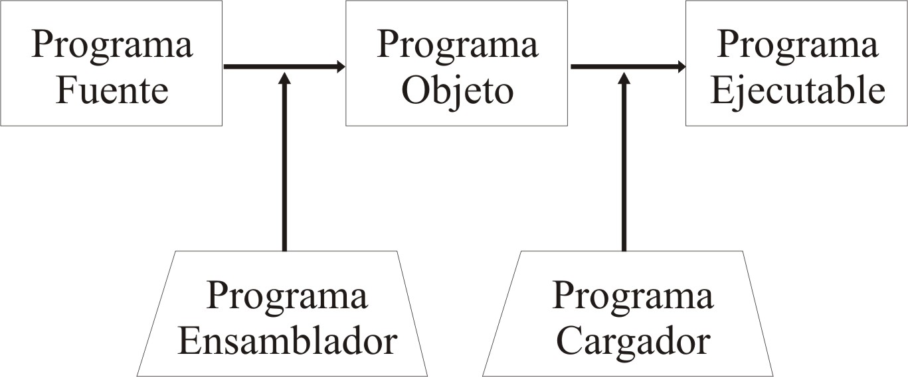
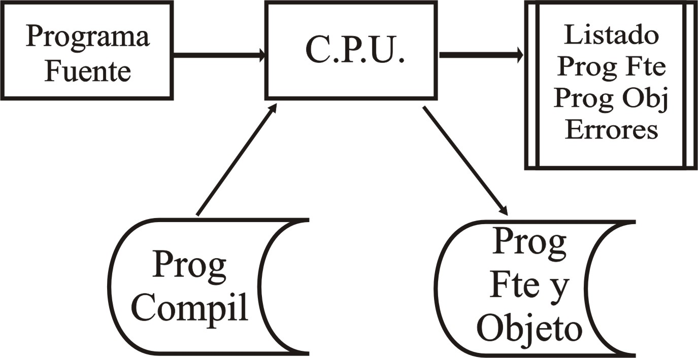

# Unidad Temática V — Lenguaje de Máquina

## Contenido

- [Unidad Temática V — Lenguaje de Máquina](#unidad-temática-v--lenguaje-de-máquina)
  - [Contenido](#contenido)
  - [Forma General de las Instrucciones Aritméticas](#forma-general-de-las-instrucciones-aritméticas)
  - [Conjunto de Instrucciones de un Computador](#conjunto-de-instrucciones-de-un-computador)
  - [Diferentes Tipos de Instrucciones](#diferentes-tipos-de-instrucciones)
  - [LENGUAJE DE MAQUINA](#lenguaje-de-maquina)
  - [Programación en Lenguaje de Máquina](#programación-en-lenguaje-de-máquina)
  - [LENGUAJE ENSAMBLADOR](#lenguaje-ensamblador)
  - [CAR E B RES1](#car-e-b-res1)
  - [SUM C C RES1](#sum-c-c-res1)
  - [ALM DEN1 D RES1](#alm-den1-d-res1)
  - [CAR D E RES1](#car-d-e-res1)
  - [SUM B TRES ATR3](#sum-b-tres-atr3)
  - [DIV DEN1 A RES1](#div-den1-a-res1)
  - [ALM A DEN1 RES1](#alm-a-den1-res1)
  - [LENGUAJES EVOLUCIONADOS O DE ALTO NIVEL](#lenguajes-evolucionados-o-de-alto-nivel)
  - [Compiladores e Intérpretes](#compiladores-e-intérpretes)
  - [LENGUAJES DE COMPUTACION](#lenguajes-de-computacion)
  - [Lenguajes Próximos a la Máquina](#lenguajes-próximos-a-la-máquina)
  - [LA TRADUCCIÓN](#la-traducción)
  - [Estructura del Registro de Instrucción](#estructura-del-registro-de-instrucción)
  - [Tipos de Direccionamiento](#tipos-de-direccionamiento)
  - [PROGRAMACION EN LENGUAJE DE MAQUINA](#programacion-en-lenguaje-de-maquina)

Proponemos aquí intentar una clasificación de las máquinas del tipo de Von Neumann, en función de
los elementos de información constitutivos de la instrucción y también describir brevemente los
principales tipos de instrucciones encontrados en este tipo de máquinas.

## Forma General de las Instrucciones Aritméticas

La instrucción aritmética-tipo debe suministrar a la unidad de control encargada de decodificarla y
de gobernar su ejecución un cierto número de elementos informativos, de entre los cuales son los
principales:

1. la naturaleza de la operación por realizar. Es el papel reservado al código de operación.
   Ejemplo: operación de suma en coma fija de precisión simple;

2. los datos, y operandos, implicados por la instrucción. Generalmente la instrucción especifica las
   direcciones de los operandos. Ejemplo: la operación de suma en coma fija de precisión simple
   implica al operando de dirección D1 y al operando de dirección D2. si la
   instrucción afecta a mas de dos operandos, se suele almacenar en secuencia de tal suerte que
   baste con dar la dirección del primero y la dirección del último o la longitud de la secuencia.

3. El emplazamiento donde debe almacenarse el resultado. Ejemplo: el resultado de la operación
   anterior de los dos operandos de direcciones D1 y D2 deben ser almacenados
   en la dirección D3.

4. La dirección de la próxima instrucción por ejecutar. Ejemplo: tras haber ejecutado la suma,
   ejecutar la instrucción de dirección D4.

|                     |                           |                            |                                             |                               |
| ------------------- | ------------------------- | -------------------------- | ------------------------------------------- | ----------------------------- |
| CO                  | D1             | D2              | D3                               | D4                 |
| Código de operación | Dirección primer operando | Dirección segundo operando | Dirección para almacenamiento del resultado | Dirección próxima instrucción |

Instrucción de cuatro direcciones

Una máquina, cuya instrucción posee implícitamente estos diferentes elementos, se llama máquina de
cuatro direcciones (o también, de 3+1 direcciones, a fin de distinguir de las otras la dirección de
la próxima instrucción). Estas máquinas son muy raras, ya que ciertas direcciones pueden, en
general, ir implícitamente definidas. La cuarta dirección, que apunta a la próxima instrucción, está
evidentemente implícita, si se exceptúan las instrucciones de ruptura de secuencia, en todas las
máquinas donde las instrucciones sean secuencialmente almacenadas en memoria.

Se llaman máquinas de tres direcciones a las máquinas cuya instrucción especifica las direcciones de
los dos operandos y la del resultado. En las máquinas de dos direcciones, mucho más corrientes, la
dirección del resultado suele haber sido escogida implícitamente igual a la dirección del primer
operando.

Por último, las máquinas de una dirección no tienen más que la dirección del segundo operando y en
ellas el emplazamiento del primer operando, que será sustituido por el resultado producto de la
operación, va implícitamente definido en el código de operación. La mayoría de los calculadores
científicos de la segunda generación funcionaban según este principio, con un registro, llamado
acumulador, donde se efectuaban todas las operaciones.

La clasificación de los ordenadores en máquinas de una, dos, tres y, excepcionalmente, cuatro
direcciones queda superada con la tercera generación tanto más cuanto que, habida cuenta de la
proliferación de los registros en las unidades centrales, los operandos pueden encontrarse lo mismo
en registro que en memoria.

## Conjunto de Instrucciones de un Computador

El conjunto de instrucciones puede constar desde una decena de instrucciones en las pequeñas
máquinas, empleadas en automatismos hasta una centena. Excepcionalmente, la técnica de codificación
por campos puede llevar a conjuntos más numerosos. En realidad, un conjunto de diez instrucciones es
suficiente para construir un calculador universal, esto es, un calculador capaz de abordar cualquier
tipo de problema cuya solución pueda conseguirse mediante procesamiento digital y que no exceda de
las capacidades de memoria y de las posibilidades del calculador.

Las instrucciones de suma, complementación, borrado, almacenamiento y desplazamiento bastan para
realizar todas las operaciones aritméticas: la sustracción se obtendrá por suma del complemento; la
multiplicación y la división por la programación de un algoritmo con sumas, sustracciones y
desplazamientos. Aquí vemos aparecer una cierta complementariedad entre los circuitos y los
programas. Lo que no se realice por uno debe realizarse por el otro. Está claro que cablear un gran
número de operaciones en un ordenador produce un notable incremento en su eficacia,
contraequilibrado, como es lógico, por un incremento correspondiente del precio.

## Diferentes Tipos de Instrucciones

Nos concentraremos en dar algunas indicaciones muy generales acerca de las clases de instrucciones
más extendidas en los calculadores del tipo de Von Neumann, que ilustraremos con ejemplos referidos
a uno de dos direcciones, una dirección de registro para el primer operando y el resultado, una
dirección de memoria para el segundo operando (este calculador se describirá como Superabacus).

A fin de describir el efecto de las instrucciones, adoptaremos los siguientes convenios:

M designa una dirección de memoria; M+1 la dirección de la célula siguiente; R designa una dirección
de registro; R+1 la dirección del registro siguiente; (R) designa el contenido del registro de
dirección R, mientras que (R,R+1) designa el contenido en longitud doble de los registros R y R+1,
puestos uno a continuación del otro. (M) designa el contenido de la célula de memoria de dirección
M, y (M,M+1) el contenido de las dos células consecutivas de memoria de direcciones M y M+1; por
último el símbolo  situado entre dos miembros, indica que la información definida en el primer
miembro es almacenada en el elemento de memoria (M ó R) definido por el segundo miembro.

1. **Instrucciones de Transferencia:** se ocupan esencialmente de transferencias de palabras entre
   memoria y registro o entre registros. Citemos principalmente:

CARGA CAR R M (M)  R

ALMACENAMIENTO ALM R M (R)  M

TRANSFERENCIA TRA Ri Rj (Ri)  Rj

INTERCAMBIO INT Ri Rj (Ri)Rj y Rj(Ri)

Pueden existir instrucciones de transferencias con complementación, por ejemplo:

CARC R M (M’)R

1. **Instrucciones Aritméticas en coma fija binaria:** son cuatro operaciones. Se encuentran
   frecuentemente en longitudes simple y doble, muy rara vez en media, triple o cuádruple longitud.
   Algunos ejemplos:

Longitud simple

SUMA SUM R M (R)+(M)R

SUSTRACCION SUS R M (R)-(M)R

MULTIPLICACION MUL R M (R)x(M)R, R+1

DIVISION DIV R M (R,R+1)/(M)R

Longitud doble

SUM2 R M (R,R+1)+(M,M+1) R,R+1

SUS2 R M (R,R+1)-(M,M+1) R,R+1

1. **Instrucciones Aritméticas en Coma Flotante Binaria:** pueden existir varios formatos flotantes
   sobre una, dos o tres palabras de ordenador. En tal caso, se tendría por cada operación, un
   código de formato.

En longitud simple

SUMF 1 R M (R) + (M)  R

NORM1 R Normaliza el contenido del reg. R

1. **Instrucciones Lógicas:** la complementación de un operando consiste en sustituir los 1 por los
   0 y los 0 por 1. El producto lógico de dos operandos da bits 1 solamente en las posiciones en que
   los dos bits homólogos de los operandos son 1. La suma lógica de dos operandos da bits cero
   únicamente en las posiciones en que los bits homólogos de los operandos son 0. Lo anotamos así:

COMPLEMENTACION COM R (R’)R

PRODUCTO LOGICO AND R M (R) AND (M)  R

SUMA LOGICA OR R M (R) OR (M)  R

1. **Instrucciones de Desplazamiento:** los desplazamientos pueden afectar a una o dos palabras.
   Pueden ser abiertos, en cuyo caso se rellenan de ceros, generalmente, las plazas liberadas, o
   cerrados – también se dicen circulares – cuando los bits perdidos por un lado reaparecen por el
   otro. \**\*\*Los desplazamientos aritméticos permiten desplazar el valor de un operando fijo
   binario, sin tocar el signo. En caso de desplazamiento a derecha, el signo es repetido en las
   porciones liberadas, si los números negativos están representados en complemento. Ejemplo: la
   instrucción DES R *n* desplaza el contenido del registro R*n\* posiciones a la derecha.

2. **Instrucciones Aritméticas Decimales Fijas:** afectan a cadenas de cifras decimales codificadas
   por caracteres de 4, 6 u 8 bits., que son de longitud variable. Algunas máquinas admiten un
   acumulador decimal, o lo simulan poniendo uno tras otro varios registros; la instrucción es,
   entonces de la forma DSUM R M, donde R designa a un registro que contiene el número de caracteres
   del segundo operando y M a la dirección del último carácter (o palabra) de este operando.

Otras máquinas operan en serie, carácter por carácter, utilizando marcas de principio o fin de
número; la instrucción adopta la forma DSUM M1 M2, donde M1 y
M2 son las direcciones de fin de los operandos (de preferencia se eligen las direcciones
de fin de operando puesto que las operaciones deben ejecutarse empezando por los pesos inferiores).

1. **Instrucciones decimales flotantes:** estas instrucciones trabajan con acumuladores según
   formatos flotantes de longitud fija. No se usan salvo en muy pocas máquinas inicialmente
   previstas para la gestión, después adaptadas al cálculo científico.

2. **Instrucciones de Conversión:** Permiten convertir los números de un formato a otro formato, por
   ejemplo de número fijo binario a decimal.

3. **Instrucciones de Movimiento de Cadena de Caracteres:** Permiten transferir cadenas de
   caracteres de longitud variable de unas a otras posiciones de memoria, comparar dos cadenas de
   caracteres, etc. Normalmente se ejecutan en serie, caracter por caracter. La instrucción debe
   direccionar los principios de las dos cadenas de operandos y quizás contener, ya indicaciones de
   longitud de las cadenas, ya una indicación de carácter de detención, a menos que las propias
   cadenas de caracteres no se terminen de por sí con marcas de fin de cadena.

4. **Instrucciones de Salto:** Con ellas pueden ejecutarse rupturas de secuencia, unas
   incondicionales, otras condicionadas por un cierto número de indicadores que caracterizan al
   resultado de la última operación efectuada, por ejemplo: salto si el acumulador es positivo,
   negativo, nulo, salto si hay desbordamiento, salto si se produce identidad en dos cadenas de
   caracteres, etc. otros saltos especiales permiten apelar a subprogramas o terminar bucles de
   programa. La instrucción-tipo de salto se escribe: SA COND M, donde el campo COND representa la
   condición para que haya salto y M la dirección de la próxima instrucción por ejecutar si la
   condición se ve satisfecha; si no, el programa continua en secuencia.
5. **Instrucciones sobre Estructuras Elaboradas de Informaciones:** Determinadas máquinas poseen
   instrucciones capaces de gestionar listas (inserción o extracción de elementos, concatenación de
   listas) o pilas (inserción y extracción de elementos). Estas instrucciones actualizan los
   distintos punteros.

6. **Instrucciones de Gobierno y de Estado:** Permiten, bien sea gobernar la puesta de un órgano de
   la máquina en un cierto estado, bien sea verificar el estado en que se encuentra este órgano.
   Dentro de esta clase se encuentran las instrucciones que gobiernan a los órganos de
   entrada-salida, al sistema de interrupción, al sistema de protección de memoria, etc.

## LENGUAJE DE MAQUINA

**\*Definición**:\* Lenguaje definido por la lista de las instrucciones de un ordenador y su
representación interna bajo forma binaria. Es el lenguaje directamente ejecutable por el ordenador.

La computadora ejecuta únicamente instrucciones que se presenten en lenguaje de máquina. El lenguaje
de máquina está en formato binario.

Aún empleando equivalentes hexadecimales, escribir un programa en lenguaje de máquina es:

1. Extremadamente difícil.
2. Costoso.
3. Insume mucho tiempo.
4. Es probable la existencia de numerosos errores.
5. Muy difícil de efectuar correcciones.

Desventajas del Lenguaje de Máquina

1. Detalle minucioso que el programador debe incluir en este tipo de lenguaje.
2. Necesidad de mantener un registro de localidades de memoria, específicas para cada número e
   instrucciones en el programa.
3. Necesidad de referirse numéricamente a cada tipo de operación o instrucción.
4. Ultraespecifidad, un programa en lenguaje de máquina sirve exclusivamente para esa máquina.
5. El proceso de corregir o modificar un programa significa un trabajo considerable.

## Programación en Lenguaje de Máquina

A la computadora para que lleve a cabo un trabajo debemos suministrarle _instrucciones_.

Calcularemos la siguiente expresión en lenguaje de máquina: A = (B+3D)/(C+E)

Aunque la máquina opera en binario, escribiremos nuestro programa en la representación octal para
facilitar su lectura.

Supondremos:

1. que la instrucción va codificada con 18 bits; 6 de los bits, es decir 2 cifras octales, para el
   código de operación y 12 bits, o sea 4 cifras octales, para la dirección.

2. Que los valores binarios de _b, c, d, e_ se encuentran en las células de memoria de dirección
   octal 40, 41, 42, 42; que el resultado _a_ debe almacenarse en la dirección octal 100; que las
   posiciones de memoria 101, 102, …. Están libres.

3. Que en la dirección 77 octal está almacenado el valor 3 en binario; que los códigos de operación
   responden al siguiente cuadro de codificación:

Carga del acumulador CAR 00

Almacenamiento del acumulador ALM 01

Suma SUM 02

Sustracción SUS 03

Multiplicación MUL 04

División DIV 05

1. Que el programa comienza en la dirección 15 (en octal)

El programa se escribe:

<table>
<tbody>
<tr>
<td rowspan="2">POSICION EN MEMORIA</td>
<td colspan="2">INSTRUCCIÓN</td>
<td rowspan="2">COMENTARIOS</td>
</tr>
<tr>
<td>C.O.</td>
<td>DIRECCION</td>
</tr>
<tr>
<td>……</td>
<td>……..</td>
<td>………</td>
<td>Instrucción precedente</td>
</tr>
<tr>
<td>0015</td>
<td>00</td>
<td>0043</td>
<td>Carga <em>e</em> en el acumulador</td>
</tr>
<tr>
<td>0016</td>
<td>02</td>
<td>0041</td>
<td>Suma <em>c</em> al acumulador</td>
</tr>
<tr>
<td>0017</td>
<td>01</td>
<td>0101</td>
<td>Almacena <em>c + e</em> en memoria</td>
</tr>
<tr>
<td>0020</td>
<td>00</td>
<td>0042</td>
<td>Carga <em>d</em> en el acumulador</td>
</tr>
<tr>
<td>0021</td>
<td>04</td>
<td>0077</td>
<td>Multiplica por 3</td>
</tr>
<tr>
<td>0022</td>
<td>02</td>
<td>0040</td>
<td>Suma <em>b</em></td>
</tr>
<tr>
<td>0023</td>
<td>05</td>
<td>0101</td>
<td>Divide por <em>c + e</em></td>
</tr>
<tr>
<td>0024</td>
<td>01</td>
<td>0100</td>
<td>Almacena el resultado <em>a</em></td>
</tr>
<tr>
<td>0025</td>
<td>……</td>
<td>……</td>
<td>Siguiente instrucción</td>
</tr>
<tr>
<td>…….</td>
<td>……</td>
<td>……</td>
<td>………………..</td>
</tr>
<tr>
<td>0040</td>
<td>……</td>
<td>……</td>
<td>Valor de <em>b</em></td>
</tr>
<tr>
<td>0041</td>
<td></td>
<td></td>
<td>Valor de <em>c</em></td>
</tr>
<tr>
<td>0042</td>
<td></td>
<td></td>
<td>Valor de <em>d</em></td>
</tr>
<tr>
<td>0043</td>
<td></td>
<td></td>
<td>Valor de <em>e</em></td>
</tr>
<tr>
<td>…….</td>
<td>……</td>
<td>……</td>
<td>………………..</td>
</tr>
<tr>
<td>0077</td>
<td>00</td>
<td>0003</td>
<td>Valor 3</td>
</tr>
<tr>
<td>0100</td>
<td></td>
<td></td>
<td>Valor de <em>a</em></td>
</tr>
<tr>
<td>0101</td>
<td></td>
<td></td>
<td>Posiciones de trabajo en la memoria</td>
</tr>
<tr>
<td>…….</td>
<td>……</td>
<td>……</td>
<td>………………..</td>
</tr>
</tbody>
</table>

## LENGUAJE ENSAMBLADOR

En el lenguaje ensamblador o lenguaje simbólico, el programador escribe las mismas instrucciones que
el lenguaje de máquina, pero usando nombres nemotécnicos para los códigos de operación y
desentendiéndose de las posiciones en memoria, ya que pueden anotarse en forma simbólica las
direcciones de operandos e instrucciones. El _ensamblador_ es un programa encargado de traducir al
lenguaje de máquina las instrucciones escritas en lenguaje simbólico. Instrucciones tales como RES1,
que significa reservar una posición de memoria para el dato cuya dirección simbólica está indicada
en la zona de dirección, o también ATR3, que significa atribuir el valor 3 a la constante cuya
dirección simbólica está indicada en la zona de dirección, no son instrucciones ejecutables por el
ordenador sino directivas al ensamblador, denominadas _seudo-instrucciones._

El ensamblador produce, a partir del programa fuente escrito en lenguaje simbólico un programa
objeto trascrito instrucción por instrucción en lenguaje de máquina. Para poder ser ejecutado, este
programa objeto debe ser almacenado en memoria con ayuda de un _cargador_. Se distinguen entre los
ensambladores, los

1. _No trasladables_: que transcriben directamente las direcciones simbólicas en direcciones
   absolutas.
2. _Trasladables_: que autorizan la carga del programa a partir de cualquier dirección de memoria.
   El ensamblador transcribe todas las direcciones simbólicas como si el programa tuviera que ser
   implantado a partir de la dirección cero, y es el cargador quien se ocupa de ejecutar los
   necesarios traslados.

Los sistemas ensambladores contrarrestan la 2da y 3ra, desventaja del lenguaje de máquina, o sea, el
problema de las localidades de memoria y códigos de operación, pero los dos programas tienen para el
programador la misma longitud e igual complejidad de detalle y siguen siendo específicos para una
máquina determinada.

He aquí el mismo programa escrito en lenguaje ensamblador:

<table>
<tbody>
<tr>
<td>
Lenguaje de

Máquina
</td>
<td>Ensamblador</td>
<td>Instrucción</td>
<td>
Lenguaje de

Máquina
</td>
<td>Ensamblador</td>
<td>Instrucción</td>
</tr>
<tr>
<td>000</td>
<td>SAN</td>
<td>Salto Cond</td>
<td>001</td>
<td>CAR</td>
<td>Cargar</td>
</tr>
<tr>
<td>010</td>
<td>SUM</td>
<td>Sumar</td>
<td>011</td>
<td>ALM</td>
<td>Almacenar</td>
</tr>
<tr>
<td>100</td>
<td>MUL</td>
<td>Multiplicar</td>
<td>101</td>
<td>SAL</td>
<td>Salto Incond</td>
</tr>
<tr>
<td>110</td>
<td>DIV</td>
<td>Dividir</td>
<td>111</td>
<td>SUS</td>
<td>Restar</td>
</tr>
</tbody>
</table>

Calcular la siguiente expresión: A = (B+3D)/(C+E)

Cód. Op. Direcc.Simbólica Direcc. Simbólica Pseudo Instrucción

## CAR E B RES1

## SUM C C RES1

## ALM DEN1 D RES1

## CAR D E RES1

MUL TRES …….

## SUM B TRES ATR3

## DIV DEN1 A RES1

## ALM A DEN1 RES1

Estructura

_Codificación_: Código pnemotécnico.

_Programa_:

## LENGUAJES EVOLUCIONADOS O DE ALTO NIVEL

Los lenguajes de programación de alto nivel (Ada, BASIC, COBOL, FORTRAN, Modula-2, Pascal, etc.) son
aquellos en los que las instrucciones o sentencias a la computadora son escritas con palabras
similares a los lenguajes humanos --en general lenguaje inglés, como es el caso de QuickBASIC--, lo
que facilita la escritura y la fácil compresión por el programador.

Estos lenguajes constituyen el gran paso hacia la mínima complejidad y la máxima universalidad.
Reducen al máximo la cantidad de detalles a considerar por el programador humano, se logra esto
transfiriendo la mayor parte del esfuerzo de comunicación a la máquina.

Ventajas de los Lenguajes Evolucionados o de Alto Nivel

1. Los programas escritos en lenguaje de alto nivel pueden directamente o con muy pocas
   modificaciones funcionar en distintos equipos.

2. El tiempo de formación de programadores corto comparándolo con el necesario para lenguajes
   inferiores.

3. El programador no necesita conocer las características del funcionamiento del ordenador donde se
   correrá el programa.

4. El tiempo de codificación y puesta a punto de los programas es considerablemente menor.

5. Los cambios y correcciones del programa son más fáciles.

6. Se reduce costo y mantenimiento de los programas.

Inconveniente de los Lenguajes de Alto Nivel

1. Aumento del tiempo de compilación
2. No aprovechamiento de posibles ventajas de la arquitectura interna del sistema.
3. Se incrementa la ocupación de memoria central, tanto por el propio compilador como por el
   programa objeto resultante.
4. El tiempo de ejecución es mayor, ya que las instrucciones generadas por el compilador son más
   numerosas que las correspondientes al mismo programa escrito directamente en lenguaje de máquina.

## Compiladores e Intérpretes

_Compilador_: es el programa que analiza un programa escrito en lenguaje de alto nivel y produce un
código objeto, susceptible de ser cargado por otro programa (cargador) para su ejecución. El
compilador es un programa que siempre está dado en lenguaje de máquina.

_Intérprete_: estos programas efectúan traducción y ejecución sucesiva, instrucción a instrucción.
Difieren entonces de los compiladores en que estos traducen el programa completo sin ejecutarlo a
medida que avanzan en la traducción. El intérprete reside en la memoria central con el programa por
ejecutar, lee las instrucciones en lenguaje de alto nivel, detecta los errores, los comunica, y si
no hay errores convierte las instrucciones en código interno y las ejecuta cuando se lo indica.

Diferencias entre Compilador e Intérprete:

- La memoria necesaria para procesar con un intérprete es mayor que la necesaria para procesar con
  un programa compilado.
- El programa compilado se ejecuta más rápidamente que el interpretado.
- Es más fácil programar con un intérprete ya que nos avisa de los errores tan pronto como los
  cometemos.

Cálculo de una Expresión en Lenguaje Evolucionado

Calcular la siguiente expresión: a = (b+3d):(c+e)

En la mayoría de los lenguajes evolucionados se escribirá:

A = (B + 3D) / (C + E)

_Funciones del Programa Compilador_:

1. Leer las instrucciones del programa fuente.
2. Clasificar las instrucciones por número de sentencia.
3. Convertir macro y microinstrucciones en código de máquina.
4. Crear una tabla de direcciones de memoria de las referencias (variables, subrutinas, datos)
5. Producir el programa objeto en un medio de soporte.
6. Listar el programa objeto y el programa fuente.
7. Detectar los errores sintácticos del programa.

Estructura de Lenguajes Evolucionados

_Codificación_: código aritmético y alfabético similar al humano.

Programa:

## LENGUAJES DE COMPUTACION

Para que el ordenador pueda llevar a cabo los procesos que desee el usuario, es necesario
proporcionarle el adecuado conjunto de instrucciones agrupadas y ordenadas en lo que se denomina
programa. El procesador irá extrayendo las instrucciones de la MC con el fin de proceder a su
ejecución.

Por razones tecnológicas, la memoria solo almacena dígitos binarios (bits: ceros y unos), por tanto,
las únicas instrucciones que el ordenador es capaz de entender son combinaciones de unos y ceros:
instrucciones elaboradas en _Código de Máquina_. Las instrucciones en código de máquina son
difícilmente comprensibles.

Por ello, la elaboración de un programa se convierte en una tarea dura y, en muchos casos, llena de
errores. Por otra parte, se evidencia la dificultad adicional de que cada ordenador tiene su propio
set de instrucciones elementales.

## Lenguajes Próximos a la Máquina

Estos lenguajes de _alto nivel_, pueden ser utilizados en diferentes tipos de ordenadores.
Evidentemente, las instrucciones de los lenguajes de alto nivel son muy distintas de las elementales
de la máquina, por lo que, en general, una instrucción de alto nivel realiza el mismo proceso que
muchas instrucciones elementales de nivel de máquina. Hoy en día, los lenguajes de alto nivel han
alcanzado una profusión más que notable debido, principalmente, a que su estructura es muy próxima a
la de lenguajes naturales. Desde luego, el idioma del que deriva el vocabulario de esta categoría de
lenguajes es el inglés, dado que la mayor parte de ellos han nacido en E.E.U.U.

En teoría, los lenguajes de Alto Nivel no dependen del tipo de ordenador y pueden ser utilizados en
diversas máquinas. En la práctica no siempre es así, sino que es necesario realizar ciertas
modificaciones en algunos tipos de instrucciones para llegar a disponer de un programa procesable en
otro equipo distinto del de origen.

Clasificación:

La clasificación de los lenguajes próximos al problema es casi imposible, debido a que cada día
aparecen nuevos lenguajes o dialectos de los que ya están. En 1980 ya había registrados unos 200
lenguajes diferentes, muchos de los cuales se utilizaban únicamente para problemas específicos y
solo eran adaptados para un reducido grupo de ordenadores.

De manera muy general podemos establecer la clasificación que sigue:

1. 1. Lenguajes Científicos: Históricamente son los primeros lenguajes evolucionados, debido a dos
      factores: la formulación matemática permite una más fácil formulación del lenguaje y en
      segundo término tienen un carácter poco repetitivo, por lo que resulta muy importante reducir
      el tiempo de programación.

Los lenguajes más conocidos hoy en día son: Algol, Fortran, Apl, Basic y Pascal. De hecho, muchos de
ellos se usan también en aplicaciones de gestión, como el Basic o el Pascal, aunque su origen es
científico.

1. 1. Lenguajes de Gestión: Son lenguajes orientados a la solución de problemas de tratamiento de
      datos para la gestión, por lo que predominan las instrucciones dedicadas a procesos de
      entrada-salida. El primero fue el Flow-Matic desarrollado en 1955 para la UNIVAC. De los
      actuales los más característicos son el Cobol y el RPG.
   2. Lenguajes Polivalentes: Son los resultados del intento de obtener un lenguaje que cubriera
      tanto el área científica como el área de gestión, de una forma equilibrada. Uno de los más
      conocidos es el PL 1. Otros lenguajes de ésta categoría son el Algol, Lisp, Logo, Forth y Ada.
   3. Lenguajes para el Manejo de Ficheros y Bancos de Datos: El incremento de la cantidad de
      información a manipular dentro de un proceso obligó a perfeccionar la gestión de los datos.
      Ante esta necesidad se empezaron a desarrollar lenguajes y sistemas para el tratamiento de
      ficheros y bancos de datos. Estos sistemas suelen integrarse bajo las siglas IMS (Information
      Management System), DMS (Data Management System), DBS (Data Base System), etc.

## LA TRADUCCIÓN

La traducción de un programa escrito en lenguaje de alto nivel la realiza otro programa,
especializado en esta tarea denominado compilador. Durante el proceso de compilación (traducción por
parte de un compilador) se comprueban los posibles errores sintácticos cometidos por el programador,
así como la falta de definición de variables y otros errores. Existe otro procedimiento de
traducción que es el que realizan los programas intérpretes. Tal como lo evidencia su denominación,
este tipo de programas efectúan traducción y ejecución sucesiva, instrucción a instrucción. En
consecuencia se diferencian de los compiladores en que estos traducen el programa completo, sin
operar su ejecución a medida que avanza el proceso de traducción.

Como Elegir un Lenguaje:

La elección de un lenguaje depende de dos factores.

1. De la naturaleza del problema a resolver.
2. De que dispongamos para nuestro ordenador del compilador adecuado.

**LENGUAJE DE MAQUINA (apunte cátedra)**

## Estructura del Registro de Instrucción

En el registro de instrucción se encuentra la instrucción (del programa) que debe ser ejecutada.

Básicamente el registro de instrucción posee dos zonas bien definidas:

1. Zona de código de operación (CO)
2. Zona de dirección (D).

1) La zona de código de operación está estrechamente relacionada con el acumulador (es el elemento
   que genera las microórdenes, que son distribuidas a lo largo de la ruta de datos para realizar
   las distintas operaciones). Pueden codificarse 2n operaciones distintas, siendo n el
   número de bits que posee esta zona.
2) La zona de dirección puede contener un operando, la dirección efectiva de un operando, la
   dirección donde se debe almacenar un resultado, la dirección donde está la dirección de un
   operando, etc.; dependiendo del tipo de operación efectuada o a efectuar y dependiendo del tipo
   de direccionamiento utilizado.

El formato del registro de instrucción varía de acuerdo a las características de cada computadora. A
continuación los formatos más comunes.

- Máquina de 4 direcciones

En este caso los registros auxiliares necesarios son mínimos; para poder ejecutar una instrucción ya
se dispone de la dirección de los dos operandos, la dirección donde se quiere almacenar el
resultado, y la dirección donde se debe buscar la próxima instrucción del programa.

- Máquina de 3 direcciones

En este caso no se da la dirección de la próxima instrucción, la misma se encuentra almacenada en un
registro llamado contador de programa (P), el cual almacena esa dirección y se incrementa
automáticamente cada vez que se ejecuta una instrucción.

- Máquina de 2 direcciones

En este caso se incorpora a la Unidad Aritmético Lógica (ALU) un registro, llamado acumulador (AC),
donde se almacena el resultado de la operación.

- Registro de instrucción de Superabacus

La descripción de las distintas zonas de este registro de instrucción es la siguiente:

CO: Código de operación (5 bits)

I: Indica si el direccionamiento es directo o indirecto (1 bit)

0: Direccionamiento directo

1: Direccionamiento indirecto

CD: Condición de direccionamiento (2 bits)

00: Direccionamiento inmediato

01: Direccionamiento absoluto a las primeras 512 palabras.

10: Direccionamiento relativo por referencia anterior al contador de programa (RO-D)

11: Direccionamiento relativo al contador de programa (RO+D)

X: Direccionamiento indexado (3 bits)

000: No indexado

001: R1

………

111: R7

R: Direcciona algunos de los registros aritméticos (4 bits)

D: Zona de dirección (9 bits)

## Tipos de Direccionamiento

Básicamente son cinco los tipos de direccionamiento:

1. 1. Direccionamiento Inmediato

   2. Direccionamiento Directo

   3. Direccionamiento Indirecto

   4. Direccionamiento Indexado

   5. Direccionamiento Relativo
      1. Por base y desplazamiento
      2. Por referencia al programa
      3. Por página (o por yuxtaposición)

Estructura de una máquina genérica descripta por Jean Pierre Meinadier para tener una idea general
de los elementos componentes de un computador.

- _Direccionamiento inmediato_: En la zona de dirección del registro de instrucción se encuentra el
  operando.

- _Direccionamiento directo_: En la zona de dirección del registro de instrucción se encuentra la
  dirección de memoria donde se aloja el operando. Es necesario un acceso a memoria para obtener el
  operando.

- _Direccionamiento indirecto_: La zona de dirección del registro de instrucción contiene la
  dirección donde se encuentra la dirección de memoria donde está alojado el operando. La cantidad
  de accesos a memoria depende del nivel de indirección.

- _Direccionamiento indexado_: En el caso de utilizar Direccionamiento Indexado, la dirección
  efectiva que llega al registro de selección, se obtiene como la suma de la zona de dirección del
  registro de instrucción más el contenido de un registro llamado índice. Los registros índice
  pueden ser varios, el programador elige con que registro va a trabajar, y debe incrementarlo
  después de utilizarlo.

- _Direccionamiento Relativo_:

Existen tres tipos de direccionamiento relativo:

1. Por base y desplazamiento
2. Por referencia al programa
3. Por página (o por yuxtaposición)

4. _Por base y desplazamiento:_ Un registro de la máquina llamado registro de base, contiene la
   dirección de referencia (primera dirección de un programa, o de una zona de datos). Al contenido
   de la zona de dirección del registro de instrucción se lo llama desplazamiento. La dirección
   efectiva se obtiene mediante la suma de la base y el desplazamiento.

5. _Por referencia al programa:_ El contenido del contador de programa sirve de dirección de
   referencia. Con este sistema es posible direccionar dos zonas de memoria, a un lado u otro de la
   instrucción que se está ejecutando, según que la parte de direcciones del registro de instrucción
   se sume o se reste con el contenido del contador.

6. _Por página:_ Este método de direccionamiento es muy utilizado en máquinas con multiprogramación,
   es decir en máquinas que corren más de un programa “al mismo tiempo”. Se parte del concepto de
   dividir a la memoria en zonas llamadas páginas. Cada página tiene un número asociado. Para poder
   direccionar una posición de memoria tenemos que unir el número de página con la dirección
   relativa de esa página (no se suma).

## PROGRAMACION EN LENGUAJE DE MAQUINA

Introducción

Básicamente programar es secuenciar lógicamente una serie de eventos (instrucciones, operaciones,
etc.) para poder satisfacer una necesidad (resolución de un problema, facilitar el uso de algún
dispositivo en particular, etc.)

Se puede programar, en el ámbito de la informática, utilizando distintos tipos de lenguajes: “C”,
Pascal, Basic, etc., que son de alto nivel y se caracterizan especialmente porque al programador el
manejo de los distintos registros de la computadora le es transparente; también existen lenguajes de
nivel más bajo donde necesariamente el programador deben conocer la estructura de la computadora
(arquitectura) para poder utilizarlos, este es el caso del lenguaje de máquina.

Programar en un lenguaje de alto nivel suele ser más sencillo, debido a que las instrucciones, si
bien generalmente pertenecen al idioma inglés, son más comprensibles que una secuencia de ceros y
unos que es la representación de las instrucciones en lenguaje de máquina.

Instrucciones más comunes

Para programar en lenguaje de máquina primero debemos definir el conjunto de instrucciones que
utilizaremos para resolver un problema específico y asignarle un código (código de operación del
registro de instrucción). O en el caso de trabajar con un procesador particular conocer los códigos
de operación.

También debemos definir los tipos de direccionamiento que usaremos y la cantidad de registros
auxiliares de que disponemos.

Algunas instrucciones se detallan a continuación:

Carga del acumulador

Suponiendo que 0101 sea el código asignado a esta instrucción, el funcionamiento de la misma es el
siguiente: cada vez que aparezca esta instrucción en el programa, el contenido de la posición de
memoria xxxxxxxxxxxxxxxxxx se trasladará al acumulador (AC).

Si hubiésemos utilizado direccionamiento inmediato lo que se cargaría en AC sería el valor que se
encuentra en la zona de dirección (D) del registro de instrucción (RI).

Almacenar el contenido del acumulador

En el caso de que aparezca esta instrucción en el programa, el contenido de AC pasará a la posición
de memoria especificada por xxxxxxxxxxxxxxxxxx en D de RI.

Puesta a cero del acumulador

Lo que hace esta instrucción es poner ceros en todas las posiciones del AC. En este caso no interesa
el contenido de D del RI.

Sumar al acumulador

Esta instrucción realiza la operación de suma entre el contenido de AC y el contenido de la posición
de memoria xxxxxxxxxxxxxxxxxx. También, si hubiésemos utilizado direccionamiento inmediato la que se
sumaría al contenido de AC sería el valor de D del RI.

NOTA: El funcionamiento de la multiplicación, división y resta es análogo al de la suma.

Incrementar algún registro

Este tipo de instrucción aumenta en una unidad el contenido de algún registro direccionable por el
programador (registros auxiliares, aritméticos, índice, etc.) Para cada tipo de registro debe
existir un CO distinto. En este caso no interesa el contenido de D de RI. Cabe acotar que en este
tipo de instrucción se debe hacer referencia al registro implicado en el registro de instrucción.

Salto condicional

Con este tipo de instrucción si se cumple una determinada condición (que el contenido de AC=0, por
ejemplo) la ejecución del programa continúa en la dirección que contiene D del RI.

Salto incondicional

En este caso la ejecución del programa continúa en la posición de memoria indicada por D del RI, sin
que se cumpla ninguna condición predeterminada.

Estas instrucciones son las más utilizadas en la programación en lenguaje de máquina.

RELACION DEL LENGUAJE DE MÁQUINA CON EL PROCESADOR Y LA MEMORIA
