# UCP — Unidad Central de Proceso

## Contenido

- [PROCESADOR Y MICROPROCESADOR (UCP)](#procesador-y-microprocesador-ucp)
- [MODOS DE DIRECCIONAMIENTO](#modos-de-direccionamiento)
- [FORMATO Y CLASIFICACIÓN DE LAS INSTRUCCIONES](#formato-y-clasificación-de-las-instrucciones)
- [SECUENCIAMIENTO DE LA INSTRUCCIONES](#secuenciamiento-de-la-instrucciones)

## PROCESADOR Y MICROPROCESADOR (UCP)

### Introducción

Para analizar el funcionamiento de un computador digital partimos de la siguiente base: un programa es registrado en memoria antes de comenzar su ejecución. Esta memoria se llama Memoria Central o Memoria Principal y entorno suyo se organiza el resto de las diferentes unidades de la máquina. Esta memoria almacena dos clases de información: las instrucciones del programa que la máquina deberá ejecutar y los datos (operandos) con los cuales efectuará la máquina los tratamientos dictados por las instrucciones. La Unidad de Control (Unidad de Instrucciones o Unidad de Gobierno) tratará las instrucciones y la Unidad Aritmética y Lógica (Unidad de Proceso) tratará los datos, de acuerdo a lo “indicado” por la Unidad de Control (UC).

La UC extrae de la memoria central la nueva instrucción a ejecutar, la analiza y establece las conexiones eléctricas correspondientes dentro de la ALU, extrae de la memoria central los datos implicados por la instrucción, desencadena el tratamiento de dichos datos en la ALU y, eventualmente, almacena el resultado en MC. La ALU opera con los datos que recibe siguiendo órdenes de la UC.

Al conjunto UC y ALU se lo denomina Unidad Central de Procesamiento (UCP) o Procesador Central (cuando están integradas en una sola pastilla -chip- se denomina microprocesador).

La UC necesita dos registros para operar:

1)  Contador de instrucciones, contador de programa o contador ordinal, que contiene la dirección de la próxima instrucción por ejecutarse. Este registro aumenta su contenido en uno para pasar a la siguiente instrucción.
2)  Registro de instrucción, que contiene la instrucción extraída de la MC. Este registro tiene (al menos en Abacus) dos partes: el código de operación, que indica que tratamiento se debe seguir, y la dirección del operando.

La UC tiene un órgano denominado Generador de secuencias o Secuenciador que, luego de analizar el código de operación, distribuye las órdenes al conjunto de unidades del computador para hacerles ejecutar las distintas fases de la instrucción en curso.

### 

### Encaminamiento de las Informaciones

A fin de conocer y comprender el funcionamiento de un computador, vamos a describir la forma en que se ejecutan las transferencias de información en la UCP. Para esto utilizaremos una máquina hipotética que llamaremos Abacus.

#### 

#### Convenciones de Gráfico y Lenguaje

Un registro será esquematizado por un rectángulo. Las entradas y salidas positivas serán simbolizadas por una sola entrada y por una sola salida respectivamente.

No se representan las entradas y salidas negativas. Las puertas impulsionales que franquean la entrada a los diferentes biestables de un registro serán esquematizadas por una sola puerta. Utilizaremos las dos simbolizaciones de la siguiente. Figura:


Fig.1. Entrada de información en un registro.

La salida de un registro desembocará generalmente sobre un bus. Dado que varios registros pudieran desembocar sobre el mismo bus, tendrán puertas de salida gobernadas por señales de nivel. Un conjunto de registros podría estar situado entre dos buses como se ilustra en la siguiente figura:


Fig. 2. Registros situados entre dos buses

En el caso de una transferencia entre registros, la salida de información de un registro es habilitada por una señal de nivel, una vez estabilizados los niveles en el bus en donde desemboca esta señal, se activa una señal de impulso que habilita la entrada en el registro destino, como se ve en la siguiente figura:


Fig. 3 Transferencia de información entre registros

La apertura de la puerta de nivel por la señal SR1 permitirá hacer subir al bus intermediario los niveles de tensión dados por los biestables del registro R1. Una vez estabilizados estos niveles podrá enviarse el impulso ER2, que autorizará la carga en R2 del contenido latente en el bus. Es preciso entonces mantener la señal SR1 durante un intervalo suficiente para que los niveles se estabilicen en el bus intermediario antes de enviar el impulso ER2.


Fig. 4.

En una máquina, estas señales estarán sincronizadas normalmente con un reloj productor de impulsos periódicos.


Fig. 5.

#### Descripción de la Unidad Central de Abacus

Características Generales:

- Instrucción de una sola dirección.
- Transferencias en paralelo.
- Máquina Síncrona (lo que implica que todos los elementos de la máquina están sincronizados con un mismo reloj).
- El reloj producirá un batido cada θ segundos.
- El ciclo de base de la memoria será de 2 θ.
- La longitud de la palabra será de n bits.
- La longitud del Código de Operación será de p bits.
- La longitud de la palabra es suficiente para que los m bits de la parte de dirección permitan direccionar toda la memoria.


Fig. 6 Esquema simplificado de Abacus

Abacus es una máquina organizada en torno a dos buses, que son el bus de memoria (bus M) que transfiere las palabras leídas de, o escritas en memoria y el bus de selección (bus S) que transfiere las direcciones.

Resumen de los registros de Abacus:

S: Registro de Selección de Memoria m bits.

P: Contador Ordinal o de Programa m bits.

M: Registro de Intercambio o de Palabra n bits.

I: Registro de instrucción con dos partes:

CO: Código de Operación p bits.

D: Dirección m bits.

AC: Acumulador n bits.

Estudiaremos el desarrollo de algunas instrucciones a fin de profundizar el esquema anterior y conocer las transferencias de informaciones necesarias y el comportamiento de las señales que las gobiernan.

##### 

##### La Suma de Abacus

|     |           |
|-----|-----------|
| SUM | DIRECCION |

Suma el contenido de la célula de memoria designada por la dirección con el contenido del acumulador. Se descompone en cuatro fases:

*Fase 1:* Búsqueda de la Instrucción.

Suponiendo que la dirección de la instrucción por ejecutar se halle en el contador ordinal, es preciso:

Transferir el contenido del Contador Ordinal al Registro de Selección de Memoria (RSM): (P) → S

Lanzar un ciclo de memoria, de tal modo que sea transferido el contenido de la célula de memoria direccionada por el registro S al registro de palabra. ((S)) → M.

Análisis del Proceso:

\(P\) → S. Durante el último θ de la instrucción precedente, la señas SRP mantiene abierta la puerta de salida del registro P, por lo que la información de P está latente en el bus S bajo la forma de niveles lógicos. Bastará con validar esta información al primer batido de reloj de la instrucción por medio de la señal de muestreo (de impulso) ENS para introducirla en el registro S.

((S)) → M. Será necesario lanzar un ciclo de memoria mediante la señal impulsional ICM (inicio de ciclo de memoria), indicar que se trata de una lectura, manteniendo por ejemplo la señal LEC durante todo el intervalo del ciclo (y en cualquier caso hasta el inicio de la regeneración) y, si fuera preciso, poner a cero el registro M antes de la lectura de los núcleos (PACM).


Fig. 7. Búsqueda de la instrucción


Fig. 8. Cronograma de la búsqueda de la instrucción

Cronograma de búsqueda de la instrucción

La fase de búsqueda de la instrucción puede resumirse así:

\(P\) → S SRP, ENS

((S)) → M ICM, PACM, LEC

*Fase 2:* Búsqueda del Operando.

Debe enviarse la instrucción contenida en el registro M al registro I para proceder a su decodificación: (M) → I, la parte de dirección D de la instrucción, que especifica la dirección del operando ha de ser transferida al registro S: (D) → S, de manera que, tras un semiciclo de lectura, el operando se encuentre en el registro M: ((S)) → M.

Análisis paso a paso del proceso:

\(M\) → I. La instrucción se encuentra en el registro M antes del fin del primer θ del ciclo, se abre la puerta de salida del registro M al bus M durante este primer θ, para que, así mantenida la información en el bus M, pueda forzarse su introducción en I gracias a la señal de muestreo ENI, sincronizada con el segundo batido del reloj del ciclo de memoria.

\(D\) → S. El registro I se divide en dos partes: una parte de control, con el CO e informaciones complementarias, y una parte de dirección. La decodificación de la primera parte indica que esta dirección es la del operando que debe ahora localizarse en la memoria.

Por consiguiente, es preciso enviar la parte de dirección del registro I al registro S abriendo la puerta de nivel (señal SRD) para mantener la información en el bus S. Al siguiente batido se abrirá la puerta impulsional de entrada en S (señal ENS).

((S)) → M. Se borrará el registro M (señal PACM) simultáneamente con la introducción en S y se lanzará un ciclo de memoria por medio de un impulso ICM, indicando que se trata de una lectura gracias al mantenimiento durante todo el nuevo ciclo del nivel LEC.


Fig. 9. Transferencia de la instrucción y búsqueda del operando


La fase de búsqueda del operando puede resumirse así:

\(M\) → I SRM, ENI

\(D\) → S SRD, ENS

((S)) → M ICM, PACM, LEC

*Fase 3:* Ejecución de la Suma.

Se trata de sumar el contenido de M con el contenido de AC: (M) + (AC) → AC.

Los niveles lógicos correspondientes a los registros M y AC durante todo el tiempo de trabajo del sumador, consagrado esencialmente a la propagación del arrastre. Se consigue por las señales SRM, ENA, SUM. Terminada la suma, una señal EAC introduce el resultado en el AC.


Fig. 11. Ejecución de la Suma


Fig. 12. Cronograma de la Ejecución de Suma

La fase de procesamiento del operando puede resumirse así:

\(M\) + (AC) → AC SRM, ENA, SUM, EAC

*Fase 4:* Preparación de la próxima instrucción.

Esta fase se dedica esencialmente a incrementar el contador de programa en 1: (P) + 1 → P, enviándole un impulso de cuenta INCP para que al final de la instrucción contenga la dirección de la próxima instrucción. Esta última reanudará nuevamente el proceso: (P) → S, ciclo de búsqueda de la instrucción, etc.


Fig. 13. Preparación de la siguiente instrucción

La fase de preparación de la próxima instrucción puede resumirse así:

\(P\) + 1 → P INCP

\(P\) → S SRP, ENS

Síntesis de la suma en Abacus:


Fig. 14. Cronograma de la suma en abacus

\(P\) → S SRP, ENS

((S)) → M ICM, PACM, LEC

\(M\) → I SRM, ENI

\(D\) → S SRD, ENS

((S)) → M ICM, PACM, LEC

\(M\) + (AC) → AC SRM, ENA, SUM, EAC

\(P\) + 1 → P INCP

\(P\) → S SRP, ENS

Instrucción de Almacenamiento en Abacus:

El primer ciclo de la instrucción es idéntico al de la suma. El segundo ciclo consiste en almacenar el contenido del acumulador en memoria, en la dirección especificada por la instrucción. Entonces será preciso reproducir en M el contenido del acumulador, justo antes de la escritura en memoria.

\(D\) → S SRD, ENS

(AC) → M SAC, ENM

\(M\) → (S) ICM, ESC


Fig. 15. Almacenamiento del Acumulador


Fig. 16. Cronograma del Almacenamiento

Instrucción de Salto incondicional en Abacus:

La información de la parte de dirección de la instrucción debe ser transferida simultáneamente a S para buscar la próxima instrucción y a P para actualizar el contador: (D) → S, (D) → P.

Obsérvese que esta instrucción no dura más que un ciclo de memoria y que no hay que incrementar en 1 el contador como ocurre en las otras instrucciones.


Fig. 17. Carga de la dirección de salto


Fig. 18. Cronograma del Salto incondicional

Resumen del desarrollo de la operación de salto incondicional

\(P\) → S SRP, ENS

((S)) → M ICM, PACM, LEC

\(M\) → I SRM, ENI

\(D\) → P SRD, ENS

\(D\) → S SRD, ENP, ENS

##### Señales de Gobierno de Abacus

Son todas las señales de impulsos o de nivel empleadas para gobernar las distintas operaciones en el desarrollo de una instrucción. Las clasificaremos en tres categorías:

<table>
<tbody>
<tr>
<td colspan="4">Señales de transferencia:</td>
</tr>
<tr>
<td>ENS</td>
<td>Impulso</td>
<td>(bus S)</td>
<td>→ S</td>
</tr>
<tr>
<td>PACM</td>
<td>Impulso</td>
<td>0</td>
<td>→ M</td>
</tr>
<tr>
<td>SRM</td>
<td>Nivel</td>
<td>(M)</td>
<td>→ bus M</td>
</tr>
<tr>
<td>ENM</td>
<td>Impulso</td>
<td>(bus M)</td>
<td>→ M</td>
</tr>
<tr>
<td>ENI</td>
<td>Impulso</td>
<td>(bus M)</td>
<td>→ I</td>
</tr>
<tr>
<td>ENA</td>
<td>Nivel</td>
<td>(bus M)</td>
<td>→ UAL</td>
</tr>
<tr>
<td>SAC</td>
<td>Nivel</td>
<td>(AC) bus</td>
<td>→ M</td>
</tr>
<tr>
<td>ENP</td>
<td>Impulso</td>
<td>(bus S)</td>
<td>→ P</td>
</tr>
<tr>
<td>SRD</td>
<td>Nivel</td>
<td>(D) bus</td>
<td>→ S</td>
</tr>
<tr>
<td>SRP</td>
<td>Nivel</td>
<td>(P) bus</td>
<td>→ S</td>
</tr>
<tr>
<td>INCP</td>
<td>Impulso</td>
<td>(P) + 1</td>
<td>→ P</td>
</tr>
</tbody>
</table>

<table>
<tbody>
<tr>
<td colspan="3">Señales de gobierno de la memoria:</td>
</tr>
<tr>
<td>ICM</td>
<td>Impulso</td>
<td>Inicio ciclo memoria</td>
</tr>
<tr>
<td>LEC</td>
<td>Nivel</td>
<td>Ciclo de lectura</td>
</tr>
<tr>
<td>ESC</td>
<td>Nivel</td>
<td>Ciclo de escritura</td>
</tr>
</tbody>
</table>

<table>
<tbody>
<tr>
<td colspan="3">Señales de gobierno de la unidad aritmético-lógica:</td>
</tr>
<tr>
<td>CAR</td>
<td>Nivel</td>
<td>Carga acumulador</td>
</tr>
<tr>
<td>SUM</td>
<td>Nivel</td>
<td>Suma </td>
</tr>
<tr>
<td>SUS</td>
<td>Nivel</td>
<td>Sustracción</td>
</tr>
<tr>
<td>Etc</td>
<td>. . .</td>
<td>. . .</td>
</tr>
<tr>
<td>EAC</td>
<td>Impulso</td>
<td>Introducción del resultado en el AC</td>
</tr>
</tbody>
</table>


Fig. 19. Esquema de Abacus

A fin de presentar esta “Unidad” que reúne los elementos anteriormente descriptos, recurrimos a la definición de “Abacus”. Máquina hipotética descripta por Meinadier y al concepto de “Ruta de Datos” del mismo autor.

### 

### Organización y Componentes de la Ruta de Datos

#### 

#### Ruta de Datos

Es el conjunto de órganos de la máquina que intervienen para transferir, memorizar y procesar las informaciones (instrucciones, direcciones y operandos) procedentes de la MC.

Buses de Interconexión: Para la transferencia de información.

Registros y memorias: Para su almacenamiento.

Unidades funcionales: Para su procesamiento.

Las señales de gobierno están distribuidas por toda la ruta autorizando las diferentes operaciones. Se las llama microórdenes y son generadas por el secuenciador.

Por una parte haremos la distinción entre unidad de instrucciones y unidad de procesamiento. Esta distinción se basa en la diferencia entre dos tipos de información: Instrucciones y direcciones por un lado, operandos por el otro. Del mismo modo haremos la distinción entre ruta de datos y distribución de microórdenes.

Esta distinción también se basa en la diferencia entre dos tipos de información: las informaciones conocidas del programador (instrucciones, direcciones y operandos) por una parte, y las informaciones desconocidas del programador; que son las microórdenes. Los puntos de contacto entre ruta de datos y distribuidor de microórdenes se sitúan a dos niveles: 1) El registro de instrucción, puesto que las microórdenes por distribuir dependen del código de operación; 2) El impacto de las microórdenes sobre los diversos componentes de la ruta de datos (puede considerarse a la MC parte de la ruta de datos).

Dimensión de la ruta de Datos: Es el número de dígitos transmitidos en paralelo por la ruta. La dimensión puede variar a lo largo de una misma ruta de datos. Por ejemplo, en una máquina como Abacus, la dimensión de la ruta de datos es igual a la dimensión de la palabra de máquina, en lo que se refiere a las instrucciones de los operandos; en cambio, las direcciones se transfieren sobre un número más restringido de dígitos.

El estudio de la ruta de datos abarcará:

Los registros y su interconexión.

El encadenamiento de los operandos y la utilización de las unidades funcionales.

El encadenamiento de las direcciones y las técnicas de direccionamiento de la MC.

#### 

#### 

#### Registros de la Ruta de Datos y su Interconexión

*Plano Funcional*: Se distinguen dos tipos de registros.

**Registros no direccionables**: Poseen una función bien definida y exclusiva. Ejemplo: RI, AC y Multiplicador Cociente, Contador de Programa, R. de Selección del Memoria., Contador de Desplazamientos. Algunos de estos registros pueden permanecer desconocidos del programador. Se dirá que le son transparentes. Otros son implícitamente diseccionados por el programador, como es el caso del AC de Abacus en cuanto a todas las instrucciones aritméticas y lógicas.

**Registros direccionables**: Son los que el programador puede emplear para conservar determinadas informaciones en el transcurso del cálculo. Entre los distintos registros direccionables se aprecian tres categorías:

*Registros aritméticos:* Para conservar resultados parciales.

*Registros de direccionamiento:* Para conservar elementos fijos de direccionamiento de partes de programas o de vectores.

*Registros Banalizados:* Un registro direccionable que puede usarse indistintamente como registro aritmético o de direccionamiento.

*Plano Estructural:* Se distinguirán tres posibles organizaciones de registros direccionables:

**Registros independientes**: La dirección de los registros necesita ser decodificada para obtener las señales de apertura o de clausura de las puertas de los registros.

**Memorias locales**: La dirección del registro le será dada a la memoria sin decodificación previa. En comparación con un conjunto de registros independientes presentan una ventaja económica (menos puntos de entrada y de salida, un solo Circuito Integrado), pero, como contrapartida, no autorizan simultáneamente más que una sola operación de lectura o escritura.

**Seudo-Registros**: Son registros direccionables que carecen de existencia física dentro de la ruta de datos. Son simulados en MC o en M. Local.

Las interconexiones entre registros pueden ser directas o a través de buses. La interconexión por bus tiene, frente a las conexiones directas, la ventaja de ser barata, pero no permite transferencias simultáneas.

 

Fig. 20 Interconexión Directa de 6 registros 2 a 2 Interconexión por bus de 6 registros

### Encaminamiento de los Operandos y utilización de las Unidades Funcionales

Veremos esquemas de organización de la ruta de los operandos, demostrativos de las relaciones entre estos diversos elementos, como se encuentran en las pequeñas máquinas constituidas por unidades aritméticas y lógicas combinacionales.

#### Esquemas Con Una Sola Unidad Funcional

**Utilización de los Registros Aritméticos Montados como ML** (memoria local)

Las operaciones se llevan a cabo entre el registro M y uno de los registros aritméticos de la memoria local o el acumulador. El resultado obtenido en el AC puede ser almacenado en ML. El acumulador sería innecesario si se cumplieran las dos hipótesis siguientes:

Toda operación aritmética implica a un operando en ML y a un operando en MC y el resultado sustituye el operando de la ML.

La ML está cableada de manera que la palabra seleccionada pueda ser utilizada en lectura hasta que se introduzca allí una nueva información.


Fig. 21. Ruta de datos con registros aritméticos organizados como memoria local.

##### 

##### Unidades Funcionales con Registros Aritméticos Independientes

La preparación de la ruta de datos para la ejecución de una operación consiste en abrir las puertas para permitir que los dos operandos estén presentes en las entradas de la unidad funcional y en posicionar la unidad funcional para ejecutar la operación solicitada. Después de esperar el tiempo necesario a la ejecución de la operación, bastará con enviar un impulso para muestrear el resultado en el registro escogido, en consecuencia no es imprescindible un registro tampón en la unidad funcional.


Fig. 22. Ruta de datos con registros aritméticos independientes

##### 

##### Combinación de Registros Independientes y de una Memoria Local

Esta organización permite en particular procesar fácilmente operandos de longitud múltiple en relación con la dimensión de la ruta de datos; se ejecutan las operaciones con un operando sobre n palabras en MC y otro sobre n registros en ML, almacenando los resultados intermedios en los registros independientes, como sucede en la multiplicación o división, por ejemplo. Un conjunto de n células de ML con un operando en longitud múltiple se denomina, a menudo, seudo-registro, porque simula un registro aritmético de longitud múltiple.


Fig. 23. Ruta de datos con memoria local y registros independientes

##### 

##### Adaptación de las unidades funcionales al formato de los operandos

Los operando por procesar pueden presentarse bajo diferentes formatos: formato decimal; formato binario fijo, de simple y doble longitud; formato binario flotante, de simple y doble longitud. Es posible hacer ejecutar todas las operaciones aritméticas con estos operandos por una sola unidad funcional, bien porque se utilice una cuya dimensión sea igual a la del mayor formato (en tal caso se emplea solo parcialmente con los operandos cortos), bien porque se utilice una unidad de pequeña dimensión, en cuyo caso ha de emplearse total y repetitivamente para procesar cada operando largo.

#### 

#### 

#### Esquemas Con Varias Unidades Funcionales

Especialización de las Unidades Funcionales:

Acabamos de ver que es posible realizar con una sola unidad funcional operaciones con operandos de formatos diferentes. Una solución más costosa, pero más eficaz, consiste en utilizar varias unidades funcionales adaptando cada una a un tipo de operación o a un particular formato en los operandos. Así podrá haber una unidad funcional de procesamiento de caracteres y de aritmética decimal; una unidad para la aritmética fija, una unidad para la aritmética flotante, etc.

Operaciones Simultáneas:

Pudiera ser necesario emplear varias unidades funcionales simultáneamente, bien para la ejecución de una instrucción, bien para permitir un cierto grado de simultaneidad entre instrucciones diferentes. La ruta de datos de la siguiente figura autoriza operaciones simultáneas puesto que cada registro se conecta en forma independiente a todos los buses de entrada y de salida de las diferentes unidades funcionales.


Fig. 24. Ruta de datos con varias unidades funcionales

## MODOS DE DIRECCIONAMIENTO

### Diferentes Clases de Direccionamiento

Direccionamiento Normal, Directo o Absoluto.

Direccionamiento Inmediato.

Direccionamiento Indirecto

Direccionamiento Indexado

Direccionamiento Relativo

Direccionamiento por Base y Desplazamiento.

Direccionamiento por Referencia al Programa.

Direccionamiento por Página o Yuxtaposición.

Las diferentes técnicas de direccionamiento equivalen generalmente a una transformación de la parte de dirección de la instrucción en la dirección que se transferirá finalmente al registro de selección en memoria para obtener la información deseada. Llamaremos a esta última *dirección efectiva*. El tipo de procesamiento que debe sufrir el contenido de la zona de dirección viene especificado, o por el código de operación cuando éste impone un tipo determinado, o por la configuración binaria de una parte de la instrucción que contiene lo que convendremos en llamar las *condiciones de direccionamiento*. La instrucción en un calculador de una dirección de tres partes:

|  |  |  |
|----|----|----|
| CO | CD | D |
| Código de Operación | Condiciones de Direccionamiento | Zona de Dirección de Memoria |

### Direccionamiento Inmediato: 

No es propiamente un direccionamiento, puesto que la parte de dirección de la instrucción contiene ya el operando que se quiere procesar. Este tipo de direccionamiento no consume ciclo de memoria.


Fig. 25. Direccionamiento inmediato

### Direccionamiento Normal (directo y absoluto):

La zona de dirección de la instrucción contiene la dirección efectiva del operando. El direccionamiento normal exige un ciclo de memoria para obtener el operando. Su limitación es que proporciona un espacio de direcciones reducido.

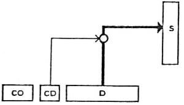

Fig. 26. Direccionamiento normal

### 

### 

### Direccionamiento Indirecto:

La parte de dirección de la instrucción contiene, no la dirección de la información pedida, sino la dirección de una palabra de memoria donde se encontrará la dirección efectiva de la información. Por tanto, la localización de un operando direccionado indirectamente exigirá dos ciclos de memoria: un ciclo para buscar la dirección efectiva, otro ciclo para buscar el contenido del operando. Su ventaja es que permite ampliar el espacio de direcciones con respecto al direccionamiento directo.


Fig. 27. Direccionamiento indirecto

### 

### 

### Direccionamiento Relativo:

La dirección relativa no indica la posición de la información en la memoria en valor absoluto, sino que la sitúa en relación a una dirección de referencia. Esta, a su vez, está almacenada en un registro frecuentemente llamado registro de traslación. La dirección efectiva se obtendrá sumando la dirección relativa con la dirección de referencia. Las técnicas de direccionamiento relativo se emplean especialmente cuando la longitud de la palabra de memoria es insuficiente para permitir direccionar a toda la memoria.

#### Direccionamiento por base y desplazamiento: 

Un registro de la máquina, llamado registro de base, contiene la dirección de referencia (primera dirección de un programa o de una zona de datos, por ejemplo). A la información que alberga la parte de dirección se le llama desplazamiento. La dirección es la suma de la base y del desplazamiento. Algunos calculadores admiten varios registros de base. La instrucción debe especificar entonces la dirección de registro de base escogido.


Fig. 28. Direccionamiento por base y desplazamiento

#### Direccionamiento por Referencia al Programa: 

El contenido del contador de programa sirve de dirección de referencia. Con este sistema es posible generalmente direccionar dos zonas de memoria a un lado y a otro de la instrucción en curso, según que la parte de dirección se sume o se reste con el contenido del contador.


Fig. 29. Direccionamiento por referencia al programa

#### Direccionamiento por Página (o por Yuxtaposición): 

Se considera a la memoria dividida en zonas de 2<sup>n</sup> palabras llamadas páginas. En general la parte de dirección de la instrucción contiene n bits, por lo que no capacita a la máquina para direccionar más palabras que las que tiene una página. La dirección efectiva se obtendrá por yuxtaposición del número de página (o dirección de página), supuesto conocido y de la parte de dirección de la instrucción, que suministra la dirección dentro de la página.

Las condiciones de direccionamiento, en la mayoría de los pequeños ordenadores organizados por páginas, poseen un BIT de direccionamiento que, según su valor, implica el direccionamiento absoluto, es decir dentro de la página cero, o el direccionamiento dentro de la página de la instrucción en curso por yuxtaposición de los bits de mayor peso del contador de programa y de la dirección dentro de la página. En este caso, el direccionamiento por yuxtaposición puede ser considerado como un direccionamiento por referencia al principio de la página en curso.

<span id="anchor"></span>

Fig. 30. Dirección en la página cero o en la página de la instrucción

### 

### Direccionamiento Indexado:

Se obtiene la dirección efectiva sumando a la parte de dirección de la instrucción el contenido de un registro de la unidad central llamado registro índice; a menudo se llama índice al contenido. El registro de índice admite un cierto número de operaciones, como carga, lectura, incremento o decremento en 1, comparación. El programador lo utiliza para tratar, mediante una sola instrucción en un bucle de programa, datos almacenados vectorialmente en células sucesivas de la memoria. El direccionamiento correspondiente es indexado, lo que quiere decir que la dirección especificada en la instrucción es la primera célula del vector y a ella se suma el valor del índice, inicialmente puesto a cero e incrementado en 1 cada vez que se ejecute la instrucción de fin de bucle. Esta última compara el índice con el número de elementos del vector y origina un salto al principio del bucle mientras quede algún elemento por procesar.

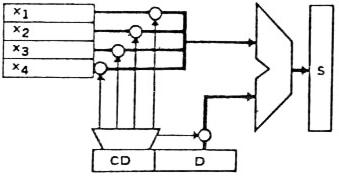

Fig. 31. Indexación

En algunos calculadores el índice se inicializa en (n-1), donde n representa el número de elementos del vector, la dirección especificada en la instrucción es la última del vector, el índice se incrementa en 1 a cada pasada y se sale del bucle cuando el índice es cero. Otras máquinas poseen dos registros por índice, uno contiene el índice, el otro contiene el valor máximo de este índice, ambos resultan comparados al momento de la instrucción de fin de bucle y se origina un salto al principio del mismo mientras no se produzca coincidencia entre los dos valores.

Combinación de los diferentes tipos de direccionamiento.

Es posible combinar, dentro de los límites impuestos por la concepción de la máquina o por el simple sentido común, los diversos tipos de direccionamiento.


Fig. 32. Lógica de direccionamiento relativo con indexación

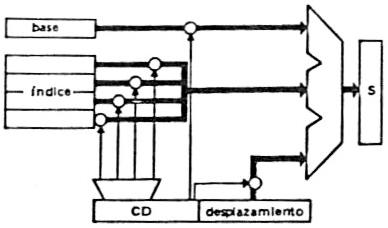

Fig. 33. Sumador de direcciones con 3 entradas

### 

### 

### Relación entre los tipos de direccionamiento

#### 

#### Pre-indexación y Post-indexación

Se denomina pre-indexación al direccionamiento por suma desplazamiento, y post-indexación al direccionamiento por suma del índice.

#### Combinación de los diferentes tipos de direccionamiento

Es posible combinar, dentro de los límites impuestos por la concepción de la máquina y por el sentido común, los diversos tipos de direccionamiento. Véase la siguiente figura:


Fig. 34. Lógica del direccionamiento relativo con indexación

Las máquinas potentes con pre- y post-indexación, efectúan el cálculo de direcciones en un sumador de direcciones con tres entradas.


Fig. 35. Sumador de direcciones con tres entradas

Si se combinan pre-indexación, post-indexación y direccionamiento indirecto es preciso establecer una norma de prioridad entre los tres tipos de direccionamiento. Generalmente se acepta el orden que permite direccionar, por medio de una sola instrucción, un elemento de un vector cuya dirección del primer elemento del vector se encuentra en una célula de memoria, cuya dirección es definida relativamente al contenido de un registro base:

1)  Pre-indexación, es decir, se obtiene en primer lugar la dirección absoluta de la célula de memoria que contiene la dirección del primer elemento del vector:

Base + Desplazamiento

2)  Direccionamiento indirecto, es decir, la célula de memoria hallada anteriormente será el nuevo desplazamiento, pudiendo ahora encontrar la célula de memoria del primer elemento del vector:

(Base + Desplazamiento)

3)  Post-indexación, para obtener la dirección del elemento buscado dentro del vector, puesto que el registro de índice tendrá el número de orden elemento en el vector:

Dirección efectiva = (Base + Desplazamiento) + índice

Algunas máquinas con direccionamiento indirecto en cascada permiten también una eventual indexación por cada nivel de indirección, basándose en los indicadores de indirección e indexación repetidos en las palabras que albergan las sucesivas direcciones

#### 

#### Resumen sobre tipos de direccionamiento

|  |  |
|----|----|
| Operando inmediato | Operando = (D) |
| Direccionamiento normal (directo y absoluto) | Dirección efectiva = (D) |
| Direccionamiento indirecto | Dirección efectiva = ((D)) |
| Direccionamiento relativo |  |
| \- base y desplazamiento (pre-indexación) | Dirección efectiva = (B) + (D) |
| \- por referencia la programa | Dirección efectiva = (P) ± (D) |
| \- en la página de la instrucción | Dirección efectiva = dirección de página + (D) |
| Direccionamiento indexado (post-indexación) | Dirección efectiva = (D) + (X) |

## FORMATO Y CLASIFICACIÓN DE LAS INSTRUCCIONES

Un formato de instrucciones define la descripción en bits de una instrucción, en términos de las distintas partes que la componen. Un formato de instrucciones debe incluir un código de operación e, implícita o explícitamente, ningún o algunos operandos. Cada operando implícito se referencia utilizando uno de los modos de direccionamiento estudiados. El formato debe, implícita o explícitamente, indicar el modo de direccionamiento para cada operando. En la mayoría de los repertorios de instrucciones se emplea más de un formato de instrucción.

### 

### Longitud de instrucción

El aspecto más básico a considerar en el formato de instrucción es la longitud de la instrucción. Este aspecto afecta, y se ve afectado, por el tamaño de la memoria, su organización, la estructura de buses, complejidad de la CPU y velocidad de la CPU. En la medida que se contemplen más códigos de operación y más operandos en la instrucción, se hará más fácil el trabajo del programador, logrando programas más cortos que realicen las mismas tareas. Por otra parte, disponer de más modos de direccionamiento dará más flexibilidad al programador para implementar ciertas funciones, tales como la gestión de tablas y las bifurcaciones multi-rama.

Además de poder direccionar rangos de memoria grandes. Todo esto requiere bits, resultando en instrucciones de longitud cada vez más largas. Además debe cumplirse que el tamaño de la instrucción sea igual al tamaño de las transferencias a memoria (en un sistema basado en un bus, igual al tamaño del bus de datos), o que uno fuera múltiplo del otro. De no ser así, no conseguiremos un número entero de instrucciones durante un ciclo de búsqueda de la instrucción. Otra consideración a tener en cuenta es la velocidad de la memoria.

Esta no es tan rápida como la velocidad de la CPU, y puede convertirse en un cuello de botella si el procesador puede ejecutar las instrucciones más rápido de lo que puede captarlas. Una solución a esto es utilizar memoria caché, otra es utilizar instrucciones más cortas. Otro punto a tener en cuenta es que la longitud de la instrucción debiera ser un múltiplo de la longitud de un carácter, que normalmente es de 8 bits, y de la longitud de los números en punto fijo.

### 

### 

### Asignación de los bits

Otro aspecto a considerar es como asignar los bits en un formato de instrucción determinado. Para una longitud de instrucción dada, existe un compromiso entre el número de códigos de operación y la capacidad de direccionamiento. Cuanto mayor sea el número de códigos de operación, mayor cantidad de bits para el campo CO, por ende, menor cantidad de bits para el direccionamiento de los operandos.

Existe un refinamiento interesante que es el uso de códigos de operación de longitud variable. De modo que existe una longitud mínima de CO, pero, para algunos códigos, se pueden especificar operaciones adicionales utilizando más bits de la instrucción. Los siguientes factores, relacionados entre sí, afectan a la definición del uso dado a los bits de direccionamiento.

- *Número de modos de direccionamiento*: en algunos casos, un modo de direccionamiento puede indicarse de manera explícita, en otros casos, debe hacerlo de forma explícita, de modo que se necesitará uno o más bits de modo.

- *Número de operandos*: la cantidad de operandos que puede ser direccionada por una sola instrucción afecta significativamente el número de bits asignado a direccionamiento, asimismo, si una instrucción puede direccionar dos operandos, estos podrían tener un modo de direccionamiento distinto, debiendo quizás expresar ambos explícitamente o uno de ellos en forma implícita.

- *Registros frente a memoria*: una máquina debe disponer de registros para traer los datos a la CPU a fin de procesarlos. Cuanto más registros tenga, más fácil será la programación y, considerando un número entre 8 y 32 registros como aceptable, solo se necesita una cantidad mínima de bits para direccionarlos.

- *Número de conjunto de registros*: Si en lugar de tener un banco de registros de 16 registros, por ejemplo, se divide en 2 o más bancos, esta partición requiere menos bits de la instrucción. Por ejemplo, con dos conjuntos de 8 registros, solo se necesitan 3 bits para identificar un registro, el código de operación determina de forma implícita que conjunto de registro se está referenciando.
- *Rango de direcciones*: El rango de direcciones que puede utilizarse está relacionado con el número de bits de direccionamiento. Dado que esto impone una limitación severa, raramente se emplea direccionamiento directo.

- *Granularidad de las direcciones*: Para direcciones que hacen referencia a memoria, en un sistema con palabras de 16 o 32 bits, una dirección puede referenciar una palabra o un byte, según elija el diseñador. Un direccionamiento por bytes permite manipular caracteres, pero requiere de más bits de direcciones.

### 

### 

### Clasificación de las Instrucciones

En general, las instrucciones de cualquier tipo de ordenador se clasifican en los siguientes tipos, según el trabajo que realicen:

1)  Instrucciones aritméticas. Realizan las operaciones de tipo aritmético que admite el procesador, ejemplo Suma.

2)  Instrucciones lógicas. Efectúan operaciones de tipo lógico, por ej. AND.

3)  Instrucciones de lectura y escritura de memoria. Se encargan de trasladar datos a/o desde las diferentes posiciones de memoria hasta cualquier registro de trabajo del ordenador.

4)  Instrucciones de bifurcación. Sirven para efectuar roturas en las secuencias del programa y son capaces de modificar el contenido del Contador de Programa. La bifurcación puede ser condicional o incondicional.

5)  Instrucciones de salto a subrutina y retorno. Se rompe la secuencia del programa accediendo a zonas de programa repetitivas (subrutinas). También se modifica el Contador de Programa. En este caso, el valor del Cont. de Programa se almacena en memoria a fin de retornar al programa principal una vez concluida la subrutina.

6)  Instrucciones de transferencia entre registros. Sirven para intercambiar los contenidos de los registros de trabajo de la CPU. Dentro de este grupo se encuentra también las instrucciones que producen desplazamientos y rotaciones de los bits de los registros hacia ambos lados.

7)  Instrucciones especiales. Instrucciones que originan la entrada o salida de los datos, instrucción de “paro” para detener el programa, de “no operar”, consume un tiempo sin producir ninguna variación y otras instrucciones específicas.

### Ejemplos

En un primer lugar vamos a definir una serie de formatos conceptuales, esto son:

Forma general de una instrucción

|     |           |
|-----|-----------|
| CO  | Dirección |

Máquina de 4 direcciones

|  |  |  |  |  |
|----|----|----|----|----|
| CO | Dirección 1<sup>er</sup> Operando | Dirección 2º Operando | Dirección resultado | Dirección próxima instr. |

Máquina de 3 direcciones

|  |  |  |  |
|----|----|----|----|
| CO | Dirección 1<sup>er</sup> Operando | Dirección 2º Operando | Dirección resultado |

Máquina de 2 direcciones

|     |                                   |                       |
|-----|-----------------------------------|-----------------------|
| CO  | Dirección 1<sup>er</sup> Operando | Dirección 2º Operando |

A fin de dar una comprensión acabada de los distintos formatos de instrucción utilizaremos el ejemplo de SuperAbacus. Para esto vamos a describir la conformación de SuperAbacus: posee un conjunto de registros banalizados, utilizables como registros aritméticos o, según las condiciones de direccionamiento, como registros de base o de índice. Todos los cálculos se realizan en un solo sumador, que actúa como ALU y de unidad de cálculo de direcciones. No posee contador ordinal, el registro R0 actuará como tal y su incremento se consigue por transferencia vía el sumador. Es de destacar que el ciclo de memoria es de 4 impulsos de reloj. El esquema de SuperAbacus se observa en la siguiente figura.

#### 

#### Primer ejemplo de instrucción y direccionamiento:

SuperAbacus tendrá una palabra de 24 bits con el siguiente formato:

<table>
<tbody>
<tr>
<td>0</td>
<td></td>
<td></td>
<td></td>
<td>4</td>
<td>5</td>
<td>6</td>
<td>7</td>
<td> 8</td>
<td></td>
<td>10</td>
<td> 11</td>
<td></td>
<td></td>
<td>14</td>
<td> 15</td>
<td></td>
<td></td>
<td></td>
<td></td>
<td></td>
<td></td>
<td></td>
<td>23</td>
</tr>
<tr>
<td colspan="5">CO</td>
<td>I</td>
<td colspan="2">CD</td>
<td colspan="3">X</td>
<td colspan="4">R</td>
<td colspan="9">D</td>
</tr>
</tbody>
</table>

<table>
<tbody>
<tr>
<td>CO</td>
<td>5 bits</td>
<td colspan="5">Código de operación, capaz para 32 instrucciones</td>
</tr>
<tr>
<td>I</td>
<td>1 bit</td>
<td colspan="5">I = 0 : direccionamiento directo, I = 1 : direccionamiento indirecto (un nivel)</td>
</tr>
<tr>
<td>CD</td>
<td>2 bits</td>
<td colspan="4"><p>CD = 00 : direccionamiento inmediato</p>
<p>CD = 01 : direccionamiento absoluto de las 512 primeras palabras </p></td>
<td></td>
</tr>
<tr>
<td></td>
<td></td>
<td><p>CD = 10 </p>
<p>CD = 11 </p></td>
<td>} </td>
<td>direccionamiento relativo por referencia al contador de programa</td>
<td>{</td>
<td><p>(R0)-(D)</p>
<p>(R0)+(D)</p></td>
</tr>
<tr>
<td>X</td>
<td>3 bits</td>
<td colspan="5">Direccionamiento indexado. Si X = 000: no indexado, sino, X indica la dirección de uno de lo registros R1 a R7, que tendrá que usarse como registro índice.</td>
</tr>
<tr>
<td>R</td>
<td>4 bits</td>
<td colspan="5">Direcciona el registro aritmético: capaz de direccionar los registro R0 a R15</td>
</tr>
<tr>
<td>D</td>
<td>9 bits</td>
<td colspan="5">Elemento de la dirección en memoria, capaz de direccionar una zona de 512 palabras, cuya posición depende de las condiciones de direccionamiento.</td>
</tr>
</tbody>
</table>

Las operaciones se ejecutan sobre un operando albergado en un registro y un operando tomado de la memoria, y el resultado ocupa el lugar del operando del registro. Por ejemplo, SUM R4 M suma los contenidos de la célula de memoria direccionada por M y del registro R4 y envía el resultado a R4.


Ejemplo de instrucción de suma con direccionamiento relativo e indexación:

<table>
<tbody>
<tr>
<td>0</td>
<td></td>
<td></td>
<td></td>
<td>4</td>
<td>5</td>
<td>6</td>
<td>7</td>
<td> 8</td>
<td></td>
<td>10</td>
<td> 11</td>
<td></td>
<td></td>
<td>14</td>
<td> 15</td>
<td></td>
<td></td>
<td></td>
<td></td>
<td></td>
<td></td>
<td></td>
<td>23</td>
</tr>
<tr>
<td colspan="5">SUM</td>
<td>0</td>
<td colspan="2">1 0</td>
<td colspan="3">0 1 1</td>
<td colspan="4">0 1 0 0</td>
<td colspan="9">D</td>
</tr>
<tr>
<td colspan="5"></td>
<td></td>
<td colspan="2"></td>
<td colspan="3">X = 3</td>
<td colspan="4">R = 4</td>
<td colspan="9"></td>
</tr>
<tr>
<td colspan="5"></td>
<td></td>
<td colspan="2"></td>
<td colspan="16">Direccionamiento relativo por referencia anterior a R0</td>
</tr>
<tr>
<td colspan="5"></td>
<td></td>
<td colspan="2"></td>
<td colspan="16">Direccionamiento directo</td>
</tr>
</tbody>
</table>

#### Segundo ejemplo de instrucción y direccionamiento:

SuperAbacus tendrá una palabra de 32 bits con el siguiente formato:

<table>
<tbody>
<tr>
<td>0</td>
<td></td>
<td></td>
<td></td>
<td>4</td>
<td>5</td>
<td>6</td>
<td></td>
<td></td>
<td>9</td>
<td> 10</td>
<td></td>
<td></td>
<td>13</td>
<td> 14</td>
<td></td>
<td></td>
<td>17</td>
<td> 18</td>
<td></td>
<td></td>
<td></td>
<td></td>
<td></td>
<td></td>
<td></td>
<td></td>
<td></td>
<td></td>
<td></td>
<td></td>
<td>31</td>
</tr>
<tr>
<td colspan="5">CO</td>
<td>I</td>
<td colspan="4">X</td>
<td colspan="4">R</td>
<td colspan="4">B</td>
<td colspan="14">desplazamiento</td>
</tr>
</tbody>
</table>

|  |  |  |
|----|----|----|
| CO | 5 bits | Código de operación, capaz para 32 instrucciones |
| I | 1 bit | I = 0 : direccionamiento directo, I = 1 : direccionamiento indirecto (un nivel) |
| X | 4 bits | Direccionamiento indexado. Si X = 0000: no indexado, sino, X indica la dirección de uno de lo registros R1 a R15, que tendrá que usarse como registro índice. |
| R | 4 bits | Contiene el registro con el primer operando. |
| B | 4 bits | Direcciona el registro de base a considerar, si B=0000 se tiene automáticamente direccionamiento relativo por referencia al contador de programa, puesto que se toma a este como base. |
| Desp | 14 bits | Capaz de direccionar una zona de 2<sup>14 </sup>= 16K palabras a partir de un registro base. |

## SECUENCIAMIENTO DE LA INSTRUCCIONES

### Concepto de Secuenciador Central

El secuenciador central de un ordenador es el órgano que genera las microórdenes, que son distribuidas a lo largo de la ruta de datos para activarla y gobernar sus diversos elementos constituyentes.

### Entradas y Salidas del Secuenciador.

Las Informaciones de salida del secuenciador son las microórdenes que deben distribuirse por la ruta de datos según cronogramas precisos a causa de los tiempos de respuesta de los órganos gobernados. Las informaciones de entrada al secuenciador son suministradas, de una parte, por la instrucción (código de operación, condiciones de direccionamiento y las direcciones de registros), de otra parte, por el estado de la máquina, que agrupa un cierto número de informaciones (indicadores de error, demandas de interrupción, indicadores del estado de la memoria y de las unidades funcionales, etc.).


Fig. Entorno de un secuenciador

### Calculadores Síncronos a Asíncronos

El secuenciamiento de las microórdenes en el tiempo puede llevarse a cabo de dos maneras distintas:

*Ordenador Síncrono:* el secuenciador conoce los tiempos de respuesta de los diferentes órganos gobernados. Entonces hace intervenir los retardos apropiados entre las diferentes órdenes sucesivas de manera que tengan tiempo de ejecutarse las operaciones.

*Ordenador Asíncrono:* el secuenciador recibe de los diferentes órganos del calculador señales indicando que han terminado las operaciones indicadas y que se liberan, aquel puede eventualmente comprobar su estado. No lanzará una nueva operación más que después de haber quedado advertido de que las operaciones precedentes han sido ejecutadas completamente y de haberse asegurado que el órgano que debe realizarla está libre.

### 

### Secuenciadores Cableados y Secuenciadores Microprogramados

Secuenciadores Cableados: realizados en forma de circuito secuencial electrónico.

Secuenciadores Microprogramados: corresponden a la introducción en la UC de una memoria con un pequeño programa llamado microprograma para cada instrucción.

### 

### Secuenciadores de Lógica Cableada

Principio del Secuenciamiento:

El Objetivo es generar microórdenes distanciadas en el tiempo por retardos apropiados, Una cadena de retardos permite, en el plano teórico, realizar esta función. Por ejemplo, el inicio de la instrucción de almacenamiento en Abacus, suponiendo que la dirección de la instrucción se encuentre sobre el bus S será efectuado por la cadena de retardos, muy esquemáticamente indicada a continuación:


Fig. Búsqueda en memoria (solución síncrona)

### El Distribuidor de Fases

En la mayoría de los casos se sincronizan las distintas microórdenes con señales temporales regularmente espaciadas, provenientes de un mismo reloj. A cada impulso de reloj debe ser generado un cierto número de microórdenes.

Al ser idénticas todas las señales de reloj, es preciso dar al secuenciador los medios para situarse por referencia al tiempo, por ejemplo, para saber en que fase del ciclo de la instrucción se encuentra; en ésta la función del distribuidor de fases, que partiendo de los impulsos periódicos del reloj, produce señales de impulso o de nivel acordes a las diferentes fases del ciclo de memoria o de la instrucción.


Fig. Distribuidor de fases

En un instante determinado, solamente uno de los biestables B<sub>0</sub>, B<sub>1</sub>, B<sub>2</sub>, B<sub>3</sub> está posicionado a 1. El próximo impulso de reloj devolverá este biestable a cero y posicionará el siguiente biestable a 1. Los niveles lógicos Θ<sub>0</sub>, Θ<sub>1</sub>, Θ<sub>2</sub>, Θ<sub>3</sub>, serán ciertos uno a continuación del otro, pero solo uno en un momento dado. Los impulsos θ<sub>0</sub>, θ<sub>1</sub>, θ<sub>2</sub>, θ<sub>3</sub>, sincronizados con las señales de reloj, se producirán cada cuatro batidos. Suponiendo que el tiempo de basculamiento de los biestables sea igual a la anchura del impulso de reloj, se obtiene el cronograma de base siguiente:


Fig. Cronograma de un distribuidor de fases

En el caso de Abacus, en el que el ciclo de memoria equivale a dos batidas de reloj, resultará cómodo emplear un distribuidor de dos fases (respectivamente lectura y escritura).

### 

### Decodificación de la Instrucción

La instrucción consta de diferentes campos de información de interés para el secuenciador, como son el código de operación, las condiciones de direccionamiento, la dirección de registros o de unidades periféricas, etc. El decodificador de instrucción se encarga de realizar esta decodificación.

Puede utilizarse una matriz de diodos o de transistores. Por ejemplo, para Abacus, dotado de las operaciones indicadas en la siguiente tabla y capaz de direccionamiento indirecto, se necesitaría el decodificador de la siguiente figura:

Nombre Nemotécnico Código Operación Efecto de la instrucción

PAC 000 Puesta a cero del acumulador

SUM 001 Suma con el acumulador

SUS 010 Sustracción del acumulador

AND 011 Intersección con el acumulador

OR 100 Reunión con el acumulador

ALM 101 Almacenamiento del acumulador

SAI 110 Salto incondicional

SAP 111 Salto si (AC)\>=0

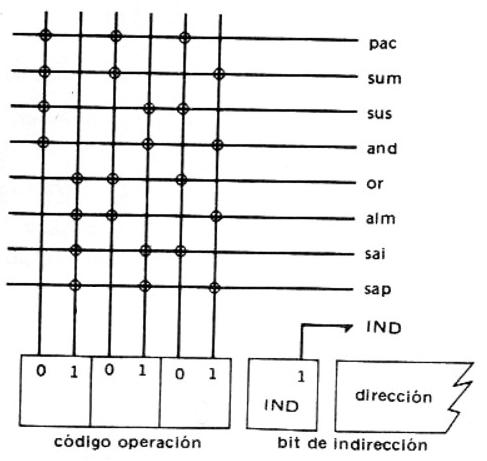

Fig. Decodificador del código de operación de Abacus

Se observa en este esquema que la decodificación puede ser considerada prácticamente instantánea y las señales salidas de la matriz permanecen posicionadas todo el tiempo que la instrucción correspondiente se encuentra en el registro de instrucción.

### 

### 

### Biestables de Estado

Se define al estado del calculador por el contenido de un cierto número de biestables, llamados biestables de estado. Los hay de dos clases:

Los primeros memorizan lo que hemos denominado el estado de la máquina. Son posicionados por las instrucciones y los resultados de operaciones, o también por acontecimientos exteriores, petición de ciclo de memoria, interrupción, etc.

Sus salidas figuran entre las informaciones de entrada al secuenciador. Los segundos constituyen parte integrante del secuenciador.

Es éste quien los posiciona y quien utiliza su salida. Esencialmente sirven de marcas temporales. En cierto modo, los biestables del distribuidor de fases podrían incluirse dentro de esta categoría.

Abacus consta de los cuatro biestables representados en la siguiente figura:

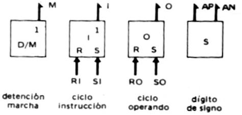

Fig. Biestables de estado de Abacus

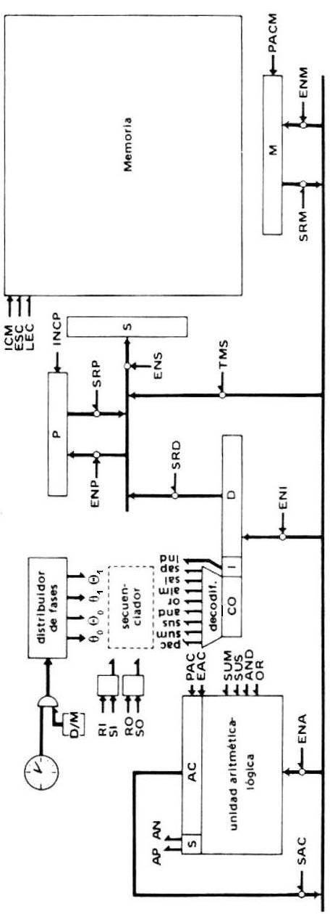

### Funcionamiento De La Unidad De Control

Para especificar la funcionalidad de una CPU es necesario el conocimiento de los siguientes conceptos:

1.  Operaciones (códigos de operación)
2.  Modos de direccionamiento
3.  Registros
4.  Interfaz con el módulo de E/S
5.  Interfaz con el módulo de memoria
6.  Estructura del procesamiento de interrupciones.

Estos puntos determinan lo que debe hacer una CPU. Los distintos elementos de la CPU que proporcionan esta funcionalidad están gobernados por la UC (unidad de control). Estudiando su funcionamiento se determina como se llevan a cabo estas funciones.

### 

### Microoperaciones

La función de un computador es ejecutar programas, la ejecución de un programa consiste en la ejecución secuencial de instrucciones. Cada instrucción se ejecuta durante un ciclo de instrucción compuesto de subciclos más cortos (por ejemplo, subciclo de captación, indirecto, de ejecución, de interrupción). La ejecución de cada subciclo involucra una o más operaciones elementales, es decir, microoperaciones. Las microoperaciones son las operaciones funcionales, o atómicas, de una CPU.

#### Ciclo de Captación o Fase de Búsqueda de la Instrucción

Tomando de ejemplo la instrucción de suma, analizamos el comportamiento de la CPU. Suponemos que la dirección de la siguiente instrucción se encuentra en el registro P (contador de programa). Lo siguiente será llevar esta dirección al registro S (de selección de memoria). Una vez que la dirección se encuentra en el registro S, el contenido de la célula de memoria direccionada por S pasa al registro M (de palabra de memoria).

En resumen sería:

\(P\) → S SRP, ENS, ICM, PACM

((S)) → M LEC

\(P\) → S es la *microoperación* que indica que el contenido del registro P pasa al reg. S.

((S)) → M es la *microoperación* que indica que el contenido de la memoria direccionado por S pasa al registro M.

Las órdenes SRP (salida del registro P), ENS (entrada al registro S), ICM (inicio de ciclo de memoria), PACM (puesta a cero del registro M) y LEC (lectura de memoria) son señales de impulsos o de nivel empleadas para gobernar las distintas operaciones en el desarrollo de una instrucción. Se las denomina señales de control, señales de gobierno o microórdenes. Es de destacar que la microoperación P → (P) + 1 es factible de realizar simultáneamente con la microoperación ((S)) → M ya que estas dos no interfieren entre sí y, además, permite un ahorro de tiempo, sin afectar el funcionamiento.

Si la instrucción por ejecutar sería un salto, el incremento de P no afectaría el desarrollo de la instrucción, pero si lo dejamos para el final, y la condición de salto resultara negativa, agregaría una unidad de tiempo más para su ejecución. Ahora bien, considerando el ejemplo de Abacus, con un distribuidor de fases de dos fases, los instantes de ejecución de cada microoperación serían:

t<sub>0</sub>: (P) → S

t<sub>1</sub>: ((S)) → M

t<sub>1</sub>: P → (P) + 1

#### Ciclo Indirecto o Fase de Búsqueda del Operando

Una vez que la instrucción se encuentra en M es transferida al registro I (de instrucción). Se analiza el código de operación y las condiciones de direccionamiento, luego el contenido del registro D (parte de dirección del registro I) se envía al registro S para localizar el operando en memoria. Paso siguiente, el contenido de la célula de memoria señalada por S pasa al registro M. En resumen sería:

\(M\) → I SRM, ENI

\(D\) → S SRD, ENS, ICM, PACM

((S)) → M LEC

Siguiendo la línea temporal, estas microoperaciones se ejecutarían en el siguiente orden:

t<sub>2</sub>: (M) → I

t<sub>3</sub>: (D) → S

t<sub>4</sub>: ((S)) → M

#### Ciclo de Ejecución de la Instrucción

Consiste en sumar el operando contenido en M con el contenido del registro Acumulador (AC):

\(M\) + (AC) → AC SRM, ENA, SUM, EAC

Siguiendo la línea temporal, estas microoperaciones se ejecutarían en el siguiente orden:

t<sub>5</sub>: (M) + (AC) → AC

#### Ciclo de Interrupción

Cuando termina el ciclo de ejecución, se realiza una comprobación para determinar si ha ocurrido alguna interrupción habilitada. Si es así, tiene lugar un ciclo de interrupción. La naturaleza de este ciclo varía mucho de una máquina a otra. Se observa aquí una secuencia muy simple de eventos:

t<sub>1</sub>: (P) → M

t<sub>2</sub>: Dirección de salvaguarda → S

Dirección de la rutina → P

t<sub>3</sub>: M → memoria

En el primer paso, el contenido de P se transfiere a M, de modo que pueda guardarse para el retorno de la interrupción. Entonces S se carga con la dirección en la cual va a guardarse el contenido de P, y P se cara con la dirección de comienzo de la rutina de procesamiento de interrupción.

Cada una de estas dos acciones puede ser una única microoperación. Sin embargo, ya que la mayoría de las CPUs. Tienen múltiples tipos y/o niveles de interrupciones, podrían hacer falta una o más microoperaciones adicionales para obtener la dirección de salvaguarda y la dirección de la rutina antes de que puedan transferirse a S y a P, respectivamente.

En todo caso, una vez hecho esto, el paso final es almacenar M, que contiene el antiguo valor de P, en la memoria. La CPU está entonces preparada para iniciar el siguiente ciclo de instrucción.

### Señales de Control o Microórdenes

Para que la unidad de control realice su tarea debe tener entradas que le permitan determinar el estado del sistema y salidas que le permitan controlar el comportamiento del mismo.

Como se ha indicado anteriormente, continuando con el ejemplo de Abacus, las entradas al secuenciador serán:

- Las señales del distribuidor de fases.

- Señal de los biestables que indican el subciclo que se está ejecutando (I-subciclo de búsqueda de la instrucción, O-subciclo de búsqueda del operando)

- Señal del biestable S que indica el signo del acumulador

- Código de operación y condiciones de direccionamiento del reg. de instrucción.

- Señales de control de bus de control, incluye interrupciones, de reconocimiento, etc. (no se contempla en el análisis a fin de facilitar el estudio del funcionamiento)

Las salidas del secuenciador serán:

- Señales de control que gobiernan la transferencia de datos, funciones específicas de la ALU, control de memoria y control de los módulos de entrada/salida.

Resumiendo, se podría decir que el objetivo del secuenciador es general las señales de control o microórdenes para gobernar el funcionamiento del computador. En la siguiente figura se observa un esquema general de lo descrito anteriormente.


Fig. Modelo de la Unidad de Control

### Generación de las Señales de Control

Para lograr diseñar los circuitos que generan estas señales se deben seguir dos pasos:

1.  Trazar los cronogramas deseados para cada instrucción del conjunto de instrucciones que admite la CPU.

2.  Relacionar cada microórden que aparece en los cronogramas con los batidos del reloj del distribuidor de fases y con las distintas informaciones de entrada y de estado del secuenciador. Esto se denomina formular las ecuaciones lógicas de la máquina.

### Trazado de Cronogramas

A fin de lograr la realización de los cronogramas se deberá tener en cuenta los tiempos de respuesta de los diferentes operadores implicados en la ejecución de cada microoperación y de el se deducen las microórdenes a generar a cada batido de reloj. Para poder explicar la forma de realizar esta tarea tomaremos el ejemplo de Abacus, para el cual definimos lo siguiente:

Abacus está provisto:

1.  De un distribuidor de fases de dos fases
2.  De un decodificador de instrucciones descrito anteriormente.
3.  De los biestables de estado definidos anteriormente. Se supondrá que el funcionamiento del reloj está condicionado por la señal de detención-marcha, y que la puesta en marcha inicializa el distribuidor de fases.

Se observa a continuación los cronogramas de las diferentes instrucciones de abacus, partiendo del cronograma del secuenciador.


Fig. Cronograma del distribuidor de fases


<table>
<tbody>
<tr>
<td><p>Fig. Cronograma de puesta a cero del acumulador</p></td>
<td>Fig. Cronograma de las instrucciones de procesamiento</td>
</tr>
</tbody>
</table>

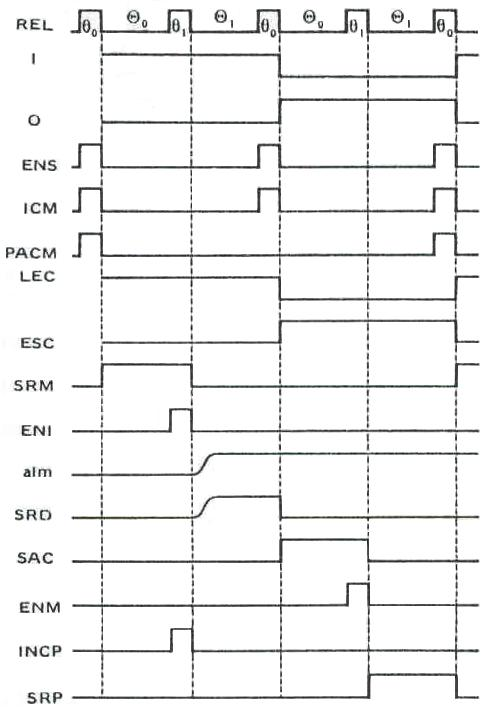

Fig. Cronograma del almacenamiento en memoria

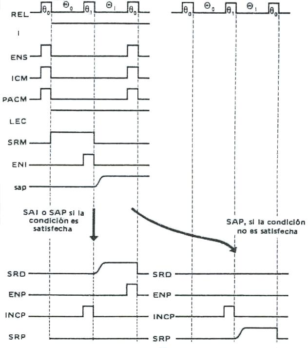

Fig. Cronograma de las instrucciones de salto

En cada uno de esto cronogramas hemos anotado la evolución de diversas informaciones de entrada en el secuenciador, de una cierta importancia para la instrucción en curso. Cada cronograma permite definir de forma analítica el comportamiento del secuenciador.

### Ecuaciones Lógicas

Un vez realizados todos los cronogramas, el paso siguiente consiste en, microórden por microórden, buscar todas las veces que debe ser activada y de ellas deducir la expresión lógica en relación con las informaciones de entrada y de estado del secuenciador. El conjunto de estas expresiones constituye las ecuaciones lógicas del ordenador.

Por ejemplo, analicemos la señal SRM:

- Todos los casos en que está activa en el intervalo <sub>0</sub> :

Cuando se trata de un ciclo de búsqueda de la instrucción, es decir I = 1, se escribe I . <sub>0 </sub> ;

Cuando se trata de un ciclo del operando para las instrucciones SUM, SUS, OR, AND, durante todo el tiempo que se efectúe la operación en la ALU, esto corresponde a <sub>0</sub> + <sub>1</sub> , O = 1. Se escribe O . (<sub>0</sub> + <sub>1</sub>) . (
``` math
{{{\text{sum} + \text{sus}} + \text{or}} + \text{and}}{}
```
)

Como (<sub>0</sub> + <sub>1</sub>) valdría siempre 1, no es necesario incluirlo en la ecuación, quedando esta de la siguiente manera: O . (
``` math
{{{\text{sum} + \text{sus}} + \text{or}} + \text{and}}{}
```
)

Hilando un poco más fino se observa que las instrucciones implicadas son todas aquellas que necesitan un ciclo de operando excepto
``` math
\text{alm}{}
```
, teniendo en cuenta esto, se puede rescribir la ecuación de la siguiente manera: O .
``` math
\overline{\text{alm}}{}
```

De esta manera logramos reducir a una expresión más simple.

- Todos los casos en que está activa en el intervalo <sub>1</sub>:

Cuando se presenta un direccionamiento indirecto, es decir la señal IND = 1, en este caso también se da que I = 0 y O = 0, se ecribe: IND . Ī . Ō . <sub>1</sub>

Analizado esto y considerando que son lo únicos casos en que se activará la señal SRM, es decir cuando se produzcan las microoperaciones (M) → I, (M) → ALU, (M) → S, la ecuación completa para esta señal será:

SRM = I . <sub>0 </sub> + O .
``` math
\overline{\text{alm}}{}
```
+ IND . Ī . Ō . <sub>1</sub>

De esta manera, microórden por microórden, podemos deducir las expresiones lógicas del ordenador. Además de las ecuaciones de las microórdenes, también serán necesarias las ecuaciones de entrada a los biestables de estado del secuenciador, los biestables I y O.

Por ejemplo:

I debe ser posicionado a 1 al final del ciclo del operando:

``` math
{\text{SI} = {\Theta_{0} \cdot O}}{}
```

I de ser puesto a cero al final del ciclo de búsqueda de la instrucción de aquellas instrucciones que necesitan ciclo de operando:

``` math
\left. {\text{RI} = {{\theta_{0} \cdot I} \cdot (}}{{{{\text{sum} + \text{sus}} + \text{or}} + \text{and}} + \text{alm}} \right){}
```

O debe ser puesto a 1 al final de un ciclo de instrucción cuando la instrucción a ejecutar es con operando y no es con direccionamiento indirecto, y luego de la búsqueda de la dirección del operando en una instrucción con direccionamiento indirecto:

``` math
{{\text{SO} = {{{\overline{\text{IND}} \cdot \theta_{0}} \cdot I} \cdot (}}{{{{\text{sum} + \text{sus}} + \text{or}} + \text{and}} + \text{alm}}{) + {{{\text{IND} \cdot \theta_{0}} \cdot \overline{I}} \cdot \overline{O}}}}{}
```

O debe ser puesto a cero al final del ciclo de operando:

``` math
{\text{RO} = {\theta_{0} \cdot O}}{}
```

A continuación se observan todas las ecuaciones para formar el secuenciador de Abacus:

|  |  |
|----|----|
| ENS | = 
``` math
\theta_{0}{}
``` |
| ICM | = 
``` math
\theta_{0}{}
``` |
| PACM | = 
``` math
\theta_{0}{}
``` |
| LEC | = 
``` math
\left. {{I + {O \cdot \overline{\text{alm}}}} + (}{\overline{I} \cdot \overline{O}} \right){}
``` |
| ESC | = 
``` math
{O \cdot \text{alm}}{}
``` |
| SRM | = I . <sub>0 </sub> + O . 
``` math
\overline{\text{alm}}{}
```
+ IND . <sub>1</sub> . (Ī . Ō) |
| TMS | = 
``` math
{{{\text{IND} \cdot \overline{I}} \cdot \overline{O}} \cdot \Theta_{1}}{}
``` |
| ENI | = 
``` math
{\theta_{1} \cdot I}{}
``` |
| SRD | = 
``` math
\left. {{\Theta_{1} \cdot I} \cdot (}{{{{{{\text{sum} + \text{sus}} + \text{and}} + \text{or}} + \text{alm}} + {\text{sap} \cdot \text{AP}}} + \text{sai}} \right){}
``` |
| SRP | = 
``` math
{{{\Theta_{1} \cdot I} \cdot (}{\text{pac} + {\text{sap} \cdot \text{AN}}}{) + {\Theta_{1} \cdot O}}}{}
``` |
| INCP | = 
``` math
{\theta_{1} \cdot I}{}
``` |
| ENP | = 
``` math
\left. {\theta_{0} \cdot (}{{\text{sap} \cdot \text{AP}} + \text{sai}} \right){}
``` |
| SUM | = 
``` math
{\text{sum} \cdot O}{}
``` |
| SUS | = 
``` math
{\text{sus} \cdot O}{}
``` |
| AND | = 
``` math
{\text{and} \cdot O}{}
``` |
| OR | = 
``` math
{\text{or} \cdot O}{}
``` |
| ENA | = 
``` math
{O \cdot \overline{\text{alm}}}{}
``` |
| EAC | = 
``` math
{{O \cdot \overline{\text{alm}}} \cdot \theta_{0}}{}
``` |
| PAC | = 
``` math
{\text{pac} \cdot \theta_{0}}{}
``` |
| SAC | = 
``` math
{{O \cdot \Theta_{0}} \cdot \text{alm}}{}
``` |
| ENM | = 
``` math
{{O \cdot \theta_{1}} \cdot \text{alm}}{}
``` |
| SI | = 
``` math
{\text{SI} = {\Theta_{0} \cdot O}}{}
``` |
| RI | = 
``` math
\left. {\text{RI} = {{\theta_{0} \cdot I} \cdot (}}{{{{\text{sum} + \text{sus}} + \text{or}} + \text{and}} + \text{alm}} \right){}
``` |
| SO | = 
``` math
{{\text{SO} = {{{\overline{\text{IND}} \cdot \theta_{0}} \cdot I} \cdot (}}{{{{\text{sum} + \text{sus}} + \text{or}} + \text{and}} + \text{alm}}{) + {{{\text{IND} \cdot \theta_{0}} \cdot \overline{I}} \cdot \overline{O}}}}{}
``` |
| RO | = 
``` math
{\text{RO} = {\theta_{0} \cdot O}}{}
``` |

El secuenciador de abacus será la materialización de sus biestables de estado y del circuito combinacional correspondiente a las ecuaciones lógicas. Es de destacar que el ordenador Abacus es una máquina simple con un conjunto de instrucciones reducido para facilitar su estudio.

En una compleja CPU moderna, el número de ecuaciones booleanas necesarias para definir la unidad de control es muy grande. La tarea de implementar un circuito combinacional que satisfaga todas esas ecuaciones llega a ser muy difícil.

El resultado es que, por regla general, se usa una aproximación mucho más sencilla, conocida como microprogramación.

### Secuenciamiento de los operadores aritméticos

En máquinas complejas, el control de los operadores aritméticos de funcionamiento secuencial está frecuentemente descentralizado y cada operador posee su órgano de control. En estos casos, el secuenciador general envía una orden especificando el tipo de operación a ejecutar y los batidos del reloj central, si el operador no tuviese uno propio.

El operador se encarga, entonces, del secuenciamiento de la operación aritmética.

Una vez terminada la operación, el operador envía al secuenciador central una señal de fin de operación. El secuenciador de un operador secuencial puede poseer su propio decodificador de órdenes, su contador de fase, sus biestables de estado e incluso su propio reloj.

#### 

#### Secuenciamiento de un operador de multiplicación por suma-desplazamiento

En la siguiente figura se observa en que entrono trabaja el secuenciador del operador. Este recibe del secuenciador general la orden de multiplicación y los batidos del reloj, a su vez, este secuenciador enviará al secuenciador general una señal de fin de operación (una vez finalizada la multiplicación), y al operador una orden de SUM de posicionamiento del sumador, la validación de la suma EAC y la orden de desplazamiento a derecha DESD. Del último biestable del multiplicador-cociente recibe una señal indicativa de su estado.


Fig. Entorno del secuenciador de multiplicación.

En la figura siguiente se representa al secuenciador. Este diseño se hace bajo las siguientes hipótesis:

- El sumador permanece activado mientras dure la multiplicación para ejecutar la adición de los contenidos del registro B y del acumulador.

- La duración máxima de la suma es de dos batidos de reloj.

- En ausencia de suma (MC0 = 0), se produce un desplazamiento a cada batido de reloj


El funcionamiento es el siguiente:

1)  La orden de inicio de multiplicación (MUL) carga el descontador de desplazamientos con una cantidad igual al número de dígitos de los operandos, posiciona el biestable Θ, el que estará en 1 durante toda la multiplicación, habilitando las puertas de entrada al sumador paralelo (SUM).
2)  Al primer batido de reloj siguiente al posicionamiento de Θ comienza la operación:

Si MC0 = 0, se produce un desplazamiento a derecha en el conjunto acumulador-MC y un decremento en el descontador.

Si MC0 = 1, se ejecuta la suma que dura dos batidos de reloj, antes de desplazar. Se memoriza el primer batido en el biestable Φ lo que permite validar, al segundo batido, el resultado de la suma EAC y reponer a cero el biestable MC0, con lo que se producirá, al tercer batido, el desplazamiento a derecha, el decremento del descontador y la puesta a cero de Φ.

3)  Se repite el paso 3 hasta que el descontador valga cero.

4)  Cuando el descontador vale cero, se genera un impulso que pone a cero Θ, y una señal al secuenciador central de fin de operación.

Este circuito posee tres biestables de estado: MC0, Θ y Φ, y un descontador de desplazamiento, que ejerce una función análoga al distribuidor de fases del secuenciador de un ordenador.

### 

### Secuenciadores Microprogramados

#### 

#### Microinstrucciones

El diseño de un secuenciador cableado para un ordenador complejo, como lo son los actuales, es una tarea muy difícil, además, el diseño es relativamente inflexible. Es difícil cambiar el diseño si se desea añadir una nueva instrucción máquina. La alternativa actual es un secuenciador microprogramado.

Si se consideramos las microoperaciones observaremos que están descriptas en notación simbólica. En realidad es un lenguaje conocido como lenguaje de microprogramación. Cada línea describe un conjunto de microoperaciones que suceden a la vez y se conoce como microinstrucción. Una secuencia de microinstrucciones se conoce como microprograma, o firmware. Este último término refleja el hecho de que un microprograma está a mitad de camino entre hardware y software. Es más fácil diseñar en firmware que en hardware, pero es más difícil escribir un programa firmware que un programa software.

Para usar el concepto de microprogramación en el diseño de un secuenciador debemos considerar que para cada microoperación, todo lo que la unidad de control puede hacer es generar un conjunto de señales de control, de modo que, para cualquier microoperación, cada línea de control procedente de la unidad de control está activa o inactiva. Esta condición puede representarse con un dígito binario para cada línea de control. De este modo, podríamos construir una palabra de control en la que cada bit representara una línea de control. Entonces, cada microoperación se representaría mediante un patrón diferente de 1s y 0s en la palabra de control. Supongamos que se ensarta una secuencia de palabras de control para representar la secuencia de microoperaciones ejecutadas por la unidad de control.

A continuación, hemos de admitir que la secuencia de microoperaciones no es fija. Algunas veces tenemos un ciclo indirecto; otras no. Por tanto, coloquemos nuestras palabras de control en una memoria, cada palabra en una dirección única. Añadamos ahora un campo de dirección a cada palabra de control, indicando la posición de la siguiente palabra de control a ejecutar si una determinada condición es cierta (por ejemplo, que el bit de direccionamiento indirecto de una instrucción que referencia a la memoria sea 1). Añadamos también algunos bits para especificar la condición.

El resultado se conoce como microinstrucción horizontal y se muestra en la figura siguiente. El formato de la microinstrucción o palabra de control es el siguiente. Hay un bit para cada línea de control interna a la CPU y un bit para cada línea de control del bus del sistema. Hay un campo de condición que indica la condición bajo la cual debe producirse un salto, y hay un campo con la dirección de la microinstrucción a ejecutar cuando el salto se produzca. Esta microinstrucción se interpreta como sigue:

1.  Para ejecutar la microinstrucción, se activan todas las líneas de control con el bit correspondiente a 1; y se dejan inactivas todas las líneas de control indicadas con un bit a 0. Las señales de control resultantes harán que se ejecuten una o más microoperaciones.

2.  Si la condición indicada por los bits de condición es falsa, se ejecuta la siguiente microinstrucción secuencial.

3.  Si la condición indicada por los bits de condición es cierta, la siguiente microinstrucción a ejecutar se indica en el campo de dirección.


La figura siguiente muestra como se pueden organizar estas palabras de control o microinstrucciones en una memoria de control. Las microinstrucciones de cada rutina se ejecutarán secuencialmente. Cada rutina termina con una instrucción de bifurcación o salto indicando a dónde ir a continuación.

Hay una rutina especial de ciclo de ejecución cuyo único objetivo es indicar que una de las rutinas de las instrucciones máquina (and, sum, etc.) se va a ejecutar a continuación, dependiendo del código de operación en curso.

La memoria de control de esta figura, es una descripción concisa de todo lo que hace la unidad de control. Define la secuencia de microoperaciones a realizar en cada ciclo (captación, indirecto, ejecución, interrupción), y especifica el secuenciamiento de estos ciclos. Si solo fuera eso, esta notación sería un recurso útil para documentar el funcionamiento de una unidad de control para un computador particular. Pero es más que eso. Es también una forma de implementar la unidad de Control.

#### Unidad de Control Microprogramada

La memoria de control de la figura siguiente contiene un programa que describe el funcionamiento de la unidad de control. Resulta que podríamos implementar la unidad de control sencillamente suministrando los mecanismos necesarios para la ejecución de ese programa.


Fig. Organización de la memoria de control

La figura siguiente muestra los elementos clave de esta implementación. El conjunto de microinstrucciones se almacena en la memoria de control. El registro de dirección de control contiene la dirección de la siguiente microinstrucción a leer. Cuando se lee una microinstrucción de la memoria de control, se transfiere al registro intermedio de control. La parte izquierda de ese registro se conecta a las líneas de control que salen de la unidad de control. De este modo, leer una microinstrucción de la memoria de control es lo mismo que ejecutar la microinstrucción. El tercer elemento que muestra la figura es una unidad de secuenciamiento que carga el registro de dirección de control y emite una orden de lectura.


Fig. Microarquitectura de la Unidad de Control

Examinando la estructura de la figura siguiente vemos la UC tiene las mismas entradas (reg. I, Indicadores de la ALU, reloj) que una UC cableada, y las mismas salidas (señales de control). La UC funciona como sigue:

1.  Para ejecutar una instrucción, la unidad lógica de secuenciamiento emite una orden de lectura a la memoria de control.

2.  La palabra cuya dirección se especifica en el registro de dirección de control se lee en el registro intermedio de control.

3.  El registro intermedio de control genera las señales de control y contiene además la información de dirección siguiente para la unidad lógica de secuenciamiento.

4.  La unidad lógica de secuenciamiento carga en el registro de dirección de control una nueva dirección, basada en la información siguiente del registro intermedio de control y en los indicadores de la ALU.

Todo esto sucede durante un pulso de reloj.

El último paso recién mencionado requiere cierta elaboración. Al final de la ejecución de cada microinstrucción, la unidad lógica de secuenciamiento cara una nueva dirección el registro de dirección de control.


Fig. Funcionamiento de la unidad de control microprogramada

Dependiendo del valor de los indicadores y del registro intermedio de control, se toma una de las tres siguientes decisiones:

- Captar la microinstrucción siguiente: se suma 1 al registro de dirección de control.

- Saltar a una nueva rutina según indica una microinstrucción de salto: El campo de dirección del registro intermedio de control se carga en el registro de dirección de control.

- Saltar a la rutina de una instrucción máquina: se carga el registro de dirección de control en función del código de operación almacenado en el registro I.

Se observa también en la figura dos módulos rotulados decodificador. El decodificador de arriba traduce el código de operación del registro I en una dirección de memoria de control.

El otro decodificador no se usa con microinstrucciones horizontales pero sí con microinstrucciones verticales. Como se mencionó, en una microinstrucción horizontal cada bit del campo de control corresponde a una línea de control.

En una microinstrucción vertical, se usa un código para cada acción a realizar, por ejemplo, (P) → S, y el decodificador traduce este código en señales de control individuales.

La ventaja de las microinstrucciones verticales es que son más compactas (ocupan menos bits) que las microinstrucciones horizontales, a costa de añadir una pequeña lógica y cierto retardo de tiempo.

#### Control de Wilkes

La configuración que propuso Wilkes se representa en la siguiente figura. El núcleo del sistema es una matriz parcialmente llena de diodos. Durante un ciclo máquina, se activa una fila de la matriz mediante un pulso. Esto produce señales en aquellos puntos en los que un diodo está presente (indicados mediante un punto en el diagrama). La primera parte de la fila genera las señales de control que gobiernan el funcionamiento de la CPU. La segunda parte genera la dirección de la fila que será seleccionada mediante un pulso en el siguiente ciclo máquina. Por tanto, cada fila de la matriz es una microinstrucción, y el trazado de la matriz es la memoria de control.

Al comienzo de un ciclo, la dirección de la fila a seleccionar está almacenada en el registro I. Esta dirección es la entrada del decodificador, el cual, cuando se activa mediante un pulso de reloj, selecciona una fila de la matriz. Dependiendo de las señales de control, durante el ciclo se pasa al registro II bien el código de operación almacenado en el registro de instrucción, o bien la segunda parte de la fila activada. El contenido del registro II se lleva entonces al registro I mediante un pulso de reloj. Se usan pulsos de reloj alternos para activar una fila de la matriz y para transferir el contenido del registro II al registro I. La configuración con dos registros es necesaria ya que el decodificador es sencillamente un circuito combinacional; con un solo registro, la salida se convertiría en entrada dentro del mismo ciclo, originando un estado inestable.

Este esquema es muy similar a la aproximación de microprogramación horizontal descrita anteriormente. La principal diferencia es ésta: en la descripción previa, el registro de dirección de control podía incrementarse en 1 para acceder a la siguiente dirección. En el esquema de Wilkes, la dirección siguiente está contenida en la microinstrucción.

Para permitir bifurcaciones, una fila debe contener dos partes de direcciones, controladas por una señal condicional (por ejemplo, un indicador), como muestra la figura.

Después de proponer este esquema, Wilkes proporciona un ejemplo de su utilización para implementar la unidad de control de una máquina sencilla. Este ejemplo, el primer diseño conocido de una CPU microprogramada, merece repetirse aquí porque ilustra muchos de los principios actuales de la microprogramación.

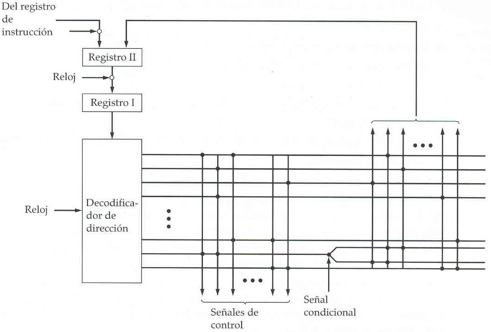

Fig. UC microprogramada de Wilkes

### 

### Secuenciamiento De Microinstrucciones

Las dos tareas básicas realizadas por una UC microprogramada son:

- El secuenciamiento de microinstrucciones: Obtener la siguiente microinstrucción de la memoria de control.
- La ejecución de microinstrucciones: Generar las señales de control necesarias para ejecutar la microinstrucción.

Al diseñar una UC, las dos tareas deben considerarse a la vez, ya que las dos afectan al formato de la microinstrucción y a la temporización de la UC.

#### 

#### Consideraciones de diseño

Hay dos cuestiones involucradas en el diseño de una técnica de secuenciamiento de microinstrucciones: el tamaño de la microinstrucción y el tiempo de generación de la dirección.

El primer asunto es evidente; minimizar el tamaño de la memoria de control reduce su costo. El segundo asunto es sencillamente un deseo de ejecutar las microinstrucciones tan rápido como sea posible.

Cuando se ejecuta un microprograma, la dirección de la siguiente microinstrucción a ejecutar está en una de estas situaciones:

- Determinada por el registro de instrucción
- Siguiente dirección secuencial
- Salto

La primera situación tiene lugar solo una vez por ciclo de instrucción, justo tras la captación de la instrucción. La segunda situación es la más común en la mayoría de los diseños.

No obstante, el diseño no se puede optimizar solo para los accesos secuenciales. Los saltos, tanto condicionales como incondicionales, son una parte necesaria del microprograma. Además, las secuencias de microinstrucciones tienden a ser cortas; una de cada tres o cuatro microinstrucciones podría ser un salto.

Por consiguiente, es importante diseñar técnicas compactas y eficientes en cuanto al tiempo para los saltos a microinstrucciones.

#### 

#### Técnicas de secuenciamiento

A partir de la microinstrucción en curso, de los indicadores de condición, y del contenido del registro de instrucción, hay que generar una dirección de la memoria de control para la siguiente microinstrucción.

Se ha usado una gran variedad de técnicas. Podemos agruparlas en tres categorías, como ilustran las figuras siguientes.

Estas categorías se basan en el formato de la información de dirección de la microinstrucción:

- Dos campos de dirección
- Un único campo de dirección
- Formato variable

La aproximación más simple es tener dos campos de dirección en cada microinstrucción. La figura indica como se va a usar esta información. Se tiene un multiplexor que sirve de destino de los dos campos de dirección y del registro de instrucción. Basándose en la entrada de selección de dirección, el multiplexor transmite el código de operación o una de las dos direcciones al registro de dirección de control. Este se decodifica a continuación para producir la dirección de la siguiente microinstrucción.

Las señales de selección de dirección son suministradas por un módulo de lógica de salto, cuyas entradas son los indicadores de la unidad de control y ciertos bits de la parte de control de la microinstrucción.


Fig. Lógica de control de salto, dos campos dirección

Aunque la aproximación de dos direcciones es sencilla, necesita más bits por microinstrucción que las otras técnicas. Con alguna lógica adicional, se puede conseguir algún ahorro. Una aproximación común es tener un único campo de dirección. Con este enfoque, las opciones para la dirección siguiente son:

- Campo de dirección
- Código del registro de instrucción
- Siguiente dirección secuencial

Las señales de selección de dirección determinan qué opción se escoge. Esta aproximación reduce el número de campos de dirección a uno. Observemos, sin embargo, que el campo de dirección a menudo no se usa Por tanto, hay alguna ineficiencia en este esquema de codificación.


Fig. Lógica de control de salto, un único campo de dirección

Otra aproximación es proporcionar dos formatos de microinstrucción totalmente diferentes. Un bit designa que formato se utilizará. En uno de los dos formatos, los demás bits se usan para activar señales de control. En el otro formato, algunos bits controlan el módulo de lógica de salto, y los bits restantes suministran la dirección. En el primer formato, la dirección siguiente es la siguiente dirección secuencial o una dirección derivada del registro de instrucción. En el segundo formato, se especifica un salto condicional o incondicional. Un inconveniente de esta aproximación, tal como se ha descrito, es que se consume un ciclo completo por cada microinstrucción de salto. Con las otras aproximaciones, la generación de la dirección sucede como parte del mismo ciclo en el que se generan las señales de control, con lo que se minimizan los accesos a la memoria de control.

Estas aproximaciones son generales. Las implementaciones específicas con frecuencia usarán una variación o una combinación de estas técnicas.


Fig. Lógica de control de salto, formato variable

#### Generación de la dirección

Otro punto de vista es considerar las diversas formas en que la siguiente dirección se puede obtener o calcular.

La siguiente tabla relaciona las diversas técnicas de generación de la dirección. Estas se pueden dividir en técnicas explícitas, en las que la dirección aparece explícitamente en la microinstrucción, y técnicas implícitas, que requieren lógica adicional para generar la dirección.

|                     |                  |
|---------------------|------------------|
| Explícitas          | Implícitas       |
| Dos Campos          | Traducción       |
| Salto incondicional | Adición          |
| Salto condicional   | Control residual |

Nos hemos ocupado esencialmente de las técnicas explícitas. Con una aproximación de dos campos, hay dos direcciones alternativas disponibles en cada microinstrucción.

Usando un único campo de dirección o un formato variable, se pueden implementar varias instrucciones de salto. Una instrucción de bifurcación condicional depende de los siguientes tipos de información:

- Indicadores de la ALU
- Parte del código de operación o campos de modo de direccionamiento de la instrucción máquina
- Partes de un registro seleccionado, tales como el bit de signo
- Bits de estado dentro de la UC.

También se usan frecuentemente varias técnicas implícitas. Una de ellas, la traducción, se necesita en casi todos los diseños. La parte de código de operación de una instrucción máquina se traduce a una dirección de microinstrucción.

Esto se presenta solo una vez por ciclo de instrucción. Una técnica implícita común combina o suma dos partes de una dirección parar formar la dirección completa.

### 

### 

### Ejecución De Microinstrucciones

El ciclo de microinstrucción es el evento básico de una CPU microprogramada. Cada ciclo se compone de dos partes: captación y ejecución. La parte de captación depende de la generación de una dirección de microinstrucción, como se vio en la sección precedente. Esta sección se ocupa de la ejecución de una microinstrucción.

Recordemos cuales son las consecuencias de la ejecución de una microinstrucción. Fundamentalmente, el resultado de la ejecución es la generación de señales de control. Algunas de estas señales controlan puntos internos de la CPU.

Las demás señales van al bus de control externo o a otras interfaces externas. Como función accesoria, se determina la dirección de la siguiente microinstrucción.

La descripción precedente sugiere la organización de una unidad de control que se muestra en la figura siguiente. Esta versión subraya el centro de atención de esta sección. Los principales módulos de este diagrama ya deben estar claros.

El módulo de lógica de secuenciamiento contiene la lógica que realiza las funciones estudiadas en la sección anterior. Genera la dirección de la siguiente microinstrucción, usando como entradas el registro de instrucción, los indicadores de la ALU, el registro de dirección de control (para incrementarlo), y el registro intermedio de control.

Este último puede proporcionar una dirección real, bits de control, o ambos. Este módulo está controlado por un reloj que determina la temporización del ciclo de instrucción.

El módulo de lógica de control genera las señales de control en función de algunos de los bits de la microinstrucción. Debe quedar claro que el formato y contenido de la microinstrucción determinará la complejidad del módulo de lógica de control.


Fig. Organización de la UC

#### 

#### Una taxonomía de las microinstrucciones

Las microinstrucciones se pueden clasificar de varias formas. Las distinciones que generalmente se hacen en la bibliografía incluyen:

- Vertical/horizontal
- Empaquetada/desempaquetada
- Microprogramación “hard”/”soft”
- Codificación directa/indirecta

Todas ellas se refieren al formato de la microinstrucción. Ninguno de estos términos se ha usado de una manera coherente y precisa en la bibliografía. No obstante, un examen de estas parejas de cualidades sirve para aclarar las alternativas de diseño de microinstrucciones.

En la propuesta original de Wilkes, cada bit de una microinstrucción producía directamente una señal de control o un bit de la dirección siguiente. Hemos visto que son posibles tanto esquemas de secuenciamiento de direcciones más complejos, como esquemas que usen menos bits por microinstrucción.

Estos esquemas requieren un módulo de lógica de secuenciamiento más complejo. Existe un tipo de compromiso semejante para la parte de la microinstrucción que atañe a las señales de control. Se pueden ahorrar bits de la palabra de control codificando la información de control, y decodificándola más tarde para producir las señales de control.

Para hacer esto consideremos que hay un total de K señales de control internas y externas diferentes que tiene que generar la UC. En el esquema de Wilkes, K bits de la microinstrucción se dedicarían a este propósito. Esto permite que se puedan generar las 2<sup>K</sup> combinaciones posibles de señales de control durante cualquier ciclo de instrucción.

Pero somos capaces de hacerlo mejor si observamos que no todas las combinaciones posibles se usarán. Por ejemplo:

- Dos fuentes no se pueden llevar al mismo destino
- Un registro no puede ser a la vez fuente y destino
- Solo un patrón de señales de control se puede presentar a la ALU cada vez
- Solo un patrón de señales de control se puede presentar al bus de control externo cada vez

De esta manera, para una CPU dada, puede hacerse una lista con todas las posibles combinaciones de señales de control admisibles, obteniendo un número de posibilidades Q\<2<sup>K</sup>, que podrían codificarse con log<sub>2</sub>Q bits, siendo (log<sub>2</sub>Q)\<K.

Esta sería la forma más estricta posible de codificación que preserva todas las combinaciones permisibles de señales de control. En la práctica, este sistema de codificación no se usa, por dos razones:

- Es tan difícil de programar como un esquema decodificado puro (como el de Wilkes).
- Requiere un módulo de lógica de control complejo y, por consiguiente, lento.

En lugar de eso, se adoptan algunos compromisos. Los hay de dos tipos:

- Se usan más bits de los estrictamente necesarios para codificar las posibles combinaciones.
- Algunas combinaciones que son físicamente permisibles no se pueden codificar.

El último tipo de compromiso tiene el efecto de reducir el número de bits. El resultado neto, sin embargo, es que se usan más bits que log<sub>2</sub>Q.

Visto lo dicho hasta aquí, podemos ver que el campo de señales de control del formato de microinstrucción se encuadra dentro de un espectro. En un extremo, hay un bit para cada señal de control, en el otro extremo, se usa un formato muy codificado. La tabla siguiente muestra otras características de una unidad de control microprogramada que también se encuadran dentro de espectros de posibilidades, y que en general depende del espectro del grado de codificación.

<table>
<tbody>
<tr>
<td colspan="2">Características</td>
</tr>
<tr>
<td>Microinstrucción no codificada</td>
<td>Microinstrucción muy codificada</td>
</tr>
<tr>
<td>Muchos bits</td>
<td>Pocos bits</td>
</tr>
<tr>
<td>Visión detallada del hardware</td>
<td>Visión global de hardware</td>
</tr>
<tr>
<td>Difícil de programar</td>
<td>Fácil de programar</td>
</tr>
<tr>
<td>Concurrencia explotada completamente</td>
<td>Concurrencia no explotada completamente</td>
</tr>
<tr>
<td>Poca o ninguna lógica de control</td>
<td>Lógica de control compleja</td>
</tr>
<tr>
<td>Ejecución rápida</td>
<td>Ejecución lenta</td>
</tr>
<tr>
<td>Optimización de las prestaciones</td>
<td>Optimización de la programación</td>
</tr>
</tbody>
</table>

<table>
<tbody>
<tr>
<td colspan="2">Terminología</td>
</tr>
<tr>
<td>Desempaquetada</td>
<td>Empaquetada</td>
</tr>
<tr>
<td>Horizontal</td>
<td>Vertical</td>
</tr>
<tr>
<td>“Hard”</td>
<td>“Soft”</td>
</tr>
</tbody>
</table>

#### 

#### Codificación de las Microinstrucciones

Existen dos métodos extremos para pasar de la configuración binaria de la microinstrucción a las diversas microórdenes correspondientes. El primer método consiste en asociar un bit de la microinstrucción a cada microórden (mayor longitud de la microinstrucción y difícil programación, permite ejecutar varias microórdenes simultáneas). En el otro extremo, el segundo método consiste en codificar el conjunto de las posibles microórdenes con el número mínimo de bits (menor longitud de microinstrucción y mayor decodificación, se necesitaría una microinstrucción por cada microórden).

En la práctica se dan dos soluciones intermedias.

**Codificación tipo instrucción.** Este tipo de codificación da a la microinstrucción una estructura semejante a la de una instrucción, con código de operación y dirección de operando (en registro o en memoria local).

La decodificación de las microinstrucciones para obtener las correspondientes microórdenes es relativamente compleja, siendo compensado por la pequeña longitud de la microinstrucción.

Codificación por campos. Se dividen las distintas microórdenes en grupos independientes de modo tal que sería imposible que, dentro de cada grupo, se den microórdenes simultáneas. Cada grupo, además, corresponde a un determinado tipo de función: apertura de puertas de diversos registros a un mismo bus, gobierno de una unidad funcional, gobierno de la memoria local, etc.

A modo de ejemplo podemos decir que las microórdenes LEC y ESC, de lectura y escritura en memoria, correspondientemente, estarían en el mismo grupo y nunca serían activadas simultáneamente. Cada campo contiene un código que efectúa la decodificación correspondiente y activa una señal de control.


Fig. Codificación por campos con una microórden activa por campo

#### Acompasamiento

- Si se trabaja con CODIFICACIÓN TIPO INSTRUCCIÓN, el único compás existente es el de la demanda de microinstrucciones.
- Si se trabaja con CODIFICACIÓN POR CAMPOS, será necesario disponer de un Distribuidor de fases que indique en qué momento emitir las microórdenes de cada campo.

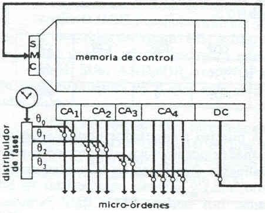 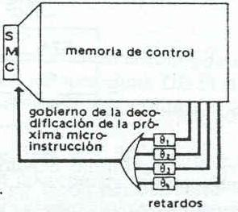

|  |  |
|----|----|
| Fig. Microprogramación horizontal y ritmo fijo | Fig. Ritmo variable definido por la microinstrucción |

### 

### Ejemplo de máquina microprogramada

Para este ejemplo hacemos la hipótesis de que se trata de microinstrucciones codificadas por campos con secuenciamiento explícito. Descripción general. Consideremos una ruta de datos formada por un conjunto de registros enlazados por 3 buses una unidad aritmético-lógica. Los buses A y B transfieren los operandos de los registros a la unidad aritmética-lógica, mientras que el bus C permite enviar el resultados a los registros.


Fig. Ruta de datos de una máquina microprogramada

Una microinstrucción que defina una operación entre registros, puede escribirse sobre cuatro campos: CFA, para designar el registro fuente sobre el bus A, CFB, para el registro fuente sobre el bus B, COP, para el código de operación, CRC, para el registro resultado sobre el bus C.

|  |  |  |  |
|----|----|----|----|
| CFA | CFB | COP | CRC |
| Registro fuente bus A | Registro fuente bus B | Código de operación | Registro resultad |

Por ejemplo, la microinstrucción:

|     |     |     |     |
|-----|-----|-----|-----|
| CFA | CFB | COP | CRC |
| Ri  | Rj  | SUS | Rk  |

Ejecuta: (Ri) –(Rj) → Rk

Mientras la microinstrucción:

|     |     |     |     |
|-----|-----|-----|-----|
| CFA | CFB | COP | CRC |
| Ri  | \-  | NOP | Rj  |

Copia el contenido de Ri en Rj.

A fin de permitir una posibilidad de direccionamiento inmediato, se agrega un quinto campo CIN para albergar al operando inmediato. Uno de los campos CFA o CFB reenvía al nuevo campo cuando resulta activado un indicador. Por ejemplo:

|     |     |     |     |     |
|-----|-----|-----|-----|-----|
| CFA | CFB | COP | CRC | CIN |
| Ri  | CIN | SUS | Ri  | 1   |

Restará 1 de Ri: (Ri) – 1 → Ri

Para utilizar la memoria se agrega otro campo, CM. Así las microinstrucciones 1 y 2 efectuarán respectivamente una lectura en Ri y una escritura de Ri, siendo direccionada la memoria por intermedio del registro S.

|     |     |     |     |     |     |     |
|-----|-----|-----|-----|-----|-----|-----|
|     | CFA | CFB | COP | CRC | CIN | CM  |
| 1   | 0   | 0   | NOP | Ri  | 0   | LEC |
| 2   | Ri  | 0   | NOP | 0   | 0   | ESC |

Por último añadiremos unos biestables de estado, los que deberán poder ser posicionados por las microinstrucciones, por ejemplo en función de condiciones eventualmente satisfechas en la ALU y servirán para realizar las bifurcaciones pertinentes en el microprograma. Los campos CD y CMP permiten definir la dirección de la siguiente microinstrucción. El campo CD contiene los n-1 bits fuertes de esta dirección y CMP, según el valor de un indicador, bien inmediatamente el bit de menor peso de la dirección, bien la dirección de biestable de estado que contienen dicho bit. Por eso, la microinstrucción por efectuar después de esta:

|     |     |     |     |     |     |     |     |
|-----|-----|-----|-----|-----|-----|-----|-----|
| CFA | CFB | COP | CRC | CIN | CM  | CD  | CMP |
|     |     |     |     |     |     | m   | BEi |

Se encontrará en la dirección: 2m si (BEi) = 0, y 2m + 1 si (BEi) = 1.

Un último campo CSBE permitirá posicionar los biestables de estado. Suponemos a modo de ejemplo, que Ri actúe de registro de índice, cada vez que se llegue al final de bucle de microprograma, Ri será decrementado en 1. Si el resultado de decrementar fuera 0 (indicador de cero CE de la ALU igual a cero), se cargará un biestable Bej, que permitirá operar el salto a la siguiente instrucción:

<table>
<tbody>
<tr>
<td>dirección</td>
<td>CFA</td>
<td>CFB</td>
<td>COP</td>
<td>CRC</td>
<td>CIN</td>
<td>CM</td>
<td>CD</td>
<td>CMP</td>
<td>CSBE</td>
</tr>
<tr>
<td>2m-2</td>
<td>Ri</td>
<td>CIN</td>
<td>SUS</td>
<td>Ri</td>
<td>1</td>
<td>NOP</td>
<td>m-1</td>
<td>1</td>
<td>(CE=0) 1→BEJ</td>
</tr>
<tr>
<td>2m-1</td>
<td>0</td>
<td>0</td>
<td>NOP</td>
<td>0</td>
<td>0</td>
<td>NOP</td>
<td>m</td>
<td>Bej</td>
<td>-</td>
</tr>
<tr>
<td>2m</td>
<td>0</td>
<td>0</td>
<td>NOP</td>
<td>0</td>
<td>0</td>
<td>NOP</td>
<td colspan="3">direcc. de principio de bucle</td>
</tr>
<tr>
<td>2m+1</td>
<td colspan="9">Primera instrucción después del bucle</td>
</tr>
</tbody>
</table>

La ruta de datos de microabacus, controlada por las microinstrucciones cuya estructura acaba de ser definida, comprende esencialmente:

- Una memoria central dividida en octetos, direccionada por el registro S, cuyos últimos 8 bits pueden ser cargados desde la ALU o enviados sobre el bus A.
- Una memoria local (lectura y escritura) con los seudos-registros de varios octetos para operaciones en múltiple longitud y en coma flotante. Esta memoria, dividida en octetos, es direccionada por el registro SMR.
- 3 registros de 8 bits, actuando A y B de acumulador y de multiplicador-cociente respectivamente y X de índice.
- 2 biestables de estado BE1 y BE2.
- Una ALU que opera sobre informaciones de un octeto, SUM, SUS, ANDO, OR, etc (NOP significa no operación). DE es el indicador de desbordamiento y CE, que vale cero si el resultado de la última operación ha sido nulo.


