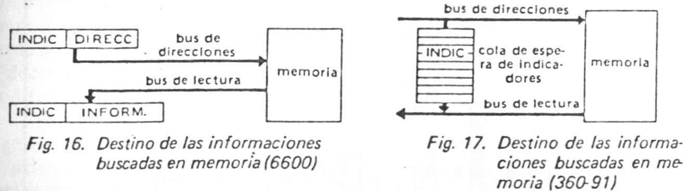
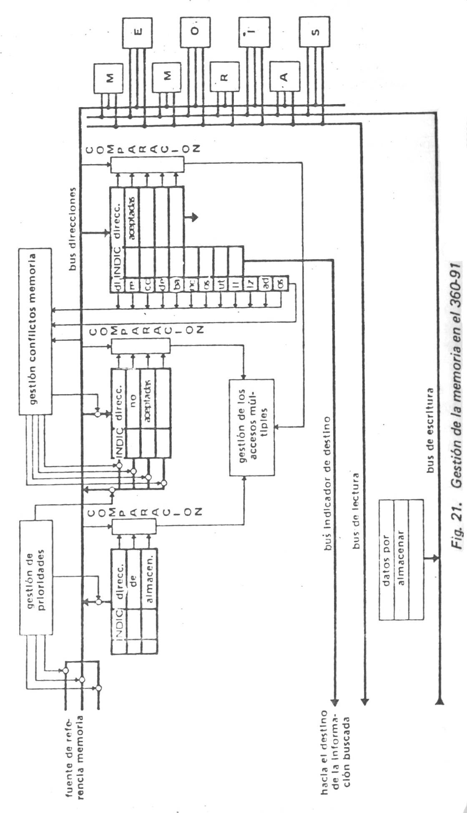
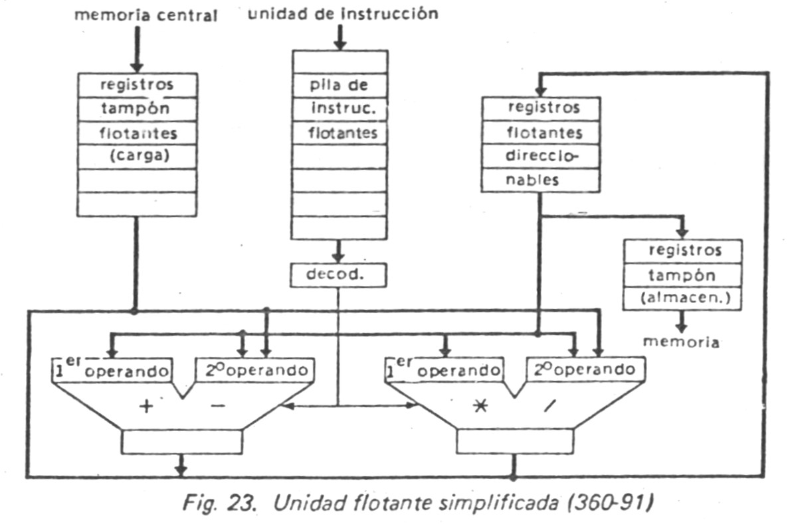
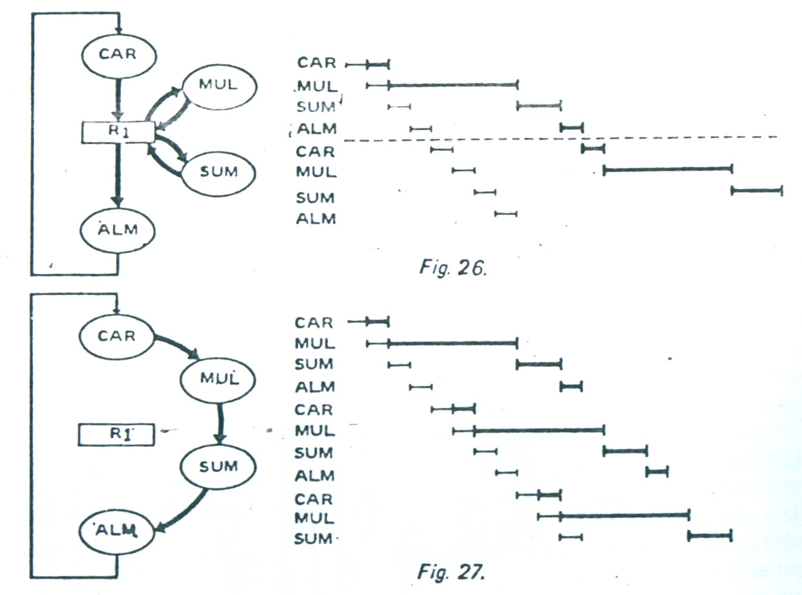
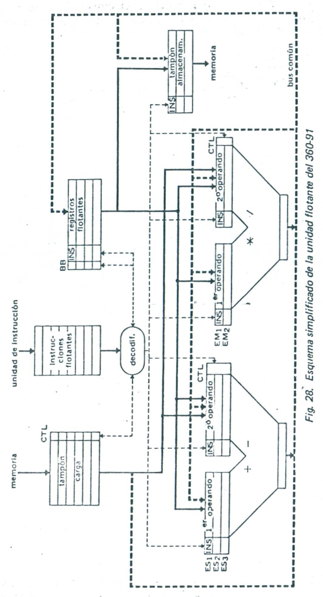

# Arquitectura Pipeline

## Contenido

- [Operadores Pipe-Line y Operadores Paralelos](#operadores-pipe-line-y-operadores-paralelos)
- [Estructura Pipe-Line del Operador de Suma Flotante](#estructura-pipe-line-del-operador-de-suma-flotante)
- [Organización Seudo-Pipe-Line de la Memoria Central](#organización-seudo-pipe-line-de-la-memoria-central)
- [Las Máquinas Pipe-Line](#las-máquinas-pipe-line)
- [Problemas del Paralelismo en los Computadores Pipe-Line](#problemas-del-paralelismo-en-los-computadores-pipe-line)
- [Descripción General de un Ordenador Pipe-Line](#descripción-general-de-un-ordenador-pipe-line)
- [Gestión de la Pila de Instrucciones](#gestión-de-la-pila-de-instrucciones)
- [Dispositivos Básicos del Algoritmo de Tomasulo](#dispositivos-básicos-del-algoritmo-de-tomasulo)
- [Descripción del Algoritmo de Tomasulo](#descripción-del-algoritmo-de-tomasulo)
- [El Futuro de la Arquitectura Pipe-Line](#el-futuro-de-la-arquitectura-pipe-line)

Diremos que una unidad es del tipo *pipe-line* cuando le podemos exigir que se encargue de una nueva operación cada *θ* nanosegundos, mientras que, de hecho, cada operación dura n *θ* nanosegundos. Por lo tanto, en el plano de los rendimientos globales, las cosas suceden como si la unidad ejecutase una operación cada *θ* nanosegundos.

## Operadores Pipe-Line y Operadores Paralelos

Existen dos formas de realizar un operador, respondiendo a la figura anterior. Una primera solución consiste en utilizar varios operadores idénticos que trabajan en paralelo.

Es así como el esquema de la figura 2 corresponde, gracias a sus cuatro operadores en paralelo, al diagrama de tiempos de la figura 1. Al batido *θ*1, la operación 1 es desencadenada sobre el operador 1, al batido *θ*2 la operación 2 sobre el operador 2 …, al batido *θ*5, se recupera el resultado de la operación 1 a la salida del operador 1, que queda libre para lanzar la operación 5 …, etc. Designaremos esta estructura bajo el nombre de *estructura paralela*, y dado que responde al esquema de la figura 1, usaremos igualmente los términos de *estructura seudo-pipe-line*.

Una segunda opción consiste en utilizar un solo operador dividido en varias secciones, cada una correspondiente a una etapa de la operación por ejecutar. Se separan las secciones por conjunto de registros capaces de memorizar, de cara a la siguiente sección, los resultados obtenidos en la anterior. El tiempo de transición por una sección es igual al intervalo entre dos batidos de reloj:

La figura 3 es la representación típica de un operador pipe-line. Al batido *θ*1, se inicializa la operación 1 en la sección 1, al batido *θ*2 se sigue la operación 1 en la sección 2, mientras que la sección 1 queda libre para ocuparse de la operación 2, y así sucesivamente…. Así resulta que, entre los batidos *θ*4 y *θ*5, las operaciones 1, 2, 3 y 4 estarán en curso de realización en las secciones 4, 3, 2 y 1. Esto es, las operaciones se empujan unas a otras de sección en sección, a semejanza del correr de un fluido en una tubería (pipe-line); de ahí el nombre asignado a este tipo de operador.

## Estructura Pipe-Line del Operador de Suma Flotante

Puede concebirse este operador en cuatro secciones:

La primera resta los exponentes y entrega a la segunda sección (1) los dos operadores antes del desplazamiento; (2) el mayor exponente; (3) la diferencia de los dos exponentes, cuyo signo indica a qué mantisa hay que desplazar una posición a la derecha y cuyo valor absoluto define el número de desplazamientos elementales.

La segunda sección ejecuta el desplazamiento pedido y proporciona a la tercera: (1) el exponente común a los dos operandos y (2) las dos mantisas alineadas.

La tercera sección realiza la operación de suma de los operandos y da a la cuarta: (1) el exponente de la suma y (2) la suma de las mantisas.

La cuarta normaliza el resultado así obtenido.

La suma de las mantisas, que es probablemente la operación más larga, puede hacerse en pipe-line empleando en el sumador técnicas anticipativas. (Ej: técnicas “by-pass” elaboradas). Esto añadiría nuevas secciones al operador completo.

## Organización Seudo-Pipe-Line de la Memoria Central

No se trata de realizar una memoria con estructura estrictamente pipe-line, en cambio, puede organizarse de suerte que, vista desde afuera se comporte como tal. Lo que quiere decir que, bajo ciertas hipótesis, puede inicializarse un ciclo de memoria a cada batido de reloj (*θ*), cuando en realidad el ciclo dura *n* batidos (*n* es, en general, del orden de 10). La idea consiste en dividir la memoria en bloques físicos independientes, llamados *bancos*. Se escoge un número de bancos superior a *n* (corrientemente 16 o 32).

Después de haber sido referenciado, cada banco queda indisponible, durante todo el ciclo de memoria, a saber *nθ*. Por consiguiente cualquier nueva referencia a este mismo banco deberá ser puesta en espera hasta que éste se libere. Sin embargo, la memoria aceptará una nueva petición a cada batido *θ*, en la medida que se refiera a un bloque libre.

Así, bajo la hipótesis de que el número de bancos sea superior al de batidos por ciclo de memoria, y de que las referencias sucesivas sean seleccionadas de manera a evitar conflictos de acceso a un mismo banco, la memoria se comporta, vista desde afuera, como un operador pipe-line capaz de lanzar una nueva operación a cada batido de reloj.

En el plano de direccionamiento, la memoria está organizada lógicamente de forma que las direcciones sucesivas se encuentren en bancos sucesivos, lo que equivale a utilizar los pesos inferiores de la dirección como número de banco, y los pesos superiores para determinar la posición dentro del banco. En tales condiciones, se comporta la memoria como un operador pipe-line cada vez que se direccionan células consecutivas de memoria (Entrada o salida de un vector, búsqueda de las sucesivas instrucciones de un programa, etc.)

## Las Máquinas Pipe-Line

El concepto de máquina pipe-line es una generalización, al nivel del conjunto de la computadora, del de operador pipe-line. En realidad, las máquinas que actualmente apellidamos pipe-line se alejan relativamente de este principio por varias razones:

1)  No puede definirse un solo flujo de informaciones susceptibles de atravesar continuamente el ordenador. Es preciso tener en cuenta el flujo de las instrucciones y de los operandos, que deben frecuentemente esperarse uno al otro.
2)  La existencia de operadores aritméticos específicos implica que los flujos de informaciones se subdividen a lo largo de su transición por la máquina, en función del tipo de operación pedido.
3)  Los operadores no son todos estrictamente pipe-line. Tal es el caso de la memoria central que no se comporta de forma pipe-line más que si las informaciones sucesivamente referenciadas han sido previamente almacenadas en bloques distintos. De no ser así, se producen esperas.
4)  Las operaciones sucesivas no siempre son independientes, pues el resultado de una operación puede ser operando para la siguiente operación, la cual, por consiguiente, deberá esperar a que haya concluido la primera antes de iniciar su ejecución.

La técnica de solapamiento de las instrucciones era un primer paso por la vía de los computadores pipe-line. A cada ciclo de memoria podía inicializarse una nueva instrucción, siempre que no hubiera conflictos de acceso, cuando realmente la instrucción duraba dos ciclos.

Dentro de las actuales máquinas pipe-line distinguiremos dos niveles de ciclos: el ciclo de máquina o *ciclo menor*, que corresponde al *θ* de reloj de los operadores pipe-line, y el ciclo de memoria, a veces denominado *ciclo mayor*. A cada ciclo menor debería poder inicializarse una instrucción. En realidad, debemos consignar esta condición como un límite ideal por razón de todos los incidentes de recorrido que alteran el funcionamiento pipe-line.

## Problemas del Paralelismo en los Computadores Pipe-Line

Una instrucción comprende un buen número de ciclos menores, lo que implica que, simultáneamente, varias instrucciones se encuentran en el ordenador en diferentes estados de ejecución. Este tipo de paralelismo exige una división de la máquina en unidades funcionales, cada una responsable de una o varias etapas del desarrollo de uno o varios tipos de instrucciones. Las unidades intercambian informaciones entre sí, pero poseen controles independientes. Por ejemplo, la unidad de instrucción, al detectar una operación flotante, cederá el control a la unidad flotante dándole todas las informaciones necesarias.

La propia unidad flotante, al decodificar una información de multiplicación, traspasará su tratamiento al operador especializado suministrándole todas las informaciones necesarias, en particular el punto de destino del resultado, etc. Se observa el carácter pipe-line de este esquema, aunque con una complicación: el flujo de informaciones procedente de la primera unidad se va ramificando a medida que atraviesa diferentes unidades. El funcionamiento de una máquina así organizada no deja de plantear un cierto número de problemas, que podemos clasificar en dos categorías: el control y la bifurcación del flujo de informaciones, por un lado, la detección y la regulación de los conflictos de paralelismo, por otro.

- **Control del flujo de informaciones**: Se realiza asociando a cada información transferida de una unidad a otra un indicador, especificando la operación por efectuar sobre dicha información, y designando su destino posterior. Por ejemplo se referenciará la memoria central suministrándole, no solamente la dirección, sino también un indicador asociado especificando el tipo de operación (lectura, escritura) y, si se tratase de una lectura, el destino de la información leída. A la salida de una unidad, un dispositivo especial decodifica los indicadores y crea las ramificaciones a otras unidades. En ciertos casos, el destino depende del estado de las diferentes unidades receptoras: en tal circunstancia, la bifurcación se establecerá en las mismas unidades receptoras por comparación asociativa del indicador asociado a la información con los indicadores asociados a las posibles unidades destinatarias.
- **Conflictos del paralelismo:** El paralelismo en las máquinas pipe-line está restringido por causa de dos categorías de conflicto, los *conflictos de acceso* a una misma unidad, los *conflictos de dependencia* (o de precedencia) de las instrucciones entre sí. Los primeros se deben a la organización de la máquina, ya que no todos sus elementos son perfectamente pipe-line y los segundos están relacionados con la estructura lógica de los programas, cuyas instrucciones están concebidas para encadenarse secuencialmente y no para ejecutarse simultáneamente.

1)  **Conflictos de acceso:** Se encuentran de dos tipos:

    1)  *Acceso a una unidad no pipe-line* que se halla ocupada por una demanda anterior (por ejemplo, dos accesos sucesivos a un mismo banco de memoria). Esta impone un estado de espera a la unidad precedente, lo que puede provocar un bloqueo de las siguientes operaciones, a menos que se intercale entre ambas unidades una *cola de espera* de las informaciones en tránsito.
    2)  *Demandas simultáneas de acceso*. Habida cuenta del carácter pipe-line del ordenador, una simultaneidad en las peticiones de acceso implica que varias unidades pueden acceder a una unidad común (por ejemplo, acceso a la memoria central desde la unidad de búsqueda de instrucción, desde la unidad de cálculo de direcciones, desde las unidades de entrada-salida). Será preciso, entonces, disponer, además de posibles colas de espera, de dispositivos de gestión de prioridades.

2)  **Conflictos de dependencia:** Un computador pipe-line es capaz de ejecutar simultáneamente varias instrucciones, incluso invertir su secuencia normal de ejecución, a condición de respetar el encadenamiento lógico del programa. Para conseguirlo, tendrá que detectar las dependencias entre instrucciones sucesivas y tenerlas en cuenta.

Un primer caso de dependencia se da en el salto condicional: mientras no se ha comprobado su condición no es posible saber cuál será la próxima instrucción. Dejando aparte este caso tan peculiar, se dirá que existe dependencia entre dos instrucciones, cuando ambas se refieran al mismo registro o a la misma palabra de memoria, si al menos una de estas referencias implica una alteración del registro o de la palabra de memoria.

Distinguiremos tres casos:

3)  1)  *Dependencia total*: la primera instrucción debe estar completamente ejecutada antes de ejecutar la segunda.

Ejemplo:

DIV R1 R2 (R1)/(R2)  R1

MUL R3 R1 (R3)x(R1)  R2

4)  1)  *Dependencia parcial*: la primera instrucción debe haber sido lanzada antes de almacenar el resultado de la segunda.

Ejemplo:

DIV R1 R2 (R1)/(R2)  R1

SUM R2 R3 (R2)+(R3)  R2

5)  1)  *Falsa la dependencia*: dos trozos de programas son falsamente dependientes, cuando no son dependientes más que por la utilización de común de un registro de trabajo.

Ejemplos:

CAR R1 M1 (M1)R1

DIV R1 R3 (R1)/(R3)R1

ALM R1 M1 (R1)M1

CAR R1 M2 (M2)R1

DIV R1 R3 (R1)/(R3)R1

ALM R1 M2 (R1)M2

Obsérvese que, si se hubiera sustituido R1 por R2 en uno o en otro grupo de las tres instrucciones, ambos grupos podrían haberse ejecutado simultáneamente (dejando aparte posibles conflictos de acceso). No existe dependencia más que en virtud del uso del mismo registro de trabajo R1.

En resumen, una máquina pipe-line tiene que detectar necesariamente todos los casos de dependencia y efectuar los oportunos bloqueos: bloqueos de las informaciones no actualizadas, con los que las instrucciones correspondientes a dichas informaciones deberán esperar el desbloqueo, y bloqueo de las propias instrucciones que no podrán sobrepasar determinados estadios de su ejecución mientras no se haya levantado aquél.

Además, puede esperarse que, tras haber detectado un conflicto de dependencia y efectuado los necesarios bloqueos, la máquina continúe decodificando y ejecutando las instrucciones posteriores a los casos de dependencia sin esperar a que sean resueltos, y encuentre una solución para no detenerse en los casos de falsa dependencia.

**Resumen acerca de las dificultades del Paralelismo en las Máquinas Pipe-Line**

<table>
<tbody>
<tr>
<td>DIFICULTADES</td>
<td>SOLUCIONES GENERALES</td>
</tr>
<tr>
<td>Control del flujo de informaciones</td>
<td>Indicadores asociados a las informaciones transferidas, para describir los tratamientos previstos y designar su destino posterior.</td>
</tr>
<tr>
<td>Problemas de bifurcación</td>
<td>Bien: dispositivos para decodificar los indicadores y ramificar las informaciones hacia su destino; bien: bus para distribuir las informaciones a todos los destinatarios posibles, que se reconozcan mediante comprobación del indicador.</td>
</tr>
<tr>
<td>
Conflictos de acceso

Bien: espera ante un operador ocupado

Bien: demandas simultaneas de acceso a un mismo operador
</td>
<td>
Puesta en cola de espera, o riesgo de bloqueo del operador precedente

Puesta en cola de espera y gestión de prioridades.
</td>
</tr>
<tr>
<td>
Conflictos de dependencia

Ejecución secuencial (y no por solapamiento) de las instrucciones dependientes entre sí.
</td>
<td>Detección de las dependencias y bloqueos sobre las propias instrucciones, o los operandos no actualizados.</td>
</tr>
</tbody>
</table>

## Descripción General de un Ordenador Pipe-Line

A continuación se describe de manera más concisa el funcionamiento de una máquina pipe-line. Nuestro modelo, Super-Superabacus, está muy inspirado en el IBM 360-91. Se ha preferido éste frente al CDC 6600 porque esta última comparte también los principios de la arquitectura de operadores paralelos.

Muy esquemáticamente, nuestro ordenador está dividido en cuatro grandes unidades:

1)  *La memoria central*, entrelazada sobre un número de bancos congruente con el número de ciclos menores por ciclo de memoria y con el dispositivo que controla los accesos a esta memoria.

2)  *La Unidad de instrucción*, que comporta una cola de espera para las instrucciones provenientes de la memoria, los registros de direccionamiento, una unidad de cálculo de dirección, una unidad de premodificación de las instrucciones y una unidad de decodificación y de ejecución de las instrucciones de organización de programa.

3)  y (4) *Una unidad para operaciones aritméticas fijas* y otra para la *aritmética flotante* que, por simplificar, hemos incorporado al mismo modelo. Una unidad flotante que, bajo tal forma, comprende una cola de espera de las instrucciones flotantes y el decodificador asociado, registros de espera para los operandos flotantes provenientes de la memoria, los registros aritméticos flotantes y los operandos flotantes todos del tipo pipe-line.

A modo de ejemplo, vamos a considerar una instrucción de multiplicación flotante. Se descompone en varias etapas:

La dirección de la instrucción se genera en la unidad de instrucción (contador de inicialización de instrucciones). Después de un acceso a memoria, la instrucción buscada se almacena en la pila en donde se desplazará eventualmente hasta que sea transferida al predecodificador.

Éste detectará, por un lado, que se trata de una instrucción flotante y gobernará su transferencia hacia la unidad flotante, por otro lado que el operando se encuentra en memoria y enviará la parte de dirección a la unidad de cálculo de dirección que, tras obtener la dirección efectiva, pedirá un acceso a memoria. Durante el acceso a memoria la unidad flotante decodificará la instrucción y preparará al operador de multiplicación para ejecutar la operación, bloqueándola en tanto el operando extraído de la memoria no le haya sido efectivamente transferido.

En lo que concierne al aspecto pipe-line de la ejecución de las instrucciones sucesivas, anotaremos que es necesario:

\(1\) que las instrucciones sean decodificadas ordenadamente en la unidad de instrucción; (2) que las direcciones sean calculadas ordenadamente en la unidad de cálculo de dirección y enviadas en ese orden a la unidad de control de memoria, que se encargará de evitar invertir las secuencia de las operaciones de lectura y de escritura relacionadas con la misma dirección; (3) que las instrucciones sean ordenadamente decodificadas en cada unidad aritmética.

En cambio, veremos que el orden del programa no tiene forzosamente que ser respetado: (1) entre las decodificaciones de instrucciones en dos unidades aritméticas diferentes; (2) entre las inicializaciones de ejecución efectiva de las operaciones dentro de una misma unidad aritmética, en la medida que no se hayan detectado condiciones de dependencia.

Gestión de la Memoria Central

Supondremos que disponemos de una memoria central entrelazada sobre un número de bancos netamente superior al cociente ciclo memoria/ciclo menor. Comprende tres buses de acceso: un bus para las direcciones, un bus de lectura y un bus de escritura. Por cada ciclo menor puede solicitarse una nueva referencia a memoria. La dirección correspondiente es enviada simultáneamente a todos los bancos de memoria por intermedio del bus de direcciones. El banco que se reconozca lanzará un ciclo de memoria – excepto si hubiera un conflicto de acceso. El acceso a memoria plantea numerosos problemas: la bifurcación de las informaciones leídas en la memoria; la gestión de los conflictos de acceso (conflictos al nivel de un banco o al nivel del conjunto de la memoria); la gestión de los conflictos de dependencia.

**Bifurcación de las informaciones leídas en la memoria:** el problema reside en dirigir toda la información leída en memoria hacia su unidad de destino. A este fin, se asocia con cada dirección un indicador que designe la unidad destinataria. El problema planteado puede considerarse prácticamente resuelto si se es capaz de asociar el indicador adecuado a toda la información irrumpiendo en el bus de lectura proveniente de la memoria.

Una primera solución (inspirada en el 6600) consiste en enviar el indicador al banco al tiempo que la dirección. Éste lo memoriza durante el tiempo de acceso y lo restituye, con la información leída, sobre el bus de lectura.

Segunda solución (360-91): los indicadores están insertos en una cola de espera, cuyos elementos descienden un peldaño por cada ciclo menor. La duración del recorrido es igual al tiempo de acceso a memoria, de suerte que el retorno de la información procedente de la memoria esté sincronizado con la salida fuera de la cola del indicador asociado.

**Gestión de los conflictos de acceso al nivel de los bancos de memoria:** Es preciso conservar, al nivel del controlador de memoria, las direcciones de las referencias que, aunque aceptadas por el dispositivo de gestión de prioridades, no hayan podido ser atendidas por encontrarse ocupado el banco direccionado.

El CDC 6600 resuelve este problema con una cola de espera. Toda referencia enviada mediante el bus de direcciones resulta simultáneamente introducida en un conjunto de registros donde recircula durante un cierto tiempo, calculado para estar en sincronismo con el retorno de una señal, emitida por el banco de memoria direccionado indicativa de si éste ha aceptado la demanda o se encuentra ocupado. En este último caso, se introduce nuevamente la dirección en el bus con vistas a otro intento.

En el 360-91 no se envían sobre el bus de direcciones más que las referencias que serán aceptadas. El resto se almacena en un conjunto de registros tampón y se presentarán sobre el bus en el momento que el banco direccionado quede libre. Para detectar si una dirección puede ser aceptada, se necesita disponer de una tabla de las direcciones de bancos ocupados que pueda ser comprobada por vía asociativa en cada ciclo menor.

Parece entonces normal asociar a la cola de espera de los indicadores las direcciones de los correspondientes bancos ocupados. De hecho, la cola de estas direcciones de banco será más larga que la de los indicadores, puesto que debe ser recorrido durante un ciclo completo de memoria (y no durante el tiempo de acceso solamente).

**Gestión de las prioridades de acceso a la memoria:** La unidad de acceso a memoria recibe demandas procedentes: (1) de la unidad de instrucción, que pide lecturas de instrucción; (2) de la unidad de cálculo de dirección, para las lecturas o escrituras de operandos; (3) de los canales; además, no pueden olvidarse aquellas que vienen de la cola de las demandas de referencia a memoria enfrentadas a conflictos tales como el de banco ocupado y, en el 360-91, de una cola de las direcciones de almacenamiento de operando.

Aparte de las entradas-salidas, que son de mayor prioridad, las prioridades de los diferentes accesos dependen del estado de los conflictos de acceso precedentemente encontrados, para hacer prioritariamente a las demandas que se han visto diferidas, y del estado de la pila de instrucción, que es prioritaria frente a las demandas de operandos cuando esté incompletamente rellena.

**Gestión de los problemas de dependencia:** se corre el riesgo de encontrarse ante un problema de dependencia si a una petición de escritura le sigue una de lectura en la misma dirección o viceversa. El orden de estas operaciones no puede garantizarse sin precauciones especiales cuando el banco direccionado estuviera ocupado a la aparición de la primera demanda. En efecto, la segunda puede hallar libre al banco, mientras la primera se encuentra circulando en la cola. En el 6600, tal problema se solventa por el procedimiento de prohibir la introducción de una referencia de lectura (respectivamente, escritura) proveniente de la unidad central, si ya existe una referencia de escritura (respectivamente, lectura) recirculando.

**Gestión de los accesos múltiples:** en el ordenador 360-91 se dispone de una gestión mucho mas afinada de los accesos múltiples a una misma dirección de memoria. Las dificultades se resuelven por comparación asociativa, a cada ciclo menor, de la nueva dirección que se presenta, con todas las direcciones comprendidas en tres juegos de registros: colas de esperas de las direcciones de almacenamiento, registros tampón con direcciones no aceptadas, colas de espera con las direcciones aceptadas. Fig 21

Esto permite: (1) descubrir problemas de dependencia y, por tanto, evitar modificar es secuenciamiento lógico de las instrucciones; (2) descubrir las demandas de lecturas concernientes a una misma dirección, que podrán ser atendidas entonces en un solo ciclo de memoria; (3) suministrar, sin necesidad de acceso a memoria, la información buscada cuando una operación sigue muy de cerca a otra escritura concerniente a la misma dirección.

## Gestión de la Pila de Instrucciones

**La unidad de instrucción:** esta unidad

- - Inicializa las instrucciones, enviando sus direcciones y los indicadores correspondientes hacia la memoria.
  - Gestiona el avance de la pila de las instrucciones provenientes de la memoria.
  - Ejecuta las predecodificaciones de las instrucciones y bifurca las instrucciones aritméticas hacia las unidades correspondientes (fijas o flotantes), después de haberlas dotado de los indicadores necesarios, sustituyendo, en particular, la dirección en memoria por el número del registro tampón hacia el que será encaminado el operando.
  - Calcula las direcciones de operandos y los envía al controlador de memoria asociándoles los indicadores necesarios para designar, además del tipo de ciclo de memoria a ejecutar, el registro tampón destinatario en la unidad aritmética adecuada a la clase de operando.
  - Decodifica y ejecuta las instrucciones de organización de los programas y de modificación de estado de máquina.

Estados de funcionamiento de la pila de instrucciones:

La pila tiene tres estados de funcionamiento: inicialización, funcionamiento normal, discontinuidad. La etapa de inicialización existe en el arranque de la máquina e inmediatamente después de ciertas discontinuidades. Estas se deben esencialmente a las instrucciones de salto y a las interrupciones, pero también a algunas instrucciones de almacenamiento (cuando afectan a una información de la pila).

- **Inicialización de la pila:** al principio, se toma la pila como vacía. Las instrucciones extraídas de la memoria la llenan, empujándose unas a otras. Las búsquedas de instrucciones son prioritarias respecto de las búsquedas de operandos en tanto la pila esté incompleta. Si el decodificador estuviera en estado de espera puede, durante la inicialización, trasmitírsele las instrucciones de cualquier lugar de la pila.

- **Funcionamiento normal de la pila:** en funcionamiento normal, la instrucción en curso de predecodificación ocupa siempre la misma posición de la pila, que desciende un peldaño cada vez que se pasa a la decodificación de la siguiente palabra. Se escoge la posición del registro que contiene las instrucciones en curso de predecodificación de tal manera que pueda cargarse adelantadamente con un número suficiente de instrucciones para ahorrar al predecodificador toda espera. La pila se gestiona por medio de tres registros: (1) la dirección en memoria de la palabra almacenada en el primer registro de la pila; (2) la dirección en memoria de la palabra en curso de decodificación; (3) la dirección en memoria de la palabra almacenada en el último registro de la pila. Funcionando normalmente los tres registros se incrementan en 1 cada vez que la pila desciende un peldaño.

- **Discontinuidades en el funcionamiento de la pila:** aparte de las interrupciones se distinguen cuatro casos de discontinuidades:

1)  *Almacenamiento en una dirección de memoria cuyo contenido está cargado en la pila*. Este es un caso muy particular de conflicto de paralelismo: hemos copiado en la pila una porción de memoria. Tal copia no es válida más que en la medida que el contenido de dicha porción de memoria no sufra alteración, es decir, más que si la instrucción en curso no altera las instrucciones cargadas en pila.
2)  *Salto incondicional*. A menos que el salto incondicional se produzca sobre una instrucción cargada en la pila, esta debe ser reinicializada.
3)  *Salto condicional*. Mientras no se haya comprobado la condición, no es posible saber si el salto se producirá o no. En la espera, es preciso apostar. Se apuesta a que la condición no será satisfecha, esto es, que no habrá salto. Se continúa decodificando las instrucciones siguientes, marcándolas. A fin de diferir su ejecución se pone el ordenador en modo condicional: se preparan las instrucciones, se lanzan las búsquedas de operandos, pero la ejecución efectiva es bloqueada. Preparando así el cambio ante la hipótesis “condición no satisfecha”, se prepara simultáneamente la hipótesis “condición satisfecha” llevando a una pila aneja las instrucciones almacenadas en memoria a partir de la dirección de salto. Cuando se comprueba la condición, cualquiera de estas dos hipótesis puede realizarse: (a) no satisfecha: el ordenador pasa del modo condicional al modo normal y las instrucciones ya preparadas se ejecutan. (b) satisfecha: se anulan las instrucciones preparadas bajo el régimen de modo condicional y se reinicializa la pila de instrucción a partir de la pila aneja.
4)  *Procesamiento de bucles de pequeña longitud*. Cuando hay salto hacia atrás de menos de *n* posiciones, siendo *n* la altura de la pila de instrucciones, se supone que es un bucle. Desplazase la pila de instrucciones hasta conseguir que contenga al bucle completo y se posiciona la unidad de instrucción en modo bucle, con lo cual la pila permanece estática mientras no se salga del bucle.

**Gestión de la Unidad Aritmética: el Algoritmo de Tomasulo**

El algoritmo de Tomasulo permite explotar de forma muy eficaz una unidad aritmética dotada de operadores aritméticos pipe-line. Lo describiremos inspirándonos en su aplicación a la unidad flotante del 360-91. Esta unidad comprende: (1) una cola de espera de instrucciones flotantes salidas de la unidad de instrucción; (2) registro de espera para los operandos provenientes de la memoria central; (3) una cola de espera de operandos por almacenar en memoria central; (4) los registros aritméticos flotantes direccionables; (5) los operadores pipe-line (uno para suma-sustracción, uno para multiplicación división). Puede ejecutar las tres clases siguientes de instrucciones:

1\) CAR R*i* M*j*

(M*j*)R*i*

Carga del registro R*i* desde la célula de memoria de dirección M*j* (es decir, desde un registro tampón de carga)

2\) ALM R*i* M*j*

(R*i*)M*j*

Almacenamiento del contenido del registro R*i* en la célula de memoria de dirección M*j* (es decir en un registro tampón de almacenamiento).

3\) SUM

SUS M*j*

MUL R*i* R*k*

DIV

 + M*j*

(R*i*) - R*i*

\*

/ R*k*

Operación aritmética con el contenido del registro R*i* y el contenido de la célula de memoria de dirección M*j* o el contenido del registro R*k*, quedando el resultado en R*i*. En este último caso, el registro Ri hará al tiempo las veces de origen u de destino. Llamaremos *primer operando* al operando correspondiente.

Una instrucción flotante puede verse bloqueada en tres hipótesis de conflicto: (1) el operador correspondiente no está libre; (2) el operando salido de la memoria no ha llegado aún a los registros-tampón; (3) uno de los registros de la operación se está utilizando como primer operando en una operación anterior aún no concluida.

Para abordar el algoritmo de Tomasulo adoptamos el esquema siguiente:

1)  *Puesta a punto de un método de detección de las dependencias y de los bloqueos que permitan ejecutar en secuencia las instrucciones dependientes (método llamado del bit de bloqueo).*
2)  Crítica del método del bit de bloqueo dentro del terreno de la eficacia. Será demasiado severa, ya que aquel destruye el aspecto pipe-line de la unidad aritmética incluso en circunstancias no impuestas por la dependencia.
3)  Descripción de los dispositivos y conceptos básicos del algoritmo de Tomasulo.
4)  Descripción, sobre un ejemplo, del algoritmo de Tomasulo.

**Método del bit de bloqueo:** permite detectar las dependencias y efectuar los bloqueos oportunos, con la finalidad de imponer la ejecución secuencial de las instrucciones dependientes. Consiste en bloquear el empleo de un registro aritmético cuando su contenido no es válido, es decir, durante la ejecución de toda instrucción que lo altere. Las próximas instrucciones que impliquen a este registro deberán por consiguiente, esperar su desbloqueo para ser ejecutadas. Con cada registro aritmético se asocia un bit de bloqueo BB, que se pone en 1 cuando el contenido de dicho registro es inválido.

**Crítica del método del bit de bloqueo:** Dado que el bit de bloqueo resuelve todos los casos de dependencia, esta crítica se refiere únicamente al problema de la eficacia y se concentra sobre tres puntos: las transferencias inútiles entre registros, la inhibición de la decodificación de las instrucciones y el bloqueo en el caso de las falsas dependencias. Vamos a resaltar estos puntos sobre un ejemplo muy sencillo. Consideremos las dos instrucciones:

MUL R1 R2 (R1) x (R2)  R1

SUM R1 R3 (R1) + (R3)  R1

Cuyo cronograma se da en la figura 24.

1)  *Transferencias inútiles entre registros:* se envía el resultado de la multiplicación al registro R1, después el contenido del registro R1 al sumador. Se habría ahorrado un ciclo menor transfiriendo simultáneamente el resultado hacia sus dos destinos, o lo que es lo mismo, realizar el esquema b en lugar del a de la figura 25.

2)  *Inhibición de la decodificación de instrucciones:* después de decodificar la suma, el decodificador se apercibe de que no puede lanzar dicha operación, ya que el registro R1 está bloqueado. Tampoco puede decodificar la próxima operación, pues perdería las informaciones para lanzar la suma cuando ésta sea posible. Por tanto, una dependencia inhibe el aspecto pipe-line de las siguientes instrucciones.

Puede paliarse tal inconveniente enviando las informaciones necesarias para el lanzamiento de la suma al sumador, quien irá por si mismo a buscar el operando en R1 después del desbloqueo de este registro. Esto libera al decodificador de cara a la siguiente instrucción. Pero el problema se transfiere al nivel de operadores aritméticos quienes, reservados para operaciones en espera, no pueden encargarse de las nuevas instrucciones.

3)  *Bloqueo en el caso de las falsas dependencias:* suponiendo solucionada la inhibición de la decodificación de las instrucciones tras un bloqueo por dependencia, aún quedaría el problema de las falsas dependencias. De él tenemos un ejemplo típico insertando nuestras dos instrucciones en un bucle (fig.26). Se observa que, por el hecho de utilizar el registro R1 como registro común de trabajo, las pasadas sucesivas por el bucle no se solapan. No ocurriría lo mismo si consiguiéramos no pasar por el registro R1, esto es si transmitiéramos directamente los resultados de operador a operador (fig 27)

## Dispositivos Básicos del Algoritmo de Tomasulo

1)  *El dígito de bloqueo, asociado con cada registro aritmético.(explicado antes)*
2)  *Las estaciones-tampón ante los operadores, para memorizar operaciones en espera por causa de conflicto de paralelismo.* evitan el aumento de los operadores aritméticos supuestos pipe-line.
3)  *El bus común, para enlazar los orígenes posibles de operandos previstos con todos sus posibles destinos.* Está alimentado por todas las unidades de las que se esperan resultados y alimenta a todo registro que pueda esperar un resultado.

4)  *Los indicadores, para controlar los movimientos de operandos sobre el bus común.* A cada unidad susceptible de ser origen de operando para el bus común se le asigna un número, que llamaremos la “*insignia*”. Se hacen asignaciones a: (1) registros-tampón provenientes de la memoria y (2) estaciones-tampón. Cada registro susceptible de ser alimentado por el bus común está prefijado. El *prefijo* posee un número suficiente de dígitos para contener una insignia- Así, son prefijados: (1) los registros flotantes, (2) cada uno de los registros de la estación-tampón y (3) los registros de la cola de espera de los almacenamientos. El bus común transportará, además del operando, la insignia que indica su origen.

## Descripción del Algoritmo de Tomasulo

Tomasulo resume así su algoritmo:

“El prefijo de un registro flotante identifica la última estación-tampón cuyo resultado le es destinado. Cuando una instrucción hace referencia a un registro que se halla bloqueado, es el contenido del prefijo del registro y no el contenido en sí de dicho registro quien está direccionado en la estación escogida. La estación compara continuamente el contenido de su prefijo con la insignia del bus común, que no es sino el número de la estación emisora.

Cuando se detecta una coincidencia, la estación receptora muestrea la información del bus común. Las unidades aritméticas comienzan la ejecución de una operación en cuanto que los dos operandos están presentes en una estación. Una estación puede recibir uno o los dos operandos, bien desde el bus común (si hay espera), bien directamente de los registros aritméticos o de los registros-tampón. Al decodificar una instrucción se transmiten los eventuales contenidos de los prefijos de los registros aritméticos a la estación-tampón escogida y se actualiza el prefijo del registro resultado.

Esta ronda de insignias permite secuenciar correctamente las instrucciones que implican al mismo registro resultado, mientras que el resto de instrucciones es tratado independientemente. Por último, el prefijo de un registro aritmético controla las modificaciones de este registro, de manera que únicamente la instrucción más reciente que comporte su modificación, supone un cambio efectivo de su contenido”. Observemos, en particular, que esta transmisión directa de los resultados de operador a operador, sin transitar por el registro teóricamente destinatario, permite el solapamiento de las instrucciones en el caso de las falsas dependencias. (fig 26 y 27)

## El Futuro de la Arquitectura Pipe-Line

Resulta difícil pronosticar cual será el provenir de los potentes computadores pipe-line. Recordemos que su concepción se sitúa en un punto de compromiso entre, por un lado, el incremento del aspecto pipe-line, lo que supone un aumento de la complejidad de los algoritmos de control, y, por otro lado, la reducción simultanea del ciclo menor y del precio de coste, lo que, a igualdad de tecnologías, se opone al aumento de complejidad. Las ideas cara al futuro parecen orientarse hacia una reducción del hardware de control, dejando en manos del software el control del aspecto pipe-line, actualmente muy costoso tanto en tiempo de ejecución como en cantidad de circuitos, es decir, en precio.

El ordenador prototípico STAR parece abrir una primera posible vía. El programador podría definir secuencias de operaciones idénticas, independientes entre sí y afectando a operandos almacenados bajo forma de vector en memoria entrelazada.

En tales secuencias gobernadas por una sola instrucción, la máquina sería transitada por un flujo de operandos completamente pipe-line, sin que sea necesario hacer intervenir ninguno de los complejos controles ya descritos anteriormente. Cuando no fuera así, la máquina funcionaría o en régimen secuencial normal, o en pipe-line restringido. Dicha máquina podría comportarse muy potentemente frente a problemas especializados, en que se presentasen con frecuencia tales secuencias de instrucciones idénticas e independientes.

Una segunda solución consistiría en conservar el tipo de ruta de datos y los algoritmos actuales, pero controlarlos por software, lo que, según ciertos autores, permitiría ganar un orden de magnitud en eficacia por un precio apenas superior al de un gran calculador tradicional. Con esto proponen, en definitiva, un tipo de máquina que no poseería ya un lenguaje de máquina tradicional sino más bien un lenguaje especializado pipe-line. Las instrucciones, codificadas por más de una centena de bits estarían divididas en campos concernientes a las diversas partes de la máquina.

Serían desencadenadas a razón de una instrucción por cada ciclo menor, y la decodificación de los diferentes campos definiría la tarea de cada unidad de la máquina durante este ciclo menor. El compilador debería evidentemente prever el desarrollo del programa objeto al nivel de los ciclos menores y optimizar el aspecto pipe-line tomando en cuenta tiempos de tránsito en las distintas unidades y conflictos de acceso o de dependencia.
